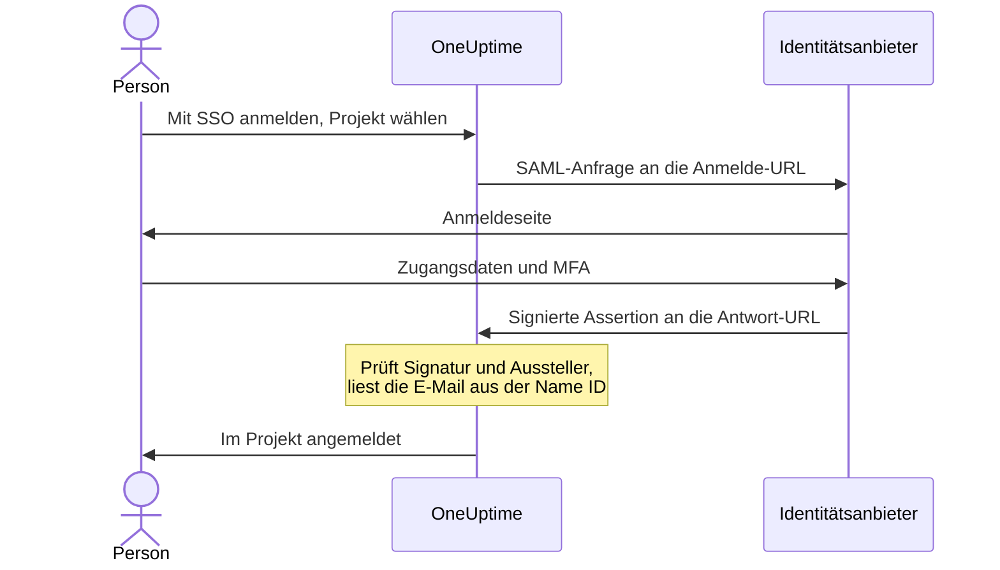

# SSO

Mit Single Sign-On (SSO) melden sich die Personen in Ihrem Projekt über den Identitätsanbieter (IdP) Ihrer Organisation bei OneUptime an, per SAML 2.0 oder OpenID Connect. Zugriff, Passwörter und Multi-Faktor-Authentifizierung verwalten Sie an einer Stelle, und Sie können SSO für alle im Projekt verlangen.

> [!NOTE]
> **Edition:** SSO, einschließlich "Require SSO for login", ist Teil jeder OneUptime-Edition: Selbst gehostete Installationen erhalten es in der Community Edition, ohne dass eine Lizenz nötig ist. Auf OneUptime Cloud ist es ab dem Plan **Scale** verfügbar. Was jede Edition enthält, sehen Sie unter [Enterprise Edition](/docs/self-hosted/enterprise).

:::cards
- [SAML-Anbieter einrichten](#sso-einrichten): In OneUptime anlegen und Ihrem IdP zwei URLs geben.
- [Anleitungen für Identitätsanbieter](#anleitungen-für-identitätsanbieter): Keycloak, Microsoft Entra ID und Okta, Schritt für Schritt.
- [OpenID Connect](#openid-connect-oidc): Stattdessen über eine OIDC-App anmelden.
- [SSO verlangen](#sso-für-ihr-projekt-verlangen): SSO zum einzigen Weg ins Projekt machen.
:::

## So funktioniert die SAML-Anmeldung

Ein SAML-Anbieter verbindet ein Projekt mit einer Anwendung in Ihrem Identitätsanbieter. Wer sich anmeldet, wählt das Projekt auf der OneUptime-Seite **Mit SSO anmelden**, meldet sich bei Ihrem IdP an und kommt angemeldet zurück.



OneUptime liest nur wenige Dinge aus der Assertion, die Ihr IdP sendet:

| Aus der Assertion | Was OneUptime damit macht |
| --- | --- |
| Signatur | Prüft sie gegen das **Öffentliches Zertifikat** des Anbieters. Die Antwort muss signiert und darf nicht verschlüsselt sein. |
| Issuer | Muss genau dem **Aussteller** des Anbieters entsprechen. |
| Name ID | Die E-Mail-Adresse der Person. Sie muss eine gültige E-Mail-Adresse sein. |
| `http://schemas.microsoft.com/identity/claims/displayname` | Der Name der Person, wenn OneUptime ihr Konto anlegt. Optional. |

Wer sich zum ersten Mal anmeldet, kommt in die **Teams** des Anbieters, und diese bestimmen, was die Person tun darf: siehe [Rollen und Teams für SSO-Benutzer](#rollen-und-teams-für-sso-benutzer).

> [!NOTE]
> Auf OneUptime Cloud meldet OneUptime jemanden, der sich zum ersten Mal mit einem SAML- oder OIDC-Anbieter des Projekts anmeldet, nicht sofort an, sondern schickt ihm einen Link per E-Mail. Die Person öffnet ihn, bestätigt, dass das Single Sign-On des Projekts sie anmelden darf, und setzt die Anmeldung fort. Der Link gilt 24 Stunden. Das geschieht einmal pro Projekt und erneut, wenn jemand das Projekt verlässt und zurückkommt. Selbst gehostete Installationen melden Personen sofort an.

## SSO einrichten

Sie brauchen die Berechtigung, SSO-Anbieter hinzuzufügen – **Project Owner**, **Project Admin** oder **Create Project SSO** – und auf OneUptime Cloud den Plan **Scale**. Für die Seite Ihres Identitätsanbieters siehe die [Anleitungen für Identitätsanbieter](#anleitungen-für-identitätsanbieter).

:::steps
1. **Projekteinstellungen öffnen**

   - Öffnen Sie Ihr OneUptime-Projekt
   - Gehen Sie zu **Projekteinstellungen** > **Sicherheit** > **SSO**

2. **SSO-Konfiguration erstellen**

   - Klicken Sie auf **SSO erstellen**
   - Geben Sie einen **Name** für die SSO-Konfiguration ein (z. B. "Keycloak SAML" oder "Okta SAML")
   - Geben Sie die **Anmelde-URL** Ihres Identitätsanbieters ein
   - Geben Sie den **Aussteller** (Entity ID) Ihres Identitätsanbieters ein
   - Fügen Sie das **Öffentliches Zertifikat** Ihres Identitätsanbieters ein
   - Im Schritt **Anmeldung** beginnt **Teams** mit dem Mitglieder-Team Ihres Projekts: Wer sich zum ersten Mal anmeldet, kommt in diese Teams. Angenommen werden nur Teams, in die Sie selbst jemanden einladen könnten: Ein Team, das mehr Zugriff gibt, als Sie haben, wird unter **Teams** genannt
   - Alles Weitere ist unter **Weitere Felder** ausgefüllt: die **Signaturmethode** (`RSA-SHA256`), die **Digest-Methode** (`SHA256`) und eine Beschreibung ("Sign in with" und der Name). Ändern Sie sie nur, wenn Ihr Identitätsanbieter es verlangt

3. **SSO-Metadaten von OneUptime holen**
   - Beim Speichern öffnet sich der Dialog **SSO-Konfiguration**. Mit der Schaltfläche **SSO-Konfiguration anzeigen** öffnen Sie ihn erneut
   - Kopieren Sie die **Kennung (Entity ID)**, etwa `https://oneuptime.com/<project-id>/<provider-id>` – Sie brauchen sie in der Konfiguration Ihres IdP
   - Kopieren Sie die **Antwort-URL (Assertion Consumer Service URL)**, etwa `https://oneuptime.com/identity/idp-login/<project-id>/<provider-id>` – Sie brauchen sie in der Konfiguration Ihres IdP
   - Ein neuer Anbieter ist zunächst ausgeschaltet. Sobald Ihr IdP diese beiden Werte hat, bearbeiten Sie den Anbieter und schalten **Aktiviert** ein

4. **Den Anbieter testen**
   - Öffnen Sie den Link in der Karte **Single Sign-On (SSO) testen** und wählen Sie auf der Seite, die sich öffnet, den Anbieter. Sie werden zur Anmeldeseite Ihres Identitätsanbieters geleitet und kommen angemeldet zu OneUptime zurück
   - Sobald das klappt, können Sie für das Projekt [SSO verlangen](#sso-für-ihr-projekt-verlangen)
:::

## Anleitungen für Identitätsanbieter

Wählen Sie Ihren Identitätsanbieter. Jede Anleitung holt die Werte des IdP, legt den Anbieter in OneUptime an und gibt dem IdP dann die **Kennung (Entity ID)** und die **Antwort-URL** von OneUptime.

:::tabs
@tab Keycloak
Keycloak ist eine verbreitete Open-Source-Lösung für Identitäts- und Zugriffsverwaltung. Sie brauchen eine laufende Keycloak-Instanz mit einem Realm sowie Administratorzugriff auf Keycloak und OneUptime.

:::steps
1. **Die Werte Ihres Realms sammeln**

   - **Anmelde-URL**: `https://<your-keycloak-domain>/auth/realms/<your-realm>/protocol/saml`
   - **Aussteller**: `https://<your-keycloak-domain>/auth/realms/<your-realm>`
   - **Zertifikat**: das Signaturzertifikat des Realms. Öffnen Sie `https://<your-keycloak-domain>/auth/realms/<your-realm>/protocol/saml/descriptor` und kopieren Sie den Wert `X509Certificate`, oder öffnen Sie **Realm settings** > **Keys** und klicken Sie beim RS256-Schlüssel auf **Certificate**

   Keycloak 17 und neuer liefern diese URLs ohne das Präfix `/auth` aus. Setzen Sie das Zertifikat zwischen eigene Zeilen, etwa so:

   ```text
   -----BEGIN CERTIFICATE-----
   MIICnzCCAYcCBgFyPZ8QFzANBgkqhkiG.......
   -----END CERTIFICATE-----
   ```

2. **Den Anbieter in OneUptime anlegen**

   Gehen Sie zu **Projekteinstellungen** > **Sicherheit** > **SSO**, klicken Sie auf **SSO erstellen** und füllen Sie aus:
   - **Name**: ein aussagekräftiger Name (z. B. `my-project-oneuptime`)
   - **Anmelde-URL** und **Aussteller**: die Werte oben
   - **Öffentliches Zertifikat**: das Zertifikat, zwischen seinen eigenen Zeilen `BEGIN CERTIFICATE` und `END CERTIFICATE`
   - **Signaturmethode** und **Digest-Methode**: bereits unter **Weitere Felder** gesetzt (`RSA-SHA256` und `SHA256`)

   Speichern Sie und kopieren Sie die **Kennung (Entity ID)** und die **Antwort-URL (Assertion Consumer Service URL)** aus dem Dialog, der sich öffnet.

3. **Den Keycloak-Client anlegen**

   Öffnen Sie in Keycloak in Ihrem Realm **Clients** und legen Sie einen Client an oder bearbeiten Sie einen vorhandenen:
   - **Client Protocol** (Client-Typ): `saml`
   - **Client ID**: die **Kennung (Entity ID)** aus OneUptime
   - **Root URL** und **Valid Redirect URIs**: Ihre OneUptime-URL
   - **Assertion Consumer Service POST Binding URL**: die **Antwort-URL (Assertion Consumer Service URL)** aus OneUptime

4. **Die Client-Einstellungen anpassen**

   - Setzen Sie **Name ID Format** auf `email` und schalten Sie **Force Name ID Format** ein, damit Keycloak die E-Mail immer als Name ID sendet
   - Schalten Sie auf dem Tab **Keys** des Clients **Client signature required** (unter **Signing keys config**) aus: OneUptime signiert seine Anfragen nicht

5. **Den Anbieter einschalten und testen**

   Bearbeiten Sie den Anbieter in OneUptime und schalten Sie **Aktiviert** ein, öffnen Sie dann den Link in der Karte **Single Sign-On (SSO) testen** und wählen Sie den Anbieter. Sie sollten zur Keycloak-Anmeldeseite und zurück zu OneUptime geleitet werden.
:::
@tab Microsoft Entra ID
Microsoft Entra ID (früher Azure AD / Active Directory) ist der Cloud-Identitätsdienst von Microsoft. Sie brauchen einen Tenant, der Unternehmensanwendungen mit SAML-SSO unterstützt, sowie Administratorzugriff auf Entra ID und OneUptime.

:::steps
1. **Eine Unternehmensanwendung in Entra ID anlegen**

   - Melden Sie sich im [Microsoft Entra admin center](https://entra.microsoft.com) an
   - Gehen Sie zu **Identity** > **Applications** > **Enterprise applications**, klicken Sie auf **+ New application** und dann auf **+ Create your own application**
   - Geben Sie einen Namen ein (z. B. "OneUptime"), wählen Sie **Integrate any other application you don't find in the gallery (Non-gallery)** und klicken Sie auf **Create**

2. **Die SAML-Werte von Entra ID kopieren**

   - Gehen Sie in der Anwendung zu **Single sign-on** und wählen Sie **SAML**
   - Laden Sie unter **SAML Certificates** das **Certificate (Base64)** herunter, öffnen Sie die Datei in einem Texteditor und kopieren Sie ihren Inhalt
   - Kopieren Sie unter **Set up OneUptime** die **Login URL** und den **Microsoft Entra Identifier** (**Azure AD Identifier** in älteren Tenants)

3. **Den Anbieter in OneUptime anlegen**

   Gehen Sie zu **Projekteinstellungen** > **Sicherheit** > **SSO**, klicken Sie auf **SSO erstellen** und füllen Sie aus:
   - **Name**: ein aussagekräftiger Name (z. B. `Azure AD SAML`)
   - **Anmelde-URL**: die **Login URL**
   - **Aussteller**: den **Microsoft Entra Identifier**
   - **Öffentliches Zertifikat**: das Base64-Zertifikat, einschließlich der Zeilen `BEGIN CERTIFICATE` und `END CERTIFICATE`
   - **Signaturmethode** und **Digest-Methode**: bereits unter **Weitere Felder** gesetzt (`RSA-SHA256` und `SHA256`)

   Speichern Sie und kopieren Sie die **Kennung (Entity ID)** und die **Antwort-URL (Assertion Consumer Service URL)** aus dem Dialog, der sich öffnet.

4. **Entra ID die URLs von OneUptime geben**

   Klicken Sie unter **Basic SAML Configuration** auf **Edit** und setzen Sie:
   - **Identifier (Entity ID)**: die **Kennung (Entity ID)** aus OneUptime
   - **Reply URL (Assertion Consumer Service URL)**: die **Antwort-URL** aus OneUptime

   Klicken Sie auf **Save**.

5. **Die E-Mail als Name ID senden**

   Klicken Sie unter **Attributes & Claims** auf **Edit**:
   - Setzen Sie **Unique User Identifier (Name ID)** auf die E-Mail-Adresse des Benutzers: `user.mail`, oder `user.userprincipalname`, wo das die E-Mail-Adresse ist
   - Setzen Sie das **Name identifier format** auf `Email address`
   - Fügen Sie optional einen Claim namens `http://schemas.microsoft.com/identity/claims/displayname` mit dem Quellattribut `user.displayname` hinzu, damit neue Konten den Namen der Person erhalten. Die übrigen Claims ignoriert OneUptime

6. **Benutzer und Gruppen zuweisen**

   Klicken Sie unter **Users and groups** der Anwendung auf **+ Add user/group**, wählen Sie die Benutzer und Gruppen, die SSO-Zugriff erhalten sollen, und klicken Sie auf **Assign**.

7. **Den Anbieter einschalten und testen**

   Bearbeiten Sie den Anbieter in OneUptime und schalten Sie **Aktiviert** ein, öffnen Sie dann den Link in der Karte **Single Sign-On (SSO) testen** und wählen Sie den Anbieter. Sie sollten zur Microsoft-Anmeldeseite und zurück zu OneUptime geleitet werden.
:::
@tab Okta
Okta ist eine weit verbreitete Identitätsplattform mit SAML-SSO. Sie brauchen eine Okta-Organisation mit Administratorzugriff sowie Administratorzugriff auf OneUptime.

:::steps
1. **Eine SAML-Anwendung in Okta anlegen**

   - Gehen Sie in der Okta Admin Console zu **Applications** > **Applications** und klicken Sie auf **Create App Integration**
   - Wählen Sie **SAML 2.0** und klicken Sie auf **Next**, geben Sie "OneUptime" als **App name** ein und klicken Sie auf **Next**
   - Okta fragt nach den URLs von OneUptime, bevor es seine eigenen zeigt. Geben Sie vorerst Ihre OneUptime-Adresse (zum Beispiel `https://oneuptime.com`) als **Single sign-on URL** und als **Audience URI (SP Entity ID)** ein: Beide ersetzen Sie in Schritt 4
   - Setzen Sie **Name ID format** auf `EmailAddress` und **Application username** auf `Email`
   - Klicken Sie auf **Next**, wählen Sie **I'm an Okta customer adding an internal app** und klicken Sie auf **Finish**

2. **Die SAML-Werte von Okta kopieren**

   Suchen Sie auf dem Tab **Sign On** der Anwendung unter **SAML Signing Certificates** das aktive Zertifikat:
   - Klicken Sie auf **Actions** > **View IdP metadata** und kopieren Sie die **Anmelde-URL** (Identity Provider Single Sign-On URL) und den **Aussteller** (Identity Provider Issuer)
   - Klicken Sie auf **Actions** > **Download certificate**, öffnen Sie die Datei `.cert` in einem Texteditor und kopieren Sie ihren Inhalt

3. **Den Anbieter in OneUptime anlegen**

   Gehen Sie zu **Projekteinstellungen** > **Sicherheit** > **SSO**, klicken Sie auf **SSO erstellen** und füllen Sie aus:
   - **Name**: ein aussagekräftiger Name (z. B. `Okta SAML`)
   - **Anmelde-URL** und **Aussteller**: die Werte von Okta
   - **Öffentliches Zertifikat**: das Zertifikat, einschließlich der Zeilen `BEGIN CERTIFICATE` und `END CERTIFICATE`
   - **Signaturmethode** und **Digest-Methode**: bereits unter **Weitere Felder** gesetzt (`RSA-SHA256` und `SHA256`)

   Speichern Sie und kopieren Sie die **Kennung (Entity ID)** und die **Antwort-URL (Assertion Consumer Service URL)** aus dem Dialog, der sich öffnet.

4. **Okta die URLs von OneUptime geben**

   Klicken Sie auf dem Tab **General** der Anwendung unter **SAML Settings** auf **Edit** und dann auf **Next** und setzen Sie:
   - **Single sign-on URL**: die **Antwort-URL (Assertion Consumer Service URL)** aus OneUptime
   - **Audience URI (SP Entity ID)**: die **Kennung (Entity ID)** aus OneUptime

   Fügen Sie optional ein Attribute Statement namens `http://schemas.microsoft.com/identity/claims/displayname` mit dem Wert `user.firstName + " " + user.lastName` hinzu, damit neue Konten den Namen der Person erhalten. Klicken Sie auf **Next** und dann auf **Finish**.

5. **Personen zuweisen**

   Klicken Sie auf dem Tab **Assignments** auf **Assign** > **Assign to People** oder **Assign to Groups**, wählen Sie, wer SSO-Zugriff erhält, klicken Sie jeweils auf **Assign** und dann auf **Done**.

6. **Den Anbieter einschalten und testen**

   Bearbeiten Sie den Anbieter in OneUptime und schalten Sie **Aktiviert** ein, öffnen Sie dann den Link in der Karte **Single Sign-On (SSO) testen** und wählen Sie den Anbieter. Sie sollten zur Okta-Anmeldeseite und zurück zu OneUptime geleitet werden.
:::
@tab Andere
Das SSO von OneUptime nutzt SAML 2.0 und funktioniert mit jedem konformen Identitätsanbieter:

:::steps
1. Holen Sie die **Anmelde-URL** (seinen SSO-Endpunkt), den **Aussteller** (seine Entity ID) und das **Öffentliches Zertifikat** (sein X.509-Signaturzertifikat) Ihres Identitätsanbieters. Zeigt Ihr IdP sie erst, wenn eine Anwendung existiert, legen Sie die Anwendung mit Ihrer OneUptime-Adresse als vorläufigen URLs an.
2. Legen Sie in OneUptime den Anbieter mit diesen Werten an und kopieren Sie die **Kennung (Entity ID)** und die **Antwort-URL (Assertion Consumer Service URL)** aus dem Dialog **SSO-Konfiguration** (oder über **SSO-Konfiguration anzeigen**).
3. Setzen Sie in der SAML-Anwendung Ihres Identitätsanbieters die **Assertion Consumer Service URL / Reply URL** und die **Entity ID / Audience URI** auf die Werte von OneUptime und das **Name ID Format** auf die E-Mail-Adresse.
4. **Signaturmethode** (`RSA-SHA256`) und **Digest-Methode** (`SHA256`) sind bereits unter **Weitere Felder** gesetzt; ändern Sie sie nur, wenn Ihr Identitätsanbieter anders signiert
5. Schalten Sie für den Anbieter **Aktiviert** ein und testen Sie ihn mit dem Link in der Karte **Single Sign-On (SSO) testen**.
:::
:::

## OpenID Connect (OIDC)

Ein Projekt kann sich auch über einen OpenID-Connect-Anbieter anmelden, etwa Google Workspace, Okta, Microsoft Entra ID, Auth0 oder Keycloak. Sie brauchen die Berechtigung, OIDC-Anbieter hinzuzufügen (**Project Owner**, **Project Admin** oder **Create Project OIDC**), und auf OneUptime Cloud den Plan **Scale**.

:::steps
1. Registrieren Sie bei Ihrem Identitätsanbieter eine App (einen OIDC-Client), die den Authorization Code Flow mit PKCE nutzen darf, und kopieren Sie ihre **Aussteller-URL**, **Client-ID** und **Client-Secret**.
2. Gehen Sie in OneUptime zu **Projekteinstellungen** > **Sicherheit** > **OIDC** und klicken Sie auf **OIDC erstellen**.
3. Geben Sie einen **Name** (das, was Personen auf der Anmeldeseite sehen), die **Aussteller-URL**, die **Client-ID** und das **Client-Secret** ein. Sie können stattdessen auch die Discovery-URL des Anbieters in **Aussteller-URL** einfügen.
4. Im Schritt **Anmeldung** beginnt **Teams** mit dem Mitglieder-Team Ihres Projekts: Wer sich zum ersten Mal anmeldet, kommt in diese Teams. Alles Weitere ist unter **Weitere Felder** ausgefüllt: die **Discovery-URL** (der Aussteller, gefolgt von `/.well-known/openid-configuration`), die **Geltungsbereiche** (`openid email profile`), die Claim-Namen `email` und `name` sowie eine Beschreibung ("Sign in with" und der Name). Ändern Sie sie nur, wenn Ihr Anbieter es verlangt. Angenommen werden nur Teams, in die Sie selbst jemanden einladen könnten: Ein Team, das mehr Zugriff gibt, als Sie haben, wird unter **Teams** genannt.
5. Speichern Sie. Der Dialog **OIDC-Konfiguration** öffnet sich mit der **Weiterleitungs-URI**: Fügen Sie sie den erlaubten Weiterleitungs-URIs Ihrer App hinzu. Ein neuer Anbieter ist zunächst ausgeschaltet; bearbeiten Sie ihn deshalb danach und schalten Sie **Aktiviert** ein.
6. Melden Sie sich über den Link in der Karte **OpenID Connect (OIDC) testen** mit dem Anbieter an, bevor Sie für das Projekt SSO verlangen.
:::

## Rollen und Teams für SSO-Benutzer

OneUptime übernimmt keine Rollen oder Gruppen aus Ihrem Identitätsanbieter. Was jemand tun darf, ergibt sich aus den Teams, in denen die Person ist: Ein Anbieter fügt Neue seinen **Teams** hinzu, und Teams und ihre Berechtigungen verwalten Sie in OneUptime, wie es [Benutzer, Teams & Berechtigungen](/docs/permissions/index) beschreibt. Um die Teammitgliedschaft mit Ihrem Identitätsanbieter abzugleichen, verwenden Sie [SCIM](/docs/identity/scim).

Die Teams eines Anbieters bestimmen, was Personen tun dürfen, die sich mit ihm anmelden. Deshalb wird ein Anbieter nur mit Teams gespeichert, in die die speichernde Person jemanden einladen könnte. Jedes Speichern prüft sie erneut: Einen Anbieter, dessen Teams mehr Zugriff geben, als Sie haben, kann nur jemand ändern, dessen Zugriff sie abdeckt, etwa ein Projekteigentümer. Anbieter, die vor dieser Prüfung gespeichert wurden, melden Personen weiter in ihren Teams an. Wer einen Anbieter bearbeiten darf, kann ihn weiterhin ausschalten, sodass er sich sofort stoppen lässt.

## SSO für Ihr Projekt verlangen

Ein eingerichteter Anbieter hält niemanden davon ab, sich mit einem Passwort anzumelden. Um SSO zum einzigen Weg ins Projekt zu machen, verwenden Sie den Schalter **SSO für die Anmeldung erzwingen** unter **Projekteinstellungen** > **Sicherheit** > **SSO**, unterhalb Ihrer Anbieter:

:::steps
1. Testen Sie zuerst Ihren Anbieter mit dem Link in der Karte **Single Sign-On (SSO) testen**.
2. Schalten Sie **SSO für die Anmeldung erzwingen** ein. OneUptime fragt nach, bevor etwas gespeichert wird: Von da an muss sich jeder im Projekt, Sie eingeschlossen, mit SSO anmelden, um es zu öffnen, und wer mit einem Passwort angemeldet ist, ist aus dem Projekt ausgesperrt, bis er sich mit SSO anmeldet.
3. Klicken Sie zur Bestätigung auf **SSO erzwingen**. Der Schalter speichert sofort; eine eigene Schaltfläche zum Speichern gibt es nicht.
:::

Um **SSO für die Anmeldung erzwingen** einzuschalten, braucht das Projekt einen Anbieter, der Personen in es anmeldet: einen eigenen SAML- oder OIDC-Anbieter, der eingeschaltet ist, oder einen globalen Anbieter, der eingeschaltet ist und Personen in das Projekt anmeldet. Ohne einen solchen lehnt OneUptime ab und sagt, dass Sie zuerst einen Anbieter für das Projekt einschalten und testen sollen. Wählen Sie einen Anbieter, den das Projekt verlangt, muss es einer davon sein, und dasselbe wird gefragt, wenn Sie später einen anderen Anbieter verlangen.

Ein Speichern, das **SSO für die Anmeldung erzwingen** als eingeschaltet sendet, obwohl es schon eingeschaltet ist, oder den Anbieter nennt, den das Projekt bereits verlangt, wird genauso geprüft – die API, Terraform und andere Werkzeuge senden oft bei jedem Speichern alle Einstellungen. Solange das Projekt also keinen Anbieter hat, der Personen anmeldet, oder der verlangte Anbieter seitdem ausgeschaltet wurde, wird ein solches Speichern mit denselben Worten abgelehnt, egal was es sonst ändert: Schalten Sie zuerst einen Anbieter ein, verlangen Sie einen anderen oder schalten Sie **SSO für die Anmeldung erzwingen** aus.

Für ein neues Projekt gilt dieselbe Regel. Es hat noch keinen eigenen Anbieter, daher braucht das Anlegen mit bereits eingeschaltetem **SSO für die Anmeldung erzwingen** – das kann nur ein Master-Admin – einen globalen Anbieter, der eingeschaltet ist und Personen in jedes Projekt anmeldet; ohne ihn wird es mit denselben Worten abgelehnt. Legen Sie das Projekt an, richten Sie seinen Anbieter ein und testen Sie ihn, und schalten Sie dann den Schalter ein.

Solange der ganze Server SSO verlangt (**Admin** > **Einstellungen** > **Authentifizierung** > **SSO für die Anmeldung erfordern**), braucht das Anlegen jedes Projekts ebenfalls einen solchen globalen Anbieter, sonst könnte niemand, auch nicht die Person, die es anlegt, das Projekt öffnen. Ohne ihn wird das Anlegen eines Projekts abgelehnt, und die Meldung bittet darum, dass ein Server-Admin einen einschaltet. Master-Admins können weiterhin Projekte anlegen.

Das Ausschalten von **SSO für die Anmeldung erzwingen** speichert, sobald Sie den Schalter umlegen, und lässt Mitglieder sofort wieder mit ihrem Passwort hinein – es sei denn, jemand schaltet ihn im selben Moment wieder ein; dann kann ein App-Server bis zu einer Minute brauchen, um nachzuziehen. Ändern können ihn Projekteigentümer, Projektadmins und Mitglieder mit der Berechtigung **Edit Project**; alle anderen sehen den Schalter gesperrt, zusammen mit der Berechtigung, die sie bräuchten.

> [!NOTE]
> Auf OneUptime Cloud braucht das Verlangen von SSO den Plan **Scale**; das Ausschalten funktioniert in jedem Plan. Unterhalb von Scale zeigt **Projekteinstellungen** > **Sicherheit** > **SSO** das Upgrade-Angebot des Plans; ein Projekt, das nach einer Scale-Testphase noch SSO verlangt, findet dort unter dem Angebot auch **SSO für die Anmeldung erzwingen**, damit es ausgeschaltet werden kann. Wieder einschalten erfordert **Scale**.

## Einen Anbieter ausschalten oder löschen

| Was Sie ändern | Personen, die sich mit dem Anbieter angemeldet haben |
| --- | --- |
| Ausschalten oder löschen | Melden sich bei ihrer nächsten Anfrage erneut mit SSO an, wo SSO verlangt wird |
| Ein neues Zertifikat oder Client-Secret, andere URLs, ein neuer Name oder andere Teams | Bleiben angemeldet |
| Einschalten | Können sich sofort damit anmelden |

Einen SAML- oder OIDC-Anbieter auszuschalten oder zu löschen beendet die Anmeldungen, die er erteilt hat. In einem Projekt, das SSO verlangt – selbst oder weil der ganze Server es tut:

- Wer sich damit angemeldet hat, muss sich bei der nächsten Anfrage erneut mit SSO anmelden, und die geöffneten Seiten erhalten sofort keine Live-Updates mehr.
- Ein MCP-Client, den jemand nach einer Anmeldung damit verbunden hat, funktioniert im Projekt nicht mehr. Verbinden Sie ihn nach einer Anmeldung mit SSO erneut.
- Den Anbieter wieder einzuschalten bringt diese Anmeldungen nicht zurück: Die Personen melden sich erneut damit an.

Alles andere an einem Anbieter zu ändern, lässt alle angemeldet: ein neues Zertifikat oder Client-Secret, andere URLs, ein neuer Name oder andere Teams. Ihre Anmeldungen wurden geprüft, als sie erfolgten, und die nächste Anmeldung verwendet die neuen Einstellungen.

Solange das Projekt SSO verlangt, hält OneUptime einen Weg hinein offen: Sie können den letzten Anbieter, mit dem sich Personen im Projekt anmelden können – globale Anbieter, die Personen in das Projekt anmelden, mitgezählt –, oder den Anbieter, den das Projekt verlangt, weder ausschalten noch löschen. Schalten Sie zuerst **SSO für die Anmeldung erzwingen** aus.

Einen Anbieter einzuschalten lässt Personen sofort damit anmelden.

Wenn der ganze Server SSO verlangt (**Admin** > **Einstellungen** > **Authentifizierung** > **SSO für die Anmeldung erfordern**), behält jedes Projekt auf dieselbe Weise einen Weg hinein, auch eines, das selbst kein SSO verlangt: Schalten Sie zuerst einen anderen Anbieter dafür ein.

Für globale Anbieter gilt dieselbe Regel: Eine Änderung an einem globalen Anbieter oder an seinen zugewiesenen Projekten, die ein Projekt, das SSO verlangt, ohne Anbieter ließe, wird abgelehnt und nennt das Projekt. Siehe [Globales SSO](/docs/identity/global-sso#einen-anbieter-ausschalten-oder-löschen).

Wo weder das Projekt noch der Server SSO verlangt, stoppt das Ausschalten eines Anbieters neue Anmeldungen damit. Wer schon angemeldet ist, bleibt angemeldet, so wie Personen, die sich mit einem Passwort angemeldet haben.

## Anbieter unterhalb des Plans Scale

Ein SAML- oder OIDC-Anbieter, den ein Projekt noch hat, meldet weiter Personen an, nachdem eine Scale-Testphase endet oder der Plan herabgestuft wird. Deshalb listen die Seiten **SSO** und **OIDC** unterhalb von Scale die Anbieter des Projekts unter dem Upgrade-Angebot auf (**Noch eingerichtete SAML-Anbieter**, **Noch eingerichtete OIDC-Anbieter**):

- **Ausschalten** stoppt einen Anbieter sofort. OneUptime fragt vorher nach.
- **Löschen** entfernt ihn.

Einen Anbieter hinzuzufügen, zu ändern oder wieder einzuschalten erfordert **Scale**. Wer was tun darf, ist dasselbe wie mit Scale: Zum Ausschalten eines Anbieters braucht man die Berechtigung, ihn zu bearbeiten, zum Löschen die Berechtigung, ihn zu löschen.

Solange das Projekt noch SSO verlangt, zeigen seine Seiten **SSO** und **OIDC** auch **SSO für die Anmeldung erzwingen**: Schalten Sie es aus, bevor Sie den letzten Anbieter ausschalten. Bis dahin lässt sich der letzte Anbieter, mit dem sich Personen anmelden können, weder ausschalten noch löschen, damit niemand aus dem Projekt ausgesperrt wird.

Die Seiten **SSO** und **OIDC** einer Statusseite listen deren eigene Anbieter auf dieselbe Weise auf. Solange die Statusseite noch SSO verlangt, zeigen beide Seiten auch **SSO für die Anmeldung erzwingen**: Schalten Sie es aus, bevor Sie ihre Anbieter ausschalten, sonst können sich ihre privaten Benutzer überhaupt nicht mehr anmelden.

## Fehlerbehebung

:::details "SSO Config not found"
Der Anbieter ist ausgeschaltet, oder der Link gehört zu einem Anbieter, den es nicht mehr gibt. Ein neuer Anbieter ist zunächst ausgeschaltet: Bearbeiten Sie ihn und schalten Sie **Aktiviert** ein.
:::

:::details "No teams added."
Die Person ist noch nicht im Projekt, und der Anbieter hat keine **Teams**, in die sie kommen könnte. Bearbeiten Sie den Anbieter und wählen Sie mindestens ein Team, etwa das Mitglieder-Team Ihres Projekts.
:::

:::details "Issuer URL does not match"
Der Issuer in der Assertion Ihres IdP ist nicht der **Aussteller** des Anbieters. Kopieren Sie ihn erneut aus Ihrem IdP – die Realm-URL von Keycloak, den **Microsoft Entra Identifier** oder den Identity Provider Issuer von Okta –, damit beide genau übereinstimmen.
:::

:::details Die Anmeldung scheitert mit einem Signatur- oder Zertifikatsfehler
Fügen Sie das aktuelle Signaturzertifikat des IdP in **Öffentliches Zertifikat** ein, einschließlich der Zeilen `BEGIN CERTIFICATE` und `END CERTIFICATE`. Laden Sie für Entra ID das Zertifikat im Format **Base64** herunter, nicht das Rohformat; für Okta das aktive Signaturzertifikat; für Keycloak das Zertifikat des richtigen Realms.
:::

:::details "Encrypted SAML Responses are not supported"
OneUptime entschlüsselt keine Assertions. Schalten Sie die Verschlüsselung der Assertions für die Anwendung in Ihrem IdP aus, damit er eine unverschlüsselte, signierte Assertion sendet.
:::

:::details "SAML response did not include a valid email address"
OneUptime liest die E-Mail-Adresse aus der Name ID. Setzen Sie die Name ID auf die E-Mail des Benutzers: **Name ID Format** `email` mit **Force Name ID Format** in Keycloak, den **Unique User Identifier (Name ID)** in Entra ID, oder **Name ID format** `EmailAddress` und **Application username** `Email` in Okta. Die Adresse muss zum OneUptime-Konto der Person passen.
:::

:::details Entra ID: AADSTS700016
Die **Identifier (Entity ID)** in Entra ID stimmt nicht mit der von OneUptime überein. Kopieren Sie sie erneut über **SSO-Konfiguration anzeigen**; beide Werte müssen identisch sein.
:::

:::details Okta: 404 oder eine abweichende Audience
Die **Single sign-on URL** in Okta muss genau die **Antwort-URL** von OneUptime sein und die **Audience URI** genau die **Kennung (Entity ID)** von OneUptime. Prüfen Sie, dass beide die vorläufigen Werte ersetzt haben.
:::

:::details Der Benutzer ist der Anwendung nicht zugewiesen
Entra ID und Okta melden nur Personen an, die der Anwendung zugewiesen sind. Weisen Sie den Benutzer oder eine Gruppe zu, in der er ist.
:::

:::details Keycloak: Weiterleitungsschleife
Prüfen Sie, dass **Valid Redirect URIs** und **Assertion Consumer Service POST Binding URL** wie oben gesetzt sind, am Client im richtigen Realm.
:::

## Nächste Schritte

:::cards
- [Globales SSO](/docs/identity/global-sso): Ein Identitätsanbieter für jedes Projekt einer selbst gehosteten Instanz.
- [SCIM](/docs/identity/scim): Ihren Identitätsanbieter Personen automatisch hinzufügen und entfernen lassen.
- [Benutzer, Teams & Berechtigungen](/docs/permissions/index): Was die Teams, in die Neue kommen, ihnen erlauben.
:::
