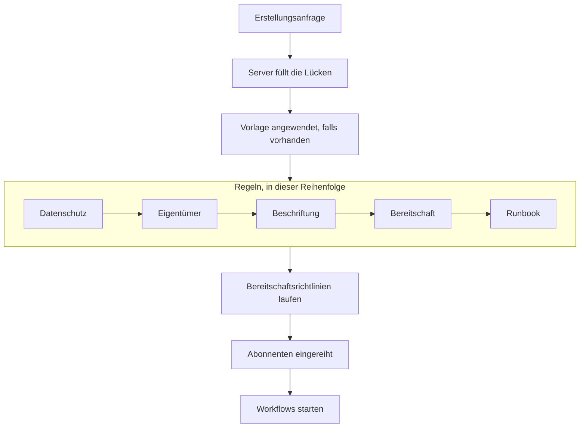

# Einen Vorfall melden

Wenn Sie einen Vorfall melden, entsteht der Datensatz, mit dem Ihr Team arbeitet: Er erhält eine Nummer, einen Schweregrad und einen Anfangsstatus, seine Bereitschaftsrichtlinien alarmieren Menschen, und – sofern Sie nichts anderes sagen – erfahren die Statusseiten-Abonnenten davon. Diese Seite geht die fünf Wege, einen Vorfall zu melden, Feld für Feld durch und zeigt, was in dem Moment passiert, in dem er existiert.

:::cards
- [Von Hand melden](#von-hand-melden): Das dreistufige Formular, Feld für Feld.
- [Aus einer Vorlage melden](#aus-einer-vorlage-melden): Dieselbe Art von Vorfall, jedes Mal vorausgefüllt.
- [Aus Monitorkriterien melden](#automatisch-aus-monitorkriterien-melden): Lassen Sie eine fehlgeschlagene Prüfung ihn für Sie öffnen.
- [Über die API melden](#über-die-api-melden): Aus Ihrem eigenen Code, einem Skript oder einem anderen Werkzeug.
:::

## Fünf Wege, einen Vorfall zu melden

Es gibt fünf Wege, auf denen ein Vorfall in OneUptime entsteht, und alle enden am selben Ort: einer Zeile in der Tabelle `Incident` mit einem Schweregrad, einem aktuellen Status und einer Liste betroffener Ressourcen. Der Unterschied liegt nur darin, wer die Felder ausfüllt – Sie um 3 Uhr nachts, eine gespeicherte Vorlage, die Kriterien eines Monitors, Ihr eigener Code über die API oder jemand außerhalb Ihres Teams über ein Formular.

| Wenn Sie …                                                   | Wählen Sie                                                                  |
| ------------------------------------------------------------ | --------------------------------------------------------------------------- |
| einen Vorfall von Hand öffnen und alles ausfüllen wollen     | den Assistenten **Vorfall melden**                                          |
| eine wiederkehrende Art von Vorfall vorausgefüllt öffnen wollen | **Aus Vorlage erstellen**                                                |
| automatisch einen öffnen wollen, wenn die Prüfungen eines Monitors fehlschlagen | einen Kriterienfilter mit **Wenn Filter übereinstimmen, einen Vorfall deklarieren.** |
| einen aus eigenem Code, einem Skript oder einem anderen Werkzeug öffnen wollen | `POST /api/incident`                                           |
| Personen außerhalb Ihres Teams Probleme über einen Link melden lassen wollen | ein [Formular](/docs/forms/index)                                |

Alle fünf schreiben dasselbe Modell, ein von einer Probe geöffneter Vorfall sieht also genauso aus wie einer, den ein Responder von Hand geöffnet hat – bis auf ein paar Verwaltungsspalten, die der Server bei automatischen setzt. Auch Integrationen schreiben es: [Huntress](/docs/integrations/huntress) öffnet für jeden Vorfallbericht, den sein SOC sendet, einen Vorfall.

> [!TIP]
> Sie können einen Vorfall auch aus Warnungen melden: **Vorfall melden** in einer Warnungsliste, in der Kopfzeile einer Warnung oder auf der Seite **Verknüpfte Vorfälle** einer Warnung öffnet denselben Assistenten, vorausgefüllt aus den Warnungen, und verknüpft sie mit dem neuen Vorfall. Ein standardmäßig angehaktes Kästchen im Formular bestätigt die Warnungen außerdem, damit ihre Eskalation stoppt. Siehe [Verknüpfte Warnungen](/docs/incidents/linked-alerts).

## Von Hand melden

Das Formular **Neuen Vorfall melden** fragt einen Vorfall in drei Schritten ab – **Vorfalldetails**, **Betroffene Ressourcen** und **Bereitschaft & Rollen** – und zeigt dann eine Zusammenfassung zur Prüfung. Fragt Ihr Projekt beim Erstellen einige seiner benutzerdefinierten Vorfallfelder ab, folgt direkt nach **Betroffene Ressourcen** ein vierter Schritt, **Details**.

:::steps
1. Öffnen Sie **Vorfälle → Alle Vorfälle** und klicken Sie oben rechts in der Liste **Vorfälle** auf **Vorfall melden**. Das Formular öffnet sich mit **Vorfalldetails**.
2. Geben Sie einen **Titel** ein und wählen Sie einen **Vorfallsschweregrad**. Der Rest des Formulars ist optional.
3. Klicken Sie mit **Weiter** durch die übrigen Schritte und füllen Sie aus, was Sie jetzt wissen: Monitore und andere Ressourcen, Bereitschaftsrichtlinien, Rollen.
4. Lesen Sie die Zusammenfassung und klicken Sie auf **Vorfall melden**. Sie landen beim neuen Vorfall, und sein **Vorfalls-Feed** beginnt aufzuzeichnen.
:::

Nur der erste Schritt hat Pflichtfelder, dazu jedes benutzerdefinierte Feld, das Ihre Admins als **Beim Erstellen erforderlich** markiert haben und das der Schritt **Details** abfragt. Jeder Schritt vor der Zusammenfassung hat ein schlichtes **Weiter**, und **Vorfall melden** steht auf der Zusammenfassung, dem letzten Schritt. In Eile füllen Sie **Vorfalldetails** aus und drücken **Weiter** durch die anderen Schritte, ohne sie auszufüllen: Ressourcen anhängen, Bereitschaftsrichtlinien hinzufügen und Rollen vergeben kann auch auf den Seiten des Vorfalls selbst warten. Auch **Enter** in einem Feld geht weiter; es meldet nie vor der Zusammenfassung.

> [!TIP]
> Die Optionen, die die meisten Vorfälle nie brauchen, warten eingeklappt unter einer Überschrift **Weitere Felder** am Ende ihres Schritts; klicken Sie darauf, um sie zu öffnen. Solange sie eingeklappt ist, nennt die Überschrift, was darin steckt, und zeigt jede gesetzte Option mit ihrem Wert – gesetzt etwa von einer Vorlage oder von einer privaten Warnung, aus der Sie melden – und sie öffnet sich von selbst, wenn etwas darin korrigiert werden muss. Die Zusammenfassung führt eine dieser Optionen nur auf, wenn sie gesetzt ist – außer **Statusseiten-Abonnenten benachrichtigen**, das sie immer aufführt, zusammen mit den Empfängern.

**Von der Seite einer Ressource aus.** **Vorfall melden** auf dem Reiter **Vorfälle** eines Monitors, eines Hosts, eines Dienstes, eines Clusters oder der meisten anderen Ressourcen öffnet dasselbe Formular, in dem diese Ressource unter **Betroffene Ressourcen** schon ausgewählt ist – ein Titel und ein Schweregrad genügen dann, und der Vorfall erscheint auf dem Reiter, von dem Sie kamen.

:::details Welche Ressourcenseiten es anbieten und was sie auswählen
**Vorfall melden** auf dem Reiter **Vorfälle** eines Monitors, eines Hosts, eines Kubernetes-, Proxmox-, Ceph- oder Docker-Swarm-Clusters, eines Docker- oder Podman-Hosts, eines vCenters, eines Speicher-Arrays, einer IoT-Flotte, einer Datenbank oder eines Dienstes öffnet denselben Assistenten mit dieser Ressource schon unter **Betroffene Ressourcen** ausgewählt (ein Monitor unter **Monitore**, alles andere unter **Andere betroffene Ressourcen**), vor allem, was eine Vorlage hinzufügt. **Aus Vorlage erstellen** auf diesem Reiter behält die Ressource ebenfalls. Die Brotkrümel führen über den Reiter der Ressource zurück, und nach dem Melden landen Sie – wie aus der Vorfallliste – beim neuen Vorfall.

Der Reiter **Vorfälle** eines Inventarelements wählt den Host, den Dienst oder den Kubernetes-Cluster, auf den das Element verweist, und die Brotkrümel führen über den Reiter dieser Ressource zurück. **Warnung erstellen** auf dem Reiter **Warnungen** einer Ressource funktioniert genauso: Von einem Monitor aus füllt es den **Monitor** der Warnung, von allem anderen aus **Andere betroffene Ressourcen**.

Die Ressource wird mit Ihren eigenen Berechtigungen nachgeschlagen: Können Sie sie nicht lesen oder wurde sie gelöscht, öffnet sich das Formular einfach ohne Auswahl.
:::

### Schritt 1 — Vorfalldetails

- **Titel** – Pflicht. Die einzeilige Zusammenfassung, die alle in der Liste, in Slack und (falls der Vorfall sichtbar ist) auf Ihrer Statusseite sehen. Platzhalter: `Incident Title`.
- **Vorfallsschweregrad** – Pflicht. Einer der für Ihr Projekt konfigurierten Schweregrade; neue Projekte starten mit **Critical Incident**, **Major Incident** und **Minor Incident**.
- **Beschreibung** – optional, in Markdown. Dieses Feld erscheint auf der Statusseite, schreiben Sie es also für Kunden statt für Ihr Team. Ein Bild darin sehen alle, solange der Vorfall auf Statusseiten sichtbar ist, und nur die Mitglieder Ihres Projekts, solange er verborgen ist. Sie können sie später über **Beschreibung** im Seitenmenü des Vorfalls bearbeiten.

Unter **Weitere Felder**:

- **Erklärt am** – beginnt mit dem Moment, in dem Sie die Seite geöffnet haben. Von diesem Zeitstempel aus wird jede Dauer des Vorfalls gemessen; datieren Sie ihn also zurück, wenn Sie etwas erfassen, das früher begann.
- **Anfangsstatus** – optional und zunächst leer. Bleibt er leer, beginnt der Vorfall in dem Status mit `isCreatedState`, den neue Projekte als **Identifiziert** anlegen – oder im Anfangsstatus der Vorlage, wenn Sie aus einer Vorlage melden. Wählen Sie einen späteren Status nur, wenn Sie einen Vorfall erfassen, der diesen Punkt schon hinter sich hatte, bestätigt oder behoben. Ein solcher Vorfall alarmiert niemanden – siehe [Bereits bestätigt oder behoben gemeldet](#bereits-bestätigt-oder-behoben-gemeldet).
- **Beschriftungen** – optional. Beschriftungen gruppieren zusammengehörige Vorfälle, damit Sie danach filtern können, und ein Team, dessen Berechtigungen auf Beschriftungen beschränkt sind, sieht nur die Vorfälle, die eine seiner Beschriftungen tragen.
- **Privater Vorfall** – Kontrollkästchen, standardmäßig aus (`isPrivate`). Ein privater Vorfall ist nur für seine Eigentümer-Benutzer, die Mitglieder seiner Eigentümer-Teams, Projektadmins und Projekteigentümer sichtbar – und ist auf jeder Statusseite verborgen, unabhängig von jeder anderen Einstellung, auch auf den Statusseiten, auf die er beschränkt ist. Die Vorfallliste markiert ihn mit einem roten **Privat**-Etikett.

> [!NOTE]
> **Auch Warnungen und Episoden beginnen in dem Status, den Sie wählen.** **Warnung erstellen** und **Episode erstellen** in den Listen der Vorfall- und Warnungsepisoden haben denselben **Anfangsstatus** unter **Weitere Felder**. Bleibt er leer, beginnt die Warnung oder Episode im Erstellungsstatus des Projekts. Wählen Sie einen späteren Status, um eine Warnung oder Episode zu erfassen, die schon bestätigt oder behoben war: Sie beginnt in diesem Status, ihre Statuszeitachse beginnt damit, und eine als behoben erfasste Episode zählt sofort als behoben. Ihre Eigentümer werden über diesen ersten Status nicht gesondert informiert, und die Statusseiten-Abonnenten einer Vorfallsepisode erfahren davon einmal, wenn die Episode erstellt wird. Eine so erfasste Warnung oder Episode alarmiert – wie ein Vorfall – niemanden: siehe [Bereits bestätigt oder behoben gemeldet](#bereits-bestätigt-oder-behoben-gemeldet). Über die API ist dieselbe Wahl `currentAlertStateId` oder `currentIncidentStateId` – siehe [OneUptime-API-Referenz](/docs/api-reference/api-reference).

:::details Schreiben im Markdown-Editor
Die Beschreibung – wie Notizen, Grundursache, Behebung und benutzerdefinierte Felder mit formatiertem Text – wird im Markdown-Editor geschrieben. Er öffnet sich im visuellen Modus, der den Text formatiert zeigt; **Markdown** in seiner Symbolleiste wechselt in den Markdown-Modus, der den Markdown-Quelltext zeigt, und **Visuell** wechselt zurück. In einer Liste rücken **Einzug vergrößern** und **Einzug verkleinern** in der Symbolleiste, oder Tab und Shift+Tab, einen Eintrag unter den darüber ein und wieder heraus; wo es nichts zum Einrücken gibt, und außerhalb einer Liste, springt Tab wie gewohnt zum nächsten Feld. Im visuellen Modus teilen **Codeblock**, **Tabelle** und **Aufgabenliste** mitten in einer Zeile oder an ihrem Ende die Zeile am Cursor und setzen den neuen Block in eigene Zeilen – auch am Rand eines fett gedruckten Worts, eines Links oder von Inline-Code, ohne leere Formatierung zu hinterlassen –, und **Aufgabenliste** in einem Listeneintrag fügt ihre Aufgabe der Liste dieses Eintrags hinzu statt als Unteraufgabe. Im Markdown-Modus werden **Codeblock** und **Tabelle** am Cursor eingefügt, beginnen Sie dafür also zuerst eine neue Zeile; **Aufgabenliste** macht die Zeile am Cursor zu einer Aufgabe, und **Nummerierte Liste** nummeriert jede Ebene einer verschachtelten Liste ab 1. Die Symbolleiste bleibt einzeilig: Formulare mit dem Editor öffnen sich in einem breiten Dialog, sodass auf den meisten Bildschirmen jede Schaltfläche Platz hat; wo nicht – auf einem Telefon oder in einem schmalen Fenster –, liegen die Schaltflächen, die nicht passen, unter **Weitere Formatierungen** (**⋯**) am Ende der Symbolleiste, in derselben Reihenfolge, und jede, die Sie dort wählen, wirkt dort, wo der Cursor war. Auf den schmalsten Bildschirmen wandert auch der Schalter **Markdown** dorthin.

**Rückgängig machen.** Im visuellen Modus nimmt Ctrl+Z (Cmd+Z auf dem Mac) Ihre Änderungen einzeln zurück, die neueste zuerst – was Sie getippt haben und die Bearbeitungen des Editors selbst: ein Ein- oder Ausrücken, einen Block, den er in eine Zeile gesetzt hat, ein formatiertes oder ein Block-Einfügen –, und Ctrl+Shift+Z (Cmd+Shift+Z) oder Ctrl+Y stellt sie in derselben Reihenfolge wieder her. Im Markdown-Modus nimmt Ctrl+Z ein Ein- oder Ausrücken, die Änderung einer Listenschaltfläche und ein formatiertes Einfügen zurück, aber nicht, was die Schaltflächen **Codeblock**, **Tabelle** und **Horizontale Linie** einfügen.

**Einfügen.** Einfügen aus Word, Google Docs oder einer OneUptime-Seite – etwa der Beschreibung eines anderen Vorfalls – behält die Listen und ihre Verschachtelung, die Links und die Formatierung, und eingefügte `•`-Aufzählungszeichen werden zu einer echten Liste. Links, die nur ein Symbol sind, etwa der Anker neben einer Überschrift auf GitHub, werden weggelassen. Im visuellen Modus werden Code oder ein Zitat, die in eine Zeile eingefügt werden, zu einem eigenen Block und teilen die Zeile, und eine in einen Listeneintrag eingefügte Liste schließt sich der Liste dieses Eintrags an, statt darin verschachtelt zu werden – in den leeren Eintrag eingefügt, den Enter hinterlässt, ersetzt sie diesen –, während ein in einen Eintrag eingefügter Codeblock, ein Zitat oder eine Tabelle darin bleibt. Im Markdown-Modus kommt das, was das Einfügen zu Blöcken macht – Code, ein Zitat, eine Liste, eine Überschrift, mehrere Absätze –, in eigene Zeilen, mit einer Leerzeile auf beiden Seiten, wenn es mitten in einer Zeile landet, und eine Liste, die am Ende der Zeile eines Listeneintrags oder nach einem einzelnen `- ` eingefügt wird, schließt sich dieser Liste auf der Einrückung des Eintrags an; Markdown, das Sie als reinen Text kopiert haben, wird genau so am Cursor eingefügt. Was Sie in einen Codeblock einfügen, bleibt genau so, wie Sie es kopiert haben. Einfügen über einer Auswahl, die mehrere Einträge, Absätze oder Tabellenzellen umfasst, ersetzt sie wie beim Tippen. Im visuellen Modus behalten ein Einfügen oder die Schaltfläche **Code** über Tabellenzellen jede Zelle und Spalte, ein Einfügen hinterlässt kein leeres Aufzählungszeichen, Zitat oder Codeblock, und endet die Auswahl in einem Codeblock, schließt sich nur der Rest dieser Codezeile dem Text an.

**Aus einer Notiz kopieren.** Ein aus einer Notiz oder Beschreibung kopierter Codeblock wird wieder als Codeblock in seiner Sprache eingefügt, ebenso eine Zeile daraus, die mit ihrem Zeilenumbruch kopiert wurde, wie ein Dreifachklick sie in Chrome, Edge und Safari kopiert. Ein Wort oder ein Teil einer Zeile aus einem Codeblock wird als Inline-Code eingefügt. In Chrome, Edge und Safari werden Zeilen, die aus einer als Tabelle gezeichneten Codeansicht kopiert wurden – dem YAML-Reiter einer Kubernetes-Ressource, den Frames des Stacktraces einer Ausnahme –, als reiner Text mit erhaltener Einrückung eingefügt.
:::

### Schritt 2 — Betroffene Ressourcen

Die Monitore kommen zuerst und für sich, weil Statusseiten einen Vorfall über seine Monitore sehen, und der Status, in den die Monitore wechseln, steht direkt darunter.

- **Monitore** – ein Suchfeld, das die vom Vorfall betroffenen Monitore anhängt; sein Reiter **Beschriftungen** fügt alle Monitore mit einer Beschriftung auf einmal hinzu. Eine Statusseite zeigt einen Vorfall und benachrichtigt ihre Abonnenten darüber, wenn sie einen der Monitore des Vorfalls führt; diese bestimmen also, welche Statusseiten davon erfahren (`monitors` am Vorfall).
- **Monitor-Status ändern in** – optional und erst sichtbar, wenn mindestens ein Monitor gewählt ist. Wählt einen Monitorstatus, der auf jeden an diesen Vorfall gehängten Monitor angewendet wird, sodass Vorfall melden und Monitore als beeinträchtigt markieren eine Aktion statt zwei ist. Beim Melden aus einer Vorlage, die einen Status setzt, beginnt das Feld mit dem Status der Vorlage, sichtbar, sobald Sie einen Monitor wählen. Ohne gewählten Monitor wird kein Status gespeichert, auch nicht der der Vorlage; entfernen Sie den letzten Monitor, verschwindet das Feld, bis Sie einen anderen wählen, der Ihre Wahl zurückbringt. Der Status eines Monitors gilt für jede Statusseite, die ihn führt; haben Sie unter **Weitere Felder** Statusseiten gewählt, erinnert das Formular Sie daran, dass die Änderung auch auf den nicht gewählten Seiten erscheint.
- **Andere betroffene Ressourcen** – ein zweites Suchfeld für alles andere, was der Vorfall betrifft: Hosts, Kubernetes-Cluster, Docker- und Podman-Hosts, Proxmox-, Ceph- und Docker-Swarm-Cluster, vCenter, Speicher-Arrays, IoT-Flotten, Datenbanken und Dienste – alles außer Monitoren, was die Karte **Betroffene Ressourcen** des Vorfalls anbietet. Intern sind das getrennte Relationen am Vorfall (`hosts`, `kubernetesClusters`, `dockerHosts`, `podmanHosts`, `services` und mehr), aber das Formular fasst sie in einer Auswahl zusammen.

Ein Monitor kann sagen, was er überwacht – **Monitor → Übersicht → Verknüpfte Ressourcen**, dieselben Arten von Ressourcen wie **Andere betroffene Ressourcen**. Wählen Sie einen solchen Monitor, wird das, womit er verknüpft ist, sofort zu **Andere betroffene Ressourcen** hinzugefügt, und eine Zeile unter dem Feld nennt, was hinzugekommen ist. Entfernen Sie vor dem Melden alles, was Sie nicht wollen: Solange Sie im Formular bleiben, wird für diesen Monitor nichts erneut hinzugefügt, und das Entfernen des Monitors lässt stehen, was er hinzugefügt hat. Dasselbe geschieht, wenn ein Monitor aus einer Vorlage oder von der Seite stammt, auf der Sie gemeldet haben, sowie bei **Warnung erstellen** und **Schedule Maintenance**.

Die Karte **Betroffene Ressourcen** des Vorfalls fragt beim späteren Bearbeiten genauso: **Monitore**, **Monitor-Status ändern in**, sobald es einen Monitor gibt, dann **Andere betroffene Ressourcen**. Ein Vorfall, der ohne Monitor gespeichert wird, behält den Status, den er hatte.

Unter **Weitere Felder**:

- **Auf diese Statusseiten beschränken** – optional. Bleibt es leer, erscheint der Vorfall auf jeder Statusseite, die seine Monitore führt, und benachrichtigt deren Abonnenten. Wählen Sie hier Seiten, werden nur die gewählten darunter verwendet; der Reiter **Beschriftungen** fügt alle Seiten mit einer Beschriftung auf einmal hinzu. Das Formular warnt, wenn eine gewählte Seite keinen der Monitore des Vorfalls führt, und wenn der Vorfall privat ist, was ihn auf jeder Statusseite verbirgt. Siehe [Eine Statusseite pro Zielgruppe](/docs/status-pages/one-status-page-per-audience).
- **Statusseiten-Abonnenten benachrichtigen** – Kontrollkästchen, standardmäßig an. Steuert, ob Abonnenten über das Anlegen des Vorfalls benachrichtigt werden (`shouldStatusPageSubscribersBeNotifiedOnIncidentCreated`). Das Einklappen unter **Weitere Felder** ändert nichts an seiner Wirkung: Es beginnt weiterhin angehakt, und die Zusammenfassung führt es immer auf. Darunter, und noch einmal auf der Zusammenfassung vor dem Absenden, listet **Will notify** die Statusseiten, die informiert werden, mit einer „bis zu“-Abonnentenzahl je Kanal, sowie die Seiten, die nicht informiert werden, und warum. Wird niemand informiert (kein Monitor angehängt, keine Statusseite führt die Monitore oder die Seiten haben noch keine Abonnenten), zeigt es nichts an und warnt nur, wenn der Statusseiten-Umfang des Vorfalls der Grund ist. Auf der Zusammenfassung zeigt **Vorschau** neben **Ja** die E-Mail, die die Abonnenten jeder dieser Statusseiten erhalten, und **Test an mich senden** schickt sie an die E-Mail-Adresse Ihres eigenen Kontos; siehe [Abonnenten & Ankündigungen](/docs/status-pages/subscribers#vorfälle). Schalten Sie es für internes Rauschen aus, das Sie trotzdem festhalten wollen. Der Vorfall bleibt dann standardmäßig still: Neue öffentliche Notizen daran und der Statuswechsel-Dialog auf seiner Übersichtsseite (**Bestätigen**, **Beheben** oder die Wahl eines anderen Status) beginnen mit ihrem eigenen Kontrollkästchen **Statusseiten-Abonnenten benachrichtigen** ausgeschaltet. Das manuelle Formular auf der Seite **Zustands-Zeitachse** und die Massenaktion **Status ändern** in der Vorfallliste beginnen weiterhin eingeschaltet.

> [!IMPORTANT]
> **Hängen Sie Monitore an, auch wenn es überflüssig wirkt.** Die Verbindung zwischen einem Vorfall und einer Statusseite läuft über die Monitore des Vorfalls: Eine Statusseite zeigt einen Vorfall und benachrichtigt ihre Abonnenten darüber, wenn eine ihrer Ressourcen einer der Monitore des Vorfalls ist. **Auf diese Statusseiten beschränken** kann diese Liste nur einengen, nie erweitern, und eine Statusseite mit eingeschaltetem **Nur auf diese Seite beschränkte Vorfälle anzeigen** zeigt nur die auf sie beschränkten Vorfälle. Ein Vorfall ohne angehängte Monitore benachrichtigt keinen einzigen Statusseiten-Abonnenten. Siehe [Statusseiten – Ressourcen & Gruppen](/docs/status-pages/resources-and-groups).

Das Flag **Auf der Statusseite sichtbar?** (`isVisibleOnStatusPage`) steht nicht im Assistenten; es ist standardmäßig true. Ändern Sie es danach über **Einstellungen** im Seitenmenü des Vorfalls, wo es **Auf Statusseite sichtbar** heißt.

**Verborgen melden und später veröffentlichen.** Ein Vorfall, der beim Anlegen vor Statusseiten verborgen ist, informiert keinen Abonnenten, und sein Benachrichtigungsstatus lautet **Übersprungen: auf Statusseiten ausgeblendet**. Schalten Sie später **Auf Statusseite sichtbar** ein, bietet das Bearbeitungsformular **Abonnenten benachrichtigen, dass dieser Vorfall erstellt wurde** an, sodass der Ablauf – verborgen melden, herausfinden, wer betroffen ist, dann veröffentlichen – sie trotzdem informiert. Es beginnt angehakt, solange der Vorfall nicht behoben ist, und nicht angehakt, sobald er behoben ist, damit das Veröffentlichen eines alten Vorfalls fürs Protokoll ihn nicht als neu ankündigt. Es wird nur angeboten, wenn der Vorfall mit eingeschaltetem **Statusseiten-Abonnenten benachrichtigen** gemeldet wurde und nicht privat ist – also nicht für einen über ein [Formular](/docs/forms/on-submit) gemeldeten Vorfall, der verborgen und mit ausgeschalteter Option gemeldet wird. Über die API senden Sie `"miscDataProps": {"notifySubscribersOfIncidentCreatedOnPublish": true}` mit der Aktualisierung, die `isVisibleOnStatusPage` auf `true` setzt, oder setzen `subscriberNotificationStatusOnIncidentCreated` selbst zurück auf `Pending`. Ein Postmortem, das veröffentlicht wurde, während der Vorfall verborgen war, braucht kein Kästchen: Das Einschalten von **Auf Statusseite sichtbar** sendet es einmal, wie unter [Abonnenten & Ankündigungen](/docs/status-pages/subscribers#vorfälle) beschrieben.

### Details — Ihre benutzerdefinierten Vorfallfelder

Dieser Schritt erscheint nur, wenn bei mindestens einem benutzerdefinierten Vorfallfeld unter **Vorfälle → Einstellungen → Benutzerdefinierte Felder** **Beim Erstellen anzeigen** eingeschaltet ist – oder, wenn Sie aus einer Vorlage melden, wenn die **Benutzerdefinierte Felder beim Erstellen** der Vorlage eines abfragen. Er fragt diese Felder in ihrer **Reihenfolge** ab – der Reihenfolge, in die sie auf dieser Einstellungsseite gezogen wurden –, mit der Eingabe, die ihr Typ verlangt: einem Dropdown, einer Zahl, einem Datum, einem Ja/Nein-Schalter, langem Text oder formatiertem Text im Markdown-Editor. Er entfällt auch für alle, die die benutzerdefinierten Vorfallfelder des Projekts nicht lesen dürfen: In OneUptime Cloud brauchen sie den Tarif **Growth** oder höher und eine Rolle, die benutzerdefinierte Vorfallfelder sehen darf.

- Ein als **Beim Erstellen erforderlich** markiertes Feld muss ausgefüllt sein, bevor Sie melden können. Ein erforderliches Ja/Nein-Feld – etwa eine Bestätigung – muss eingeschaltet sein.
- Eine 0 oder ein ausgeschalteter Schalter ist eine Antwort und wird als solche gespeichert.
- Ein Feld, dessen Wert aus einem benutzerdefinierten Monitorfeld kopiert wird, wird nicht abgefragt, sobald der Vorfall einen Monitor hat, weil der Wert beim Anlegen des Vorfalls vom Monitor kopiert wird.
- Beim Melden aus einer Vorlage beginnt der Schritt mit den Werten der Vorlage, und die Werte der Vorlage für Felder, die der Schritt nicht abfragt, bleiben erhalten. Ein Wert, den Sie im Schritt leeren, bleibt leer. Ein Vorlagenwert, der nicht mehr zu seinem Feld passt – eine inzwischen entfernte Dropdown-Option –, wird weggelassen, statt den Vorfall abzulehnen.
- Beim Melden aus einer Vorlage gelten auch die **Benutzerdefinierte Felder beim Erstellen** der Vorlage. Ein Feld, das sie auf **Erforderlich** oder **Optional** setzt, wird abgefragt, auch wenn das Projekt es beim Erstellen nicht anzeigt; ein Feld, das sie auf **Ausgeblendet** setzt, wird nicht abgefragt – der Wert der Vorlage gilt trotzdem –, und ein Feld auf **Standard** folgt seinen eigenen Einstellungen **Beim Erstellen anzeigen** und **Beim Erstellen erforderlich**. Siehe [Benutzerdefinierte Felder beim Erstellen](/docs/incidents/settings#benutzerdefinierte-felder-beim-erstellen).

**Beim Erstellen erforderlich** wird nur vom Dashboard geprüft, und die **Benutzerdefinierte Felder beim Erstellen** einer Vorlage ebenso. Vorfälle, die Monitore, die API, Slack, Microsoft Teams oder KI anlegen, können ein Feld leer lassen, und jedes Feld bleibt danach auf der Seite **Benutzerdefinierte Felder** des Vorfalls optional, damit das Korrigieren eines Werts mitten im Ausfall nie alle anderen verlangt. Die Feldtypen und Einstellungen finden Sie unter [Benutzerdefinierte Felder](/docs/incidents/settings#benutzerdefinierte-felder).

### Schritt 3 — Bereitschaft & Rollen

- **Bereitschaftsrichtlinie** – eine Mehrfachauswahl der Bereitschaftsrichtlinien, die beim Anlegen dieses Vorfalls ausgeführt werden. Das entspricht `onCallDutyPolicies` am Vorfall.
- **Vorfallrollen zuweisen** – wer jede Rolle übernimmt, die Ihr Projekt definiert, eine Karte pro Rolle. Eine als **Primär** markierte Rolle, die Sie leer lassen, gehört Ihnen: Sie übernehmen sie beim Melden des Vorfalls, und die Zusammenfassung sagt es. Eine Rolle für eine Person sagt das, sobald sie eine hat; eine Rolle für mehrere behält ihre Auswahl.

Dies ist die einzige Stelle, an der eine Bereitschaftsrichtlinie direkt an einen Vorfall gehängt wird. Schweregrade tragen keine Bereitschaftsrichtlinie – der Schweregrad ist eine Beschriftung und beeinflusst die Alarmierung nur als *Kriterium* in einer Bereitschaftsregel. Regeln unter **Vorfälle → Regeln → Bereitschaftsregeln** fügen ihre Richtlinien zu dem hinzu, was Sie hier wählen; ausgeführt wird die Vereinigung beider, ohne Duplikate. Ein in einem späteren Status gemeldeter Vorfall führt keine davon aus – siehe [Bereits bestätigt oder behoben gemeldet](#bereits-bestätigt-oder-behoben-gemeldet).

Die Rollen selbst konfigurieren Sie unter **Vorfälle → Einstellungen → Vorfallsrollen**. Ein neues Projekt hat eine, Incident Commander; ergänzen Sie dort Responder, Communications Lead oder was Ihr Prozess sonst braucht. Wählen Sie niemanden als Incident Commander, werden Sie es beim Melden des Vorfalls selbst.

## Aus einer Vorlage melden

Wenn Sie immer wieder dieselbe Art von Vorfall melden – dasselbe Titelmuster, derselbe Schweregrad, dieselbe Bereitschaftsrichtlinie –, speichern Sie sie einmal als Vorlage und melden Sie dann daraus:

:::steps
1. Klicken Sie in der Liste **Vorfälle** auf **Aus Vorlage erstellen** (die umrandete Schaltfläche neben **Vorfall melden**). Ein Dialog **Vorfall aus Vorlage erstellen** mit der Auswahl **Vorfallvorlage auswählen** öffnet sich.
2. Wählen Sie eine Vorlage. Das Erstellungsformular öffnet sich vorausgefüllt.
3. Ändern Sie, was diesmal anders ist, gehen Sie dann die Schritte durch und melden Sie wie gewohnt.
:::

Hat Ihr Projekt noch keine Vorlagen, erhalten Sie stattdessen einen Dialog **Keine Vorfallvorlagen** mit einer Schaltfläche **Vorlage erstellen**, die Sie zu **Vorfälle → Einstellungen → Vorfall-Vorlagen** bringt.

Vorlagen werden mit einem eigenen vierstufigen Assistenten gebaut – **Vorlageninformationen**, **Vorfalldetails**, **Betroffene Ressourcen**, **Bereitschaft** –, dazu die Schritte **Benutzerdefinierte Felder** und **Benutzerdefinierte Felder beim Erstellen** nach **Betroffene Ressourcen**, wenn Ihr Projekt benutzerdefinierte Vorfallfelder hat. **Anfänglicher Vorfallstatus**, **Eigentümer** und **Beschriftungen** der Vorlage stehen unter **Weitere Felder** am Ende von **Vorfalldetails**. **Betroffene Ressourcen** fragt wie das Meldeformular – **Monitore**, dann **Monitor-Status ändern in**, dann **Andere betroffene Ressourcen**, mit **Auf diese Statusseiten beschränken** unter **Weitere Felder** –, nur fragt eine Vorlage den Monitorstatus immer ab: Er gilt auch für die Monitore, die beim Melden aus der Vorlage gewählt werden. Das sind die Felder:

| Feld                            | Zweck                                                  |
| ------------------------------- | ------------------------------------------------------ |
| **Vorlagenname**                | Woran die Vorlage in der Auswahl erkannt wird.         |
| **Vorlagenbeschreibung**        | Eine Notiz an Ihr künftiges Ich, wann Sie sie nehmen.  |
| **Titel**                       | Der Titel, der im Vorfall vorausgefüllt wird.          |
| **Beschreibung**                | Die Markdown-Beschreibung, die im Vorfall vorausgefüllt wird. |
| **Vorfallsschweregrad**         | Der Schweregrad, der im Vorfall vorausgefüllt wird.    |
| **Anfänglicher Vorfallstatus**  | Der Status, in dem Vorfälle aus dieser Vorlage beginnen. Leer bleibt der übliche Anfangsstatus. Ein Vorfall, der bestätigt oder behoben beginnt, alarmiert niemanden. |
| **Monitore**                    | Anzuhängende Monitore.                                 |
| **Monitor-Status ändern in**    | Monitorstatus für die Monitore des Vorfalls, auch für die beim Melden gewählten. |
| **Andere betroffene Ressourcen** | Anzuhängende Hosts, Cluster und Dienste.              |
| **Auf diese Statusseiten beschränken** | Statusseiten, auf die der Vorfall beschränkt wird. |
| **Bereitschaftsrichtlinie**     | Richtlinien, die beim Anlegen des Vorfalls ausgeführt werden. |
| **Eigentümer**                  | Personen und Teams, denen Vorfälle aus dieser Vorlage gehören, aus einer Liste gewählt. |
| **Beschriftungen**              | Beschriftungen, die der Vorfall erhält.                |
| **Benutzerdefinierte Felder**   | Werte für die benutzerdefinierten Felder des Vorfalls. |
| **Benutzerdefinierte Felder beim Erstellen** | Welche benutzerdefinierten Felder der Schritt **Details** abfragt und welche ausgefüllt sein müssen. |

Ein paar schnelle Regeln:

- Vorlagen lassen sich in der Vorlagenliste nicht bearbeiten – Sie legen eine an und öffnen sie dann, um sie zu ändern.
- Eine Vorlage füllt nur ein Feld, das Sie leer gelassen haben. Auf der Erstellungsseite wird die Vorlage als Vorbelegung angewendet, die Sie überschreiben können; auf dem Server – für ein Formular, das aus einer Vorlage meldet – wird ein Feld nur dann aus der Vorlage gefüllt, wenn die Anfrage es `undefined` gelassen hat. Was der Aufrufer angibt, gewinnt immer.
- Der Schritt **Details** folgt den **Benutzerdefinierte Felder beim Erstellen** der Vorlage, wie [oben beschrieben](#details-ihre-benutzerdefinierten-vorfallfelder).
- Werte benutzerdefinierter Felder werden Feld für Feld zusammengeführt. Die Werte einer Vorlage füllen die benutzerdefinierten Felder, ohne die der Vorfall gemeldet wird; ein im Schritt **Details** gesetzter oder im `customFields` der Anfrage gesendeter Wert gewinnt immer – `0`, `false` und `null` eingeschlossen. Ein aus einem benutzerdefinierten Monitorfeld kopiertes Feld übernimmt weiterhin den Wert des Monitors.
- Die Werte benutzerdefinierter Felder einer bestehenden Vorlage stehen auf ihrer Karte **Benutzerdefinierte Felder**, neben ihren anderen Karten.
- Die **Eigentümer** der Vorlage werden hinzugefügt, sobald die Slack- und Microsoft-Teams-Kanäle des Vorfalls existieren, sodass eine Benachrichtigungsregel, die Vorfalleigentümer in einen neuen Kanal einlädt, auch sie einlädt. Das Melden aus einer Vorlage im Dashboard fügt sie ohne die Benachrichtigung „Sie wurden hinzugefügt“ hinzu; ein [Formular](/docs/forms/on-submit) mit einer Vorlage benachrichtigt sie und hält die Benachrichtigung **Vorfall erstellt** des Vorfalls zurück, bis sie hinzugefügt sind, damit sie an sie statt an die Projekteigentümer geht.

## Automatisch aus Monitorkriterien melden

Die meisten Vorfälle sollten keinen Menschen brauchen, der sie eintippt. Die Kriterien eines Monitors können einen melden, sobald ein Filter zutrifft:

:::steps
1. Öffnen Sie den Monitor, wählen Sie **Kriterien** in seinem Seitenmenü und klicken Sie auf **Überwachungskriterien bearbeiten**. (Ein neuer Monitor fragt dieselben Kriterien beim Anlegen ab.)
2. Schalten Sie im Kriterienfilter, der melden soll, **Wenn Filter übereinstimmen, einen Vorfall deklarieren.** ein. Ein Abschnitt **Vorfall erstellen** mit der Schaltfläche **Vorfall hinzufügen** erscheint – ein Kriterienfilter kann mehr als einen Vorfall melden.
3. Füllen Sie die Felder des Vorfalls aus (siehe unten) und speichern Sie. Trifft der Filter das nächste Mal zu, wird der Vorfall gemeldet und alarmiert seine Bereitschaftsrichtlinien.
:::

Jeder Vorfalleintrag hat:

- **Vorfalltitel** – unterstützt Vorlagen; der Platzhalter schlägt etwa `{{monitorName}} is down` vor.
- **Schweregrad** – Pflicht.
- **Vorfallbeschreibung** – ebenfalls mit Vorlagen.
- **Bereitschaft → Bereitschaftsrichtlinien** – Richtlinien, die beim Anlegen dieses Vorfalls ausgeführt werden.
- **Vorfallsrollen** – wer jede Rolle im Vorfall übernimmt, gewählt auf denselben Karten wie **Vorfallrollen zuweisen** im Meldeformular, eine pro Rolle. Erscheint, wenn Ihr Projekt Vorfallsrollen hat.
- **Eigentümerschaft & Beschriftungen → Eigentümer** (Personen und Teams, aus einer Liste gewählt), **Beschriftungen**.
- **Weitere Felder → Vorfall automatisch beheben** (behebt den Vorfall automatisch, wenn die Kriterien nicht mehr zutreffen), **Vorfall auf der Statusseite anzeigen**, **Privater Vorfall** und **Behebungs-Notizen**.

Die vollständige Liste der `{{variable}}`-Platzhalter für Titel, Beschreibung und Behebungsnotizen finden Sie unter [Vorfall- & Warnmeldungsvorlagen](/docs/monitor/incident-alert-templating).

So angelegte Vorfälle werden vom Server markiert: `isCreatedAutomatically` wird gesetzt, `createdCriteriaId` hält fest, welcher Kriterienfilter ausgelöst hat, und `createdByProbe`, welche Probe es gesehen hat. Alles andere an ihnen verhält sich genau wie bei einem von Hand gemeldeten Vorfall.

Ein von einem Monitor gemeldeter Vorfall wird mit dem verknüpft, was der Monitor überwacht: mit allem, was seine Konfiguration nennt (der Host eines Host-Monitors, der Cluster eines Kubernetes-Monitors, die Dienste eines Log-Monitors), und mit allem unter seinen **Verknüpfte Ressourcen**. Die Konfiguration eines Website- oder API-Monitors nennt keine Infrastruktur; verknüpfen Sie ihn daher mit dem Cluster, den Hosts oder der Datenbank hinter der Website: Seine Vorfälle erscheinen dann auf den Seiten dieser Ressourcen, die OneUptime-KI kann sie dort untersuchen, und die KI-Behebung des Clusters oder der Ressource kann auf sie wirken (siehe [AI SRE](/docs/ai/ai-sre#which-incidents-a-clusters-fixes-act-on)). Von einem Monitor erstellte Warnungen werden ebenso verknüpft.

## Über die API melden

Das Vorfallmodell stellt einen Standard-CRUD-Endpunkt bereit, `POST /api/incident` legt also einen an. Authentifizieren Sie sich mit einem API-Schlüssel, erzeugt unter **Projekteinstellungen → Erweitert → API-Schlüssel**, gesendet im Header `apikey` – der Schlüssel identifiziert das Projekt, eine Projekt-ID müssen Sie also nicht separat angeben.

```bash
curl -X POST https://oneuptime.com/api/incident \
  -H "apikey: $ONEUPTIME_API_KEY" \
  -H "Content-Type: application/json" \
  -d '{
    "data": {
      "title": "Checkout latency above SLO",
      "description": "Investigating elevated p99 latency on the checkout service.",
      "incidentSeverityId": "<incident-severity-id>"
    }
  }'
```

Nützliche Felder im Anfragekörper:

| Feld                     | Pflicht | Hinweise |
| ------------------------ | -------- | ------------------------------------------------------------------------------------------------------------------------------------------------------------------------------------------------------------------------------------------- |
| `title`                  | Ja       | Der Titel des Vorfalls. |
| `incidentSeverityId`     | Ja       | Einer der Schweregrade Ihres Projekts. Der Server prüft, dass er zum selben Projekt gehört wie der API-Schlüssel, und lehnt die Anfrage sonst ab. |
| `declaredAt`             | Nein     | Hier optional, auch wenn das Formular es verlangt. Fehlt es, verwendet der Server die aktuelle Zeit. |
| `currentIncidentStateId` | Nein     | Der Status, in dem begonnen wird; fehlt er, der Erstellungsstatus. Wird wie der Schweregrad gegen das Projekt des API-Schlüssels geprüft. Dieselbe Prüfung gilt für den Monitorstatus hinter **Monitor-Status ändern in**. |
| `statusPages`            | Nein     | Die IDs der Statusseiten, auf die der Vorfall beschränkt wird, alle aus demselben Projekt. Lassen Sie es weg, um jede Statusseite zu erreichen, die die Monitore des Vorfalls führt. `isScopedToStatusPages` wird daraus abgeleitet, ein dafür gesendeter Wert wird ignoriert. Siehe [Eine Statusseite pro Zielgruppe](/docs/status-pages/one-status-page-per-audience). |
| `customFields`           | Nein     | Die Werte der benutzerdefinierten Felder des Vorfalls, nach dem Namen jedes Felds. Jeder gesendete Wert muss zu seinem Feld passen – eine Zahl für ein Feld **Zahl**, eine der Optionen für ein **Dropdown (Einfachauswahl)** –, sonst wird die Anfrage mit einem Fehler `400` abgelehnt, der das Feld nennt. **Beim Erstellen erforderlich** wird hier nicht geprüft. Siehe [Werte benutzerdefinierter Felder über die API](/docs/incidents/settings#werte-benutzerdefinierter-felder-über-die-api). |

Ein API-Schlüssel kann nicht aus einer Vorlage melden: Eine Anfrage, die `createdIncidentTemplateId` sendet, wird abgelehnt. Diese Spalte setzt OneUptime selbst, für Vorfälle, die über ein [Formular](/docs/forms/on-submit) gemeldet werden, und für den Workflow-Schritt **Create One Incident**, der aus der unter seiner Einstellung **Incident Template** gewählten Vorlage meldet (siehe [Workflow-Komponenten](/docs/workflows/components)). Um über die API aus einer Vorlage zu melden, lesen Sie die Vorlage aus `/api/incident-templates` und senden ihre Werte in der Anfrage.

Verwandte Endpunkte sind `/api/incident-state`, `/api/incident-severity` und `/api/incident-state-timeline`. Die generierte [API-Referenz](/reference) enthält die genauen Anfrage- und Antwortformen für jeden davon, einschließlich der Darstellung von Relationsfeldern wie Monitoren.

## Über ein Formular melden

Der fünfte Weg ist für Personen außerhalb Ihres Teams. Ein Formular ist eine Seite, die Sie als Link teilen: Wer ihn hat, kann ohne OneUptime-Konto ein Problem melden, und jede Einsendung meldet einen Vorfall. Sie legen fest, was das Formular fragt – Titel, Beschreibung, Schweregrad, Monitore, benutzerdefinierte Felder, eigene Fragen –, und wie aus den Antworten der Vorfall wird: ein Standardschweregrad, eine Vorfallsvorlage, aus der gemeldet wird, sowie Monitore, Beschriftungen, Bereitschaftsrichtlinien und Eigentümer, die immer hinzugefügt werden.

So gemeldete Vorfälle werden vor Statusseiten verborgen und mit ausgeschaltetem **Statusseiten-Abonnenten benachrichtigen** gemeldet, damit ein Responder sie sichtet, bevor etwas öffentlich wird, und eine private Notiz hält fest, wer sie gemeldet hat. Formulare sind ein eigenes Produkt, unter **Formulare** im Menü **Produkte**, und können auch Wartungsereignisse planen; siehe [Formulare](/docs/forms/index).

## Vorfallnummern und Präfixe

Jeder Vorfall erhält eine fortlaufende Nummer aus einem Zähler pro Projekt, die der Server beim Anlegen vergibt. Zwei Spalten halten sie: `incidentNumber` (die rohe Ganzzahl) und `incidentNumberWithPrefix` (was Sie tatsächlich sehen). Ohne konfiguriertes Präfix lautet der Anzeigewert `#42`.

:::steps
1. Gehen Sie zu **Vorfälle → Einstellungen → Nummernpräfix** und klicken Sie auf **Aktualisieren**.
2. Geben Sie das Präfix in **Vorfallnummern-Präfix** ein. Das Feld zeigt die Nummer beim Tippen in der Vorschau: `INC-` macht daraus `INC-42`. Lassen Sie es leer, um das Standard-`#` zu behalten.
3. Klicken Sie auf **Änderungen speichern**. Ab jetzt gemeldete Vorfälle erhalten das neue Präfix; bestehende Vorfälle behalten ihre Nummern.
:::

Derselbe Dialog hat **Nummernpräfix der Vorfall-Episode** für die Nummerierung von Episoden. [Nummernpräfixe](/docs/incidents/settings#nummernpräfixe) listet die Regeln, denen ein Präfix folgt.

Die Nummer steht in der ersten Spalte der Vorfallliste, verlinkt auf den Vorfall und erscheint als **Vorfallnummer** auf der **Übersicht** des Vorfalls.

## Was in dem Moment passiert, in dem ein Vorfall gemeldet wird

Der Erstellungsaufruf tut mehr, als eine Zeile zu schreiben:



Der Reihe nach:

1. **Der Server füllt die Lücken.** `declaredAt` ist standardmäßig jetzt, der aktuelle Status standardmäßig der `isCreatedState`-Status des Projekts, und Vorfallnummer und Nummer mit Präfix werden aus dem Projektzähler vergeben.
2. **Eine Vorlage wird angewendet**, wenn ein Formular oder der Workflow-Schritt **Create One Incident** den Vorfall aus einer meldet (`createdIncidentTemplateId`) – sie füllt nur Felder, die der Aufrufer undefiniert gelassen hat; ein vom Aufrufer genannter Status gewinnt gegenüber dem der Vorlage. Das Dashboard wendet eine Vorlage stattdessen im Formular an, bevor die Anfrage gesendet wird.
3. **Datenschutzregeln laufen** und markieren den Vorfall als privat, wenn eine zutreffende Regel das sagt. Das ist die erste Regel-Engine, die läuft, sodass alles danach die richtige Datenschutzeinstellung sieht.
4. **Eigentümerregeln laufen** und fügen die Eigentümer-Benutzer und -Teams hinzu, die zutreffende Regeln nennen.
5. **Beschriftungsregeln laufen** und fügen Beschriftungen hinzu, die zum Vorfall passen.
6. **Bereitschaftsregeln laufen.** Jede aktivierte Regel unter **Vorfälle → Regeln → Bereitschaftsregeln**, deren Kriterien zutreffen, fügt dem Vorfall ihre Richtlinien hinzu. Es gibt keine Priorität und keinen Kurzschluss – alle zutreffenden Regeln greifen, und die Richtlinien werden dedupliziert.
7. **Runbook-Regeln laufen** und hängen passende Runbooks an und starten sie. Siehe [Runbooks – Übersicht](/docs/runbooks/index).
8. **Bereitschaftsrichtlinien laufen.** Jede Richtlinie am Vorfall – im Assistenten gewählt, aus einer Vorlage übernommen oder von einer Regel hinzugefügt – wird parallel mit dem Ereignistyp `IncidentCreated` ausgeführt. Schlägt eine Richtlinie fehl, hält das die anderen nicht auf. Eine archivierte Richtlinie alarmiert niemanden: Ihr Ausführungsprotokoll am Vorfall sagt, dass sie nicht ausgeführt wurde, weil die Richtlinie archiviert ist. Ein Vorfall, der bereits bestätigt oder behoben gemeldet wird, führt keine davon aus; siehe [Bereits bestätigt oder behoben gemeldet](#bereits-bestätigt-oder-behoben-gemeldet) weiter unten.
9. **Abonnenten werden eingereiht**, wenn **Statusseiten-Abonnenten benachrichtigen** eingeschaltet blieb und der Vorfall auf der Statusseite sichtbar ist. Die Zustellung übernimmt ein Hintergrundjob, nicht Ihre Anfrage selbst, und sie geht an die Statusseiten, die der Vorfall erreicht: die, die seine Monitore führen, eingeengt durch **Auf diese Statusseiten beschränken**, und ohne die Seiten, die nur auf sie beschränkte Vorfälle zeigen, wenn er nicht beschränkt ist. Eine archivierte Statusseite sendet nichts. Der Fortschritt erscheint als **Abonnenten-Benachrichtigungsstatus** auf der **Übersicht** des Vorfalls: was auf jeder Statusseite gesendet wurde und was fehlschlug, und **Wiederholen** oder **Erneut senden**, sobald es abgeschlossen ist. Siehe [Abonnenten & Ankündigungen](/docs/status-pages/subscribers).
10. **Workflows starten.** Der Trigger **On Create Incident** startet jeden Workflow, der darauf aufbaut. Siehe [Workflows – Übersicht](/docs/workflows/index).

Ab da ist der Vorfall live: Er zählt zum Badge **Aktive Vorfälle** im Seitenmenü Vorfälle (jeder Status über Ihrem behobenen Status zählt als aktiv), er erscheint auf den Statusseiten, die einen seiner Monitore führen (nur auf den gewählten, wenn Sie ihn beschränkt haben), und seine **Zustands-Zeitachse** beginnt aufzuzeichnen.

### Bereits bestätigt oder behoben gemeldet

Ein späterer **Anfangsstatus** – im Formular, über den **Anfänglicher Vorfallstatus** einer Vorlage oder mit `currentIncidentStateId` aus der API, aus Terraform oder einem Workflow – erfasst einen Vorfall, um den sich schon jemand kümmert oder der schon vorbei ist. Er wird nicht wie ein neuer Notfall behandelt:

```mermaid title="Was ein neuer Vorfall auslöst, je nach dem Status, in dem er beginnt"
flowchart TB
    start{"Anfangsstatus"} -->|"Erstellungsstatus, der Standard"| live["Als neu behandelt: alarmiert die Bereitschaft"]
    start -->|"Bestätigt oder später"| acked["Erfasst: alarmiert niemanden"]
    start -->|"Behoben oder später"| over["Als vorbei erfasst"]
    over --> quiet["Keine Gruppierung, Runbooks, KI, kein Kanal, kein SLA"]
```

- **In Ihrem bestätigten Status oder danach** – **Bestätigt** oder ein Status, der unter **Vorfälle → Einstellungen → Vorfallsstatus** darunter steht – läuft keine Bereitschaftsrichtlinie, es wird also niemand alarmiert. Der Vorfall listet seine Richtlinien weiterhin auf, die gewählten und die von Bereitschaftsregeln hinzugefügten, und sein Feed sagt in einer Zeile, warum: _No one was paged. This incident was created already acknowledged, so its on-call policy **Primary** was not run._ Sein SLA, falls eine Regel ihm eines gibt, beginnt bereits als beantwortet. Alles Weitere unten läuft wie bei jedem neuen Vorfall.
- **In Ihrem behobenen Status oder danach** – **Behoben** oder ein Status darunter – ist der Vorfall vorbei; zusätzlich läuft also nichts, was auf einen laufenden Vorfall reagiert:
  - er wird keiner Episode zugeordnet, die erneut alarmieren könnte;
  - keine Runbook-Regel und keine Auto-Behebungsregel wirkt auf ihn;
  - die OneUptime-KI untersucht ihn nicht – seine Karte **KI-Untersuchung** sagt, dass er bereits behoben angelegt wurde, und **Ask OneUptime AI** darunter beantwortet weiterhin Fragen dazu;
  - es wird kein Slack- oder Microsoft-Teams-Kanal für ihn angelegt;
  - seine Monitore behalten ihren Status und werden weiter überwacht, egal was **Monitor-Status ändern in** sagt;
  - für ihn wird kein SLA gestartet.
- **Was trotzdem passiert:** Datenschutz-, Eigentümer-, Beschriftungs- und Bereitschaftsregeln laufen, seine Eigentümer werden hinzugefügt und über die Erstellung informiert, der Eintrag **Vorfall erstellt** wird in seinen Feed geschrieben und in die Slack- und Microsoft-Teams-Kanäle gepostet, die Ihre Regeln nennen, und Statusseiten-Abonnenten werden informiert, wenn **Statusseiten-Abonnenten benachrichtigen** eingeschaltet ist und der Vorfall auf ihrer Statusseite erscheint. Auch ein Vorfall, der schon vorbei ist, ist für sie eine Neuigkeit.

Warnungen, Warnungsepisoden und Vorfallsepisoden folgen derselben Regel: Was bereits bestätigt angelegt wird, alarmiert niemanden, und was behoben angelegt wird, wird außerdem nicht gruppiert, nicht automatisch behoben, nicht von der KI untersucht und erhält keinen eigenen Kanal. Ein Vorfall oder eine Warnung im Erstellungsstatus – dem Standard, und jede, die ein Monitor öffnet – löst wie bisher alles aus.

## Fehlerbehebung

:::details Das Melden schlägt fehl und verlangt einen Erstellungsstatus für Vorfälle
Hat Ihr Projekt keinen Status mit dem Flag `isCreatedState`, schlägt der Erstellungsaufruf fehl und fordert Sie auf, in den Einstellungen einen Erstellungsstatus für Vorfälle hinzuzufügen. Das passiert normalerweise nur in einem Projekt, dessen Status stark bearbeitet wurden – siehe [Vorfallstatus & Schweregrade](/docs/incidents/states-and-severities).
:::

:::details Der Vorfall wurde gemeldet, aber kein Statusseiten-Abonnent hat davon erfahren
Prüfen Sie der Reihe nach: **Statusseiten-Abonnenten benachrichtigen** war eingeschaltet; der Vorfall hat mindestens einen angehängten Monitor, und eine Statusseite führt diesen Monitor; der Vorfall ist auf Statusseiten sichtbar und nicht privat; und die Seite wird nicht durch **Auf diese Statusseiten beschränken** ausgeschlossen. Der **Abonnenten-Benachrichtigungsstatus** auf der **Übersicht** des Vorfalls sagt, welcher Punkt es verhindert hat.
:::

:::details Der Schritt Details mit unseren benutzerdefinierten Feldern erscheint nicht
Der Schritt erscheint nur, wenn ein Feld **Beim Erstellen anzeigen** eingeschaltet hat oder die **Benutzerdefinierte Felder beim Erstellen** einer Vorlage eines abfragen, und nur für jemanden, der die benutzerdefinierten Vorfallfelder des Projekts lesen kann – in OneUptime Cloud braucht das den Tarif **Growth** oder höher.
:::

## Weiterlesen

:::cards
- [Vorfallstatus & Schweregrade](/docs/incidents/states-and-severities): Was die Status-Flags tun und wie Sie eigene Status anlegen.
- [Vorfallnotizen, Eigentümer & Feed](/docs/incidents/notes-owners-and-feed): Öffentliche Notizen, private Notizen, Eigentümer und der Aktivitäts-Feed.
- [Vorfalleinstellungen & Automatisierung](/docs/incidents/settings): Vorlagen, benutzerdefinierte Felder, Rollen, Regeln und Workflow-Trigger.
- [Abonnenten & Ankündigungen](/docs/status-pages/subscribers): Wer von dem Vorfall erfährt, den Sie gerade gemeldet haben.
:::
