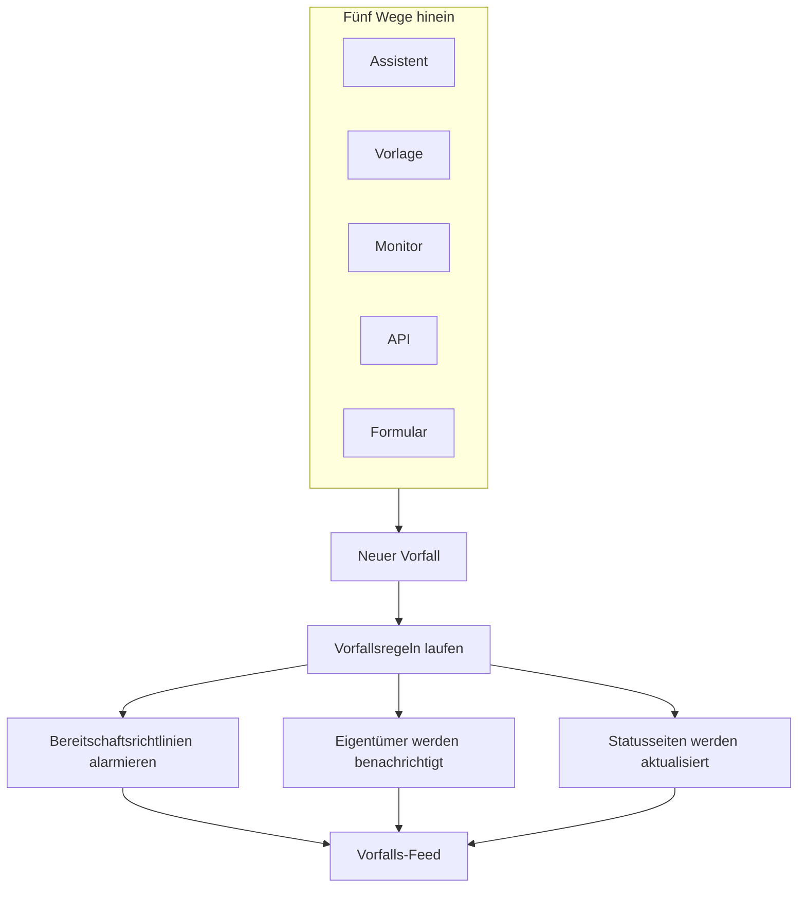
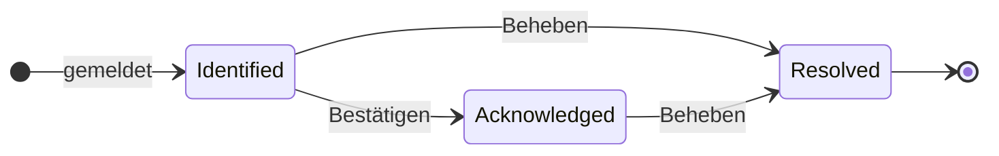

# Vorfälle – Übersicht

Ein Vorfall ist der Datensatz, mit dem Ihr Team arbeitet, wenn etwas kaputtgeht: was betroffen ist, wie schlimm es ist, wo die Reaktion steht, wem er gehört und alles, was unterwegs festgehalten wird. Wenn Sie einen Vorfall melden, wird die richtige Bereitschaftsrotation alarmiert, seine Eigentümer werden informiert und – wenn Sie das möchten – der Ausfall erscheint auf Ihrer Statusseite, damit Kunden wissen, dass Sie daran arbeiten.

:::cards
- [Einen Vorfall melden](/docs/incidents/declaring-incidents): Von Hand, aus einer Vorlage, von einem Monitor, über die API oder per Formular.
- [Vorfallstatus & Schweregrade](/docs/incidents/states-and-severities): Der Lebenszyklus und was Bestätigen und Beheben bewirken.
- [Vorfallnotizen, Eigentümer & Feed](/docs/incidents/notes-owners-and-feed): Updates für Kunden und für Ihr Team, und wer davon erfährt.
- [Verknüpfte Warnungen](/docs/incidents/linked-alerts): Die Warnungen, die ein Ausfall ausgelöst hat, an den Vorfall knüpfen, der sie erklärt.
- [Vorfalleinstellungen & Automatisierung](/docs/incidents/settings): Vorlagen, benutzerdefinierte Felder, Rollen, Messungen und Regeln.
:::

## Auf einen Blick

- **Ein eigenes Produkt** – öffnen Sie **Vorfälle** über das Menü **Produkte** in der oberen Leiste; die Liste liegt unter `/dashboard/{projectId}/incidents`.
- **Drei vorangelegte Status** – **Identifiziert**, **Bestätigt** und **Behoben** werden für jedes neue Projekt angelegt. Sie können eigene ergänzen; die drei vorangelegten lassen sich umbenennen und umfärben, aber nie löschen.
- **Drei vorangelegte Schweregrade** – **Critical Incident**, **Major Incident** und **Minor Incident**. Ein Schweregrad ist eine Beschriftung mit Farbe und Reihenfolge – er bringt kein eigenes Verhalten mit.
- **Fünf Wege hinein** – der Assistent **Vorfall melden**, **Aus Vorlage erstellen**, eine Kriterienregel eines Monitors, `POST /api/incident` oder ein [Formular](/docs/forms/index), das jeder mit dem Link ausfüllen kann.
- **Pro Projekt nummeriert** – jeder Vorfall erhält eine Vorfallnummer aus einem Zähler pro Projekt, angezeigt mit dem Präfix Ihres Projekts: `INC-42` in einem neuen Projekt oder `#42` ohne Präfix.
- **Zwei Arten von Notizen** – private Notizen (interne Notizen) für Ihr Team, öffentliche Notizen für Statusseiten-Abonnenten.
- **Warnungen werden mit Vorfällen verknüpft** – verknüpfen Sie die Warnungen, die zu einem Vorfall gehören, oder melden Sie einen Vorfall direkt aus Warnungen – aus einer Warnungsliste oder von der Seite einer Warnung – und bestätigen Sie sie dabei. Siehe [Verknüpfte Warnungen](/docs/incidents/linked-alerts).
- **Die Einstellungen liegen unter Vorfälle, nicht in den Projekteinstellungen** – Status, Schweregrade, Vorlagen, benutzerdefinierte Felder und die Regel-Engines finden Sie alle unter **Vorfälle → Einstellungen** und **Vorfälle → Regeln**.

## So funktioniert es

Sie können einen Vorfall um 3 Uhr nachts von Hand melden oder ihn von einem Monitor melden lassen, sobald dessen Kriterien zutreffen. So oder so ist der Vorfall dasselbe Objekt, mit demselben Lebenszyklus und derselben Spur am Ende.

### 1. Er wird gemeldet

Fünf Wege führen zum selben Objekt:

- **Von Hand** – klicken Sie in der Vorfallliste auf **Vorfall melden**. Das öffnet den Assistenten **Neuen Vorfall melden** mit drei Schritten: **Vorfalldetails**, **Betroffene Ressourcen**, **Bereitschaft & Rollen**. Der erste Schritt fragt nach Titel, Schweregrad und Beschreibung; was die meisten Vorfälle nie brauchen, ist unter **Weitere Felder** eingeklappt. Nur der erste Schritt fragt etwas ab, das Sie beantworten müssen: **Weiter** führt durch den Rest, und **Vorfall melden** steht auf der Zusammenfassung am Ende.
  - **Aus Warnungen** – **Vorfall melden** auf einer Auswahl von Warnungen oder in der Kopfzeile einer Warnung öffnet denselben Assistenten, vorausgefüllt aus den Warnungen, verknüpft sie mit dem neuen Vorfall und bestätigt sie – sofern Sie das Häkchen nicht entfernen –, damit ihre Eskalation stoppt. Siehe [Verknüpfte Warnungen](/docs/incidents/linked-alerts).
- **Aus einer Vorlage** – klicken Sie auf **Aus Vorlage erstellen** und wählen Sie eine gespeicherte **Vorfallsvorlage**. Vorlagen füllen Titel, Beschreibung, Schweregrad, Anfangsstatus, Ressourcen, Bereitschaftsrichtlinien, Eigentümer und Beschriftungen vor.
- **Von einem Monitor** – eine Kriterienregel eines Monitors mit eingeschaltetem Schalter „Vorfall deklarieren“ erstellt den Vorfall automatisch, sobald ihre Filter zutreffen. Titel und Beschreibungen unterstützen dort `{{variable}}`-Vorlagen.
- **Über die API** – `POST /api/incident` mit einem API-Schlüssel. Der Server füllt `declaredAt`, den Erstellungsstatus und die Vorfallnummer für Sie aus.
- **Per Formular** – jemand außerhalb Ihres Teams füllt ein Formular aus, das Sie als Link geteilt haben, ohne OneUptime-Konto. Der Vorfall wird vor Statusseiten verborgen gemeldet, aus der Vorfallsvorlage des Formulars, falls es eine hat. Siehe [Formulare](/docs/forms/index).

Auch Integrationen öffnen Vorfälle: [Huntress](/docs/integrations/huntress) macht aus jedem Vorfallbericht, den sein SOC sendet, einen Vorfall, der die von Ihnen gewählten Bereitschaftsrichtlinien alarmiert. Die Schritt-für-Schritt-Beschreibung aller Felder finden Sie unter [Einen Vorfall melden](/docs/incidents/declaring-incidents).

### 2. Die richtigen Leute erfahren davon

Beim Anlegen führt OneUptime die Automatisierung aus, die Sie konfiguriert haben: Datenschutzregeln, Eigentümerregeln, Beschriftungsregeln, Bereitschaftsregeln und Runbook-Regeln. Alle Bereitschaftsrichtlinien am Vorfall – von Hand angehängt, aus einer Vorlage übernommen oder von einer zutreffenden Bereitschaftsregel hinzugefügt – werden parallel ausgeführt.

Eigentümer werden über die Kanäle benachrichtigt, die jeder von ihnen unter **Benutzereinstellungen → Benachrichtigungseinstellungen** eingeschaltet hat: E-Mail, SMS, Sprachanruf, Push, WhatsApp, Telegram, Slack, Microsoft Teams oder Webhook. Hat ein Vorfall überhaupt keine Eigentümer, geht die Benachrichtigung an die Projekteigentümer, statt verloren zu gehen.

Ist der Vorfall auf einer Statusseite sichtbar und sind Abonnentenbenachrichtigungen eingeschaltet, erfahren es auch die Abonnenten: die Abonnenten jeder Statusseite, die einen seiner Monitore führt, oder nur die der Seiten, auf die Sie ihn beschränkt haben. Unter [Eine Statusseite pro Zielgruppe](/docs/status-pages/one-status-page-per-audience) erfahren Sie, wie Sie jeder Zielgruppe ihre eigene Statusseite geben.

> [!NOTE]
> Benachrichtigungen werden per Cronjob jede Minute versendet. Rechnen Sie also mit bis zu etwa einer Minute Verzögerung statt mit einem sofortigen Versand.

### 3. Ihr Team arbeitet ihn ab

Responder bestätigen den Vorfall, hängen betroffene Ressourcen an, verknüpfen die Warnungen, die dazugehören, führen Runbooks aus, vergeben Vorfallsrollen und halten fest, was sie herausfinden – private Notizen für das Team, öffentliche Notizen für Kunden, dazu die Seiten **Grundursache** und **Behebung**, sobald das Bild klarer wird. Alles, was sie tun, landet im **Vorfalls-Feed** auf der Seite **Übersicht**.

### 4. Er wird behoben

Ein Klick auf **Beheben** setzt den Vorfall in den behobenen Status, versieht die Statuszeitachse mit einem Zeitstempel, stoppt die Dauer, gibt die Monitore frei, die er hält, und entfernt den Vorfall aus dem aktiven Bereich jeder Statusseite, auf der er angezeigt wurde. Dafür muss sich sonst nichts ändern – eine Statusseite zeigt nur Vorfälle in einem Status über dem behobenen Status. Siehe [Was Beheben bewirkt](/docs/incidents/states-and-severities#was-beheben-bewirkt).

Danach können Sie ein Postmortem schreiben und es optional auf der Statusseite veröffentlichen.

## Wichtige Begriffe

Eine Handvoll Begriffe taucht auf jeder weiteren Seite dieses Abschnitts auf. Klären Sie diese zuerst.

| Begriff | Bedeutung |
| ---------------------- | --------------------------------------------------------------------------------------------------------------------------------------------------- |
| **Vorfall** | Der Datensatz selbst – Titel, Beschreibung, Schweregrad, aktueller Status, betroffene Ressourcen und alles, was während der Reaktion dazu geschrieben wird. |
| **Vorfallsstatus** | Wo der Vorfall in seinem Lebenszyklus steht. Ein projektbezogener Datensatz mit Name, Farbe und `order`, dazu die Flags, die ihm Bedeutung geben. |
| **Vorfallsschweregrad** | Wie schlimm es ist. Ein projektbezogener Datensatz mit Name, Farbe und `order`. Reine Klassifizierung – nichts im Produkt behandelt einen Schweregrad besonders. |
| **Vorfallnummer** | Ein Zähler pro Projekt, angezeigt als `#42` oder, mit einem von Ihnen konfigurierten Präfix, als `INC-42`. |
| **Betroffene Ressourcen** | Die Monitore, Hosts, Kubernetes-Cluster, Docker-Hosts, Dienste und weitere Infrastruktur, die Sie an den Vorfall hängen. |
| **Öffentliche Notiz** | Ein Update für Leser und Abonnenten der Statusseite. Es erscheint in der Zeitachse der Statusseite. |
| **Private Notiz** | Eine interne Notiz (das Modell `IncidentInternalNote`) für das reagierende Team. Sie erreicht nie eine Statusseite. |
| **Eigentümer** | Ein Benutzer oder Team, das für den Vorfall verantwortlich ist. Eigentümer werden bei der Erstellung, bei neuen Notizen und bei Statuswechseln benachrichtigt. |
| **Vorfalls-Feed** | Die nur ergänzbare Aktivitätszeitachse auf der **Übersicht** des Vorfalls, die Statuswechsel, Notizen, Eigentümerwechsel, Regelausführungen und Benachrichtigungen festhält. |
| **Statuszeitachse** | Der Nachweis, in welchem Status der Vorfall wann und wie lange war – mit dem Benachrichtigungsstatus der Abonnenten für jeden Übergang. |
| **Verknüpfte Warnung** | Eine Warnung, die als Teil der Reaktion mit dem Vorfall verknüpft ist. Eine Warnung kann mit mehr als einem Vorfall verknüpft sein und behält ihren eigenen Status. |

## Die drei Status, die OneUptime für jedes Projekt anlegt

Beim Anlegen eines Projekts erzeugt OneUptime genau drei Vorfallsstatus, in dieser Reihenfolge:

| Status | Reihenfolge | Farbe | Bedeutung |
| ---------------- | ----- | ------------------ | ------------------------------------------------------------------------- |
| **Identifiziert** | 1 | Rot (`#fd625e`) | Der Status, in dem ein brandneuer Vorfall landet. Das ist der Erstellungsstatus. |
| **Bestätigt** | 2 | Gelb (`#ffbf53`) | Jemand hat den Vorfall übernommen und arbeitet daran. |
| **Behoben** | 3 | Grün (`#2ab57d`) | Der Vorfall ist vorbei. Erst das Beheben nimmt ihn von Ihrer Statusseite. |

Die Namen sind nur Beschriftungen – was das Verhalten tatsächlich steuert, sind drei boolesche Werte am Status: `isCreatedState`, `isAcknowledgedState` und `isResolvedState`. Pro Projekt soll jeweils nur ein Status jedes Flag tragen.

Diese Unterscheidung ist wichtiger, als sie klingt:

- `isCreatedState` bestimmt, wo ein neuer Vorfall beginnt. Wird beim Anlegen kein Status ausdrücklich gewählt, sucht OneUptime den Erstellungsstatus des Projekts und verwendet ihn.
- `isAcknowledgedState` und `isResolvedState` kennzeichnen den bestätigten und den behobenen Status. Wo der Status eines Vorfalls im Verhältnis zu ihnen steht, steuert die Schaltflächen **Bestätigen** und **Beheben** in der Kopfzeile des Vorfalls, die beiden Kennzahlenkacheln auf der **Übersicht** des Vorfalls und den Zähler **Aktive Vorfälle** im Seitenmenü: Ein Vorfall im bestätigten Status oder einem Status danach ist bestätigt, und einer im behobenen Status oder einem Status danach ist behoben.
- **Aktive Vorfälle** ist schlicht definiert als „der aktuelle Status liegt über dem behobenen Status“. Ein eigener Status, den Sie über dem behobenen Status einfügen, ist daher aktiv; einer, den Sie danach platzieren, zählt – wie der behobene Status selbst – als behoben.

> [!NOTE]
> Der erste vorangelegte Status heißt **Identifiziert**, auch wenn einige Beschreibungen im Produkt ihn noch Erstellungsstatus („created“) nennen. Wenn Sie in der Statusliste Ihres Projekts „Created“ suchen: Es ist die Zeile namens **Identifiziert**.

Eigene Status legen Sie unter **Vorfälle → Einstellungen → Vorfallsstatus** an. Ein neuer Status wird direkt über dem behobenen Status eingefügt, und Sie ordnen die Zeilen per Ziehen um; die Spalte **Zählt als** zeigt, was ein Vorfall in jedem Status zählt – nicht bestätigt, bestätigt oder behoben. Die drei markierten Status tragen das Etikett **Vordefiniert**: Sie behalten ihre Reihenfolge und lassen sich nicht löschen, aber Sie können sie umbenennen, umfärben und verschieben – deshalb liest die Oberfläche Statusnamen dynamisch.

Die Reihenfolge wird durchgesetzt, sie ist keine Kosmetik: Ein Vorfall kann nicht in einen Status wechseln, der in der Reihenfolge vor seinem aktuellen liegt. Alle Einzelheiten stehen unter [Vorfallstatus & Schweregrade](/docs/incidents/states-and-severities).

## Die drei Schweregrade, die OneUptime für jedes Projekt anlegt

Jedes neue Projekt erhält außerdem drei Schweregrade:

| Schweregrad | Reihenfolge | Farbe | Bedeutung |
| --------------------- | ----- | ------------------ | ---------------------------------------------------------- |
| **Critical Incident** | 1 | Kastanienrot (`#b70400`) | Sehr hohe Auswirkung auf Kunden, sofortige Reaktion nötig. |
| **Major Incident** | 2 | Rot (`#fd625e`) | Erhebliche Auswirkung, meist ist eine sofortige Reaktion nötig. |
| **Minor Incident** | 3 | Gelb (`#ffbf53`) | Geringe Auswirkung, meist innerhalb der Arbeitszeit erledigt. |

Schweregrade haben `name`, `description`, `color` und `order` – und sonst nichts. Es gibt keine Flags, und kein Codepfad behandelt „Critical Incident“ anders als eine andere Zeile. Der Schweregrad ist das Mittel der Menschen zur Priorisierung und steht als Kriterium zur Verfügung, wenn Sie Bereitschaftsregeln schreiben – aber die Wahl eines Schweregrads alarmiert für sich genommen niemanden.

Schweregrade bearbeiten oder ergänzen Sie unter **Vorfälle → Einstellungen → Vorfallsschweregrad**. Die vollständigen vorangelegten Beschreibungen stehen unter [Vorfallstatus & Schweregrade](/docs/incidents/states-and-severities).

## Wo Vorfälle im Dashboard liegen

Öffnen Sie **Vorfälle** über das Menü **Produkte** in der oberen Leiste. Das Seitenmenü ist in Abschnitte gegliedert:

| Abschnitt | Was Sie dort tun |
| ------------- | -------------------------------------------------------------------------------------------------------------------------------------------------------------------------- |
| **Übersicht** | **Alle Vorfälle** und **Aktive Vorfälle** – Letztere trägt ein rotes Badge mit der Anzahl der Vorfälle in einem Status über dem behobenen Status. |
| **Episoden** | Vorfallsepisoden, eine eigene Funktion zur Gruppierung mit eigenen Seiten. |
| **KI** | **Einblicke**, **Protokolle**, **Einstellungen**: was die OneUptime-KI aus Ihren Vorfällen gelernt und alles, was sie für sie getan hat, und was sie selbstständig tun darf – mit den Regeln, welche Vorfälle sie untersucht und behebt. Siehe [AI SRE](/docs/ai/ai-sre). |
| **Arbeitsbereich** | Die Chat-Arbeitsbereiche, die dieses Projekt verbunden hat: **Slack**, **Microsoft Teams** oder beide, jeweils mit ihren Benachrichtigungsregeln für Vorfälle. Ist keiner verbunden, enthält er **Slack oder Teams verbinden**, eine Seite, die beide zeigt und erklärt, wie man sie verbindet. |
| **Integrationen** | Werkzeuge, die selbst Vorfälle öffnen: **Huntress**, dessen Vorfallberichte zu Vorfällen werden, die die Bereitschaft alarmieren. Siehe [Huntress](/docs/integrations/huntress). |
| **Regeln** | Die Regel-Engines: **Gruppierungsregeln**, **Bereitschaftsregeln**, **Eigentümerregeln**, **Runbook-Regeln**, **Datenschutzregeln**, **Beschriftungsregeln**, **SLA-Regeln**, **Erinnerungsregeln**. |
| **Einstellungen** | **Vorfallsstatus**, **Vorfallsschweregrad**, **Vorfall-Vorlagen**, **Notiz-Vorlagen**, **Postmortem-Vorlagen**, **Benutzerdefinierte Felder**, **Vorfallsrollen**, **Messungen**, **Verknüpfte Warnungen**, **Nummernpräfix**. |

**Übersicht** und **Episoden** sind geöffnet; **KI**, **Arbeitsbereich**, **Integrationen**, **Regeln**, **Einstellungen** und **Entwickler** sind standardmäßig eingeklappt, damit das Menü mit den Listen beginnt, die Sie täglich nutzen. Klicken Sie auf den Titel eines Abschnitts, um ihn aufzuklappen und die Seiten zu finden, auf die sich der Rest dieser Doku bezieht; ein Abschnitt öffnet sich auch von selbst, wenn Sie auf einer seiner Seiten sind. Die Vorfallskonfiguration liegt nicht in den Projekteinstellungen, sondern vollständig hier.

Die Vorfallliste selbst zeigt **Vorfallnummer**, **Titel**, **Status**, **Schweregrad**, **Betroffene Ressourcen**, **Erklärt**, **Dauer**, **Beschriftungen** und **Eigentümer**, mit der Massenaktion **Status ändern**, um mehrere auf einmal zu schließen.

## Was jede Seite eines Vorfalls zeigt

Öffnen Sie einen Vorfall: Sein eigenes Seitenmenü gruppiert die Seiten so:

| Abschnitt im Seitenmenü | Seiten |
| ----------------- | ----------------------------------------------------------------------------------------- |
| **Übersicht** | **Übersicht**, **Zustands-Zeitachse**, **SLA** |
| **Untersuchung** | **Beschreibung**, **Grundursache**, **Behebung**, **Runbooks**, **Postmortem**, **Verknüpfte Warnungen** |
| **Team** | **Rollen**, **Bereitschaftsausführungen**, **Eigentümer** |
| **Benachrichtigungen** | **Benachrichtigungsprotokolle**, **KI-Protokolle** – eingeklappt, bis Sie auf **Benachrichtigungen** klicken |
| **Notizen** | **Private Notizen**, **Öffentliche Notizen** |
| **Entwickler** | **Terraform**, **API**, **KI-Assistenten** – eingeklappt, bis Sie auf **Entwickler** klicken |
| **Erweitert** | **Benutzerdefinierte Felder**, **Einstellungen**, **Audit-Protokolle**, **Vorfall löschen** – eingeklappt, bis Sie auf **Erweitert** klicken |

Was jede davon enthält:

- **Übersicht** – die Reaktion auf einen Blick. Unter der Kopfzeile zeigen Kennzahlenkacheln die Zeit bis zur Bestätigung, die Zeit bis zur Behebung und die gesamte **Dauer**. Die Karte **KI-Untersuchung** führt die Seite an – was die OneUptime-KI gefunden hat oder warum sie nicht gestartet ist –, darunter der **Vorfalls-Feed**. Daneben stehen die Karte **Videoanruf**, die Karte **Vorfalldetails** (Titel, Schweregrad, Beschriftungen, Vorfallnummer, gemeldet am, gemeldet von, Bereitschaftsrichtlinien und die ID des Vorfalls in einer kleinen **ID**-Zeile am Fuß, mit einem Klick in der Zwischenablage), **Vorfallsrollen**, eine Karte **Betroffene Ressourcen** und die benutzerdefinierten Felder des Vorfalls. Hat Ihr Projekt [Messungen](/docs/incidents/settings#messungen), zeigt eine Karte **Messungen** unter **Vorfalldetails**, was jede für diesen Vorfall anzeigt: **12 Minuten**, **Läuft bereits 5 Minuten**, **Nicht erreicht**.
- **Zustands-Zeitachse** – jeder Status, in dem der Vorfall war, mit **Beginnt am**, **Endet am**, **Dauer** und dem Benachrichtigungsstatus der Abonnenten für jeden Übergang. **Ursache anzeigen** und **Protokolle anzeigen** erklären, warum es zu jeder Änderung kam.
- **SLA** – SLA-Verfolgung für diesen Vorfall.
- **Beschreibung**, **Grundursache**, **Behebung** – drei Markdown-Seiten. Die Beschreibung ist diejenige, die auf Ihrer Statusseite erscheint.
- **Runbooks** – Runbook-Ausführungen, die an diesen Vorfall gehängt sind.
- **Postmortem** – der Bericht und seine Anhänge, die Sie optional auf der Statusseite veröffentlichen können. **Postmortem-Notiz bearbeiten** fragt nach der Notiz und den Anhängen, dann nach **Auf Statusseite veröffentlichen**; nur solange das eingeschaltet ist, fragt es nach **Abonnenten benachrichtigen** und **Postmortem veröffentlicht am**, das beim Einschalten der Veröffentlichung auf jetzt gesetzt wird. **Mit KI generieren** entwirft die Notiz für Sie, und **Vorlage anwenden** – angezeigt, sobald das Projekt eine Postmortem-Vorlage hat – beginnt sie mit einer Vorlage. Abonnenten werden einmal informiert, wenn das Postmortem veröffentlicht wird: beim ersten Mal, wenn die Statusseite es zeigt, wofür **Auf Statusseite veröffentlichen** eingeschaltet und eine Notiz geschrieben sein muss. Erneutes Speichern oder Bearbeiten, während es veröffentlicht ist, aktualisiert die Statusseite und informiert niemanden; erneutes Veröffentlichen, nachdem es von der Statusseite genommen wurde, informiert sie wieder. Eines, das veröffentlicht wurde, während der Vorfall verborgen ist, wird gesendet, sobald der Vorfall sichtbar wird. Siehe [Das Postmortem](/docs/status-pages/subscribers#vorfälle).
- **Verknüpfte Warnungen** – die mit diesem Vorfall verknüpften Warnungen, mit dem aktuellen Status jeder Warnung und wer sie wann verknüpft hat. Warnungen haben eine passende Seite **Verknüpfte Vorfälle**. Siehe [Verknüpfte Warnungen](/docs/incidents/linked-alerts).
- **Rollen**, **Bereitschaftsausführungen**, **Eigentümer** – wer daran arbeitet, welche Richtlinien ausgelöst wurden und wer benachrichtigt wird.
- **Benachrichtigungsprotokolle**, **KI-Protokolle**, **Audit-Protokolle** – was gesendet wurde und was sich geändert hat.
- **Private Notizen** und **Öffentliche Notizen** – was Ihrem Team und Ihren Kunden mitgeteilt wurde. Siehe [Vorfallnotizen, Eigentümer & Feed](/docs/incidents/notes-owners-and-feed).
- **Benutzerdefinierte Felder**, **Einstellungen**, **Vorfall löschen** – die Seite **Einstellungen** enthält **Auf Statusseite sichtbar** und **Privater Vorfall**, die Karte **Statusseiten-Umfang**, die den Vorfall auf einige Statusseiten beschränkt, und die Karte **Erinnerungen**, deren Schalter **Erinnerungen senden** beim Umschalten sofort speichert und zeigt, wann die nächste Erinnerung verschickt wird.

## Wie Vorfälle mit dem Rest von OneUptime zusammenspielen

- **Monitore entdecken das Problem; Vorfälle halten es fest.** Eine Kriterienregel eines Monitors kann automatisch einen Vorfall melden und Titel, Schweregrad, Bereitschaftsrichtlinien, Eigentümer, Beschriftungen und Behebungsnotizen vorausfüllen. Die dort verfügbaren Variablen finden Sie unter [Vorfall- & Warnmeldungsvorlagen](/docs/monitor/incident-alert-templating).
- **Warnungen sind die Signale; Vorfälle sind die Reaktion.** Verknüpfen Sie die Warnungen, die ein Vorfall erklärt, von beiden Seiten aus mit ihm, und zwei Projektschalter, in neuen Projekten eingeschaltet, bestätigen und beheben diese Warnungen zusammen mit dem Vorfall. Siehe [Verknüpfte Warnungen](/docs/incidents/linked-alerts).
- **Bereitschaftsrichtlinien alarmieren.** Hängen Sie Richtlinien im Schritt **Bereitschaft & Rollen** des Melde-Assistenten, an einer Vorlage oder über **Vorfälle → Regeln → Bereitschaftsregeln** an. Jede zutreffende Regel wird ausgelöst – ausgeführt wird die Vereinigung aller Treffer plus allem, was direkt angehängt ist, ohne Duplikate.
- **Runbooks sagen den Leuten, was zu tun ist.** Runbook-Regeln hängen automatisch ein Verfahren an, wenn ein passender Vorfall angelegt wird, und Responder können eines von Hand aus dem Vorfall starten. Siehe [Runbooks – Übersicht](/docs/runbooks/index).
- **Statusseiten informieren Kunden.** Ein Vorfall erscheint in der aktiven Liste einer Statusseite, wenn die Seite einen seiner Monitore führt, auf der Seite Vorfälle eingeschaltet sind, der Vorfall als auf der Statusseite sichtbar markiert ist und sein aktueller Status über dem behobenen Status liegt. Ein Vorfall, der auf einige Statusseiten beschränkt ist, erscheint nur auf diesen. Private Vorfälle sind auf jeder Statusseite immer verborgen. Siehe [Statusseiten – Übersicht](/docs/status-pages/index) und [Eine Statusseite pro Zielgruppe](/docs/status-pages/one-status-page-per-audience).
- **Workflows automatisieren drumherum.** Mit den Triggern **On Create Incident**, **On Update Incident** und **On Delete Incident** bauen Sie No-Code-Automatisierung auf dem Lebenszyklus des Vorfalls auf. Siehe [Workflows – Übersicht](/docs/workflows/index).

## Nächste Schritte

:::cards
- [Einen Vorfall melden](/docs/incidents/declaring-incidents): Den Assistenten Feld für Feld durchgehen, oder aus einer Vorlage, einem Monitor oder der API melden.
- [Vorfallstatus & Schweregrade](/docs/incidents/states-and-severities): Eigene Status anlegen und genau sehen, was jeder bewirkt.
- [Statusseiten – Übersicht](/docs/status-pages/index): Wie Vorfälle Ihre Kunden erreichen.
- [Abonnenten & Ankündigungen](/docs/status-pages/subscribers): Wer benachrichtigt wird, wenn sich ein Vorfall bewegt.
:::
