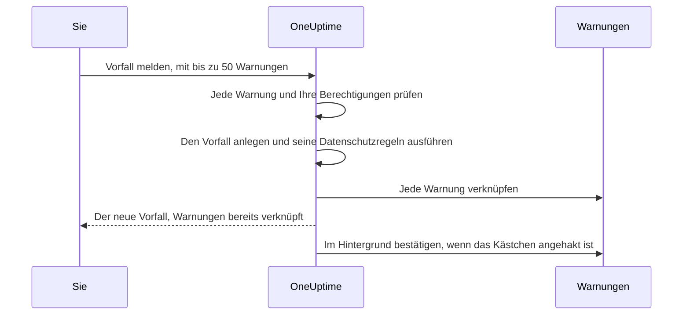

# Verknüpfte Warnungen

Ein Ausfall löst selten nur eine Warnung aus. Fällt die primäre Datenbank aus, schlägt der Monitor für die Replikationsverzögerung an, der Monitor für die API-Fehlerrate schlägt an, und das SLO für die Checkout-Latenz beginnt sein Budget zu verbrennen – drei Warnungen, ein Problem. Diese Warnungen mit dem Vorfall zu verknüpfen sagt genau das: Der Vorfall ist der Ort der Reaktion, und jede Warnung zeigt, welcher Vorfall sie erklärt.

Eine Verknüpfung ist nur eine Verknüpfung. Die Warnung behält ihren eigenen Status, ihre Eigentümer, Bereitschaftsrichtlinien, Notizen und ihren Feed; der Vorfall behält seine. Verknüpfen führt nichts zusammen und kopiert nichts, und für sich allein bestätigt, behebt oder stummschaltet es nie eine Warnung. (Einen neuen Vorfall aus Warnungen zu melden ist anders: Der neue Vorfall wird aus ihnen vorausgefüllt, wie [unten beschrieben](#einen-vorfall-aus-warnungen-melden), und sofern Sie das Häkchen im Formular nicht entfernen, werden die Warnungen beim Melden bestätigt, was ihre Eskalation stoppt – siehe [Die Warnungen beim Melden bestätigen](#die-warnungen-beim-melden-bestätigen).) Zwei Projektschalter, in neuen Projekten eingeschaltet, bewegen die verknüpften Warnungen mit, wenn der Vorfall bestätigt und behoben wird – siehe [weiter unten](#warnungsstatus-mit-dem-vorfall-synchron-halten).

:::cards
- [Warnungen mit einem Vorfall verknüpfen](#warnungen-von-einem-vorfall-aus-verknüpfen): Vom Vorfall aus, von der Warnung aus oder viele auf einmal.
- [Einen Vorfall aus Warnungen melden](#einen-vorfall-aus-warnungen-melden): Ein neuer Vorfall, vorausgefüllt und in einem Zug verknüpft.
- [Warnungsstatus synchron halten](#warnungsstatus-mit-dem-vorfall-synchron-halten): Die Warnungen zusammen mit dem Vorfall bestätigen und beheben.
- [Berechtigungen](#berechtigungen): Wer verknüpfen darf und was ihm das Verknüpfen erlaubt.
:::

> [!TIP]
> Wenn Sie von Opsgenie kommen: Das ist die OneUptime-Version davon, Warnungen einem Vorfall zuzuordnen.

## Auf einen Blick

- **Viele zu viele** – ein Vorfall kann beliebig viele verknüpfte Warnungen haben, und eine Warnung kann mit mehreren Vorfällen verknüpft sein.
- **Drei Orte zum Verknüpfen** – die Seite **Verknüpfte Warnungen** des Vorfalls, die Seite **Verknüpfte Vorfälle** der Warnung und die Massenaktion **Mit Vorfall verknüpfen** in den Hauptlisten der Warnungen, für bis zu **50** Warnungen auf einmal.
- **Einen Vorfall aus Warnungen melden** – **Vorfall melden** in einer Warnungsliste, in der Kopfzeile einer Warnung oder auf ihrer Seite **Verknüpfte Vorfälle** füllt einen neuen Vorfall aus den Warnungen vor und verknüpft sie beim Anlegen. Ein standardmäßig angehaktes Kästchen im Formular bestätigt sie außerdem, was ihre eigene Bereitschaftseskalation stoppt.
- **Auf beiden Seiten festgehalten** – jedes Verknüpfen und Lösen schreibt einen Feed-Eintrag am Vorfall und an der Warnung, außer dass ein aus Warnungen gemeldeter Vorfall einen Eintrag erhält, der sie alle listet. Nur die Einträge des Vorfalls werden in Slack und Microsoft Teams gepostet, und der Titel einer privaten Warnung oder eines privaten Vorfalls wird nie auf der anderen Seite geschrieben.
- **Warnungsstatus folgen dem Vorfall** – zwei Projektschalter, beide in neuen Projekten an, bestätigen und beheben verknüpfte Warnungen, wenn der Vorfall bestätigt und behoben wird. Schalten Sie sie einzeln unter **Vorfälle → Einstellungen → Verknüpfte Warnungen** aus.
- **Automatisierbar** – Verknüpfungen sind eine gewöhnliche API-Ressource, `/api/incident-alert`.

## So funktioniert es

Warnungen sind Signale: Die Kriterien eines Monitors haben zugetroffen, ein SLO hat begonnen, sein Budget zu verbrennen, eine Sicherheitsregel hat angeschlagen. Ein Vorfall ist die koordinierte Reaktion auf ein Problem (siehe [Vorfälle – Übersicht](/docs/incidents/index)). Die meisten Probleme erzeugen mehrere Signale, und ohne Verknüpfungen verbindet sie nur das Gedächtnis von jemandem mit der Reaktion.

```mermaid title="Drei Warnungen, ein Vorfall, und die Schalter, die sie bewegen"
flowchart TB
    subgraph signals["Warnungen"]
        direction LR
        lag["Replikationsverzögerung"]
        errors["API-Fehlerrate"]
        latency["Checkout-Latenz"]
    end
    signals -->|"verknüpft mit"| incident["Vorfall"]
    incident -->|"bestätigt"| ack["Verknüpfte Warnungen bestätigt"]
    incident -->|"behoben"| res["Verknüpfte Warnungen behoben"]
```

Sind die Warnungen verknüpft:

- Sehen Responder am Vorfall in einer Liste, welche Warnungen dazugehören und in welchem Status jede ist.
- Sieht jemand, der eine dieser Warnungen öffnet, dass sie bereits unter welchem Vorfall bearbeitet wird, statt einen zweiten Vorfall für denselben Ausfall zu melden.
- Hält der Feed des Vorfalls fest, wann und von wem jede Warnung verknüpft wurde, sodass die Zeitachse zeigt, wie sich das Bild zusammengesetzt hat.
- Stoppt bei eingeschalteten Schaltern das Bestätigen des Vorfalls die Bereitschaftseskalationen der Warnungen, sodass die Leute am Vorfall nicht erneut durch seine Symptome alarmiert werden.

## Wie Verknüpfungen funktionieren

Eine Verknüpfung verbindet eine Warnung mit einem Vorfall. Verknüpfungen wirken in beide Richtungen – dieselbe Verknüpfung erscheint auf der Seite **Verknüpfte Warnungen** des Vorfalls und auf der Seite **Verknüpfte Vorfälle** der Warnung.

- **Eine Warnung kann mit mehreren Vorfällen verknüpft sein.** Der Ausfall einer gemeinsamen Abhängigkeit kann ein Symptom zweier getrennter Vorfälle sein. Jeder Vorfall listet die Warnung, und die Warnung listet beide Vorfälle.
- **Jedes Paar wird einmal verknüpft.** Eine Warnung mit einem Vorfall zu verknüpfen, mit dem sie schon verknüpft ist, wird mit „This alert is already linked to this incident.“ abgelehnt – auch wenn zwei Personen dasselbe Paar im selben Moment verknüpfen.
- **Verknüpfungen werden angelegt oder entfernt, nie bearbeitet.** Eine Verknüpfung hat außer ihrem Vorfall, ihrer Warnung, dem Zeitpunkt und dem Urheber keine eigenen Felder. Um eine Warnung zu einem anderen Vorfall zu verschieben, verknüpfen Sie sie mit dem neuen und lösen sie vom alten.
- **Verknüpfungen bleiben innerhalb eines Projekts.** Warnung und Vorfall müssen zum selben Projekt gehören.

## Warnungen von einem Vorfall aus verknüpfen

:::steps
### Die Seite Verknüpfte Warnungen des Vorfalls öffnen

Öffnen Sie den Vorfall und wählen Sie **Verknüpfte Warnungen** im Abschnitt **Untersuchung** seines Seitenmenüs. Die Tabelle listet jede bereits verknüpfte Warnung.

### Die Warnung auswählen

Klicken Sie auf **Warnung verknüpfen** und wählen Sie sie im Dropdown **Warnung**. Das Dropdown listet die neuesten Warnungen zuerst, jede mit ihrer Nummer – etwa `ALT-63: Checkout API is offline` –, damit sich Warnungen mit gleichem Titel, wie die wiederholten Warnungen eines Monitors, unterscheiden lassen. Um eine ältere Warnung zu finden, tippen Sie: Das Dropdown durchsucht alle Warnungen nach Titel.

### Die Verknüpfung speichern

Klicken Sie im Dialog auf **Warnung verknüpfen**. Die Warnung erscheint in der Tabelle, und beide Feeds halten die Verknüpfung fest. Wird die Verknüpfung abgelehnt, etwa weil die Warnung schon verknüpft ist, bleibt der Dialog offen und sagt, warum.
:::

| Spalte            | Was sie zeigt |
| ----------------- | ------------------------------------------------ |
| **Warnung #**     | Die Warnungsnummer, etwa `#17` oder `ALT-17`. |
| **Titel**         | Der Titel der Warnung, mit Link zur Warnung. |
| **Aktueller Status** | Der eigene Status der Warnung, etwa **Bestätigt**. |
| **Verknüpft am**  | Wann die Warnung verknüpft wurde. |
| **Verknüpft von** | Wer sie verknüpft hat. |

Jede Zeile hat **Warnung anzeigen**, um die Warnung zu öffnen, und **Verknüpfung aufheben**, um die Verknüpfung zu entfernen.

## Vorfälle von einer Warnung aus verknüpfen

Die Warnungsseite spiegelt die Vorfallseite. Öffnen Sie eine Warnung und wählen Sie **Verknüpfte Vorfälle** im Abschnitt **Grundlegend** ihres Seitenmenüs. Die Tabelle listet jeden Vorfall, mit dem die Warnung verknüpft ist, mit Vorfallnummer, Titel und aktuellem Status, und wann und von wem sie verknüpft wurde.

- **Vorfall verknüpfen** verknüpft diese Warnung mit einem bestehenden Vorfall. Sein Dropdown funktioniert wie auf der Vorfallseite: die neuesten Vorfälle zuerst, jeder mit seiner Nummer – etwa `INC-42: Checkout is down` –, und Tippen durchsucht alle Vorfälle nach Titel.
- **Vorfall anzeigen** öffnet einen verknüpften Vorfall.
- **Verknüpfung aufheben** entfernt eine Verknüpfung.
- **Vorfall melden** startet einen neuen Vorfall aus dieser Warnung. Dieselbe Schaltfläche steht in der Kopfzeile der Warnung, neben **Bestätigen** und **Beheben**. Siehe [Einen Vorfall aus Warnungen melden](#einen-vorfall-aus-warnungen-melden).

## Viele Warnungen auf einmal verknüpfen

Die Hauptlisten der Warnungen haben dafür zwei Massenaktionen: **Alle Warnungen** und **Aktive Warnungen**, die aktiven Warnungen auf der Startseite und die Seite **Warnungen** eines Monitors, Dienstes, Hosts, Kubernetes-Clusters, SLOs oder jeder anderen Ressource, die eine hat. Die Liste **Mitglieder-Warnungen** einer Warnungsepisode hat sie nicht – wählen Sie die Warnungen stattdessen in einer der Hauptlisten. Wählen Sie die Warnungen und dann:

- **Mit Vorfall verknüpfen** – wählen Sie den Vorfall im Dropdown **Vorfall** und klicken Sie auf **Warnungen verknüpfen**. Die neuesten Vorfälle stehen zuerst, mit ihren Nummern, und Tippen durchsucht alle Vorfälle nach Titel. OneUptime verknüpft jede gewählte Warnung und zeigt dabei den Fortschritt. Eine Warnung, die schon mit diesem Vorfall verknüpft ist, zählt als erledigt statt als fehlgeschlagen, ein zweiter Durchlauf der Aktion ist also harmlos.
- **Vorfall melden** – öffnet das Meldeformular für einen neuen, aus den gewählten Warnungen vorausgefüllten Vorfall. Siehe den nächsten Abschnitt.

Beide Aktionen nehmen bis zu **50** Warnungen auf einmal. Wählen Sie mehr, sind sie deaktiviert, mit einem Tooltip, der den Grund nennt. Die Obergrenze gibt es, weil jede Verknüpfung in beide Feeds schreibt und jede mit **Mit Vorfall verknüpfen** angelegte Verknüpfung auch in den Slack- und Microsoft-Teams-Kanälen des Vorfalls gepostet wird – eine Auswahl von tausend Warnungen würde sie fluten.

## Einen Vorfall aus Warnungen melden

Stellt sich eine Welle von Warnungen als Vorfall heraus, den noch niemand gemeldet hat, melden Sie ihn aus den Warnungen. Es gibt drei Wege hinein:

- Wählen Sie die Warnungen in einer der Hauptlisten der Warnungen und wählen Sie **Vorfall melden**.
- Öffnen Sie eine Warnung und klicken Sie in ihrer Kopfzeile, neben **Bestätigen** und **Beheben**, auf **Vorfall melden**. Die Schaltfläche bleibt auch stehen, wenn die Warnung bestätigt oder behoben ist, sodass Sie auch nachträglich einen Vorfall zu einer Warnung melden können – etwa, um ein Postmortem dazu zu schreiben.
- Öffnen Sie die Seite **Verknüpfte Vorfälle** einer Warnung und klicken Sie auf **Vorfall melden**.

Alle drei brauchen die Berechtigung, Vorfälle anzulegen und Warnungen mit ihnen zu verknüpfen. Ohne sie ist die Schaltfläche gesperrt, und ihr Tooltip nennt die fehlende Berechtigung.

Welchen Weg Sie auch nehmen, Sie landen im üblichen Formular **Neuen Vorfall melden**, mit den Warnungen als die, die verknüpft werden, und diesen vorausgefüllten Feldern:

| Feld                   | Vorausgefüllt mit |
| ---------------------- | -------------------------------------------------------------------------------------------------------------------------------------------------------------------------------------------------------------------------------------------------------------------------------------- |
| **Titel**              | Eine Warnung: ihr Titel. Mehrere: der Titel der schwersten Warnung. |
| **Beschreibung**       | Eine Warnung: ihre Beschreibung. Mehrere: eine Liste mit einer Zeile je Warnung, mit ihrer Nummer und ihrem Titel. |
| **Vorfallsschweregrad** | Der Schweregrad der schwersten Warnung, übersetzt in einen Vorfallsschweregrad. Ein Vorfallsschweregrad mit demselben Namen, ohne Rücksicht auf Groß- und Kleinschreibung, gewinnt. Sonst nimmt OneUptime den Vorfallsschweregrad an derselben Position in der Reihenfolge der Schweregrade, oder den letzten, wenn Sie weniger Vorfallsschweregrade haben. |
| **Betroffene Ressourcen** | Alle Monitore, Hosts, Kubernetes-Cluster, Docker-Hosts, Podman-Hosts und Dienste der gewählten Warnungen, zusammengeführt. Die Monitore kommen unter **Monitore**, der Rest unter **Andere betroffene Ressourcen**. Andere Ressourcen, etwa SLOs oder VMware-, Proxmox- und Ceph-Cluster, werden nicht kopiert – fügen Sie sie selbst hinzu, wenn der Vorfall sie betrifft. |
| **Beschriftungen**     | Jede Beschriftung jeder gewählten Warnung. |
| **Privater Vorfall**   | An, wenn eine der Warnungen privat ist. Das Formular sagt das, und die Eigentümer der Warnungen werden Eigentümer des Vorfalls – siehe unten. |

„Schwerste“ folgt Ihrer Reihenfolge der Warnungsschweregrade: Der erste Warnungsschweregrad in der Liste ist der schwerste. Mit den Schweregraden, mit denen jedes Projekt startet, wird eine Warnung **Hoch** zu einem **Critical Incident** und eine Warnung **Low** zu einem **Major Incident**.

Vor dem Absenden lässt sich alles bearbeiten. **Beschriftungen** und **Privater Vorfall** stehen unter **Weitere Felder** im ersten Schritt des Formulars, dessen eingeklappte Überschrift jedes davon zeigt, solange es gesetzt ist.

**Eine Warnung, die schon einen Vorfall hat, wird gekennzeichnet.** Da **Vorfall melden** auf der Seite jeder Warnung steht, könnten zwei Responder, die durch denselben Ausfall alarmiert wurden, ihn jeder für sich melden. Daher markiert der Kasten mit den Warnungen jede Warnung, die schon mit einem Vorfall verknüpft ist – „(already linked to Incident INC-42)“, mit Link zu diesem Vorfall – und fügt einen Hinweis hinzu, dessen Wortlaut davon abhängt, wie viele der Warnungen verknüpft sind:

- Alle Warnungen, und es ist eine: „This alert is already linked to an incident. If it is the same problem, update that incident instead of declaring another one.“
- Alle Warnungen, und es sind mehrere: „These alerts are already linked to incidents. If it is the same problem, update that incident instead of declaring another one.“
- Nur einige davon: „Some of these alerts are already linked to an incident. If it is the same problem, link the other alerts to that incident from the alerts list instead of declaring another one.“

Die Vorfall-Links öffnen sich in einem neuen Tab, sodass Sie den bestehenden Vorfall prüfen können, ohne zu verlieren, was Sie im Formular ausgefüllt haben. Der Hinweis ist eine Erinnerung, keine Sperre, und genannt werden nur Vorfälle, die Sie sehen dürfen.

**Bereitschaftsrichtlinien werden nicht kopiert.** Die Warnungen haben ihre eigenen Bereitschaftsrichtlinien beim Anlegen ausgeführt; sie auf den Vorfall zu kopieren würde dieselben Leute ein zweites Mal alarmieren. Die Bereitschaftsrichtlinien des Vorfalls sind die, die Sie im Schritt **Bereitschaft & Rollen** wählen, plus die, die Ihre Bereitschaftsregeln für Vorfälle hinzufügen – genau wie bei jedem anderen Vorfall.

**Die Monitore der Warnungen werden als betroffene Monitore vorausgefüllt.** Wie bei jedem von Hand gemeldeten Vorfall pausiert die aktive Überwachung der Monitore des Vorfalls, bis der Vorfall behoben ist. Entfernen Sie vor dem Absenden einen Monitor aus **Monitore** im Schritt **Betroffene Ressourcen**, wenn er weiter geprüft werden soll.

**Eine private Warnung ergibt einen privaten Vorfall.** Ist eine der Warnungen privat, beginnt **Privater Vorfall** eingeschaltet, und der Kasten mit den Warnungen sagt das. Ein privater Vorfall ist nur für seine Eigentümer, Projekteigentümer und Projektadmins sichtbar; OneUptime stellt daher sicher, dass die Leute, die die Warnungen sehen konnten, auch den Vorfall sehen: Nach dem Melden werden die Eigentümer jeder gemeldeten Warnung – Benutzer wie Teams – als Eigentümer des Vorfalls hinzugefügt, ohne benachrichtigt zu werden. Sie werden direkt nach dem Anlegen der Slack- und Microsoft-Teams-Kanäle des Vorfalls hinzugefügt, sodass sie wie jeder andere Eigentümer in diese Kanäle eingeladen werden. Auch Sie sind Eigentümer, wie bei jedem Vorfall, den Sie melden. Dasselbe geschieht, wenn eine Datenschutzregel für Vorfälle den neuen Vorfall privat macht. Schalten Sie **Privater Vorfall** vor dem Absenden aus und greift keine Datenschutzregel, ist der Vorfall nicht privat, und es werden keine Eigentümer kopiert.



Beim Absenden prüft der Server die Warnungen, bevor er irgendetwas anlegt: höchstens 50, jede eine Warnung in diesem Projekt, die Sie sehen dürfen, und Sie müssen Warnungen mit Vorfällen verknüpfen dürfen. Schlägt eine Prüfung fehl, wird die Anfrage abgelehnt und kein Vorfall angelegt – eine falsche Warnungs-ID verbraucht also nie eine Vorfallnummer. Sobald der Vorfall existiert – und seine Datenschutzregeln gelaufen sind, damit die Verknüpfungen wissen, ob er privat ist –, wird jede Warnung verknüpft, bevor die Anfrage zurückkehrt, sodass die Seite **Verknüpfte Warnungen** des Vorfalls sie bereits listet. Schlägt eine einzelne Verknüpfung fehl – etwa, weil die Warnung einen Moment zuvor gelöscht wurde –, wird der Vorfall trotzdem gemeldet, und die anderen Warnungen werden trotzdem verknüpft.

Der Feed des Vorfalls erhält einen Eintrag **Warnung verknüpft**, der die Warnungen listet und nach **Vorfall erstellt** geschrieben wird, statt einen je Warnung – siehe [Der Feed, Slack und Microsoft Teams](#der-feed-slack-und-microsoft-teams).

### Die Warnungen beim Melden bestätigen

Einen Vorfall zu melden stoppt für sich nicht die Alarmierung durch seine Warnungen: Die Bereitschaftseskalation einer Warnung stoppt erst, wenn die Warnung selbst bestätigt ist. Ist eine der Warnungen also noch nicht bestätigt, hat der Kasten im Formular ein standardmäßig angehaktes Kontrollkästchen – **Acknowledge this alert to stop its escalation** für eine Warnung, **Acknowledge these 3 alerts to stop their escalation** für mehrere. Sind einige davon schon bestätigt, nennt es nur die anderen und sagt, dass der Rest bleibt, wie er ist.

Lassen Sie es angehakt, und sobald der Vorfall gemeldet und die Warnungen verknüpft sind:

- **Werden die Warnungen in Ihrem Namen bestätigt.** Jede wechselt in Ihren Warnungsstatus **Bestätigt**, als hätten Sie selbst auf **Bestätigen** geklickt: **Zustands-Zeitachse** und Feed der Warnung nennen Sie, die Eigentümer der Warnung werden benachrichtigt, und die Änderung wird wie jeder andere Statuswechsel einer Warnung in den Slack- und Microsoft-Teams-Kanälen der Warnung gepostet. Die Ursache lautet „Acknowledged because Incident INC-42 was declared from this alert.“ – oder bei einem privaten Vorfall „Acknowledged because a private incident was declared from this alert.“, damit ein privater Vorfall nie dort genannt wird, wo das Publikum der Warnung es lesen kann.
- **Stoppt ihre eigene Bereitschaftseskalation binnen etwa einer Minute.** Der nächste Eskalationsschritt sieht eine bestätigte Warnung und hält an. Bereits versendete Alarmierungen werden nicht zurückgerufen.
- **Stoppen Erinnerungen nur, wenn die Erinnerungsregel es sagt.** Die Erinnerungen einer Warnung stoppen bei der Bestätigung nur, wenn ihre Erinnerungsregel **Erinnerungen beenden, wenn** auf **Bestätigt** gesetzt hat; sonst laufen sie weiter, bis die Warnung behoben ist.
- **Eskaliert eine Warnungsepisode weiter.** Gehört eine Warnung zu einer Episode, die über ihre eigene Bereitschaftsrichtlinie alarmiert, eskaliert die Episode weiter, bis die Episode selbst bestätigt ist.
- **Bleiben bereits bestätigte oder behobene Warnungen unberührt.** Wie überall werden Status nach ihrer Reihenfolge verglichen, eine Warnung in einem eigenen Status nach **Bestätigt** zählt also als bestätigt, und nichts wird je rückwärts bewegt.

Entfernen Sie das Häkchen, um zu melden, ohne zu bestätigen. Wann immer Warnungen unbestätigt bleiben – das Kästchen ist nicht angehakt oder gesperrt –, sagt das Formular: „Declaring the incident does not acknowledge the alert: it keeps escalating until it is acknowledged.“ Und bestätigen Sie die Warnungen, ohne eine Bereitschaftsrichtlinie für den Vorfall zu wählen, weist die Zusammenfassung des Schritts **Bereitschaft & Rollen** darauf hin: „The alerts it is declared from are acknowledged too, so their own escalation stops. An alert episode they belong to keeps escalating until the episode is acknowledged, and an incident on-call rule, if any, may still page.“

**Sie brauchen die Berechtigung, die Warnungen zu bestätigen.** Sie beim Melden zu bestätigen erfordert **Create Alert State Timeline** und **Edit Alert** (eine Warnung auf ihrer eigenen Seite zu bestätigen erfordert nur das Erste: siehe [Einen Status ändern](/docs/permissions/index#einen-status-ändern)): Project Owner, Project Admin, Project Member, Alert Admin und Alert Member haben beide, Incident Admin und Incident Member, die Vorfälle aus Warnungen melden können, haben keine davon. Auch Ihr Beschriftungs- und Eigentümerumfang bei Warnungen muss jede Warnung einschließen, die bestätigt wird – geprüft werden nur die noch nicht bestätigten. Bereits bestätigte oder behobene Warnungen brauchen keine Berechtigung und blockieren das Melden nie. Ohne die Berechtigungen ist das Kästchen gesperrt, mit einem Tooltip, der die fehlende nennt, und Sie können den Vorfall trotzdem melden. Der Server prüft vor dem Anlegen erneut, für jede Warnung, die er bestätigen wird: Dürfen Sie eine davon nicht bestätigen, wird kein Vorfall angelegt, und das Formular sagt, warum – entfernen Sie das Häkchen und senden Sie erneut.

**Das Projekt braucht einen Warnungsstatus Bestätigt.** Jedes Projekt startet mit einem. Hat Ihres keinen, wird das Kästchen nicht angeboten.

Die Warnungen werden im Hintergrund bestätigt, direkt nach dem Verknüpfen, einige auf einmal – bis zu 5 gleichzeitig –, sodass sich die Seite des Vorfalls einen Moment früher öffnen kann und das Melden aus vielen Warnungen die letzten nicht hinter allen anderen warten lässt. Eine Warnung, die sich nicht bestätigen lässt – etwa weil sie inzwischen gelöscht wurde –, wird protokolliert und hält weder die anderen noch den Vorfall auf, und eine Warnung, die inzwischen jemand anderes bestätigt oder behoben hat, bleibt, wie er sie gelassen hat.

**Bei eingeschalteten Schaltern für verknüpfte Warnungen bewegen möglicherweise die Schalter die Warnungen.** Wird der Vorfall direkt in einem bestätigten oder behobenen Status gemeldet und wirkt einer der [Schalter für verknüpfte Warnungen](#warnungsstatus-mit-dem-vorfall-synchron-halten) auf diesen Status, bewegt der Schalter die verknüpften Warnungen beim Verknüpfen, und das Kästchen überlässt ihm diese Warnungen, damit jede Warnung nur einen Schreiber hat. Sie werden so bestätigt oder behoben, wie es der Schalter tut – mit der Ursache des Schalters, etwa „Acknowledged because linked Incident INC-42 was acknowledged.“, die den Vorfall auch dann mit seiner Nummer nennt, wenn er privat ist –, sie werden nicht Ihnen zugeschrieben, und ihre Eigentümer werden nicht benachrichtigt. Das Melden im ersten Vorfallstatus, wie üblich, oder bei ausgeschalteten Schaltern überlässt jede Warnung dem Kästchen.

### Über die API melden

`POST /api/incident` nimmt die zu verknüpfenden Warnungs-IDs in `miscDataProps` unter `alertIdsToLink` entgegen, und unter `acknowledgeAlertsToLink`, ob diese Warnungen bestätigt werden:

```bash
curl -X POST https://oneuptime.com/api/incident \
  -H "apikey: $ONEUPTIME_API_KEY" \
  -H "Content-Type: application/json" \
  -d '{
    "data": {
      "title": "Primary database unavailable",
      "incidentSeverityId": "<incident-severity-id>"
    },
    "miscDataProps": {
      "alertIdsToLink": ["<alert-id>", "<another-alert-id>"],
      "acknowledgeAlertsToLink": true
    }
  }'
```

`alertIdsToLink` ist ein Array aus 1 bis 50 Warnungs-IDs. Duplikate werden ignoriert, und es gelten dieselben Prüfungen wie im Dashboard, bevor der Vorfall angelegt wird. Über die API wird nichts vorausgefüllt – senden Sie Titel, Schweregrad und Ressourcen, die Sie wollen. Der API-Schlüssel braucht die Berechtigung, Vorfälle anzulegen und Warnungen mit ihnen zu verknüpfen, und er muss die Warnungen lesen können. Ein API-Schlüssel ist kein Benutzer, mit ihm angelegte Verknüpfungen haben also kein **Verknüpft von**. Den übrigen Anfragekörper beschreibt [Einen Vorfall melden](/docs/incidents/declaring-incidents).

`acknowledgeAlertsToLink` ist optional und aus, solange Sie es nicht senden. Setzen Sie es auf `true`, um die Warnungen nach dem Verknüpfen zu bestätigen, wie es das Kästchen im Formular tut – bereits bestätigte oder behobene Warnungen bleiben unberührt und brauchen keine Berechtigung. Lassen Sie es weg oder senden Sie `false`, um ohne Bestätigung zu melden. Es wird zusammen mit den Warnungs-IDs geprüft, bevor der Vorfall angelegt wird, und die Anfrage wird mit 400 abgelehnt, wenn:

- es etwas anderes als `true` oder `false` ist;
- es ohne `alertIdsToLink` gesendet wird;
- das Projekt keinen Warnungsstatus Bestätigt hat;
- der API-Schlüssel nicht jede noch unbestätigte Warnung bestätigen darf – dafür braucht es **Create Alert State Timeline** und **Edit Alert**, mit einem Beschriftungsumfang, der jede dieser Warnungen einschließt.

Ein API-Schlüssel ist kein Benutzer, mit ihm bestätigte Warnungen werden also niemandem zugeschrieben, so wie seine Verknüpfungen kein **Verknüpft von** haben.

## Über die API verknüpfen und lösen

Verknüpfungen sind eine Standard-CRUD-Ressource unter `/api/incident-alert`. Um eine Warnung mit einem Vorfall zu verknüpfen, legen Sie eine an:

```bash
curl -X POST https://oneuptime.com/api/incident-alert \
  -H "apikey: $ONEUPTIME_API_KEY" \
  -H "Content-Type: application/json" \
  -d '{
    "data": {
      "incidentId": "<incident-id>",
      "alertId": "<alert-id>"
    }
  }'
```

Um die verknüpften Warnungen eines Vorfalls zu listen, fragen Sie nach `incidentId` ab. Fragen Sie stattdessen nach `alertId` ab, um die Vorfälle zu finden, mit denen eine Warnung verknüpft ist:

```bash
curl -X POST https://oneuptime.com/api/incident-alert/get-list \
  -H "apikey: $ONEUPTIME_API_KEY" \
  -H "Content-Type: application/json" \
  -d '{
    "query": { "incidentId": "<incident-id>" },
    "select": { "_id": true, "alertId": true, "createdAt": true },
    "limit": 50,
    "skip": 0
  }'
```

Zum Lösen löschen Sie die Verknüpfung über ihre eigene ID – die `_id` der Verknüpfung, nicht die der Warnung oder des Vorfalls:

```bash
curl -X DELETE https://oneuptime.com/api/incident-alert/<link-id> \
  -H "apikey: $ONEUPTIME_API_KEY"
```

Beide IDs sind Pflicht. Eine Verknüpfungsanfrage wird auch abgelehnt, wenn die Warnung oder der Vorfall zu einem anderen Projekt gehört oder für Sie nicht sichtbar ist. Die Fehlermeldung lautet gleich, ob die Warnung oder der Vorfall nicht existiert oder nur vor Ihnen verborgen ist, sodass sie nie verrät, dass ein privates Objekt existiert.

Dieselbe Ressource steuert die generierten Workflow-Komponenten – **On Create Incident Alert** startet, wenn eine Warnung verknüpft wird, **On Delete Incident Alert**, wenn die Verknüpfung gelöst wird – und die Incident-Alert-Werkzeuge des MCP-Servers. Die [API-Referenz](/reference) enthält die vollständigen Anfrage- und Antwortformen.

## Verknüpfungen lösen

Lösen Sie von beiden Seiten: **Verknüpfung aufheben** in einer Zeile der Seite **Verknüpfte Warnungen** des Vorfalls oder der Seite **Verknüpfte Vorfälle** der Warnung, dann bestätigen. Um mehrere auf einmal zu lösen, wählen Sie die Zeilen und die Massenaktion **Verknüpfung aufheben**. Sie entfernt nur die Verknüpfungen – die Warnungen und Vorfälle selbst werden nicht gelöscht.

Das Lösen entfernt die Verknüpfung und sonst nichts. Warnung und Vorfall behalten ihre Status, und eine Warnung, die wegen des Vorfalls bestätigt oder behoben wurde, bleibt so – Warnungsstatus bewegen sich nie rückwärts. Beide Feeds halten das Lösen fest.

## Berechtigungen

Das Verknüpfen hat vier eigene, feingranulare Berechtigungen, in der Gruppe **Incident** der [Berechtigungsreferenz](/docs/permissions/reference):

| Berechtigung              | Was sie erlaubt | Rollen, die sie enthalten |
| ------------------------- | ---------------------------------------------------------------------------------------------------------------------- | -------------------------------------------------------------------------------------------------------- |
| **Create Incident Alert** | Eine Warnung mit einem Vorfall verknüpfen, auch beim Melden eines Vorfalls aus Warnungen. Sie müssen außerdem beide lesen können. | Project Owner, Project Admin, Project Member, Incident Admin, Incident Member, Alert Admin, Alert Member |
| **Delete Incident Alert** | Verknüpfungen lösen. | Project Owner, Project Admin, Project Member, Incident Admin, Incident Member, Alert Admin, Alert Member |
| **Read Incident Alert**   | Die Listen **Verknüpfte Warnungen** und **Verknüpfte Vorfälle** sehen. | Alle oben genannten, dazu Viewer, Incident Viewer und Alert Viewer |
| **Edit Incident Alert**   | In der Praxis nichts – eine Verknüpfung hat keine änderbaren Felder. | Project Owner, Project Admin, Project Member, Incident Admin, Incident Member, Alert Admin, Alert Member |

Warnungsrollen sind dabei, damit Leute, die an Warnungen arbeiten, sie verknüpfen können, und Vorfallrollen, damit Leute, die an Vorfällen arbeiten, es können. Keine reicht allein, denn eine Verknüpfung wird nur angelegt, wenn Sie beide Seiten lesen können:

- **Eine Warnungsrolle braucht auch Lesezugriff auf Vorfälle** – ergänzen Sie Viewer, Incident Viewer oder Read Incident.
- **Eine Vorfallrolle braucht auch Lesezugriff auf Warnungen** – ergänzen Sie Viewer, Alert Viewer oder Read Alert.

Drei weitere Regeln gelten obendrein:

- **Sie müssen beide Seiten sehen können.** Eine Verknüpfung wird nur angelegt, wenn Sie sowohl die Warnung als auch den Vorfall lesen können. Private Warnungen und Vorfälle sowie Beschriftungsbeschränkungen gelten wie üblich.
- **Eine Verknüpfung gehört zu ihrem Vorfall.** Ob Sie eine Verknüpfung sehen, folgt Ihrem Zugriff auf ihren Vorfall: Beschriftungsbeschränkungen und Eigentümerumfang bei Vorfällen gelten auch für die Verknüpfung.
- **Verknüpfen braucht Lese-, nicht Bearbeitungszugriff auf eine Warnung.** Bei eingeschalteten Schaltern für verknüpfte Warnungen, wie in neuen Projekten, genügt das, damit eine Verknüpfung die Warnung bestätigt oder behebt – siehe [Wer eine verknüpfte Warnung bewegt](#wer-eine-verknüpfte-warnung-bewegt).

Einen Vorfall aus Warnungen zu melden braucht außerdem die Berechtigung, Vorfälle anzulegen, und seine Warnungen beim Melden zu bestätigen braucht **Create Alert State Timeline** und **Edit Alert** für jede noch nicht bestätigte – siehe [Die Warnungen beim Melden bestätigen](#die-warnungen-beim-melden-bestätigen). Im Dashboard ist eine Aktion, für die Ihnen eine Berechtigung fehlt, gesperrt, und ihr Tooltip nennt die fehlende Berechtigung. Dazu gehört der Lesezugriff auf die andere Seite: **Warnung verknüpfen** ist gesperrt, wenn Sie keine Warnungen lesen können, und **Vorfall verknüpfen** und **Mit Vorfall verknüpfen**, wenn Sie keine Vorfälle lesen können. Wie Rollen, feingranulare Berechtigungen, Beschriftungen und Eigentümerumfang zusammenwirken, steht unter [Benutzer, Teams & Berechtigungen](/docs/permissions/index).

## Der Feed, Slack und Microsoft Teams

Jedes Verknüpfen und Lösen wird in beide Feeds geschrieben, der Person zugeschrieben, die es vorgenommen hat:

| Änderung   | Vorfall-Feed                         | Warnungs-Feed |
| --------- | ------------------------------------ | --------------------------------------------------- |
| Verknüpfen | **Warnung verknüpft** (`AlertLinked`) | **Mit Vorfall verknüpft** (`LinkedToIncident`) |
| Lösen     | **Verknüpfung der Warnung aufgehoben** (`AlertUnlinked`) | **Verknüpfung mit Vorfall aufgehoben** (`UnlinkedFromIncident`) |

Jeder Eintrag nennt die andere Seite mit ihrer Nummer und verlinkt sie, sodass Sie vom Feed des Vorfalls zur Warnung und zurück springen können. Er nennt auch den Titel der anderen Seite, sofern diese nicht privat ist:

- **Der Titel einer privaten Warnung bleibt aus dem Eintrag des Vorfalls heraus**, und damit aus Slack und Microsoft Teams. Der Eintrag lautet etwa „Linked Alert #12 (private alert) to Incident #5“.
- **Der Titel eines privaten Vorfalls bleibt aus dem Eintrag der Warnung heraus**, der „Linked to Incident #5 (private incident)“ lautet.

Das gilt selbst dann, wenn beide privat sind, denn eine private Warnung und ein privater Vorfall können unterschiedliche Eigentümer haben. Das Öffnen der verknüpften Warnung oder des verknüpften Vorfalls unterliegt wie üblich dessen eigener Privatsphäre.

**Nur die Einträge des Vorfalls erreichen Slack und Microsoft Teams.** **Warnung verknüpft** und **Verknüpfung der Warnung aufgehoben** werden dort gepostet, wohin auch die anderen Feed-Updates des Vorfalls gehen. Die Einträge auf der Warnungsseite bleiben im Dashboard, eine Verknüpfung erzeugt also eine Nachricht statt zwei. Wie Sie diese Kanäle einrichten, steht unter [Slack-Integration](/docs/workspace-connections/slack) und [Microsoft-Teams-Integration](/docs/workspace-connections/microsoft-teams).

**Einen Vorfall aus Warnungen zu melden schreibt einen Eintrag, nicht einen je Warnung.** Die beim Melden angelegten Verknüpfungen schreiben keine eigenen Einträge **Warnung verknüpft**. Stattdessen erhält der Vorfall, sobald sein Eintrag **Vorfall erstellt** hinaus ist – und die eigenen Slack- und Microsoft-Teams-Kanäle des Vorfalls, falls Sie sie nutzen, angelegt sind –, einen einzigen Eintrag **Warnung verknüpft**: „Declared from 3 alerts:“, gefolgt von einer Zeile je Warnung mit ihrer Nummer und ihrem Titel (eine private Warnung ohne Titel). Das ist die eine Nachricht, die in Slack und Microsoft Teams gepostet wird. Jede Warnung erhält weiterhin ihren eigenen Eintrag **Mit Vorfall verknüpft**.

Die Dialoge **Nach Ereignistyp filtern** beider Feeds, im Menü **⋯** jedes Feeds, listen diese Ereignistypen, sodass Sie Verknüpfungsaktivität wie jeden anderen Eintragstyp ein- oder ausblenden können. Mehr zum Vorfall-Feed unter [Vorfallnotizen, Eigentümer & Feed](/docs/incidents/notes-owners-and-feed).

## Warnungsstatus mit dem Vorfall synchron halten

Zwei Projektschalter lassen den Vorfall seine verknüpften Warnungen mitnehmen. Beide sind in neuen Projekten an. Ein Projekt, das angelegt wurde, bevor sie standardmäßig an waren, behält die Einstellung, die es hatte – aus, sofern niemand sie eingeschaltet hat. Sie haben eine eigene Einstellungsseite, **Vorfälle → Einstellungen → Verknüpfte Warnungen**, auf deren Karte **Verknüpfte Warnungen** jeder ein Schalter ist, der beim Umschalten sofort speichert. Nur Projekteigentümer und Projektadmins können sie ändern; für alle anderen sind die Schalter gesperrt und nennen die nötige Berechtigung:

- **Verknüpfte Warnungen bestätigen, wenn der Vorfall bestätigt wird** – erreicht der Vorfall Ihren bestätigten Status, wechselt jede noch nicht bestätigte verknüpfte Warnung in Ihren Warnungsstatus **Bestätigt**. Das stoppt die Bereitschaftseskalationen dieser Warnungen: Der nächste Eskalationsschritt sieht eine bestätigte Warnung und hält binnen etwa einer Minute an. Bereits versendete Alarmierungen werden nicht zurückgerufen. Auch Warnungserinnerungen stoppen, wenn die Erinnerungsregel der Warnung **Erinnerungen beenden, wenn** auf **Bestätigt** gesetzt hat; sonst laufen sie weiter, bis die Warnung behoben ist.
- **Verknüpfte Warnungen beheben, wenn der Vorfall behoben wird** – erreicht der Vorfall Ihren behobenen Status, wechselt jede noch nicht behobene verknüpfte Warnung in Ihren Warnungsstatus **Behoben**, außer einer Warnung, die noch mit einem anderen, nicht behobenen Vorfall verknüpft ist. Diese Warnung bleibt für den anderen Vorfall offen – bestätigt, wenn auch der Bestätigungsschalter an ist – und wird behoben, wenn der letzte ihrer Vorfälle behoben wird.

Bei ausgeschalteten Schaltern ändert das Verknüpfen nichts am Status einer Warnung. Eine verknüpfte Warnung bleibt, wo sie ist, bis jemand sie bewegt, ihre Bereitschaftsrichtlinie eskaliert weiter, und ihre Erinnerungen kommen weiter. Die einzige Ausnahme ist das Melden eines Vorfalls aus Warnungen mit angehaktem Kästchen im Formular, das sie beim Melden bestätigt – siehe [Die Warnungen beim Melden bestätigen](#die-warnungen-beim-melden-bestätigen).

### Wie sich die Schalter verhalten

- **Reihenfolge, nicht Namen.** „Erreicht“ heißt, der aktuelle Status des Vorfalls liegt in Ihrer Statusreihenfolge auf oder hinter dem bestätigten bzw. behobenen Status. Ein eigener Status zwischen Bestätigt und Behoben, etwa ein Status **Überwachung**, zählt als bestätigt. Warnungen werden genauso verglichen, eine Warnung in einem eigenen Status nach **Bestätigt** zählt also schon als bestätigt.
- **Nie rückwärts.** Nur Warnungen, die hinter dem Zielstatus liegen, werden bewegt. Eine schon bestätigte Warnung lässt der Bestätigungsschalter in Ruhe, und eine behobene Warnung wird nie angefasst.
- **Beheben mit nur dem Bestätigungsschalter an** bestätigt die verknüpften Warnungen, weil behoben hinter bestätigt liegt.
- **Mit einem Vorfall verknüpfen, der schon bestätigt oder behoben ist,** wendet die Schalter sofort auf die neue Warnung an, als hätte der Vorfall gerade seinen Status gewechselt.
- **Einen Vorfall wiederzueröffnen öffnet seine Warnungen nicht wieder.** Warnungen können nicht in einen früheren Status wechseln.
- **Nur der aktuelle Status zählt.** Einen vergangenen Eintrag zur **Zustands-Zeitachse** des Vorfalls hinzuzufügen – einen mit **Endet am** – bewegt keine Warnung.
- **Verknüpfen allein ändert nie den Status einer Warnung.** Bei ausgeschalteten Schaltern bewegt der Vorfall seine Warnungen nie.

Die Warnungen wechseln ihren Status im Hintergrund, kurz nach dem Vorfall. Jeder Wechsel läuft über die eigene Statuszeitachse der Warnung mit einer Ursache wie „Acknowledged because linked Incident INC-42 was acknowledged.“, sodass **Zustands-Zeitachse** und Feed der Warnung zeigen, warum sie sich bewegt hat. Die Eigentümer der Warnung erhalten dafür keine Statuswechsel-Benachrichtigung, aber der Statuswechsel wird wie jeder andere Statuswechsel einer Warnung in Slack und Microsoft Teams gepostet. Scheitert eine Warnung, bewegt zu werden, hält das die anderen nicht auf.

### Wer eine verknüpfte Warnung bewegt

Einen Schalter einzuschalten übergibt die Status der verknüpften Warnungen bewusst an den Vorfall: Der Vorfall ist der Ort, an dem die Reaktion geführt wird, wer den Vorfall führt, führt also auch seine Warnungen. Ab dann:

- **Wer den Status eines Vorfalls ändern kann, bewegt seine verknüpften Warnungen.** Den Vorfall zu bestätigen oder zu beheben bestätigt oder behebt sie.
- **Wer eine Warnung verknüpfen kann, kann sie bewegen.** Eine Warnung mit einem schon bestätigten oder behobenen Vorfall zu verknüpfen bewegt die Warnung beim Verknüpfen.

Keines davon braucht die Berechtigung, die Warnungen zu bearbeiten. OneUptime bewegt sie selbst, und Verknüpfen braucht nur Lesezugriff auf eine Warnung. Bei eingeschaltetem Bestätigungsschalter kann also jeder, der Warnungen verknüpfen oder Vorfallstatus ändern kann, jede Warnung bestätigen, die er sieht – und ihre Bereitschaftseskalation stoppen; bei eingeschaltetem Behebungsschalter kann er sie beheben. Deshalb können nur Projekteigentümer und Projektadmins die Schalter ändern. In einem neuen Projekt sind sie an; schalten Sie sie also aus, wenn Warnungsstatus nur von Leuten geändert werden sollen, die Warnungen bearbeiten dürfen.

### Warnungen aus Monitoren beheben

Bestätigen ist für die Warnung eines Monitors immer unbedenklich: Eine bestätigte Warnung gilt weiter als offen, der Monitor verwendet sie also weiter, statt eine neue zu öffnen.

> [!WARNING]
> Beheben ist anders. Schlägt der Monitor noch fehl, wenn seine Warnung behoben wird, öffnet die nächste Prüfung des Monitors eine neue Warnung – und die neue Warnung ist nicht mit dem Vorfall verknüpft. Werden Ihre Vorfälle oft behoben, bevor sich ihre Monitore erholt haben, schalten Sie den Behebungsschalter aus und lassen nur den Bestätigungsschalter an, oder beheben Sie Vorfälle erst, wenn ihre Monitore gesund sind.

## Warnungen und Vorfälle löschen

- **Eine Warnung zu löschen** entfernt sie von jedem Vorfall, mit dem sie verknüpft war. Die Vorfälle bleiben sonst unverändert.
- **Einen Vorfall zu löschen** entfernt seine Verknüpfungen. Die Warnungen bleiben sonst unverändert und behalten ihre Status.
- **Ein Projekt zu löschen** entfernt alle seine Verknüpfungen zusammen mit allem anderen.

Keines davon schreibt Feed-Einträge **Verknüpfung der Warnung aufgehoben** oder **Verknüpfung mit Vorfall aufgehoben** – das tut nur ein ausdrückliches Lösen.

## Nächste Schritte

:::cards
- [Einen Vorfall melden](/docs/incidents/declaring-incidents): Das Meldeformular, Vorlagen, Monitorkriterien und die API.
- [Vorfallstatus & Schweregrade](/docs/incidents/states-and-severities): Die Statusreihenfolge, mit der die Schalter vergleichen.
- [Vorfalleinstellungen & Automatisierung](/docs/incidents/settings): Die Einstellungsseiten für Vorfälle, darunter Verknüpfte Warnungen.
- [Benutzer, Teams & Berechtigungen](/docs/permissions/index): Rollen, feingranulare Berechtigungen und Umfang.
:::
