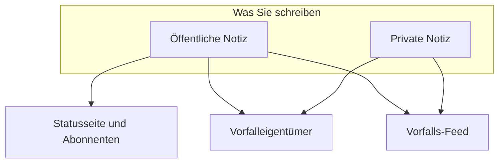

# Vorfallnotizen, Eigentümer & Feed

Jeder Vorfall sammelt während der Arbeit daran einen schriftlichen Verlauf: Updates für Ihre Kunden, Arbeitsnotizen für Ihr Team und einen Aktivitäts-Feed mit allem, was passiert ist. Diese Seite behandelt das Schreiben öffentlicher und privater Notizen, wen jede erreicht, den Vorfall-Feed und die Eigentümer, die über jede Änderung informiert werden.

:::cards
- [Eine öffentliche Notiz posten](#eine-öffentliche-notiz-posten): Kunden mitteilen, was Sie wissen – auf der Statusseite und per Benachrichtigung.
- [Wann Abonnenten benachrichtigt werden](#wann-eine-öffentliche-notiz-die-abonnenten-tatsächlich-erreicht): Die Prüfungen, die eine öffentliche Notiz durchläuft, und ihr Badge.
- [Der Vorfall-Feed](#der-vorfall-feed): Die Zeitachse von allem, was passiert ist.
- [Eigentümer](#eigentümer): Wer verantwortlich ist und was ihnen mitgeteilt wird.
:::

## So funktioniert es

Manches, was Sie schreiben, ist für Ihre Kunden – das Update, das um 02:14 auf der Statusseite erscheint und sagt, dass Sie das fehlerhafte Deployment gefunden haben. Der Rest ist für Ihr Team – der Stacktrace, den jemand eingefügt hat, das Diagramm, das endlich Sinn ergab, die Entscheidung zum Failover. OneUptime hält diese beiden Zielgruppen auseinander und hält beides am Vorfall fest.



**Öffentliche Notizen** erscheinen auf Ihrer Statusseite und können Abonnenten benachrichtigen. **Private Notizen** (das Modell `IncidentInternalNote`) bleiben im Dashboard. Unter beiden liegt der **Vorfalls-Feed**, eine nur ergänzbare Zeitachse, die alles festhält, was mit dem Vorfall passiert ist, und die Liste **Eigentümer**, die entscheidet, wer informiert wird.

All das finden Sie im Seitenmenü des Vorfalls: **Notizen → Öffentliche Notizen**, **Notizen → Private Notizen** und **Team → Eigentümer**. Der Feed liegt auf der Seite **Übersicht** des Vorfalls.

## Öffentliche und private Notizen im Vergleich

Die beiden Notizarten sehen im Dashboard ähnlich aus und verhalten sich sehr unterschiedlich.

|                          | Öffentliche Notiz                                                   | Private Notiz                                                   |
| ------------------------ | ------------------------------------------------------------------- | --------------------------------------------------------------- |
| Modell                   | `IncidentPublicNote`                                                | `IncidentInternalNote`                                          |
| Auf Statusseiten sichtbar | Ja, als Teil der Vorfall-Zeitachse                                 | Nie – nichts in der Statusseiten-App liest sie                  |
| Zeitpunkt des Postens    | `postedAt`, den Sie selbst setzen können                            | Keiner: gestempelt und sortiert nach `createdAt`                |
| Benachrichtigt Abonnenten | Wenn **Statusseiten-Abonnenten benachrichtigen** eingeschaltet ist | Nie: Sie hat überhaupt keine Abonnentenfelder                   |
| Anhänge erreichbar für   | Besucher der Statusseite, über eine Route der Statusseite           | Nur die authentifizierte Dashboard-API                          |
| Benachrichtigt Eigentümer | Ja                                                                 | Ja                                                              |

**Was „privat“ wirklich bedeutet.** Es bedeutet „nicht auf der Statusseite veröffentlicht“ – nicht „auf eine kleinere Gruppe beschränkt“. Die eingebauten Rollen, die einen Vorfall lesen dürfen, lesen beide Notizarten; wer einen Vorfall lesen kann, kann also in der Regel auch seine privaten Notizen lesen. In einer eigenen Rolle sind das getrennte Berechtigungen, **Read Incident Status Page Note** und **Read Incident Internal Note**. Wollen Sie einschränken, wer einen Vorfall überhaupt sieht, verwenden Sie das Flag **Privater Vorfall** (`isPrivate`) am Vorfall selbst: Es verbirgt den Vorfall auf jeder Statusseite und beschränkt ihn auf seine Eigentümer-Benutzer, die Mitglieder seiner Eigentümer-Teams sowie Projektadmins und -eigentümer.

**Eigentümer sehen beides.** Der Benachrichtigungsjob für Eigentümer fragt öffentliche und private Notizen gemeinsam ab. Eine private Notiz ist privat gegenüber Ihren Abonnenten, nicht gegenüber den Menschen, die reagieren.

| Wenn Sie …                                             | Wählen Sie       |
| ------------------------------------------------------ | ---------------- |
| Kunden sagen wollen, was Sie wissen und wann Sie mehr wissen | **Öffentliche Notiz** |
| ein Update zurückdatieren wollen, das Sie anderswo schon gesendet haben | **Öffentliche Notiz** |
| eine Hypothese, einen ausgeführten Befehl oder eine Sackgasse festhalten wollen | **Private Notiz** |
| einen Heap-Dump oder einen Screenshot eines internen Dashboards anhängen wollen | **Private Notiz** |

## Eine öffentliche Notiz posten

:::steps
### Die öffentlichen Notizen öffnen

Öffnen Sie den Vorfall und wählen Sie in seinem Seitenmenü **Notizen → Öffentliche Notizen**. Das Eingabefeld über den Notizen sagt Ihnen vor dem Posten, wer die Notiz liest: **Public · Visible on your status page**.

### Das Update schreiben

Schreiben Sie die Notiz in Markdown, oder beginnen Sie mit einer Ihrer **Vorlagen** oder mit **Mit KI entwerfen**. Fügen Sie mit **Anhängen** Dateien hinzu, wenn Abonnenten sie sehen sollen.

### Entscheiden, wer informiert wird

Lassen Sie **Statusseiten-Abonnenten benachrichtigen** angehakt, um Abonnenten zu benachrichtigen, oder entfernen Sie das Häkchen, um still zu veröffentlichen. **Will notify** darunter zeigt, welche Statusseiten die Notiz erreicht, und **Vorschau** zeigt die E-Mail, die sie erhalten.

### Posten

Klicken Sie auf **Post update** oder drücken Sie Ctrl+Enter (⌘+Enter auf dem Mac). Die Notiz erscheint oben in der Liste, mit einem Badge, das ihre Benachrichtigung verfolgt.
:::

Dasselbe Eingabefeld öffnet sich in einem Dialog über **Öffentliche Notiz hinzufügen** im Menü **Aktionen** des Vorfall-Feeds (siehe [Der Vorfall-Feed](#der-vorfall-feed)), eine Notiz wird also von beiden Stellen aus gleich geschrieben.

| Steuerelement                      | Zweck |
| ---------------------------------- | --------------------------------------------------------------------------------------------------------------------------------------------- |
| Die Notiz                          | Der Text, in Markdown. Pflicht. |
| **Vorlagen**                       | Fügt eine Ihrer Notizvorlagen in die Notiz ein, nach dem, was Sie schon getippt haben. Siehe [Notizvorlagen](#notizvorlagen). |
| **Mit KI entwerfen**               | Entwirft die Notiz aus dem Vorfall, zum Bearbeiten. Siehe [Eine Notiz mit KI erzeugen](#eine-notiz-mit-ki-erzeugen). |
| **Anhängen**                       | Dateien, die auf der Statusseite mit Abonnenten geteilt werden. Optional. |
| **Posted now**                     | Wann die Notiz laut ihrer Angabe gepostet wurde: im Moment des Postens, sofern Sie hier keinen früheren Zeitpunkt wählen, in Ihrer aktuellen Zeitzone. |
| **Statusseiten-Abonnenten benachrichtigen** | Kontrollkästchen. Standardmäßig an, außer der Vorfall wurde gemeldet, ohne Abonnenten zu benachrichtigen – dann beginnt es aus. Schalten Sie es aus, um still zu veröffentlichen. |

**Stille Vorfälle bleiben still.** Wurde ein Vorfall mit ausgeschaltetem **Statusseiten-Abonnenten benachrichtigen** (oder als privater Vorfall) gemeldet, haben seine Abonnenten nie von ihm erfahren – eine öffentliche Notiz sollte also nicht das Erste sein, was sie hören. Bei einem solchen Vorfall beginnt das Kontrollkästchen aus, mit einer Zeile darunter, die erklärt, warum. Sie können es trotzdem anhaken, um Abonnenten über diese Notiz zu informieren. Notizen ohne ausdrückliche Wahl folgen derselben Regel: Notizen aus Slack und Microsoft Teams, Workflows und API-Anfragen ohne `shouldStatusPageSubscribersBeNotifiedOnNoteCreated`. Ein ausdrückliches `true` oder `false` wird immer beibehalten. Öffentliche Notizen an [geplanten Wartungsereignissen](/docs/status-pages/subscribers#geplante-wartungsereignisse) und [Vorfallsepisoden](/docs/status-pages/subscribers) folgen einer ähnlichen Regel, je nachdem, ob das Ereignis oder die Episode selbst beim Anlegen Abonnenten benachrichtigt hat; eine Episode privat zu machen ändert daran nichts.

**Sehen, wen die Notiz erreicht.** Solange **Statusseiten-Abonnenten benachrichtigen** angehakt ist, listet eine Zeile **Will notify** darunter die Statusseiten, an die die Notiz geht, mit einer „bis zu“-Abonnentenzahl je Kanal, und die Seiten, die die Monitore des Vorfalls führen, aber nicht informiert werden, mit dem Grund. Wird niemand informiert, zeigt sie nichts an, außer der Vorfall ist vor Statusseiten verborgen oder sein Statusseiten-Umfang ist der Grund. Sie folgt dem Statusseiten-Umfang des Vorfalls: Eine Notiz an einem Vorfall, der auf zwei Standortseiten beschränkt ist, sagt, dass sie diese beiden erreicht. Siehe [Eine Statusseite pro Zielgruppe](/docs/status-pages/one-status-page-per-audience).

**Sehen, was sie erhalten.** Neben demselben Kontrollkästchen zeigt **Vorschau** die E-Mail, die die Abonnenten jeder dieser Statusseiten für die Notiz erhalten, die Sie gerade schreiben, und welche Vorlage sie verwendet und warum. Sie bleibt grau, bis die Notiz Text enthält. **Test an mich senden** schickt diese E-Mail an die E-Mail-Adresse Ihres eigenen Kontos und an niemanden sonst. Siehe [Abonnenten & Ankündigungen](/docs/status-pages/subscribers#vorfälle).

> [!TIP]
> **Der Zeitpunkt des Postens ist der echte Zeitstempel der Notiz.** Statusseiten sortieren und zeigen öffentliche Notizen nach `postedAt`, nicht danach, wann Sie sie getippt haben – wenn Sie die Statusseite also mit einem Update nachziehen, das Sie vor 40 Minuten verschickt haben, wählen Sie **Posted now** und setzen den tatsächlichen Zeitpunkt. Kommt eine Notiz über die API (`/api/incident-public-note`) ohne ihn an, stempelt OneUptime die aktuelle Zeit.

Jede Notiz zeigt, wer sie geschrieben hat, ihren Zeitpunkt, das gerenderte Markdown mit ihren Anhängen und in ihrer Kopfzeile den Stand ihrer Abonnentenbenachrichtigung. **Notizen durchsuchen…** findet Notizen nach ihrem Inhalt, und der Feed lässt sich mit den neuesten oder ältesten zuerst lesen.

## Eine private Notiz posten

**Notizen → Private Notizen** ist bewusst schlichter. Es ist dasselbe Eingabefeld mit dem Hinweis **Private · Only your team can see this**, mit der Notiz, **Vorlagen**, **Mit KI entwerfen** und **Anhängen** für Dateien, die für das Reaktionsteam bestimmt sind. **Private Notiz hinzufügen** im Menü **Aktionen** des Vorfall-Feeds öffnet es in einem Dialog. Über die API sind private Notizen `/api/incident-internal-note`.

Kein Zeitpunkt des Postens, kein Abonnenten-Kontrollkästchen – die Notiz wird beim Anlegen gestempelt.

Beide Notizarten werden im Markdown-Editor geschrieben, der Listeneinträge mit **Einzug vergrößern** und **Einzug verkleinern** – oder Tab und Shift+Tab – verschachtelt und Listen, Links und Formatierung von dem behält, was Sie aus Word, Google Docs oder einer anderen OneUptime-Seite einfügen. Ctrl+Z nimmt ein Ein- oder Ausrücken zurück, und im visuellen Modus auch die Blöcke und Einfügungen des Editors, in der Reihenfolge Ihres Tippens. Ein aus einer Notiz kopierter Codeblock wird wieder als Codeblock eingefügt, ein daraus kopiertes Wort als Inline-Code. Siehe [Einen Vorfall melden](/docs/incidents/declaring-incidents#schritt-1-vorfalldetails).

## Anhänge an Notizen

Beide Notizarten nehmen Dateianhänge über die Schaltfläche **Anhängen** des Eingabefelds an, und beide zeigen unter dem Notiztext eine Liste der Anhänge mit einem Link **Download attachment** je Datei.

Sie unterscheiden sich darin, wer die Datei abrufen kann:

- **Anhänge öffentlicher Notizen** können Besucher der Statusseite über eine Route der Statusseite herunterladen, zusammen mit der Notiz selbst.
- **Anhänge privater Notizen** sind nur über die authentifizierte Dashboard-API erreichbar. Für sie gibt es keine Route der Statusseite.

Damit sind Anhänge dieselbe öffentlich/privat-Entscheidung wie der Notiztext. Ein Zeitachsenbild für Kunden gehört an eine öffentliche Notiz, ein Konfigurations-Dump an eine private.

Bilder folgen derselben Entscheidung. Ein Bild, das Sie in eine Notiz einfügen oder hineinziehen oder mit **Bild hochladen** hinzufügen, wird im Projekt des Vorfalls gespeichert und in der Notiz angezeigt, und wer es sehen kann, folgt der Notiz:

- **In einer privaten Notiz** – oder in einer öffentlichen Notiz, bevor sie gepostet ist – wird ein Bild nur den Mitgliedern des Projekts gezeigt, angemeldet so, wie das Projekt es verlangt. Jeder andere, der seine Adresse öffnet, sieht nichts, als gäbe es dort kein Bild.
- **In einer öffentlichen Notiz** wird ein Bild allen gezeigt, die die Notiz sehen können: auf der Statusseite und in den E-Mails, die ihre Abonnenten erhalten. Eine öffentliche Notiz wird immer mit ihrem Vorfall gezeigt, nie ohne ihn: Solange der Vorfall vor Statusseiten verborgen oder privat ist, werden auch die Bilder seiner Notizen nur den Mitgliedern des Projekts gezeigt.

Jeder Upload beginnt privat, aus dem Dashboard wie aus der API. Ein Bild ist nur so lange für alle sichtbar, wie etwas, was Ihre Statusseiten zeigen, es enthält: eine öffentliche Notiz, solange ihr Vorfall, ihre Episode oder ihr geplantes Wartungsereignis auf Statusseiten gezeigt wird, eine Ankündigung ab dem Zeitpunkt, ab dem sie angezeigt wird, die Beschreibung des Vorfalls, solange der Vorfall **Auf Statusseite sichtbar** und nicht privat ist, sein Postmortem, sobald es dort ebenfalls veröffentlicht ist, die Beschreibung einer Episode oder eines geplanten Wartungsereignisses, solange sie auf Statusseiten gezeigt wird (nie, solange die Episode privat ist), und die Übersichts-, Gruppen- und Ressourcenbeschreibungen der Statusseite selbst. Endet das – der Vorfall wird verborgen oder privat gemacht, das Bild wird herausgelöscht, die Notiz oder der Vorfall wird gelöscht –, ist das Bild wieder privat, sofern nicht etwas anderes, was Ihre Statusseiten zeigen, es noch enthält. Die Beschreibung und die Dankesnachricht eines Formulars zeigen ihre Bilder auf dieselbe Weise allen, solange das Formular Einsendungen annimmt.

Das Lesen einer Notiz über die API, Terraform oder einen Workflow listet nur die Anhänge, die der Leser öffnen darf: Dateien des Projekts der Notiz und öffentliche Dateien. Ein Anhang, den eine Notiz aus einem anderen Projekt nennt, fehlt in der Liste, als hätte die Notiz ihn nicht.

## Eine Notiz mit KI erzeugen

Das Eingabefeld hat eine Schaltfläche **Mit KI entwerfen**, auf beiden Notizseiten und in den Dialogen **Öffentliche Notiz hinzufügen** und **Private Notiz hinzufügen** des Feeds. Sie sendet den Vorfall an den KI-Anbieter Ihres Projekts und setzt das erzeugte Markdown in die Notiz, wo Sie es vor dem Posten bearbeiten – nichts wird automatisch veröffentlicht.

| Dialog                             | Was er schreibt                                                      | Vorlagen |
| ---------------------------------- | -------------------------------------------------------------------- | ----------------------------------------------------------------- |
| **Öffentliche Notiz mit KI generieren** | Eine Notiz für Kunden, aus einer Analyse der Vorfalldaten.     | **Status Update**, **Resolution Notice**, **Maintenance Update** |
| **Private Notiz mit KI generieren**  | Eine interne technische Notiz.                                     | **Investigation Update**, **Technical Analysis**, **Shift Handoff** |

Hinter der Schaltfläche sendet das Dashboard an `/incident/generate-note-from-ai/{incidentId}`, mit der gewählten Vorlage und dem Notiztyp `public` oder `internal`.

Gesendet wird der Text des Vorfalls. Ein darin eingebettetes Bild oder eine Datei – etwa ein in die Beschreibung eingefügter Screenshot – wird durch einen kurzen Hinweis wie `[image omitted: PNG, 340 KB]` ersetzt, und jedes Textfeld wird auf 16.000 Zeichen gekürzt, damit ein großes Einfügen nie den Rest verdrängt. Der Vorfall selbst behält seine Bilder.

## Notizvorlagen

Schreibt Ihr Team bei jedem Ausfall dieselben drei Updates, speichern Sie sie einmal. Das Menü **Vorlagen** des Eingabefelds listet sie, auf beiden Notizseiten und in den Notizdialogen des Feeds, und ein Klick setzt eine in die Notiz.

Vorlagen werden zwischen öffentlichen und privaten Notizen geteilt: Eine einzige Vorlagenliste bedient beide, und dieselbe Vorlage lässt sich in beide Notizarten einfügen.

Platzhalter in einer Vorlage – `{{incident.title}}`, `{{incident.state}}`, `{{incident.customFields.impact}}` und die anderen unter [Notizvorlagen](/docs/incidents/settings#notiz-vorlagen) aufgeführten – werden beim Auswählen mit den aktuellen Werten des Vorfalls gefüllt, sowohl auf den Notizseiten als auch in den Dialogen **Bestätigen** und **Beheben**. Was Sie schon getippt hatten, wird nie geändert, und ein Platzhalter ohne Wert bleibt, wie er geschrieben ist.

> [!IMPORTANT]
> Lesen Sie die gefüllte Notiz, bevor Sie eine öffentliche posten: `{{incident.affectedStatusPages}}` nennt jede Statusseite, die der Vorfall erreicht, und die Abonnenten aller dieser Seiten lesen sie.

Sie verwalten sie unter **Vorfälle → Einstellungen → Notiz-Vorlagen** – die Karte heißt **Vorlagen für öffentliche oder private Notizen für Vorfälle**, und ihr Formular hat eine Seite: **Vorlagenname** und **Vorlagenbeschreibung**, beide Pflicht, dann der Text. Solange Sie noch keine haben, sagt das Menü **Vorlagen** das und verlinkt dorthin.

## Notizen aus Slack oder Microsoft Teams posten

Haben Sie einen Arbeitsbereich verbunden, müssen Responder den Kanal nie verlassen. Slack und Microsoft Teams bieten beide eine Aktion zum Hinzufügen einer Notiz, die einen Dialog mit einem Dropdown **Note Type** – **Public Note** (auf der Statusseite gepostet) oder **Private Note** (nur für Teammitglieder sichtbar) – und einem Textfeld **Note** öffnet und das Ergebnis direkt an den Vorfall schreibt.

Drei Details sind wissenswert:

- **Schutz vor Duplikaten** – jede Notiz hält fest, aus welcher Slack-Nachricht sie stammt (`postedFromSlackMessageId`, im Format `channel_id:message_ts`), sodass mehrere Personen, die auf dieselbe Nachricht reagieren, eine Notiz erzeugen, nicht fünf.
- **Notizen kommen zurück** – das Posten jeder Notizart schickt auch eine Nachricht in den verbundenen Vorfallkanal, weil der Feed-Eintrag der Notiz mit eingeschalteter Arbeitsbereich-Benachrichtigung angelegt wird.
- **Gepostet als die Person, die gefragt hat** – eine Notiz aus dem Dialog oder aus einer Reaktion wird mit den OneUptime-Berechtigungen dieser Person gepostet, braucht also deren Berechtigung, diese Notizart am Vorfall zu posten. Wird sie abgelehnt, erfährt die Person den Grund – per Direktnachricht in Slack und im Gespräch in Microsoft Teams (bei einer Reaktion im Thread der Nachricht) –, und nichts wird gepostet.

## Wann eine öffentliche Notiz die Abonnenten tatsächlich erreicht

Eine öffentliche Notiz mit eingeschaltetem **Statusseiten-Abonnenten benachrichtigen** anzulegen garantiert für sich noch nicht, dass eine E-Mail hinausgeht. Die Notiz muss eine Kette von Prüfungen bestehen, und jedes Scheitern hält einen konkreten Grund fest, statt einen Fehler zu werfen:

```mermaid title="Die Prüfungen, die eine öffentliche Notiz besteht, bevor Abonnenten davon erfahren"
flowchart TB
    note["Öffentliche Notiz gepostet"] --> box{"Kästchen an?"}
    box -->|"Nein"| skipped["Abonnenten nicht benachrichtigt"]
    box -->|"Ja"| incident{"Vorfall auf Statusseiten?"}
    incident -->|"Nein"| skipped
    incident -->|"Ja"| pages{"Seite im Umfang?"}
    pages -->|"Nein"| skipped
    pages -->|"Ja"| prefs{"Abonnent hat eingewilligt?"}
    prefs -->|"Ja"| sent["Nachricht gesendet"]
```

1. **Statusseiten-Abonnenten benachrichtigen** muss eingeschaltet sein. Ist es das nicht, wird die Notiz schon beim Anlegen als übersprungen gestempelt. Bei Vorfällen, die ohne Benachrichtigung der Abonnenten gemeldet wurden, beginnt es aus.
2. Die Notiz muss zu einem Vorfall gehören, der noch existiert.
3. Der Vorfall muss mindestens einen angehängten Monitor haben – ohne Monitore gibt es keine Ressource einer Statusseite, an die die Notiz gehen kann.
4. Das Flag **Auf Statusseite sichtbar** (`isVisibleOnStatusPage`) des Vorfalls muss true sein, und der Vorfall darf nicht privat sein (`isPrivate`). Ein privater Vorfall ist auf jeder Statusseite verborgen, was immer das Flag sagt – siehe [Einen Vorfall von der Statusseite fernhalten](/docs/incidents/states-and-severities#einen-vorfall-von-der-statusseite-fernhalten).
5. Jede Statusseite, die der Vorfall erreicht, muss **Vorfälle anzeigen** (`showIncidentsOnStatusPage`) eingeschaltet haben. Die Seiten, die er erreicht, sind die, die seine Monitore führen, eingeengt auf die Seiten, auf die der Vorfall beschränkt ist, falls vorhanden. Ein auf keine Seite beschränkter Vorfall überspringt die Seiten, die nur auf sie beschränkte Vorfälle zeigen. Siehe [Eine Statusseite pro Zielgruppe](/docs/status-pages/one-status-page-per-audience).
6. Jeder Abonnent muss seine eigenen Einstellungen bestehen – nicht abgemeldet und, wo die Seite Abonnenten wählen lässt, für diese Ressource und den Ereignistyp `Incident` angemeldet.

> [!NOTE]
> **Benachrichtigungen kommen nicht sofort.** Der Job, der sie sendet, läuft einmal pro Minute; rechnen Sie also mit bis zu etwa einer Minute zwischen dem Speichern der Notiz und dem Versand. Genau das bedeutet **Abonnenten werden in Kürze benachrichtigt** an einer Notiz und **Wird bald gesendet** an den Benachrichtigungen des Vorfalls selbst.

Die Kopfzeile einer öffentlichen Notiz verfolgt den ganzen Weg mit einem Badge. Klicken Sie darauf, um die Statusmeldung der Benachrichtigung zu lesen, die sagt, was passiert ist:

| Badge                          | Bedeutung |
| ------------------------------ | ------------------------------------------------------------------------------------------------------------------------------------------------- |
| **Abonnenten nicht benachrichtigt** | Nichts wurde gesendet: Die Notiz wurde ohne Häkchen bei **Statusseiten-Abonnenten benachrichtigen** gepostet, oder eine der Hürden oben hat gegriffen. Der Grund ist festgehalten. |
| **Abonnenten werden in Kürze benachrichtigt** | Eingereiht, wartet auf den nächsten Lauf des Sendejobs. |
| **Abonnenten werden benachrichtigt** | Der Job arbeitet die Abonnentenliste ab. |
| **Abonnenten benachrichtigt**  | Die Nachricht jedes Abonnenten wurde gesendet. Die Statusmeldung listet pro Statusseite, wie viele auf jedem Kanal hinausgingen. |
| **Benachrichtigung fehlgeschlagen** | Nicht jeder Abonnent hat sie erhalten, oder der Job brach mit einem Fehler ab. Die Statusmeldung sagt, was davon. |

**Gesendet heißt gesendet.** Der Job wartet auf jede Nachricht: Eine E-Mail oder SMS gilt als gesendet, sobald der Mailserver oder SMS-Anbieter sie angenommen hat, eine Slack-, Microsoft-Teams- oder Webhook-Nachricht, sobald die Gegenseite geantwortet hat. Eine Nachricht, die abgelehnt wird, einen Fehler liefert oder binnen 4 Minuten keine Antwort bekommt, gilt als fehlgeschlagen, und ein Fehlschlag macht das Badge zu **Benachrichtigung fehlgeschlagen**; die übrigen Abonnenten erhalten sie trotzdem. Die Statusmeldung lautet dann etwa `Not every subscriber was sent this notification: 2 of 61 messages failed. Site 03: 41 email sent. Site 07: 16 email, 2 SMS sent; 2 email failed.` „Gesendet“ heißt, so weit OneUptime sehen kann: Ein Mailserver kann eine E-Mail später noch zurückweisen.

:::details Große Seiten und lange Versände
Die Abonnenten einer Statusseite werden in Blöcken zu 10.000 gelesen, bis alle erreicht sind, und 20 Nachrichten sind gleichzeitig unterwegs. Eine Benachrichtigung beginnt nach 20 Minuten keine neuen Nachrichten mehr: Was sie bis dahin nicht erreicht hat, wird aufgelistet, und sie wird als **Benachrichtigung fehlgeschlagen** markiert. Ein mittendrin unterbrochener Versand – sein Server wurde neu gestartet oder antwortete nicht mehr – wird ebenfalls als **Benachrichtigung fehlgeschlagen** markiert, mit einer Meldung, die mit `Interrupted:` beginnt, sobald er 40 Minuten lang in **Abonnenten werden benachrichtigt** stand, damit er dort nie ewig verharrt. Siehe [Abonnenten & Ankündigungen](/docs/status-pages/subscribers).
:::

### Die Benachrichtigung einer Notiz erneut senden

Klicken Sie auf das Benachrichtigungs-Badge einer Notiz, um zu sehen, was passiert ist. Eine Notiz, deren Benachrichtigung fehlschlug, bietet **Benachrichtigung wiederholen** an, eine, deren Benachrichtigung hinausging, **Benachrichtigung erneut senden**. Beide fragen zuerst nach: Die Bestätigung listet die Statusseiten, die die Notiz jetzt erreichen würde, mit einer „bis zu“-Zahl je Kanal, oder sagt, dass sie niemanden erreichen würde, und erklärt, was passiert. Beide setzen die Notiz zurück auf ausstehend, damit der nächste Lauf sie aufgreift, und senden sie an jede Statusseite, die der Vorfall jetzt erreicht, auch an die Abonnenten, die sie schon erhalten haben. Haben Sie seit dem Posten der Notiz die Seiten geändert, auf die der Vorfall beschränkt ist, geht sie an die Seiten, auf die er jetzt beschränkt ist. Eine Notiz, die ohne Häkchen bei **Statusseiten-Abonnenten benachrichtigen** gepostet wurde, bietet keine von beiden an, weil sie nie gesendet werden sollte, und keine wird angeboten, solange eine Benachrichtigung noch eingereiht ist oder gesendet wird. Öffentliche Notizen an geplanten Wartungsereignissen und Vorfallsepisoden behalten **Benachrichtigung wiederholen** nur nach einem Fehlschlag.

Die Benachrichtigung einer Notiz erneut zu senden teilt jedem Abonnenten mit, was die Notiz sagt, genau wie das Posten; es braucht daher die Berechtigung, öffentliche Notizen zu posten, die Abonnenten benachrichtigen, und die Berechtigung, öffentliche Notizen zu bearbeiten. Über die API ist es dieselbe Aktualisierung, die das Dashboard vornimmt, und setzt `subscriberNotificationStatusOnNoteCreated` zurück auf `Pending`; sie wird abgelehnt für einen Aufrufer ohne diese Berechtigungen, für eine ohne Benachrichtigung der Abonnenten gepostete Notiz und solange die Benachrichtigung der Notiz gesendet wird.

:::details Wie die Benachrichtigung „erstellt“ des Vorfalls fortsetzt
Nur die Benachrichtigung „erstellt“ des Vorfalls setzt dort fort, wo sie aufhörte: Sie führt Buch über die Statusseiten, an die sie vollständig gesendet hat, und **Wiederholen** auf der **Übersicht** des Vorfalls überspringt sie. Diese Buchführung erfolgt pro Statusseite, nicht pro Abonnent; eine Seite, bei der sie mittendrin aufhörte, erhält sie also erneut vollständig, auch die Abonnenten dieser Seite, die sie schon bekommen haben. Die Bestätigung von **Wiederholen** bietet **Erneut an jede Statusseite senden, auch an die bereits erreichten Seiten** an, was daraus **An alle Seiten erneut senden** macht, und **Erneut senden** nach einem Erfolg sendet sie erneut an jede Seite. Siehe [Eine Statusseite pro Zielgruppe](/docs/status-pages/one-status-page-per-audience#adding-status-pages).
:::

### Eine öffentliche Notiz bearbeiten

**Eine öffentliche Notiz zu bearbeiten ist still, es sei denn, Sie wollen es anders.** Das Bearbeitungsformular der Notiz hat ein Kontrollkästchen **Abonnenten über diese Aktualisierung benachrichtigen**, jedes Mal ohne Häkchen. Haken Sie es für eine Änderung an, von der Abonnenten wissen müssen, und sie erhalten die bearbeitete Notiz als Aktualisierung markiert; die Notiz zeigt dann neben dem ursprünglichen ein zweites Badge für die Aktualisierung, mit eigenem **Benachrichtigung wiederholen** nach einem Fehlschlag:

| Badge der Aktualisierung | Bedeutung |
| ------------------- | --------------------------------------------------- |
| **Aktualisierung in der Warteschlange** | Wartet auf den nächsten Lauf des Sendejobs. |
| **Aktualisierung wird gesendet** | Der Job arbeitet die Abonnentenliste ab. |
| **Aktualisierung gesendet** | Jeder Abonnent hat die bearbeitete Notiz erhalten. |
| **Aktualisierung fehlgeschlagen** | Nicht jeder Abonnent hat sie erhalten. |
| **Aktualisierung nicht gesendet** | Eine der Hürden oben hat sie aufgehalten. |

Eine gesendete Aktualisierung wird nicht erneut angeboten: Bearbeiten Sie die Notiz mit angehaktem Kästchen, um den neuesten Text zu senden, oder senden Sie die Notiz selbst erneut. Wurde die ursprüngliche Benachrichtigung noch nicht gesendet, geht keine eigene Aktualisierung hinaus – die ursprüngliche trägt die Änderung. Wird sie gerade gesendet, wartet die Aktualisierung, bis sie fertig ist, und geht dann hinaus. Das Kontrollkästchen und **Benachrichtigung wiederholen** der Aktualisierung brauchen dieselben Berechtigungen wie das erneute Senden der Benachrichtigung einer Notiz; ohne sie können Sie die Notiz trotzdem bearbeiten, ohne jemanden zu benachrichtigen. Siehe [Abonnenten & Ankündigungen](/docs/status-pages/subscribers).

Die tatsächliche Nachricht an die Abonnenten wird pro Statusseite und pro Kanal aus einer Vorlage erzeugt – E-Mail, SMS, Slack und Microsoft Teams haben je eine eigene Vorlage für das Ereignis **Subscriber Incident Note Created**, mit Variablen für Name und URL der Statusseite, den Detail-Link, die betroffenen Ressourcen, Schweregrad und Titel des Vorfalls, den Notiztext, die Beschriftungen des Vorfalls, die betroffenen Statusseiten und benutzerdefinierten Felder sowie einen Abmeldelink je Abonnent. Die Standardnachrichten per E-Mail, Slack und Microsoft Teams listen außerdem die benutzerdefinierten Felder des Vorfalls, die mit **In Abonnentenbenachrichtigungen aufnehmen** markiert sind, mit ihren aktuellen Werten. Wie diese Vorlagen und Kanäle konfiguriert werden, steht unter [Abonnenten & Ankündigungen](/docs/status-pages/subscribers).

## Der Vorfall-Feed

Die Karte **Vorfalls-Feed** steht unten in der linken Spalte der Seite **Übersicht** des Vorfalls. Sie erzählt die Geschichte des Vorfalls der Reihe nach: Jeder Eintrag hat ein Symbol, Avatar und Namen dessen, der ihn ausgelöst hat, einen relativen Zeitstempel mit der genauen Ortszeit beim Überfahren und einen Markdown-Text. Standardmäßig stehen die neuesten Einträge oben.

Manche Einträge tragen zusätzliche Details – eine Eigentümerbenachrichtigung listet etwa alle, die angeschrieben wurden, und eine Abonnentenbenachrichtigung jede Statusseite, an die sie ging, mit der Zahl gesendeter und fehlgeschlagener Nachrichten je Kanal und dem Betreff ihrer E-Mail, gefolgt – wenn sie welche gesendet hat – von den Werten benutzerdefinierter Felder, die sie in eine Nachricht eingesetzt hat, unter **Custom fields sent**. Solche Einträge zeigen eine Schaltfläche **Weitere Informationen**, die ein Panel **Weitere Informationen** öffnet.

Die Kopfzeile der Karte hat außerdem ein Menü **Aktionen**, damit Sie handeln können, ohne die Zeitachse zu verlassen:

- **Runbook ausführen** – startet ein [Runbook](/docs/runbooks/index) für diesen Vorfall.
- **Bereitschaftsdienst-Richtlinie ausführen** – alarmiert eine Richtlinie auf Abruf. Eine archivierte Richtlinie alarmiert niemanden: Ihr Ausführungsprotokoll am Vorfall sagt, dass sie nicht ausgeführt wurde, weil die Richtlinie archiviert ist.
- **Öffentliche Notiz hinzufügen** – das Eingabefeld der Seite **Öffentliche Notizen** in einem Dialog: Notiz schreiben, dann **Post update**. Vorlagen, **Mit KI entwerfen**, Anhänge, **Statusseiten-Abonnenten benachrichtigen** samt Empfängern und **Vorschau** sind alle dabei. Die Notiz wird jetzt gepostet; um sie zurückzudatieren, wählen Sie **Posted now**.
- **Private Notiz hinzufügen** – das Eingabefeld der Seite **Private Notizen** in einem Dialog: Notiz schreiben, dann **Add note**.

Beide Notizaktionen sind für jemanden gesperrt, der keine Notizen schreiben darf, und nennen die fehlende Berechtigung. Nach dem Posten einer Notiz schließt sich der Dialog, und der Feed zeigt sie.

Alles andere liegt hinter der Schaltfläche **⋯** daneben, derselben Schaltfläche **Weitere Optionen**, die die Kopfzeile einer Tabellenkarte hat, damit die Kopfzeile so wenige Schaltflächen wie möglich zeigt:

- **Neueste zuerst** / **Älteste zuerst** – die Reihenfolge, in der der Feed gelesen wird. Ein Häkchen markiert die verwendete, und Ihr Browser merkt sich die Wahl für den Feed jedes Vorfalls.
- **Nach Ereignistyp filtern** – ein Dialog mit den Ereignistypen des Feeds, jeder mit dem Symbol seiner Einträge, und einem Suchfeld, wenn die Liste lang ist. Haken Sie die anzuzeigenden an und wählen Sie **Filter anwenden**; ist nichts angehakt, werden alle Ereignistypen gezeigt. Solange der Feed gefiltert ist, sagt ein Kasten darüber, wie viele Ereignistypen er zeigt, mit einem Chip je Typ, **Filter bearbeiten** und **Filter löschen**. Der Filter wird nicht gespeichert: Verlassen Sie den Vorfall, zeigt sein Feed wieder alles.
- **Aktualisieren** – lädt den Feed neu.

> [!NOTE]
> **Der Feed ist nur ergänzbar – und nicht Ihr Audit-Protokoll.** Die API erlaubt das Anlegen und Lesen von Feed-Einträgen, aber nicht das Ändern oder Löschen; niemand kann die Geschichte eines Vorfalls also still umschreiben. Dauerhaft ist er aber auch nicht: In abgerechneten Installationen werden Feed-Zeilen, die älter als drei Jahre sind, entfernt. Für einen dauerhaften Nachweis, wer was geändert hat, nutzen Sie **Erweitert → Audit-Protokolle** im Seitenmenü des Vorfalls.

## Was der Feed festhält

Feed-Einträge schreiben der Vorfallsdienst selbst, beide Notizdienste, die Statuszeitachse, Eigentümer- und Mitgliederänderungen, das Verknüpfen und Lösen von Warnungen, die Regel-Engines, die Bereitschaftsausführung, die KI-Untersuchungs- und Postmortem-Läufe und die Benachrichtigungs-Cronjobs. Die Ereignistypen umfassen:

- **Den Vorfall selbst** – `IncidentCreated`, `IncidentUpdated`, `IncidentStateChanged`. Ein Eintrag `IncidentUpdated` hält fest, was eine Bearbeitung geändert hat: Titel, Beschreibung, Grundursache, Behebungsnotizen, Beschriftungen, Schweregrad, Monitore und der auf sie gesetzte Status sowie die Statusseiten, die dem Umfang des Vorfalls hinzugefügt oder daraus entfernt wurden. Er hat eine Zeile je geändertem Wert und keine für einen unverändert gespeicherten Wert; eine Karte ohne Änderung zu speichern oder ein API-Client oder Workflow, der den Vorfall unverändert zurückschreibt, fügt also gar keinen Eintrag hinzu. Text, der gleich lautet, ist gleich (von Zeilenenden und umgebenden Leerzeichen abgesehen), und Beschriftungen sind dieselbe Menge in beliebiger Reihenfolge; ein geleerter Wert liest sich als entfernt, und das Entfernen aller Beschriftungen als „All labels removed.“. Die Einträge **Alert updated** einer Warnung funktionieren genauso.
- **Notizen und Berichte** – `PublicNote`, `PrivateNote`, `RootCause`, `RemediationNotes`, `PostmortemNote`. Ein Eintrag `PostmortemNote` wird geschrieben, wenn sich die Notiz des Postmortems ändert, nicht bei jedem Speichern des Postmortems.
- **Personen** – `OwnerUserAdded`, `OwnerTeamAdded`, `OwnerUserRemoved`, `OwnerTeamRemoved`, `IncidentMemberAdded`, `IncidentMemberRemoved`.
- **Verknüpfte Warnungen** – `AlertLinked` und `AlertUnlinked`, angezeigt als **Warnung verknüpft** und **Verknüpfung der Warnung aufgehoben**.
- **Benachrichtigungen** – `OwnerNotificationSent`, `SubscriberNotificationSent`, `OnCallPolicy`, `OnCallNotification`.
- **Automatisierung** – `LabelRuleExecuted`, `OwnerRuleExecuted`, `PrivacyRuleExecuted`, `OnCallRuleExecuted`, `AutoRemediation`.
- **Videoanrufe** – `VideoCallStarted` und `VideoCallFailed`: ein für den Vorfall gestarteter Anruf mit seinem Beitrittslink oder der Grund, aus dem ein Anbieter keinen starten konnte. Siehe [Videoanrufe](/docs/workspace-connections/video-calls).

Jeder Typ hat sein eigenes Symbol, sodass Sie in einem langen Feed die Statuswechsel vom Rauschen unterscheiden. Eine von der KI erzeugte Ursachenanalyse ist eigens gekennzeichnet und wird in einem eingeschränkten Markdown-Modus dargestellt. Der Eintrag **Vorfall erstellt**, der Eintrag, der einen neuen Titel festhält, und die Einträge zum Beitreten zu einer Episode oder zum Verlassen zeigen einen Titel genau so, wie er getippt wurde: Sie maskieren `\`, `[`, `]`, `*`, `_`, `~`, Backticks und \< darin, sodass ein Titel weder zu einem Bild, rohem HTML, einer Slack-Erwähnung wie \<!here\>, einem Link, dessen Text sein Ziel verbirgt, noch zu fettem, kursivem Text oder Code werden kann. Eine Adresse in einem Titel erscheint weiterhin als Link auf genau diese Adresse.

Auch an der Warnung wird das Verknüpfen festgehalten. Warnungen haben einen eigenen Feed, in dem dieselbe Änderung als **Mit Vorfall verknüpft** (`LinkedToIncident`) oder **Verknüpfung mit Vorfall aufgehoben** (`UnlinkedFromIncident`) erscheint und den Vorfall nennt. Nur die Einträge **Warnung verknüpft** und **Verknüpfung der Warnung aufgehoben** des Vorfalls werden in Slack und Microsoft Teams gepostet, sodass jede Verknüpfung einmal angekündigt wird. Ein aus Warnungen gemeldeter Vorfall erhält einen einzigen Eintrag **Warnung verknüpft**, der sie alle listet, statt einen je Warnung, und der Titel einer privaten Warnung oder eines privaten Vorfalls fehlt im Eintrag der anderen Seite. Siehe [Verknüpfte Warnungen](/docs/incidents/linked-alerts).

Feeds respektieren die Privatsphäre des Vorfalls: Bei privaten Vorfällen werden Feed-Abfragen genauso gefiltert wie der Vorfall.

## Eigentümer

Eigentümer sind die Personen und Teams, die für einen Vorfall verantwortlich sind. An sie gehen die Benachrichtigungen über alles, was mit ihm passiert – und sie sind der Grund, warum ein Vorfall nicht unbemerkt bleibt, während alle annehmen, jemand anderes kümmere sich.

Öffnen Sie **Team → Eigentümer** im Seitenmenü des Vorfalls. Die Karte **Eigentümer** zeigt ein Zähler-Badge und beschreibt Eigentümer als die Personen und Teams, die für diesen Vorfall verantwortlich sind und über Änderungen benachrichtigt werden, mit einer laufenden Zählung wie „2 Personen · 1 Team“. Eigentümer erscheinen als überlappende Avatare; das Überfahren eines davon zeigt die E-Mail der Person oder markiert den Eintrag als **Team**.

- Klicken Sie auf **Eigentümer hinzufügen**, um eine Auswahl mit Suchfeld für Personen oder Teams zu öffnen.
- Klicken Sie auf das Entfernen-Symbol an einem Avatar, um die Bestätigung **Eigentümer entfernen** zu öffnen, dann auf **Entfernen**.
- Ohne Eigentümer sagt die Karte das und lädt Sie ein, ein Teammitglied oder ein Team hinzuzufügen, damit es über Änderungen benachrichtigt wird.

Eigentümer-Benutzer und Eigentümer-Teams sind getrennte Datensätze – ein Team hinzuzufügen macht jedes Mitglied dieses Teams für Benachrichtigungen zum Eigentümer, ohne es einzeln aufzuführen. Über die API sind sie `/api/incident-owner-user` und `/api/incident-owner-team`.

Nur die eigenen Teams und Mitglieder Ihres Projekts können Eigentümer sein. Die Auswahl bietet nur sie an, und über die API, Terraform oder einen Workflow hinzugefügte Eigentümer unterliegen demselben: Ein Team aus einem anderen Projekt oder jemand, der kein Mitglied des Projekts ist, wird abgelehnt.

## Wie Eigentümer zugewiesen werden

Es gibt vier Wege auf die Eigentümerliste:

- **Aus einer Vorfallsvorlage** – Vorlagen haben ein Feld **Eigentümer**: die Personen und Teams, denen der Vorfall gehört und die beim Anlegen oder Aktualisieren benachrichtigt werden, aus derselben Liste gewählt wie bei **Eigentümer hinzufügen**. Das Anlegen eines Vorfalls aus der Vorlage füllt sie vor, und sie werden hinzugefügt, sobald die Slack- und Microsoft-Teams-Kanäle des Vorfalls existieren, sodass eine Benachrichtigungsregel, die Vorfalleigentümer in einen neuen Kanal einlädt, auch sie einlädt. Das Dashboard und ein Workflow-Schritt **Create One Incident** mit gewählter **Incident Template** fügen sie ohne die Benachrichtigung „Sie wurden hinzugefügt“ hinzu; ein [Formular](/docs/forms/on-submit) mit einer Vorlage benachrichtigt sie und hält die Benachrichtigung **Vorfall erstellt** des Vorfalls zurück, bis sie hinzugefügt sind. Siehe [Einen Vorfall melden](/docs/incidents/declaring-incidents).
- **Aus Vorfall-Eigentümerregeln** – zutreffende Regeln fügen beim Anlegen automatisch Eigentümer hinzu.
- **Beim Anlegen über die API** – mit dem Erstellungsaufruf übergebene Eigentümer-Benutzer und -Teams werden genauso hinzugefügt, sobald die Kanäle existieren, und ohne die Benachrichtigung „Sie wurden hinzugefügt“.
- **Von Hand** – das Steuerelement **Eigentümer hinzufügen** auf der Seite **Eigentümer**, zu jedem Zeitpunkt des Vorfalls.

Dieselbe Person zweimal hinzuzufügen ist unbedenklich; bereits zugewiesene Eigentümer werden nicht dupliziert.

## Vorfall-Eigentümerregeln

**Vorfall-Eigentümerregeln** weisen Eigentümer-Benutzer und -Teams automatisch zu, wenn passende Vorfälle angelegt werden – die Verteilungsschicht, durch die ein Datenbankvorfall beim Datenbankteam landet, ohne dass jemand daran denken muss. Sie finden sie unter **Vorfälle → Regeln → Eigentümerregeln**; die übrige Vorfallautomatisierung behandelt [Vorfalleinstellungen & Automatisierung](/docs/incidents/settings).

Das Regelformular hat zwei Schritte – **Übereinstimmung**, die Bedingungen, die ein Vorfall erfüllen muss, dann **Eigentümer**, was die Regel hinzufügt:

- **Eigentümer** – **Eigentümer hinzufügen** öffnet eine Liste von Personen und Teams; klicken Sie jede an, um sie hinzuzufügen, und entfernen Sie eine Auswahl mit dem **×** an ihrem Chip. Trifft die Regel zu, wird jede gewählte Person und jedes gewählte Team als Eigentümer hinzugefügt, und bereits zugewiesene Eigentümer werden nicht dupliziert.
- **Eigentümer erben**, eingeklappt unter **Eigentümer** – Eigentümer von verwandten Objekten übernehmen, statt sie zu nennen. **Eigentümer von Monitoren erben** macht jeden Eigentümer der Monitore des Vorfalls zum Eigentümer des Vorfalls, und **Eigentümer von Hosts erben**, **Eigentümer von Kubernetes-Clustern erben**, **Eigentümer von Docker-Hosts erben**, **Eigentümer von Podman-Hosts übernehmen** und **Eigentümer von Diensten erben** tun dasselbe für diese Ressourcen.

Eine neue Regel muss jemanden hinzufügen: Wählen Sie mindestens einen Eigentümer oder schalten Sie einen Schalter **Eigentümer erben** ein. Auch API und Terraform lehnen eine neue Regel ab, die niemanden hinzufügt. Ihr **Name** wird aus den gewählten Eigentümern gefüllt – oder, bei einer Regel, die nur erbt, aus ihren Schaltern (_Inherit owners from monitors_) –, bis Sie einen eigenen Namen tippen. Das Bearbeiten einer Regel verlangt nie Eigentümer, eine ältere Regel, die nichts hinzufügt, lässt sich also weiterhin umbenennen oder ausschalten; die Liste markiert sie mit **Fügt nichts hinzu**. Siehe [Beschriftungs- und Eigentümerregeln](/docs/configuration/label-and-owner-rules).

**Eigentümer benachrichtigen**, unter **Weitere Felder**, steuert, ob die Leute es erfahren. Lassen Sie es für echte Zuständigkeiten an; schalten Sie es aus, um Eigentümer still hinzuzufügen – nützlich, wenn eine Regel eine Verwaltungshilfe ist statt einer Alarmierung.

Jede Regelausführung wird in den Vorfall-Feed geschrieben, sodass Sie immer erkennen, ob eine Person von einer Regel oder von einem Menschen hinzugefügt wurde.

## Worüber Eigentümer benachrichtigt werden

Fünf Jobs benachrichtigen Eigentümer, jeder einmal pro Minute:

| Benachrichtigung           | Wann                                                         | E-Mail-Betreff |
| -------------------------- | ------------------------------------------------------------ | -------------------------------------------------------------- |
| **Vorfall erstellt**       | Der Vorfall wird gemeldet.                                   | `[New Incident {number}] - {title}` |
| **Eine Notiz wurde gepostet** | Eine öffentliche *oder* private Notiz wird gepostet.      | `[Update Incident {number}] - {title}` |
| **Der Status hat sich geändert** | Der Vorfall wechselt in einen anderen Status.          | `[{State} Incident {number}] - {title}` |
| **Sie wurden hinzugefügt** | Sie werden als Eigentümer hinzugefügt.                       | `You have been added as the owner of Incident {number} - {title}` |
| **Noch nicht behoben**     | Eine Erinnerung, gesteuert durch die nächste Erinnerungszeit des Vorfalls. | `[Reminder] Incident {number} is still {state} - {title}` |

Jede Benachrichtigung geht über die Kanäle hinaus, die die Person unter **Benutzereinstellungen → Benachrichtigungseinstellungen** eingeschaltet hat – E-Mail, SMS, Sprachanruf, Push, WhatsApp, Telegram, Slack, Microsoft Teams oder Webhook –, und diese entscheiden, was tatsächlich gesendet wird. Jeder Empfänger kann jede davon einzeln abschalten – die Einstellungen je Benutzer sind so formuliert, dass sie Ihnen die Benachrichtigungen über erstellte Vorfälle, gepostete Notizen, Statuswechsel, hinzugefügte Eigentümer, zugewiesene Mitglieder und Erinnerungen an noch offene Vorfälle senden. Wer nur bei Statuswechseln angerufen werden will, kann genau das haben. Was ein Statuswechsel bedeutet, steht unter [Vorfallstatus & Schweregrade](/docs/incidents/states-and-severities).

**Vorfälle ohne Eigentümer bleiben nicht still.** Hat ein Vorfall überhaupt keine Eigentümer, greifen die Benachrichtigungsjobs auf die Eigentümer des Projekts zurück, sodass nichts verloren geht. Die Benachrichtigung **Vorfall erstellt** eines Vorfalls, der über ein Formular gemeldet wurde, dessen Vorlage Eigentümer hat, wartet stattdessen auf diese Eigentümer. Jede benachrichtigte Person wird außerdem an den passenden Feed-Eintrag angehängt, sodass Sie später genau sehen, wer an welche Adresse informiert wurde.

## Nächste Schritte

:::cards
- [Vorfalleinstellungen & Automatisierung](/docs/incidents/settings): Eigentümerregeln, Notizvorlagen und die übrige Automatisierung.
- [Abonnenten & Ankündigungen](/docs/status-pages/subscribers): Wo öffentliche Notizen landen und wer sie erhält.
- [Eine Statusseite pro Zielgruppe](/docs/status-pages/one-status-page-per-audience): Welche Statusseiten die Notizen eines Vorfalls erreichen.
- [Vorfallstatus & Schweregrade](/docs/incidents/states-and-severities): Die Zustandsmaschine, die den halben Feed antreibt.
:::
