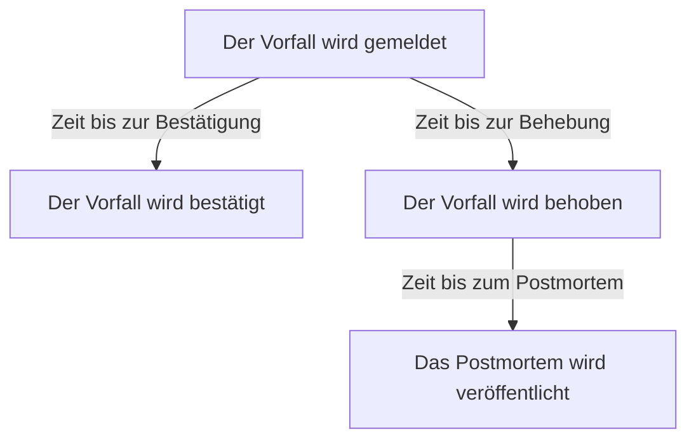

# Vorfalleinstellungen & Automatisierung

Die Vorfallkonfiguration liegt in **Vorfälle**, nicht in den **Projekteinstellungen**: die Status und Schweregrade, Vorlagen, benutzerdefinierten Felder, Rollen, Messungen und Nummernpräfixe sowie die Regeln, die auf jeden neuen Vorfall wirken. Diese Seite ist die Referenz für jede dieser Seiten und für das, was von selbst läuft, sobald ein Vorfall gemeldet wird.

:::cards
- [Vorfall-Vorlagen](#vorfall-vorlagen): Dieselbe Art von Vorfall jedes Mal vorausgefüllt melden.
- [Benutzerdefinierte Felder](#benutzerdefinierte-felder): Eigene Felder an jedem Vorfall, beim Melden abgefragt.
- [Messungen](#messungen): Zeit bis zur Bestätigung, Behebung oder Eindämmung, für jeden Vorfall berechnet.
- [Regeln](#regeln-die-beim-anlegen-eines-vorfalls-laufen): Eigentümer, Beschriftungen, Alarmierung und Episoden, automatisch gesetzt.
:::

## Wo die Vorfalleinstellungen liegen

Öffnen Sie **Vorfälle** im Menü **Produkte** in der oberen Leiste und klappen Sie dann unten in seinem Seitenmenü **Einstellungen** auf. **Regeln** und **Einstellungen** sind beide anfangs eingeklappt; klappen Sie sie also auf, bevor die Seiten unten erscheinen. Alles hier gilt pro Projekt: Vorlagen, Rollen, benutzerdefinierte Felder und Regeln gehören zu einem Projekt und gelten für jeden darin gemeldeten Vorfall, unter Routen, die mit `/dashboard/{projectId}/incidents/settings/` beginnen.

| Seite                         | Was Sie dort tun                                                                                   |
| ----------------------------- | -------------------------------------------------------------------------------------------------- |
| **Vorfallsstatus**            | Die Status, die ein Vorfall durchläuft, hinzufügen, umbenennen, neu einfärben und neu anordnen.    |
| **Vorfallsschweregrad**       | Schweregrade hinzufügen, umbenennen, neu einfärben und neu anordnen.                               |
| **Vorfall-Vorlagen**          | Einen ganzen Vorfall vorausfüllen – Titel, Beschreibung, Ressourcen, Bereitschaftsrichtlinien, Eigentümer, Beschriftungen. |
| **Notiz-Vorlagen**            | Wiederverwendbarer Text für öffentliche und private Notizen.                                       |
| **Postmortem-Vorlagen**       | Wiederverwendbare Postmortem-Strukturen.                                                           |
| **Benutzerdefinierte Felder** | Zusätzliche Felder definieren, die an jedem Vorfall erscheinen.                                    |
| **Vorfallsrollen**            | Die Rollen definieren, denen Sie Responder zuweisen, etwa Vorfall-Kommandant.                      |
| **Messungen**                 | Messen, wie lange Dinge dauern, etwa die Zeit bis zur Bestätigung oder bis zur Behebung, an jedem Vorfall. |
| **Verknüpfte Warnungen**      | Wählen, ob die mit einem Vorfall verknüpften Warnungen mit ihm bestätigt und behoben werden. Beides ist in neuen Projekten an. |
| **Nummernpräfix**             | Der Text vor Vorfall- und Episodennummern, etwa `INC-` in `INC-42`.                                |

Was OneUptime AI selbstständig tut, wird nicht hier eingestellt: Dafür gibt es einen eigenen Abschnitt, **Vorfälle → KI**, unter Routen, die mit `/dashboard/{projectId}/incidents/ai/` beginnen. Seine Seite **Einstellungen** schaltet das Untersuchen neuer Vorfälle, ihr automatisches Beheben (aus, bis Sie es einschalten) – mit den Pull Requests für Korrekturen und fehlende Telemetrie, die zum Beheben gehören, darunter angeordnet – und Postmortem-Entwürfe ein oder aus, und jeder Schalter speichert, sobald Sie ihn umlegen. Die Untersuchungsregeln und Auto-Behebungsregeln, die eingrenzen, welche Vorfälle untersucht und behoben werden, und die optionalen Grenzen, unter denen die KI arbeitet, sind unter **Weitere Einstellungen** eingeklappt, und keine davon gilt, bevor Sie sie setzen. Daneben liegen **Einblicke** und **Protokolle**: was die KI aus Ihren Vorfällen gelernt und was sie alles getan hat. Siehe [AI SRE](/docs/ai/ai-sre).

**Vorfallsstatus** und **Vorfallsschweregrad** werden ausführlich unter [Vorfallstatus & Schweregrade](/docs/incidents/states-and-severities) behandelt – der Rest dieser Seite setzt bei **Vorfall-Vorlagen** an. Formulare, mit denen Leute außerhalb Ihres Teams Vorfälle melden, sind ein eigenes Produkt: siehe [Formulare](/docs/forms/index). Werkzeuge, die von selbst Vorfälle öffnen, etwa [Huntress](/docs/integrations/huntress), werden unter **Vorfälle → Integrationen** eingerichtet.

Klappen Sie **Regeln** auf, kommen acht weitere Seiten dazu: **Gruppierungsregeln**, **Bereitschaftsregeln**, **Eigentümerregeln**, **Runbook-Regeln**, **Datenschutzregeln**, **Beschriftungsregeln**, **SLA-Regeln** und **Erinnerungsregeln**. Sie werden weiter unten behandelt.

## Vorfall-Vorlagen

Eine Vorfall-Vorlage ist das gespeicherte Gerüst eines Vorfalls. Statt jedes Mal, wenn der Payments-Cluster wackelt, denselben Titel, dieselbe Monitorliste und dieselbe Bereitschaftsrichtlinie neu einzutippen, speichern Sie das einmal und melden daraus.

:::steps
1. Gehen Sie zu **Vorfälle → Einstellungen → Vorfall-Vorlagen** (`/dashboard/{projectId}/incidents/settings/templates`). Die Karte heißt **Vorfall-Vorlagen**.
2. Klicken Sie auf **Vorfallsvorlage erstellen**. Benennen Sie die Vorlage auf **Vorlageninformationen** und füllen Sie dann auf **Vorfalldetails** den Vorfall aus, den sie meldet: einen **Titel**, einen **Vorfallsschweregrad** und eine **Beschreibung**.
3. Gehen Sie mit **Weiter** durch die optionalen Schritte – die betroffenen Ressourcen, ihre benutzerdefinierten Felder und ihre Bereitschaftsrichtlinien – und füllen Sie aus, was jeder Vorfall dieser Art gemeinsam hat.
4. Klicken Sie im letzten Schritt auf **Vorfallsvorlage erstellen**. Ab jetzt bietet **Aus Vorlage erstellen** in der Vorfallliste die Vorlage an.
:::

Das Anlegen führt Sie durch einen vierstufigen Assistenten, mit zwei weiteren Schritten, wenn Ihr Projekt benutzerdefinierte Vorfallfelder hat. Nur die ersten beiden fragen etwas, das Sie beantworten müssen: **Weiter** führt durch die optionalen Schritte danach, und **Vorfallsvorlage erstellen** steht im letzten Schritt.

- **Vorlageninformationen** – **Vorlagenname** und **Vorlagenbeschreibung**. Sie benennen die Vorlage selbst und erscheinen nie am Vorfall.
- **Vorfalldetails** – **Titel**, **Beschreibung** (Markdown) und **Vorfallsschweregrad**. Unter **Weitere Felder**, dessen eingeklappte Überschrift die drei nennt und jedes gesetzte zeigt:
  - **Anfänglicher Vorfallstatus** – der Status, in dem aus der Vorlage gemeldete Vorfälle beginnen. Er beginnt leer, wie im Meldeformular, und seine Optionen sind in Statusreihenfolge aufgelistet. Bleibt er leer, beginnen sie, wie sein Platzhalter sagt, im üblichen Startstatus: dem Erstellungsstatus des Projekts, in dem jeder neue Vorfall beginnt. Eine mit einem Status gespeicherte Vorlage behält ihn.
  - **Eigentümer** – die Personen und Teams, denen die aus der Vorlage gemeldeten Vorfälle gehören. **Eigentümer hinzufügen** öffnet eine Liste mit beiden, dieselbe Liste wie auf der Seite **Eigentümer** eines Vorfalls; jede Auswahl erscheint als Chip, den Sie entfernen können. Eine bestehende Vorlage zeigt sie auf einer Karte **Eigentümer**.
  - **Beschriftungen** – die Beschriftungen, mit denen aus der Vorlage gemeldete Vorfälle beginnen.
- **Betroffene Ressourcen** – wie im Meldeformular: **Monitore**, dann **Monitor-Status ändern in**, dann **Andere betroffene Ressourcen** für Hosts, Cluster und Dienste, mit **Auf diese Statusseiten beschränken** unter **Weitere Felder**. Eine Vorlage fragt immer nach **Monitor-Status ändern in**, ob Monitore gewählt sind oder nicht: Es gilt auch für die Monitore, die beim Melden eines Vorfalls aus der Vorlage gewählt werden, wo das Meldeformular es zeigt, sobald der erste Monitor gewählt ist. Die Karte **Betroffene Ressourcen** einer bestehenden Vorlage fragt genauso und zeigt den Status, den die Vorlage wählt, oder **Monitore behalten ihren Status.**, wenn sie keinen wählt. **Auf diese Statusseiten beschränken** beschränkt die aus der Vorlage gemeldeten Vorfälle auf einige der Statusseiten, die ihre Monitore listen – eine Vorlage `Region East outage` kann die Seiten des Standorts Ost mitführen. Eine bestehende Vorlage zeigt das auf einer Karte **Statusseiten-Umfang**, mit **Statusseiten-Umfang bearbeiten**. Siehe [Eine Statusseite pro Zielgruppe](/docs/status-pages/one-status-page-per-audience).
- **Benutzerdefinierte Felder** – nur, wenn Ihr Projekt benutzerdefinierte Vorfallfelder hat: die Werte, mit denen aus dieser Vorlage gemeldete Vorfälle beginnen. Hier wird jedes Feld angeboten, nicht nur die, nach denen der Schritt **Details** fragt, und keines ist Pflicht. Eine bestehende Vorlage hat eine Karte **Benutzerdefinierte Felder**, um sie zu ändern.
- **Benutzerdefinierte Felder beim Erstellen** – ebenfalls nur, wenn Ihr Projekt benutzerdefinierte Vorfallfelder hat: nach welchen davon der Schritt **Details** fragt, wenn ein Vorfall aus dieser Vorlage gemeldet wird, und welche ausgefüllt werden müssen. Eine bestehende Vorlage hat eine Karte **Benutzerdefinierte Felder beim Erstellen**, um sie zu ändern. Siehe [Benutzerdefinierte Felder beim Erstellen](#benutzerdefinierte-felder-beim-erstellen).
- **Bereitschaft** – **Bereitschaftsrichtlinie**, die Richtlinien, die ausgeführt werden, wenn ein aus dieser Vorlage erstellter Vorfall gemeldet wird.

Ein paar knappe Regeln:

- Die Vorlagenliste zeigt nur **Name** und **Beschreibung**. Zeilen lassen sich aus der Liste heraus weder bearbeiten noch löschen – öffnen Sie eine Vorlage (`/dashboard/{projectId}/incidents/settings/templates/{modelId}`), um sie zu ändern.
- Jeder, der eine Vorlage bearbeiten kann, kann ihre Details und ihre betroffenen Ressourcen ändern, **Anfänglicher Vorfallstatus** und **Monitor-Status ändern in** eingeschlossen: Project Owners, Project Admins und Project Members, Incident Admins und Incident Members sowie eine Rolle mit **Edit Incident Template**.
- Vorlagen unterstützen JSON-Import und -Export, Sie können eine also zwischen Projekten verschieben.
- Gibt es keine Vorlagen, sagt die Liste **Keine Vorfallvorlagen gefunden**, mit **Vorfallsvorlage erstellen** direkt darunter.
- Gibt es ebenfalls keine, öffnet **Aus Vorlage erstellen** in der Vorfallliste einen Dialog **Keine Vorfallvorlagen**, der sagt, wo Vorlagen angelegt werden, und seine Schaltfläche **Vorlage erstellen** öffnet **Vorfälle → Einstellungen → Vorfall-Vorlagen**.

### Wie eine Vorlage angewendet wird

Es gibt zwei Wege, und beide führen auf dieselbe Weise zusammen.

```mermaid title="Zwei Wege, auf denen eine Vorlage einen Vorfall erreicht"
flowchart TB
    template["Vorfall-Vorlage"] --> dashboard["Dashboard: Aus Vorlage erstellen"]
    template --> server["Server: ein Formular oder ein Workflow-Schritt"]
    dashboard --> prefill["Füllt das Meldeformular vor"]
    server --> merge["Füllt, was die Anfrage ausgelassen hat"]
    prefill --> incident["Neuer Vorfall"]
    merge --> incident
```

- **Im Dashboard** – die Schaltfläche **Aus Vorlage erstellen** in der Vorfallliste öffnet die Auswahl **Vorfallvorlage auswählen**, und die Meldeseite liest die Vorlage aus dem Query-String-Parameter `incidentTemplateId` und füllt das Formular dann mit der Vorlage samt ihren Eigentümer-Teams und Eigentümer-Benutzern vor. Ihr Schritt **Details** folgt den [benutzerdefinierten Feldern beim Erstellen](#benutzerdefinierte-felder-beim-erstellen) der Vorlage. Die Eigentümer werden ohne Benachrichtigung Eigentümer des Vorfalls, sobald die Slack- und Microsoft-Teams-Kanäle des Vorfalls existieren, sodass eine Benachrichtigungsregel, die Vorfalleigentümer in einen neuen Kanal einlädt, auch sie einlädt.
- **Auf dem Server** – ein [Formular](/docs/forms/on-submit#the-incident-template) mit einer **Vorfallsvorlage** und der Workflow-Schritt **Create One Incident** mit gewählter **Vorfallsvorlage** melden den Vorfall auf dem Server aus der Vorlage. Der Schritt liest die Vorlage als Project Admin des Workflow-Projekts, sodass eine Vorlage aus einem anderen Projekt oder eine gelöschte abgelehnt wird, und in einem Tarif ohne Vorfall-Vorlagen wird der Schritt mit dem nötigen Tarif abgelehnt. Die Eigentümer der Vorlage werden Eigentümer des Vorfalls, wie im Dashboard. Siehe [Workflow-Komponenten](/docs/workflows/components).

Ein auf dem Server gemeldeter Vorfall hält die Vorlage in `createdIncidentTemplateId` fest. Nur OneUptime setzt diese Spalte, für ein Formular oder einen Workflow-Schritt, der eine Vorlage nennt: Ein API-Schlüssel oder ein angemeldeter Benutzer kann es nicht, und eine Anfrage, die `createdIncidentTemplateId` sendet, wird abgelehnt. Um über die API aus einer Vorlage zu melden, lesen Sie sie aus `/api/incident-templates` und senden ihre Werte in der Anfrage.

> [!IMPORTANT]
> Entscheidend ist die Zusammenführungsregel: **Eine Vorlage füllt nur ein Feld, das Sie undefiniert gelassen haben.** Titel, Beschreibung, Vorfallsschweregrad, anfänglicher Vorfallstatus, der Monitor-Status hinter **Monitor-Status ändern in**, Monitore, Hosts, Kubernetes-Cluster, Docker-Hosts, Podman-Hosts, Dienste, Bereitschaftsrichtlinien, Beschriftungen und Statusseiten werden nur dann aus der Vorlage übernommen, wenn Aufrufer oder Formular nichts geliefert haben. Was Sie ausdrücklich setzen, gewinnt immer, auch ein Status: Ein Vorfall, der seinen Status nennt, beginnt darin und übernimmt trotzdem alles andere aus der Vorlage, wie im Dashboard. Werte benutzerdefinierter Felder werden Feld für Feld zusammengeführt: Die Vorlage füllt die Felder, ohne die der Vorfall gemeldet wurde, und ein Wert, den Sie setzen – `0`, `false` und `null` eingeschlossen –, gewinnt gegenüber dem der Vorlage.

### Benutzerdefinierte Felder beim Erstellen

Die Einstellungen des Projekts entscheiden, was der Schritt **Details** beim Melden eines Vorfalls fragt: **Beim Erstellen anzeigen** fragt nach einem Feld, und **Beim Erstellen erforderlich** macht es zur Pflicht. Eine Vorlage kann beides für die aus ihr gemeldeten Vorfälle ändern. Ihre Karte **Benutzerdefinierte Felder beim Erstellen** – und der gleichnamige Schritt des Assistenten – listet jedes benutzerdefinierte Vorfallfeld in seiner **Reihenfolge**, mit je einer Einstellung:

| Einstellung      | Wenn ein Vorfall aus dieser Vorlage gemeldet wird                                                                                   |
| ---------------- | ----------------------------------------------------------------------------------------------------------------------------------- |
| **Standard**     | Das Feld folgt seinem eigenen **Beim Erstellen anzeigen** und **Beim Erstellen erforderlich**. Die Option sagt, welches, etwa **Standard (Erforderlich)**. |
| **Erforderlich** | Der Schritt **Details** fragt nach dem Feld, und es muss ausgefüllt werden. Ein Ja/Nein-Feld muss eingeschaltet sein.                |
| **Optional**     | Der Schritt fragt nach dem Feld, und es darf leer bleiben – auch wenn das Projekt es verlangt.                                      |
| **Ausgeblendet** | Der Schritt fragt nicht nach dem Feld, auch wenn das Projekt es anzeigt oder verlangt. Der eigene Wert der Vorlage dafür wird trotzdem angewendet. |

Auf der Karte zeigt ein Feld, das die Vorlage auf **Erforderlich**, **Optional** oder **Ausgeblendet** setzt, unter seinem Typ auch, was das Projekt damit macht: **Projektstandard: Erforderlich**, **Projektstandard: Optional** oder **Projektstandard: Nicht angezeigt**. Jeder, der die Vorlage sehen kann, sieht das.

Nutzen Sie das, wenn die Vorfälle einer Vorlage eine Antwort brauchen, die andere nicht brauchen – etwa eine Kundenstufe bei einer Vorlage `Customer data exposure` –, oder um eine Frage, die das Projekt überall stellt, aus einer Vorlage herauszuhalten, in die sie nicht passt.

- **Nach der Vorlagenvariable geschlüsselt.** Jede Einstellung wird unter der **Vorlagenvariable** des Felds gespeichert, die sich nie ändert, sodass ein umbenanntes Feld seine Einstellung behält. Ein Feld, das gelöscht und mit demselben Namen neu angelegt wird, bekommt seine Einstellung zurück – anders als die Fragen eines Formulars, die ein Feld über seine ID nennen, sodass ein gelöschtes und neu angelegtes Feld erst wieder gefragt wird, wenn es erneut hinzugefügt wird.
- **Bearbeiten und Speichern lesen sie neu.** **Bearbeiten** auf der Karte liest die Felder und die Einstellungen der Vorlage erneut, mit einer Ladeanzeige im Dialog, und **Speichern** liest sie noch einmal und schreibt nur die Felder, die Sie darin geändert haben. So bleibt eine Änderung, die ein anderer Admin inzwischen an anderen Feldern vorgenommen hat, erhalten – auch eine Einstellung für ein Feld, das angelegt wurde, während Ihr Dialog offen war –, und eine Änderung an einem inzwischen gelöschten Feld wird nicht geschrieben. Die Karte listet die Felder dann so, wie sie sind. Lassen sie sich beim Drücken von **Bearbeiten** nicht lesen, sagt der Dialog warum und bietet **Erneut versuchen** statt **Speichern**; beim Drücken von **Speichern** sagt er warum, speichert nichts und behält Ihre Auswahl.
- **Nur das Dashboard wendet sie an.** Wie **Beim Erstellen erforderlich** prägen die Einstellungen das Formular **Vorfall melden** und sonst nichts. Über die API, durch einen Workflow, einen Monitor, Slack, Microsoft Teams oder KI gemeldete Vorfälle sind nicht an sie gebunden, und [Formulare](/docs/forms/building) stellen eigene Fragen. Siehe [„Beim Erstellen erforderlich“ prüft nur das Dashboard](#beim-erstellen-erforderlich-prüft-nur-das-dashboard).
- **Ein von einem benutzerdefinierten Monitorfeld kopiertes Feld** wird weiterhin nicht gefragt, sobald der Vorfall einen Monitor hat, was auch immer die Vorlage sagt.
- **Jeder, der Vorfall-Vorlagen bearbeiten kann, kann sie ändern** – Project Members und Incident Members eingeschlossen –, auch für ein Feld, das ein Project Admin für das ganze Projekt **Beim Erstellen erforderlich** gemacht hat. Die projektweiten Einstellungen selbst brauchen einen Project Owner, einen Project Admin oder die Berechtigung **Edit Incident Custom Field**.
- **Sie reisen mit der Vorlage.** Der JSON-Export einer Vorlage enthält sie, und in dem Projekt, in das Sie sie importieren, gelten sie für die Felder mit derselben **Vorlagenvariable**.

Über die API sind sie die `customFieldSettings` der Vorlage: ein Objekt, geschlüsselt nach der **Vorlagenvariable** jedes Felds, mit `Required`, `Optional`, `Hidden` oder `Default` für jedes Feld.

```json title="customFieldSettings"
{
  "customFieldSettings": {
    "impact": "Required",
    "affected_location": "Optional",
    "additional_information": "Hidden"
  }
}
```

Ein nicht aufgeführtes Feld folgt seinen eigenen Einstellungen, wie bei `Default`. Eine Anfrage wird mit einem Fehler `400` abgelehnt, wenn ein Schlüssel keine gültige **Vorlagenvariable** ist – Kleinbuchstaben, Ziffern und Unterstriche – oder ein Wert keiner der vier ist. Ein Schlüssel, der zu keinem Feld passt, wird behalten und ignoriert.

## Notiz-Vorlagen

Notiz-Vorlagen geben Respondern fertigen Text für Vorfall-Updates an die Hand, damit ein Statusseiten-Update um 3 Uhr nachts nicht von jemandem im Halbschlaf frei formuliert werden muss.

:::steps
1. Gehen Sie zu **Vorfälle → Einstellungen → Notiz-Vorlagen** (`/dashboard/{projectId}/incidents/settings/note-templates`). Die Karte heißt **Vorlagen für öffentliche oder private Notizen für Vorfälle** – eine Bibliothek bedient beide Notiztypen.
2. Klicken Sie auf **Notizvorlage für Vorfälle erstellen** und füllen Sie seine eine Seite aus: **Vorlagenname** und **Vorlagenbeschreibung**, beide Pflicht, dann die **Notiz** selbst, in Markdown, Pflicht: der Text, mit dem eine Notiz beginnt, wenn die Vorlage gewählt wird.
3. Speichern Sie sie. Die Vorlage wird über **Vorlagen** auf beiden Notizseiten angeboten und über **Notizvorlage auswählen** in den Dialogen **Vorfall bestätigen** und **Vorfall beheben**.
:::

Wie bei Vorfall-Vorlagen werden Zeilen angelegt und angesehen, nicht direkt in der Liste bearbeitet; öffnen Sie eine Vorlage, um sie zu ändern.

**Variablen.** Eine Notiz-Vorlage kann Variablen enthalten, die beim Wählen der Vorlage mit den Werten des Vorfalls gefüllt werden, sodass der Verfasser den fertigen Text vor dem Posten sieht – und noch ändern kann:

| Variable                            | Gefüllt mit                                                             |
| ----------------------------------- | ----------------------------------------------------------------------- |
| `{{incident.title}}`                | Dem Titel des Vorfalls.                                                 |
| `{{incident.number}}`               | Seiner Nummer, zum Beispiel `INC-42` oder `#42`.                        |
| `{{incident.severity}}`             | Seinem Schweregrad.                                                     |
| `{{incident.state}}`                | Seinem aktuellen Status.                                                |
| `{{incident.startedAt}}`            | Wann er gemeldet wurde, in der Zeitzone des Verfassers, mit genannter Zone. |
| `{{incident.labels}}`               | Seinen Beschriftungen, durch Kommas getrennt.                           |
| `{{incident.affectedStatusPages}}`  | Den Statusseiten, auf denen er erscheint und die er benachrichtigt, soweit der Verfasser sie sehen kann. |
| `{{incident.customFields.<key>}}`   | Dem Wert eines benutzerdefinierten Felds, über die **Vorlagenvariable** des Felds, die der Editor **Notiz** unter **Vorlagenvariablen** mit dem Namen des Felds listet. |

Benutzerdefinierte Felder wurden früher `{{customFields.<key>}}` geschrieben; Vorlagen, die das noch verwenden, werden genauso gefüllt. Eine Variable ohne Wert oder eine, die nicht in der Liste steht, bleibt genau so stehen, wie sie geschrieben ist, damit der Verfasser sie ausfüllt. Werte werden als Text eingesetzt: Ein Vorfalltitel kann in der geposteten Notiz nicht zu einem Bild, zu HTML oder zu einem Link werden, dessen Text verbirgt, wohin er führt, auch wenn eine Adresse darin weiterhin als Link auf diese Adresse erscheint. Ein benutzerdefiniertes Feld vom Typ **Formatierter Text (Markdown)** wird als das Markdown eingesetzt, das es ist.

> [!IMPORTANT]
> Die Variablen für benutzerdefinierte Felder, Beschriftungen und Statusseiten setzen die eigenen Datensätze Ihres Teams ein, jedes benutzerdefinierte Feld, ob es **In Abonnentenbenachrichtigungen aufnehmen** hat oder nicht, und eine Bibliothek bedient auch öffentliche Notizen, die auf den Statusseiten des Vorfalls erscheinen und an deren Abonnenten gemailt werden. Lesen Sie den ausgefüllten Text, bevor Sie eine öffentliche Notiz posten.

**Eine Variable einsetzen.** Sie müssen nie den Namen einer Variable tippen. Der Editor **Notiz** bietet die Variablen auf drei Wegen an, und jeder setzt die Variable an der Cursorposition ein:

- **Vorlagenvariablen**, eingeklappt unter dem Editor: Öffnen Sie es, um jede Variable mit dem zu sehen, womit sie gefüllt wird – die benutzerdefinierten Vorfallfelder des Projekts mit ihrem Namen –, und klicken Sie auf eine.
- **Variable einfügen**, am Ende der Werkzeugleiste des Editors: dieselbe Liste, mit einem Suchfeld.
- Das Tippen von `{{` in der Notiz öffnet die Liste unter dem Cursor. Tippen Sie weiter, um sie einzugrenzen, wählen Sie mit den Pfeiltasten und drücken Sie Enter oder Tab, um die Variable einzusetzen; Escape schließt die Liste.

Dieselbe Liste, Schaltfläche und `{{` gibt es bei den anderen Vorlagen mit Variablen: den Notiz-Erinnerungen einer SLA-Regel, dem Episodentitel und der Episodenbeschreibung einer Gruppierungsregel für Vorfälle oder Warnungen, der Vorfall- und Warnungsbeschreibung und den Behebungsnotizen einer Monitorregel, den Vorlagen einer SLO-Burn-Rate-Regel und den eigenen Abonnenten-Benachrichtigungsvorlagen einer Statusseite.

Notiz-Vorlagen tauchen dort auf, wo Sie sie wirklich brauchen: Die Bestätigungsdialoge **Vorfall bestätigen** und **Vorfall beheben** bieten beide über dem Feld **Öffentliche Notiz** die Auswahl **Notizvorlage auswählen**, eingeklappt unter **Öffentliche Notiz hinzufügen**. Wie sich öffentliche und private Notizen unterscheiden, steht unter [Vorfallnotizen, Eigentümer & Feed](/docs/incidents/notes-owners-and-feed).

## Postmortem-Vorlagen

Eine Postmortem-Vorlage ist das Gerüst der Aufarbeitung, die Sie nach einem Vorfall schreiben – Ihre Überschriften, Ihre Denkanstöße, Ihre Standardfragen –, damit jede Nachbetrachtung im Projekt derselben Form folgt.

:::steps
1. Gehen Sie zu **Vorfälle → Einstellungen → Postmortem-Vorlagen** (`/dashboard/{projectId}/incidents/settings/postmortem-templates`). Die Karte heißt **Postmortem-Vorlagen**.
2. Klicken Sie auf **Postmortem-Vorlage für Vorfälle erstellen** und füllen Sie seine eine Seite aus: **Vorlagenname** und **Vorlagenbeschreibung**, beide Pflicht, dann **Postmortem-Vorlage**, den Text selbst, in Markdown, Pflicht.
3. Speichern Sie sie. Die Seite **Postmortem** jedes Vorfalls bietet nun **Vorlage anwenden** an.
:::

Angewendet wird eine Vorlage vom Vorfall aus, nicht aus den Einstellungen. Öffnen Sie einen Vorfall, wählen Sie **Postmortem** in seinem Seitenmenü (`/dashboard/{projectId}/incidents/{incidentId}/postmortem`) und nutzen Sie **Vorlage anwenden**. Das öffnet den Dialog **Postmortem-Vorlage anwenden** mit dem Dropdown **Vorlage auswählen**; sobald Sie eine wählen, lädt ihr Text in den Editor **Postmortem-Notiz**, wo Sie ihn vor dem Speichern bearbeiten. Vorfall-Episoden haben dieselbe Seite **Postmortem** und greifen auf dieselbe Vorlagenbibliothek zu. **Vorlage anwenden** erscheint erst, wenn das Projekt eine Postmortem-Vorlage hat; gibt es nur eine, ist sie bereits gewählt. Der Editor öffnet das Postmortem des Vorfalls so, wie es ist, mit der Vorlage als Notiz – ob es auf der Statusseite steht, wann es veröffentlicht wurde und seine Anhänge bleiben unverändert.

## Benutzerdefinierte Felder

Mit benutzerdefinierten Feldern führen Sie eigene Metadaten an jedem Vorfall mit – einen internen Dienstnamen, die Referenz auf ein Change-Ticket, eine Kundenstufe – und stellen bei jedem gemeldeten Vorfall dieselben Fragen, etwa nach seiner Auswirkung und wann er voraussichtlich behoben ist.

:::steps
1. Gehen Sie zu **Vorfälle → Einstellungen → Benutzerdefinierte Felder** (`/dashboard/{projectId}/incidents/settings/custom-fields`). Die Seite heißt **Benutzerdefinierte Vorfall-Felder** und listet die Felder in ihrer **Reihenfolge**, jedes nur mit **Feldname** und **Feldtyp**.
2. Klicken Sie auf **Benutzerdefiniertes Vorfallsfeld erstellen** und füllen Sie **Feldname**, **Feldbeschreibung** und **Feldtyp** aus – und bei einem Dropdown-Typ seine Optionen, direkt unter dem Typ.
3. Um bei jedem gemeldeten Vorfall nach dem Feld zu fragen, öffnen Sie **Weitere Felder** und schalten **Beim Erstellen anzeigen** ein, und **Beim Erstellen erforderlich**, wenn es beantwortet werden muss.
4. Speichern Sie es und ziehen Sie die Zeile dann an ihrem Griff dorthin, wo das Feld stehen soll. **Bearbeiten** in der Zeile eines Felds öffnet seine übrigen Einstellungen.
:::

Das Anlegen eines Felds fragt auf einer Seite nach **Feldname**, **Feldbeschreibung** und **Feldtyp** – und bei einem Dropdown-Typ nach seinen Optionen, direkt unter dem Typ. Die Werte eines neuen Felds werden eingetippt. Alles andere steht unter **Weitere Felder**, das beim Anlegen wie beim Bearbeiten eines Felds eingeklappt beginnt; eingeklappt nennt seine Überschrift, was darin steht, und zeigt, was gesetzt ist. Um ein Feld anzulegen, das seinen Wert stattdessen aus einem benutzerdefinierten Monitorfeld kopiert, öffnen Sie das Menü **Mehr** (**⋯**) neben **Benutzerdefiniertes Vorfallsfeld erstellen** und wählen **Zugeordnetes benutzerdefiniertes Feld erstellen** – siehe [Von einem Monitor kopierte Felder](#von-einem-monitor-kopierte-felder).

Jede Definition hat:

- **Feldname** – Pflicht, mindestens zwei Zeichen. Der Platzhalter schlägt einen Slug-artigen Namen wie `internal-service` vor.
- **Feldbeschreibung** – optional.
- **Feldtyp** – Pflicht. Er bestimmt, wie Daten eingegeben werden; die Typen sind unten aufgeführt. Dropdown-Typen brauchen zusätzlich ihre Optionen.
- **Dropdown-Optionen** – die Werte, die im Dropdown erscheinen, jeder mit einer optionalen Farbe: Die kleine Schaltfläche neben einer Option zeigt ihre Farbe und öffnet dieselben benannten Farben wie jedes andere Farbfeld, mit **Keine Farbe** zuerst und **Benutzerdefinierte Farbe** für einen genauen Code. Ziehen Sie eine Option am Griff am Anfang ihrer Zeile, um zu ändern, wo sie aufgeführt ist. Optionen lassen sich hinzufügen, umbenennen und entfernen, auch wenn Vorfälle schon Werte haben; siehe [Die Optionen eines Dropdowns ändern](#die-optionen-eines-dropdowns-ändern).
- **Reihenfolge** – wo das Feld unter den benutzerdefinierten Feldern des Vorfalls erscheint: auf der Seite **Benutzerdefinierte Felder** des Vorfalls, im Schritt **Details** und in Abonnentennachrichten. Es gibt keine Zahl einzutippen: Ziehen Sie ein Feld am Griff am Anfang seiner Zeile nach oben oder unten, und ein neues Feld wird ans Ende angefügt. Ziehen ist aus, solange ein Filter oder eine Suche die Liste eingrenzt.
- **Beim Erstellen anzeigen** – unter **Weitere Felder**. Fragt im Schritt **Details** nach dem Feld, wenn ein Vorfall aus dem Dashboard gemeldet wird (siehe [Einen Vorfall melden](/docs/incidents/declaring-incidents)). Eine Vorfall-Vorlage kann jedem Feld einen Startwert geben, ob es beim Erstellen angezeigt wird oder nicht, und für die aus ihr gemeldeten Vorfälle nach einem Feld fragen oder es auslassen – siehe [Benutzerdefinierte Felder beim Erstellen](#benutzerdefinierte-felder-beim-erstellen). [Formulare](/docs/forms/building#custom-fields) folgen dem nicht: Ein Formular fragt nur die Felder, die ihm hinzugefügt wurden.
- **Beim Erstellen erforderlich** – unter **Weitere Felder**, angeboten, sobald **Beim Erstellen anzeigen** an ist. Der Schritt **Details** lässt Sie den Vorfall erst melden, wenn das Feld ausgefüllt ist, und ein Feld vom Typ **Boolescher Wert** muss eingeschaltet sein. Nur das Dashboard prüft das; siehe [„Beim Erstellen erforderlich“ prüft nur das Dashboard](#beim-erstellen-erforderlich-prüft-nur-das-dashboard).
- **In Abonnentenbenachrichtigungen aufnehmen** – unter **Weitere Felder**. Sendet das Feld und seinen Wert mit den Nachrichten des Vorfalls an Statusseiten-Abonnenten: die Standard-E-Mail, die Slack- und Microsoft-Teams-Nachrichten und Webhooks, aber nicht SMS. Abonnenten stehen meist außerhalb Ihres Teams; schalten Sie es also nur für Felder ein, die gefahrlos geteilt werden können. Siehe [Abonnenten & Ankündigungen](/docs/status-pages/subscribers#vorfälle).
- **Vorlagenvariable** – der Schlüssel, über den eine Vorlage das Feld erreicht, `{{incident.customFields.<key>}}`, in Notiz-Vorlagen und eigenen Abonnenten-Benachrichtigungsvorlagen. Er wird beim Anlegen des Felds aus dessen Namen gebildet – Kleinbuchstaben, Ziffern und Unterstriche, sodass `Expected Resolution` zu `expected_resolution` wird, mit angehängtem `_2`, `_3` und so weiter, wenn ein anderes Feld den Schlüssel schon hat – und er ändert sich nicht, wenn das Feld umbenannt wird. Niemand setzt ihn von Hand: Die API ignoriert einen dafür gesendeten Wert. Mit dem älteren `{{customFields.<key>}}` geschriebene Vorlagen funktionieren weiter. Nachschlagen müssen Sie ihn nie: Die Editoren, die ihn einsetzen – die **Notiz** einer Notiz-Vorlage und die eigenen Abonnenten-Benachrichtigungsvorlagen einer Statusseite für Vorfallereignisse –, listen die Variable jedes Felds unter **Vorlagenvariablen**, mit dem Namen des Felds. Auch das Formular **Bearbeiten** eines Felds zeigt sie, schreibgeschützt, unten in **Weitere Felder**, mit einer Schaltfläche, die sie kopiert.

**Reihenfolge**, **Beim Erstellen anzeigen**, **Beim Erstellen erforderlich**, **In Abonnentenbenachrichtigungen aufnehmen** und **Vorlagenvariable** gibt es nur bei benutzerdefinierten Vorfallfeldern. Die benutzerdefinierten Felder von Monitoren, Warnungen, geplanten Wartungsereignissen und den anderen Ressourcen haben sie nicht.

Die Definitionen liegen in einem eigenen Modell; die Werte liegen am Vorfall selbst in der Spalte `customFields`. An einem einzelnen Vorfall füllen Sie sie über **Benutzerdefinierte Felder** im Seitenmenü des Vorfalls aus (`/dashboard/{projectId}/incidents/{incidentId}/custom-fields`), wo die Felder in ihrer **Reihenfolge** aufgeführt sind. Vorfall-Vorlagen halten Werte für dieselben Felder in ihren eigenen `customFields`.

**Eine Lücke, die man kennen sollte.** Definitionen benutzerdefinierter Vorfallfelder sind der einzige Teil der Vorfall-Familie ohne Workflow-Trigger – siehe den Workflow-Abschnitt weiter unten.

### Feldtypen

| Feldtyp                         | Eingegeben als                                        | Gut für                                              |
| ------------------------------- | ----------------------------------------------------- | ---------------------------------------------------- |
| **Text**                        | Eine Textzeile                                        | Eine Change-Ticket-Referenz, einen internen Dienstnamen |
| **Zahl**                        | Eine Zahl                                             | Geschätzte Dauer in Minuten, betroffene Benutzer     |
| **Boolescher Wert**             | Ein Ja/Nein-Schalter                                  | Eine Bestätigung, „kundenseitig“                     |
| **Dropdown (Einfachauswahl)**   | Eine Option aus einer Liste                           | Auswirkung, Region                                   |
| **Dropdown (Mehrfachauswahl)**  | Mehrere Optionen aus einer Liste                      | Betroffene Systeme                                   |
| **Datum**                       | Ein Datum                                             | Ein Vertragsverlängerungsdatum                       |
| **Datum und Uhrzeit**           | Ein Datum und eine Uhrzeit                            | Voraussichtliche Behebung                            |
| **Langer Text**                 | Mehrere Zeilen reiner Text                            | Betroffene Benutzer oder Systeme, zusätzliche Informationen |
| **Formatierter Text (Markdown)** | Formatierter Text, im Markdown-Editor mit seinem visuellen Modus | Ein Workaround mit Links und Listen        |

**Langer Text** und **Formatierter Text (Markdown)** stehen für die benutzerdefinierten Felder jeder Ressource zur Verfügung, nicht nur für Vorfälle. Ein formatierter Wert wird als das Markdown gespeichert, in dem er geschrieben wurde. Es gibt keinen Typ für Optionsfelder oder Kontrollkästchengruppen: Verwenden Sie ein **Dropdown (Einfachauswahl)**, ein **Dropdown (Mehrfachauswahl)** oder einen **Boolescher Wert**.

### „Beim Erstellen erforderlich“ prüft nur das Dashboard

**Beim Erstellen erforderlich** hält das Formular **Vorfall melden** zurück, und sonst nichts. Vorfälle, die ein Monitor, die API, Slack, Microsoft Teams oder KI öffnet, können kein Formular ausfüllen, also werden sie mit leerem Feld angelegt. Sobald ein Vorfall existiert, bleibt jedes Feld auf seiner Seite **Benutzerdefinierte Felder** optional, sodass ein Responder, der mitten im Ausfall einen Wert korrigiert, nie nach allen anderen gefragt wird. Verstehen Sie es als Aufforderung an die Leute, die Vorfälle melden, nicht als Versprechen, dass jeder Vorfall einen Wert hat.

Die [benutzerdefinierten Felder beim Erstellen](#benutzerdefinierte-felder-beim-erstellen) einer Vorlage sind genauso: Sie prägen das Formular **Vorfall melden** und sonst nichts. [Formulare](/docs/forms/building#required-questions) sind die Ausnahme, denn der Server prüft die **Erforderlich**-Fragen eines Formulars, wenn das Formular abgesendet wird.

### Von einem Monitor kopierte Felder

Ein benutzerdefiniertes Feld kann seinen Wert aus einem benutzerdefinierten Feld der Monitore des Vorfalls übernehmen, statt ihn eintippen zu lassen – etwa eine Region oder eine Kundenstufe, die Ihre Monitore schon festhalten. Um eines anzulegen, öffnen Sie das Menü **Mehr** (**⋯**) neben **Benutzerdefiniertes Vorfallsfeld erstellen** und wählen **Zugeordnetes benutzerdefiniertes Feld erstellen**. Es fragt nach drei Dingen:

- **Monitorfeld** – das zu kopierende benutzerdefinierte Monitorfeld. Jedes wird angeboten, jedes mit seinem Typ unter dem Namen. Das neue Feld bekommt diesen Typ und bei einem Dropdown dessen Optionen, sodass die beiden immer zusammenpassen.
- **Feldname** – beginnt mit dem Namen des Monitorfelds, bis Sie einen anderen tippen.
- **Feldbeschreibung** – optional.

Der Wert wird ausgefüllt, wenn ein Vorfall mit einem Monitor angelegt wird, und aktuell gehalten, wenn sich der Wert des Monitors ändert. Haben die Monitore eines Vorfalls unterschiedliche Werte, bleibt ein Feld mit einem Wert, wie es ist, und ein Mehrfachauswahlfeld bekommt alle. Kopieren leert nie einen Wert: Ein Vorfall ohne Monitor behält, was darin eingetippt ist, und das Leeren des Monitorwerts lässt die Kopien in Ruhe. Der Schritt **Details** fragt nicht nach einem kopierten Feld, sobald der Vorfall einen Monitor hat.

Um den Wert eines bestehenden Felds aus einem Monitor zu kopieren, das kopierte Monitorfeld zu wechseln oder wieder zum Eintippen zurückzukehren, öffnen Sie **Bearbeiten** in der Zeile des Felds und nutzen **Wert übernehmen von** unter **Weitere Felder**. Benutzerdefinierte Felder von Warnungen und geplanten Wartungen können auf dieselbe Weise aus ihren Monitoren kopieren.

### Werte benutzerdefinierter Felder über die API

Bei `POST /api/incident` und bei Updates eines Vorfalls ist `customFields` ein Objekt, geschlüsselt nach dem **Feldname** jedes Felds:

```json title="customFields"
{
  "customFields": {
    "Impact": "Major",
    "Estimated Duration": 90,
    "Acknowledgement": true,
    "Expected Resolution": "2026-10-01T14:30:00.000Z"
  }
}
```

Wenn ein Benutzer oder ein API-Schlüssel einen Vorfall anlegt oder ändert, muss jeder Wert, den die Anfrage setzt oder ändert, zu seinem Feld passen, sonst wird die Anfrage mit einem Fehler `400` abgelehnt, der das Feld und den gesendeten Wert nennt:

| Feldtyp                                                     | Akzeptiert                                                     |
| ----------------------------------------------------------- | -------------------------------------------------------------- |
| **Text**, **Langer Text**, **Formatierter Text (Markdown)** | Text. Eine Zahl, `true` oder `false` wird so gespeichert, wie sie gesendet wurde. |
| **Zahl**                                                    | Eine Zahl oder Text, der eine ist, etwa `"42"`.                |
| **Boolescher Wert**                                         | `true` oder `false`, oder den Text `"true"` oder `"false"`.    |
| **Datum**, **Datum und Uhrzeit**                            | Ein Datum, vorzugsweise als ISO-8601-Text.                     |
| **Dropdown (Einfachauswahl)**                               | Eine seiner Optionen.                                          |
| **Dropdown (Mehrfachauswahl)**                              | Eine Liste seiner Optionen oder eine einzelne Option für sich. |

Bei einem **Dropdown (Mehrfachauswahl)** nennt die Ablehnung die ersten 10 Einträge, die nicht zu seinen Optionen gehören, und dann, wie viele es darüber hinaus sind.

Was nicht geprüft wird, damit bestehende Integrationen weiter funktionieren:

- **Werte, die die Anfrage lässt, wie sie sind.** Die Karte **Benutzerdefinierte Felder** sendet beim Speichern eines Werts alle Werte zurück, sodass ein Wert, der gespeichert wurde, bevor es diese Prüfungen gab, oder eine inzwischen entfernte Dropdown-Option Sie nie daran hindert, die anderen zu speichern. Eine Mehrfachauswahl behält die Einträge, die sie schon hatte.
- **Schlüssel, die nicht der Name eines benutzerdefinierten Vorfallfelds sind**, etwa der `jiraIssueKey`, den die [Jira-Integration](/docs/integrations/jira) schreibt.
- **Leere Werte.** `null` oder ein leerer String leert ein Feld.
- **Aus einem benutzerdefinierten Monitorfeld kopierte Werte** und Schreibvorgänge von OneUptime selbst.
- **Beim Erstellen erforderlich.** Die API fragt nie nach einem Feld.

Ein Vorfall, den ein Formular oder der Workflow-Schritt **Create One Incident** aus einer Vorlage meldet (`createdIncidentTemplateId`), beginnt mit den Werten der benutzerdefinierten Felder der Vorlage, Feld für Feld unter die zusammengeführt, die er sendet (siehe [Wie eine Vorlage angewendet wird](#wie-eine-vorlage-angewendet-wird)). Ein API-Schlüssel kann nicht aus einer Vorlage melden: Eine Anfrage, die `createdIncidentTemplateId` sendet, wird abgelehnt.

### Ein Feld umbenennen

Werte werden unter dem Namen des Felds gespeichert, also muss ein Umbenennen sie verschieben. Wenn Sie einen neuen **Feldname** speichern, verschiebt OneUptime den Wert des Felds an jedem Vorfall und jeder Vorfall-Vorlage im Projekt auf den neuen Namen und aktualisiert die gespeicherten Ansichten der Vorfallliste, die das Feld zeigen oder danach filtern. Das Verschieben startet keinen Workflow **On Update Incident** und ändert bei keinem Vorfall den Zeitpunkt der letzten Änderung. Die **Vorlagenvariable** des Felds bleibt, wie sie war, sodass Notiz-Vorlagen, eigene Abonnenten-Benachrichtigungsvorlagen und Webhook-Integrationen, die sie verwenden, weiter funktionieren.

Zwei Umbenennungen werden abgelehnt: eine auf einen Namen, den schon ein anderes benutzerdefiniertes Vorfallfeld hat (ohne Rücksicht auf Groß- und Kleinschreibung verglichen), und eine API-Anfrage, die mehrere Felder auf einmal umbenennen würde. Workflows und API-Clients, die einen Wert über den alten Namen des Felds lesen oder schreiben, müssen auf den neuen umgestellt werden.

Nach einer Umbenennung enthält das Feld nur seine eigenen Werte. Das Löschen eines Felds lässt seine Werte an den Vorfällen, die sie hatten; Vorfälle können also unter dem neuen Namen noch Werte eines gelöschten Felds haben. Die Umbenennung leert diese, statt sie als Antworten dieses Felds zu zeigen oder an Abonnenten zu senden. Jeder Vorfall und jede Vorlage werden gemeinsam verschoben: Schlägt das Verschieben fehl, ändert sich keiner davon, das Feld behält seinen alten Namen, und das Speichern meldet einen Fehler, sodass Sie es einfach erneut versuchen können. Ein Feld, das mit dem Namen eines gelöschten Felds **angelegt** wird, ist anders: Es zeigt die Werte, die jenes Feld hinterlassen hat, und sendet sie an Abonnenten, sobald **In Abonnentenbenachrichtigungen aufnehmen** an ist.

Das Löschen eines Felds lässt die Fragen danach auf jedem [Formular](/docs/forms/building#custom-fields) des Projekts stehen, aber sie werden nicht mehr gestellt: Der Formular-Builder markiert jede zum Löschen. Ein mit demselben Namen neu angelegtes Feld ist ein neues Feld und wird auf einem Formular erst gefragt, wenn jemand es dort hinzufügt. Vorfall-Vorlagen behalten ihre Einstellung **Benutzerdefinierte Felder beim Erstellen** dafür.

### Die Optionen eines Dropdowns ändern

Die Optionen eines Felds vom Typ **Dropdown (Einfachauswahl)** oder **Dropdown (Mehrfachauswahl)** lassen sich jederzeit ändern: Öffnen Sie **Bearbeiten** in der Zeile des Felds. Ein Vorfall speichert den Text der Option, die er erhalten hat; was eine Änderung mit den Vorfällen macht, die eine Option haben, hängt deshalb von der Änderung ab:

| Was Sie mit einer Option tun            | Was mit den Vorfällen geschieht, die sie haben                                                                                   |
| --------------------------------------- | -------------------------------------------------------------------------------------------------------------------------------- |
| **Hinzufügen**                          | Nichts. Sie wird ab jetzt angeboten.                                                                                             |
| **Umbenennen** (ihren Text ändern)      | Sie zeigen den neuen Namen. Unter der Option sagt das Formular, wie viele Vorfälle das betrifft.                                 |
| **Entfernen** (der Papierkorb daneben)  | Sie behalten sie, angezeigt als _keine Option mehr_, außer Sie wählen unter **Keine Optionen mehr** eine andere Option für sie.  |
| **Ziehen** an ihrem Griff               | Nichts. Nur die Reihenfolge, in der die Optionen aufgeführt sind, ändert sich.                                                   |

Beim Öffnen zählt das Formular, wie viele Vorfälle jeden Wert haben. **Keine Optionen mehr** listet jede entfernte Option, die ein Vorfall noch hat, und jeden Wert, den Vorfälle haben, der nie eine Option war (etwa einer, der über die API geschrieben wurde), jeweils mit der Zahl der Vorfälle, die ihn haben. Behalten Sie ihn jeweils, wie er ist, oder wählen Sie die Option, die diese Vorfälle stattdessen haben sollen. **Rückgängig** holt eine versehentlich entfernte Option zurück.

Beim Speichern werden eine umbenannte Option und ein Wert, für den Sie eine Option wählen, verschoben: an jedem Vorfall und jeder Vorfall-Vorlage im Projekt, in den gespeicherten Ansichten der Vorfallliste, die danach filtern, und in den Antworten, die [Formularvorlagen](/docs/forms/building) für das Feld geben. Wie bei einem umbenannten Feld startet das Verschieben keinen Workflow **On Update Incident** und ändert bei keinem Vorfall den Zeitpunkt der letzten Änderung; schlägt es fehl, wird nichts verschoben, und das Feld behält seine alten Optionen. Workflows, API-Clients und Terraform-Konfigurationen, die eine Option mit ihrem alten Text schreiben, brauchen den neuen Text.

Ein Vorfall, dessen Wert sein Feld nicht mehr anbietet, zeigt den Wert, markiert als _keine Option mehr_, auf seiner Seite **Benutzerdefinierte Felder** und in der Vorfallliste. Das Bearbeiten seiner anderen Felder behält ihn; wählen Sie eine andere Option, um ihn zu ändern.

Die benutzerdefinierten Felder jeder anderen Ressource funktionieren genauso: Monitore, Warnungen, geplante Wartungsereignisse, Statusseiten, Bereitschaftsrichtlinien, Teams, Teammitglieder und Inventarelemente. Wird eine Option eines Monitorfelds umbenannt oder hinzugefügt, geschieht dasselbe in den Vorfall-, Warnungs- und Wartungsfeldern, die es kopieren (siehe [Von einem Monitor kopierte Felder](#von-einem-monitor-kopierte-felder)), damit sie weiterhin jeden Wert anbieten, den sie kopieren.

Über die API senden Sie die neue Liste als `dropdownOptions` und die Umbenennungen in `miscDataProps`:

```json
{
  "data": { "dropdownOptions": "Facility Alpha\nFacility B" },
  "miscDataProps": {
    "renamedDropdownOptions": [{ "from": "Facility A", "to": "Facility Alpha" }]
  }
}
```

Jedes `to` muss nach dem Speichern eine der Optionen des Felds sein, und jedes `from` kann nur einmal umbenannt werden. Ohne `renamedDropdownOptions` ändert sich die Liste, und jeder gespeicherte Wert bleibt, wie er ist – genau das tut auch das Ändern von `dropdown_options` in Terraform.

### Terraform

Die Einstellungen stehen an der Ressource `oneuptime_incident_custom_field` als `sort_order`, `show_on_create`, `is_required_on_create` und `include_in_subscriber_notifications`. `variable_key` ist schreibgeschützt: der Schlüssel, den OneUptime beim Anlegen des Felds gebildet hat.

Lassen Sie `sort_order` weg, kommt ein neues Feld ans Ende der Liste. Geben Sie ihm die Zahl, die ein anderes Feld schon hat, nimmt es diesen Platz ein, und die Felder im Weg rücken um einen Platz weiter. Eine Zahl, die kein anderes Feld hat, wird so behalten, wie Sie sie geschrieben haben.

## Messungen

Eine Messung ist die Zeit zwischen zwei Zeitpunkten eines Vorfalls. Die **Zeit bis zur Bestätigung** ist die Zeit vom Melden eines Vorfalls, bis ihn jemand bestätigt; die **Zeit bis zur Behebung** läuft vom Melden bis zur Behebung. Sie richten eine Messung einmal ein, und OneUptime berechnet sie für jeden Vorfall, vergangene eingeschlossen, und stellt sie als Diagramm dar, sodass Sie sehen, ob Ihr Team schneller wird.

Gehen Sie zu **Vorfälle → Einstellungen → Messungen** (`/dashboard/{projectId}/incidents/settings/measurements`) und wählen Sie **Vorfallsmessung erstellen**. Jede Definition hat einen **Namen**, einen **Startpunkt** und einen **Endpunkt**. Ihr dauerhafter **Schlüssel** wird beim Tippen aus dem Namen gebildet – „Time to Detect“ ergibt `time-to-detect` –, es gibt also nichts auszufüllen. Um einen eigenen Schlüssel zu wählen, klicken Sie vor dem Anlegen der Messung daneben auf **Bearbeiten**.



Warnungen und geplante Wartungsereignisse haben dieselbe Funktion, unter **Warnungen → Einstellungen → Messungen** und **Geplante Wartung → Einstellungen → Messungen**. Alles Folgende gilt für alle drei, jeweils mit ihren eigenen Zeitpunkten.

### Vorgefertigte Messungen

Das Formular öffnet mit **Was möchten Sie messen?**. Wählen Sie eine dieser Messungen, und Name, Beschreibung und beide Zeitpunkte werden ausgefüllt: **Weiter** zeigt die Zeitpunkte, und die Messung wird in diesem letzten Schritt angelegt.

| Wo                   | Messung                          | Beginnt, wenn                              | Endet, wenn                           |
| -------------------- | -------------------------------- | ------------------------------------------ | ------------------------------------- |
| Vorfälle             | **Zeit bis zur Bestätigung**     | Der Vorfall wird gemeldet                  | Der Vorfall wird bestätigt            |
| Vorfälle             | **Zeit bis zur Behebung**        | Der Vorfall wird gemeldet                  | Der Vorfall wird behoben              |
| Vorfälle             | **Zeit bis zum Postmortem**      | Der Vorfall wird behoben                   | Das Postmortem wird veröffentlicht    |
| Warnungen            | **Zeit bis zur Bestätigung**     | Die Warnung wird erstellt                  | Die Warnung wird bestätigt            |
| Warnungen            | **Zeit bis zur Behebung**        | Die Warnung wird erstellt                  | Die Warnung wird behoben              |
| Geplante Wartung     | **Startverzögerung**             | Die Wartung soll laut Plan beginnen        | Die Wartung beginnt                   |
| Geplante Wartung     | **Überziehung**                  | Die Wartung soll laut Plan enden           | Die Wartung endet                     |
| Geplante Wartung     | **Wartungsdauer**                | Die Wartung beginnt                        | Die Wartung endet                     |

Wählen Sie **Etwas anderes**, um die zwei Zeitpunkte selbst zu wählen. Ein Name, den Sie getippt haben, bleibt erhalten, wenn Sie eine dieser Messungen wählen.

### Die zwei Zeitpunkte wählen

Der zweite Schritt, **Beginn und Ende**, hat **Beginnt, wenn** und **Endet, wenn**. Jedes listet in einfachen Worten die Zeitpunkte, an denen eine Messung beginnen oder enden kann. Eine neue Messung beginnt, wenn der Vorfall gemeldet wird; meistens wählen Sie also nur, wo sie endet.

| Zeitpunkt                                    | Wann er eintritt                                                             | In der API gespeichert als                            |
| -------------------------------------------- | ---------------------------------------------------------------------------- | ----------------------------------------------------- |
| **Der Vorfall wird gemeldet**                | Wann der Vorfall in OneUptime begann: als er angelegt wurde, sofern niemand eine frühere Zeit gesetzt hat. | `Declared At` (`Timeline Start` ist derselbe Augenblick) |
| **Der Vorfall wird bestätigt**               | Wann er Ihren bestätigten Status oder einen Status danach erreicht (auch ein Beheben direkt vom Start zählt). | `State Role Entered`, Rolle `Acknowledged`            |
| **Der Vorfall wird behoben**                 | Wann er Ihren behobenen Status erreicht.                                     | `State Role Entered`, Rolle `Resolved`                |
| **Das Postmortem wird veröffentlicht**       | Wann das Postmortem des Vorfalls veröffentlicht wird.                        | `Postmortem Posted At`                                |
| **Der Vorfall erreicht einen von Ihnen gewählten Status** | Jeder Ihrer Vorfallsstatus. Das Formular fragt dann, welcher.   | `State Entered`, mit dem Status                       |
| **Die Auswirkung beginnt**                   | Wann Kunden zum ersten Mal betroffen waren – siehe unten.                    | `Impact Started At`                                   |
| **Der Vorfall erreicht seinen ersten Status** | Wann er den Status erreicht, in dem neue Vorfälle beginnen, etwa Identifiziert. | `State Role Entered`, Rolle `Created`              |
| **Der Vorfall wird in OneUptime erstellt**   | Meist derselbe Augenblick, in dem er gemeldet wird.                          | `Created At`                                          |

Warnungen beginnen mit **Die Warnung wird erstellt** und haben kein Postmortem; geplante Wartung ergänzt **Die Wartung soll laut Plan beginnen** und **Die Wartung soll laut Plan enden**, das geplante Fenster, neben **Die Wartung beginnt**, **Die Wartung endet** und **Die Wartung wird abgeschlossen**.

Das Erreichen von **bestätigt** oder **behoben** folgt dem Status, der diese Rolle spielt, sodass es weiter funktioniert, wenn Sie den Status umbenennen oder ersetzen. **Ein von Ihnen gewählter Status** ist an genau diesen einen Status gebunden.

### Weitere Felder

Ein paar Optionen, die die meisten Messungen nie ändern, sind am Ende des Schritts **Beginn und Ende** unter **Weitere Felder** eingeklappt, auf die Standardwerte gesetzt, die auch die API verwendet. Eingeklappt nennt seine Überschrift sie und zeigt die geänderten.

- **Wenn der Beginn mehrmals eintritt** und **Wenn das Ende mehrmals eintritt** erscheinen für einen Zeitpunkt, der einen Status erreicht. Ein wiedereröffneter Vorfall kann denselben Status erneut erreichen. **Das erste Mal verwenden** ist der Standard und entspricht den eingebauten Vorfallzeiten; **Das letzte Mal verwenden** folgt einem wiedereröffneten Vorfall bis zu seinem letzten Durchgang.
- **Dauern anzeigen in** ist die Einheit, die die Diagramme der Messung verwenden. **Automatisch** ist der Standard: Es zeichnet Sekunden auf, die Diagramme mit wachsenden Zahlen als Sekunden, Minuten, Stunden oder Tage zeigen. **Minuten**, **Stunden** oder **Tage** halten ein Diagramm in einer Einheit. Jeder Punkt wird in der gewählten Einheit geschrieben, und eine Änderung schreibt die Punkte der Messung in der neuen Einheit neu.
- **Diagramm-Zusammenfassung** ist, wie **Diagramm anzeigen** viele Vorfälle zusammenfasst: standardmäßig **Durchschnitt**, oder **Median**, das 90., 95. oder 99. Perzentil, **Längste** oder **Kürzeste**.
- **Auf Vorfallseiten anzeigen** zeigt die Messung in der Karte **Messungen** auf der Seite jedes Vorfalls (siehe unten). Es ist standardmäßig an; schalten Sie es für eine Messung aus, die Sie nur als Diagramm wollen. Warnungen und geplante Wartung nennen es **Auf Warnungsseiten anzeigen** und **Auf Seiten von Wartungsereignissen anzeigen**.

Beim Bearbeiten einer Messung kommt ein Schalter **Aktiviert** hinzu: Schalten Sie ihn aus, um das Messen von Vorfällen zu beenden. Die bereits aufgezeichneten Zahlen bleiben erhalten.

### Was eine Messung meldet

| Status             | Bedeutung                                                                                     |
| ------------------ | --------------------------------------------------------------------------------------------- |
| **Aufgezeichnet**  | Beide Zeitpunkte sind eingetreten. Die Dauer steht am Vorfall und im Diagramm.                |
| **Ausstehend**     | Ein Zeitpunkt ist noch nicht eingetreten, kann es aber noch – der Vorfall ist noch offen.     |
| **Not Applicable** | Ein Zeitpunkt kann nie eintreten – der Status wurde übersprungen, oder die Zeit wurde nie festgehalten. |
| **Invalid**        | Beide Zeitpunkte sind eingetreten, aber das Ende liegt vor dem Beginn. Ihre festgehaltenen Zeiten widersprechen sich. |

Nur **Aufgezeichnet**-Werte werden zu Diagrammpunkten. Ein übersprungener Zeitpunkt schreibt nichts statt einer Null, sodass er keinen Durchschnitt zu sich hinziehen kann.

**Invalid** ist der Status, den man im Auge behalten sollte. Ihn meldet eine Messung, wenn die Zeitachse, aus der sie berechnet wurde, falsch ist – etwa ein Ende 17 Minuten vor seinem Beginn. Das ist bewusst lauter als eine plausibel wirkende Zahl, die niemand hinterfragt.

### Auf der Seite jedes Vorfalls

Die Seite jedes Vorfalls zeigt seine eigenen Messungen in einer Karte **Messungen**, direkt unter **Vorfalldetails**, in der Reihenfolge der Liste auf dieser Einstellungsseite. Jede sagt, was sie misst – **Erklärt → Bestätigt** –, und was sie für diesen Vorfall anzeigt:

| Sie zeigt                         | Wann                                                                                                                              |
| --------------------------------- | --------------------------------------------------------------------------------------------------------------------------------- |
| Eine Dauer, etwa **4 Minuten**    | Beide Zeitpunkte sind eingetreten (**Aufgezeichnet**). Sie steht in der Einheit der Messung: **Automatisch** liest sich wie die anderen Zeiten der Seite, **1 Stunde, 5 Minuten**, und **Stunden** liest sich **1,5 Stunden**. |
| **Läuft bereits 12 Minuten**      | Die Uhr läuft, und das Ende ist noch nicht eingetreten. Sie zählt hoch, solange die Seite offen ist.                              |
| **Noch nicht gestartet**          | Der Beginn ist noch nicht eingetreten oder ist eine noch kommende Zeit, etwa der geplante Beginn eines Wartungsereignisses.        |
| **Nicht erreicht**                | Der Vorfall ist behoben, und der Zeitpunkt, auf den die Messung wartete, kam nie – ein Vorfall, der ohne Bestätigung behoben wurde. |
| **Nicht gemessen**                | Ein Zeitpunkt kann nie eintreten (**Not Applicable**), mit dem Grund, etwa einem übersprungenen Status.                           |
| **Endet vor dem Start**           | Die festgehaltenen Zeiten widersprechen sich (**Invalid**), mit dem Abstand zwischen ihnen.                                       |
| **Noch nicht berechnet**          | OneUptime hat sie für diesen Vorfall noch nicht berechnet, etwa direkt nach dem Anlegen der Messung.                              |

Eine Messung, deren Beginn oder Ende Sie ändern, zeigt an jedem Vorfall weiter ihren alten Wert, bis OneUptime sie neu berechnet hat, wie es auch ihr Diagramm tut. Direkt nach einem Statuswechsel aus der Kopfzeile des Vorfalls zeigt die Karte die neuen Werte, sobald OneUptime sie berechnet hat, meist sofort.

Warnungen und geplante Wartungsereignisse haben dieselbe Karte auf ihren Seiten. Bei einem Wartungsereignis kommt **Nicht erreicht**, sobald das Ereignis beendet ist. Die Karte entfällt, wenn keine aktivierte Messung **Auf Vorfallseiten anzeigen** eingeschaltet hat, und für jemanden, der Messungen nicht lesen darf.

### Beginn der Auswirkung, und warum es leer ist

**Beginn der Auswirkung** ist ein Feld am Vorfall und an der Warnung. Es ist standardmäßig leer, und OneUptime füllt es nie selbst. Festgehalten wird es von einem Vorfallformular, das fragt, wann die Auswirkung begann (siehe [Formulare](/docs/forms/index)), oder über die API. Bis es festgehalten ist, hat eine Messung, die bei **Die Auswirkung beginnt** beginnt oder endet, für diesen Vorfall keine Zahl.

Genau darum geht es. `Declared At` hält fest, wann OneUptime davon erfahren hat, und das ist bei einem von einem Monitor ausgelösten Vorfall der Zeitpunkt, zu dem die Kriterien verarbeitet wurden – nicht der Beginn der Auswirkung. Würde „Time to Detect“ seinen Beginn standardmäßig auf denselben Zeitstempel setzen, den sein Ende verwendet, würde jeder Vorfall null melden, und das Diagramm würde „wir erkennen sofort“ sagen. Ein leeres Feld und eine **Not Applicable**-Messung sagen das Wahre: Niemand hat festgehalten, wann es begann.

### Einen falschen Zeitstempel korrigieren

Jede Messung wird von Grund auf neu berechnet, sobald sich die Daten darunter ändern – ein Eintrag der Statuszeitachse angelegt, bearbeitet oder gelöscht, oder `Impact Started At`, `Declared At` oder `Postmortem Posted At` am Vorfall korrigiert. Nichts wird schrittweise geflickt; es gibt also keinen veralteten Wert zu reparieren.

Das Feld **Beginnt am** eines Eintrags der Statuszeitachse ist bearbeitbar. Wurde ein Vorfall um 09:12 bestätigt, der Eintrag sagt aber 09:29, korrigieren Sie den Eintrag, und jede daraus abgeleitete Messung bewegt sich mit.

### Diagramme, API und Terraform

Wählen Sie **Diagramm anzeigen** an einer Messung, um ihr Diagramm im Metrik-Explorer zu öffnen, über den letzten Monat, auf ihre Weise zusammengefasst. Jede aktivierte Messung schreibt eine Metrik namens `oneuptime.incident.measurement.<key>`, die Sie auch jedem Dashboard hinzufügen können. Warnungen verwenden `oneuptime.alert.measurement.<key>` und geplante Wartung `oneuptime.scheduled-maintenance.measurement.<key>`. Die standardmäßig ausgeblendete Spalte **Schlüssel** der Liste zeigt den Schlüssel jeder Messung.

Definitionen sind gewöhnliche API-Ressourcen, sodass der Terraform-Provider sie als `oneuptime_incident_measurement`, `oneuptime_alert_measurement` und `oneuptime_scheduled_maintenance_measurement` verwaltet. Berechnete Werte sind schreibgeschützt und erscheinen als Datenquellen. Weggelassen nehmen die Optionen unter **Weitere Felder** dieselben Standardwerte an wie im Dashboard: `unit` ist `seconds` (oder `minutes`, `hours`, `days`), `aggregation_type` ist `Avg` (oder `P50`, `P90`, `P95`, `P99`, `Max`, `Min`), und `start_state_occurrence` und `end_state_occurrence` sind `First` (oder `Last`). `show_on_incident_view` (`show_on_alert_view`, `show_on_scheduled_maintenance_view`) ist `true`.

Der **Schlüssel** ist dauerhaft, weil er Teil des Metriknamens ist – ihn zu ändern würde die Reihe verwaisen lassen. Benennen Sie die Messung nach Belieben um; der Schlüssel bleibt.

Über die API und in Terraform kann der Schlüssel ebenfalls weggelassen werden: Er wird aus dem Namen gebildet, mit angehängtem `-2`, `-3` und so weiter, wenn eine andere Messung des Projekts ihn schon hat. Ein Schlüssel, den Sie senden, wird so behalten, wie Sie ihn geschrieben haben. Er muss aus Kleinbuchstaben, Ziffern und Bindestrichen bestehen, mit einem Buchstaben oder einer Ziffer beginnen, höchstens 50 Zeichen haben, und keine andere Messung des Projekts darf ihn haben.

### Von einer anderen Vorfallplattform umsteigen

Wenn Sie von einem Werkzeug mit deklarativen Messdefinitionen kommen, lassen sich diese direkt übertragen:

| Deren Messung           | Hier einrichten als                                                                                 |
| ----------------------- | --------------------------------------------------------------------------------------------------- |
| Time to Detect          | **Etwas anderes**: **Die Auswirkung beginnt** → **Der Vorfall wird gemeldet**                       |
| Time to Acknowledge     | Die vorgefertigte **Zeit bis zur Bestätigung**                                                      |
| Time to Mitigate        | **Etwas anderes**: **Der Vorfall wird gemeldet** → **Der Vorfall erreicht einen von Ihnen gewählten Status**, ein Status **Eingedämmt**, den Sie zwischen Bestätigt und Behoben einfügen |
| Time to Resolve         | Die vorgefertigte **Zeit bis zur Behebung**                                                         |

Time to Mitigate braucht einen Status, den es standardmäßig nicht gibt. Fügen Sie ihn unter **Vorfälle → Einstellungen → Vorfallsstatus** hinzu – ein neuer Status wird direkt über dem behobenen Status eingefügt, und Sie können ihn an jede Stelle zwischen den anderen ziehen.

> [!NOTE]
> **Eine Sache zur Historie.** Eine Messung, die Sie heute anlegen, wird im Hintergrund auch für vergangene Vorfälle berechnet: der Wert an jedem Vorfall und sein Punkt im Diagramm. Wer ändert, wo eine Messung beginnt oder endet, oder ihre Einheit, lässt sie für jeden Vorfall neu berechnen. Um die alten Zahlen zu behalten, legen Sie stattdessen eine neue Messung an.

## Vorfallsrollen

Vorfallsrollen sind die benannten Aufgaben, denen Sie während einer Reaktion Personen zuweisen. Definieren Sie sie unter **Vorfälle → Einstellungen → Vorfallsrollen** (`/dashboard/{projectId}/incidents/settings/roles`). Die Tabelle listet Name und Beschreibung jeder Rolle.

Ein neues Projekt beginnt mit einer Rolle, **Vorfall-Kommandant**, der Person, die die Reaktion leitet. OneUptime besetzt sie für Sie: Melden Sie einen Vorfall aus dem Dashboard, ohne jemanden für die Rolle zu wählen, werden Sie sein Vorfall-Kommandant, und ein Vorfall, der noch keinen hat, bekommt die erste Person, die seinen Status ändert, sofern sie nicht schon eine andere Rolle darin hat. Vorfall-Kommandant lässt sich umbenennen, aber nicht löschen, und wird immer von einer Person besetzt. Sein **Löschen** ist gesperrt und sagt warum.

Fügen Sie mit **Vorfallsrolle erstellen** die anderen Rollen hinzu, die Ihr Team verwendet, etwa Responder, Kommunikationsverantwortlicher oder Protokollführer. Das Formular ist eine Seite: ein Name und eine Beschreibung, dann **Weitere Felder**, eingeklappt, mit **Mehrere Benutzer zulassen**, dem Symbol der Rolle und ihrer Farbe. Die Farbe einer neuen Rolle ist bereits gewählt, eine, die die Rollen der Liste noch nicht verwenden, und das Symbol ist optional; Sie öffnen **Weitere Felder** also nur, um sie zu ändern. Eine Rolle wird pro Vorfall von einer Person besetzt, sofern Sie nicht **Mehrere Benutzer zulassen** einschalten. Projekte, die mit früheren Versionen von OneUptime angelegt wurden, begannen außerdem mit Responder, Communications Lead und Observer. Sie behalten diese, bis Sie sie löschen.

Rollen sind nur Definitionen. Personen weisen Sie ihnen pro Vorfall zu – der Meldeassistent fragt im Schritt **Bereitschaft & Rollen** mit einem Feld **Vorfallrollen zuweisen**, und jeder Vorfall hat eine Seite **Rollen** in seinem Seitenmenü. Die Kriterien eines Monitors und eine Gruppierungsregel für Vorfälle können vorab Personen dafür wählen. Jedes dieser Formulare fragt mit denselben Karten, eine pro Rolle: Eine als **Primär** markierte Rolle ist Vorfall-Kommandant oder eine andere primäre Rolle, und eine Rolle für eine Person blendet ihre Auswahl aus, sobald sie eine hat. Auf der Karte **Rollen** eines Vorfalls bietet eine Rolle für mehrere Personen **Weitere hinzufügen** an.

## Nummernpräfixe

Jeder Vorfall bekommt eine Nummer aus einem Zähler pro Projekt. Ohne Präfix erscheint sie als `#42`, mit einem als `INC-42`. Wenn Ihr Team „INC-42“ laut ausspricht, lassen Sie es auch das Produkt sagen. Neue Projekte beginnen mit `INC-` für Vorfälle und `IE-` für Vorfall-Episoden.

Gehen Sie zu **Vorfälle → Einstellungen → Nummernpräfix** (`/dashboard/{projectId}/incidents/settings/number-prefix`). Die Karte **Nummernpräfix** hat eine Zeile für **Vorfälle** und eine für **Vorfallsepisoden**. Jede zeigt ihr Präfix und ein Beispiel für die Nummer, die es bildet: `INC-`, dann **Beispiel:** `INC-42`. Ein Projekt ohne Präfix zeigt **Kein Präfix** und `#42`.

:::steps
1. Klicken Sie auf **Aktualisieren**. Der Dialog **Nummernpräfix bearbeiten** öffnet sich, mit zwei Feldern: **Vorfallnummern-Präfix** (Platzhalter `INC-`) und **Nummernpräfix der Vorfall-Episode** (Platzhalter `IE-`).
2. Tippen Sie das Präfix. Unter jedem Feld zeigt **Vorschau:** die Nummer beim Tippen, sodass Sie `OPS-42` sehen, bevor Sie `OPS-` speichern. Lassen Sie ein Feld leer, um zu `#` zurückzukehren.
3. Klicken Sie auf **Änderungen speichern**. Ab jetzt angelegte Vorfälle und Episoden bekommen das neue Präfix.
:::

Ein Präfix:

- hat bis zu 20 Zeichen;
- verwendet Buchstaben (jedes Alphabets), Ziffern und `-` `_` `.` `/` `:` `#` – keine Leerzeichen und nichts, was Markdown, Slack oder HTML als Formatierung lesen würde;
- endet nicht mit einer Ziffer, die mit der Nummer verschmelzen würde: `SEV1` würde Vorfall 42 zu `SEV142` machen.

Der Dialog sagt vor dem Speichern, was falsch ist, und die API lehnt dieselben Präfixe ab. Leerzeichen um ein Präfix werden abgeschnitten.

**Was ein neues Präfix ändert.** Nur Vorfälle und Episoden, die nach dem Speichern angelegt werden, bekommen das neue Präfix. Jeder bestehende behält die Nummer, die er bekommen hat: Der Wert mit Präfix wird am Vorfall als `incidentNumberWithPrefix` gespeichert, und genau den verwenden die Vorfallliste, die Kopfzeile des Vorfalls, Benachrichtigungen und die Namen der Slack- und Microsoft-Teams-Kanäle des Vorfalls. Der Zähler läuft weiter: War der letzte Vorfall `INC-41` und wechseln Sie zu `OPS-`, ist der nächste `OPS-42`.

Project Owners, Project Admins und jeder mit **Edit Project** können die Präfixe ändern. Alle anderen sehen sie, mit gesperrter Schaltfläche **Aktualisieren**.

Warnungen und geplante Wartungsereignisse haben dieselbe Seite: **Warnungen → Einstellungen → Nummernpräfix** für Warnungs- und Warnungsepisodennummern (`ALT-` und `AE-` für neue Projekte) und **Geplante Wartung → Einstellungen → Nummernpräfix** für Ereignisnummern (`SM-`). In allen dreien funktioniert die alte Adresse von **Weitere Einstellungen** (`…/settings/more`) weiter und öffnet **Nummernpräfix**.

## Schalter für verknüpfte Warnungen

Warnungen mit einem Vorfall zu verknüpfen ändert für sich allein nie ihren Status. Zwei Projektschalter auf der Karte **Verknüpfte Warnungen** unter **Vorfälle → Einstellungen → Verknüpfte Warnungen** (`/dashboard/{projectId}/incidents/settings/linked-alerts`) lassen den Vorfall seine verknüpften Warnungen mitnehmen:

- **Verknüpfte Warnungen bestätigen, wenn der Vorfall bestätigt wird** – das Bestätigen des Vorfalls bestätigt jede noch nicht bestätigte verknüpfte Warnung, was die Bereitschaftseskalationen dieser Warnungen stoppt.
- **Verknüpfte Warnungen beheben, wenn der Vorfall behoben wird** – das Beheben des Vorfalls behebt jede noch nicht behobene verknüpfte Warnung, außer einer Warnung, die noch mit einem anderen, nicht behobenen Vorfall verknüpft ist.

Beide sind in neuen Projekten an; ein Projekt, das angelegt wurde, bevor sie standardmäßig an waren, behält die Einstellung, die es hatte. Jeder ist ein Schalter, der beim Umlegen sofort speichert. Nur Project Owners und Project Admins können sie ändern; für alle anderen sind die Schalter gesperrt und nennen die nötige Berechtigung. Status werden nach ihrer Reihenfolge verglichen, eigene Status zählen also mit; Warnungen bewegen sich nie rückwärts, das Wiedereröffnen eines Vorfalls öffnet seine Warnungen nicht wieder, und eine Warnung, die mit einem schon bestätigten oder behobenen Vorfall verknüpft wird, wird beim Verknüpfen angeglichen. Einen Schalter einzuschalten übergibt die Status der verknüpften Warnungen an den Vorfall: Wer den Status eines Vorfalls ändern oder eine Warnung mit einem schon bestätigten oder behobenen Vorfall verknüpfen kann, bewegt auch die Warnungen, ohne die Berechtigung zum Bearbeiten von Warnungen zu brauchen. [Verknüpfte Warnungen](/docs/incidents/linked-alerts) enthält die vollständigen Regeln, auch, warum das Beheben einer Warnung, deren Monitor noch fehlschlägt, den Monitor eine neue auslösen lässt.

## Regeln, die beim Anlegen eines Vorfalls laufen

**Vorfälle → Regeln** enthält acht Regelwerke, und **Vorfälle → KI → Einstellungen** zwei weitere, unter **Weitere Einstellungen**: **Auto-Behebungsregeln** und **Untersuchungsregeln**. Alle erledigen dieselbe Aufgabe – einen Vorfall im Moment seines Anlegens ansehen und handeln, wenn er passt –, aber sie unterscheiden sich darin, was sie tun und wie mehrere passende Regeln aufgelöst werden.

```mermaid title="Die Regeln, die ein neuer Vorfall durchläuft, in Reihenfolge"
flowchart TB
    created["Vorfall angelegt"] --> privacy["Datenschutzregeln: privat oder nicht"]
    privacy --> owner["Eigentümerregeln: Eigentümer hinzufügen"]
    owner --> label["Beschriftungsregeln: Beschriftungen hinzufügen"]
    label --> oncall["Bereitschaftsregeln: Richtlinien hinzufügen"]
    oncall --> runbook["Runbook-Regeln: Runbooks starten"]
    runbook --> execute["Bereitschaftsrichtlinien werden ausgeführt"]
```

Gruppierungs-, SLA-, Erinnerungs-, Untersuchungs- und Auto-Behebungsregeln wirken ebenfalls auf den neuen Vorfall, jede für sich: siehe die einzelnen Regeln unten.

- **Gruppierungsregeln** – fassen zusammengehörige Vorfälle zu Episoden zusammen. Regeln werden von oben nach unten ausgewertet; ziehen Sie eine Regel, um ihre Position zu ändern. Ausführlich weiter unten.
- **Bereitschaftsregeln** – führen Bereitschaftsrichtlinien für passende Vorfälle aus. Ausführlich weiter unten.
- **Eigentümerregeln** – weisen Eigentümer automatisch zu.
- **Runbook-Regeln** – starten ein [Runbook](/docs/runbooks/index), wenn ein Vorfall passt.
- **Auto-Behebungsregeln**, unter **KI** → **Einstellungen** – welche neuen Vorfälle behoben werden, solange **Neue Vorfälle automatisch beheben** an ist, und wie: durch OneUptime AI oder mit den Runbooks der Regel, mit oder ohne Rückfrage vor dem Beheben. Ohne Regel wird jeder neue Vorfall behoben. Ist für den Vorfall eine KI-Untersuchung eingereiht, laufen sie, sobald sie fertig ist, mit ihrer Analyse in der Hand.
- **Untersuchungsregeln**, unter **KI** → **Einstellungen** – welche neuen Vorfälle OneUptime AI untersucht. Ohne Regel jeder. Siehe [AI SRE](/docs/ai/ai-sre).
- **Datenschutzregeln** – entscheiden, ob ein passender Vorfall privat ist.
- **Beschriftungsregeln** – vergeben Beschriftungen automatisch.
- **SLA-Regeln** – verfolgen Reaktions- und Behebungszeiten. Regeln werden von oben nach unten ausgewertet; ziehen Sie eine Regel, um ihre Position zu ändern.
- **Erinnerungsregeln** – erinnern die Eigentümer eines Vorfalls regelmäßig, solange er offen ist. Regeln werden von oben nach unten ausgewertet, und die erste passende Regel gewinnt; ziehen Sie eine Regel, um ihre Position zu ändern. Die Regel eines Vorfalls wird erneut abgeglichen, und die Wartezeit bis zu seiner nächsten Erinnerung beginnt von vorn, wenn sich sein Schweregrad oder seine Beschriftungen ändern oder sein Schalter **Erinnerungen senden** umgelegt wird. Das Speichern des Schweregrads und der Beschriftungen, die er schon hat – jedes Speichern der Karte **Vorfalldetails** sendet sie –, lässt seine nächste Erinnerung, wo sie war. Warnungen funktionieren genauso.

> [!IMPORTANT]
> **Die Reihenfolgesemantik ist nicht einheitlich.** Gruppierungsregeln, SLA-Regeln und Erinnerungsregeln werden in Reihenfolge ausgewertet, und ihre Listen werden durch Ziehen geordnet: Eine neue Regel wird ans Ende angefügt. Bereitschaftsregeln nicht – jede passende Regel feuert. Gehen Sie nicht davon aus, dass ein Modell für alle zehn gilt.

Die Seiten **Bereitschaftsregeln**, **Eigentümerregeln**, **Beschriftungsregeln** und **Datenschutzregeln** haben Tabs – einen Tab **Vorfallsregeln** und einen Tab **Episodenregeln**, jeder mit eigener Tabelle. Konfigurieren Sie den Tab **Vorfallsregeln**, sofern Sie nicht ausdrücklich Episoden meinen. **Gruppierungsregeln**, **Runbook-Regeln**, **Auto-Behebungsregeln**, **Untersuchungsregeln**, **SLA-Regeln** und **Erinnerungsregeln** sind einzelne Tabellen.

Eigentümer-, Beschriftungs- und Datenschutzregeln wirken nur auf Vorfälle und Episoden, die nach der Regel angelegt werden. Um eine davon auf bereits vorhandene Vorfälle anzuwenden, nutzen Sie **Jetzt ausführen** in der Zeile der Regel, auf ihrer eigenen Seite oder über die Massenaktionen der Tabelle – siehe [Regeln für bestehende Ressourcen ausführen](/docs/configuration/run-rules-now). Bereitschafts-, Runbook-, Auto-Behebungs-, Untersuchungs-, Gruppierungs-, SLA- und Erinnerungsregeln lassen sich nicht auf bestehende Vorfälle anwenden.

**Eine neue Regel beginnt eingeschaltet.** Das Anlegen einer Regel fragt nicht, ob sie aktiviert sein soll: Sie beginnt aktiviert, genau wie eine über die API oder Terraform angelegte, und jeder andere Schalter im Formular beginnt so, wie die API ihn speichern würde – **Eigentümer benachrichtigen** an einer Eigentümerregel ist etwa an. Um eine Regel anzuhalten, ohne sie zu löschen, schalten Sie **Aktiviert** in ihrem Bearbeitungsformular aus; die Liste zeigt für jede Regel ein grünes Etikett **Aktiviert** oder ein rotes **Deaktiviert**. Gruppierungsregeln sind die Ausnahme: Ihr Erstellungsformular zeigt den Schalter **Aktiviert**, bereits eingeschaltet.

**Eine Regel nennt nur die Datensätze Ihres Projekts.** Die Monitore, Beschriftungen, Schweregrade, Bereitschaftsrichtlinien, Rollen und Teams, die eine Regel wählt, sind die Ihres Projekts, und die Personen sind seine Mitglieder – die Auswahlen des Formulars bieten nichts anderes an. Über die API, Terraform oder einen Workflow gespeicherte Regeln werden genauso gehalten: Eine Regel, die einen Datensatz aus einem anderen Projekt, einen nicht existierenden Datensatz oder jemanden nennt, der kein Mitglied des Projekts ist, wird abgelehnt, und der Fehler nennt das Feld und die ID. Das Bearbeiten einer Regel prüft nur, was die Bearbeitung hinzufügt, sodass sich eine Regel, die jemanden nennt, der das Projekt inzwischen verlassen hat, weiterhin speichern lässt. Wenn eine Regel läuft, fügt sie nur die eigenen Teams Ihres Projekts als Eigentümer hinzu und alarmiert nur über die eigenen Bereitschaftsrichtlinien Ihres Projekts.

## Beschriftungs- und Eigentümerregeln für Vorfälle

**Vorfälle → Regeln → Beschriftungsregeln** hängt passenden neuen Vorfällen Beschriftungen an, und **Eigentümerregeln** fügt ihnen Eigentümer-Benutzer und -Teams hinzu. **Warnungen → Regeln** und **Geplante Wartung → Regeln** haben dieselben zwei Seiten und funktionieren genauso. Das Anlegen einer Regel hat zwei Schritte: **Übereinstimmung**, die Bedingungen, die ein Vorfall erfüllen muss, dann **Beschriftungen** (oder **Eigentümer**), was die Regel hinzufügt. Ihr **Name** wird aus Ihrer Auswahl gefüllt, bis Sie einen eigenen Namen tippen, und die optionale **Beschreibung** (und **Eigentümer benachrichtigen** einer Eigentümerregel) wartet unter **Weitere Felder**.

**Eine Regel kann erben.** Unter **Hinzuzufügende Beschriftungen** (oder **Eigentümer**) enthält der eingeklappte Abschnitt **Beschriftungen erben** (oder **Eigentümer erben**) sechs Schalter, die auch die Beschriftungen (oder Eigentümer) der Monitore, Hosts, Kubernetes-Cluster, Docker-Hosts, Podman-Hosts und Dienste des Vorfalls weitergeben. Eine Regel, die erbt, kann **Hinzuzufügende Beschriftungen** leer lassen und wird dann nach dem benannt, wovon sie erbt (_Inherit labels from monitors, hosts_); eine neue Regel, die weder etwas nennt noch etwas erbt, lässt sich nicht speichern – weder aus dem Formular noch über die API oder Terraform. Episodenregeln, auf dem Tab **Episodenregeln**, haben keine Erbschalter.

**Ältere Regeln, die nichts hinzufügen** – gespeichert, bevor OneUptime fragte, was sie hinzufügen –, lassen sich weiterhin umbenennen, ausschalten oder löschen, und die Liste markiert jede mit **Fügt nichts hinzu**. [Beschriftungs- und Eigentümerregeln](/docs/configuration/label-and-owner-rules) erklärt das Formular Schritt für Schritt.

## Gruppierungsregeln für Vorfälle

**Vorfälle → Regeln → Gruppierungsregeln** (`/dashboard/{projectId}/incidents/settings/grouping-rules`) fasst zusammengehörige Vorfälle zu einer Episode zusammen. Fällt eine Datenbank aus und öffnen 20 Monitore binnen fünf Minuten Vorfälle, kann eine Regel alle 20 in eine Episode legen, die Ihr Team gemeinsam bestätigt und behebt. **Warnungen → Regeln → Gruppierungsregeln** tut dasselbe für Warnungen.

**Mit einer Vorlage beginnen.** Ein Projekt ohne Gruppierungsregeln sieht anstelle der leeren Liste vier vorgefertigte Regeln; sobald es Regeln gibt, öffnet **Aus Vorlage erstellen** auf der Karte dieselben vier. **Regel hinzufügen** speichert eine mit einem Klick – aktiviert, am Ende der Liste und für jeden neuen Vorfall geltend. Bearbeiten Sie sie danach wie jede andere Regel.

| Vorlage                                         | Gruppiert                                                    | Zeitfenster |
| ----------------------------------------------- | ------------------------------------------------------------ | ----------- |
| **Vorfälle desselben Monitors gruppieren**      | Eine Episode pro Monitor                                     | 30 Minuten  |
| **Gleichzeitige Vorfälle gruppieren**           | Eine gemeinsame Episode, unabhängig vom Monitor              | 10 Minuten  |
| **Vorfälle nach Schweregrad gruppieren**        | Eine Episode pro Schweregrad                                 | 30 Minuten  |
| **Wiederholungen desselben Vorfalls gruppieren** | Eine Episode pro Vorfalltitel, Zahlen und Groß-/Kleinschreibung ignoriert | 1 Stunde |

**Oder zwei Fragen beantworten.** **Eigene Regel erstellen** oder die Erstellen-Schaltfläche der Karte öffnet ein Formular, das als funktionierende Regel beginnt:

- **Gruppierung** – **Vorfälle gruppieren nach**: **Überwachung**, **Alles zusammen**, **Schweregrad**, **Titel** oder **Benutzerdefiniert**. Benutzerdefiniert fügt einen Schritt **Gruppieren nach** mit den fünf Schaltern unter den Antworten hinzu (Monitor, Schweregrad, Vorfalltitel, Vorfallbeschriftungen und Monitorbeschriftungen; Beschriftungen gruppieren nach ihrer genauen Menge). **Nur Vorfälle gruppieren, die kurz nacheinander eintreffen** ist standardmäßig an: Ein Vorfall tritt einer Episode nur bei, wenn er innerhalb des Zeitfensters nach dem vorigen Vorfall der Episode eintrifft. Ausgeschaltet treten passende Vorfälle der offenen Episode weiter bei, bis sie behoben ist. **Name** folgt der Antwort, bis Sie einen eigenen tippen, und **Aktiviert** ist an.
- **Welche Vorfälle** – Bedingungen, die die Regel eingrenzen. Lassen Sie es leer, um jeden neuen Vorfall zu gruppieren.

Alles andere, was eine Regel kann, ist am Ende des Schritts **Gruppierung** unter **Weitere Felder** eingeklappt, in drei Gruppen: **Bereitschaft & Eigentümerschaft** (die Bereitschaftsrichtlinien, die laufen, wenn die Regel eine Episode öffnet, **Episoden-Eigentümer** und Rollenzuweisungen der Episode), **Episodenlebenszyklus** (kürzlich behobene Episoden wiedereröffnen, vor dem Beheben einer Episode warten und ruhige Episoden beheben – jeweils ein Schalter mit seinen Minuten) und **Details** (die Beschreibung der Regel, die Vorlagen für Episodentitel und -beschreibung, das Anzeigen von Episoden auf Statusseiten und Episodenbeschriftungen). Eingeklappt nennt seine Überschrift, was es enthält, und jede Einstellung, die eine Regel nutzt, ist ein Chip, der sagt, worauf sie steht – "On-Call Duty Policies: 2", "Reopen recently resolved episodes: 30 minutes" –, sodass das Bearbeiten einer Regel nie verbirgt, was sie tut. Das Öffnen fügt keinen Schritt hinzu: **Gruppierungsregel für Vorfälle erstellen** steht auf **Welche Vorfälle**, dem letzten Schritt. Das Warnungsformular hat keine Statusseiten- oder Episodenrollen-Einstellungen.

Die Spalte **Gruppierung** der Liste sagt, was jede Regel tut – „One episode per monitor“, „New incidents join while they arrive within 30 minutes of the last one“ –, mit einem Hinweis für jede eingeschaltete Lebenszyklus-Einstellung, für die Bereitschaftsrichtlinien, die sie ausführt, und für das Anzeigen von Episoden auf Statusseiten. **Übereinstimmungskriterien** zeigt, für welche Vorfälle sie gilt, und **Status**, ob sie an ist.

**Episoden-Eigentümer** ist eine Auswahl für Personen und Teams, geöffnet mit **Eigentümer hinzufügen**. Jeder, den Sie wählen, wird Eigentümer jeder Episode, die die Regel öffnet: auf der Seite **Eigentümer** der Episode aufgeführt und wie jeder andere Eigentümer benachrichtigt. Nur die Teams und Mitglieder Ihres Projekts lassen sich wählen, und die API lehnt eine Regel ab, die ein Team aus einem anderen Projekt oder jemanden nennt, der kein Mitglied ist. Wer das Projekt später verlässt, wird übersprungen, und wessen Einladung noch aussteht, wird Eigentümer der Episoden, die nach seinem Beitritt geöffnet werden. Eigentümer gelten für Episoden, die die Regel nach dem Speichern öffnet; zuvor geöffnete Episoden behalten ihre Eigentümer.

:::details Regeln, die mit einem Standard-Zuständigen gespeichert wurden
Regeln, die gespeichert wurden, bevor das Formular nach Eigentümern fragte, können noch ein Standard-Team und einen Standard-Benutzer haben, nach denen das Formular früher als Default Assign To Team und Default Assign To User fragte. Nichts in OneUptime zeigte diesen Standard-Zuständigen, also machte er niemanden verantwortlich. Das Bearbeiten einer solchen Regel sagt das in der eingeklappten Überschrift von **Weitere Felder** – ein Chip **Standard-Zuständiger** und ein Satz darunter, der Sie bittet, es zu klären –, und das Aufklappen zeigt unter **Episoden-Eigentümer** eine Zeile **Standard-Zuständiger**, die sie nennt: **Als Eigentümer hinzufügen** macht sie zu Eigentümern der Episoden, die die Regel von da an öffnet, und **Entfernen** verwirft die alte Einstellung. Beides wirkt beim Speichern. Bis jemand es tut, behält die Regel sie: Die API gibt sie weiterhin als `defaultAssignToUser` und `defaultAssignToTeam` zurück, und jede neue Episode trägt sie weiterhin als `assignedToUser` und `assignedToTeam`, solange sie ein Mitglied und eines der Teams Ihres Projekts nennt, aber sie macht niemanden zum Eigentümer und benachrichtigt niemanden.
:::

## Bereitschaftsregeln für Vorfälle

**Vorfälle → Regeln → Bereitschaftsregeln** (`/dashboard/{projectId}/incidents/settings/on-call-rules`) ist der Ort, an dem Sie die Alarmierung automatisieren. Die Karte **Vorfalls-Bereitschaftsregeln** beschreibt Regeln, die automatisch Bereitschaftsrichtlinien ausführen, wenn passende Vorfälle angelegt werden. Die Seite hat zwei Tabs: **Vorfallsregeln** und **Episodenregeln**.

Das Erstellungsformular hat drei Schritte:

:::steps
1. **Grundinformationen** – **Name** (der Platzhalter schlägt etwa vor, das Datenbankteam bei jedem DB-Vorfall zu alarmieren) und **Beschreibung**. Die Regel beginnt aktiviert; ihr Bearbeitungsformular ergänzt den Schalter **Aktiviert**, und die Liste zeigt pro Regel ein grünes Etikett **Aktiviert** oder ein rotes **Deaktiviert**.
2. **Übereinstimmungskriterien** – die **Bedingungen** der Regel. Jede Bedingung wählt ein Kriterium – **Monitore**, **Vorfallsschweregrade**, **Vorfall-Beschriftungen**, **Überwachungs-Beschriftungen**, **Vorfalltitel**, **Vorfallbeschreibung**, **Überwachungsname** oder **Überwachungsbeschreibung** –, einen Operator und einen Wert und liest sich wie ein Satz: „Wenn **Vorfalltitel** `database` enthält“, „Und **Überwachungs-Beschriftungen** hat eines von _Production_“.
3. **Bereitschaftsrichtlinien** – die Richtlinien, die diese Regel ausführt.
:::

### Wie der Abgleich aufgelöst wird

Die Regeln, die die Seite selbst mitbringt, sollten Sie verinnerlichen:

- Bei zwei oder mehr Bedingungen wählen Sie **Alle müssen zutreffen** (jede Bedingung muss wahr sein) oder **Eine muss zutreffen** (eine genügt). Eine Regel ohne Bedingungen passt auf jeden Vorfall.
- Ein Listenkriterium – **Monitore**, **Vorfallsschweregrade**, **Vorfall-Beschriftungen**, **Überwachungs-Beschriftungen** – verwendet **Hat eines von**, **Hat alle von** oder **Hat keines von** der gewählten Werte.
- Ein Textkriterium – Titel und Beschreibung des Vorfalls, Namen und Beschreibungen seiner Monitore – verwendet **Enthält**, **Enthält nicht**, **Gleich**, **Ungleich**, **Beginnt mit** oder **Endet mit**, ohne Rücksicht auf Groß- und Kleinschreibung, oder **Entspricht Muster** / **Entspricht nicht dem Muster** für einen regulären Ausdruck ohne Rücksicht auf Groß- und Kleinschreibung oder einen Platzhalter `*`. Eine neue Textbedingung beginnt mit **Enthält**.
- **Alle passenden Regeln feuern.** Es gibt keine Priorität und keinen Kurzschluss.
- Die Menge der tatsächlich ausgeführten Richtlinien ist die Vereinigung der Richtlinien jeder passenden Regel plus aller Richtlinien, die dem Vorfall von Hand oder durch eine Vorlage angehängt wurden, dedupliziert, sodass jede Richtlinie höchstens einmal läuft.

> [!NOTE]
> Der Schweregrad ist hier ein Übereinstimmungskriterium und nirgends sonst. Ein Vorfallsschweregrad hat kein Bereitschaftsfeld – „Critical Incident“ zu wählen alarmiert für sich allein niemanden. Soll der Schweregrad die Alarmierung steuern, schreiben Sie eine Bereitschaftsregel, die darauf abgleicht.

## Bereitschaftsrichtlinien direkt anhängen

Regeln sind nicht der einzige Weg. Jeder Vorfall hat eine eigene Liste von Bereitschaftsrichtlinien, sichtbar als Feld **Bereitschaftsrichtlinie** im Schritt **Bereitschaft & Rollen** des Meldeassistenten und im Schritt **Bereitschaft** einer Vorfall-Vorlage. Die Feldbeschreibung sagt es klar: Das sind die Bereitschaftsrichtlinien, die ausgeführt werden, wenn dieser Vorfall angelegt wird.

Wenn ein Vorfall angelegt wird, führt OneUptime die Beschriftungsregeln aus, dann die Bereitschaftsregeln (die ihre passenden Richtlinien in die Liste des Vorfalls übernehmen), dann die Runbook-Regeln – und ist die resultierende Liste nicht leer, wird jede Richtlinie darin ausgeführt. Ausführungen laufen parallel und werden unabhängig abgeschlossen, sodass das Scheitern einer Richtlinie die anderen nicht aufhält. Jede Ausführung ist mit dem auslösenden Vorfall und mit dem Benachrichtigungsereignistyp für angelegte Vorfälle markiert.

Um zu sehen, was passiert ist, öffnen Sie den Vorfall und wählen **Bereitschaftsausführungen** in seinem Seitenmenü (`/dashboard/{projectId}/incidents/{incidentId}/on-call-policy-execution-logs`).

## Vorfälle aus Workflows steuern

Workflow-Trigger für Vorfälle sind nicht von Hand geschrieben – OneUptime erzeugt sie aus den Datenmodellen, sodass jedes Modell der Vorfall-Familie die Komponenten **On Create X**, **On Update X** und **On Delete X** bekommt, benannt nach dem Singularnamen des Modells. Die wichtigsten drei sind **On Create Incident**, **On Update Incident** und **On Delete Incident**. Sie finden sie im Panel **Add Trigger** unter `/dashboard/{projectId}/workflows`, unter **OneUptime resources** → **Incident**; die ersten beiden stehen auch unter **Popular**.

Dieselbe Erzeugung liefert Trigger für die Konfiguration selbst: **On Create Incident State**, **On Update Incident Severity**, **On Create Incident Template**, **On Create Incident Note Template**, **On Create Incident State Timeline**, **On Create Incident Public Note**, **On Create Incident Internal Note**, **On Create Incident On-Call Rule**, **On Create Incident Role**, **On Create Incident Member** und weitere. Jedes Modell bekommt außerdem passende Aktionskomponenten – **Find One Incident**, **Create One Incident**, **Update One Incident**, **Delete One Incident** und ihre Gegenstücke für viele Zeilen –, sodass ein Trigger und eine Aktion mit ähnlichen Namen in derselben Kategorie nebeneinanderstehen. **On Create Incident** startet einen Workflow; **Create One Incident** öffnet einen Vorfall.

Ein paar Details, die beim Verdrahten wichtig sind:

- **On Update X** nimmt ein optionales Argument **Listen on**, das den Trigger auf Updates eingrenzt, die bestimmte Felder ändern, worauf auch immer: Ein ausgeschalteter Schalter oder ein geleertes Feld zählt ebenfalls. Ein Feld, das mit dem Wert gespeichert wird, den es schon hat, ist keine Änderung, sodass ein Bearbeitungsformular, das es bei jedem Speichern zurücksendet, den Workflow nicht weckt. Lassen Sie es leer, um bei jeder Änderung zu feuern. Kommt ein Update ohne Aufzeichnung, welche Felder sich geändert haben, wird der Filter übersprungen und der Workflow läuft trotzdem.
- **On Create X** und **On Update X** nehmen beide ein Pflichtargument **Select Fields**; **On Delete X** nimmt keine Argumente.
- Alle drei haben einen einzigen Ausgang **Success**, und jeder akzeptiert ein ID-Argument, sodass Sie den Workflow von Hand gegen einen Datensatz ausführen können.
- Namen kommen vom Singularnamen des Modells, nicht vom Tabellennamen – deshalb sehen Sie **On Create Incident Team Owner** und **On Create Incident User Owner** statt tabellenförmiger Namen.
- Für Definitionen benutzerdefinierter Vorfallfelder gibt es keine Trigger. Dieses Modell ist das eine Mitglied der Vorfall-Familie mit deaktivierten Workflows.

Wie Sie den Rest des Workflows bauen, steht unter [Einen Workflow erstellen](/docs/workflows/authoring) und [Workflow-Variablen](/docs/workflows/variables).

## Wo Sie als Nächstes lesen sollten

:::cards
- [Einen Vorfall melden](/docs/incidents/declaring-incidents): Wo Vorlagen, benutzerdefinierte Felder und Rollen beim Melden auftauchen.
- [Vorfallstatus & Schweregrade](/docs/incidents/states-and-severities): Die Einstellungsseiten für Status und Schweregrade, und was die Kennzeichen tun.
- [Verknüpfte Warnungen](/docs/incidents/linked-alerts): Was die Schalter für verknüpfte Warnungen mit den Warnungen eines Vorfalls tun.
- [Workflows – Übersicht](/docs/workflows/index): Auf den Vorfall-Triggern aufbauend automatisieren.
:::
