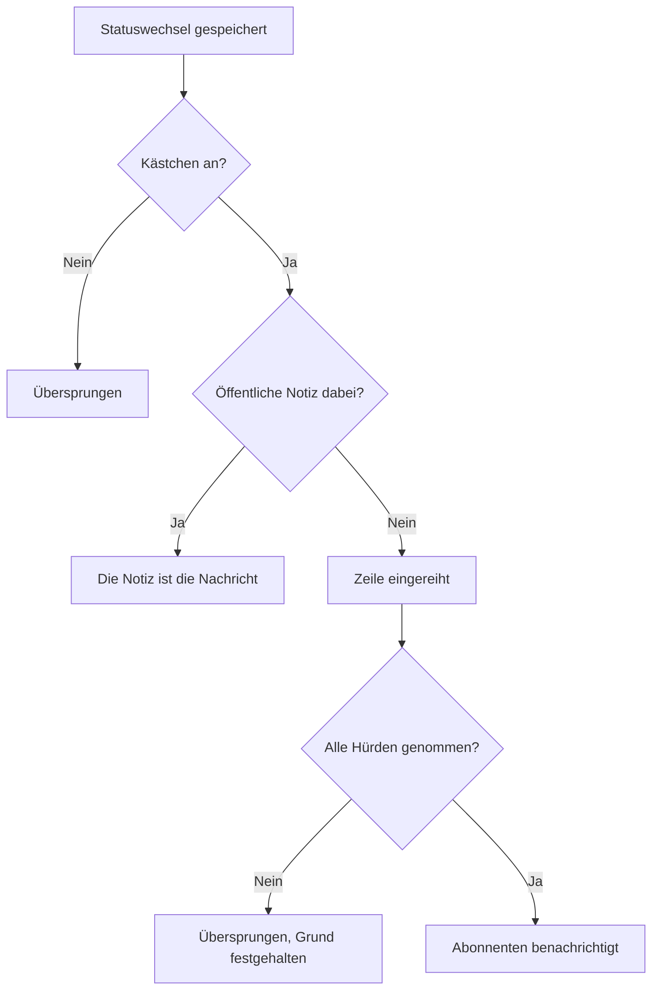

# Vorfallstatus & Schweregrade

Jeder Vorfall trägt zwei Einordnungen: einen **Status**, der sagt, wo Ihre Reaktion steht, und einen **Schweregrad**, der sagt, wie weh er tut. Diese Seite erklärt, was jeder Status bewirkt, wie Sie eigene anlegen und wie Schweregrade geordnet sind – für alle, die Vorfälle konfigurieren oder wissen wollen, warum einer alarmiert hat oder nicht, behoben wurde oder nicht oder auf einer Statusseite erschien oder nicht.

:::cards
- [Eigene Status anlegen](#eigene-status-anlegen): Bilden Sie Ihre Reaktion ab, und sehen Sie, was jeder Status zählt.
- [Was Bestätigen bewirkt](#was-bestätigen-bewirkt): Die Alarmierung stoppt, und das SLA gilt als beantwortet.
- [Was Beheben bewirkt](#was-beheben-bewirkt): Monitore werden freigegeben, und das SLA wird geschlossen.
- [Abonnenten informieren](#statusseiten-abonnenten-über-einen-statuswechsel-informieren): Die Hürden, die ein Statuswechsel nimmt, bevor eine Statusseite davon erfährt.
:::

## So funktioniert es

Im Dashboard sehen Status und Schweregrade ähnlich aus – beide erscheinen als farbige Etiketten in der Vorfallliste und als farbiger Punkt vor dem Namen, wo immer Sie einen auswählen, und beide sind projektbezogene Listen, die Sie umbenennen und umfärben können. Sie erfüllen aber sehr unterschiedliche Aufgaben.

Status steuern Verhalten. Drei boolesche Flags an den Statuszeilen bestimmen zusammen mit der Reihenfolge der Status, welche Vorfälle als aktiv gelten, welche Schaltflächen in der Kopfzeile des Vorfalls erscheinen, wann die SLA-Uhr stoppt und wann der Vorfall von Ihrer Statusseite verschwindet. Schweregrade steuern für sich nichts – sie sind Beschriftungen, die die Auswirkung beschreiben und auf die andere Regeln prüfen können.

```mermaid title="Vorfälle bewegen sich nur nach unten durch die Liste; die Position eines Status bestimmt, was er zählt"
flowchart TB
    subgraph open["Zählt als nicht bestätigt"]
        identified["Identifiziert"]
    end
    subgraph working["Zählt als bestätigt"]
        acknowledged["Bestätigt"]
        mitigated["Mitigated (eigener)"]
    end
    subgraph done["Zählt als behoben"]
        resolved["Behoben"]
        closed["Closed (eigener)"]
    end
    identified --> acknowledged
    acknowledged --> mitigated
    mitigated --> resolved
    resolved --> closed
    identified -. "überspringen" .-> resolved
```

Das Modell `IncidentState` hat `name`, `description`, `color` und `order`, dazu drei boolesche Werte: `isCreatedState`, `isAcknowledgedState` und `isResolvedState`. Alles, was das Produkt mit Status tut, hängt an diesen Werten und an `order` – nie am Namen des Status. Deshalb können Sie **Behoben** in „Closed“ umbenennen, ohne dass etwas kaputtgeht: Das Flag bleibt an der Zeile.

Das Modell `IncidentSeverity` hat `name`, `description`, `color` und `order` – und sonst nichts. Es gibt keine Flags. Nichts in OneUptime behandelt **Critical Incident** von sich aus anders als **Minor Incident** – der Schweregrad zählt nur dort, wo Sie etwas darauf ausrichten, etwa beim Kriterium **Vorfallsschweregrade** einer Bereitschaftsregel.

Ein paar schnelle Regeln:

- **Wählen Sie den Schweregrad, um die Auswirkung mitzuteilen** – er erscheint in der Vorfallliste und auf der **Übersicht** des Vorfalls und ist beim Melden eines Vorfalls ein Pflichtfeld.
- **Wählen Sie Status, um Ihren Prozess abzubilden** – die Reaktionsschritte, die Sie tatsächlich durchlaufen, in der Reihenfolge, in der Sie sie durchlaufen.
- **Kodieren Sie Dringlichkeit nicht in Status** – ein Status namens „Critical“ würde niemanden alarmieren. Das erledigt der Schweregrad zusammen mit einer Bereitschaftsregel.

> [!TIP]
> Beide Listen werden beim Anlegen Ihres Projekts vorbelegt, und beide bearbeiten Sie unter **Vorfälle → Einstellungen**. Dieser Abschnitt des Seitenmenüs Vorfälle ist standardmäßig eingeklappt; klappen Sie **Einstellungen** also auf, bevor Sie danach suchen.

## Die vorangelegten Status

Drei Status werden mit dem Projekt angelegt, in dieser Reihenfolge. Das Vorbelegen ist idempotent – ein Status wird nur hinzugefügt, wenn noch keiner mit diesem Namen existiert.

| Status           | `order` | Flag                  | Farbe     | Bedeutung                                          |
| ---------------- | ------- | --------------------- | --------- | -------------------------------------------------- |
| **Identifiziert** | `1`    | `isCreatedState`      | `#fd625e` | Der Status, in dem neue Vorfälle landen.           |
| **Bestätigt**    | `2`     | `isAcknowledgedState` | `#ffbf53` | Jemand hat den Vorfall übernommen.                 |
| **Behoben**      | `3`     | `isResolvedState`     | `#2ab57d` | Der Vorfall ist vorbei und zählt nicht mehr als aktiv. |

> [!NOTE]
> Der erste Status heißt **Identifiziert**, auch wenn einige Beschreibungen im Produkt ihn noch den „created“-Status nennen. Wenn eine Doku oder ein Tooltip „Erstellungsstatus“ sagt, ist der Status gemeint, der `isCreatedState` trägt – in einem neuen Projekt ist das **Identifiziert**.

## Was jedes Status-Flag tatsächlich bewirkt

| Flag                  | Zweck |
| --------------------- | ---------------------------------------------------------------------------------------------------------------------------------------------------------------------------------------------------- |
| `isCreatedState`      | Der Status, den ein Vorfall erhält, wenn niemand einen gewählt hat. Trägt kein Status im Projekt dieses Flag, schlägt das Anlegen eines Vorfalls mit einem Fehler fehl, der Sie auffordert, in den Einstellungen einen Erstellungsstatus für Vorfälle hinzuzufügen. |
| `isAcknowledgedState` | Kennzeichnet den bestätigten Status des Projekts: den, in den **Bestätigen** einen Vorfall setzt und nach dem die Kennzahlenkachel für die Bestätigung benannt ist. Ein Vorfall in ihm, in einem Status danach oder ein behobener ist bestätigt – **Bestätigen** wird für ihn nicht mehr angeboten, die Bereitschaft alarmiert für ihn nicht mehr, und sein SLA gilt als beantwortet. |
| `isResolvedState`     | Kennzeichnet den behobenen Status des Projekts: den, in den **Beheben** einen Vorfall setzt und den die Kennzahlenkachel für die Behebung zeigt. Ein Vorfall in ihm oder in einem Status danach ist behoben – er verlässt **Aktive Vorfälle** und den aktiven Bereich einer Statusseite, und sein SLA gilt als behoben. |

Pro Projekt soll jeweils nur ein Status jedes Flag tragen – die Abfragen holen den ersten in der Reihenfolge. Die drei markierten Status tragen auf der Einstellungsseite das Etikett **Vordefiniert**; zeigen Sie darauf (oder springen Sie mit Tab hin), um zu lesen, was OneUptime mit dem Status tut. Sie lassen sich umbenennen, umfärben und ziehen, aber:

- **Sie behalten ihre Reihenfolge.** Der Erstellungsstatus kommt vor dem bestätigten, der bestätigte vor dem behobenen. Ein Ziehen, das das bricht – etwa **Behoben** über **Bestätigt** –, wird abgelehnt, die Zeilen springen zurück, und die Seite sagt, warum.
- **Sie lassen sich nicht löschen.** Ihr **Löschen** bleibt im Zeilenmenü, gesperrt, mit Begründung. Ein Massenlöschen überspringt sie und listet sie als nicht gelöscht. Auch die API lehnt das Löschen des letzten Erstellungs-, bestätigten oder behobenen Status eines Projekts ab.

Weil die Oberfläche Statusnamen dynamisch liest, ändert eine Umbenennung, was Sie überall sehen – die Kennzahlenkacheln (**Acknowledged in** und **Resolved in** mit den vorangelegten Namen), die Bestätigung **Vorfall als … markieren** eines eigenen Status und das Etikett in der Vorfallliste folgen alle dem Namen, den Sie der Zeile gegeben haben.

## Eigene Status anlegen

Ein Status, den Sie anlegen, ist ein Schritt Ihrer Reaktion, den die drei vorangelegten nicht benennen: „Investigating“, „Mitigated“, „Monitoring“, „Closed“.

:::steps
### Die Statusliste öffnen

Gehen Sie zu **Vorfälle → Einstellungen → Vorfallsstatus**. Die Karte **Vorfallsstatus** listet Ihre Status in ihrer Reihenfolge, je eine Zeile: ein Griff zum Ziehen, Farbe und Name, was ein Vorfall darin **Zählt als** und die Beschreibung. Der Satz unter dem Titel sagt es klar: Vorfälle bewegen sich in dieser Liste nur nach unten.

### Den Status anlegen

Klicken Sie in der Kopfzeile der Karte auf **Vorfallsstatus erstellen** und füllen Sie das Formular aus (Felder unten). Der neue Status wird **direkt über dem behobenen Status** eingefügt – wo die meisten Status hingehören, und nie darunter, wo er unbemerkt als behoben zählen würde.

### An seinen Platz ziehen

Ziehen Sie eine Zeile an ihrem Griff, um sie zu verschieben. Die neue Reihenfolge wird beim Loslassen gespeichert; eine Ordnungszahl gibt es nicht einzutippen. Mit der Tastatur fokussieren Sie den Griff, drücken die Leertaste, bewegen mit den Pfeiltasten und drücken wieder die Leertaste. Die Spalte **Zählt als** aktualisiert sich beim Loslassen.
:::

**Bearbeiten** öffnet dasselbe Formular wie das Anlegen. Die ID des Status finden Sie unter **ID anzeigen** im Zeilenmenü.

| Feld            | Pflicht  | Was es bewirkt |
| --------------- | -------- | ------------------------------------------------------------------------------------------------------------------------------------------------------------------------------------------------------------------------------------------------------------------ |
| **Name**        | Ja       | Mindestens zwei Zeichen. Der Platzhalter schlägt etwa „Investigating“ vor. |
| **Beschreibung** | Nein    | Freitext, der erklärt, wann ein Vorfall in diesem Status steht. |
| **Farbe**       | Ja       | Beim Öffnen des Formulars schon gewählt: eine Farbe, die noch kein Status der Liste verwendet, damit ein neuer Status nie im selben Rot wie der darüber erscheint. Wählen Sie eine andere aus der Reihe benannter Farben (Rot, Orange, Limette, Grün, Petrol, Blau, Indigo, Lila, Magenta, Rosa) oder nehmen Sie **Benutzerdefinierte Farbe** für eine exakte Markenfarbe wie `#fd625e`. |

Die Farbe färbt das Etikett des Status und den Punkt vor seinem Namen in jeder Statusauswahl: in den Melde- und Vorlagenformularen, der Massenaktion **Status ändern**, dem Statusmenü der Kopfzeile sowie in Regel- und Filterbedingungen. Jede dieser Auswahlen listet die Status in der Reihenfolge, die diese Seite vorgibt.

Die drei Flags können Sie in diesem Formular nicht setzen – sie gehören zu den vorangelegten Zeilen. Ein Status, den Sie anlegen, ist also ein Status ohne Flag, was drei Folgen hat, die Sie einplanen sollten:

- **Seine Position bestimmt, was er zählt.** Die Spalte **Zählt als** zeigt es und ändert sich beim Ziehen: Über dem bestätigten Status ist ein Vorfall darin **Nicht bestätigt**; ab dem bestätigten Status abwärts zählt er als **Bestätigt**, Bereitschaftsrichtlinien eskalieren ihn also nicht mehr; ab dem behobenen Status abwärts zählt er als **Behoben**, Statusseiten zeigen ihn also nicht mehr als aktiv.
- **Über dem behobenen Status hält er den Vorfall aktiv.** **Aktive Vorfälle** enthält die Vorfälle, deren aktueller Status über dem behobenen Status liegt; ein dort angelegter Status hält den Vorfall also in der aktiven Liste und im Zähler der Seitenleiste. Ein unter den behobenen Status gezogener Status zählt überall als behoben – in den aktiven Listen, auf Statusseiten, bei Erinnerungen und beim SLA –, und einen Vorfall von **Behoben** in ihn zu verschieben ist kein zweites Beheben.
- **Sie verschieben einen Vorfall über das Menü der Kopfzeile hinein.** Die Schaltflächen der Kopfzeile sind nur **Bestätigen** und **Beheben**; ein eigener Status steht unter **Status ändern in** im Menü **⋯** daneben, das jeden Status nach dem aktuellen listet. Seine Bestätigung heißt **Vorfall als `<state name>` markieren**, mit der Schaltfläche **Als `<state name>` markieren**.

> [!TIP]
> Eine verbreitete Form ist ein Schritt zur Eindämmung zwischen dem bestätigten und dem behobenen Status – legen Sie „Mitigated“ an, und er landet direkt über **Behoben**, nach **Bestätigt**, und zählt als bestätigt. Für einen Schritt zur Sichtung, bevor jemand den Vorfall bestätigt hat, ziehen Sie ihn über **Bestätigt**.

## Die Reihenfolge ist eine echte Einschränkung, keine Anzeigevorliebe

Die Reihenfolge wird durchgesetzt, wenn ein Statuswechsel geschrieben wird, nicht nur beim Zeichnen der Liste:

- **Rückwärtsübergänge werden abgelehnt.** Einen Vorfall in einen Status zu verschieben, der in der Reihenfolge vor seinem aktuellen liegt, schlägt mit einem Fehler fehl, der beide Status nennt.
- **Den aktuellen Status erneut zu wählen wird abgelehnt.** Einen Vorfall auf den Status zu setzen, in dem er schon ist, schlägt mit „Incident state cannot be same as previous state.“ fehl.
- **Eine rückdatierte Zeile darf ihren Nachbarn nicht duplizieren.** Auch das Einfügen einer Zeitachsenzeile, deren Status dem der folgenden Zeile entspricht, wird abgelehnt.
- **Die Schaltflächen der Kopfzeile folgen der Position der markierten Status in der Reihenfolge.** **Bestätigen** und **Beheben** werden danach angeboten, wo der aktuelle Status in der nach Reihenfolge sortierten Liste steht. Ein eigener Status, der *nach* dem behobenen Status platziert ist, zeigt nie eine Schaltfläche **Beheben**, weil ein Vorfall darin schon als behoben zählt.

Platzieren Sie einen neuen Status also dort, wo ein Vorfall ihn tatsächlich durchläuft. Eine falsche Reihenfolge sieht nicht nur merkwürdig aus – sie macht Übergänge unmöglich. Einen Status nach unten zu verschieben ändert sofort beim Loslassen, wie die Vorfälle darin zählen.

Über die API und Terraform ist die Reihenfolge die Spalte `order`: Kleinere Zahlen kommen zuerst. Ein ohne Zahl angelegter Status kommt direkt über den behobenen Status; einer, der mit einer Zahl angelegt oder aktualisiert wird, nimmt diesen Platz ein, und die Status im Weg rücken eine Stufe nach unten. Zahlen, die sonst niemand hat, bleiben wie geschrieben, sodass ein von Terraform verwalteter Status die Zahl zurückliest, die er bekommen hat.

## Die vorangelegten Schweregrade

Drei Schweregrade werden mit dem Projekt angelegt, in dieser Reihenfolge, der schwerste zuerst:

| Schweregrad           | `order` | Farbe     | Vorangelegte Beschreibung |
| --------------------- | ------- | --------- | ----------------------------------------------------------------------------------------------------------------------------------------------------------------------------------------- |
| **Critical Incident** | `1`     | `#b70400` | Probleme mit sehr hoher Auswirkung auf Kunden. Eine sofortige Reaktion ist erforderlich. Beispiele sind ein vollständiger Ausfall oder ein Datenleck. |
| **Major Incident**    | `2`     | `#fd625e` | Probleme mit erheblicher Auswirkung. Eine sofortige Reaktion ist meist erforderlich. Möglicherweise gibt es Umgehungen, die die Auswirkung auf Kunden mildern. Beispiel ist der Ausfall eines wichtigen Teilsystems. |
| **Minor Incident**    | `3`     | `#ffbf53` | Probleme mit geringer Auswirkung, die meist innerhalb der Arbeitszeit erledigt werden können. Die meisten Kunden bemerken wahrscheinlich nichts. Beispiel ist ein leichter Rückgang der Anwendungsleistung. |

Der Schweregrad ist beim Melden eines Vorfalls Pflicht und ebenso bei jeder Vorfallangabe in den Kriterien eines Monitors, sodass jeder Vorfall – manuell oder automatisch – mit einem eintrifft. Den Meldeablauf finden Sie unter [Einen Vorfall melden](/docs/incidents/declaring-incidents), den Weg über Monitore unter [Vorfall- & Warnmeldungsvorlagen](/docs/monitor/incident-alert-templating).

## Schweregrade bearbeiten

Gehen Sie zu **Vorfälle → Einstellungen → Vorfallsschweregrad**. Derselbe Aufbau wie die Statusseite – eine Zeile pro Schweregrad, der schwerste zuerst, ziehen Sie eine Zeile, um ihren Rang zu ändern, und **Vorfallsschweregrad erstellen** fügt einen am Ende hinzu (den leichtesten), mit **Name**, **Beschreibung** und **Farbe** im Formular, die Farbe wie im Statusformular schon gewählt.

Der Rang zählt überall, wo OneUptime Schweregrade vergleicht: Eine Episode übernimmt den Schweregrad ihres schwersten Vorfalls, und Critical und Warning einer Monitor-Empfehlung entsprechen Ihrem ersten und zweiten Schweregrad.

Zwei Unterschiede zu Status:

- **Es gibt keinen Löschschutz.** Jeder Schweregrad kann gelöscht werden, auch die drei vorangelegten.
- **Keine Flags zum Erben und kein „Zählt als“.** Ein neuer Schweregrad verhält sich genau wie die vorangelegten – eine Beschriftung mit Farbe und Rang.

Wo der Schweregrad mehr tut als beschreiben: Unter **Vorfälle → Regeln → Bereitschaftsregeln** ist das Feld **Vorfallsschweregrade** einer Regel ein Kriterium. **Critical Incident** dort aufzuführen ist die Art, „bei allem Kritischen das Datenbankteam alarmieren“ auszudrücken – die Bereitschaftsrichtlinie liegt an der Regel, nicht am Schweregrad.

**Den Schweregrad eines Vorfalls ändern** – über **Bearbeiten** auf der Karte **Vorfalldetails** des Vorfalls, über die API oder Terraform (`incidentSeverityId`), mit einem Workflow oder mit den KI-Werkzeugen – bewirkt auf jedem Weg dieselben vier Dinge: Der Vorfall-Feed erhält einen Eintrag **Incident updated**, der den neuen Schweregrad nennt, die SLA-Fristen des Vorfalls werden neu berechnet, seine Erinnerungsregel wird neu zugeordnet, und die Vorfallsmetriken zählen eine Schweregradänderung. Den Schweregrad zu speichern, den der Vorfall schon hat, bewirkt nichts davon; nur den Titel eines Vorfalls zu bearbeiten lässt also seine SLA-Fristen, Erinnerungen und den Zähler der Schweregradänderungen unverändert. Der Schweregrad einer Warnung funktioniert für ihren Feed-Eintrag und ihre Erinnerungen genauso.

## Einen Vorfall durch seine Status bewegen

Es gibt vier Wege, auf denen ein Vorfall seinen Status ändert:

| Weg                 | Wo | Was gefragt wird |
| ------------------- | ------------------------------------------------------------------------------------------- | ------------------------------------------------------------------------------------------------------------------------------------------------------------------------------------------------------------ |
| **Schaltflächen der Kopfzeile** | Die Kopfzeile des Vorfalls: **Bestätigen** und **Beheben**, und **Status ändern in** in ihrem Menü **⋯** | Eine kurze Bestätigung – **Vorfall bestätigen** oder **Vorfall beheben** – mit **Statusseiten-Abonnenten benachrichtigen** und, eingeklappt unter **Öffentliche Notiz hinzufügen**, der optionalen **Öffentliche Notiz** und ihrer Auswahl **Notizvorlage auswählen** (wenn das Projekt Notizvorlagen hat). |
| **Statuszeitachse** | **Zustands-Zeitachse** im Seitenmenü des Vorfalls | Eine von Hand hinzugefügte Zeile mit **Vorfallstatus**, **Beginnt am** und **Statusseiten-Abonnenten benachrichtigen**. |
| **Massenänderung**  | **Status ändern** für eine Auswahl in der Vorfallliste | Eine Seite mit dem Status, **Statusseiten-Abonnenten benachrichtigen** und demselben eingeklappten **Öffentliche Notiz hinzufügen**. |
| **Automatisch**     | Ein Monitorkriterium oder Ihr eigener Code | Ein Kriterium mit eingeschaltetem **Vorfall automatisch beheben** behebt seinen Vorfall, wenn das Kriterium nicht mehr erfüllt ist. Die API ändert den Status, indem sie eine Zeile unter `/api/incident-state-timeline` anlegt. |

Liegt der aktuelle Status vor dem bestätigten Status, bietet die Kopfzeile **Bestätigen** und **Beheben** an; liegt er zwischen beiden, nur **Beheben**. Das Bestätigen stoppt außerdem jede Bereitschaftseskalation des Vorfalls.

Jeder dieser Wege schreibt eine Zeitachsenzeile. Ein Statuswechsel tut außerdem einiges, worum Sie nicht bitten müssen: Er postet einen Eintrag in den Vorfall-Feed, ernennt einen Vorfall-Kommandanten, falls der Vorfall noch keinen hat, und aktualisiert die SLA-Uhr. Das Wiedereröffnen eines behobenen Vorfalls startet ab dem Zeitpunkt der Wiedereröffnung einen neuen SLA-Datensatz.

## Was Bestätigen bewirkt

Ein Vorfall ist bestätigt ab dem Moment, in dem er in Ihren bestätigten Status wechselt, in einen Status danach – einen Status **Mitigated** oder **Investigating**, den Sie unter **Bestätigt** platziert haben – oder in einen behobenen Status, gleich auf welchem der vier Wege oben er bewegt wird. Die Spalte **Zählt als** auf der Statuseinstellungsseite zeigt, welche Status das sind. Ist er bestätigt:

- **Bestätigen wird nicht mehr angeboten.** Nicht in der Kopfzeile des Vorfalls, nicht in der mobilen App (ihre Schaltfläche und ihre Wischgeste), nicht in Slack oder Microsoft Teams und nicht über `acknowledge_incident` des OneUptime-MCP-Servers. Ihn trotzdem zu bestätigen – von einer Bereitschaftsalarmierung, aus Slack oder Teams – wird mit „Incident is already acknowledged.“ (oder „Incident is already resolved.“) abgelehnt, statt ihn in seiner Liste nach oben zurückzusetzen.
- **Die Bereitschaft alarmiert für ihn nicht mehr.** Ein Responder, der seine Alarmierung bestätigt, nachdem ein Kollege den Vorfall bestätigt oder weiterbewegt hat, bekommt seine Alarmierung bestätigt, und der Vorfall bleibt, wo er ist.
- **Das SLA gilt als beantwortet**, beim ersten solchen Wechsel; spätere Status behalten diese Zeit.
- **Die Zeit bis zur Bestätigung läuft bis zu diesem ersten Wechsel** – die Kennzahlenkachel der **Übersicht** des Vorfalls, die Metrik **Time to Acknowledge**, eine Messung, die bei **Der Vorfall wird bestätigt** endet, und die MTTA in Slack- und Microsoft-Teams-Zusammenfassungen. Ein Vorfall, der direkt von **Identifiziert** zu **Investigating** wechselt, wurde dann bestätigt; einer, der sofort behoben wird, wurde beim Beheben bestätigt.
- **Ein Filter Bestätigt** – etwa in einem Vorfalllisten-Widget eines Dashboards – zeigt die Vorfälle in Ihrem bestätigten Status und in jedem Status danach, vor behoben.

Warnungen und Episoden folgen derselben Regel, mit Ihren Warnungsstatus.

## Was Beheben bewirkt

Ein Vorfall wird behoben, wenn er von einem Status über Ihrem behobenen Status in den behobenen Status oder in einen Status danach wechselt – gleich auf welchem der vier Wege oben. Jedes Beheben:

- **Gibt die Monitore frei, die der Vorfall hält.** Ein offen gemeldeter Vorfall hält seine Monitore: Er hat sie in seinen Status **Monitor-Status ändern in** gesetzt, wenn er einen nennt, und – von Hand gemeldet – ihre Überwachung pausiert. Auch eine Bearbeitung, während er offen ist – Monitore hinzufügen oder diesen Status ändern –, lässt ihn sie halten. Das Beheben setzt ihre Überwachung fort und setzt sie auf betriebsbereit zurück, sofern nicht ein anderer offener Vorfall noch auf ihnen liegt, und ab dann hält der Vorfall nichts mehr. Ein bereits behoben gemeldeter Vorfall gibt also nichts frei, ebenso wenig ein zweites Beheben nach einer Wiedereröffnung: Ein Status, den seine Monitore dazwischen bekamen – von ihren Proben, durch Wartung oder von Hand gesetzt –, bleibt.
- **Markiert das SLA als behoben** und entwirft, wenn KI-Postmortem-Entwürfe von OneUptime eingeschaltet sind, ein Postmortem.

Von **Behoben** in einen Status danach zu wechseln – etwa **Closed** – ist kein zweites Beheben: Nichts davon läuft erneut, und kein neues SLA beginnt. Ein Vorfall, der gemeldet wurde, bevor OneUptime dies aufzeichnete, gibt seine Monitore wie bisher beim nächsten Beheben frei.

## Die Statuszeitachse

Die Seite **Zustands-Zeitachse** im Seitenmenü des Vorfalls ist der Prüfpfad jedes Status, in dem der Vorfall war. Die Karte auf dieser Seite heißt **Status-Zeitachse** und ist absteigend nach Neuheit sortiert.

| Spalte | Was sie zeigt |
| ---------------------------------- | -------------------------------------------------------------------------------------------------------------------------------------------------------------------------------------------------------------------------------------------------------------- |
| **Vorfallstatus** | Ein farbiges Etikett mit Name und Farbe des Status. |
| **Beginnt am** | Wann der Vorfall in diesen Status kam. |
| **Endet am** | Wann er ihn verließ. Der aktuelle Status zeigt `Currently Active`. |
| **Dauer** | Die im Status verbrachte Zeit, beim aktuellen bis jetzt gezählt. |
| **Abonnenten-Benachrichtigungsstatus** | Ob die Statusseiten-Benachrichtigung für diese Änderung gesendet, übersprungen wurde oder noch aussteht, mit einem Link **weitere Details** und – wenn das Senden fehlschlug – einer Aktion **Wiederholen**. **Wiederholen** sendet den Statuswechsel erneut an jede Statusseite, die der Vorfall jetzt erreicht, auch an die Abonnenten, die ihn schon erhalten haben. |

Jede Zeile hat zwei Aktionen:

- **Ursache anzeigen** – öffnet einen Dialog **Grundursache** mit dem Markdown, das mit diesem Statuswechsel festgehalten wurde.
- **Protokolle anzeigen** – öffnet einen Dialog, der erklärt, warum sich der Status geändert hat, mit einem Betrachter **Vorfallstatus-Protokoll**.

Im Dashboard lassen sich Zeitachsenzeilen hinzufügen und löschen, aber nicht bearbeiten; ein Vorfall behält immer mindestens eine Zeile. Über die API lässt sich das `startsAt` einer Zeile korrigieren, und jede aus der Zeitachse berechnete Messung folgt dem.

> [!WARNING]
> Das Löschen der falschen Zeile schreibt die Geschichte des Vorfalls um – behandeln Sie es als Korrekturwerkzeug, nicht als Aufräumgewohnheit.

## Die Liste Aktive Vorfälle

**Vorfälle → Aktive Vorfälle** ist die Liste, die Sie während einer Schicht im Blick behalten. Ihre Definition ist genau eine Bedingung: Der aktuelle Status des Vorfalls liegt über Ihrem behobenen Status – dem ersten Status in der Reihenfolge mit `isResolvedState`. Nichts anderes zählt – nicht der Schweregrad, nicht das Alter, nicht, ob jemand ihn bestätigt hat.

Der Eintrag im Seitenmenü trägt ein rotes Zähler-Badge mit derselben Abfrage, sodass Badge und Liste immer übereinstimmen. Gibt es nichts zu sehen, sagt die Seite das.

Die praktische Folge: Ein eigener Status, den Sie über dem behobenen Status anlegen, hält Vorfälle in dieser Liste – „Mitigated“ heißt nicht „erledigt“ –, und einer, den Sie danach platzieren, nimmt sie heraus, wie der behobene Status selbst. Warnungen und Episoden folgen derselben Regel mit ihren eigenen Status, und die Zähler im Seitenmenü, Erinnerungen, Statusseiten und die mobile App lesen sie alle.

## Statusseiten-Abonnenten über einen Statuswechsel informieren

Ein Statuswechsel kann Ihre Statusseiten-Abonnenten benachrichtigen, durchläuft dabei aber mehrere Hürden. Wer sie versteht, erspart sich viel „Warum wurde niemand benachrichtigt?“-Fehlersuche.



Die Benachrichtigung wird pro Zeitachsenzeile über **Statusseiten-Abonnenten benachrichtigen** (`shouldStatusPageSubscribersBeNotified`) angefordert, das Kontrollkästchen im Statuswechsel-Dialog und im manuellen Zeitachsenformular. Im Statuswechsel-Dialog ist es aus, wenn der Vorfall gemeldet wurde, ohne die Abonnenten zu benachrichtigen. Dasselbe Kästchen entscheidet auch, ob die öffentliche Notiz des Dialogs jemanden benachrichtigt. Ist es aus, wird die Zeile mit dem Status übersprungen und einer Erklärung gespeichert. Ist es an, wird die Zeile eingereiht, und ein Hintergrundjob greift sie auf – der Job läuft jede Minute, die Zustellung ist also schnell, aber nicht sofort.

**Die eingereihte Zeile wird dann übersprungen, wenn eines davon zutrifft:**

- **Der neue Status ist der Erstellungsstatus.** Die Abonnenten wurden schon beim Melden des Vorfalls informiert, die erste Zeitachsenzeile schickt also bewusst keine zweite Nachricht.
- **Der Vorfall hat keine Monitore.** Ohne Ressourcen gibt es keine Statusseite, der der Vorfall zugeordnet werden könnte.
- **Der Vorfall ist auf der Statusseite nicht sichtbar** (`isVisibleOnStatusPage` ist aus).
- **Die Statusseite hat Vorfälle ausgeschaltet** (`showIncidentsOnStatusPage` ist aus). Das gilt pro Statusseite – andere Seiten, die denselben Monitor zeigen, werden trotzdem benachrichtigt.
- **Die Statusseite liegt außerhalb des Umfangs des Vorfalls.** Ein mit **Auf diese Statusseiten beschränken** auf einige Statusseiten beschränkter Vorfall benachrichtigt nur diese unter den Seiten, die seine Monitore führen, und eine Seite mit eingeschaltetem **Nur auf diese Seite beschränkte Vorfälle anzeigen** wird nie über einen Vorfall benachrichtigt, der nicht auf sie beschränkt ist. Auch das gilt pro Statusseite. Siehe [Eine Statusseite pro Zielgruppe](/docs/status-pages/one-status-page-per-audience).

**Noch etwas ändert das Ergebnis.** Schreiben Sie im Statuswechsel-Dialog (unter **Öffentliche Notiz hinzufügen**) oder in der Massenaktion **Status ändern** eine **Öffentliche Notiz**, während **Statusseiten-Abonnenten benachrichtigen** an ist, wird die Zeitachsenzeile als bereits benachrichtigt markiert statt eingereiht, und ihre Statusmeldung sagt, dass die Notiz sie übermittelt hat. Die Notiz selbst erreicht die Abonnenten, sie erhalten also eine Nachricht statt zwei. Eine Notiz, die nur aus Leerzeichen besteht, wird nicht gepostet, und die Zeile wird wie üblich eingereiht. Statuswechsel geplanter Wartungen funktionieren genauso. Der Ereignistyp hinter der einfachen Statuswechsel-Nachricht ist `Subscriber Incident State Changed`.

**Die Notiz sagt, wo der Vorfall jetzt steht.** Weil die Notiz die eine Nachricht ist, nennt sie auf jedem Kanal den neuen Status, wie es die Statuswechsel-Nachricht getan hätte: Der Betreff der E-Mail lautet `[Resolved Incident] <title>`, und ihre Details zeigen eine Zeile **Status** in der Farbe des Status, die SMS sagt `Incident <title> on <status page> is Resolved.`, Slack- und Microsoft-Teams-Nachrichten tragen eine Zeile `**Status:** Resolved`, und die Webhook-Nutzlast `IncidentNoteCreated` trägt `incidentState` in `data`. Eine einzeln gepostete Notiz behält ihre übliche Nachricht, ebenso die Aktualisierungsbenachrichtigung einer Bearbeitung.

**Das Posten der Notiz braucht eine eigene Berechtigung.** Status ändern und eine öffentliche Notiz posten sind getrennte Berechtigungen (**Create Incident State Timeline** und **Create Incident Status Page Note** in einer eigenen Rolle; die eingebauten Vorfall- und Projektrollen haben beide). Einen Status zu ändern braucht keine Berechtigung, den Vorfall zu bearbeiten: siehe [Einen Status ändern](/docs/permissions/index#einen-status-ändern). Wer den Status eines Vorfalls ändern, aber keine öffentlichen Notizen posten darf, bekommt **Öffentliche Notiz hinzufügen** im Dialog und in der Massenaktion **Status ändern** nicht angeboten. Ein Statuswechsel, den er mit einer Notiz über die API sendet, wird vollständig abgelehnt, mit einer Meldung, die sagt, dass der Status nicht geändert wurde und warum – so wird nie ein Wechsel als durch eine Notiz übermittelt erfasst, die nie gepostet wurde. Ohne die Notiz geht der Wechsel durch. Warnungen, Warnungsepisoden und Vorfallsepisoden bieten bei einem Statuswechsel stattdessen eine private Notiz an (**Private Notiz hinzufügen**), und sie funktioniert genauso: Das Posten braucht die eigene Berechtigung der Notiz (**Create Alert Internal Note**, **Create Alert Episode Internal Note** oder **Create Incident Episode Internal Note** in einer eigenen Rolle; die eingebauten Warnungs-, Vorfall- und Projektrollen haben sie), und ein Statuswechsel, den jemand ohne sie mit einer privaten Notiz sendet, wird vollständig abgelehnt, der Status also nicht geändert.

**Gesendet heißt: an jeden Abonnenten gesendet.** Der Job wartet auf jede Nachricht und zählt sie pro Statusseite und Kanal als gesendet oder fehlgeschlagen, und die Statusmeldung der Zeile listet diese Zahlen auf. Eine fehlgeschlagene Nachricht oder ein Versand, dessen Zeit ablief oder der unterbrochen wurde, macht die Zeile **Fehlgeschlagen**. Siehe [Abonnenten & Ankündigungen](/docs/status-pages/subscribers).

Wer diese erhält und wie die Vorlagen gewählt werden, steht unter [Abonnenten & Ankündigungen](/docs/status-pages/subscribers).

## Einen Vorfall von der Statusseite fernhalten

Vier getrennte Dinge entscheiden, ob ein Vorfall überhaupt auf einer öffentlichen Seite erscheint, und alle vier müssen zutreffen:

- **Vorfälle anzeigen** (`showIncidentsOnStatusPage`) auf der Statusseite selbst.
- **Auf Statusseite sichtbar** (`isVisibleOnStatusPage`) am Vorfall – ein Schalter auf der Seite **Einstellungen** des Vorfalls. Er ist standardmäßig true und steht nicht im Melde-Assistenten; ein Monitorkriterium kann ihn mit **Vorfall auf der Statusseite anzeigen** setzen. Ein verborgen gemeldeter Vorfall informiert beim Anlegen keinen Abonnenten; schalten Sie diesen Schalter später ein, bietet das Bearbeitungsformular **Abonnenten benachrichtigen, dass dieser Vorfall erstellt wurde** an. Siehe [Einen Vorfall melden](/docs/incidents/declaring-incidents).
- **Die Seite liegt in der Reichweite des Vorfalls.** Die Seite führt einen der Monitore des Vorfalls und ist, falls der Vorfall auf einige Statusseiten beschränkt ist, eine davon. Eine Seite mit eingeschaltetem **Nur auf diese Seite beschränkte Vorfälle anzeigen** zeigt nur die auf sie beschränkten Vorfälle. Siehe [Eine Statusseite pro Zielgruppe](/docs/status-pages/one-status-page-per-audience).
- **Der aktuelle Status liegt über dem behobenen Status.** Das ist es, was einen Vorfall aus dem aktiven Bereich entfernt: Die Statusseiten-Abfrage holt Vorfälle, deren aktueller Status über Ihrem behobenen Status liegt, sodass der behobene Status und jeder danach den Vorfall herausnehmen. Sie archivieren oder schließen nichts – Sie beheben ihn, und er wandert in den Verlauf.

**Private Vorfälle erscheinen nie.** Das Einschalten von **Privater Vorfall** verbirgt den Vorfall auf jeder Statusseite, unabhängig von den Schaltern oben, und beschränkt ihn auf seine Eigentümer sowie Projektadmins und -eigentümer. Auch nichts davon erreicht einen Statusseiten-Abonnenten: weder seine Erstellung noch seine Statuswechsel, seine öffentlichen Notizen oder sein Postmortem. Die Bilder in seiner Beschreibung, seinem Postmortem, seinen benutzerdefinierten Feldern und öffentlichen Notizen sind, solange er privat ist, nicht für alle sichtbar.

Die beiden Schalter werden synchron gehalten, sodass die Seite **Einstellungen** des Vorfalls immer zeigt, was Statusseiten tun:

- Einen Vorfall privat zu machen schaltet **Auf Statusseite sichtbar** mit aus.
- **Auf Statusseite sichtbar** einzuschalten, während der Vorfall privat bleibt, lässt es aus. Um einen privaten Vorfall zu veröffentlichen, schalten Sie **Privater Vorfall** aus und **Auf Statusseite sichtbar** ein – in einem Speichervorgang oder nacheinander.

Das gilt, wie auch immer der Vorfall geschrieben wird: Dashboard, API, Terraform, ein Workflow, ein Monitor, eine Vorfallsvorlage oder eine Datenschutzregel. Ein als Text gesendeter Wert wie `"true"` zählt wie `true`. Ein einzelner Schreibvorgang auf viele Vorfälle, der **Auf Statusseite sichtbar** einschaltet – etwa **Update Many** eines Workflows –, zeigt die nicht privaten und lässt jeden privaten verborgen. Jeder Vorfall wird so entschieden, wie er ist, wenn der Schreibvorgang ihn erreicht, sodass eine gleichzeitig eintreffende Änderung seiner Privatsphäre nie überholt wird: Ein Vorfall wird nie zugleich privat und sichtbar gespeichert. Ein privat angelegter Vorfall wird verborgen angelegt und informiert keinen Abonnenten über seine Erstellung.

**Episoden folgen derselben Regel.** Eine private Vorfallsepisode ist auf jeder Statusseite verborgen, was immer ihr Schalter **Auf Statusseite sichtbar** sagt, und ihre Abonnenten hören nichts von ihr. Auf der Seite **Einstellungen** der Episode sagt der Schalter das und bleibt aus, solange die Episode privat ist. Ein privater Vorfall bringt seine Episode nie auf eine Statusseite: Eine Episode erreicht eine Seite nur über Vorfälle, die nicht privat sind.

:::details Upgrade von einer Version ohne diese Regeln
Vorfälle und Episoden, die vor diesen Regeln privat mit noch eingeschaltetem **Auf Statusseite sichtbar** gespeichert wurden, bekommen es beim Upgrade ausgeschaltet. Dabei wird niemandem etwas gesendet. Die Bilder, die ein solcher Vorfall oder eine solche Episode für alle sichtbar gemacht hatte, werden wieder privat, sofern nichts, was Ihre Statusseiten zeigen, sie noch enthält. Ebenso die Bilder in öffentlichen Notizen von Vorfällen, Episoden und geplanten Wartungsereignissen, die Ihre Statusseiten nicht zeigen, und die bisher für alle sichtbar blieben.
:::

Wie viel behobenen Verlauf die Seite behält, ist eine Einstellung der Statusseite, nicht des Vorfalls. Wie die Monitore auf der Seite bestimmen, welche Vorfälle überhaupt erscheinen, steht unter [Statusseiten – Ressourcen & Gruppen](/docs/status-pages/resources-and-groups).

## Nächste Schritte

:::cards
- [Einen Vorfall melden](/docs/incidents/declaring-incidents): Beim Melden einen Anfangsstatus und einen Schweregrad wählen.
- [Vorfallnotizen, Eigentümer & Feed](/docs/incidents/notes-owners-and-feed): Die öffentliche Notiz posten, die mit einem Statuswechsel hinausgeht.
- [Vorfalleinstellungen & Automatisierung](/docs/incidents/settings): Die Zeit zwischen Status messen und Schweregrade in Regeln prüfen.
- [Abonnenten & Ankündigungen](/docs/status-pages/subscribers): Wer die Nachrichten erhält, die ein Statuswechsel sendet.
:::
