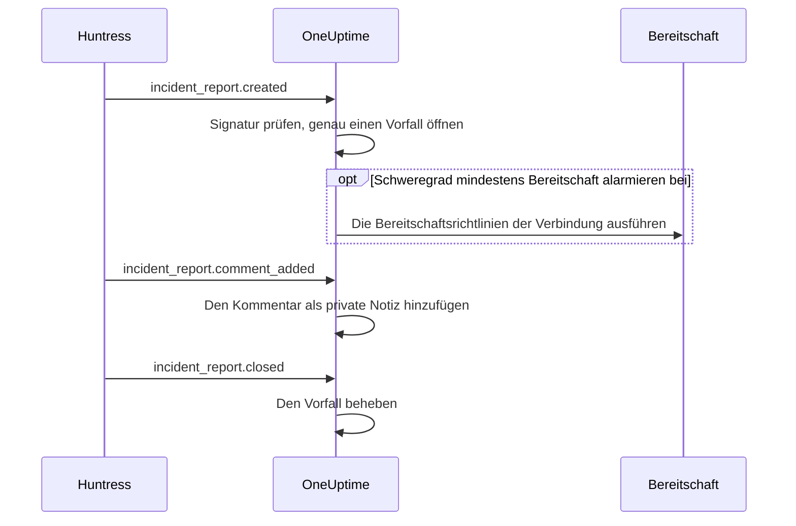

# Huntress-Integration

Alarmieren Sie Ihre Bereitschaft bei Huntress-Vorfallsmeldungen. Wenn das Huntress-SOC eine Vorfallsmeldung zu einem Endpunkt oder einer Identität sendet, öffnet OneUptime dafür genau einen Vorfall, mit dem Schweregrad Ihrer Wahl, alarmiert die Bereitschaftsrichtlinien, die Sie auswählen, und behebt den Vorfall, wenn die Meldung in Huntress geschlossen wird.

Diese Integration ist **eingehend**: Huntress sendet jedes Ereignis zu einer Vorfallsmeldung an eine Webhook-URL, die Sie von OneUptime erhalten, signiert mit dem Signaturgeheimnis des Endpoints. OneUptime ruft Huntress nie auf und braucht deshalb keinen Huntress-API-Schlüssel.

:::cards
- [So funktioniert es](#so-funktioniert-es): Was OneUptime mit jedem Ereignis zu einer Meldung tut.
- [Einrichten](#die-integration-einrichten): In OneUptime verbinden, den Endpoint in Huntress anlegen, sein Signaturgeheimnis speichern, einen Test senden.
- [Einstellungen](#einstellungen): Alarmierung, Schweregrade, Organisationen, Beschriftungen und Beheben.
- [Fehlerbehebung](#fehlerbehebung): Was die Fehler der Verbindung bedeuten und was zu ändern ist.
:::

## So funktioniert es

Huntress sendet ein Ereignis zu einer Vorfallsmeldung, wenn die Meldung versendet wird, wenn jemand sie kommentiert und wenn sie geschlossen wird. Jedes Ereignis enthält die ganze Meldung.

1. **Prüfen.** Eine Anfrage muss mit dem Signaturgeheimnis des Endpoints signiert sein, höchstens fünf Minuten bevor sie eintrifft. Alles andere wird abgelehnt, und die Seite der Verbindung sagt, warum.
2. **Genau einen Vorfall öffnen.** Das erste Ereignis zu einer Meldung öffnet einen Vorfall, der nach der Meldung benannt ist, etwa `Huntress: Incident on DESKTOP-01 (Acme Corp)`. Seine Beschreibung enthält die Zusammenfassung der Meldung, ihren Schweregrad in Huntress, die Organisation, den betroffenen Host oder die Identität, die Indikatoren, die Huntress gefunden hat, und einen Link zur Meldung in Huntress. Spätere Ereignisse zur selben Meldung und Zustellungen, die Huntress erneut sendet, finden diesen Vorfall: Eine Meldung öffnet nie zwei.
3. **Alarmieren.** Der Vorfall öffnet mit dem Vorfallsschweregrad, den die Verbindung dem Huntress-Schweregrad der Meldung zuordnet. Liegt dieser Schweregrad bei oder über **Bereitschaft alarmieren bei**, werden die **Bereitschaftsrichtlinien** der Verbindung ausgeführt.
4. **Der Meldung folgen.** Ein Kommentar in Huntress wird zu einer privaten Notiz am Vorfall. Wird die Meldung geschlossen oder verworfen, wird der Vorfall behoben.

So geöffnete Vorfälle erscheinen nie auf einer Statusseite. Ihre Vorfallsregeln (Bereitschafts-, Besitzer-, Beschriftungs- und Datenschutzregeln) gelten für sie wie für jeden anderen Vorfall.

## Bevor Sie beginnen

- In OneUptime die Rolle **Project Owner** oder **Project Admin**. Mitglieder, Betrachter und die Vorfallsrollen sehen die Verbindung und die empfangenen Meldungen, können sie aber nicht ändern.
- In Huntress die Rolle **Account Admin**: Nur Account-Admins können Webhooks anlegen.
- Eine Bereitschaftsrichtlinie, die alarmiert wird. Ohne sie öffnen Meldungen Vorfälle und alarmieren niemanden, es sei denn, eine Bereitschaftsregel für Vorfälle passt auf sie.
- Bei einer selbst gehosteten Installation ein OneUptime, das Huntress aus dem Internet über HTTPS erreicht: Huntress sendet Webhooks nur an `https://`-URLs.

## Die Integration einrichten

:::steps
### Huntress in OneUptime verbinden

Öffnen Sie **Vorfälle → Integrationen → Huntress** (`/dashboard/{projectId}/incidents/integrations/huntress`). Der Abschnitt **Integrationen** im Seitenmenü der Vorfälle ist standardmäßig eingeklappt, klappen Sie ihn also zuerst auf. Klicken Sie auf **Huntress verbinden**.

Wählen Sie die **Bereitschaftsrichtlinien**, die alarmiert werden sollen. **Bereitschaft alarmieren bei** fragt dann, welche Meldungen sie alarmieren, und beginnt mit **Hohe und kritische Meldungen**. Alles andere wartet unter **Weitere Felder** mit einem Standardwert (siehe [Einstellungen](#einstellungen)). Klicken Sie auf **Huntress verbinden**. Die Seite der Verbindung öffnet sich, mit einer Karte **Huntress verbinden**, die Sie durch die nächsten drei Schritte führt.

### Einen Webhook-Endpoint in Huntress anlegen

Klicken Sie auf der Seite der Verbindung auf **Webhook-URL kopieren**. Die URL sieht aus wie `https://oneuptime.com/api/huntress/webhook/<connection-id>`; bei einer selbst gehosteten Installation beginnt sie mit Ihrem eigenen Host.

Öffnen Sie in Huntress das Menü oben rechts und wählen Sie **Integrations**. Klicken Sie auf **Add an Integration**, wählen Sie **Webhooks** und klicken Sie auf **Add Endpoint**. Fügen Sie die URL ein, schalten Sie **Incident Reports** ein und speichern Sie. Lassen Sie **Escalations**, **Platform Actions** und **Account Notices** aus: OneUptime nimmt diese Ereignisse an und tut nichts mit ihnen.

### Das Signaturgeheimnis des Endpoints speichern

Öffnen Sie in Huntress das Menü des Endpoints (⋯) und wählen Sie **View Signing Secret**. Kopieren Sie es vollständig: Es beginnt mit `whsec_`. Klicken Sie auf der Seite der Verbindung auf **Signaturgeheimnis speichern**, fügen Sie es ein und klicken Sie auf **Signaturgeheimnis speichern**. Das Geheimnis wird verschlüsselt und nie wieder angezeigt.

Solange das Geheimnis nicht gespeichert ist, lehnt OneUptime jede Anfrage an die URL ab. Huntress sendet ein abgelehntes Ereignis später erneut, sodass ein jetzt abgelehntes Ereignis trotzdem ankommt.

### Einen Test senden

Öffnen Sie in Huntress das Menü des Endpoints (⋯) und wählen Sie **Send Test**. Innerhalb weniger Sekunden wird die Karte auf der Seite der Verbindung zu **Verbindung**, mit dem Zustand **Empfängt Meldungen**.

> [!NOTE]
> Was auch immer der Test enthält, die Verbindung zeigt, dass er angekommen ist. Ein Test mit einer Vorfallsmeldung öffnet einen Vorfall wie jede andere Meldung und alarmiert die Bereitschaft, wenn er schwer genug ist.
:::

## Einstellungen

**Huntress verbinden** fragt nur, wer alarmiert wird und bei welchen Meldungen. Alles andere wartet unter **Weitere Felder**, mit einem Standardwert, der den meisten Teams passt. Um eine Einstellung später zu ändern, klicken Sie auf der Karte **Einstellungen** der Verbindung auf **Einstellungen bearbeiten**.

| Einstellung | Was sie bewirkt | Standard |
| --- | --- | --- |
| **Bereitschaftsrichtlinien** | Die Richtlinien, die ausgeführt werden, wenn eine Meldung schwer genug ist. Leer lassen, um Vorfälle zu öffnen, ohne jemanden zu alarmieren. | Keine |
| **Bereitschaft alarmieren bei** | Welche Meldungen die Richtlinien alarmieren: **Nur kritische Meldungen**, **Hohe und kritische Meldungen** oder **Jede Meldung**. Jede Meldung öffnet so oder so einen Vorfall. | **Hohe und kritische Meldungen** |
| **Name** | Wie die Verbindung in OneUptime heißt. | `Huntress` |
| **Schweregrad für kritische Meldungen**, **Schweregrad für hohe Meldungen**, **Schweregrad für niedrige Meldungen** | Der Vorfallsschweregrad, mit dem jeder Huntress-Schweregrad öffnet. | Ihre drei höchsten Vorfallsschweregrade, in Rangfolge |
| **Nur diese Organisationen** | Die Huntress-Organisationen, deren Meldungen Vorfälle öffnen, ein Organisationsname oder eine ID pro Zeile. Bei Namen zählt die Groß- und Kleinschreibung nicht. | Leer: jede Organisation |
| **Beschriftungen** | Beschriftungen für jeden Vorfall, zusätzlich zu der nach der Organisation der Meldung benannten. | Keine |
| **Beheben, wenn Huntress die Meldung schließt** | Den Vorfall beheben, wenn seine Meldung in Huntress geschlossen oder verworfen wird. Ist es aus, sagt das stattdessen eine private Notiz am Vorfall. | An |

### Schweregrade

Huntress gibt jeder Vorfallsmeldung einen von drei Schweregraden. Sofern Sie keinen Vorfallsschweregrad dafür wählen, öffnet sie in der Rangfolge Ihrer Vorfallsschweregrade, wie **Vorfälle → Einstellungen → Vorfallsschweregrad** sie auflistet:

| Huntress-Schweregrad | Was Huntress damit meint | Vorfallsschweregrad |
| --- | --- | --- |
| Critical | Angreifer an der Tastatur, gefährliche Malware oder eine aktive Kompromittierung, sofort einzudämmen. | Der höchste |
| High | Bestätigte Malware, die dringend beseitigt werden muss, oder eine handlungsrelevante Kompromittierung einer Identität. | Der zweite |
| Low | Potenziell unerwünschte Programme, Malware-Überreste und ältere Funde zu Identitäten. | Der dritte |

Ein Projekt mit weniger Schweregraden nutzt für den Rest seinen niedrigsten. Eine Meldung ohne Schweregrad wird als hoch behandelt. Wird ein gewählter Schweregrad gelöscht, entscheidet wieder die Rangfolge.

### Organisationen

Jeder Vorfall erhält eine Beschriftung, die nach der Huntress-Organisation der Meldung benannt ist, etwa _Acme Corp_. Eine Verbindung empfängt die Meldungen aller Organisationen Ihres Huntress-Kontos, und **Nur diese Organisationen** schränkt das ein.

> [!TIP]
> Um das eigene Team jedes Kunden zu alarmieren, lassen Sie die **Bereitschaftsrichtlinien** der Verbindung leer und legen pro Organisation eine Bereitschaftsregel für Vorfälle an, etwa „Wenn **Vorfall-Beschriftungen** eines von _Acme Corp_ hat“, die die Richtlinie dieses Kunden ausführt. Siehe [Bereitschaftsregeln für Vorfälle](/docs/incidents/settings#bereitschaftsregeln-für-vorfälle).

## Meldungen auf der Seite der Verbindung

Die Liste **Vorfallsmeldungen** der Verbindung zeigt jede Meldung, die Huntress gesendet hat, die neueste zuerst: den betroffenen Host oder die Identität, Schweregrad und Status in Huntress und das **Ergebnis**.

| Ergebnis | Was passiert ist |
| --- | --- |
| **Vorfall geöffnet** | Die Meldung hat einen Vorfall geöffnet. **Vorfall anzeigen** öffnet ihn; **Bereitschaft alarmiert** sagt, dass die Verbindung ihre Richtlinien alarmiert hat. |
| **Vorfall behoben** | Huntress hat die Meldung geschlossen, und ihr Vorfall wurde behoben. |
| **Übersprungen: Organisation nicht überwacht** | Die Organisation der Meldung steht nicht in **Nur diese Organisationen**. |
| **Übersprungen: in Huntress bereits geschlossen** | Die Meldung war schon geschlossen, als OneUptime zum ersten Mal von ihr hörte. |

Eine übersprungene Meldung bleibt übersprungen, wenn Sie die Einstellungen später ändern. Ist **Beheben, wenn Huntress die Meldung schließt** aus, behält eine geschlossene Meldung das Ergebnis **Vorfall geöffnet**.

## Sicherheit

- **Nur signierte Anfragen.** OneUptime prüft die Header `svix-id`, `svix-timestamp` und `svix-signature`, die Huntress sendet, gegen den Rumpf der Anfrage, genau so, wie er ankam. Eine Anfrage, die nicht mit dem gespeicherten Geheimnis signiert ist oder mehr als fünf Minuten früher oder später signiert wurde, wird abgelehnt.
- **Das Geheimnis bleibt geheim.** Es wird verschlüsselt gespeichert, nie von der API zurückgegeben und nie wieder angezeigt. **Signaturgeheimnis ersetzen** auf der Seite der Verbindung speichert ein anderes, etwa das Geheimnis eines neuen Endpoints.
- **Die URL ist eine Adresse, kein Passwort.** Sie benennt die Verbindung; nur eine mit dem Geheimnis des Endpoints signierte Anfrage wird verarbeitet.
- **Ein Endpoint pro Verbindung.** Jede Verbindung hat ihre eigene URL und ihr eigenes Geheimnis. Um die Meldungen eines zweiten Huntress-Kontos zu empfangen, verbinden Sie erneut.

## Stattdessen E-Mail nutzen

Huntress versendet Vorfallsmeldungen auch per E-Mail, und ein [Monitor für eingehende E-Mails](/docs/monitor/incoming-email-monitor) kann aus diesen E-Mails Vorfälle öffnen, etwa wenn der Betreff `Critical Incident Report` enthält. Er behandelt die E-Mails aber als Status eines einzigen Monitors: Solange sein Vorfall offen ist, öffnet die nächste Meldung keinen, und der Vorfall wird durch die Kriterien des Monitors behoben statt dann, wenn Huntress die Meldung schließt. Die Huntress-Verbindung öffnet einen Vorfall pro Meldung und behebt jeden mit seiner Meldung, ziehen Sie sie also vor. Sobald die Verbindung Meldungen empfängt, senden Sie die E-Mails nicht mehr an den Monitor, sonst alarmiert jede Meldung zweimal.

## Fehlerbehebung

Lehnt OneUptime eine Anfrage ab, zeigt die Seite der Verbindung den Grund unter **Die letzte Anfrage wurde abgelehnt**. In Huntress listet **View Delivery Attempts** im Menü des Endpoints (⋯) jede Zustellung mit der Antwort von OneUptime.

:::details "A request arrived but was refused, because no signing secret is saved for this connection yet"
Speichern Sie das Signaturgeheimnis des Endpoints: siehe [Die Integration einrichten](#die-integration-einrichten). Huntress sendet die abgelehnte Anfrage erneut.
:::

:::details "The request's signature does not match the signing secret"
Das gespeicherte Geheimnis gehört nicht zu diesem Endpoint. Jeder Endpoint hat sein eigenes: Öffnen Sie in Huntress das Menü des Endpoints (⋯), wählen Sie **View Signing Secret**, kopieren Sie es vollständig und speichern Sie es mit **Signaturgeheimnis ersetzen**.
:::

:::details "The request was signed more than five minutes from now"
Die Uhren von Huntress und Ihrem OneUptime-Server liegen mehr als fünf Minuten auseinander, oder die Anfrage ist eine Wiederholung. Prüfen Sie bei einer selbst gehosteten Installation, ob die Uhr des Servers stimmt.
:::

:::details "No Huntress connection has this address."
Die Verbindung wurde gelöscht, oder die URL des Endpoints in Huntress ist nicht die der Verbindung. Klicken Sie auf der Seite der Verbindung auf **Webhook-URL kopieren** und fügen Sie die URL erneut in den Endpoint in Huntress ein.
:::

:::details "This project has no incident severities, so a Huntress report cannot open an incident"
Legen Sie einen unter **Vorfälle → Einstellungen → Vorfallsschweregrad** an. Huntress sendet die Meldung erneut.
:::

:::details Niemand wurde alarmiert
Eine Meldung unter **Bereitschaft alarmieren bei** öffnet einen Vorfall, ohne zu alarmieren. In der Liste **Vorfallsmeldungen** sagt **Bereitschaft alarmiert** unter dem Ergebnis einer Meldung, dass die Verbindung alarmiert hat. Die Seite **Bereitschaftsausführungen** des Vorfalls zeigt, was jede Richtlinie getan hat.
:::

## Nächste Schritte

:::cards
- [Bereitschaftsregeln für Vorfälle](/docs/incidents/settings#bereitschaftsregeln-für-vorfälle): Das eigene Team jeder Organisation alarmieren, über ihre Beschriftung.
- [Vorfallsstatus und Schweregrade](/docs/incidents/states-and-severities): Die Schweregrade ordnen, mit denen Huntress-Meldungen öffnen.
- [Eskalationsregeln](/docs/on-call/escalation-rules): Festlegen, wer alarmiert wird und wann die Alarmierung weitergeht.
- [Integrationen – Überblick](/docs/integrations/index): Die anderen Werkzeuge, die Sie anbinden können.
:::
