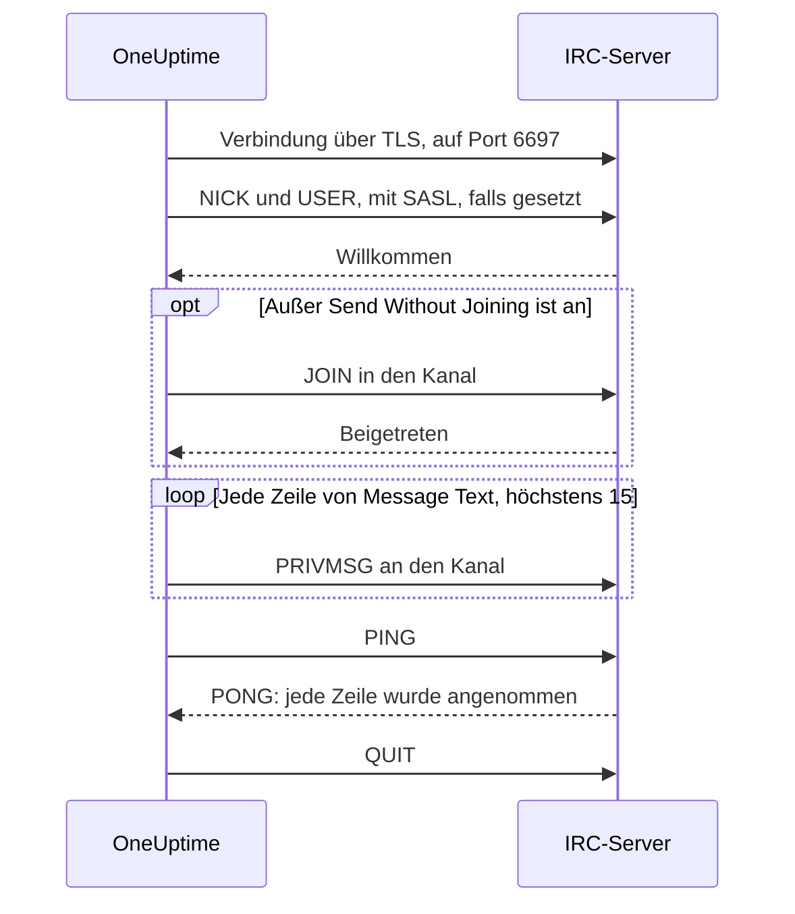

# IRC-Integration

Posten Sie Vorfallsaktualisierungen in einen Kanal eines beliebigen IRC-Netzwerks: Libera.Chat, OFTC oder ein eigener Server.

IRC kennt keine Webhooks, deshalb verbindet sich der Workflow-Schritt **Send Message to IRC** von OneUptime selbst mit dem Server, wie jeder IRC-Client. Es gibt nichts zu installieren und keine App zu registrieren. Diese Integration ist **ausgehend**: OneUptime schreibt in den Kanal und liest nicht mit, was dort gesagt wird.

:::cards
- [So funktioniert es](#so-funktioniert-es): Was ein Lauf des Schritts mit dem Server bespricht.
- [Einrichten](#die-integration-einrichten): Server und Kanal, Passwörter, dann der Workflow: aus der Vorlage oder von Grund auf.
- [Tipps](#tipps): Ohne Beitritt posten, SASL, lange Nachrichten und viele Läufe auf einmal.
- [Fehlerbehebung](#fehlerbehebung): Was die Fehler des Schritts bedeuten und was zu ändern ist.
:::

## So funktioniert es

Jeder Lauf des Schritts führt ein kurzes Gespräch mit dem IRC-Server, wie es ein IRC-Client tun würde, und legt dann auf.

1. **Verbinden.** Der Schritt verbindet sich über TLS auf Port `6697` und prüft das Zertifikat des Servers.
2. **Registrieren.** Er registriert sich als `OneUptime`, sofern Sie keinen anderen **Nickname** setzen, und meldet sich per SASL an, wenn **SASL Username** und **SASL Password** ausgefüllt sind.
3. **Beitreten.** Er betritt den Kanal, außer **Send Without Joining** ist an, und zwar mit dem **Channel Key**, falls der Kanal einen hat.
4. **Senden.** Jede Zeile von **Message Text** geht als eigene IRC-Nachricht hinaus, als `PRIVMSG`.
5. **Bestätigen.** IRC meldet nie „zugestellt“, deshalb sendet der Schritt ein `PING` und wartet auf das `PONG` des Servers. Ein Server antwortet der Reihe nach, also ist bis dahin jede Ablehnung der Nachricht eingetroffen.
6. **Beenden.** Er verlässt den Server.

Der Schritt nimmt seinen Ausgang **Erfolg**, sobald der Server jede Zeile angenommen hat. Er nimmt **Fehler**, mit dem Grund in den eigenen Worten des Servers, wo er welche nannte, wenn der Server nicht erreichbar ist oder die Verbindung, den Nickname, ein Passwort, den Kanal oder die Nachricht ablehnt.

## Bevor Sie beginnen

- In OneUptime Cloud den Tarif **Growth** oder einen höheren: Workflows und ihre Variablen gehören dazu. Selbst gehostete Installationen ohne Abrechnung haben keine Tarifgrenzen.
- Eine Rolle, die Workflows baut: **Project Owner**, **Project Admin** oder **Workflow Admin**.
- Ein Konto im IRC-Netzwerk, falls es eine Anmeldung verlangt. Libera.Chat verlangt sie bei Verbindungen von manchen Cloud- und VPN-Adressen.

## Die Integration einrichten

:::steps
### Server und Kanal wählen

Legen Sie fest, wohin die Nachrichten gehen: den Hostnamen des Servers, etwa `irc.libera.chat`, und den Kanal, etwa `#your-channel`.

- **IRC Server** nimmt den Hostnamen und sonst nichts: kein `ircs://` und kein Port. Der Schritt verbindet sich über TLS auf Port `6697`. Nimmt Ihr Server TLS auf einem anderen Port an, tragen Sie ihn in **Port** ein, unter **Weitere Felder**.
- **Channel** muss ein Kanal sein. Ein dort eingetragener Nickname wird abgelehnt, sodass der Schritt nie versehentlich jemandem eine private Nachricht schickt.

Der Server muss einer sein, mit dem sich OneUptime verbinden darf. Loopback-Adressen (`localhost`, `127.0.0.1`), Link-Local-Adressen und Cloud-Metadaten-Adressen werden immer abgelehnt. In OneUptime Cloud wird auch ein Server auf einer privaten Netzwerkadresse abgelehnt. Eine selbst gehostete Installation kann einen IRC-Server in ihrem eigenen Netzwerk erreichen, es sei denn, `DATA_SOURCE_BLOCK_PRIVATE_ADDRESSES` ist auf `true` gesetzt.

### Passwörter als geheime Variablen speichern

Überspringen Sie diesen Schritt, wenn Server, Netzwerk und Kanal kein Passwort brauchen. Andernfalls speichern Sie jedes Passwort als geheime [globale Variable](/docs/workflows/variables#globale-variablen). Der Workflow enthält dann den Namen der Variablen statt des Passworts, und Sie ändern das Passwort an einer Stelle.

| Einstellung         | Ausfüllen, wenn                                                                                     | Variable, zum Beispiel |
| ------------------- | --------------------------------------------------------------------------------------------------- | ---------------------- |
| **Server Password** | der Server oder Ihr Bouncer beim Verbinden ein Passwort verlangt.                                   | `IRC_SERVER_PASSWORD`  |
| **SASL Password**   | das Netzwerk eine Anmeldung bei Ihrem Konto verlangt. **SASL Username** nimmt den Namen des Kontos. | `IRC_SASL_PASSWORD`    |
| **Channel Key**     | der Kanal einen Schlüssel hat (Modus `+k`).                                                         | `IRC_CHANNEL_KEY`      |

Zum Speichern öffnen Sie **Arbeitsabläufe → Globale Variablen** und klicken auf **Arbeitsablaufvariable erstellen**. Tragen Sie den Namen in **Name** ein und klicken Sie auf **Weiter**. Fügen Sie das Passwort in **Inhalt** ein, schalten Sie **Geheimnis** ein und klicken Sie auf **Arbeitsablaufvariable erstellen**. Ausführungsprotokolle zeigen `[REDACTED]` anstelle des Werts einer geheimen Variablen.

### Den Workflow erstellen

Beginnen Sie mit der Vorlage, die den ganzen Workflow für Sie baut, oder von Grund auf.

:::tabs
@tab Aus der Vorlage
1. Öffnen Sie **Arbeitsabläufe** und klicken Sie auf **Arbeitsablauf erstellen**.
2. Geben Sie `IRC` in **Vorlagen durchsuchen…** ein, klicken Sie auf **Tell IRC when an incident opens** und dann auf **Diese Vorlage verwenden**.
3. Behalten Sie den Namen **Notify IRC on new incident** oder ändern Sie ihn, und klicken Sie auf **Weiter**.
4. Geben Sie **IRC Server** und **IRC Channel** ein und klicken Sie auf **Arbeitsablauf erstellen**.

Der Workflow öffnet sich im **Editor** mit drei Schritten: **On Create Incident**; **Send Message to IRC**, der Nummer, Titel, Schweregrad und Status des Vorfalls in zwei Zeilen postet; und ein **Protokoll**-Schritt an seinem Ausgang **Fehler**, der festhält, warum eine Nachricht nicht zugestellt wurde. Server und Kanal werden als die Variablen `ircServer` und `ircChannel` des Workflows gespeichert. Haben Sie im vorigen Schritt Passwörter gespeichert, klicken Sie auf **Send Message to IRC**, öffnen **Weitere Felder** und wählen jede Variable mit der Schaltfläche **{ }** ihrer Einstellung.
@tab Von Grund auf
1. Öffnen Sie **Arbeitsabläufe**, klicken Sie auf **Arbeitsablauf erstellen**, wählen Sie **Ohne Vorlage beginnen**, geben Sie dem Workflow einen Namen und klicken Sie auf **Arbeitsablauf erstellen**.
2. Klicken Sie im **Editor** auf **Wählen Sie, was diesen Arbeitsablauf startet** und wählen Sie **On Create Incident** unter **Beliebt**. Klicken Sie auf den Auslöser und wählen Sie in **Select Fields** die Felder des Vorfalls, die Ihre Nachricht zeigt, etwa seinen Titel.
3. Klicken Sie auf **Komponente hinzufügen**, suchen Sie nach `irc` und klicken Sie auf **Send Message to IRC**. Verbinden Sie den Ausgang **Erfolg** des Auslösers mit diesem Schritt.
4. Klicken Sie auf den neuen Schritt und füllen Sie **IRC Server**, **Channel** und **Message Text** aus. Die Schaltfläche **{ }** in **Message Text** fügt Felder des Vorfalls ein, etwa seinen Titel.
5. Haben Sie im vorigen Schritt Passwörter gespeichert, öffnen Sie **Weitere Felder**. Klicken Sie in **Server Password**, **SASL Password** oder **Channel Key** auf **{ }** und wählen Sie die Variable unter **Globale Variablen**. Tragen Sie den Namen Ihres Kontos in **SASL Username** ein.
:::

### Einschalten und testen

Schalten Sie **Aktiviert** oben im **Editor** ein. Von nun an wird jeder neue Vorfall im Kanal gepostet.

Um zu testen, ohne einen Vorfall zu eröffnen, klicken Sie auf **Arbeitsablauf ausführen** und tragen die ID eines vorhandenen Vorfalls in **Vorfall-ID** ein. Die Seite des Vorfalls zeigt seine ID. Klicken Sie auf **Arbeitsablauf manuell ausführen** und bestätigen Sie mit **Ausführen**. Das Panel **Arbeitsablauf-Ausführung** verfolgt den Lauf: Das Protokoll des IRC-Schritts sagt, wie viele Zeilen er gesendet hat, etwa `Sent 2 lines to #your-channel.`, und die Nachricht erscheint im Kanal. Nimmt der Schritt stattdessen **Fehler**, sagt sein Protokoll, warum: siehe [Fehlerbehebung](#fehlerbehebung).
:::

## Tipps

- **Ohne Beitritt posten.** Die meisten Kanäle nehmen Nachrichten nur von ihren Mitgliedern an (Modus `+n`), deshalb betritt der Schritt den Kanal vor dem Posten und verlässt ihn gleich danach. Ein Kanal mit `-n` nimmt Nachrichten von außen an: Schalten Sie **Send Without Joining** unter **Weitere Felder** ein, dann sieht der Kanal den Schritt nicht kommen und gehen.
- **Mit SASL anmelden.** In Netzwerken mit SASL, etwa Libera.Chat, füllen Sie **SASL Username** und **SASL Password** aus, um sich bei Ihrem Konto anzumelden. Libera.Chat verlangt das bei Verbindungen von manchen Cloud- und VPN-Adressen. Siehe [die SASL-Anleitung von Libera.Chat](https://libera.chat/guides/sasl).
- **Die Grenze von 15 Zeilen beachten.** Jede Zeile von **Message Text** ist eine eigene IRC-Nachricht, eine lange Zeile wird passend geteilt, und leere Zeilen fallen weg. Eine Nachricht wird als höchstens 15 IRC-Zeilen gesendet: Eine längere wird gekürzt, und ihre letzte Zeile sagt das. Die ersten vier Zeilen gehen sofort hinaus und der Rest eine pro Sekunde, im Takt von IRC-Clients, also dauern 15 Zeilen etwa 11 Sekunden.
- **Viele Läufe zu einer Nachricht bündeln.** Jeder Lauf ist eine eigene Verbindung, und IRC-Netzwerke begrenzen, wie oft sich eine Adresse verbinden darf. Viele Läufe kurz hintereinander können mit einem Grund wie `Reconnecting too fast` abgelehnt werden und nehmen wie jede Ablehnung **Fehler**. Bei einem Workflow, der viele Male pro Minute auslösen kann, fassen Sie zusammen, was er mitzuteilen hat, in einer Nachricht, oder senden Sie über einen eigenen Server.
- **Mit den Codes von IRC formatieren.** IRC kennt kein Markdown, der Text wird also gesendet, wie er geschrieben ist. Die Formatierungscodes von IRC, etwa Fett und Farben, funktionieren.
- **Ein Server ohne TLS.** Schalten Sie **Disable TLS** nur für einen Server ein, der kein TLS anbietet: Der Schritt verbindet sich dann auf Port `6667`, und jedes Passwort wird unverschlüsselt gesendet. Um dem Zertifikat eines Servers aus Ihrer eigenen Zertifizierungsstelle zu vertrauen, setzt eine selbst gehostete Installation stattdessen `NODE_EXTRA_CA_CERTS`.
- **Ein anderer Nickname.** Nachrichten kommen von `OneUptime`, sofern Sie keinen **Nickname** setzen. Ist der Nickname vergeben, hängt der Schritt einen Unterstrich oder eine Zahl an.

## Fehlerbehebung

Wenn der Schritt **Fehler** nimmt, sagt das Ausführungsprotokoll, warum, in einem Satz, der wie einer dieser beginnt.

:::details "The IRC server refused the connection"
Der Server oder Ihr Bouncer hat die Verbindung abgewiesen, und die Meldung endet mit seinem Grund. Wenn der Server ein Passwort verlangt, sagt die Meldung das: Füllen Sie **Server Password** aus oder prüfen Sie es.
:::

:::details "SASL sign-in failed"
Das Netzwerk hat das Konto oder das Passwort abgelehnt. Prüfen Sie **SASL Username** und **SASL Password**.
:::

:::details "Could not join #your-channel"
Der Kanal hat den Schritt abgewiesen, aus dem Grund, den die Meldung nennt. Ein Kanal mit Schlüssel braucht ihn in **Channel Key**.
:::

:::details "Could not send to #your-channel"
Der Server hat die Nachricht abgelehnt, aus dem Grund, den die Meldung nennt. Ist **Send Without Joining** an, nimmt der Kanal womöglich nur Nachrichten seiner Mitglieder an: Schalten Sie es aus.
:::

:::details "The TLS certificate of the IRC server … is not trusted"
Das Zertifikat des Servers ist keines, dem OneUptime vertraut. Eine selbst gehostete Installation kann ihrer eigenen Zertifizierungsstelle mit `NODE_EXTRA_CA_CERTS` vertrauen. Schalten Sie **Disable TLS** nur für einen Server ein, der kein TLS anbietet.
:::

## Nächste Schritte

:::cards
- [Komponenten → IRC](/docs/workflows/components#irc): Jede Einstellung des Schritts und was seine Ausgänge bedeuten.
- [Variablen](/docs/workflows/variables#globale-variablen): Geheime globale Variablen und wie Schritte sie verwenden.
- [Ausführungen](/docs/workflows/runs-and-logs): Lesen, was jeder Lauf des Workflows getan hat.
- [Integrationen – Überblick](/docs/integrations/index): Das ausgehende Muster und die anderen Werkzeuge, die Sie anbinden können.
:::
