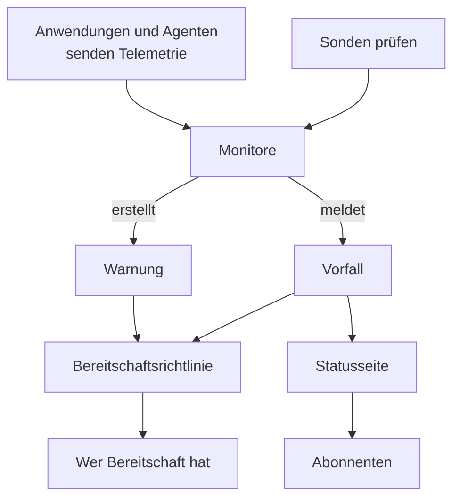

# Grundkonzepte

OneUptime hat viele Produkte, aber sie beruhen auf einer Handvoll Ideen: Projekte, Monitore, Vorfälle und Warnungen, Bereitschaft, Statusseiten und Telemetrie. Diese Seite erklärt jede davon in wenigen Sätzen, zeigt, wie sie zusammenhängen, und verlinkt auf die Seiten, die sie ausführlich behandeln. Lesen Sie sie einmal, und jede andere Seite der Dokumentation liest sich leichter.

:::cards
- [Projekte und Personen](#projekte-und-personen): Wo alles liegt und wer was darf.
- [Monitore und Sonden](#monitore-und-sonden): Wie OneUptime bemerkt, dass etwas nicht stimmt.
- [Vorfälle und Warnungen](#vorfälle-und-warnungen): Der Datensatz, mit dem Ihr Team arbeitet.
- [Bereitschaft](#bereitschaft): Wer alarmiert wird, wie, und wer als Nächstes dran ist.
:::

## Wie die Teile zusammenhängen

Ein Problem bewegt sich in einer Richtung durch OneUptime. Sonden und Ihre eigene Telemetrie speisen Monitore. Die Kriterien eines Monitors entscheiden, wann etwas nicht stimmt und was eröffnet wird: ein Vorfall, eine Warnung oder beides. Bereitschaftsrichtlinien alarmieren Personen dazu, und Statusseiten informieren Ihre Kunden über Vorfälle.

## Projekte und Personen

Ein **Projekt** enthält alles: Monitore, Vorfälle, Bereitschaftsrichtlinien, Statusseiten, Telemetrie und Einstellungen. Die meisten Unternehmen brauchen eines, manche führen eines pro Umgebung oder Geschäftsbereich. Nichts, was Sie in einem Projekt anlegen, ist in einem anderen sichtbar.

Ihr **Konto** ist von Ihren Projekten getrennt. Ein Konto, mit einer E-Mail-Adresse und einem Passwort, kann zu beliebig vielen Projekten gehören; zwischen ihnen wechseln Sie mit der Projektauswahl oben links. Siehe [Ihr Konto](/docs/introduction/your-account).

Personen gehören über **Teams** zu einem Projekt, und die Berechtigungen eines Teams bestimmen, was seine Mitglieder tun dürfen. Jedes neue Projekt beginnt mit drei Teams: Owners, mit Ihnen darin, Admin und Members. Bei OneUptime Cloud hat jedes Projekt seinen eigenen Tarif.

:::cards
- [Benutzer, Teams & Berechtigungen](/docs/permissions/index): Personen einladen und festlegen, was sie dürfen.
:::

## Monitore und Sonden

Ein **Monitor** prüft eine Sache, die Sie betreiben, und entscheidet, ob sie funktioniert. Die meisten Monitore werden von **Sonden** geprüft: Rechnern, die die Prüfung nach Zeitplan ausführen, etwa eine Seite abrufen, eine API aufrufen, einen Host anpingen oder eine Datenbank abfragen. OneUptime Cloud betreibt Sonden in mehreren Regionen, eine selbst gehostete Installation betreibt ihre eigenen, und Sie können benutzerdefinierte Sonden in Ihrem Netzwerk hinzufügen. Andere Monitore lesen stattdessen, was Sie senden: die Telemetrie Ihrer Anwendungen oder die Daten, die ein Agent auf Ihren Servern, Kubernetes-Clustern und anderer Infrastruktur meldet.

Die **Kriterien** eines Monitors entscheiden, was jedes Ergebnis bedeutet. Sie werden der Reihe nach geprüft, und das erste zutreffende kann den Status des Monitors ändern, einen Vorfall melden, eine Warnung erstellen oder alles drei. Jedes neue Projekt hat drei Monitorstatus: **Betriebsbereit**, **Beeinträchtigt** und **Offline**.

:::cards
- [Einen Monitor erstellen](/docs/monitor/create-monitor): Einen Typ wählen, festlegen, was geprüft wird, und wie oft.
- [Benutzerdefinierte Probes](/docs/probe/custom-probe): Prüfen, was nur Ihr eigenes Netzwerk erreicht.
:::

## Vorfälle und Warnungen

Beide halten ein Problem fest, und beide können die Bereitschaft alarmieren. Der Unterschied liegt darin, wen das Problem betrifft.

| | Vorfall | Warnung |
| --- | --- | --- |
| **Was es ist** | Ein Problem, das Ihre Nutzer betrifft, etwa ein Ausfall oder eine Verlangsamung | Ein Problem, das sich Ihr Team ansehen sollte, bevor Nutzer betroffen sind |
| **Auf Statusseiten** | Kann erscheinen und informiert Abonnenten | Nie |
| **Anfangsstatus** | **Identifiziert**, **Bestätigt**, **Behoben** | **Identifiziert**, **Bestätigt**, **Behoben** |
| **Anfangsschweregrade** | Critical Incident, Major Incident, Minor Incident | **Hoch**, **Low** |

Wer einen bestätigt, sagt damit, dass sich jemand darum kümmert, und hält seine Bereitschaftsrichtlinien davon ab, die nächste Stufe zu alarmieren. Wer ihn behebt, schließt ihn ab. Sie können eigene Status und Schweregrade hinzufügen und Warnungen mit dem Vorfall verknüpfen, zu dem sie sich als zugehörig erweisen.

Eine **Episode** fasst zusammengehörige Vorfälle oder zusammengehörige Warnungen zusammen, damit Ihr Team sie als eins bearbeitet. Gruppierungsregeln entscheiden, was zusammengehört.

:::cards
- [Vorfälle – Übersicht](/docs/incidents/index): Wie Vorfälle gemeldet, bearbeitet und behoben werden.
- [Verknüpfte Warnungen](/docs/incidents/linked-alerts): Die Warnungen eines Ausfalls mit seinem Vorfall verknüpfen.
:::

## Bereitschaft

Eine **Bereitschaftsrichtlinie** entscheidet, wer zu einem Vorfall oder einer Warnung alarmiert wird und wer als Nächstes dran ist, wenn niemand reagiert. Ihre **Eskalationsregeln** sind ihre Stufen: Jede alarmiert ihre Personen und wartet dann darauf, dass jemand bestätigt, bevor die nächste Stufe alarmiert wird. Eine Stufe kann Personen, Teams oder einen **Bereitschaftsplan** alarmieren, eine Rotation, die zu jedem Zeitpunkt weiß, wer Bereitschaft hat.

Wie jede Person erreicht wird, legt sie selbst fest. In den **Benutzereinstellungen** hält jede Person die Wege fest, auf denen OneUptime sie erreichen kann, etwa E-Mail, SMS, Anrufe, Push-Benachrichtigungen, Slack oder Microsoft Teams, und welche davon bei einer Alarmierung genutzt werden.

:::cards
- [Eskalationsregeln](/docs/on-call/escalation-rules): Personen Stufe für Stufe alarmieren, bis jemand reagiert.
- [Bereitschaftspläne](/docs/on-call/schedules): Rotationen, Ebenen und Übergaben.
:::

## Statusseiten und Wartung

Eine **Statusseite** zeigt Ihren Kunden, ob Ihre Dienste funktionieren. Sie wählen, welche Monitore sie zeigt, unter Namen, die Ihre Kunden verstehen. Solange ein Vorfall auf einem dieser Monitore aktiv ist, zeigt die Seite ihn, und ihre **Abonnenten** werden per E-Mail, SMS, Slack, Microsoft Teams oder Webhook informiert. Eine Statusseite kann öffentlich sein oder privat für die Personen, die Sie hereinlassen.

**Geplante Wartung** kündigt geplante Arbeiten vorab an. Ein Ereignis durchläuft **Geplant**, **Laufend**, **Beendet** und **Abgeschlossen**, und die Statusseiten, auf denen Sie es zeigen, informieren Besucher und Abonnenten darüber.

:::cards
- [Statusseiten – Übersicht](/docs/status-pages/index): Eine Statusseite anlegen und festlegen, was sie zeigt.
- [Abonnenten & Ankündigungen](/docs/status-pages/subscribers): Wer informiert wird, und wann.
:::

## Telemetrie

**Telemetrie** ist das, was Ihre Systeme an OneUptime senden: Logs, Metriken, Traces, Ausnahmen und Profile. Anwendungen senden sie mit OpenTelemetry, und die Agenten von OneUptime senden sie von Hosts, Kubernetes-Clustern, Docker-Hosts und anderer Infrastruktur. Jeder Absender nutzt einen **Ingestion-Schlüssel**, angelegt unter **Projekteinstellungen → Telemetrie & APM → Ingestion-Schlüssel**. Sie durchsuchen Telemetrie, stellen sie auf Dashboards dar und überwachen sie mit Telemetrie-Monitoren, die wie jeder andere Monitor Vorfälle und Warnungen auslösen.

:::cards
- [OpenTelemetry](/docs/telemetry/open-telemetry): Logs, Metriken und Traces aus Ihren Anwendungen senden.
- [Logs-Überwachung](/docs/monitor/logs-monitor): Erfahren, wenn ein Muster in Ihren Logs auftaucht.
:::

## Automatisierung und KI

- **Arbeitsabläufe** führen Aktionen aus, wenn etwas passiert, etwa eine Nachricht in Slack, wenn ein Vorfall gemeldet wird.
- **Runbooks** verwandeln einen Ablauf für den Ernstfall in Schritte, die Ihr Team von Hand oder automatisch ausführen kann.
- **OneUptime AI** untersucht neue Vorfälle und Warnungen und veröffentlicht, was sie gefunden hat, in ihrer Zeitleiste, und **KI fragen** beantwortet Fragen zu Ihrem Projekt. Ein neues Projekt beginnt mit eingeschalteter KI; der Schalter **KI aktivieren** unter **Projekteinstellungen → KI → KI-Funktionen** schaltet alles davon aus.

:::cards
- [Workflows – Übersicht](/docs/workflows/index): Aktionen mit Auslösern und Komponenten automatisieren.
- [AI SRE](/docs/ai/ai-sre): Wie OneUptime AI Vorfälle und Warnungen untersucht.
:::

## Beschriftungen und Eigentümer

**Beschriftungen** sind Schlagwörter, die Sie an Monitore, Vorfälle, Statusseiten und die meisten anderen Ressourcen hängen, um sie zu filtern und zu gruppieren. Die Berechtigungen eines Teams lassen sich auf Ressourcen mit bestimmten Beschriftungen beschränken. **Eigentümer** sind die Personen und Teams, die für eine Ressource verantwortlich sind: Sie werden informiert, wenn mit ihr etwas passiert. Beschriftungsregeln und Eigentümerregeln versehen neue Ressourcen für Sie mit Beschriftungen und Eigentümern.

:::cards
- [Beschriftungs- und Eigentümerregeln](/docs/configuration/label-and-owner-rules): Neue Ressourcen automatisch beschriften und ihnen Eigentümer geben.
:::

## Nächste Schritte

:::cards
- [Schnellstart](/docs/introduction/quickstart): Diese Ideen in fünfzehn Minuten anwenden.
- [Startseite & Tastenkürzel](/docs/introduction/home): Jedes Produkt im Dashboard finden.
- [Einen Monitor erstellen](/docs/monitor/create-monitor): Ihr erster Monitor, Feld für Feld.
- [Vorfälle – Übersicht](/docs/incidents/index): Was passiert, nachdem ein Monitor einen Vorfall meldet.
:::
