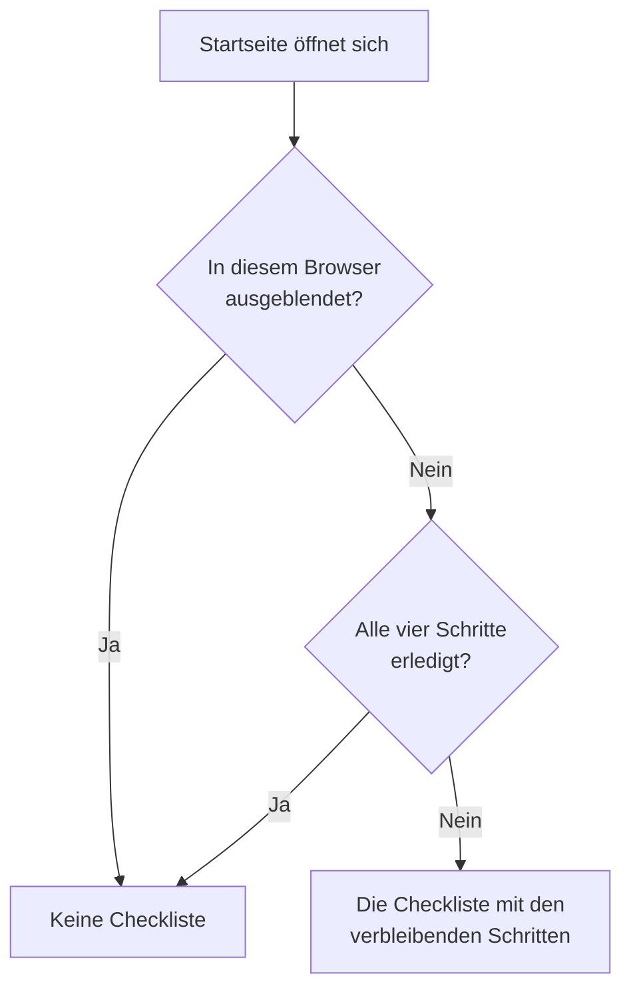

# Startseite & Tastenkürzel

Die Startseite ist die erste Seite, die Sie in einem Projekt sehen. Sie zeigt auf einen Blick, ob gerade etwas Ihre Aufmerksamkeit braucht, und führt ein neues Projekt durch seine erste Einrichtung. Diese Seite erklärt, was die Startseite zeigt, wie Sie jedes Produkt, jede Seite und jede Aktion im Dashboard finden, und die Tastenkürzel, die Ihnen Wege durch Menüs ersparen.

:::cards
- [Was die Startseite zeigt](#was-die-startseite-zeigt): Die Willkommens-Checkliste, die fünf Kacheln und die aktiven Vorfälle.
- [Sich zurechtfinden](#sich-zurechtfinden): Das Menü Produkte und die Leisten oben auf jeder Seite.
- [Suchen](#nach-einer-seite-einer-einstellung-oder-einer-aktion-suchen): Jede Seite, Einstellung oder Aktion finden, indem Sie ihren Namen tippen.
- [Tastenkürzel](#tastenkürzel): Mit zwei Tasten zur Startseite, zu Monitoren oder Vorfällen.
:::

## Was die Startseite zeigt

Öffnen Sie **Startseite** in der Leiste oben, oder drücken Sie von überall `g` und dann `h`. Von oben nach unten zeigt die Startseite:

1. **Willkommen bei OneUptime 👋**, eine Checkliste für ein neues Projekt, bis sie erledigt ist.
2. Fünf Kacheln, die zählen, was Aufmerksamkeit braucht.
3. **Aktive Vorfälle**, jeden Vorfall, der noch nicht behoben ist.

### Die Willkommens-Checkliste

Die Checkliste führt Sie durch die vier Dinge, die ein Projekt braucht, bevor es nützlich ist. Jeder Schritt öffnet die Seite, auf der Sie ihn erledigen, und hakt sich selbst ab, sobald das Projekt hat, worum er bittet.

| Schritt | Erledigt, wenn | Öffnet |
| --- | --- | --- |
| **Ersten Monitor erstellen** | Das Projekt einen Monitor hat. | Das Formular **Monitor erstellen**, oder die Liste **Monitore** für jemanden, der keine Monitore anlegen darf. |
| **Statusseite veröffentlichen** | Das Projekt eine Statusseite hat. | **Statusseiten** |
| **Team einladen** | Außer Ihnen jemand im Projekt ist oder dazu eingeladen wurde. | **Benutzer** |
| **Bereitschaftsrichtlinie einrichten** | Das Projekt eine Bereitschaftsrichtlinie hat. | **Bereitschaftsdienst** |

Unter den Schritten zeigt **So funktioniert OneUptime** die vier Kernprodukte in der Reihenfolge, in der ein Problem sie durchläuft: **Monitore**, **Vorfälle & Warnungen**, **Bereitschaftsdienst** und **Statusseiten**. Klicken Sie auf eines, um es zu öffnen.

Die Checkliste verschwindet, sobald alle vier Schritte erledigt sind. Um sie früher auszublenden, klicken Sie auf **Ausblenden**. Das Ausblenden gilt für diesen Browser und dieses Projekt; alles, was die Schritte öffnen, finden Sie weiterhin im Menü **Produkte**.

### Die Kacheln

Jede Kachel zählt etwas, sagt, ob das Ihre Aufmerksamkeit braucht, und öffnet die Liste hinter der Zahl.

| Kachel | Was sie zählt | Wenn die Zahl null ist |
| --- | --- | --- |
| **Aktive Vorfälle** | Vorfälle, die nicht behoben sind | **Alles in Ordnung** |
| **Aktive Warnungen** | Warnungen, die nicht behoben sind | **Alles in Ordnung** |
| **Nicht betriebsbereite Monitore** | Monitore, deren Status kein betriebsbereiter ist. Archivierte Monitore zählen nicht mit. | **Alle betriebsbereit** |
| **Laufende Wartung** | Geplante Wartungsereignisse, die gerade laufen | **Keine laufenden** |
| **Gefährdete SLOs** | Eingeschaltete SLOs, die gefährdet sind oder ihr Fehlerbudget aufgebraucht haben | **Budgets in Ordnung** |

Eine Zahl über null zeigt **Erfordert Aufmerksamkeit**, auf den Kacheln für Wartung und SLOs **Läuft gerade** und **Budget wird verbraucht**. Ein Projekt ohne Monitore sieht auf der Monitor-Kachel **Noch keine Monitore**, eines ohne SLOs **Noch keine SLOs**: Ein leeres Projekt ist nicht dasselbe wie ein gesundes. Diese beiden Kacheln öffnen dann die Listen **Monitore** und **SLOs**, in denen Sie einen anlegen.

### Das Seitenmenü der Startseite

Das Seitenmenü neben der Startseite enthält dieselben Listen, jede mit einer Zahl:

| Abschnitt | Seiten |
| --- | --- |
| **Vorfälle** | **Aktive Vorfälle** und **Aktive Episoden** |
| **Warnungen** | **Aktive Warnungen** und **Aktive Episoden** |
| **Monitore** | **Nicht betriebsbereit** |
| **Geplante Ereignisse** | **Laufend** |

Eine Episode fasst zusammengehörige Vorfälle oder Warnungen zusammen, damit Sie sie als eins bearbeiten. Siehe [Grundkonzepte](/docs/introduction/core-concepts#vorfälle-und-warnungen).

## Sich zurechtfinden

Alles in OneUptime liegt unter **Produkte** in der oberen Leiste. Das Menü führt seine Gruppen als Zeilen einer einzigen Liste und öffnet sich immer mit der ersten davon, den Grundlagen, aufgeklappt: Monitore, Vorfälle, Warnungen, Bereitschaftsdienst, Status-Seiten, Geplante Wartung und SLOs. Jede andere Gruppe (Observability, AI, Code, Ressourcen, Infrastruktur, Dashboards & Automatisierung und Einstellungen) ist zu einer Zeile derselben Liste zugeklappt. Jede Zeile nennt die Produkte ihrer Gruppe und sagt, wie viele es sind. Klicken Sie auf eine Zeile, um sie auf- oder zuzuklappen, oder gehen Sie mit den Pfeiltasten zu ihr und drücken Sie **Enter**.

- **Die Suche findet alles.** Tippen Sie in das Suchfeld des Menüs, um jedes Produkt nach seinem Namen, nach dem, was es tut, oder nach einem vertrauten Wort wie `k8s` oder `RUM` zu finden. Die Suche schaut auch in die zugeklappten Gruppen.
- **Sie beginnen dort, wo Sie sind.** Die Gruppe der Seite, auf der Sie sind, klappt von selbst auf, und die Produkte, die Sie zuletzt geöffnet haben, stehen oben.
- **Ihre Auswahl bleibt.** Das Menü merkt sich in Ihrem Browser, welche der anderen Gruppen Sie auf- oder zugeklappt haben. Die Grundlagen sind bei jedem Öffnen des Menüs wieder aufgeklappt, auch wenn Sie sie zugeklappt hatten.
- **Auf dem Telefon** listet die Menüschaltfläche die Produkte genauso auf: die Grundlagen aufgeklappt oben und jede andere Gruppe als eine Zeile, die sich mit einem Tippen öffnet.

### Die Leisten oben

Zwei Leisten ziehen sich oben über jede Seite.

| Wo | Was dort ist |
| --- | --- |
| Oben links | Die Projektauswahl: zu einem anderen Ihrer Projekte wechseln oder ein neues anlegen. |
| Oben rechts | **Suchen** und **KI fragen**, die Benachrichtigungsglocke mit dem, was Sie jetzt braucht (aktive Vorfälle und Warnungen, die Bereitschaftsrichtlinien, in denen Sie Dienst haben, offene Einladungen), **Hilfe**, und Ihr Bild, das Ihr [Konto](/docs/introduction/your-account)-Menü öffnet. |
| Darunter | **Startseite** und **Produkte** links, **Benutzereinstellungen** rechts: wie OneUptime Sie in diesem Projekt erreicht. |

**Hilfe** öffnet diese Dokumentation (**Dokumentation**) und die Liste **Tastenkürzel** und bietet Support per E-Mail und auf Slack. Auf einem schmalen Bildschirm, etwa einem Telefon, fallen **Suchen**, **KI fragen** und **Hilfe** weg, um Platz zu sparen; die Glocke und Ihr Bild bleiben.

## Nach einer Seite, einer Einstellung oder einer Aktion suchen

Drücken Sie **Cmd+K** (Mac) oder **Ctrl+K** (Windows und Linux), oder klicken Sie auf das Suchsymbol in der oberen Leiste, und beginnen Sie zu tippen. Die Suche findet:

- **Jede Seite in den Menüs**, unter dem Namen, den das Menü ihr gibt: API-Schlüssel, Gefahrenzone, Bereitschaftspläne, Vorfallsschweregrad, Ihre eigenen Benachrichtigungsmethoden. Jedes Ergebnis sagt, wo es liegt, etwa *Projekteinstellungen › Erweitert*, sodass sich Seiten mit demselben Namen (Benutzerdefinierte Felder in Vorfällen, Warnungen und Monitoren) leicht unterscheiden lassen.
- **Aktionen**, nach dem, was Sie tun möchten: Vorfall melden, Monitor erstellen oder Projekt löschen, das die Gefahrenzone öffnet. Eine Aktion, die etwas ändert, wird nur Personen angeboten, die sie ausführen dürfen.
- **Ihre Monitore, Vorfälle, Warnungen, Statusseiten und Bereitschaftsrichtlinien**, nach Namen.

Die Suche liest, was Sie tippen, so, wie Sie es meinen:

- Groß- und Kleinschreibung, Akzente, Leerzeichen und Bindestriche spielen keine Rolle: *on-call*, *on call* und *oncall* finden dieselben Seiten, und Wörter dürfen in beliebiger Reihenfolge stehen.
- Sie kennt für viele Seiten andere Wörter, auf Englisch: *pager* oder *escalation* für Bereitschaftsrichtlinien, *rota* für Bereitschaftspläne, *2fa* für Zwei-Faktor-Authentifizierung, *delete project* für die Gefahrenzone.
- Fügen Sie den Namen des Produkts hinzu, um eine Suche einzugrenzen: *incident custom fields* findet die Seite Benutzerdefinierte Felder der Vorfälle.
- Ein kleiner Tippfehler wie *incidnet* findet trotzdem, was Sie gemeint haben, wenn nichts genau passt.

Bei leerem Suchfeld listet die Suche die zuletzt geöffneten Seiten, die Aktionen und die Produkte auf.

## Tastenkürzel

Drücken Sie überall im Dashboard `?`, um alle Tastenkürzel zu sehen, oder öffnen Sie **Hilfe** und wählen Sie **Tastenkürzel**. Auf einem Mac ist `Mod` die Befehlstaste, unter Windows und Linux Ctrl (Strg).

| Tasten | Was sie tun |
| --- | --- |
| `Mod` + `K` | Die Befehlspalette öffnen: nach jeder Seite, Einstellung oder Aktion suchen. |
| `Mod` + `I` | KI fragen, zu dem, was Sie gerade ansehen. |
| `/` | Die Liste auf dieser Seite durchsuchen. |
| `?` | Die Tastenkürzel anzeigen. |
| `Esc` | Einen Dialog oder Bereich schließen. |

### Zu einem Produkt springen

Drücken Sie `g` und dann einen Buchstaben, um direkt zu einem Produkt zu springen. Drücken Sie den Buchstaben innerhalb von 1,5 Sekunden nach `g`.

| Tasten | Springt zu |
| --- | --- |
| `g` dann `h` | Startseite |
| `g` dann `m` | Monitore |
| `g` dann `i` | Vorfälle |
| `g` dann `a` | Warnungen |
| `g` dann `o` | Bereitschaftsdienst |
| `g` dann `s` | Status-Seiten |
| `g` dann `e` | Geplante Wartung |
| `g` dann `d` | Dashboards |
| `g` dann `l` | Protokolle |
| `g` dann `t` | Traces |

Die Tastenkürzel stehen Ihnen nicht im Weg. `?`, `/` und `g` tun nichts, während Sie in einem Feld tippen, und solange ein Dialog offen ist, navigiert nichts weg, sodass eine versehentliche Taste kein halb ausgefülltes Formular verliert. Jedes andere Produkt ist mit `Mod` + `K` eine Suche entfernt.

## Nächste Schritte

:::cards
- [Schnellstart](/docs/introduction/quickstart): Die Willkommens-Checkliste Schritt für Schritt abarbeiten.
- [Ihr Konto](/docs/introduction/your-account): Ihr Profil, die Sicherheit Ihrer Anmeldung, Sprache und Design.
- [KI fragen](/docs/ai/ask-ai): Was KI fragen für Sie beantworten und tun kann.
- [Grundkonzepte](/docs/introduction/core-concepts): Was Monitore, Vorfälle, Warnungen und Bereitschaft sind.
:::
