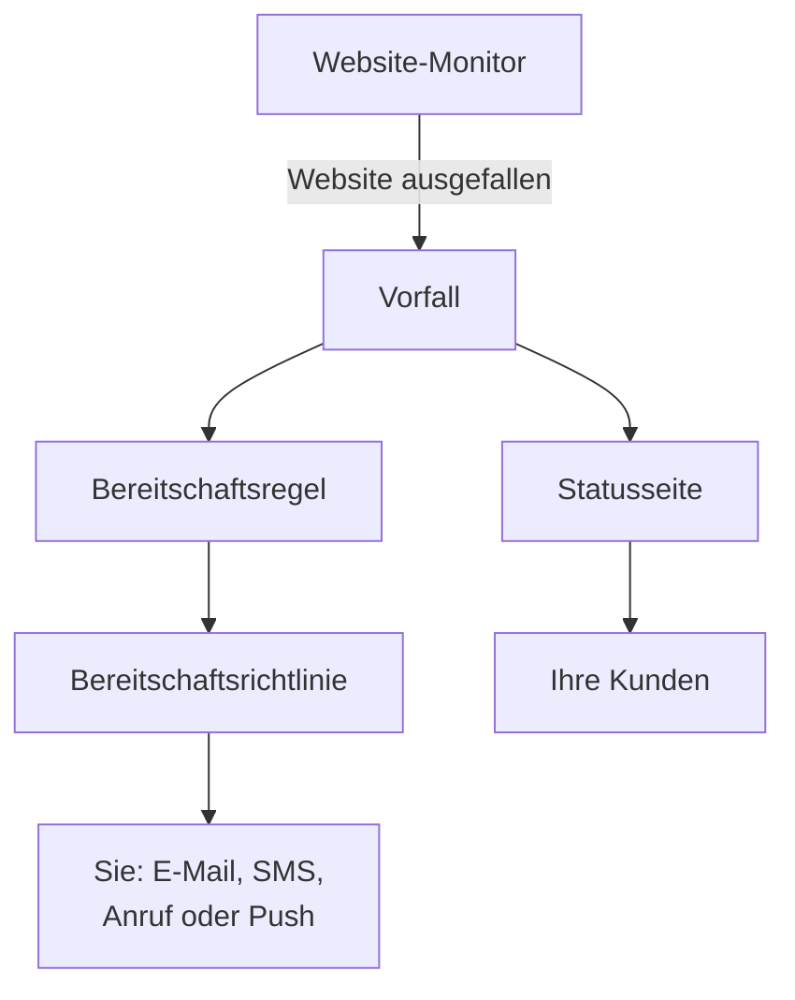

# Schnellstart

Diese Anleitung bringt Sie in etwa fünfzehn Minuten von einem neuen Konto zu einer funktionierenden Einrichtung: einem Monitor, der Ihre Website alle fünf Minuten prüft, einer Bereitschaftsrichtlinie, die Sie alarmiert, wenn die Website ausfällt, und einer Statusseite, die Ihre Kunden informiert. Sie folgt der Checkliste **Willkommen bei OneUptime 👋** auf der Startseite Ihres Projekts.

## Bevor Sie beginnen

- **Ein Konto.** Registrieren Sie sich bei OneUptime Cloud auf [oneuptime.com](https://oneuptime.com/accounts/register) und öffnen Sie den Link in der E-Mail, die Sie erhalten. Öffnen Sie bei Ihrer eigenen Installation diese im Browser und registrieren Sie sich: Das erste Konto wird Master-Admin. Wie Sie eine Installation einrichten, steht unter [Docker Compose](/docs/installation/docker-compose).
- **Eine Website, die Sie überwachen möchten.** Jede Adresse, die über HTTP oder HTTPS antwortet, etwa die Startseite Ihres Unternehmens.

## Ein Projekt erstellen

In OneUptime liegt alles in einem Projekt: Ihre Monitore, Vorfälle, Bereitschaftsrichtlinien, Statusseiten und die Personen, die daran arbeiten.

:::steps
### Ein neues Projekt beginnen

Bei Ihrer ersten Anmeldung zeigt OneUptime **Keine Projekte**. Klicken Sie auf **Neues Projekt erstellen**. Hat Sie bereits jemand zu einem Projekt eingeladen, nehmen Sie die Einladung stattdessen auf derselben Seite an.

### Einen Namen vergeben

Geben Sie einen **Projektname** ein, etwa den Namen Ihres Unternehmens. Bei OneUptime Cloud wählen Sie im nächsten Schritt einen Tarif.

### Das Projekt anlegen

Klicken Sie auf **Projekt erstellen**. Die Startseite Ihres Projekts öffnet sich, oben mit der Checkliste **Willkommen bei OneUptime 👋**.
:::

## Ihre Website überwachen

:::steps
### Monitor erstellen öffnen

Klicken Sie in der Checkliste auf **Ersten Monitor erstellen**. Sie können auch **Monitore** im Menü **Produkte** öffnen und auf **Monitor erstellen** klicken.

### Website wählen

Wählen Sie unter **Monitortyp** den Typ **Website**. Geben Sie einen **Name** ein, etwa `Website`, und klicken Sie auf **Weiter**.

### Die Adresse eingeben

Geben Sie die vollständige Adresse Ihrer Website unter **Website-URL** ein, etwa `https://example.com`. OneUptime legt die Kriterien für Sie an: Der Monitor wechselt zu **Offline** und meldet einen Vorfall, wenn die Website nicht antwortet oder mit einem Fehler antwortet. Klicken Sie auf **Weiter**.

### Den Monitor anlegen

Behalten Sie die ausgewählten **Sonden** und das **Überwachungsintervall** **Alle 5 Minuten** bei, und klicken Sie auf **Monitor erstellen**. Die Seite des Monitors öffnet sich, und die Sonden beginnen, Ihre Website zu prüfen.
:::

Um die Prüfung vor dem Speichern auszuprobieren, klicken Sie im zweiten Schritt auf **Monitor testen**. Alle anderen Monitortypen beschreibt [Einen Monitor erstellen](/docs/monitor/create-monitor).

## Bei einem Ausfall alarmiert werden

So wie es ist, wird ein Vorfall ohne Eigentümer per E-Mail an die Eigentümer des Projekts gemeldet, und dazu gehören Sie. Damit Sie alarmiert werden, bis jemand reagiert, legen Sie eine Bereitschaftsrichtlinie an und lassen jeden Vorfall sie auslösen.

:::steps
### Eine Bereitschaftsrichtlinie anlegen

Klicken Sie in der Checkliste auf **Bereitschaftsrichtlinie einrichten**, oder öffnen Sie **Bereitschaftsdienst** im Menü **Produkte**. Klicken Sie auf **Bereitschaftsrichtlinie erstellen** und geben Sie einen **Name** ein. Klicken Sie unter **Wer wird zuerst alarmiert?** auf **Empfänger hinzufügen** und wählen Sie sich selbst. Klicken Sie auf **Bereitschaftsrichtlinie erstellen**.

### Sie für jeden Vorfall auslösen

Öffnen Sie **Vorfälle** im Menü **Produkte**, klappen Sie **Regeln** im Seitenmenü auf und wählen Sie **Bereitschaftsregeln**. Klicken Sie auf **Bereitschaftsregel für Vorfälle erstellen**, geben Sie einen **Name** ein und klicken Sie auf **Weiter**. Lassen Sie **Übereinstimmungskriterien** leer, damit die Regel auf jeden Vorfall zutrifft, und klicken Sie auf **Weiter**. Wählen Sie Ihre Richtlinie unter **Bereitschaftsrichtlinien** und klicken Sie auf **Bereitschaftsregel für Vorfälle erstellen**.

### Festlegen, wie Sie erreicht werden

Ihre Anmelde-E-Mail ist bereits ein Weg, Sie zu erreichen. Damit Sie auch per SMS oder Anruf benachrichtigt werden, öffnen Sie **Benutzereinstellungen** in der Leiste unter der oberen Leiste, gehen zu **Benachrichtigungsmethoden** und fügen auf dem Tab **Direct Contact** Ihre Nummer unter **Telefonnummern für SMS-Benachrichtigungen** oder **Telefonnummern für Anrufbenachrichtigungen** hinzu. Klicken Sie auf **Verifizieren** und geben Sie den Code ein, den OneUptime Ihnen sendet. Eine verifizierte Nummer wird sofort für Bereitschaftsalarme genutzt.
:::

> [!NOTE]
> SMS und Telefonanrufe sind in einem neuen Projekt ausgeschaltet. Ein Projekteigentümer, ein Billing Admin oder jemand mit Manage Billing schaltet sie in der Karte **Benachrichtigungskanäle** unter **Projekteinstellungen → Benachrichtigungen → Benachrichtigungseinstellungen** ein.

Für weitere Stufen, Rotationen und wie lange jede Stufe wartet, siehe [Eskalationsregeln](/docs/on-call/escalation-rules) und [Bereitschaftspläne](/docs/on-call/schedules).

## Eine Statusseite veröffentlichen

:::steps
### Die Statusseite anlegen

Klicken Sie in der Checkliste auf **Statusseite veröffentlichen**, oder öffnen Sie **Statusseiten** im Menü **Produkte**. Klicken Sie auf **Statusseite erstellen**, geben Sie einen **Name** ein, etwa `Acme Status`, und klicken Sie auf **Statusseite erstellen**.

### Ihren Monitor hinzufügen

Öffnen Sie die neue Statusseite. Wählen Sie in ihrem Seitenmenü unter **Ressourcen** den Eintrag **Monitore**; in Projekten mit eingeschalteten Monitorgruppen heißt er **Ressourcen**. Klicken Sie auf **Monitor hinzufügen**, wählen Sie Ihren Website-Monitor und klicken Sie auf **Monitor hinzufügen**. Die Zeile zeigt Besuchern den Namen des Monitors; ändern Sie ihn bei Bedarf unter **Anzeigename**.

### Die Seite öffnen

Wählen Sie **Übersicht** im Seitenmenü. Die Karte **Vorschau-URL der Statusseite** verlinkt auf Ihre Statusseite: Öffnen Sie sie, und Ihre Website wird als betriebsbereit angezeigt.
:::

Eine neue Statusseite ist öffentlich: Jeder mit ihrer Adresse kann sie öffnen. Wie Sie ihr Ihre eigene Domain, Ihr Logo und Ihre Farben geben, steht unter [Statusseiten – Branding & Domains](/docs/status-pages/branding-and-domains).

## Ihr Team einladen

Klicken Sie in der Checkliste auf **Team einladen**, oder öffnen Sie **Benutzer** im Menü **Produkte**, unter **Einstellungen**. Klicken Sie auf **Benutzer einladen**, geben Sie die **E-Mail** der Person ein und wählen Sie ein **Team**: Zu Beginn ist das Mitglieder-Team gewählt. Klicken Sie auf **Einladen**. OneUptime schickt der Person die Einladung per E-Mail, und das Team bestimmt, was sie tun darf. Siehe [Benutzer, Teams & Berechtigungen](/docs/permissions/index).

## Ausprobieren

Melden Sie einen Testvorfall, um die ganze Kette arbeiten zu sehen.

:::steps
### Einen Testvorfall melden

Öffnen Sie **Vorfälle** und klicken Sie auf **Vorfall melden**. Geben Sie einen **Titel** ein, etwa `Test incident`, wählen Sie einen **Vorfallsschweregrad** und klicken Sie auf **Weiter**. Wählen Sie unter **Monitore** Ihren Website-Monitor, damit der Vorfall auf Ihrer Statusseite erscheint. Klicken Sie auf **Weiter**, bis Sie die Zusammenfassung erreichen, und dann auf **Vorfall melden**.

### Zusehen, was passiert

Innerhalb von ein, zwei Minuten alarmiert Sie Ihre Bereitschaftsrichtlinie, und der Vorfall erscheint auf Ihrer Statusseite.

### Den Vorfall beheben

Klicken Sie auf der Seite des Vorfalls auf **Beheben**. Die Alarmierung endet, und der Vorfall verschwindet von Ihrer Statusseite.
:::

> [!WARNING]
> Jeder, der Ihre Statusseite öffnet, sieht den Testvorfall, bis Sie ihn beheben. Führen Sie den Test aus, bevor Sie die Adresse der Seite weitergeben.

## Fehlerbehebung

:::details Ich wurde nicht alarmiert
Öffnen Sie den Vorfall und wählen Sie **Bereitschaftsausführungen** in seinem Seitenmenü: Dort steht, ob Ihre Richtlinie lief und wen sie alarmiert hat. Lief sie nicht, prüfen Sie, ob Ihre Bereitschaftsregel aktiviert ist und die Richtlinie nennt. Lief sie, prüfen Sie, ob Ihre Methoden unter **Benutzereinstellungen → Benachrichtigungsmethoden** verifiziert sind.
:::

:::details Der Vorfall erscheint nicht auf meiner Statusseite
Eine Statusseite zeigt einen Vorfall, wenn einer der Monitore des Vorfalls auf der Seite steht. Prüfen Sie, ob der Vorfall Ihren Monitor unter seinen betroffenen Ressourcen führt und ob der Monitor auf der Statusseite steht.
:::

:::details Der Monitor meldet offline, aber meine Website funktioniert
Öffnen Sie den Monitor und prüfen Sie, was die Sonden erhalten haben. Siehe den Abschnitt zur Fehlerbehebung unter [Website-Überwachung](/docs/monitor/website-monitor).
:::

## Nächste Schritte

:::cards
- [Grundkonzepte](/docs/introduction/core-concepts): Die Ideen hinter dem, was Sie gerade eingerichtet haben.
- [Bereitschaftspläne](/docs/on-call/schedules): Die Bereitschaft mit Ihrem Team teilen.
- [Statusseiten – Branding & Domains](/docs/status-pages/branding-and-domains): Die Statusseite zu Ihrer eigenen machen.
- [OpenTelemetry](/docs/telemetry/open-telemetry): Logs, Metriken und Traces aus Ihren Anwendungen senden.
:::
