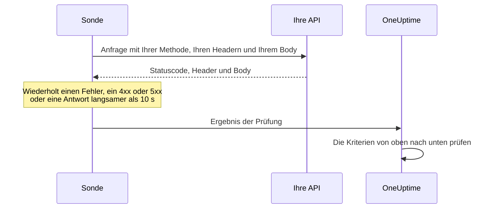

# API-Überwachung

Ein API-Monitor ruft nach Zeitplan einen HTTP-Endpunkt auf, mit der Methode, den Headern und dem Body, die Sie wählen, und prüft, was zurückkommt: den Statuscode, die Antwortzeit, die Header und den Body. Verwenden Sie ihn für REST-, JSON- und GraphQL-Endpunkte, Integritätsprüfungen und jeden Aufruf, auf den Ihre Benutzer angewiesen sind.

:::cards
- [Den Monitor erstellen](#einen-api-monitor-erstellen): Sechs Schritte im Dashboard.
- [Konfigurationsoptionen](#konfigurationsoptionen): Methode, Header, Body, Weiterleitungen, Zertifikate, Zeitlimits und Wiederholungen.
- [Überwachungskriterien](#überwachungskriterien): Was ab Werk als erreichbar oder ausgefallen zählt.
- [Fehlerbehebung](#fehlerbehebung): Wenn eine Prüfung fehlschlägt, die bestehen sollte.
:::

## So funktioniert es

Bei jeder Prüfung sendet eine Sonde die Anfrage, folgt Weiterleitungen und hält den Statuscode, die Antwortzeit, die Header und den Body fest. Eine Anfrage, die fehlschlägt, in ein Zeitlimit läuft, mit einem Status `4xx` oder `5xx` antwortet oder länger als 10 Sekunden dauert, wird erneut versucht, bis zur Zahl der Wiederholungen, die Sie zulassen. Danach prüft OneUptime das Ergebnis anhand der Kriterien des Monitors.



Eine Sonde, die ihre eigene Netzwerkverbindung verloren hat, meldet kein Ergebnis und kann Ihre API daher nicht als offline markieren.

## Bevor Sie beginnen

- **Eine Rolle, die Monitore erstellen darf**: Project Owner, Project Admin, Project Member, Monitor Admin oder Monitor Member oder eine benutzerdefinierte Rolle mit der Berechtigung Create Monitor.
- **Eine Sonde, die die API erreicht.** Die Standardsonden Ihres Projekts werden für jeden neuen Monitor ausgewählt. Steht eine Firewall vor der API, lassen Sie die [Sonden-IP-Adressen von OneUptime Cloud](/docs/configuration/ip-addresses) zu. Eine API in einem privaten Netzwerk braucht eine [benutzerdefinierte Sonde](/docs/probe/custom-probe) in diesem Netzwerk, die private Adressen erreichen darf: siehe [Zugriff auf private Netzwerke](/docs/self-hosted/private-network-access).
- **Anmeldedaten als Monitor-Geheimnisse.** Braucht die API einen Schlüssel oder ein Token, speichern Sie ihn zuerst als [Monitor-Geheimnis](/docs/monitor/monitor-secrets), damit der Monitor nur einen Verweis darauf enthält.

## Einen API-Monitor erstellen

:::steps
### Einen neuen Monitor beginnen

Gehen Sie zu **Monitore** und klicken Sie auf **Monitor erstellen**. Wählen Sie unter **Monitortyp** den Typ **API**.

### Ihn benennen

Geben Sie einen **Name** ein, etwa `Orders API`, und klicken Sie dann auf **Weiter**.

### Die Anfrage eingeben

Geben Sie unter **API-URL** die vollständige URL des Endpunkts ein, etwa `https://api.example.com/health`. Wählen Sie den **API-Anfragetyp** (**GET**, sofern Sie ihn nicht ändern). Um Header oder einen Body hinzuzufügen, öffnen Sie **Weitere Felder** und füllen Sie **Anfrage-Header** und **Anfrage-Body (in JSON)** aus.

### Ihn testen

Klicken Sie auf **Monitor testen**, wählen Sie unter **Sonde auswählen** eine Sonde und klicken Sie auf **Test ausführen**. **Überwachungs-Testergebnis** zeigt, was die API geantwortet hat.

### Die Kriterien prüfen

**Monitor-Kriterien** beginnt mit den [Standardkriterien](#standardkriterien): offline, wenn die API nicht oder mit einem Fehler antwortet, online bei jedem Status `2xx` oder `3xx`. Um auch zu prüfen, was die API zurückgibt, fügen Sie einen Filter hinzu und klicken Sie dann auf **Weiter**.

### Sonden wählen und erstellen

Behalten oder ändern Sie die **Sonden** und das **Überwachungsintervall** (es beginnt bei **Alle 5 Minuten**) und klicken Sie dann auf **Monitor erstellen**. Die Seite des Monitors öffnet sich.
:::

## Konfigurationsoptionen

### API-URL

Der aufzurufende Endpunkt, als vollständige URL mit Schema, etwa `https://api.example.com/v1/health`. Sie können ein [Monitor-Geheimnis](/docs/monitor/monitor-secrets) als `{{monitorSecrets.NAME}}` in die URL setzen.

### Dynamische URL-Platzhalter

Steht ein CDN oder ein Caching-Proxy vor der API, kann eine Sonde aus dem Cache statt von Ihrem Server beantwortet werden. Um am Cache vorbeizukommen, fügen Sie der URL einen Platzhalter hinzu; die Sonde ersetzt ihn bei jeder Prüfung durch einen neuen Wert.

| Platzhalter | Ersetzt durch | Beispielwert |
| --- | --- | --- |
| `{{timestamp}}` | Die aktuelle Unix-Zeit in Sekunden | `1719500000` |
| `{{random}}` | Eine zufällige, eindeutige Zeichenkette aus 32 Hexadezimalzeichen | `3f2b8c1d9e7a4b6c8d0e1f2a3b4c5d6e` |

Eine URL mit einem Platzhalter:

```text
https://api.example.com/health?cb={{timestamp}}
```

Was die Sonde bei zwei Prüfungen im Abstand von fünf Minuten abfragt:

```text
https://api.example.com/health?cb=1719500000
https://api.example.com/health?cb=1719500300
```

Verwenden Sie `{{random}}` auf dieselbe Weise: `https://api.example.com/health?nocache={{random}}`.

### API-Anfragetyp

Die HTTP-Methode, die gesendet wird. **GET** ist der Standard; die anderen sind **POST**, **PUT**, **PATCH**, **DELETE** und **HEAD**. Wird eine Anfrage **HEAD** mit einem Status `4xx` oder `5xx` beantwortet, wiederholt die Sonde sie als `GET`.

### Weitere Felder

Diese Einstellungen sind unter **Weitere Felder** eingeklappt. Die eingeklappte Kopfzeile nennt sie und zeigt, welche Sie geändert haben.

| Feld | Standard | Was es tut |
| --- | --- | --- |
| **Anfrage-Header** | Keine | Header, die gesendet werden, als Paare aus Name und Wert. Klicken Sie für jeden auf **Request Header hinzufügen**. |
| **Anfrage-Body (in JSON)** | Keiner | Ein JSON-Objekt, das als Body gesendet wird, meist mit **POST**, **PUT** oder **PATCH**. Es muss gültiges JSON sein. |
| **Weiterleitungen nicht folgen** | Aus | Die erste Antwort beurteilen, statt Weiterleitungen zu folgen. Siehe [unten](#weiterleitungen-nicht-folgen). |
| **Selbstsignierte Zertifikate zulassen** | Aus | Die Prüfung des TLS-Zertifikats für den eigenen Hostnamen des Monitors überspringen. |
| **Client-Zertifikat verwenden (mTLS)** | Aus | Ein Client-Zertifikat und einen privaten Schlüssel vorlegen. Siehe [Client-Zertifikat (mTLS)](#client-zertifikat-mtls). |
| **Anfrage-Zeitlimit (Sekunden)** | `60` | Wie lange auf jeden Versuch gewartet wird. Das Maximum sind 60 Sekunden. |
| **Wiederholungen bei Fehlschlag** | Standard der Sonde, meist `3` | Wie oft ein fehlgeschlagener Versuch wiederholt wird. Das Maximum ist 3. Siehe [Wiederholungen und Zeitlimits](#wiederholungen-und-zeitlimits). |

Anfrage-Header und der Anfrage-Body können [Monitor-Geheimnisse](/docs/monitor/monitor-secrets) verwenden, zum Beispiel einen Header `Authorization` mit dem Wert `Bearer {{monitorSecrets.ApiKey}}`.

#### Weiterleitungen nicht folgen

Standardmäßig folgt die Sonde Weiterleitungen (`301`, `302`, `303`, `307` und `308`), bis zu 10 davon, und beurteilt die Antwort, bei der sie landet. Schalten Sie **Weiterleitungen nicht folgen** ein, um stattdessen die Weiterleitungsantwort selbst zu beurteilen. Die [Standardkriterien](#standardkriterien) werten eine Weiterleitungsantwort als online.

Wenn sie einer Weiterleitung folgt:

- Ein `303`, oder ein `301` oder `302` als Antwort auf ein `POST`, macht aus der Anfrage ein `GET` ohne Body, wie es Browser tun.
- Ihre Anfrage-Header gehen nur an den eigenen Ursprung der URL (dasselbe Schema, derselbe Host und derselbe Port). Eine Weiterleitung zu einem anderen Ursprung wird ohne sie gesendet.
- Eine Weiterleitung zu einem anderen Ursprung lässt die Prüfung fehlschlagen, wenn die Anfrage noch einen Body oder eine andere Methode als `GET` oder `HEAD` hat.
- **Selbstsignierte Zertifikate zulassen** folgt Weiterleitungen, die auf dem eigenen Hostnamen des Monitors bleiben. Eine Weiterleitung zu einem anderen Hostnamen wird wie gewohnt geprüft.

#### Client-Zertifikat (mTLS)

Verlangt die API gegenseitiges TLS, schalten Sie **Client-Zertifikat verwenden (mTLS)** ein und füllen Sie aus:

| Feld | Was eingetragen wird |
| --- | --- |
| **Client-Zertifikat (PEM)** | Das PEM-kodierte Client-Zertifikat, das vorgelegt wird. |
| **Privater Client-Schlüssel (PEM)** | Der passende PEM-kodierte private Schlüssel. |
| **Passphrase des privaten Client-Schlüssels** | Optional. Die Passphrase, nur wenn der private Schlüssel verschlüsselt ist. |

Das entspricht den Optionen `--cert` und `--key` von curl:

```bash
curl --cert client.crt --key client.key https://api.example.com/health
```

Um den Schlüssel aus den Einstellungen des Monitors herauszuhalten, speichern Sie Zertifikat und Schlüssel als [Monitor-Geheimnisse](/docs/monitor/monitor-secrets) und tragen Sie in diese Felder `{{monitorSecrets.NAME}}` ein. Geheimnisse werden auf dem Server eingesetzt, und ihre Werte erscheinen nie im Dashboard.

Das Client-Zertifikat wird nur vorgelegt, solange die Anfrage beim Ursprung der URL bleibt. Nach einer Weiterleitung zu einem anderen Ursprung macht die Sonde ohne es weiter.

#### Wiederholungen und Zeitlimits

**Wiederholungen bei Fehlschlag** zählt die Wiederholungen _nach_ dem ersten Versuch, also führt `0` die Prüfung einmal aus und `2` bis zu dreimal. Bleibt das Feld leer, gilt der Standard der Sonde: 3, sofern `PROBE_MONITOR_RETRY_LIMIT` der Sonde nichts anderes sagt. Die Sonde wartet zwischen den Versuchen eine Sekunde, und jeder Versuch bekommt das volle **Anfrage-Zeitlimit (Sekunden)**.

Diese Fehler werden wiederholt: Verbindungsfehler, Zeitüberschreitungen, Antworten `4xx` und `5xx` sowie Antworten, die langsamer als 10 Sekunden sind. Diese nicht, weil ein neuer Versuch nichts an ihnen ändert: eine ungültige oder gesperrte URL, mehr als 10 Weiterleitungen und eine Antwort größer als 512 KiB.

## Überwachungskriterien

Kriterien entscheiden, wann die API als online, beeinträchtigt oder offline gilt und ob dabei ein Vorfall gemeldet oder eine Warnung erstellt wird. Jedes Kriterium prüft einen oder mehrere Filter:

| Filter | Bedingungen | Was er prüft |
| --- | --- | --- |
| **Is Online** | **Wahr**, **Falsch** | Ob die API überhaupt geantwortet hat, egal mit welchem Statuscode. |
| **Antwort-Statuscode** | **Equal To**, **Not Equal To**, **Greater Than**, **Less Than**, **Greater Than Or Equal To**, **Less Than Or Equal To** | Den HTTP-Statuscode. |
| **Antwortzeit (in ms)** | **Greater Than**, **Less Than**, **Greater Than Or Equal To**, **Less Than Or Equal To** | Wie lange die Anfrage gedauert hat, Weiterleitungen eingeschlossen. |
| **Antworttext** | **Enthält**, **Not Contains** | Text im Antworttext. Groß- und Kleinschreibung wird unterschieden. |
| **Response Header** | **Enthält**, **Not Contains** | Ob die Antwort einen Header mit diesem Namen hat. Geben Sie den Namen kleingeschrieben ein, etwa `x-request-id`. |
| **Response Header Value** | **Enthält**, **Not Contains** | Ob ein Header genau diesen Wert hat, kleingeschrieben verglichen, etwa `application/json`. |
| **JavaScript Expression** | **Evaluates To True** | Ein Ausdruck über die Antwort. Siehe [JavaScript-Ausdrücke](/docs/monitor/javascript-expression). |
| **Is Request Timeout** | **Wahr**, **Falsch** | Ob die Anfrage bei jedem Versuch in ein Zeitlimit gelaufen ist. |

Eine JSON-Antwort wird in ihrer kompakten Form geprüft, ohne Leerzeichen zwischen Schlüsseln und Werten. Um `"status": "ok"` mit **Antworttext** zu finden, geben Sie `"status":"ok"` ein.

**Kriterien hinzufügen** fügt ein Kriterium hinzu, das bereits nach seinem Filter benannt ist, zum Beispiel _Response Time (in ms) is above 3000_. Der Name ändert sich mit den Filtern, bis Sie einen eigenen eingeben. Eine Beschreibung ist optional: Um eine hinzuzufügen, öffnen Sie die **Einstellungen** des Kriteriums.

Bei zwei oder mehr Filtern entscheidet **Abgleichsbedingung**, ob **Alle** zutreffen müssen oder **Beliebig** einer genügt. Die **Aktionen** eines Kriteriums legen fest, was es tut: den Monitorstatus ändern, eine Warnung erstellen, einen Vorfall melden oder mehreres davon.

### Standardkriterien

Ein neuer API-Monitor beginnt mit zwei Kriterien, sodass er ohne Änderungen funktioniert:

- **Offline** — die API antwortet nicht oder mit einem Statuscode ab `400` (oder unter `200`). Der Monitor wird als **Offline** markiert und ein Vorfall wird erstellt. Der Vorfall löst sich von selbst auf, wenn die API wieder da ist.
- **Online** — die API antwortet mit einem beliebigen Statuscode `2xx` oder `3xx`, etwa `200`, `201`, `202` oder `204`. Der Monitor wird als **Betriebsbereit** markiert.

In der Liste der Kriterien sind sie nach dem Monitor benannt: _Check if (name) is offline_ und _Check if (name) is online_.

Ein Endpunkt, der `201 Created` oder `204 No Content` antwortet, zählt also als erreichbar. Wenn für Sie nur ein Statuscode gesund bedeutet, ändern Sie beide Kriterien auf der Seite **Konfiguration → Kriterien** des Monitors: zum Beispiel **Antwort-Statuscode** / **Equal To** / `200` im Online-Kriterium und **Not Equal To** / `200` im Offline-Kriterium, anstelle der beiden Statuscode-Filter, die jedes hat. Um auch zu prüfen, was die API zurückgibt, fügen Sie dem Offline-Kriterium einen Filter **Antworttext** oder **JavaScript Expression** hinzu.

Kriterien werden von oben nach unten geprüft, und das erste zutreffende entscheidet, was passiert.

Trifft keines zu, fällt der Monitor auf seinen Standardstatus zurück: **Betriebsbereit**, sofern Sie unter **Weitere Felder** unterhalb der Kriterien keinen anderen wählen. Die eingeklappte Kopfzeile von **Weitere Felder** zeigt, welcher Status das ist.

Monitore, die erstellt wurden, bevor OneUptime diese Standards geändert hat, behalten die Kriterien, mit denen sie erstellt wurden, und werten nur `200` als online. Über die API oder Terraform erstellte Monitore verwenden die Kriterien, die Sie senden.

### Über einen Zeitraum auswerten

**Diese Kriterien über einen Zeitraum hinweg auswerten** ist ein Kontrollkästchen unter einem Filter, angeboten für **Is Online**, **Antwort-Statuscode** und **Antwortzeit (in ms)**. Schalten Sie es ein, um ein Fenster vergangener Prüfungen statt nur der letzten zu beurteilen: Wählen Sie unter **Auswerten** eine Aggregation und unter **Für die letzten (in Minuten)** ein Fenster von 2 bis 60 Minuten.

| Aggregation | Trifft zu, wenn |
| --- | --- |
| **Durchschnitt**, **Summe**, **Maximum Value**, **Minimum Value** | Dieser Wert über das Fenster die Bedingung erfüllt. Nur für numerische Filter. |
| **All Values** | Jede Prüfung im Fenster die Bedingung erfüllt. |
| **Any Value** | Mindestens eine Prüfung im Fenster die Bedingung erfüllt. |

**All Values** trifft erst zu, wenn das Fenster wirklich mit Daten gefüllt ist. Ein gerade erstellter Monitor oder einer, dessen Prüfungen nicht mehr aufgezeichnet wurden, hat nicht genug Verlauf, um etwas über die letzten N Minuten zu sagen, daher wartet das Kriterium, statt auf dem einen vorhandenen Messwert anzuschlagen. **Any Value** ist die Einstellung für „sag mir sofort, wenn eine einzige Prüfung den Grenzwert verletzt“ und schlägt weiterhin sofort an.

**Bei keinen Daten** entscheidet, was passiert, solange das Fenster das Kriterium nicht stützen kann:

| Option | Was passiert | Wofür |
| --- | --- | --- |
| **Ignore** (Standard) | Das Kriterium trifft nicht zu. | Gewöhnliche Schwellenwert-Warnungen. |
| **Auslöser** | Die fehlenden Daten zählen als das Problem. | Prüfungen, bei denen Stille selbst ein Fehler ist. |
| **Treat As Zero** | Das Fenster wird als einzelne Null verglichen. | Zähler, bei denen keine Ereignisse wirklich null bedeutet. |

### Beispielkriterien

| Ziel | Filter | Bedingung | Wert |
| --- | --- | --- | --- |
| Die API als beeinträchtigt markieren, wenn sie langsam ist | **Antwortzeit (in ms)** | **Greater Than** | `1000` |
| Offline, wenn die Integritätsprüfung ein Problem meldet | **Antworttext** | **Not Contains** | `"status":"ok"` |
| Dasselbe, aus dem geparsten JSON gelesen | **JavaScript Expression** | **Evaluates To True** | `"{{responseBody.status}}" !== "ok"` |
| Von einem `POST` nur `201` akzeptieren | **Antwort-Statuscode** | **Equal To** | `201` |

## Fehlerbehebung

:::details Die API beantwortet meine Anfragen, aber der Monitor ist offline
Die Sonde hat eine andere Antwort bekommen als Sie. Die Ursache des Vorfalls und **Überwachungsprotokolle** am Monitor zeigen, was die Sonde gesehen hat. Prüfen Sie, ob die Sonde sendet, was die API erwartet: die Methode, den Header `Authorization`, den Body. Auch eine Firewall oder ein Ratenbegrenzer vor der API kann die Sonden blockieren: Lassen Sie die [Sonden-IP-Adressen von OneUptime Cloud](/docs/configuration/ip-addresses) zu.
:::

:::details Der Monitor sendet `{{monitorSecrets.NAME}}` wörtlich
Der Monitor darf das Geheimnis nicht verwenden, oder der Name stimmt nicht. Unter [Monitor-Geheimnisse](/docs/monitor/monitor-secrets) steht, wer ein Geheimnis verwenden darf.
:::

:::details Die Prüfung schlägt fehl mit „unsafe cross-origin redirect“
Die API hat eine Anfrage mit einem Body oder mit einer anderen Methode als `GET` oder `HEAD` zu einem anderen Ursprung weitergeleitet, und die Sonde leitet solche nicht weiter. Richten Sie den Monitor auf die URL, zu der die API weiterleitet, oder schalten Sie **Weiterleitungen nicht folgen** ein und prüfen Sie die Weiterleitung selbst.
:::

:::details Die Prüfung schlägt fehl mit „Remote response exceeded the allowed size.“
Die Sonde liest höchstens 512 KiB einer Antwort, und diese ist größer. Rufen Sie einen Endpunkt auf, der weniger zurückgibt, zum Beispiel mit einer kleineren Seitengröße.
:::

## Nächste Schritte

:::cards
- [JavaScript-Ausdrücke](/docs/monitor/javascript-expression): Felder tief in einer JSON-Antwort prüfen.
- [Überwachungs-Geheimnisse](/docs/monitor/monitor-secrets): API-Schlüssel und Tokens aus den Monitoreinstellungen heraushalten.
- [Website-Überwachung](/docs/monitor/website-monitor): Statt eines Endpunkts eine Webseite prüfen.
- [Vorfall- & Warnmeldungsvorlagen](/docs/monitor/incident-alert-templating): Details der Antwort in die Titel von Vorfällen und Warnungen setzen.
:::
