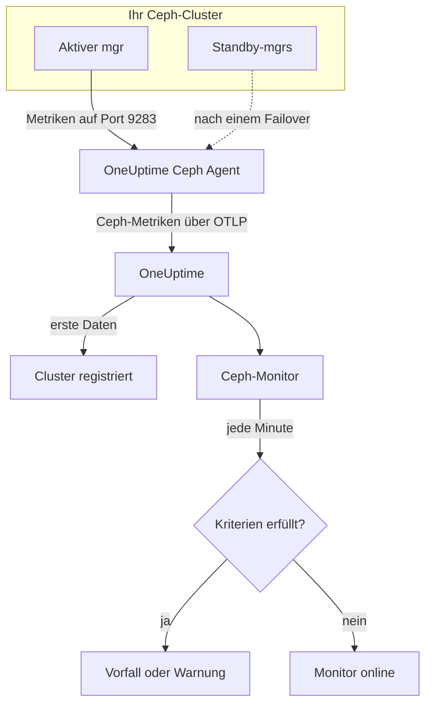

# Ceph-Überwachung

Ein Ceph-Monitor überwacht einen Ceph-Cluster — seinen Zustand, seine Health-Checks, das Monitor-Quorum, OSDs, Pools und Placement Groups — und meldet sich, sobald sich der Zustand verschlechtert, ein OSD ausfällt oder die Kapazität knapp wird. Er liest die `ceph_*`-Metriken, die das `prometheus`-Modul des Ceph-mgr exportiert und der OneUptime Ceph Agent einsammelt, daher wird nichts von außen abgefragt.

:::cards
- [Den Monitor erstellen](#einen-ceph-monitor-erstellen): Sechs Schritte im Dashboard.
- [Vorlagen](#fertige-alarmvorlagen): 23 fertige Alarme für Zustand, OSDs, Placement Groups und Kapazität.
- [Health-Checks](#health-check-serien): Bei jedem Ceph-Health-Check nach Namen alarmieren.
- [Metriken](#gesammelte-metriken): Jede `ceph_*`-Serie, auf die der Monitor alarmieren kann.
:::

## So funktioniert es

Das `prometheus`-Modul des Ceph-mgr stellt die Metriken des Clusters auf Port 9283 bereit. Der OneUptime Ceph Agent fragt alle 30 Sekunden jeden mgr-Daemon ab — der aktive antwortet, die Standbys liefern nichts, bis sie übernehmen —, behält die Labels von Ceph (`ceph_daemon`, `pool_id`) bei und sendet die Metriken über OTLP an OneUptime, versehen mit dem Namen des Clusters, `ceph.cluster.name`. Die ersten Daten registrieren den Cluster.

Ein Ceph-Monitor gehört zu genau einem Cluster. Jede Minute führt er seine Abfrage über die Metriken dieses Clusters aus und vergleicht das Ergebnis mit seinen Kriterien.



## Bevor Sie beginnen

- **Aktivieren Sie das `prometheus`-Modul des mgr** im Cluster:

  ```bash
  ceph mgr module enable prometheus
  ```

- **Installieren Sie den Ceph Agent** auf einem Rechner, der jeden mgr-Daemon auf Port 9283 erreicht, und tragen Sie alle in `CEPH_MGR_ENDPOINTS` ein. Die [Anleitung zum Ceph Agent](/docs/telemetry/ceph) beschreibt die Installation.
- **Prüfen Sie, ob der Cluster registriert ist.** Er erscheint etwa eine Minute nach der ersten Abfrage unter **Produkte → Infrastruktur → Ceph → Alle Cluster**, benannt nach `CEPH_CLUSTER_NAME` des Agenten.
- **Für Alarme auf Health-Checks** brauchen Sie Ceph Quincy oder neuer. Ältere Versionen exportieren `ceph_health_detail` nicht.

## Einen Ceph-Monitor erstellen

:::steps
### Einen neuen Monitor anlegen

Gehen Sie zu **Monitore** und klicken Sie auf **Monitor erstellen**.

### Ceph auswählen

Klicken Sie unter **Monitortyp** auf **Weitere Monitortypen** und wählen Sie **Ceph** unter **Infrastruktur**, oder geben Sie `ceph` in das Suchfeld ein. Geben Sie einen **Name** ein — er erscheint in den Titeln von Vorfällen und Warnungen — und klicken Sie auf **Weiter**.

### Den Cluster wählen

Wählen Sie unter **Ceph-Monitor-Konfiguration** den Cluster in **Ceph-Cluster**. Jeder Cluster, der bereits Daten gesendet hat, steht in der Liste.

### Festlegen, was überwacht wird

Wählen Sie einen der drei Tabs:

- **Quick Setup** — klicken Sie auf eine [Vorlage](#fertige-alarmvorlagen). Sie setzt Metriken, Filter, Aggregation, Zeitbereich und Schwellenwerte und ersetzt die Kriterien unten durch ihre eigenen. Den **Zeitbereich** können Sie weiterhin ändern.
- **Custom Metric** — wählen Sie eine Metrik in **Ceph-Metrik** und legen Sie dann **Aggregation** und **Zeitbereich** fest. **OSD** und **Pool-ID** grenzen sie auf einen Daemon oder Pool ein.
- **Erweitert** — bauen Sie Abfragen und Formeln selbst unter **Metriken auswählen**, zum Beispiel ein Verhältnis der belegten Kapazität aus `ceph_cluster_total_used_bytes / ceph_cluster_total_bytes`. Mit **Gruppieren nach** `ceph_daemon` oder `pool_id` wird jeder Daemon oder Pool einzeln bewertet.

### Die Kriterien prüfen

Öffnen Sie jedes Kriterium unter **Monitor-Kriterien** und prüfen Sie **Metrik**, **Aggregation**, **Bedingung** und **Schwellenwert**. Eine Vorlage füllt diese Felder aus. Mit **Custom Metric** oder **Erweitert** startet der Monitor mit den [Standardkriterien](#standardkriterien), die nur bemerken, wenn eine Metrik auf null fällt — setzen Sie also Ihren eigenen Schwellenwert.

### Den Monitor anlegen

Klicken Sie auf **Monitor erstellen**. OneUptime öffnet die Seite des Monitors und wertet ihn jede Minute aus. Vorfälle und Warnungen, die er auslöst, stehen auch auf den Seiten **Vorfälle** und **Warnungen** des Clusters.
:::

> [!TIP]
> Um mehrere Vorlagen auf einmal einzurichten, öffnen Sie den Cluster unter **Produkte → Infrastruktur → Ceph** und gehen Sie zu **Empfehlungen**. Wählen Sie die gewünschten Vorlagen und wer alarmiert wird, und OneUptime erstellt pro Vorlage einen Monitor.

## Monitor-Einstellungen

| Feld | Tab | Wirkung |
| --- | --- | --- |
| **Ceph-Cluster** | Alle | Pflichtfeld. Beschränkt jede Abfrage auf `resource.ceph.cluster.name`. |
| **OSD** | Custom Metric, Erweitert | Optional. Exakter Abgleich mit dem Label `ceph_daemon`, zum Beispiel `osd.3`. |
| **Pool-ID** | Custom Metric, Erweitert | Optional. Exakter Abgleich mit dem Label `pool_id`, zum Beispiel `2`. |
| **Ceph-Metrik** | Custom Metric | Eine Metrik aus dem [Katalog](#gesammelte-metriken). |
| **Aggregation** | Custom Metric | Wie Messwerte zusammengefasst werden: **Durchschnitt**, **Maximum**, **Minimum**, **Summe** oder **Anzahl**. Beginnt mit der üblichen Aggregation der Metrik. |
| **Zeitbereich** | Alle | Das gleitende Fenster, das die Abfrage liest, von **Past 1 Minute** bis **Past 365 Days**. Ein neuer Monitor beginnt bei **Past 1 Minute**; Vorlagen setzen ihren eigenen Wert. |
| **Metriken auswählen** | Erweitert | Der Abfrage-Editor: **Metrik**, **Aggregieren nach**, **Nach Attributen filtern**, **Gruppieren nach**, dazu **Metrik hinzufügen** und **Formel hinzufügen**, um Abfragen zu kombinieren. |

Datenserien von Pools tragen nur das Label `pool_id`: Der Name des Pools existiert ausschließlich in `ceph_pool_metadata`. Filtern und gruppieren Sie Pool-Serien nach `pool_id` und schlagen Sie den Namen bei Bedarf in `ceph_pool_metadata` nach.

### Health-Check-Serien

`ceph_health_detail` exportiert **eine Serie pro aktivem Health-Check**, mit den Labels `name` (zum Beispiel `OSD_NEARFULL` oder `RECENT_CRASH`) und `severity`. Eine Serie existiert nur, solange ihr Check auslöst; keine Serie bedeutet also gesund. Um auf einen beliebigen Ceph-Health-Check zu alarmieren, filtern Sie auf seinen `name`, lösen mit **Maximum** über `0` aus und erholen sich bei `0` mit **Bei keinen Daten** auf **Treat As Zero** — genau so sind die Health-Check-Vorlagen gebaut. `ceph_daemon_health_metrics` funktioniert genauso pro Daemon, mit einem Label `type` (zum Beispiel `SLOW_OPS`) und `ceph_daemon`.

## Fertige Alarmvorlagen

**Quick Setup** bietet 23 Vorlagen für Cluster-Zustand, OSDs, Placement Groups und Kapazität. Jede baut einen vollständigen Monitor — Abfragen, Label-Filter, eine Gruppierung, ein auslösendes und ein erholendes Kriterium. Die Schwellenwerte sind Ausgangspunkte, die Sie anpassen können.

Vorlagen lesen die letzten 5 Minuten, sofern die Tabelle nichts anderes sagt. Ein Kriterium löst nur aus, wenn die Bedingung in jeder Minute seines Fensters zutrifft, und ein Schwellenwert-Kriterium erholt sich erst 10 % jenseits seines Schwellenwerts, damit ein Wert, der um die Linie pendelt, nicht flattert. **Schweregrad** ist die Bezeichnung, die die Auswahl zeigt; der Vorfall und die Warnung, die eine Vorlage erzeugt, beginnen mit dem höchsten Vorfall- und Warnungsschweregrad Ihres Projekts.

### Vorlagen für den Cluster-Zustand

| Vorlage | Schweregrad | Überwacht | Löst aus bei | Erholt sich bei |
| --- | --- | --- | --- | --- |
| Cluster Health Error | Kritisch | `ceph_health_status`, Max, letzte 1 Minute | 2 oder mehr: `HEALTH_ERR` | Unter 1,8: `HEALTH_WARN` oder besser |
| Cluster Health Warning | Warnung | `ceph_health_status`, Max | 1 oder mehr: `HEALTH_WARN` oder schlechter | Unter 0,9: `HEALTH_OK` |
| Monitor Quorum Degraded | Kritisch | `ceph_mon_quorum_status`, Min pro `ceph_daemon`, letzte 1 Minute | Ein Monitor fällt unter 1, aus dem Quorum. Ein Vorfall pro Monitor | Wieder bei 1 |
| Slow Operations | Warnung | `ceph_healthcheck_slow_ops`, Max | Über 0: Der `SLOW_OPS`-Check des Clusters ist aktiv | Bei 0 |
| Daemon Slow Operations | Warnung | `ceph_daemon_health_metrics` für `type = SLOW_OPS`, Max pro `ceph_daemon` | Über 0. Ein Vorfall pro OSD oder Monitor | Die Serie verschwindet |
| Daemon Crash | Kritisch | `ceph_health_detail` für `name = RECENT_CRASH`, Max | Der Check ist aktiv: Es gibt nicht archivierte Daemon-Abstürze. Der mgr hat keine `ceph_crash_*`-Metrik, daher ist dies das einzige Absturzsignal | Die Abstürze sind archiviert |
| Monitor Clock Skew | Warnung | `ceph_health_detail` für `name = MON_CLOCK_SKEW`, Max | Der Check ist aktiv: Die Uhren der Monitore weichen stärker ab als erlaubt (Standard 0,05 s) | Der Check verschwindet |
| Monitor Disk Critically Low | Kritisch | `ceph_health_detail` für `name = MON_DISK_CRIT`, Max | Der Check ist aktiv: Die Datenbankplatte eines Monitors hat weniger als 5 % frei (Standard) | Der Check verschwindet |
| Monitor Disk Space Low | Warnung | `ceph_health_detail` für `name = MON_DISK_LOW`, Max | Der Check ist aktiv: weniger als 30 % frei (Standard) | Der Check verschwindet |

### OSD-Vorlagen

| Vorlage | Schweregrad | Überwacht | Löst aus bei | Erholt sich bei |
| --- | --- | --- | --- | --- |
| OSD Down | Kritisch | `ceph_osd_up`, Min pro `ceph_daemon` | Ein OSD fällt unter 1. Ein Vorfall pro OSD | Wieder bei 1 |
| OSD Out | Warnung | `ceph_osd_in`, Min pro `ceph_daemon` | Ein OSD fällt unter 1: aus der Datenverteilung genommen | Wieder bei 1 |
| OSD High Latency | Warnung | `ceph_osd_apply_latency_ms`, Avg pro `ceph_daemon` | Über 100 ms. Ein Vorfall pro OSD | Bei höchstens 90 ms |
| OSD Slow Heartbeats | Warnung | `ceph_health_detail` für `name = OSD_SLOW_PING_TIME_FRONT` und `name = OSD_SLOW_PING_TIME_BACK`, Max | Einer der Checks ist aktiv: Heartbeats im öffentlichen oder im Cluster-Netz sind langsam. Der mgr exportiert keine Ping-Zeit als Messwert | Beide Checks verschwinden |

### Vorlagen für Placement Groups

| Vorlage | Schweregrad | Überwacht | Löst aus bei | Erholt sich bei |
| --- | --- | --- | --- | --- |
| Inactive Placement Groups | Kritisch | `ceph_pg_total` − `ceph_pg_active`, Max pro `pool_id` | Über 0: PGs können keine I/O bedienen, Client-Anfragen an sie hängen. Ein Vorfall pro Pool | Bei 0 |
| Degraded Placement Groups | Warnung | `ceph_pg_degraded`, Max pro `pool_id` | Über 0: Objekte haben weniger Replikate als konfiguriert | Bei 0 |
| Undersized Placement Groups | Warnung | `ceph_pg_undersized`, Max pro `pool_id` | Über 0: PGs liegen auf weniger OSDs, als ihre Replikatzahl vorsieht | Bei 0 |
| Damaged Placement Groups | Kritisch | `ceph_health_detail` für `name = PG_DAMAGED` und `name = OSD_SCRUB_ERRORS`, Max | Einer der Checks ist aktiv: Das Scrubbing hat Schäden oder Lesefehler gefunden | Beide Checks verschwinden |

### Kapazitätsvorlagen

| Vorlage | Schweregrad | Überwacht | Löst aus bei | Erholt sich bei |
| --- | --- | --- | --- | --- |
| Cluster Near Full | Warnung | `ceph_cluster_total_used_bytes` ÷ `ceph_cluster_total_bytes` × 100 | Über 85 %, der Standard-Nearfull-Quote von Ceph | Bei höchstens 76,5 % |
| Cluster Full | Kritisch | Dieselbe Quote | Über 95 %, der Standard-Full-Quote von Ceph, ab der im ganzen Cluster keine Schreibvorgänge mehr möglich sind | Bei höchstens 85,5 % |
| Pool Near Full | Warnung | `ceph_pool_stored` ÷ (`ceph_pool_stored` + `ceph_pool_max_avail`) × 100, pro `pool_id` | Über 85 % dessen, was der Pool aufnehmen kann. Ein Vorfall pro Pool | Bei höchstens 76,5 % |
| OSD Nearfull | Warnung | `ceph_health_detail` für `name = OSD_NEARFULL`, Max | Der Check ist aktiv: Ein OSD hat die Nearfull-Schwelle überschritten (Standard 85 %). Einzelne OSDs laufen lange vor dem Cluster-Durchschnitt voll | Der Check verschwindet |
| OSD Backfillfull | Warnung | `ceph_health_detail` für `name = OSD_BACKFILLFULL`, Max | Der Check ist aktiv: Backfill auf das OSD wird verweigert (Standard 90 %), die Wiederherstellung stockt | Der Check verschwindet |
| OSD Full | Kritisch | `ceph_health_detail` für `name = OSD_FULL`, Max, letzte 1 Minute | Der Check ist aktiv: Ein OSD hat die Full-Schwelle erreicht (Standard 95 %), Schreibvorgänge werden verweigert | Der Check verschwindet |

- **Vorlagen für Ausfall und Quorum verwenden das Minimum**, damit ein ausgefallenes OSD oder ein Monitor außerhalb des Quorums sie auslöst, statt von der gesunden Mehrheit verdeckt zu werden.
- **Zähl- und Health-Check-Vorlagen verwenden das Maximum**, damit eine einzige schlechte Abfrage genügt.
- **PG- und Pool-Serien gibt es pro Pool**: Es gibt keinen clusterweiten Messwert, daher gruppieren diese Vorlagen nach `pool_id` und öffnen einen Vorfall pro Pool.
- **Kapazitätsquoten** nehmen auf beiden Seiten die **Summe**. Beide stammen aus derselben mgr-Abfrage, daher ergibt sich ein echter Prozentsatz. **Inactive Placement Groups** verwendet stattdessen **Maximum** pro Pool, weil eine Summe bei einer Subtraktion die Abfragen aufaddieren würde.
- **Health-Check-Vorlagen** erholen sich, wenn der Check verschwindet: Ihre Erholungskriterien zählen eine fehlende Serie als 0.

Manche Alarme haben keine Vorlage. Eine PG-Ungleichverteilung braucht Statistik über mehrere Serien, die Kriterien nicht berechnen können. Eine Kapazitätsprognose braucht eine Wachstumskurve, die stattdessen das Dashboard des Clusters zeichnet. Für vorhergesagte Plattenausfälle und veraltetes Scrubbing gibt es keine mgr-Metrik, und NVMe-oF, RBD-Mirroring und cephadm brauchen andere Exporter.

## Gesammelte Metriken

Der Agent fragt alle 30 Sekunden jeden mgr-Daemon ab und behält die Labels von Ceph bei, daher tragen Serien pro Daemon `ceph_daemon` (`osd.3`, `mon.a`) und Serien pro Pool `pool_id`.

### Metriken zum Cluster-Zustand

| Metrik | Einheit | Beschreibung |
| --- | --- | --- |
| `ceph_health_status` | — | Gesamtzustand: 0 = `HEALTH_OK`, 1 = `HEALTH_WARN`, 2 = `HEALTH_ERR`. |
| `ceph_health_detail` | Anzahl | Eine Serie pro **aktivem** Health-Check, mit den Labels `name` und `severity`. Nur ab Quincy. |
| `ceph_healthcheck_slow_ops` | Anzahl | Langsame OSD- und Monitor-Operationen, die der Check `SLOW_OPS` meldet. |
| `ceph_daemon_health_metrics` | Anzahl | Zustandsmetriken pro Daemon, mit `type` (zum Beispiel `SLOW_OPS`) und `ceph_daemon`. |
| `ceph_mon_quorum_status` | Anzahl | 1, wenn der Monitor im Quorum ist, pro `ceph_daemon` (zum Beispiel `mon.a`). |
| `ceph_mon_metadata` | Anzahl | Metadaten des Monitors, immer 1. Summieren Sie sie, um Monitore zu zählen. |
| `ceph_cluster_total_bytes` | Bytes | Gesamte Rohkapazität. |
| `ceph_cluster_total_used_bytes` | Bytes | Belegte Rohkapazität. |

### OSD-Metriken

| Metrik | Einheit | Beschreibung |
| --- | --- | --- |
| `ceph_osd_up` | Anzahl | 1, wenn das OSD läuft, pro `ceph_daemon` (zum Beispiel `osd.3`). |
| `ceph_osd_in` | Anzahl | 1, wenn das OSD Teil der Datenverteilung ist. |
| `ceph_osd_apply_latency_ms` | ms | Zeit, um eine Operation auf den zugrunde liegenden Speicher anzuwenden. |
| `ceph_osd_commit_latency_ms` | ms | Zeit, um eine Operation ins Journal oder WAL zu schreiben. |
| `ceph_osd_stat_bytes` | Bytes | Rohkapazität des OSD-Geräts. |
| `ceph_osd_stat_bytes_used` | Bytes | Belegte Roh-Bytes auf dem OSD. Mit der Gesamtmenge vergleichen, um ungleich gefüllte oder fast volle OSDs zu erkennen. |
| `ceph_osd_numpg` | Anzahl | Placement Groups auf dem OSD. |
| `ceph_osd_metadata` | Anzahl | Metadaten des OSD (Hostname, Geräteklasse, Version), immer 1. Summieren Sie sie, um OSDs zu zählen. |

### Pool-Metriken

| Metrik | Einheit | Beschreibung |
| --- | --- | --- |
| `ceph_pool_stored` | Bytes | Im Pool gespeicherte Nutzdaten. |
| `ceph_pool_max_avail` | Bytes | Bytes, die angesichts des Replikations- oder Erasure-Coding-Profils noch in den Pool geschrieben werden können. |
| `ceph_pool_objects` | Anzahl | Objekte im Pool. |
| `ceph_pool_rd` | Ops | Leseoperationen auf dem Pool. Ein Zähler über die gesamte Lebensdauer. |
| `ceph_pool_wr` | Ops | Schreiboperationen auf dem Pool. Ein Zähler über die gesamte Lebensdauer. |
| `ceph_pool_rd_bytes` | Bytes | Aus dem Pool gelesene Bytes. Ein Zähler über die gesamte Lebensdauer. |
| `ceph_pool_wr_bytes` | Bytes | In den Pool geschriebene Bytes. Ein Zähler über die gesamte Lebensdauer. |
| `ceph_pool_metadata` | Anzahl | Metadaten des Pools, immer 1 — die einzige Serie, die `pool_id` einem Namen zuordnet. |

### Placement-Group-Metriken

Jede `ceph_pg_*`-Serie gibt es pro Pool, mit dem Label `pool_id`; summieren Sie über die Pools für einen clusterweiten Wert.

| Metrik | Einheit | Beschreibung |
| --- | --- | --- |
| `ceph_pg_total` | Anzahl | Placement Groups im Pool. |
| `ceph_pg_active` | Anzahl | PGs im Zustand `active`, die I/O bedienen können. |
| `ceph_pg_clean` | Anzahl | PGs im Zustand `clean`, vollständig repliziert. |
| `ceph_pg_degraded` | Anzahl | PGs im Zustand `degraded`. |
| `ceph_pg_undersized` | Anzahl | PGs im Zustand `undersized`. |
| `ceph_num_objects_degraded` | Anzahl | Objekte mit weniger Replikaten als konfiguriert. |
| `ceph_num_objects_misplaced` | Anzahl | Objekte, die nicht dort liegen, wo CRUSH sie haben will. Die Daten sind sicher, nur die Platzierung stimmt nicht. |

## Überwachungskriterien

Ein Kriterium vergleicht eine der Abfragen oder Formeln des Monitors mit einem Schwellenwert. Die Kriterien eines Ceph-Monitors haben keinen **Filtertyp**: Jede Regel prüft den Metrikwert, mit diesen Feldern.

| Feld | Wirkung |
| --- | --- |
| **Metrik** | Die zu prüfende Abfrage oder Formel, über ihren Variablennamen. |
| **Aggregation** | Wie die Werte im Fenster zu einer Antwort werden: **Durchschnitt**, **Summe**, **Maximum Value**, **Minimum Value**, **All Values** (jeder Wert muss zutreffen) oder **Any Value** (einer genügt). |
| **Bedingung** | **Greater Than**, **Less Than**, **Greater Than Or Equal To**, **Less Than Or Equal To** oder **Equal To** — oder eine Anomaliebedingung: **Anomalously High**, **Anomalously Low** oder **Anomalous**. |
| **Schwellenwert** | Der Vergleichswert. Daneben steht eine Einheitenauswahl, wenn die Metrik eine Einheit hat. Bei Anomaliebedingungen nicht sichtbar. |
| **Empfindlichkeit** | Nur bei Anomaliebedingungen. **Low** (4σ), **Medium** (3σ, Standard) oder **Hoch** (2σ). |
| **Baseline-Fenster** | Nur bei Anomaliebedingungen. 14 Tage (Standard), 28, 60 oder 90 Tage Verlauf. |
| **Bei keinen Daten** | Unter **Weitere Felder**. Was passiert, wenn das Fenster keine Messwerte enthält: **Ignore** (Standard), **Treat As Zero** oder **Auslöser**. |

Anomaliebedingungen vergleichen jeden Wert mit derselben Stunde der Woche in der Baseline. Sie bleiben im Zustand "Learning" und lösen nichts aus, bis das Baseline-Fenster genug Verlauf enthält.

Jedes Kriterium legt außerdem fest, was bei einem Treffer passiert: den Monitorstatus ändern, eine Warnung erstellen oder einen Vorfall ausrufen. Die Kriterien werden von oben nach unten geprüft, und das erste, das zutrifft, entscheidet.

### Standardkriterien

Ein Monitor, den Sie nicht aus einer Vorlage bauen, beginnt mit zwei Kriterien:

| Reihenfolge | Kriterium | Trifft zu, wenn | Dann |
| --- | --- | --- | --- |
| 1 | Check if _Monitorname_ is offline | Ein Wert der ersten Abfrage ist `0` | Setzt den Monitor auf **Offline** und ruft den Vorfall "_Monitorname_ is offline" aus, der sich selbst behebt, wenn sich der Monitor erholt. |
| 2 | Check if _Monitorname_ is online | Ein Wert liegt über `0` | Setzt den Monitor auf **Betriebsbereit**. |

Diese Standards passen zu wenigen Ceph-Metriken: `ceph_health_status` ist 0, wenn der Cluster gesund ist. Wählen Sie eine Vorlage oder setzen Sie eigene Kriterien.

> [!IMPORTANT]
> Stille erfüllt keines der beiden Kriterien: Ein Cluster, der keine Daten mehr sendet, lässt den Monitor so, wie er war. Um zu erfahren, wenn keine Daten mehr kommen, setzen Sie **Bei keinen Daten** in einem Kriterium auf **Auslöser**.

## Fehlerbehebung

:::details Der Cluster steht nicht in der Liste Ceph-Cluster
Cluster registrieren sich selbst anhand der Daten des Agenten. Prüfen Sie, ob der Agent läuft und Daten sendet (siehe die [Anleitung zum Ceph Agent](/docs/telemetry/ceph)) und ob `CEPH_CLUSTER_NAME` gesetzt ist.
:::

:::details Nach einem mgr-Failover kommen keine Metriken mehr
Der Agent muss **jeden** mgr-Daemon abfragen, nicht nur den aktiven: Standbys liefern nichts, bis sie übernehmen. Tragen Sie jeden mgr in `CEPH_MGR_ENDPOINTS` ein.
:::

:::details ceph_health_status ist 1, aber nichts löst aus
Prüfen Sie, ob das Kriterium **Greater Than Or Equal To** `1` verwendet und nicht **Greater Than**, und ob der **Zeitbereich** des Monitors mindestens eine 30-Sekunden-Abfrage abdeckt.
:::

:::details Health-Check-Vorlagen lösen nie aus
Die Vorlagen, die `ceph_health_detail` überwachen — Daemon Crash, Monitor Clock Skew, OSD Nearfull, OSD Backfillfull, OSD Full, die beiden Vorlagen für Monitor-Platten, Damaged Placement Groups und OSD Slow Heartbeats —, brauchen das `prometheus`-Modul des mgr ab Quincy. Prüfen Sie, während ein Check aktiv ist, ob die Serie existiert:

```bash
curl http://ACTIVE_MGR:9283/metrics | grep ceph_health_detail
```

Health-Check-Serien, auch `ceph_daemon_health_metrics`, existieren nur, solange ein Check auslöst. Dass keine zu finden sind, während der Cluster gesund ist, ist also zu erwarten.
:::

:::details Zähler wie ceph_pool_wr_bytes wachsen nur
I/O-Serien von Pools sind Zähler über die gesamte Lebensdauer, und Kriterien vergleichen Rohwerte: Es gibt keinen Raten-Operator, und **In Rate pro Sekunde umrechnen** im Abfrage-Editor ändert nur das Diagramm. Stellen Sie sie als Rate dar, oder alarmieren Sie auf ihr Wachstum mit einer Formel, etwa einer **Maximum**-Abfrage minus einer **Minimum**-Abfrage desselben Zählers.
:::

## Nächste Schritte

:::cards
- [Ceph Agent](/docs/telemetry/ceph): Den Agenten installieren und aktualisieren, dessen Daten dieser Monitor liest.
- [Proxmox-Monitor](/docs/monitor/proxmox-monitor): Den Proxmox-VE-Cluster überwachen, der den Speicher nutzt.
- [Storage-Array-Monitor](/docs/monitor/storage-array-monitor): Dieselbe Art Monitor für Pure-Storage-Arrays.
- [Vorfälle](/docs/incidents/index): Was passiert, nachdem ein Kriterium einen Vorfall ausgerufen hat.
:::
