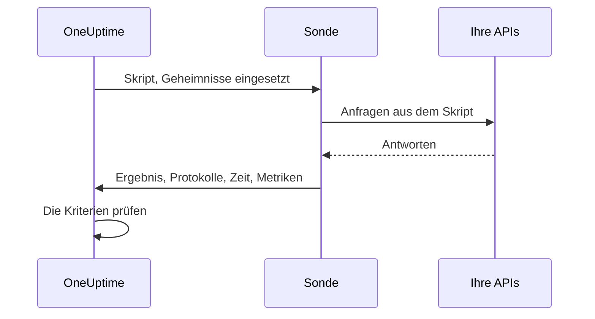

# Benutzerdefinierte Code-Überwachung

Ein Custom-Code-Monitor führt nach Zeitplan ein JavaScript-Skript, das Sie schreiben, auf einer Sonde aus. Verwenden Sie ihn für Prüfungen, die die anderen Monitortypen nicht ausdrücken können — eine Anmeldung mit anschließendem authentifiziertem API-Aufruf, eine Transaktion in mehreren Schritten oder einen Wert, den Sie aus mehreren Antworten berechnen. Wirft das Skript einen Fehler, schlägt die Prüfung fehl; was es zurückgibt, steht Ihren Kriterien und Ihren Vorfallvorlagen zur Verfügung.

:::cards
- [Den Monitor erstellen](#einen-custom-code-monitor-erstellen): Ein Skript schreiben und die Sonden wählen, die es ausführen.
- [Das Skript schreiben](#das-skript-schreiben): Eine lauffähige mehrstufige API-Prüfung als Ausgangspunkt.
- [Geheimnisse verwenden](#monitor-geheimnisse-verwenden): Passwörter und Tokens aus dem Skript heraushalten.
- [Eigene Metriken erfassen](#benutzerdefinierte-metriken): Jede Zahl, die Ihr Skript berechnet, als Diagramm darstellen.
:::

## So funktioniert es

Bei jeder Prüfung führt eine Sonde Ihr Skript in einer isolierten JavaScript-Sandbox aus, in die Ihre Monitor-Geheimnisse bereits eingesetzt sind. Das Skript ruft auf, was es braucht, und gibt dann ein Ergebnis zurück oder wirft einen Fehler. Die Sonde meldet das Ergebnis, die Protokollmeldungen des Skripts, seine Laufzeit und alle erfassten Metriken, und OneUptime prüft Ihre Kriterien daran.



Die Sandbox ist kein Node.js: Es gibt kein `require`, kein `process`, kein `fetch` und kein Dateisystem, nur die [unten aufgeführten Module](#im-skript-verfügbare-module).

## Bevor Sie beginnen

- Eine **Sonde**, die jeden Endpunkt erreicht, den das Skript aufruft. Verwenden Sie für Endpunkte in Ihrem Netzwerk eine [benutzerdefinierte Sonde](/docs/probe/custom-probe).
- Um eine private Adresse aufzurufen (etwa `10.0.0.5`), muss die Sonde das erlauben: Setzen Sie auf dieser Sonde `PROBE_ALLOW_PRIVATE_NETWORK_MONITORS=true`. Loopback-, Link-Local- und Cloud-Metadaten-Adressen werden immer abgelehnt. Siehe [Zugriff auf private Netzwerke](/docs/self-hosted/private-network-access).
- Jedes Passwort, jeder API-Schlüssel und jedes Token, das das Skript braucht, gespeichert als [Monitor-Geheimnis](/docs/monitor/monitor-secrets).

## Einen Custom-Code-Monitor erstellen

:::steps
### Einen neuen Monitor beginnen

Gehen Sie zu **Monitore** und klicken Sie auf **Monitor erstellen**. Klicken Sie unter **Monitortyp** auf **Weitere Monitortypen** und wählen Sie **Custom JavaScript Code** unter **Synthetic Monitoring**, oder tippen Sie `script` in das Suchfeld. Geben Sie einen **Name** ein und klicken Sie dann auf **Weiter**.

### Das Skript hinzufügen

Schreiben Sie Ihr Skript im Editor **JavaScript-Code**. Beginnen Sie mit dem [Beispiel unten](#das-skript-schreiben).

### Es testen

Klicken Sie auf **Monitor testen**, um das Skript einmal auf einer Sonde auszuführen, und prüfen Sie sein Ergebnis.

### Die Kriterien prüfen

Der Monitor beginnt mit zwei Kriterien: Er ist offline und eröffnet einen Vorfall, wenn das Skript fehlschlägt, und online, wenn nicht. Ändern Sie sie oder fügen Sie eigene hinzu — siehe [Kriterien](#kriterien) — und klicken Sie dann auf **Weiter**.

### Sonden wählen und erstellen

Wählen Sie die **Sonden**, die Ihre Endpunkte erreichen, und ein **Überwachungsintervall** — Custom-Code-Monitoren werden Intervalle ab 5 Minuten angeboten — und klicken Sie dann auf **Monitor erstellen**.
:::

## Das Skript schreiben

Das Skript ist der Rumpf einer `async`-Funktion: Sie können auf oberster Ebene `await` verwenden, mit `return` ein Ergebnis zurückgeben und mit `throw` die Prüfung fehlschlagen lassen. Dieses Beispiel meldet sich an, ruft mit dem erhaltenen Token einen Endpunkt auf und schlägt fehl, wenn die Antwort nicht dem Erwarteten entspricht:

```javascript title="Custom code monitor script"
// 1. Log in. axios rejects a 4xx or 5xx response, which fails the check.
const login = await axios.post("https://api.example.com/v1/login", {
  username: "monitoring@example.com",
  password: "{{monitorSecrets.ApiPassword}}",
});

// 2. Call an endpoint that needs the token.
const orders = await axios.get("https://api.example.com/v1/orders?limit=10", {
  headers: { Authorization: `Bearer ${login.data.token}` },
  timeout: 10000,
});

// 3. Fail the check when the data is wrong, not only when the request fails.
if (!Array.isArray(orders.data.items)) {
  throw new Error("The orders endpoint returned no items");
}

console.log(`Fetched ${orders.data.items.length} orders`);

// 4. Return what the criteria and incident templates should see.
return {
  data: orders.data.items.length,
};
```

| Ziel | Vorgehen | Was OneUptime festhält |
| --- | --- | --- |
| Ein Ergebnis melden | `return { data: ... }` mit einem beliebigen JSON-Wert | Das **Ergebnis**. Nur die Eigenschaft `data` wird behalten: `return 5` hält kein Ergebnis fest. |
| Die Prüfung fehlschlagen lassen | `throw new Error("...")` | Den **Skriptfehler**, den die Standardkriterien zu einem Vorfall machen. |
| Eine Spur hinterlassen | `console.log(...)` | Die **Protokollmeldungen**, bis zu 1.000 pro Lauf. |

Um einen Lauf anzusehen, öffnen Sie die **Übersicht** des Monitors: Die Karte **Monitor-Zusammenfassung** zeigt die Sonde, die Ausführungszeit und den Fehler, und **Weitere Details anzeigen** zeigt das Ergebnis, den Skriptfehler und die Protokollmeldungen. **Überwachungsprotokolle** enthält dieselbe Zusammenfassung für frühere Prüfungen.

> [!NOTE]
> `axios` folgt in dieser Sandbox keinen Weiterleitungen, und seine Anfragen laufen nicht über einen auf der Sonde konfigurierten Proxy. Fragen Sie die endgültige URL an.

## Monitor-Geheimnisse verwenden

Verweisen Sie an beliebiger Stelle im Skript mit `{{monitorSecrets.NAME}}` auf ein Geheimnis. OneUptime ersetzt den Verweis durch den Wert des Geheimnisses, als Klartext, bevor das Skript die Sonde erreicht. Setzen Sie ein Geheimnis also in Anführungszeichen, um es als Zeichenkette zu verwenden, und lassen Sie es ohne, um es als Zahl oder booleschen Wert zu verwenden:

```javascript
// Used as a string: wrap it in quotes.
const apiKey = "{{monitorSecrets.ApiKey}}";

// Used as a number or a boolean: leave it bare.
const retryLimit = {{monitorSecrets.RetryLimit}};
const verbose = {{monitorSecrets.Verbose}};

// Check the secret was filled in without logging the secret itself.
console.log(apiKey.length > 0);
```

Ein Geheimniswert, der ein Anführungszeichen enthält, zerbricht die Zeichenkette um ihn herum. Ein Verweis, den der Monitor nicht verwenden darf, bleibt so im Skript stehen, wie er geschrieben wurde. Wie Sie ein Geheimnis anlegen und festlegen, welche Monitore es verwenden dürfen, steht unter [Überwachungs-Geheimnisse](/docs/monitor/monitor-secrets).

## Benutzerdefinierte Metriken

Mit der Funktion `oneuptime.captureMetric()` erfassen Sie aus Ihrem Skript eigene Metriken. Diese Metriken werden in OneUptime gespeichert und lassen sich im Metrik-Explorer in Dashboards darstellen.

```javascript
oneuptime.captureMetric(name, value, attributes);
```

| Parameter | Typ | Beschreibung |
| --- | --- | --- |
| `name` | string, erforderlich | Der Name der Metrik (z. B. `"api.response.time"`). Er wird automatisch mit dem Präfix `custom.monitor.` gespeichert. |
| `value` | number, erforderlich | Der numerische Wert der Metrik. Ein Wert, der keine Zahl ist, wird ignoriert. |
| `attributes` | object, optional | Schlüssel-Wert-Paare für zusätzlichen Kontext. Zeichenketten, Zahlen und boolesche Werte werden festgehalten (Zahlen und boolesche Werte als Text, weil Metrikattribute Dimensionen sind und keine Messwerte). Werte jedes anderen Typs werden ignoriert. |

### Beispiel

```javascript
const response = await axios.get("https://api.example.com/health");

// Capture a simple metric
oneuptime.captureMetric("api.response.time", response.data.latency);

// Capture a metric with attributes
oneuptime.captureMetric("api.queue.depth", response.data.queueDepth, {
  region: "us-east-1",
  environment: "production",
});

return {
  data: response.data,
};
```

Einmal erfasst, erscheinen diese Metriken im Metrik-Explorer unter Namen wie `custom.monitor.api.response.time` und auf der Seite **Metriken** des Monitors unter **Benutzerdefinierte Metriken**. OneUptime ergänzt jeden Datenpunkt um den Monitor und die Sonde, sodass Sie die Metriken darstellen, darauf alarmieren und nach Monitor, Sonde oder jedem von Ihnen angegebenen Attribut filtern können.

### Grenzen

| Grenze | Wert | Darüber hinaus |
| --- | --- | --- |
| Metriken pro Skriptausführung | 100 | Weitere Aufrufe werden ignoriert. |
| Länge des Metriknamens | 200 Zeichen | Der Name wird gekürzt. |
| Attribute pro Metrik | 50 | Weitere Attribute werden verworfen. |
| Länge eines Attributschlüssels | 200 Zeichen | Der Schlüssel wird gekürzt. |
| Länge eines Attributwerts | 1000 Zeichen | Der Wert wird gekürzt. |

### Reservierte Attributschlüssel

Einige Attributnamen gehören OneUptime, und ein Skript kann sie nicht schreiben. Setzt Ihr Skript einen davon, wird das Attribut verworfen — die Metrik selbst wird trotzdem festgehalten — und eine Warnung mit dem Schlüssel wird in die Serverprotokolle von OneUptime geschrieben. Es sind:

- Die Identität des Monitors: `monitorId`, `projectId`, `monitorName`, `probeName`, `probeId`, `isCustomMetric`.
- Alles in den Namensräumen `oneuptime.` oder `resource.` — sie tragen die Kennungen, die OneUptime bei der Aufnahme setzt.
- Attribute zur Ressourcenidentität: `service.name`, `host.name`, `k8s.cluster.name`, `iot.fleet.name`, `proxmox.cluster.name`, `vmware.vcenter.name`, `ceph.cluster.name`, `storage.array.name` und `docker.swarm.cluster.name`.

Diese Namen sind nicht nur Beschriftungen — OneUptime liest sie als Angabe, zu welcher Ressource ein Datenpunkt gehört. Eine Metrik mit `service.name: payments-api` würde auf dem Tab Metriken dieses Dienstes erscheinen, und wenn Sie später einen Metrik-Monitor nach `service.name` gruppieren, würden seine Warnungen mit diesem Dienst verknüpft, die Verantwortlichen dieses Dienstes benachrichtigen und während eines Wartungsfensters für ihn verstummen. Um einen Monitor einem Dienst oder Host zuzuordnen, verwenden Sie stattdessen die eigenen Labels des Monitors.

## Kriterien

Die Kriterien eines Custom-Code-Monitors können prüfen:

| Filtertyp | Was er prüft | Filterbedingungen |
| --- | --- | --- |
| **Fehler** | Den Fehler, den das Skript geworfen hat, falls vorhanden. | Enthält, Not Contains, Equal To, Not Equal To, Is Empty, Is Not Empty |
| **Result Value** | Die `data`, die das Skript zurückgegeben hat. Als Zahl verglichen, wenn es eine ist. | Dieselben, dazu Greater Than, Less Than, Greater Than Or Equal To, Less Than Or Equal To, Wahr und Falsch |
| **Ausführungszeit (in ms)** | Wie lange das Skript lief. | Numerische Vergleiche |

Die Standardkriterien markieren den Monitor als online, wenn **Fehler** leer ist, und als offline — mit einem Vorfall, der sich selbst behebt, sobald das Skript wieder erfolgreich läuft — wenn nicht. In Vorfall- und Warnungsvorlagen steht der Lauf als `{{result}}`, `{{scriptError}}`, `{{logMessages}}` und `{{executionTimeInMs}}` zur Verfügung: siehe [Vorfall- & Warnmeldungsvorlagen](/docs/monitor/incident-alert-templating).

### Auf die zurückgegebenen Daten alarmieren

Was das Skript als `data` zurückgibt, ist der **Result Value** des Monitors, und ein Kriterium kann ihn vergleichen — zum Beispiel _Result Value ist Equal To `UP`_.

Ist `data` ein Objekt oder ein Array, füllen Sie im Result-Value-Filter **Feldpfad (optional)** aus, um ein Feld daraus statt des ganzen Werts zu vergleichen. Verwenden Sie Punkte für verschachtelte Felder und `[n]` für Array-Elemente:

```javascript
const response = await axios.get("https://api.example.com/health");

return {
  data: {
    status: response.data.status, // "UP"
    cpu_busy_percent: response.data.cpu, // 42
    healthy: response.data.healthy, // true
    checks: response.data.checks, // [{ name: "db", latency: 12 }]
  },
};
```

| Feldpfad | Vergleicht | Beispielbedingung |
| --- | --- | --- |
| `status` | `"UP"` | Not Equal To `UP` |
| `cpu_busy_percent` | `42` | Greater Than `90` |
| `healthy` | `true` | Falsch |
| `checks[0].latency` | `12` | Greater Than `500` |

Fügen Sie pro Feld, das Sie prüfen möchten, einen Filter hinzu; jeder kann eine eigene Bedingung und einen eigenen Wert haben.

- Lassen Sie den Feldpfad leer, um den ganzen Wert zu vergleichen, wie bei einem Skript, das eine einzelne Zahl oder Zeichenkette zurückgibt.
- Greater Than, Less Than und die anderen Zahlenbedingungen treffen nur auf eine Zahl zu, geben Sie ein Feld also als `42` zurück, nicht als `"42"`. Wahr und Falsch treffen nur auf einen booleschen Wert zu.
- Ein Feld, das in den zurückgegebenen Daten fehlt — ein fehlender Schlüssel oder ein Array-Index hinter dem Ende — gilt als leer: **Is Empty** trifft darauf zu, keine andere Bedingung.
- Ein Feld, dessen Name einen Punkt enthält, lässt sich mit einem Pfad nicht ansprechen.
- In Terraform legt `custom_code_monitor_options` des Filters den Feldpfad fest: siehe [Monitor-Schritte](/docs/terraform/monitor-steps#comparing-one-field-of-a-scripts-result).

## Im Skript verfügbare Module

| Name | Was es ist |
| --- | --- |
| `axios` | Ein Promise-basierter HTTP-Client: Rufen Sie `axios(...)` auf, oder `axios.get`, `post`, `put`, `patch`, `delete`, `head`, `options`, `request` und `create`. Anfrage- und Antwortgröße sind begrenzt (je 10 MB), Weiterleitungen werden nicht verfolgt, und der Proxy einer Sonde wird nicht verwendet. |
| `crypto` | `createHash` und `createHmac` (`update()` einmal aufrufen, dann `digest()`), `randomBytes`, `randomInt` und `randomUUID`. Es ist nicht das `crypto`-Modul von Node.js: Es gibt keine Chiffren und keine Signaturen. |
| `http`, `https` | Nur ihre Klasse `Agent`, um sie an `axios` zu übergeben — zum Beispiel `httpsAgent: new https.Agent({ rejectUnauthorized: false })`. Es gibt kein `request` und kein `get`. |
| `console.log` | Protokolliert Daten zur Fehlersuche. Es gibt nur `console.log`; `console.error` und die anderen gibt es nicht. |
| `oneuptime.captureMetric` | Erfasst eine benutzerdefinierte Metrik. Siehe [Benutzerdefinierte Metriken](#benutzerdefinierte-metriken). |
| `setTimeout`, `clearTimeout`, `sleep(ms)` | Im Skript warten. Eine Verzögerung läuft nie über das Zeitlimit des Skripts hinaus. |

## Zu beachten

- **Zeitlimit.** Ein Skript, das länger als 60 Sekunden läuft, wird gestoppt, und die Prüfung schlägt mit "Script execution timed out" fehl. Auf einer selbst gehosteten Sonde ändert `PROBE_CUSTOM_CODE_MONITOR_SCRIPT_TIMEOUT_IN_MS` die Grenze.
- **Speicher.** Jeder Lauf erhält eine eigene Sandbox mit einem Speicherlimit von 128 MB.
- **Weiterleitungen.** `axios` folgt ihnen nicht, eine URL mit Weiterleitung lässt die Anfrage also fehlschlagen. Verwenden Sie die endgültige URL.

## Fehlerbehebung

:::details Die Prüfung schlägt mit "Script execution timed out" fehl
Das Skript lief länger als das Zeitlimit. Geben Sie jeder Anfrage ein eigenes `timeout` (in Millisekunden), damit ein langsamer Endpunkt schnell fehlschlägt, mit einem Fehler, der ihn nennt.
:::

:::details Eine Anfrage schlägt mit dem Status 301 oder 302 fehl
`axios` folgt hier keinen Weiterleitungen. Ändern Sie die URL auf die Adresse, zu der weitergeleitet wird.
:::

:::details Eine Anfrage an eine interne Adresse wird abgelehnt
Die Sonde erlaubt keine Adressen aus privaten Netzwerken. Setzen Sie `PROBE_ALLOW_PRIVATE_NETWORK_MONITORS=true` auf einer Sonde in Ihrem Netzwerk und führen Sie den Monitor von ihr aus — siehe [Zugriff auf private Netzwerke](/docs/self-hosted/private-network-access).
:::

:::details Ein Geheimnis wird nicht eingesetzt
Der Monitor darf das Geheimnis nicht verwenden, oder der Name im Verweis stimmt nicht genau mit dem Namen des Geheimnisses überein. Siehe [Überwachungs-Geheimnisse](/docs/monitor/monitor-secrets).
:::

## Nächste Schritte

:::cards
- [Synthetische Überwachung](/docs/monitor/synthetic-monitor): Einen echten Browser steuern, statt APIs aufzurufen.
- [Überwachungs-Geheimnisse](/docs/monitor/monitor-secrets): Die Zugangsdaten speichern, die Ihr Skript verwendet.
- [Vorfall- & Warnmeldungsvorlagen](/docs/monitor/incident-alert-templating): Das Ergebnis und die Protokolle des Skripts in Vorfälle übernehmen.
:::
