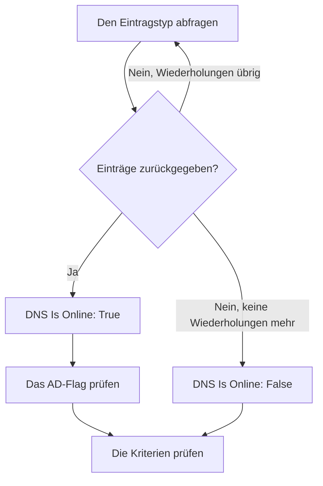

# DNS-Überwachung

Ein DNS-Monitor fragt regelmäßig einen DNS-Eintrag ab und prüft die Antwort: ob der Name aufgelöst wird, wie schnell und was in den Einträgen steht. Verwenden Sie ihn, um einen DNS-Ausfall, einen geänderten oder verschwundenen Eintrag oder einen langsamen Resolver zu bemerken, bevor Ihre Nutzer es tun.

:::cards
- [Den Monitor erstellen](#einen-dns-monitor-erstellen): Sechs Schritte im Dashboard.
- [Konfigurationsoptionen](#konfigurationsoptionen): Der Name, der Eintragstyp und der DNS-Server.
- [Überwachungskriterien](#überwachungskriterien): Auflösung, Einträge, Antwortzeit und DNSSEC.
- [Fehlerbehebung](#fehlerbehebung): Wenn der Monitor und `dig` sich widersprechen.
:::

## So funktioniert es

Bei jeder Prüfung fragt eine Sonde einen DNS-Server nach einem Eintragstyp eines Namens, etwa nach den `A`-Einträgen von `example.com`. Der Name ist online, wenn der Server mit mindestens einem Eintrag dieses Typs antwortet. Eine Abfrage, die fehlschlägt, in ein Zeitlimit läuft oder keinen Eintrag liefert, wird eine Sekunde später wiederholt, bis zur Zahl der Wiederholungen, die Sie festlegen. Danach fragt die Sonde einen validierenden Resolver, ob die Antwort das Authenticated-Data-Flag (AD) von DNSSEC trägt, und OneUptime prüft das Ergebnis anhand der Kriterien des Monitors.



Eine Sonde, die ihre eigene Netzwerkverbindung verloren hat, meldet kein Ergebnis und kann Ihr DNS daher nicht als offline markieren.

## Bevor Sie beginnen

- **Eine Rolle, die Monitore erstellen darf**: Project Owner, Project Admin, Project Member, Monitor Admin oder Monitor Member oder eine benutzerdefinierte Rolle mit der Berechtigung Create Monitor.
- **Eine Sonde, die den DNS-Server erreicht.** Die Standardsonden Ihres Projekts werden für jeden neuen Monitor ausgewählt. Um einen DNS-Server in einem privaten Netzwerk abzufragen, etwa einen internen Resolver, verwenden Sie eine [benutzerdefinierte Sonde](/docs/probe/custom-probe) in diesem Netzwerk.

## Einen DNS-Monitor erstellen

:::steps
### Einen neuen Monitor beginnen

Gehen Sie zu **Monitore** und klicken Sie auf **Monitor erstellen**. Klicken Sie unter **Monitortyp** auf **Weitere Monitortypen** und wählen Sie **DNS** unter **DNS Monitoring**.

### Ihn benennen

Geben Sie einen **Name** ein, etwa `example.com A records`, und klicken Sie dann auf **Weiter**.

### Die Abfrage eingeben

Geben Sie den abzufragenden **Domänenname** ein, etwa `example.com`, und wählen Sie seinen **Eintragstyp**. Um einen bestimmten Server zu fragen, tragen Sie ihn unter **DNS-Server (Optional)** ein; lassen Sie das Feld leer, um den eigenen Resolver der Sonde zu verwenden.

### Ihn testen

Klicken Sie auf **Monitor testen**, wählen Sie unter **Sonde auswählen** eine Sonde und klicken Sie auf **Test ausführen**. **Überwachungs-Testergebnis** zeigt die Einträge, die die Sonde zurückbekommen hat.

### Die Kriterien prüfen

**Monitor-Kriterien** beginnt mit den [Standardkriterien](#standardkriterien): offline, wenn der Name nicht aufgelöst wird, online, wenn er aufgelöst wird. Um zu prüfen, was in den Einträgen steht, fügen Sie einen Filter **DNS Record Value** hinzu und klicken Sie dann auf **Weiter**.

### Sonden wählen und erstellen

Behalten oder ändern Sie die **Sonden** und das **Überwachungsintervall** (es beginnt bei **Alle 5 Minuten**) und klicken Sie dann auf **Monitor erstellen**. Die Seite des Monitors öffnet sich.
:::

## Konfigurationsoptionen

| Feld | Standard | Was eingetragen wird |
| --- | --- | --- |
| **Domänenname** | Keiner | Der abzufragende Name, etwa `example.com` oder `_sip._tcp.example.com`. Für einen `PTR`-Eintrag der Reverse-Name, etwa `34.216.184.93.in-addr.arpa`. |
| **Eintragstyp** | `A` | Der abzufragende Eintragstyp. Siehe [Eintragstypen](#eintragstypen). |
| **DNS-Server (Optional)** | Der Resolver der Sonde | Ein DNS-Server, der stattdessen gefragt wird, etwa `8.8.8.8` oder `ns1.example.com`. Jeder Eintragstyp, `CAA` eingeschlossen, wird bei ihm abgefragt. |
| **Port** (unter **Weitere Felder**) | `53` | Der Port des Servers unter **DNS-Server (Optional)**. Die DNSSEC-Prüfung fragt denselben Port. |
| **Zeitüberschreitung (ms)** (unter **Weitere Felder**) | `5000` | Wie lange auf eine Antwort gewartet wird, in Millisekunden. |
| **Wiederholungen** (unter **Weitere Felder**) | `3` | Wiederholungen, nachdem der erste Versuch fehlgeschlagen ist. `0` bedeutet einen einzigen Versuch. |

### Eintragstypen

Ein Kriterium mit **DNS Record Value** vergleicht Ihren Text mit jedem Eintrag so, wie die Sonde ihn schreibt. Halten Sie sich daher an dieses Format:

| Eintragstyp | Was er enthält | Format des Werts, für Kriterien |
| --- | --- | --- |
| `A` | IPv4-Adressen | `93.184.216.34` |
| `AAAA` | IPv6-Adressen | `2606:2800:220:1:248:1893:25c8:1946` |
| `CNAME` | Den Namen, für den dieser ein Alias ist | `example.net` |
| `MX` | Mailserver | `10 mail.example.com` (Priorität, dann der Server) |
| `NS` | Nameserver | `ns1.example.com` |
| `TXT` | Text, etwa SPF- und Verifizierungseinträge | `v=spf1 include:_spf.example.com ~all` |
| `SOA` | Den Start of Authority der Zone | `ns1.example.com hostmaster.example.com 2024010101 7200 3600 1209600 3600` (Server, Kontakt, Seriennummer, Refresh, Retry, Expire, minimale TTL) |
| `PTR` | Den Namen, auf den eine Adresse zurückverweist (Reverse-DNS) | `server1.example.com` |
| `SRV` | Dienste | `10 5 5060 sip.example.com` (Priorität, Gewichtung, Port, Ziel) |
| `CAA` | Die Zertifizierungsstellen, die für den Namen ausstellen dürfen | `0 letsencrypt.org` (Flag, dann die Stelle) |

Ein `TXT`-Eintrag, der in mehrere Zeichenketten aufgeteilt ist, wird zu einem Wert zusammengefügt.

## Überwachungskriterien

Kriterien entscheiden, wann der Name als online, beeinträchtigt oder offline gilt und ob dabei ein Vorfall gemeldet oder eine Warnung erstellt wird. Jedes Kriterium prüft einen oder mehrere Filter:

| Filter | Bedingungen | Was er prüft |
| --- | --- | --- |
| **DNS Is Online** | **Wahr**, **Falsch** | Ob die Abfrage mindestens einen Eintrag des Typs geliefert hat. |
| **DNS Response Time (in ms)** | **Greater Than**, **Less Than**, **Greater Than Or Equal To**, **Less Than Or Equal To** | Wie lange die Abfrage gedauert hat. |
| **DNS Record Exists** | **Wahr**, **Falsch** | Ob ein Eintrag des Typs zurückgekommen ist. |
| **DNS Record Value** | **Enthält**, **Not Contains**, **Starts With**, **Ends With**, **Equal To**, **Not Equal To** | Die Werte der Einträge. Der Filter trifft zu, wenn ein einzelner Eintrag zutrifft. |
| **DNSSEC Is Valid** | **Wahr**, **Falsch** | Ob ein validierender Resolver das AD-Flag in der Antwort setzt. |

**DNS Record Value** trifft zu, wenn _irgendeiner_ der Einträge zutrifft. Bei mehreren `A`-Einträgen trifft **Equal To** `93.184.216.34` zu, wenn einer davon diese Adresse ist, und **Not Equal To** trifft zu, wenn einer davon es nicht ist.

**DNSSEC Is Valid** fragt den Server unter **DNS-Server (Optional)** auf seinem **Port** oder, wenn das Feld leer ist, Google Public DNS (`8.8.8.8`). Der Server, den Sie eintragen, sollte DNSSEC also validieren. Der Filter hat keinen Wert und trifft in keine Richtung zu, wenn die Sonde diese Prüfung nicht ausführen kann. Für eine vollständige Prüfung einer signierten Zone verwenden Sie einen [DNSSEC-Monitor](/docs/monitor/dnssec-monitor).

Bei zwei oder mehr Filtern entscheidet **Abgleichsbedingung**, ob **Alle** zutreffen müssen oder **Beliebig** einer genügt. Die **Aktionen** eines Kriteriums legen fest, was es tut: den Monitorstatus ändern, eine Warnung erstellen, einen Vorfall melden oder mehreres davon.

### Standardkriterien

Ein neuer DNS-Monitor beginnt mit zwei Kriterien:

- **Offline** — der Name wird nach allen Wiederholungen nicht aufgelöst oder hat keinen Eintrag des Typs. Der Monitor wird als **Offline** markiert und ein Vorfall namens „_monitor name_ is offline“ wird erstellt. Der Vorfall löst sich von selbst auf, wenn der Name wieder aufgelöst wird.
- **Online** — der Name wird aufgelöst. Der Monitor wird als **Betriebsbereit** markiert.

Kriterien werden von oben nach unten geprüft, und das erste zutreffende entscheidet, was passiert. Trifft keines zu, zeigt der Monitor seinen Standardstatus: **Betriebsbereit**, sofern Sie unter **Weitere Felder** unterhalb der Kriterien keinen anderen wählen.

### Über einen Zeitraum auswerten

**Diese Kriterien über einen Zeitraum hinweg auswerten** ist ein Kontrollkästchen unter einem Filter, angeboten für **DNS Is Online** und **DNS Response Time (in ms)**. Schalten Sie es ein, um ein Fenster vergangener Prüfungen statt nur der letzten zu beurteilen: Wählen Sie unter **Auswerten** eine Aggregation und unter **Für die letzten (in Minuten)** ein Fenster von 2 bis 60 Minuten.

| Aggregation | Trifft zu, wenn |
| --- | --- |
| **Durchschnitt**, **Summe**, **Maximum Value**, **Minimum Value** | Dieser Wert über das Fenster die Bedingung erfüllt. Nur für **DNS Response Time (in ms)**. |
| **All Values** | Jede Prüfung im Fenster die Bedingung erfüllt. |
| **Any Value** | Mindestens eine Prüfung im Fenster die Bedingung erfüllt. |

**All Values** trifft erst zu, wenn das Fenster wirklich mit Daten gefüllt ist. Ein gerade erstellter Monitor oder einer, dessen Prüfungen nicht mehr aufgezeichnet wurden, hat nicht genug Verlauf, um etwas über die letzten N Minuten zu sagen, daher wartet das Kriterium, statt auf dem einen vorhandenen Messwert anzuschlagen. **Any Value** ist die Einstellung für „sag mir sofort, wenn eine einzige Prüfung den Grenzwert verletzt“ und schlägt weiterhin sofort an.

**Bei keinen Daten** entscheidet, was passiert, solange das Fenster das Kriterium nicht stützen kann:

| Option | Was passiert | Wofür |
| --- | --- | --- |
| **Ignore** (Standard) | Das Kriterium trifft nicht zu. | Gewöhnliche Schwellenwert-Warnungen. |
| **Auslöser** | Die fehlenden Daten zählen als das Problem. | Prüfungen, bei denen Stille selbst ein Fehler ist. |
| **Treat As Zero** | Das Fenster wird als einzelne Null verglichen. | Zähler, bei denen keine Ereignisse wirklich null bedeutet. |

### Beispielkriterien

| Ziel | Filter | Bedingung | Wert |
| --- | --- | --- | --- |
| Offline, wenn der Name nicht mehr aufgelöst wird | **DNS Is Online** | **Falsch** | — |
| Warnen, wenn sich der einzige `A`-Eintrag eines Namens ändert | **DNS Record Value** | **Not Equal To** | `93.184.216.34` |
| Warnen, wenn ein `MX`-Eintrag aus Ihrer Domain hinauszeigt | **DNS Record Value** | **Not Contains** | `example.com` |
| DNS als beeinträchtigt markieren, wenn es langsam ist | **DNS Response Time (in ms)** | **Greater Than** | `500` |
| Warnen, wenn die DNSSEC-Validierung fehlschlägt | **DNSSEC Is Valid** | **Falsch** | — |

## Fehlerbehebung

:::details Der Monitor meldet offline, aber bei mir wird der Name aufgelöst
Die Sonde hat einen anderen Server oder nach einem anderen Eintragstyp gefragt. Prüfen Sie den **Eintragstyp**: Ein Name, der nur einen `CNAME` oder nur `AAAA`-Einträge hat, hat keinen `A`-Eintrag. Vergleichen Sie mit `dig` gegen denselben Server:

```bash
dig @8.8.8.8 example.com A
```
:::

:::details Ein Kriterium mit Not Equal To schlägt an, obwohl die richtige Adresse da ist
**DNS Record Value** trifft zu, wenn ein einzelner Eintrag zutrifft. Bei mehreren Einträgen schlägt **Not Equal To** an, sobald einer davon abweicht. Um zu prüfen, dass ein bestimmter Wert unter den Einträgen ist, nutzen Sie die Reihenfolge der Kriterien, denn das erste zutreffende gewinnt:

1. Lassen Sie das Standard-Offline-Kriterium oben: **DNS Is Online** / **Falsch**.
2. Fügen Sie darunter ein Kriterium mit **DNS Record Value** / **Equal To** / dem erwarteten Wert hinzu, das den Monitor als **Betriebsbereit** markiert.
3. Fügen Sie darunter ein Kriterium mit **DNS Is Online** / **Wahr** hinzu, das den Monitor als **Offline** markiert und einen Vorfall meldet. Es trifft nur auf Antworten zu, die den Wert nicht enthalten.
:::

:::details DNSSEC Is Valid trifft nie zu
Der Server unter **DNS-Server (Optional)** validiert DNSSEC nicht und setzt deshalb nie das AD-Flag, oder die Sonde konnte die Prüfung nicht ausführen. Lassen Sie das Feld leer, um mit `8.8.8.8` zu validieren, oder verwenden Sie einen [DNSSEC-Monitor](/docs/monitor/dnssec-monitor).
:::

## Nächste Schritte

:::cards
- [DNSSEC-Überwachung](/docs/monitor/dnssec-monitor): Die Vertrauenskette einer signierten Zone validieren.
- [Domain-Überwachung](/docs/monitor/domain-monitor): Die Registrierung und den Ablauf der Domain beobachten.
- [Benutzerdefinierte Probes](/docs/probe/custom-probe): Interne DNS-Server aus Ihrem eigenen Netzwerk abfragen.
- [Vorfälle – Übersicht](/docs/incidents/index): Was passiert, nachdem der Monitor einen gemeldet hat.
:::
