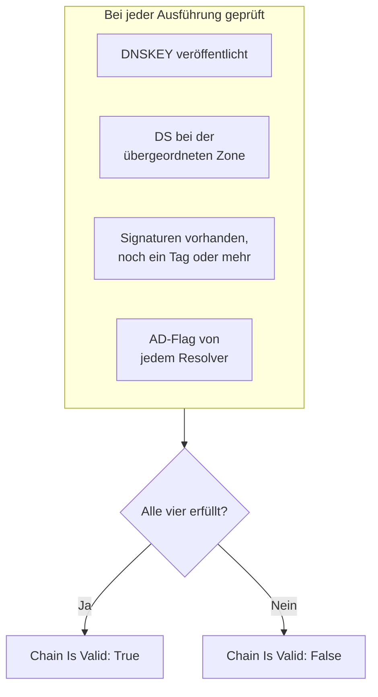

# DNSSEC-Überwachung

Ein DNSSEC-Monitor prüft, ob eine signierte DNS-Zone noch validiert: ob sie ihre Schlüssel veröffentlicht, ob ihre übergeordnete Zone für sie bürgt, ob ihre Signaturen nicht abgelaufen sind und ob validierende Resolver sie akzeptieren. Verwenden Sie ihn, um eine unterbrochene Vertrauenskette zu bemerken, bevor Resolver für Ihre Domain mit `SERVFAIL` antworten.

:::cards
- [Den Monitor erstellen](#einen-dnssec-monitor-erstellen): Sechs Schritte im Dashboard.
- [Was geprüft wird](#so-funktioniert-es): Die Prüfungen hinter einer gültigen Kette.
- [Überwachungskriterien](#überwachungskriterien): Gültigkeit der Kette, Schlüssel, DS-Einträge, Signaturen, Resolver und Nameserver.
- [Bewährte Vorgehensweisen](#bewährte-vorgehensweisen): Schwellenwerte und Resolver, die funktionieren.
:::

## So funktioniert es

Bei jeder Prüfung führt eine Sonde eine Reihe von DNS-Abfragen gegen die Zone aus:

| Abfrage | Gefragt wird | Was sie verrät |
| --- | --- | --- |
| `DNSKEY` | Der erste Resolver unter **Resolver** | Ob die Zone ihre Signaturschlüssel veröffentlicht. |
| `DS` | Der erste Resolver unter **Resolver** | Ob die übergeordnete Zone einen Delegation-Signer-Eintrag für die Zone veröffentlicht. |
| `SOA`, mit DNSSEC-Einträgen | Der erste Resolver unter **Resolver** | Ob die Einträge der Zone signiert sind (die `RRSIG`, die ihren `SOA`-Eintrag signiert) und wann die früheste Signatur abläuft. |
| `A`, mit DNSSEC-Validierung | Jeder Resolver unter **Resolver** | Ob jeder validierende Resolver die Zone akzeptiert, was er mit dem Authenticated-Data-Flag (AD) anzeigt. |
| `NS`, dann `SOA` | Der erste Resolver, dann jeder autoritative Nameserver, den er nennt | Ob jeder Nameserver dieselbe SOA-Seriennummer ausliefert. Nur wenn **Konsistenz der Nameserver prüfen** eingeschaltet ist. |

Validierende Resolver prüfen die Vertrauenskette von der Wurzel abwärts, daher sagt Ihnen das AD-Flag, dass die ganze Kette hält. Die Kette gilt als gültig, wenn all dies zutrifft:

Eine Signatur mit weniger als einem Tag Restlaufzeit gilt bereits als unterbrochen, sodass Sie bis zu einen Tag früher davon erfahren, als Resolver die Zone ablehnen. Eine Prüfung, die die Kette unterbrochen oder die Nameserver uneinig findet, wird eine Sekunde später wiederholt, bis zur Zahl der Wiederholungen, die Sie festlegen, bevor OneUptime das Ergebnis anhand der Kriterien des Monitors prüft. Alle Abfragen eines Versuchs teilen sich eine Frist vom Dreifachen der **Zeitüberschreitung (ms)**; ein Versuch, dem die Zeit ausgeht, meldet eine Zeitüberschreitung, kein Urteil über die Zone.

## Bevor Sie beginnen

- **Eine Rolle, die Monitore erstellen darf**: Project Owner, Project Admin, Project Member, Monitor Admin oder Monitor Member oder eine benutzerdefinierte Rolle mit der Berechtigung Create Monitor.
- **Eine signierte Zone.** Die Zone muss signiert sein und ihr DS-Eintrag über Ihren Registrar bei der übergeordneten Zone veröffentlicht.
- **Ausgehendes DNS von der Sonde** zu den Resolvern, die Sie angeben, und für die Prüfung der Nameserver-Konsistenz zu den autoritativen Nameservern der Zone. Die Standardsonden Ihres Projekts werden für jeden neuen Monitor ausgewählt.

## Einen DNSSEC-Monitor erstellen

:::steps
### Einen neuen Monitor beginnen

Gehen Sie zu **Monitore** und klicken Sie auf **Monitor erstellen**. Klicken Sie unter **Monitortyp** auf **Weitere Monitortypen** und wählen Sie **DNSSEC** unter **DNS Monitoring**.

### Ihn benennen

Geben Sie einen **Name** ein, etwa `example.com DNSSEC`, und klicken Sie dann auf **Weiter**.

### Die Zone eingeben

Geben Sie unter **Zone (Domänenname)** die zu validierende Zone ein, etwa `example.com`. Behalten Sie die Standard-**Resolver** oder geben Sie eigene an, durch Kommas getrennt. Lassen Sie **Konsistenz der Nameserver prüfen** eingeschaltet, sofern Ihr Netzwerk DNS zu beliebigen Servern nicht blockiert.

### Ihn testen

Klicken Sie auf **Monitor testen**, wählen Sie unter **Sonde auswählen** eine Sonde und klicken Sie auf **Test ausführen**. **Überwachungs-Testergebnis** zeigt, was jede Prüfung gefunden hat.

### Die Kriterien prüfen

**Monitor-Kriterien** beginnt mit den [Standardkriterien](#standardkriterien): offline, wenn die Kette unterbrochen ist, online, wenn sie gültig ist. Um vor dem Ablauf von Signaturen gewarnt zu werden, fügen Sie ein Kriterium hinzu (siehe [Bewährte Vorgehensweisen](#bewährte-vorgehensweisen)) und klicken Sie dann auf **Weiter**.

### Sonden wählen und erstellen

Behalten oder ändern Sie die **Sonden** und das **Überwachungsintervall** (es beginnt bei **Alle 5 Minuten**) und klicken Sie dann auf **Monitor erstellen**. Die Seite des Monitors öffnet sich.
:::

## Konfigurationsoptionen

| Feld | Standard | Was eingetragen wird |
| --- | --- | --- |
| **Zone (Domänenname)** | Keiner | Die zu validierende Zone, etwa `example.com`. |
| **Resolver** | `1.1.1.1, 8.8.8.8, 9.9.9.9` | Validierende Resolver, die abgefragt werden, durch Kommas getrennt. Jeder muss das AD-Flag liefern, damit die Kette als gültig gilt. |
| **Konsistenz der Nameserver prüfen** | Ein | Jeden autoritativen Nameserver direkt abfragen und ihre SOA-Seriennummern vergleichen. Schalten Sie es aus, wenn Ihr Netzwerk ausgehendes DNS zu beliebigen Servern blockiert. |
| **Warnung zum Signaturablauf (Tage)** (unter **Weitere Felder**) | `7` | Wird mit dem Monitor gespeichert. Der Filter **DNSSEC Signature Expires In Days** verwendet den Wert, den Sie ihm im Kriterium geben, also legen Sie Ihren Schwellenwert dort fest. |
| **Zeitüberschreitung (ms)** (unter **Weitere Felder**) | `10000` | Wie lange auf jede DNS-Abfrage gewartet wird, in Millisekunden. Ein Versuch kann insgesamt bis zum Dreifachen davon dauern. |
| **Wiederholungen** (unter **Weitere Felder**) | `3` | Wiederholungen, nachdem der erste Versuch fehlgeschlagen ist. `0` bedeutet einen einzigen Versuch. |

## Überwachungskriterien

Kriterien entscheiden, wann die Zone als online, beeinträchtigt oder offline gilt und ob dabei ein Vorfall gemeldet oder eine Warnung erstellt wird. Jedes Kriterium prüft einen oder mehrere Filter:

| Filter | Bedingungen | Was er prüft |
| --- | --- | --- |
| **DNSSEC Chain Is Valid** | **Wahr**, **Falsch** | Alle vier Prüfungen oben treffen zu: Schlüssel veröffentlicht, DS bei der übergeordneten Zone, Signaturen vorhanden mit einem Tag oder mehr Restlaufzeit und das AD-Flag von jedem Resolver. |
| **DNSSEC DNSKEY Record Exists** | **Wahr**, **Falsch** | Die Zone veröffentlicht mindestens einen DNSKEY-Eintrag. |
| **DNSSEC DS Record Exists At Parent** | **Wahr**, **Falsch** | Die übergeordnete Zone veröffentlicht einen DS-Eintrag für die Zone. |
| **DNSSEC Signature Expires In Days** | **Greater Than**, **Less Than**, **Greater Than Or Equal To**, **Less Than Or Equal To** | Ganze Tage, bis die früheste Signatur (RRSIG) abläuft. |
| **DNSSEC Resolver Consensus (AD Flag)** | **Wahr**, **Falsch** | Jeder Resolver unter **Resolver** liefert das AD-Flag. |
| **DNSSEC Nameservers Are Consistent** | **Wahr**, **Falsch** | Jeder autoritative Nameserver antwortet mit derselben SOA-Seriennummer. Immer **Wahr**, solange **Konsistenz der Nameserver prüfen** ausgeschaltet ist. |

Bei zwei oder mehr Filtern entscheidet **Abgleichsbedingung**, ob **Alle** zutreffen müssen oder **Beliebig** einer genügt. Die **Aktionen** eines Kriteriums legen fest, was es tut: den Monitorstatus ändern, eine Warnung erstellen, einen Vorfall melden oder mehreres davon.

### Standardkriterien

Ein neuer DNSSEC-Monitor beginnt mit zwei Kriterien:

- **Kette unterbrochen** — **DNSSEC Chain Is Valid** ist **Falsch**. Der Monitor wird als **Offline** markiert und ein Vorfall namens „_monitor name_ DNSSEC chain is broken“ wird erstellt. Der Vorfall löst sich von selbst auf, sobald die Kette wieder gültig ist.
- **Kette gültig** — der Monitor wird als **Betriebsbereit** markiert.

Kriterien werden von oben nach unten geprüft, und das erste zutreffende entscheidet, was passiert. Trifft keines zu, zeigt der Monitor seinen Standardstatus: **Betriebsbereit**, sofern Sie unter **Weitere Felder** unterhalb der Kriterien keinen anderen wählen.

Die Standardkriterien beobachten den Ablauf der Signaturen und die Konsistenz der Nameserver nicht von selbst. Fügen Sie dafür Kriterien hinzu, wie unten.

### Beispielkriterien

| Ziel | Filter | Bedingung | Wert |
| --- | --- | --- | --- |
| Offline, wenn die Kette unterbrochen ist (ein Standardkriterium) | **DNSSEC Chain Is Valid** | **Falsch** | — |
| Vor dem Ablauf von Signaturen warnen | **DNSSEC Signature Expires In Days** | **Less Than** | `7` |
| Eine Delegierung bemerken, die ihren DS-Eintrag verloren hat | **DNSSEC DS Record Exists At Parent** | **Falsch** | — |
| Resolver bemerken, die sich widersprechen | **DNSSEC Resolver Consensus (AD Flag)** | **Falsch** | — |
| Nameserver bemerken, die nicht übereinstimmen | **DNSSEC Nameservers Are Consistent** | **Falsch** | — |

## Bewährte Vorgehensweisen

1. **Wählen Sie Resolver, die immer erreichbar sind.** Jeder Resolver muss das AD-Flag liefern, damit die Kette als gültig gilt, daher lässt ein Resolver, den die Sonde nicht erreicht, die Prüfung scheitern, sobald die Wiederholungen aufgebraucht sind. Die Standardwerte `1.1.1.1`, `8.8.8.8` und `9.9.9.9` werden von drei verschiedenen Betreibern betrieben, was auch eine Zone auffängt, die auf einem Resolver validiert, auf einem anderen aber nicht.
2. **Warnen Sie vor dem Ablauf von Signaturen.** Signierer signieren eine Zone neu, bevor ihre Signaturen ablaufen, daher bedeutet eine Signatur kurz vor dem Ablauf, dass das Neusignieren aufgehört hat. Fügen Sie ein Kriterium mit **DNSSEC Signature Expires In Days** / **Less Than** / `7` hinzu, das eine Warnung erstellt, und ein zweites bei `2`, das einen Vorfall meldet. Ziehen Sie beide über das Kriterium, das die Kette als gültig markiert, das `2`-Tage-Kriterium zuerst, denn das erste zutreffende Kriterium gewinnt. Wählen Sie Schwellenwerte unterhalb der Zeit, die Ihr Signierer einer Signatur normalerweise lässt, bevor er neu signiert, damit sie ruhig bleiben, solange das Neusignieren funktioniert.
3. **Überwachen Sie jede signierte Zone.** Schließen Sie die Apex-Domain, signierte Subdomains und jede an einen anderen Betreiber delegierte Zone ein.
4. **Lassen Sie die Prüfung der Nameserver-Konsistenz eingeschaltet,** und fügen Sie ein Kriterium dafür hinzu. Sie bemerkt einen Sekundärserver, der keine Zonentransfers vom Primärserver mehr erhält, was die DNSSEC-Validierung allein übersehen kann.

## Fehlerbehebung

:::details Die Kette wird als unterbrochen gemeldet, aber die Zone validiert mit `dig`
Einer der Resolver unter **Resolver** hat das AD-Flag nicht geliefert: Er war von der Sonde aus nicht erreichbar, oder er validiert DNSSEC nicht. Die Tabelle **Resolver-Prüfungen** im **Überwachungs-Testergebnis** und in der Zusammenfassung jeder Prüfung zeigt die Antwort und den Fehler jedes Resolvers. Entfernen Sie Resolver, die die Sonde nicht erreicht, und geben Sie nur validierende an.
:::

:::details Nameserver werden direkt nach einer Änderung als uneinig gemeldet
Sekundärserver können dem Primärserver nach einer Zonenänderung eine Weile hinterherhinken. Die Tabelle **Nameserver-Konsistenz** in der Zusammenfassung der Prüfung zeigt die SOA-Seriennummer jedes Nameservers. Bleibt einer zurück, hat dieser Sekundärserver aufgehört, Transfers zu erhalten. Zeigt jeder Nameserver einen Fehler, wird die Sonde möglicherweise daran gehindert, sie direkt abzufragen: Schalten Sie **Konsistenz der Nameserver prüfen** aus.
:::

:::details Die Prüfung meldet eine Zeitüberschreitung
Alle Abfragen eines Versuchs teilen sich das Dreifache der **Zeitüberschreitung (ms)**. Ein langsamer oder unerreichbarer Resolver verbraucht diese Zeit; entfernen Sie ihn aus **Resolver** oder erhöhen Sie die Zeitüberschreitung.
:::

## Nächste Schritte

:::cards
- [DNS-Überwachung](/docs/monitor/dns-monitor): Prüfen, ob ein Name aufgelöst wird und was in seinen Einträgen steht.
- [Domain-Überwachung](/docs/monitor/domain-monitor): Die Registrierung und den Ablauf der Domain beobachten.
- [SSL-Zertifikat-Überwachung](/docs/monitor/ssl-certificate-monitor): Die Zertifikate beobachten, die auf der Domain ausgeliefert werden.
- [Vorfälle – Übersicht](/docs/incidents/index): Was passiert, nachdem der Monitor einen gemeldet hat.
:::
