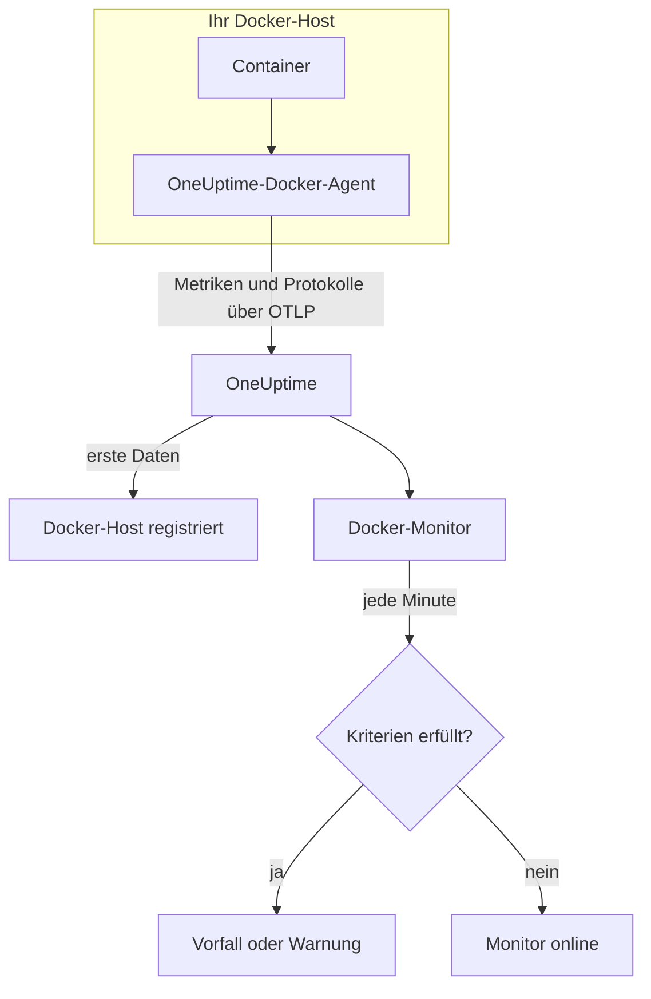

# Docker-Überwachung

Ein Docker-Monitor überwacht die Container auf einem Docker-Host und meldet Ihnen, wenn ein Container heiß läuft, keinen Arbeitsspeicher mehr hat oder in einer Neustartschleife steckt. Er liest die Metriken, die der OneUptime-Docker-Agent vom Host sendet, es wird also nichts von außen geprüft: Installieren Sie den Agent und erstellen Sie den Monitor dann aus einer Vorlage oder Ihrer eigenen Abfrage.

:::cards
- [Den Monitor erstellen](#einen-docker-monitor-erstellen): Sechs Schritte im Dashboard.
- [Vorlagen](#fertige-warnungsvorlagen): Sechs fertige Warnungen, ein Vorfall pro Container.
- [Metriken](#erfasste-metriken): Was der Agent erfasst und was jede Metrik bedeutet.
- [Protokolle](#erfasste-protokolle): Container-Protokolle und der Log-Treiber, den sie brauchen.
:::

## So funktioniert es

Der OneUptime-Docker-Agent läuft als Container auf dem Host. Alle 30 Sekunden liest er die Container-Statistiken aus der Docker-Engine-API, liest die Protokolldateien der Container mit und sendet beides über OTLP an OneUptime. Die ersten Daten eines Hosts registrieren ihn in OneUptime.

Ein Docker-Monitor ist an einen Host gebunden. Jede Minute führt er seine Abfrage über die Container-Metriken dieses Hosts aus und vergleicht das Ergebnis mit seinen Kriterien.



## Bevor Sie beginnen

- **Den Docker-Agent installieren** auf dem Host. Die [Anleitung zum Docker-Agent](/docs/telemetry/docker-host) behandelt Installation, Aktualisierung und Prüfung.
- **Prüfen Sie, ob der Host registriert ist.** Er erscheint unter **Produkte → Infrastruktur → Docker → Alle Hosts**, benannt nach dem `DOCKER_HOST_NAME` des Agents, sobald seine ersten Daten eintreffen.
- **Für Container-Protokolle** führen Sie die Container mit dem Docker-Log-Treiber `json-file` aus. Siehe [Anforderung an den Log-Treiber](#anforderung-an-den-log-treiber).

## Einen Docker-Monitor erstellen

:::steps
### Einen neuen Monitor beginnen

Gehen Sie zu **Monitore** und klicken Sie auf **Monitor erstellen**.

### Docker Container wählen

Klicken Sie unter **Monitortyp** auf **Weitere Monitortypen** und wählen Sie **Docker Container** unter **Infrastruktur**, oder geben Sie `docker` in das Suchfeld ein. Geben Sie einen **Name** ein – er wird in den Titeln von Vorfällen und Warnungen verwendet – und klicken Sie auf **Weiter**.

### Den Host wählen

Wählen Sie unter **Docker-Monitor-Konfiguration** den Host aus **Docker-Host**. Jeder Host, der Daten gesendet hat, steht in der Liste.

### Festlegen, was überwacht wird

Wählen Sie einen der drei Tabs:

- **Quick Setup** – klicken Sie auf eine [Vorlage](#fertige-warnungsvorlagen). Sie legt Metrik, Aggregation, Zeitbereich und Schwellenwerte fest und ersetzt die Kriterien weiter unten durch ihre eigenen. Den **Zeitbereich** können Sie weiterhin ändern.
- **Custom Metric** – wählen Sie eine Metrik unter **Docker-Metrik** und legen Sie dann **Aggregation** und **Zeitbereich** fest. **Container-Name** und **Container-Image** grenzen sie auf bestimmte Container ein.
- **Erweitert** – bauen Sie unter **Metriken auswählen** selbst Abfragen und Formeln. Verwenden Sie **Gruppieren nach** `resource.container.name`, um jeden Container einzeln zu beurteilen.

### Die Kriterien prüfen

Öffnen Sie unter **Monitor-Kriterien** jedes Kriterium und prüfen Sie seine **Metrik**, **Aggregation**, **Bedingung** und seinen **Schwellenwert**. Eine Vorlage füllt diese aus. Mit **Custom Metric** oder **Erweitert** beginnt der Monitor mit den [Standardkriterien](#standardkriterien), die nur bemerken, wenn eine Metrik auf null fällt; legen Sie daher Ihren eigenen Schwellenwert fest.

### Den Monitor erstellen

Klicken Sie auf **Monitor erstellen**. OneUptime öffnet die Seite des Monitors und wertet ihn jede Minute aus. Vorfälle und Warnungen, die er auslöst, stehen auch auf den Seiten **Vorfälle** und **Warnungen** des Hosts.
:::

> [!TIP]
> Um mehrere Vorlagen auf einmal einzurichten, öffnen Sie den Host über **Produkte → Infrastruktur → Docker** und gehen Sie zu **Empfehlungen**. Wählen Sie die gewünschten Vorlagen, legen Sie fest, wer alarmiert wird, und OneUptime erstellt einen Monitor pro Vorlage.

## Monitor-Einstellungen

| Feld | Tab | Was es tut |
| --- | --- | --- |
| **Docker-Host** | Alle | Erforderlich. Beschränkt jede Abfrage auf den `resource.host.name` des Hosts. OneUptime fügt außerdem jeder Abfrage `resource.container.runtime = docker` hinzu. |
| **Docker-Metrik** | Custom Metric | Eine Metrik aus dem Katalog des Agents, gruppiert nach CPU, Arbeitsspeicher, Netzwerk, Block-I/O und Container. |
| **Container-Name** | Custom Metric, Erweitert | Optional. Exakte Übereinstimmung mit `resource.container.name`, zum Beispiel `my-container`. |
| **Container-Image** | Custom Metric, Erweitert | Optional. Exakte Übereinstimmung mit `resource.container.image.name`, zum Beispiel `nginx:latest`. |
| **Aggregation** | Custom Metric | Wie Messwerte zusammengefasst werden: **Durchschnitt**, **Maximum**, **Minimum**, **Summe** oder **Anzahl**. Beginnt bei der üblichen Aggregation der Metrik. |
| **Zeitbereich** | Alle | Das gleitende Zeitfenster, das die Abfrage liest, von **Past 1 Minute** bis **Past 365 Days**. Ein neuer Monitor beginnt bei **Past 1 Minute**; Vorlagen legen ihr eigenes fest. |
| **Metriken auswählen** | Erweitert | Der Abfrage-Builder: **Metrik**, **Aggregieren nach**, **Nach Attributen filtern**, **Gruppieren nach**, dazu **Metrik hinzufügen** und **Formel hinzufügen**, um Abfragen zu kombinieren. |

## Fertige Warnungsvorlagen

**Quick Setup** bietet sechs Vorlagen. Jede baut einen vollständigen Monitor: eine nach `resource.container.name` gruppierte Abfrage, ein Kriterium, das auslöst, und eines, das wiederherstellt. Jeder Container wird einzeln beurteilt, sodass ein ausgelasteter Container keinen anderen verdeckt, und jeder Container über dem Schwellenwert erhält seinen eigenen Vorfall und seine eigene Warnung. Die Schwellenwerte sind Ausgangswerte, die Sie anpassen können.

Sofern die Tabelle nichts anderes sagt, löst ein Kriterium nur aus, wenn die Bedingung in jeder Minute seines Zeitfensters gilt, und es wird 10 % jenseits des Schwellenwerts wiederhergestellt, damit ein Wert, der um die Grenze pendelt, nicht hin- und herspringt.

| Vorlage | Schweregrad | Überwacht | Löst aus, wenn | Wiederhergestellt, wenn |
| --- | --- | --- | --- | --- |
| High Container CPU Usage | Warnung | `container.cpu.utilization`, Max pro Container, letzte 5 Minuten | Über 80 (% eines Kerns) | Bei oder unter 72 |
| High Container Memory Usage | Warnung | `container.memory.percent`, Max pro Container, letzte 5 Minuten | Über 85 % | Bei oder unter 76,5 % |
| Container Restart Loop | Kritisch | Zuwachs von `container.restarts` pro Container, letzte 15 Minuten | Mehr als 3 Neustarts im Zeitfenster (Summe) | 2,7 oder weniger |
| Container CPU Throttling | Warnung | Zuwachs von `container.cpu.throttling_data.throttled_time` in ms pro Container, letzte 5 Minuten | Mehr als 1000 ms im Zeitfenster (Summe) | 900 ms oder weniger |
| High Container Process Count | Warnung | `container.pids.count`, Max pro Container, letzte 5 Minuten | Über 2000 | Bei oder unter 1800 |
| Container Down (Low Uptime) | Kritisch | `container.uptime`, Min pro Container, letzte 1 Minute | Gleich 0 | Über 0 |

**Schweregrad** ist die Bezeichnung, die die Auswahl anzeigt. Vorfall und Warnung, die eine Vorlage erstellt, beginnen mit dem schwersten Vorfall- und Warnungsschweregrad Ihres Projekts; ändern Sie sie in den Kriterien.

> [!NOTE]
> `container.cpu.utilization` ist die Zahl, die `docker stats` ausgibt: 100 % ist ein voller CPU-Kern, nicht der ganze Host, ein Container mit zwei Kernen liest also 200. Auf einem Host mit mehreren Kernen ist der Schwellenwert 80 ein CPU-Budget, kein Anteil an der Maschine.

> [!NOTE]
> `container.memory.percent` teilt durch das Speicherlimit des Containers, wenn eines gesetzt ist, und sonst durch den gesamten Arbeitsspeicher **des Hosts**. Prüfen Sie, ob der Container mit `--memory` gestartet wurde, bevor Sie eine Überschreitung als bevorstehenden Out-of-Memory-Kill behandeln.

> [!WARNING]
> `container.restarts` und `container.cpu.throttling_data.throttled_time` wachsen nur, daher warnen diese beiden Vorlagen danach, wie stark sie im Zeitfenster gewachsen sind: eine Maximum- und eine Minimum-Abfrage pro Minute, durch eine Formel voneinander abgezogen und summiert. Bei der 30-Sekunden-Erfassung des Agents sieht das etwa die Hälfte der tatsächlichen Aktivität, und die Schwellenwerte berücksichtigen das bereits. Wenn Sie das `collection_interval` des Agents auf 60 Sekunden oder mehr erhöhen, enthält jede Minute nur einen Messwert, und beide Vorlagen warnen nicht mehr.

> [!CAUTION]
> **Container Down (Low Uptime)** kann einen Container nicht erkennen, der stoppt und gestoppt bleibt. Der Agent meldet nur laufende Container, ein gestoppter Container sendet also gar keine Daten, und seine Betriebszeit liest nie 0. Für einen Dienst, der laufen muss, überwachen Sie zusätzlich, was er bereitstellt – zum Beispiel mit einer [API-Überwachung](/docs/monitor/api-monitor).

## Erfasste Metriken

Der Agent verwendet den OpenTelemetry-Receiver `docker_stats` am Docker-Socket, alle 30 Sekunden. Die Metriken jedes Containers tragen seine Identität als Ressourcenattribute: `resource.container.name`, `resource.container.image.name`, `resource.container.id`, `resource.container.runtime` (`docker`) und `resource.host.name`.

### CPU

| Metrik | Beschreibung |
| --- | --- |
| `container.cpu.utilization` | CPU-Auslastung, wobei 100 % ein voller CPU-Kern ist (die Spalte CPU% von `docker stats`). |
| `container.cpu.usage.total` | Seit dem Start des Containers verbrauchte CPU-Zeit, in Nanosekunden. Ein Zähler über die gesamte Lebensdauer. |
| `container.cpu.throttling_data.throttled_time` | Nanosekunden, die der Container seit seinem Start durch sein CPU-Limit gedrosselt wurde. Ein Zähler über die gesamte Lebensdauer. |
| `container.cpu.throttling_data.throttled_periods` | Drosselungsperioden seit dem Start des Containers. Ein Zähler über die gesamte Lebensdauer. |

### Arbeitsspeicher

| Metrik | Beschreibung |
| --- | --- |
| `container.memory.usage.total` | Belegter Arbeitsspeicher, in Bytes. |
| `container.memory.usage.limit` | Speicherlimit, in Bytes. |
| `container.memory.percent` | Speichernutzung als Prozentsatz des Container-Limits oder des gesamten Arbeitsspeichers des Hosts, wenn der Container kein Limit hat. |

### Netzwerk

| Metrik | Beschreibung |
| --- | --- |
| `container.network.io.usage.rx_bytes` | Empfangene Bytes. Ein Zähler über die gesamte Lebensdauer. |
| `container.network.io.usage.tx_bytes` | Gesendete Bytes. Ein Zähler über die gesamte Lebensdauer. |

### Block-I/O

| Metrik | Beschreibung |
| --- | --- |
| `container.blockio.io_service_bytes_recursive.read` | Von Blockgeräten gelesene Bytes. |
| `container.blockio.io_service_bytes_recursive.write` | Auf Blockgeräte geschriebene Bytes. |

### Container

| Metrik | Beschreibung |
| --- | --- |
| `container.uptime` | Sekunden seit dem Start des Containers. Nur laufende Container melden sie. |
| `container.restarts` | Wie oft der Container seit seiner Erstellung neu gestartet wurde. Ein Zähler über die gesamte Lebensdauer. |
| `container.pids.count` | Tasks im Container. Der pids-Controller der cgroup zählt Threads ebenso wie Prozesse. |

Die Liste **Docker-Metrik** bietet außerdem `container.cpu.usage.percpu`, `container.memory.rss`, `container.memory.cache` und die Netzwerk-Paketzähler. Die mitgelieferte Agent-Konfiguration schaltet diese nicht ein; prüfen Sie daher die Seite **Metriken** des Hosts, bevor Sie darauf aufbauen. `container.cpu.throttling_data.throttled_periods` steht nicht in der Liste; fragen Sie sie über **Erweitert** ab.

## Überwachungskriterien

Ein Kriterium vergleicht eine der Abfragen oder Formeln des Monitors mit einem Schwellenwert. Die Kriterien eines Docker-Monitors haben keinen **Filtertyp**: Jede Regel prüft den Metrikwert, mit diesen Feldern.

| Feld | Was es tut |
| --- | --- |
| **Metrik** | Die zu prüfende Abfrage oder Formel, anhand ihres Variablennamens. |
| **Aggregation** | Wie die Werte im Zeitfenster zu einer Antwort werden: **Durchschnitt**, **Summe**, **Maximum Value**, **Minimum Value**, **All Values** (jeder Wert muss zutreffen) oder **Any Value** (einer genügt). |
| **Bedingung** | **Greater Than**, **Less Than**, **Greater Than Or Equal To**, **Less Than Or Equal To** oder **Equal To** – oder eine Anomaliebedingung: **Anomalously High**, **Anomalously Low** oder **Anomalous**. |
| **Schwellenwert** | Der Vergleichswert. Daneben steht eine Einheitenliste, wenn die Metrik eine Einheit hat. Wird bei Anomaliebedingungen nicht angezeigt. |
| **Empfindlichkeit** | Nur bei Anomaliebedingungen. **Niedrig** (4σ), **Mittel** (3σ, der Standard) oder **Hoch** (2σ). |
| **Baseline-Fenster** | Nur bei Anomaliebedingungen. 14 Tage (der Standard), 28, 60 oder 90 Tage Verlauf. |
| **Bei keinen Daten** | Unter **Weitere Felder**. Was geschieht, wenn das Zeitfenster keine Messwerte hat: **Ignore** (der Standard), **Treat As Zero** oder **Auslöser**. |

Anomaliebedingungen vergleichen jeden Wert mit derselben Stunde der Woche in der Baseline. Sie bleiben im Zustand „Learning“ und lösen nichts aus, bis das Baseline-Fenster genug Verlauf enthält.

Jedes Kriterium legt außerdem fest, was geschieht, wenn es zutrifft: den Monitorstatus ändern, eine Warnung erstellen oder einen Vorfall melden. Kriterien werden von oben nach unten geprüft, und das erste zutreffende entscheidet.

### Standardkriterien

Ein Monitor, den Sie nicht aus einer Vorlage erstellen, beginnt mit zwei Kriterien:

| Reihenfolge | Kriterium | Trifft zu, wenn | Dann |
| --- | --- | --- | --- |
| 1 | Check if _monitor name_ is offline | Ein beliebiger Wert der ersten Abfrage `0` ist | Markiert den Monitor als **Offline** und meldet den Vorfall „_monitor name_ is offline“, der sich von selbst auflöst, wenn der Monitor sich erholt. |
| 2 | Check if _monitor name_ is online | Ein beliebiger Wert über `0` liegt | Markiert den Monitor als **Betriebsbereit**. |

> [!IMPORTANT]
> Stille erfüllt keines der beiden Kriterien: Ein Host, der keine Daten mehr sendet, lässt den Monitor, wie er war. Um benachrichtigt zu werden, wenn keine Daten mehr kommen, setzen Sie **Bei keinen Daten** in einem Kriterium auf **Auslöser**. Zeit, in der OneUptime selbst keine Daten empfing, gilt nie als fehlende Daten: Eine Prüfung, deren Zeitfenster solche Zeit enthält, wartet stattdessen, wie [Wenn OneUptime keine Daten empfängt](/docs/monitor/when-oneuptime-is-not-receiving) erklärt.

## Erfasste Protokolle

Der Agent liest außerdem die Datei `*-json.log` jedes Containers mit und sendet jede Zeile als OpenTelemetry-Protokolleintrag mit:

| Feld | Wert |
| --- | --- |
| `resource.host.name` | Der Host, aus `DOCKER_HOST_NAME`. |
| `resource.container.id` | Die vollständige Container-ID. |
| `resource.container.runtime` | Immer `docker`. |
| `attributes["log.iostream"]` | `stdout` oder `stderr`. |
| `severityText` / `severityNumber` | Aus einem Level-Schlüsselwort gelesen, wo in der Zeile ein Level steht (`[ERROR]`, `app.INFO:`, `{"level":"warn"}`, `level=error`). Eine Zeile ohne Level fällt auf ihren Stream zurück: `stderr` ist `ERROR`, `stdout` ist `INFO`. |
| `body` | Die Zeile, die der Container geschrieben hat. Zeilen, die mit Leerraum oder einer schließenden Klammer beginnen, etwa Stacktrace-Zeilen, werden an die vorherige Zeile angehängt. |
| `time` | Der Zeitstempel des Docker-Daemons für die Zeile. |

Protokolle erscheinen auf der Seite **Protokolle** des Hosts und auf der Seite jedes Containers.

### Anforderung an den Log-Treiber

Der Agent kann nur Protokolle von Containern lesen, die den Docker-Log-Treiber `json-file` verwenden. Er ist der Standard von Docker, aber ein Container oder der ganze Daemon kann einen anderen verwenden:

| Treiber | Was der Agent sieht |
| --- | --- |
| `json-file` | Jede Zeile. |
| `local` | Nichts: Die Datei ist binär, und der Agent kann sie nicht auswerten. |
| `journald`, `syslog`, `fluentd`, `gelf`, `awslogs`, `splunk`, … | Nichts: Die Protokolle gehen woandershin, es gibt also keine Datei zum Mitlesen. |
| `none` | Nichts: Die Protokolle werden verworfen. |

Prüfen Sie den Treiber eines Containers und den Standard des Daemons:

```bash
docker inspect <container> --format '{{.HostConfig.LogConfig.Type}}'
docker info --format '{{.LoggingDriver}}'
```

Wechseln Sie zu `json-file`. Docker legt den Log-Treiber eines Containers beim Erstellen des Containers fest; erstellen Sie daher jeden Container nach der Änderung neu – ein Neustart behält den alten Treiber.

:::tabs
@tab Docker Compose
Setzen Sie den Treiber für jeden Dienst, mit Rotation:

```yaml title="docker-compose.yml"
services:
  my-app:
    image: my-app:latest
    logging:
      driver: "json-file"
      options:
        max-size: "100m"
        max-file: "5"
```

Erstellen Sie dann den Dienst neu:

```bash
docker compose up -d --force-recreate <service>
```
@tab Docker-Daemon
Machen Sie `json-file` zum Standard für jeden danach erstellten Container:

```json title="/etc/docker/daemon.json"
{
  "log-driver": "json-file",
  "log-opts": {
    "max-size": "100m",
    "max-file": "5"
  }
}
```

Starten Sie den Docker-Daemon neu, entfernen Sie dann jeden Container und erstellen Sie ihn neu:

```bash
docker rm -f <container>
docker run ... <image>
```
:::

## Fehlerbehebung

:::details Der Host steht nicht in der Liste Docker-Host
Hosts registrieren sich selbst aus den Daten des Agents. Prüfen Sie, ob der Agent-Container läuft und ob der Host unter **Produkte → Infrastruktur → Docker → Alle Hosts** aufgeführt ist. Die [Anleitung zum Docker-Agent](/docs/telemetry/docker-host) enthält die Prüfungen, die Sie auf dem Host ausführen.
:::

:::details Metriken kommen an, aber die Seite Protokolle ist leer
Die Container verwenden mit ziemlicher Sicherheit nicht den Log-Treiber `json-file`. Prüfen Sie sie mit den Befehlen unter [Anforderung an den Log-Treiber](#anforderung-an-den-log-treiber), stellen Sie die Container um, deren Protokolle Sie brauchen, und erstellen Sie sie neu.
:::

:::details Der Agent protokolliert „no files match the configured criteria“
Der Agent sucht nach `/var/lib/docker/containers/*/*-json.log` und hat nichts gefunden. Entweder verwendet kein Container auf dem Host `json-file`, oder das Mount `/var/lib/docker/containers` des Agents (`-v /var/lib/docker/containers:/var/lib/docker/containers:ro`) fehlt oder ist leer, oder der Agent läuft auf Docker Desktop für macOS, dessen Container-Dateien in seiner Linux-VM liegen.
:::

:::details Daten kommen unter dem falschen Hostnamen an
OneUptime erkennt einen Host an `resource.host.name`, den der Agent aus `DOCKER_HOST_NAME` übernimmt. Wird `DOCKER_HOST_NAME` nach den ersten Daten geändert, entsteht ein zweiter Host, statt dass der erste umbenannt wird, und ein Monitor bleibt an den Namen gebunden, mit dem er erstellt wurde.
:::

:::details Eine CPU-Warnung löst nie aus
Gruppieren Sie die Abfrage nach `resource.container.name` und aggregieren Sie mit **Maximum**, wie es die Vorlage **High Container CPU Usage** tut. Ein Durchschnitt über alle Container eines ausgelasteten Hosts wird von den untätigen nach unten gezogen. Denken Sie daran, dass 100 % einen vollen Kern bedeuten; ein Container, dem mehrere Kerne zustehen, braucht daher einen höheren Schwellenwert.
:::

:::details Die Vorlage für Neustartschleifen oder Drosselung warnt nicht mehr
Beide messen, wie stark ein Zähler zwischen zwei Messwerten derselben Minute gewachsen ist. Wenn das `collection_interval` des Agents 60 Sekunden oder mehr beträgt, enthält jede Minute nur einen Messwert, der Zuwachs liest immer 0, und keine der beiden Vorlagen löst aus. Behalten Sie den Standard des Agents von 30 Sekunden bei.
:::

## Nächste Schritte

:::cards
- [Docker-Agent](/docs/telemetry/docker-host): Den Agent installieren, aktualisieren und Fehler beheben, den dieser Monitor liest.
- [Podman-Überwachung](/docs/monitor/podman-monitor): Derselbe Monitor für Podman-Hosts.
- [Docker-Swarm-Überwachung](/docs/monitor/docker-swarm-monitor): Die Tasks eines Swarm-Clusters überwachen.
- [Vorfälle – Übersicht](/docs/incidents/index): Was passiert, nachdem ein Kriterium einen Vorfall gemeldet hat.
:::
