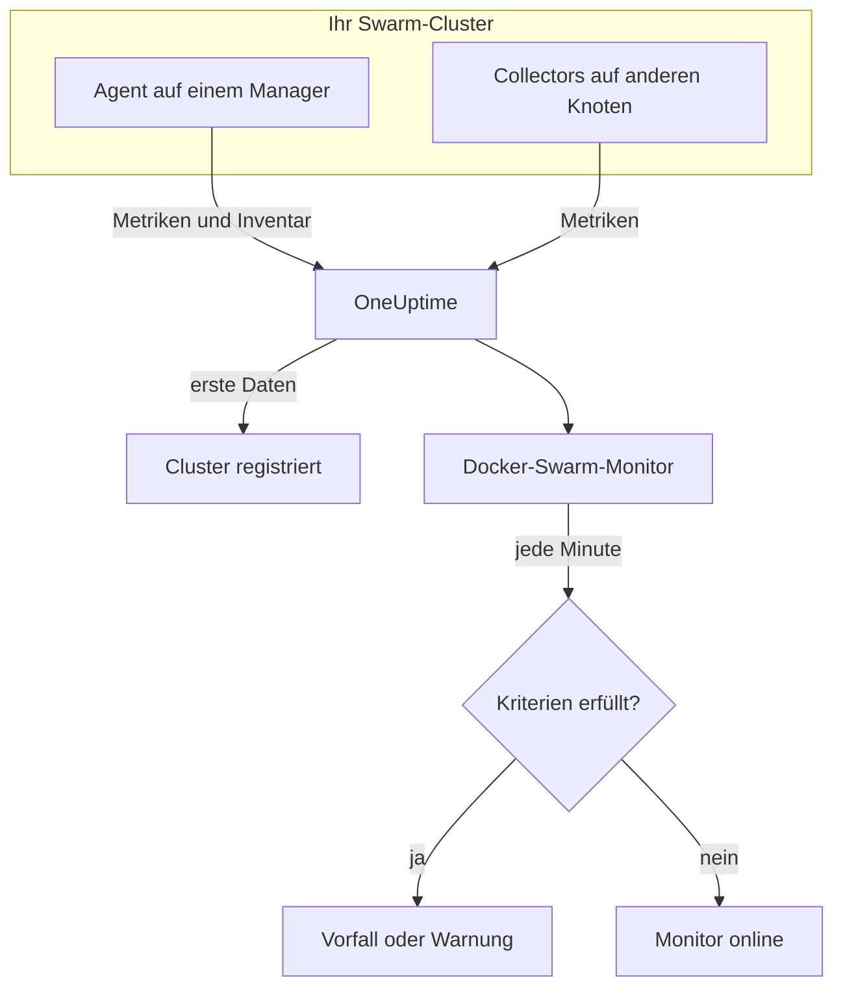

# Docker-Swarm-Überwachung

Ein Docker-Swarm-Monitor überwacht die Container hinter den Service-Tasks eines Swarm-Clusters und meldet Ihnen, wenn ein Task neu startet, heiß läuft oder keinen Arbeitsspeicher mehr hat. Er liest die Container-Metriken, die der OneUptime-Docker-Swarm-Agent sendet, es wird also nichts von außen geprüft: Installieren Sie den Agent und erstellen Sie den Monitor dann aus einer Vorlage oder Ihrer eigenen Abfrage.

:::cards
- [Den Monitor erstellen](#einen-docker-swarm-monitor-erstellen): Sechs Schritte im Dashboard.
- [Vorlagen](#fertige-warnungsvorlagen): Vier fertige Warnungen, ein Vorfall pro Task.
- [Metriken](#erfasste-metriken): Die Container-Metriken, bei denen Sie warnen können.
- [Filter](#monitor-einstellungen): Einen Monitor auf einen Service, einen Task oder ein Image eingrenzen.
:::

## So funktioniert es

Der OneUptime-Docker-Swarm-Agent läuft auf einem Manager-Knoten. Sein Collector liest alle 30 Sekunden die Container-Statistiken aus dem Docker-Daemon dieses Knotens und versieht jeden Stapel mit dem Namen des Clusters, `docker.swarm.cluster.name`. Ein kleiner Inventar-Abfrager daneben liest alle 5 Minuten die Knoten, Services und Tasks des Clusters aus der Swarm-API. Die ersten Daten registrieren den Cluster in OneUptime.

Der Collector sieht nur Container auf dem Knoten, auf dem er läuft. Für Metriken von jedem Knoten führen Sie den Collector auf jedem Knoten mit demselben `DOCKER_SWARM_CLUSTER_NAME` aus.

Ein Docker-Swarm-Monitor ist an einen Cluster gebunden. Jede Minute führt er seine Abfrage über die Container-Metriken dieses Clusters aus und vergleicht das Ergebnis mit seinen Kriterien.

## Bevor Sie beginnen

- **Den Docker-Swarm-Agent installieren** auf einem Manager-Knoten. Die [Anleitung zum Docker-Swarm-Agent](/docs/telemetry/docker-swarm) behandelt Installation und Aktualisierung sowie das Ausführen des Collectors auf den anderen Knoten.
- **Prüfen Sie, ob der Cluster registriert ist.** Er erscheint unter **Produkte → Infrastruktur → Docker Swarm → Alle Cluster**, benannt nach dem `DOCKER_SWARM_CLUSTER_NAME` des Agents, sobald seine ersten Daten eintreffen.

## Einen Docker-Swarm-Monitor erstellen

:::steps
### Einen neuen Monitor beginnen

Gehen Sie zu **Monitore** und klicken Sie auf **Monitor erstellen**.

### Docker Swarm wählen

Klicken Sie unter **Monitortyp** auf **Weitere Monitortypen** und wählen Sie **Docker Swarm** unter **Infrastruktur**, oder geben Sie `swarm` in das Suchfeld ein. Geben Sie einen **Name** ein – er wird in den Titeln von Vorfällen und Warnungen verwendet – und klicken Sie auf **Weiter**.

### Den Cluster wählen

Wählen Sie unter **Docker-Swarm-Monitor-Konfiguration** den Cluster aus **Docker-Swarm-Cluster**. Jeder Cluster, der Daten gesendet hat, steht in der Liste.

### Festlegen, was überwacht wird

Wählen Sie einen der drei Tabs:

- **Quick Setup** – klicken Sie auf eine [Vorlage](#fertige-warnungsvorlagen). Sie legt Metrik, Aggregation, Zeitbereich und Schwellenwerte fest und ersetzt die Kriterien weiter unten durch ihre eigenen. Den **Zeitbereich** können Sie weiterhin ändern.
- **Custom Metric** – wählen Sie eine Metrik unter **Docker-Swarm-Metrik** und legen Sie dann **Aggregation** und **Zeitbereich** fest. Die [Filter](#monitor-einstellungen) grenzen sie auf bestimmte Tasks ein.
- **Erweitert** – bauen Sie unter **Metriken auswählen** selbst Abfragen und Formeln. Verwenden Sie **Gruppieren nach** `resource.container.name`, um jeden Task einzeln zu beurteilen.

### Die Kriterien prüfen

Öffnen Sie unter **Monitor-Kriterien** jedes Kriterium und prüfen Sie seine **Metrik**, **Aggregation**, **Bedingung** und seinen **Schwellenwert**. Eine Vorlage füllt diese aus. Mit **Custom Metric** oder **Erweitert** beginnt der Monitor mit den [Standardkriterien](#standardkriterien), die nur bemerken, wenn eine Metrik auf null fällt; legen Sie daher Ihren eigenen Schwellenwert fest.

### Den Monitor erstellen

Klicken Sie auf **Monitor erstellen**. OneUptime öffnet die Seite des Monitors und wertet ihn jede Minute aus. Vorfälle und Warnungen, die er auslöst, stehen auch auf den Seiten **Vorfälle** und **Warnungen** des Clusters.
:::

> [!TIP]
> Um mehrere Vorlagen auf einmal einzurichten, öffnen Sie den Cluster über **Produkte → Infrastruktur → Docker Swarm** und gehen Sie zu **Empfehlungen**. Wählen Sie die gewünschten Vorlagen, legen Sie fest, wer alarmiert wird, und OneUptime erstellt einen Monitor pro Vorlage.

## Monitor-Einstellungen

| Feld | Tab | Was es tut |
| --- | --- | --- |
| **Docker-Swarm-Cluster** | Alle | Erforderlich. Beschränkt jede Abfrage auf `resource.docker.swarm.cluster.name`. Das ist das einzige Ressourcenattribut, das der Agent setzt, daher fügt der Monitor keinen Filter auf `container.runtime` oder `host.name` hinzu. |
| **Dienstname** | Custom Metric, Erweitert | Optional. Exakte Übereinstimmung mit `docker.swarm.service.name`, zum Beispiel `web`. |
| **Knotenname** | Custom Metric, Erweitert | Optional. Exakte Übereinstimmung mit `docker.swarm.node.name`, zum Beispiel `swarm-node-1`. |
| **Container-Name** | Custom Metric, Erweitert | Optional. Exakte Übereinstimmung mit `resource.container.name`. Der Container eines Tasks heißt `<service>.<slot>.<taskid>`, zum Beispiel `web.1.abc123`. |
| **Container-Image** | Custom Metric, Erweitert | Optional. Exakte Übereinstimmung mit `resource.container.image.name`, zum Beispiel `nginx:latest`. |
| **Docker-Swarm-Metrik** | Custom Metric | Eine Metrik aus dem [Katalog](#erfasste-metriken). |
| **Aggregation** | Custom Metric | Wie Messwerte zusammengefasst werden: **Durchschnitt**, **Maximum**, **Minimum**, **Summe** oder **Anzahl**. Beginnt bei der üblichen Aggregation der Metrik. |
| **Zeitbereich** | Alle | Das gleitende Zeitfenster, das die Abfrage liest, von **Past 1 Minute** bis **Past 365 Days**. Ein neuer Monitor beginnt bei **Past 1 Minute**; Vorlagen legen ihr eigenes fest. |
| **Metriken auswählen** | Erweitert | Der Abfrage-Builder: **Metrik**, **Aggregieren nach**, **Nach Attributen filtern**, **Gruppieren nach**, dazu **Metrik hinzufügen** und **Formel hinzufügen**, um Abfragen zu kombinieren. |

> [!WARNING]
> Der mitgelieferte Agent setzt `docker.swarm.service.name` und `docker.swarm.node.name` noch nicht, daher findet ein Monitor, bei dem **Dienstname** oder **Knotenname** ausgefüllt ist, keine Daten. Grenzen Sie stattdessen mit **Container-Image** ein, oder gruppieren Sie nach `resource.container.name`.

## Fertige Warnungsvorlagen

**Quick Setup** bietet vier Vorlagen. Jede baut einen vollständigen Monitor: eine nach `resource.container.name` gruppierte Abfrage, ein Kriterium, das auslöst, und eines, das wiederherstellt. Jeder Task wird einzeln beurteilt und erhält seinen eigenen Vorfall und seine eigene Warnung, deren Ursache die betroffenen Tasks und ihre Werte auflistet. Die Schwellenwerte sind Ausgangswerte, die Sie anpassen können.

Sofern die Tabelle nichts anderes sagt, löst ein Kriterium nur aus, wenn die Bedingung in jeder Minute seines Zeitfensters gilt, und es wird 10 % jenseits des Schwellenwerts wiederhergestellt, damit ein Wert, der um die Grenze pendelt, nicht hin- und herspringt.

| Vorlage | Schweregrad | Überwacht | Löst aus, wenn | Wiederhergestellt, wenn |
| --- | --- | --- | --- | --- |
| Task Down (Low Uptime) | Kritisch | `container.uptime`, Min pro Task, letzte 1 Minute | Ein beliebiger Wert unter 60 Sekunden liegt | Jeder Wert bei oder über 66 Sekunden liegt |
| High Task CPU Usage | Warnung | `container.cpu.utilization`, Avg pro Task, letzte 5 Minuten | Über 80 (% eines Kerns) | Bei oder unter 72 |
| High Task Memory Usage | Warnung | `container.memory.percent`, Avg pro Task, letzte 5 Minuten | Über 85 % | Bei oder unter 76,5 % |
| High Task Process Count | Warnung | `container.pids.count`, Max pro Task, letzte 5 Minuten | Über 500 | Bei oder unter 450 |

**Schweregrad** ist die Bezeichnung, die die Auswahl anzeigt. Vorfall und Warnung, die eine Vorlage erstellt, beginnen mit dem schwersten Vorfall- und Warnungsschweregrad Ihres Projekts; ändern Sie sie in den Kriterien.

> [!NOTE]
> **Task Down (Low Uptime)** löst bei einem einzigen jungen Messwert aus, weil ein Neustart ein Ereignis ist, kein Pegel. Swarm gibt einem Ersatz-Task einen neuen Container und damit eine neue Reihe; deshalb sucht die Vorlage nach einer Betriebszeit unter einer Minute statt nach einer 0. Ein Deployment oder eine Skalierung nach oben löst sie ebenfalls aus, und sie klingt ab, sobald die neuen Tasks eine Minute Betriebszeit überschreiten. Ein Task, der stirbt und nicht ersetzt wird, sendet nichts und wird daher nicht erkannt.

## Erfasste Metriken

Der Collector des Agents verwendet den OpenTelemetry-Receiver `docker_stats`, die Metriken sind also die üblichen Container-Metriken, eine Reihe pro Task-Container. Es gibt keine `docker_swarm_*`-Metriken: Knoten, Services und Tasks werden als Inventar geführt, auf den Seiten **Dienste**, **Aufgaben**, **Knoten** und verwandten Seiten des Clusters.

### CPU

| Metrik | Einheit | Beschreibung |
| --- | --- | --- |
| `container.cpu.utilization` | % | CPU-Auslastung des Containers eines Tasks, wobei 100 % ein voller CPU-Kern ist. |

### Arbeitsspeicher

| Metrik | Einheit | Beschreibung |
| --- | --- | --- |
| `container.memory.usage.total` | bytes | Vom Container eines Tasks belegter Arbeitsspeicher. |
| `container.memory.percent` | % | Belegter Arbeitsspeicher als Prozentsatz des Container-Limits oder des gesamten Arbeitsspeichers des Knotens, wenn der Service kein Limit setzt. |

### Netzwerk

| Metrik | Einheit | Beschreibung |
| --- | --- | --- |
| `container.network.io.usage.rx_bytes` | bytes | Vom Container eines Tasks empfangene Bytes. Ein Zähler über die gesamte Lebensdauer. |
| `container.network.io.usage.tx_bytes` | bytes | Vom Container eines Tasks gesendete Bytes. Ein Zähler über die gesamte Lebensdauer. |

### Container

| Metrik | Einheit | Beschreibung |
| --- | --- | --- |
| `container.pids.count` | count | Prozesse im Container eines Tasks. Ein plötzlicher Anstieg kann auf eine Fork-Bombe oder ein Leck hindeuten. |
| `container.uptime` | seconds | Wie lange der Container eines Tasks läuft. Ein neu eingeplanter oder neu gestarteter Task beginnt einen neuen Container bei 0. |

Jede Reihe trägt die Identität des Containers als Ressourcenattribute: `resource.container.name` (`<service>.<slot>.<taskid>`), `resource.container.image.name` und `resource.docker.swarm.cluster.name`.

## Überwachungskriterien

Ein Kriterium vergleicht eine der Abfragen oder Formeln des Monitors mit einem Schwellenwert. Die Kriterien eines Docker-Swarm-Monitors haben keinen **Filtertyp**: Jede Regel prüft den Metrikwert, mit diesen Feldern.

| Feld | Was es tut |
| --- | --- |
| **Metrik** | Die zu prüfende Abfrage oder Formel, anhand ihres Variablennamens. |
| **Aggregation** | Wie die Werte im Zeitfenster zu einer Antwort werden: **Durchschnitt**, **Summe**, **Maximum Value**, **Minimum Value**, **All Values** (jeder Wert muss zutreffen) oder **Any Value** (einer genügt). |
| **Bedingung** | **Greater Than**, **Less Than**, **Greater Than Or Equal To**, **Less Than Or Equal To** oder **Equal To** – oder eine Anomaliebedingung: **Anomalously High**, **Anomalously Low** oder **Anomalous**. |
| **Schwellenwert** | Der Vergleichswert. Daneben steht eine Einheitenliste, wenn die Metrik eine Einheit hat. Wird bei Anomaliebedingungen nicht angezeigt. |
| **Empfindlichkeit** | Nur bei Anomaliebedingungen. **Niedrig** (4σ), **Mittel** (3σ, der Standard) oder **Hoch** (2σ). |
| **Baseline-Fenster** | Nur bei Anomaliebedingungen. 14 Tage (der Standard), 28, 60 oder 90 Tage Verlauf. |
| **Bei keinen Daten** | Unter **Weitere Felder**. Was geschieht, wenn das Zeitfenster keine Messwerte hat: **Ignore** (der Standard), **Treat As Zero** oder **Auslöser**. |

Anomaliebedingungen vergleichen jeden Wert mit derselben Stunde der Woche in der Baseline. Sie bleiben im Zustand „Learning“ und lösen nichts aus, bis das Baseline-Fenster genug Verlauf enthält.

Jedes Kriterium legt außerdem fest, was geschieht, wenn es zutrifft: den Monitorstatus ändern, eine Warnung erstellen oder einen Vorfall melden. Kriterien werden von oben nach unten geprüft, und das erste zutreffende entscheidet.

### Standardkriterien

Ein Monitor, den Sie nicht aus einer Vorlage erstellen, beginnt mit zwei Kriterien:

| Reihenfolge | Kriterium | Trifft zu, wenn | Dann |
| --- | --- | --- | --- |
| 1 | Check if _monitor name_ is offline | Ein beliebiger Wert der ersten Abfrage `0` ist | Markiert den Monitor als **Offline** und meldet den Vorfall „_monitor name_ is offline“, der sich von selbst auflöst, wenn der Monitor sich erholt. |
| 2 | Check if _monitor name_ is online | Ein beliebiger Wert über `0` liegt | Markiert den Monitor als **Betriebsbereit**. |

> [!IMPORTANT]
> Stille erfüllt keines der beiden Kriterien: Ein Cluster, der keine Daten mehr sendet, lässt den Monitor, wie er war. Um benachrichtigt zu werden, wenn keine Daten mehr kommen, setzen Sie **Bei keinen Daten** in einem Kriterium auf **Auslöser**. Zeit, in der OneUptime selbst keine Daten empfing, gilt nie als fehlende Daten: Eine Prüfung, deren Zeitfenster solche Zeit enthält, wartet stattdessen, wie [Wenn OneUptime keine Daten empfängt](/docs/monitor/when-oneuptime-is-not-receiving) erklärt.

## Fehlerbehebung

:::details Der Cluster steht nicht in der Liste Docker-Swarm-Cluster
Cluster registrieren sich selbst aus den Daten des Agents. Prüfen Sie, ob der Agent auf einem Manager-Knoten läuft, ob `DOCKER_SWARM_CLUSTER_NAME` gesetzt ist und ob der Cluster unter **Produkte → Infrastruktur → Docker Swarm → Alle Cluster** aufgeführt ist. Die [Anleitung zum Docker-Swarm-Agent](/docs/telemetry/docker-swarm) enthält die Prüfungen, die Sie auf dem Knoten ausführen.
:::

:::details Nur manche Tasks haben Metriken
Der Collector liest den Docker-Daemon des Knotens, auf dem er läuft, und sieht daher nur die Tasks auf diesem Knoten. Führen Sie den Collector auf jedem Knoten mit demselben `DOCKER_SWARM_CLUSTER_NAME` aus.
:::

:::details Ein nach Service oder Knoten gefilterter Monitor findet keine Daten
**Dienstname** und **Knotenname** vergleichen mit `docker.swarm.service.name` und `docker.swarm.node.name`, die der mitgelieferte Agent nicht setzt. Leeren Sie sie und grenzen Sie mit **Container-Image** ein, oder gruppieren Sie nach `resource.container.name`.
:::

:::details Alle Tasks erscheinen als eine Reihe
Gruppieren Sie nach dem Ressourcenattribut `resource.container.name`, wie es die Vorlagen tun. Das bloße `container.name` trifft auf nichts zu, sodass alle Tasks zu einer Reihe mit leerem Namen zusammenfallen.
:::

## Nächste Schritte

:::cards
- [Docker-Swarm-Agent](/docs/telemetry/docker-swarm): Den Agent installieren und aktualisieren, den dieser Monitor liest.
- [Docker-Überwachung](/docs/monitor/docker-monitor): Die Container eines einzelnen Docker-Hosts überwachen.
- [Vorfälle – Übersicht](/docs/incidents/index): Was passiert, nachdem ein Kriterium einen Vorfall gemeldet hat.
- [Bereitschaftspläne](/docs/on-call/schedules): Festlegen, wer alarmiert wird, wenn ein Task ausfällt.
:::
