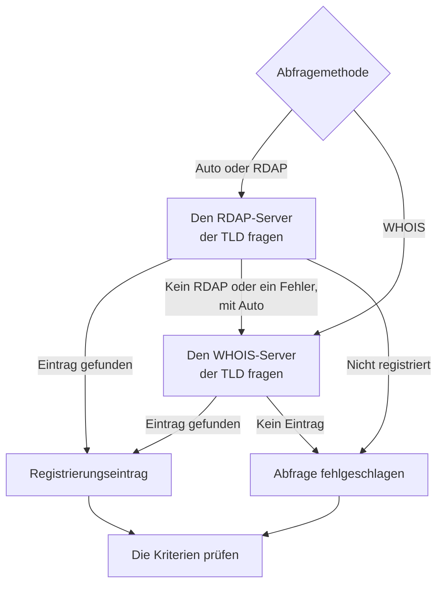

# Domain-Überwachung

Ein Domain-Monitor liest regelmäßig den Registrierungseintrag Ihrer Domain, um ihr Ablaufdatum, ihren Registrar, ihre Nameserver und ihre Statuscodes zu verfolgen, und warnt Sie, bevor sie abläuft. Verwenden Sie ihn für jede Domain, von der Ihre Websites, APIs und E-Mails abhängen: Eine abgelaufene Registrierung legt sie alle auf einmal lahm.

:::cards
- [Den Monitor erstellen](#einen-domain-monitor-erstellen): Sechs Schritte im Dashboard.
- [Abfragemethoden](#abfragemethoden): RDAP, WHOIS und warum **Auto** der Standard ist.
- [Standardkriterien](#standardkriterien): Eine Ablaufwarnung 30 Tage im Voraus, ohne Einrichtung.
- [Fehlerbehebung](#fehlerbehebung): Stillgelegte WHOIS-Server, Proxys und fehlende Daten.
:::

## So funktioniert es

Bei jeder Prüfung schlägt eine Sonde den Registrierungseintrag der Domain über RDAP oder WHOIS nach, je nach **Abfragemethode**, und vereinheitlicht, was sie findet: das Ablaufdatum, den Registrar, die Nameserver und die Statuscodes. Eine fehlgeschlagene Abfrage wird erneut versucht, bis zur Zahl der Wiederholungen, die Sie festlegen. Danach prüft OneUptime den Eintrag anhand der Kriterien des Monitors.

Kann eine Abfrage keine Registrierungsdaten liefern — weil der Dienst der TLD stillgelegt ist oder die Domain nicht registriert ist —, wird der Monitor als **offline** gemeldet, mit dem Grund in der Sondenantwort des Monitors, statt mit einem leeren Ablaufdatum als gesund gemeldet zu werden. Eine Registry, die antwortet „diese Domain ist frei“ (zum Beispiel `Status: free` bei der DENIC), wird als **nicht registriert** behandelt, nicht als gesunder Eintrag.

Internationalisierte Domainnamen werden in beiden Formen angenommen: `münchen.de` wird vor der Abfrage in sein A-Label (`xn--mnchen-3ya.de`) umgewandelt.

## Bevor Sie beginnen

- **Eine Rolle, die Monitore erstellen darf**: Project Owner, Project Admin, Project Member, Monitor Admin oder Monitor Member oder eine benutzerdefinierte Rolle mit der Berechtigung Create Monitor.
- **Ausgehender Zugriff von der Sonde** auf die Registries. Die Standardsonden Ihres Projekts werden für jeden neuen Monitor ausgewählt; eine [benutzerdefinierte Sonde](/docs/probe/custom-probe) muss Folgendes erreichen:

| Ziel | Protokoll | Verwendet für |
| --- | --- | --- |
| `https://data.iana.org/rdap/dns.json` | HTTPS, Port 443 | Das IANA-RDAP-Bootstrap-Verzeichnis, das sagt, wo der RDAP-Server jeder TLD ist. Einmal abgerufen und 24 Stunden zwischengespeichert. |
| Die RDAP-Server der Registries | HTTPS, Port 443 | RDAP-Abfragen. |
| WHOIS-Server | TCP-Port 43 | WHOIS-Abfragen. |

RDAP-Anfragen beachten die Einstellungen `HTTP_PROXY_URL` / `HTTPS_PROXY_URL` / `NO_PROXY` der Sonde. WHOIS läuft über einen rohen Socket und tut das nicht. Erreicht eine Sonde `data.iana.org` nicht, weicht **Auto** auf WHOIS aus und versucht es nach fünf Minuten erneut bei IANA.

## Einen Domain-Monitor erstellen

:::steps
### Einen neuen Monitor beginnen

Gehen Sie zu **Monitore** und klicken Sie auf **Monitor erstellen**. Klicken Sie unter **Monitortyp** auf **Weitere Monitortypen** und wählen Sie **Domäne** unter **Basic Monitoring**.

### Ihn benennen

Geben Sie einen **Name** ein, etwa `example.com registration`, und klicken Sie dann auf **Weiter**.

### Die Domain eingeben

Geben Sie den **Domänenname** ein, etwa `example.com`. Lassen Sie **Abfragemethode** auf **Auto**, sofern Sie keinen Grund dagegen haben (siehe [Abfragemethoden](#abfragemethoden)).

### Ihn testen

Klicken Sie auf **Monitor testen**, wählen Sie unter **Sonde auswählen** eine Sonde und klicken Sie auf **Test ausführen**. **Überwachungs-Testergebnis** zeigt den Registrierungseintrag, den die Sonde gelesen hat, und ob RDAP oder WHOIS geantwortet hat.

### Die Kriterien prüfen

**Monitor-Kriterien** beginnt mit den [Standardkriterien](#standardkriterien): offline, wenn die Registrierung abgelaufen ist oder nicht gelesen werden kann, eine Warnung, wenn sie in 30 Tagen oder früher abläuft. Ändern Sie sie bei Bedarf und klicken Sie dann auf **Weiter**.

### Sonden wählen und erstellen

Behalten oder ändern Sie die **Sonden** und das **Überwachungsintervall** (es beginnt bei **Alle 5 Minuten**) und klicken Sie dann auf **Monitor erstellen**. Die Seite des Monitors öffnet sich.
:::

## Konfigurationsoptionen

| Feld | Standard | Was eingetragen wird |
| --- | --- | --- |
| **Domänenname** | Keiner | Die registrierte Domain, etwa `example.com`. Eine eingefügte Adresse funktioniert auch: `https://example.com/pricing` wird als `example.com` gelesen. |
| **Abfragemethode** | **Auto** | **Auto**, **RDAP** oder **WHOIS**. Siehe [Abfragemethoden](#abfragemethoden). |
| **Zeitüberschreitung (ms)** (unter **Weitere Felder**) | `10000` | Wie lange auf jede Registrierungsabfrage gewartet wird, in Millisekunden. |
| **Wiederholungen** (unter **Weitere Felder**) | `3` | Wiederholungen, nachdem der erste Versuch fehlgeschlagen ist. `0` bedeutet einen einzigen Versuch. |

Jede fehlgeschlagene Abfrage wird wiederholt, mit einer Pause von einer Sekunde zwischen den Versuchen. Das gilt auch, wenn eine Registry antwortet, dass die Domain nicht registriert ist oder dass sie keinen Registrierungsdienst hat, falls die Antwort ein vorübergehender Fehler war. Nur ein fehlerhafter Domainname wird sofort gemeldet, ohne Abfrage.

Die Zeitüberschreitung gilt für jede Anfrage, nicht für die ganze Prüfung: Eine Prüfung mit **Auto**, die RDAP versucht und dann auf WHOIS ausweicht, kann doppelt so lange dauern oder länger.

### Abfragemethoden

Registrierungsdaten lassen sich über zwei Protokolle lesen, und welches funktioniert, hängt von der TLD ab.

| Methode | Verhalten |
| --- | --- |
| **Auto** | Standard. Verwendet RDAP, wenn die TLD einen RDAP-Dienst veröffentlicht, und weicht auf WHOIS aus, wenn sie das nicht tut oder die RDAP-Abfrage fehlschlägt. |
| **RDAP** | Nur RDAP. Schlägt mit einer klaren Fehlermeldung fehl, wenn die TLD keinen RDAP-Dienst veröffentlicht. |
| **WHOIS** | Nur WHOIS. |

**RDAP** ([RFC 9083](https://www.rfc-editor.org/rfc/rfc9083)) ist der von der ICANN vorgeschriebene Nachfolger von WHOIS. Der autoritative Server jeder TLD wird über das [Bootstrap-Verzeichnis der IANA](https://www.rfc-editor.org/rfc/rfc9224) ermittelt, sodass er auch dann stimmt, wenn Registries umziehen. Jede gTLD veröffentlicht einen. Sagt der RDAP-Server der TLD, dass die Domain nicht registriert ist, nimmt **Auto** das als Antwort und fragt WHOIS nicht.

**WHOIS** hat keinen vergleichbaren Ermittlungsmechanismus — Clients liefern eine feste Zuordnung von TLD zu WHOIS-Host mit, und diese Zuordnungen veralten. Jede TLD von Identity Digital (`.digital`, `.email`, `.life`, `.today`, `.zone` und rund 290 weitere) ist noch einem stillgelegten Host zugeordnet, der jede Anfrage mit dem wörtlichen Text `TLD is not supported.` statt eines Eintrags beantwortet. WHOIS bleibt die einzige Möglichkeit für die vielen ccTLDs, die überhaupt keinen RDAP-Dienst veröffentlichen, etwa `.io`, `.co`, `.de`, `.ch` und `.jp`.

## Überwachungskriterien

Kriterien entscheiden, wann die Domain als in Ordnung oder fehlerhaft gilt und ob dabei ein Vorfall gemeldet oder eine Warnung erstellt wird. Jedes Kriterium prüft einen oder mehrere Filter:

| Filter | Bedingungen | Was er prüft |
| --- | --- | --- |
| **Is Online** | **Wahr**, **Falsch** | Ob die Registrierungsabfrage selbst erfolgreich war. |
| **Is Request Timeout** | **Wahr**, **Falsch** | Ob die Abfrage bei jedem Versuch in ein Zeitlimit gelaufen ist. |
| **Domain Expires In Days** | **Greater Than**, **Less Than**, **Greater Than Or Equal To**, **Less Than Or Equal To** | Tage, bis die Registrierung abläuft, auf einen ganzen Tag aufgerundet. |
| **Domain Is Expired** | **Wahr**, **Falsch** | Ob das Ablaufdatum überschritten ist. |
| **Domain Registrar** | **Enthält**, **Not Contains**, **Starts With**, **Ends With**, **Equal To**, **Not Equal To** | Der Name des Registrars. |
| **Domain Name Server** | **Enthält**, **Not Contains**, **Starts With**, **Ends With**, **Equal To**, **Not Equal To** | Die Nameserver der Domain. Trifft zu, wenn einer von ihnen zutrifft. |
| **Domain Status Code** | **Enthält**, **Not Contains**, **Starts With**, **Ends With**, **Equal To**, **Not Equal To** | Die EPP-Statuscodes der Domain. Trifft zu, wenn einer von ihnen zutrifft. |

Statuscodes werden auf ihre EPP-Namen (`clientTransferProhibited`) vereinheitlicht, egal welches Protokoll geantwortet hat, sodass ein Kriterium weiter zutrifft, wenn **Auto** zwischen RDAP und WHOIS wechselt. Registrar-_Namen_ sind das, was der antwortende Dienst veröffentlicht, und können sich zwischen den beiden Protokollen leicht unterscheiden. Verwenden Sie für ein Kriterium mit **Domain Registrar** daher lieber **Enthält** als **Equal To**.

Datumsangaben werden auf ISO 8601 vereinheitlicht. Ein Datum, das eine Registry in einer Form veröffentlicht, die sich nicht auswerten lässt, wird weggelassen statt gespeichert, sodass ein Ablaufkriterium nicht entscheiden kann und nicht zutrifft, statt stillschweigend für immer „nicht abgelaufen“ zu antworten.

Bei zwei oder mehr Filtern entscheidet **Abgleichsbedingung**, ob **Alle** zutreffen müssen oder **Beliebig** einer genügt. Die **Aktionen** eines Kriteriums legen fest, was es tut: den Monitorstatus ändern, eine Warnung erstellen, einen Vorfall melden oder mehreres davon.

### Standardkriterien

Ein neuer Domain-Monitor beginnt mit drei Kriterien, sodass er Sie ohne jede Einrichtung warnt, bevor eine Registrierung abläuft:

1. **Domainprüfung fehlgeschlagen** — die Registrierung ist abgelaufen, oder ihre Registrierungsdaten konnten nicht gelesen werden. Der Monitor wird als **Offline** markiert und ein Vorfall namens „_monitor name_ domain check failed“ wird erstellt. Der Vorfall löst sich von selbst auf, sobald die Registrierung wieder gelesen wird und aktuell ist.
2. **Domain läuft bald ab** — die Registrierung ist nicht abgelaufen, läuft aber in 30 Tagen oder früher ab. Eine **Warnung** namens „_monitor name_ domain expires soon“ wird erstellt.
3. **Domain ist nicht abgelaufen** — der Monitor wird als **Betriebsbereit** markiert.

Die Warnung „läuft bald ab“ ist eine Warnung, kein Vorfall: Sie erscheint nicht auf Ihren Statusseiten, sie alarmiert niemanden, solange Sie ihr keine Bereitschaftsrichtlinie hinzufügen, und sie ändert den Status des Monitors nicht. Sie verwendet den zweiten Warnungsschweregrad Ihres Projekts, bei einem neuen Projekt **Low**. Sobald die Verlängerung im Registrierungseintrag erscheint, löst sich die Warnung von selbst auf. Eine Registry, die kein Ablaufdatum veröffentlicht, gibt der Warnung nichts in die Hand, daher bleibt sie still.

Kriterien werden von oben nach unten geprüft, und das erste zutreffende entscheidet, was passiert. Deshalb steht „läuft bald ab“ über „ist nicht abgelaufen“: Eine Domain kurz vor dem Ablauf ist noch nicht abgelaufen und würde daher auf beide zutreffen.

Um früher gewarnt zu werden, ändern Sie den Wert des Filters **Domain Expires In Days** im Kriterium „läuft bald ab“, etwa auf `60`. Um stattdessen jemanden zu alarmieren, öffnen Sie die **Aktionen** dieses Kriteriums: Schalten Sie **Wenn Filter übereinstimmen, einen Vorfall deklarieren.** ein, oder behalten Sie die Warnung und fügen Sie ihr unter **Bereitschaftsrichtlinien** eine Bereitschaftsrichtlinie hinzu.

:::details Die Warnung einem Monitor hinzufügen, der vor ihr erstellt wurde
Monitore, die erstellt wurden, bevor OneUptime diese Warnung eingeführt hat, haben kein Kriterium „läuft bald ab“. So fügen Sie es hinzu:

1. Öffnen Sie beim Monitor **Konfiguration → Kriterien** und klicken Sie auf **Überwachungskriterien bearbeiten**.
2. Klicken Sie auf **Kriterien hinzufügen**. Setzen Sie seinen Filter auf **Domain Is Expired** / **Falsch**, klicken Sie auf **Filter hinzufügen** und setzen Sie den zweiten auf **Domain Expires In Days** / **Less Than Or Equal To** / `30`. Lassen Sie **Abgleichsbedingung** auf **Alle** (es erscheint unter den Filtern, sobald es zwei sind).
3. Schalten Sie unter **Aktionen** **Wenn Filter übereinstimmen, eine Warnung erstellen.** ein und lassen Sie **Wenn Filter übereinstimmen, Monitorstatus ändern.** ausgeschaltet, sodass es eine Warnung erstellt und den Monitorstatus nicht ändert.
4. Ziehen Sie das neue Kriterium über das Kriterium, das den Monitor als online markiert, und speichern Sie dann.
:::

### Beispielkriterien

| Ziel | Filter | Bedingung | Wert |
| --- | --- | --- | --- |
| Warnen, wenn die Domain innerhalb von 30 Tagen abläuft (ein Standardkriterium) | **Domain Expires In Days** | **Less Than Or Equal To** | `30` |
| Offline, wenn die Domain abgelaufen ist | **Domain Is Expired** | **Wahr** | — |
| Offline, wenn die Registrierung nicht gelesen werden kann | **Is Online** | **Falsch** | — |
| Warnen, wenn sich die Nameserver ändern | **Domain Name Server** | **Not Contains** | `ns1.example.com` |
| Warnen, wenn die Domain für einen Transfer entsperrt ist | **Domain Status Code** | **Not Contains** | `clientTransferProhibited` |

**Domain Name Server** und **Domain Status Code** treffen zu, wenn _irgendein_ einzelner Wert zutrifft, daher trifft **Not Contains** zu, sobald ein Nameserver oder ein Statuscode den Text nicht enthält.

## Bewährte Vorgehensweisen

1. **Lassen Sie sich Zeit zum Verlängern** — Die Standardwarnung kommt 30 Tage vor dem Ablauf. Braucht die Verlängerung Freigaben oder eine Zahlung, die länger dauert, erhöhen Sie sie auf 60 Tage.
2. **Decken Sie fehlgeschlagene Abfragen ab** — Nehmen Sie einen Filter **Is Online** / **Falsch** in Ihr Offline-Kriterium auf, damit eine nicht lesbare Registrierung nicht für eine gesunde gehalten wird. Neue Monitore haben ihn in ihren Standardkriterien; ein Monitor, der vorher erstellt wurde, braucht ihn von Hand. Um einen WHOIS-Server zu überstehen, der die Sonde ab und zu drosselt, setzen Sie unter diesem Filter **Diese Kriterien über einen Zeitraum hinweg auswerten** und wählen Sie **All Values**: Die Domain geht dann erst offline, wenn jede Abfrage im Fenster fehlgeschlagen ist.
3. **Überwachen Sie alle wichtigen Domains** — Schließen Sie Hauptdomains, separat registrierte Subdomains und alle Domains ein, die für E-Mails oder APIs verwendet werden.
4. **Verfolgen Sie Registrarwechsel** — Fügen Sie ein Kriterium mit **Domain Registrar** / **Not Contains** / dem Namen Ihres Registrars hinzu, um einen unbefugten Transfer zu bemerken.

## Fehlerbehebung

:::details Der WHOIS-Server „answered without any registration data“
Der WHOIS-Host der TLD ist stillgelegt, drosselt die Sonde oder ist kurz gestört. Ein stillgelegter Host, etwa der, der für Identity-Digital-TLDs noch eingetragen ist, antwortet jedes Mal `TLD is not supported.`. Bleibt der Fehler mit **Abfragemethode** auf **WHOIS** bestehen, wechseln Sie zu **Auto**, sodass die Sonde den RDAP-Dienst der TLD liest, wo es einen gibt.
:::

:::details Die Prüfung schlägt mit „No RDAP service is published“ fehl
Der Monitor verwendet **RDAP**, und die TLD veröffentlicht keinen RDAP-Dienst, wie viele ccTLDs. Stellen Sie **Abfragemethode** auf **Auto** um, das auf WHOIS ausweicht.
:::

:::details Die Domain wird als nicht registriert gemeldet
Die Registry hat geantwortet, dass die Domain frei ist. Prüfen Sie die Schreibweise und ob Sie die registrierte Domain eingegeben haben, etwa `example.com`, keine Subdomain.
:::

:::details Abfragen schlagen auf einer Sonde hinter einem Proxy fehl
RDAP läuft über die Proxy-Einstellungen der Sonde, WHOIS nicht. Erlauben Sie ausgehenden TCP-Port 43 für WHOIS, oder verwenden Sie **Auto** oder **RDAP** für TLDs, die einen RDAP-Dienst veröffentlichen.
:::

:::details Das Ablaufdatum ist leer, und die Ablaufkriterien schlagen nie an
Die Registry veröffentlicht kein Ablaufdatum oder eines in einer Form, die sich nicht auswerten lässt. Ablaufkriterien können ohne Datum nicht entscheiden, daher bleiben sie still. **Is Online** sagt Ihnen weiterhin, ob der Eintrag gelesen werden kann.
:::

## Nächste Schritte

:::cards
- [SSL-Zertifikat-Überwachung](/docs/monitor/ssl-certificate-monitor): Gewarnt werden, bevor die Zertifikate auf der Domain ablaufen.
- [DNS-Überwachung](/docs/monitor/dns-monitor): Prüfen, ob die Einträge der Domain aufgelöst werden und was in ihnen steht.
- [DNSSEC-Überwachung](/docs/monitor/dnssec-monitor): Die Vertrauenskette einer signierten Zone validieren.
- [Eskalationsregeln](/docs/on-call/escalation-rules): Festlegen, wer von den Warnungen und Vorfällen alarmiert wird.
:::
