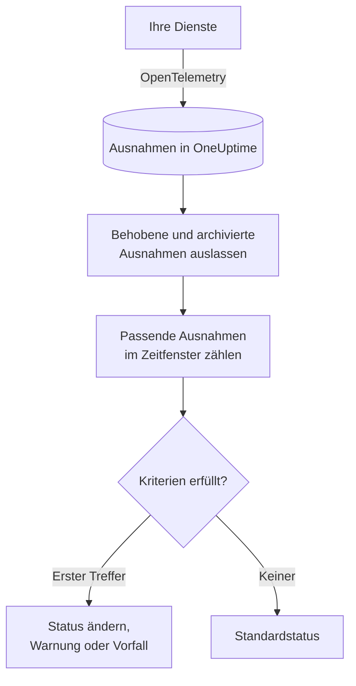

# Ausnahmen-Überwachung

Ein Ausnahmen-Monitor zählt die Ausnahmen, die Ihre Dienste an OneUptime melden und die zu Ihren Filtern passen – Meldung, Ausnahmetyp, Umgebung, Dienst –, über ein Zeitfenster. Erfüllt die Anzahl Ihre Kriterien, ändert er den Status des Monitors, erstellt eine Warnung oder eröffnet einen Vorfall. Damit warnen Sie bei jedem neuen Absturz in der Produktion, bei einem bestimmten Ausnahmetyp oder bei einem plötzlichen Anstieg der Fehler.

:::cards
- [Den Monitor erstellen](#einen-ausnahmen-monitor-erstellen): Wählen, welche Ausnahmen gezählt werden und wann gewarnt wird.
- [Umgebungen](#umgebungen): Den Monitor auf `production` beschränken.
- [Wie er ausgewertet wird](#wie-er-ausgewertet-wird): Was gezählt wird und was das Beheben einer Ausnahme bewirkt.
- [Kriterien](#kriterien): Die Bedingungen und die Voreinstellungen.
:::

## So funktioniert es



Jede Minute zählt OneUptime die Ausnahmen, die zu den Filtern des Monitors passen und innerhalb seines Zeitfensters aufgetreten sind, und lässt dabei Ausnahmen aus, die Sie als behoben markiert oder archiviert haben. Diese Anzahl prüft es von oben nach unten gegen die Kriterien des Monitors, und das erste passende Kriterium entscheidet, was geschieht. Passt keines, kehrt der Monitor zu seinem Standardstatus zurück.

## Bevor Sie beginnen

- Ihre Dienste senden Ausnahmen über OpenTelemetry an OneUptime. Siehe [OpenTelemetry](/docs/telemetry/open-telemetry).
- Um einen Monitor auf eine Umgebung zu beschränken, müssen Ihre Dienste das Ressourcenattribut `deployment.environment` setzen.

## Einen Ausnahmen-Monitor erstellen

:::steps
### Einen neuen Monitor beginnen

Gehen Sie zu **Monitore** und klicken Sie auf **Monitor erstellen**.

### Exceptions wählen

Klicken Sie unter **Monitortyp** auf **Weitere Monitortypen** und wählen Sie **Ausnahmen** unter **Telemetrie**, oder tippen Sie `exceptions` in das Suchfeld. Geben Sie einen **Name** ein und klicken Sie dann auf **Weiter**.

### Die zu zählenden Ausnahmen wählen

Legen Sie in **Ausnahme-Monitor-Konfiguration** die Felder **Ausnahmemeldung filtern**, **Ausnahmetypen**, **Umgebungen** und **Überwachungs-Ausnahmen für (time)** fest. Ein leer gelassener Filter passt auf jede Ausnahme. **Ausnahmen-Vorschau** unter den Filtern zeigt die Ausnahmen, auf die sie gerade passen.

### Weiter eingrenzen (optional)

Öffnen Sie **Weitere Felder**, um nach Telemetrie-Dienst oder Infrastruktur-Entität zu filtern oder auch behobene und archivierte Ausnahmen zu zählen.

### Die Kriterien festlegen

Die Karte **Monitor-Kriterien** beginnt mit zwei Kriterien: offline, mit einem Vorfall, wenn eine Ausnahme passt; online, wenn keine passt. Ändern Sie sie so, dass sie das melden, was Sie wollen – siehe [Kriterien](#kriterien).

### Den Monitor erstellen

Klicken Sie auf **Monitor erstellen**. Der Monitor öffnet sich auf seiner Seite **Übersicht**, und seine erste Auswertung läuft innerhalb einer Minute.
:::

## Was er abfragt

| Feld | Worauf es passt | Standard |
| --- | --- | --- |
| **Ausnahmemeldung filtern** | Ausnahmen, deren Meldung diesen Text enthält, ohne Beachtung der Groß-/Kleinschreibung. | Leer: jede Ausnahme |
| **Ausnahmetypen** | Ausnahmen eines dieser Typen, durch Kommas getrennt, etwa `TypeError, NullReferenceException`. Der Typname muss genau übereinstimmen. | Leer: jeder Typ |
| **Umgebungen** | Ausnahmen aus einer dieser Umgebungen, durch Kommas getrennt – siehe [Umgebungen](#umgebungen). | Leer: jede Umgebung |
| **Überwachungs-Ausnahmen für (time)** | Ausnahmen der letzten 5 Sekunden bis zu den letzten 24 Stunden. | **Letzte 1 Minute** |
| **Nach Telemetrie-Dienst filtern** (unter **Weitere Felder**) | Ausnahmen von einem der gewählten Dienste. | Leer: jeder Dienst |
| **Nach Infrastruktur-Entität filtern** (unter **Weitere Felder**) | Ausnahmen von einem der gewählten Hosts, Pods, Container und anderen Entitäten. | Leer: jede Entität |
| **Behobene Ausnahmen einbeziehen** (unter **Weitere Felder**) | Auch Ausnahmen zählen, die als behoben markiert sind. | Aus |
| **Archivierte Ausnahmen einbeziehen** (unter **Weitere Felder**) | Auch Ausnahmen zählen, die archiviert sind. | Aus |

Alle Filter, die Sie festlegen, müssen passen, damit eine Ausnahme gezählt wird.

### Umgebungen

Umgebungen stammen aus dem OpenTelemetry-Ressourcenattribut `deployment.environment` jeder Ausnahme – demselben Wert, nach dem der Ausnahmen-Explorer mit `env:production` filtert. Geben Sie eine Umgebung oder mehrere durch Kommas getrennt ein; eine Ausnahme wird gezählt, wenn ihre Umgebung zu einer davon passt.

Der Abgleich ist exakt und unterscheidet Groß-/Kleinschreibung: `production` passt nicht auf `Production` oder `prod`. Ausnahmen ohne Umgebung werden nicht gezählt, wenn dieser Filter gesetzt ist. Lassen Sie ihn leer, um Ausnahmen aus jeder Umgebung zu zählen, auch solche ohne Umgebung.

Der Umgebungsfilter wird mit jedem anderen Filter kombiniert, sodass ein Monitor, der auf einen Telemetrie-Dienst und `production` beschränkt ist, nur die Produktionsausnahmen dieses Dienstes zählt.

Wenn Sie den Monitor über die API erstellen, setzen Sie `environments` im `exceptionMonitor` des Schritts auf eine Liste von Umgebungsnamen:

```json
{
  "exceptionMonitor": {
    "telemetryServiceIds": [],
    "environments": ["production"],
    "exceptionTypes": [],
    "message": "",
    "includeResolved": false,
    "includeArchived": false,
    "lastXSecondsOfExceptions": 300
  }
}
```

## Wie er ausgewertet wird

- **Jede Minute.** Ein Ausnahmen-Monitor wird nicht von Sonden geprüft, deshalb hat er kein Intervall zum Einstellen und keine Seite **Sonden & Intervall**.
- **Vorkommen, nicht Ausnahmetypen.** Der Monitor zählt jedes Mal, wenn eine passende Ausnahme innerhalb von **Überwachungs-Ausnahmen für (time)** aufgetreten ist. Eine Ausnahme, die 40-mal geworfen wurde, zählt 40.
- **Behobene und archivierte Ausnahmen werden ausgelassen.** Sofern Sie nicht **Behobene Ausnahmen einbeziehen** oder **Archivierte Ausnahmen einbeziehen** einschalten, zählen die Vorkommen einer Ausnahme, die Sie als behoben markiert oder archiviert haben, nicht. Eine Ausnahme als behoben zu markieren kann daher den Vorfall schließen, den sie eröffnet hat. Tritt eine behobene Ausnahme erneut auf, wird sie automatisch wieder auf unbehoben gesetzt und wieder gezählt.
- **Keine Ausnahmen ergeben die Anzahl 0.**
- **Die eigene Ausfallzeit von OneUptime ist keine Stille.** Solange das Zeitfenster Zeit enthält, in der OneUptime selbst keine Daten empfangen hat – weil es neu startete, aktualisiert wurde oder einen Rückstand aufholte –, wartet die Prüfung: Der Status ändert sich nicht, und kein Vorfall und keine Warnung wird eröffnet oder behoben. Siehe [Wenn OneUptime keine Daten empfängt](/docs/monitor/when-oneuptime-is-not-receiving).
- **Kriterien von oben nach unten.** Das erste passende Kriterium entscheidet; stellen Sie also das schwerwiegendste nach oben.

Jede Statusänderung wird mit ihrem Grund in der **Status-Zeitachse** des Monitors festgehalten.

## Kriterien

Die Kriterien eines Ausnahmen-Monitors haben einen **Filtertyp**: **Exception Count**, die Anzahl der Ausnahmen, die im Fenster gepasst haben. Wählen Sie eine **Filterbedingung** und einen **Wert**.

| Filterbedingung | Passt, wenn die Anzahl der Ausnahmen … |
| --- | --- |
| **Greater Than** | über dem Wert liegt |
| **Greater Than Or Equal To** | den Wert erreicht oder darüber liegt |
| **Less Than** | unter dem Wert liegt |
| **Less Than Or Equal To** | den Wert erreicht oder darunter liegt |
| **Equal To** | genau dem Wert entspricht |
| **Not Equal To** | alles außer dem Wert ist |

Für Ausnahmeanzahlen gibt es keine Anomaliebedingungen: Es gibt keine Baseline, mit der sie verglichen werden könnten.

Ein neuer Ausnahmen-Monitor beginnt mit diesen Kriterien:

| Kriterium | Filter | Wirkung |
| --- | --- | --- |
| Check if … has exceptions | **Exception Count** **Greater Than** `0` | Setzt den Monitor auf offline und eröffnet einen Vorfall, der automatisch behoben wird |
| Check if … has no exceptions | **Exception Count** **Equal To** `0` | Setzt den Monitor auf online |

## Ein Beispiel: nur Produktionsausnahmen

Sie wollen einen Vorfall, wann immer die API in der Produktion eine Ausnahme wirft, und nichts für Staging. Sie setzen **Umgebungen** auf `production` und **Überwachungs-Ausnahmen für (time)** auf **Letzte 5 Minuten** und behalten die Standardkriterien. In den letzten fünf Minuten:

| Ausnahmen | Umgebung | Zustand | Gezählt? |
| --- | --- | --- | --- |
| `TypeError` × 3 | `production` | Aktiv | Ja: 3 |
| `TypeError` × 40 | `staging` | Aktiv | Nein: eine andere Umgebung |
| `TimeoutError` × 2 | keine | Aktiv | Nein: keine Umgebung |
| `NullReferenceException` × 4 | `production` | Nach ihrem Auftreten behoben | Nein: behoben |

Der **Exception Count** ist 3, also passt **Greater Than** `0`: Der Monitor geht offline, und ein Vorfall wird eröffnet. Sobald fünf Minuten ohne aktive Produktionsausnahme vergangen sind, passt das Online-Kriterium, und der Vorfall behebt sich selbst.

## Fehlerbehebung

:::details Ausnahmen erscheinen im Explorer, aber der Monitor zählt 0
Vergleichen Sie den Wert von **Umgebungen** mit dem Filter `env:` des Explorers: Der Abgleich ist exakt und unterscheidet Groß-/Kleinschreibung, und Ausnahmen ohne Umgebung werden ausgelassen, wenn der Filter gesetzt ist. Prüfen Sie dann, ob diese Ausnahmen behoben oder archiviert sind. Öffnen Sie die Seite **Kriterien** des Monitors (unter **Konfiguration**) und klicken Sie auf **Überwachungskriterien bearbeiten**: **Ausnahmen-Vorschau** zeigt, worauf die Filter passen.
:::

:::details Der Vorfall wurde behoben, als ich die Ausnahme behoben habe
Das ist so gewollt. Behobene Ausnahmen werden nicht gezählt, also fiel die Anzahl, und das Kriterium passte nicht mehr. Tritt die Ausnahme erneut auf, wird sie wieder auf unbehoben gesetzt und wieder gezählt. Schalten Sie **Behobene Ausnahmen einbeziehen** ein, um sie trotzdem zu zählen.
:::

:::details Ein Filter nach Ausnahmetyp passt auf nichts
**Ausnahmetypen** werden exakt abgeglichen, mit dem Typnamen, mit dem die Ausnahme gemeldet wurde, etwa `TypeError`. Kopieren Sie den Typ aus dem Ausnahmen-Explorer.
:::

## Nächste Schritte

:::cards
- [Traces-Überwachung](/docs/monitor/traces-monitor): Auf fehlschlagende Spans und Endpunkte warnen.
- [Logs-Überwachung](/docs/monitor/logs-monitor): Auf Log-Volumen und -Inhalt warnen.
- [Vorfall- & Warnmeldungsvorlagen](/docs/monitor/incident-alert-templating): Nützliche Titel und Beschreibungen für Warnungen schreiben.
- [OpenTelemetry](/docs/telemetry/open-telemetry): Ausnahmen an OneUptime senden.
:::
