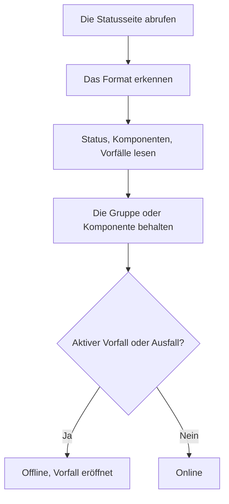

# Externe-Statusseite-Überwachung

Ein Monitor für externe Statusseiten beobachtet die öffentliche Statusseite eines Dienstes, von dem Sie abhängen — AWS, GCP, Azure, GitHub, OpenAI, Anthropic und viele mehr — und alarmiert Sie, wenn dieser Anbieter einen Ausfall oder eine eingeschränkte Leistung meldet. Verwenden Sie ihn, um von Problemen bei Ihren Anbietern zu erfahren, sobald diese sie melden, und sie von Ihren eigenen zu unterscheiden.

:::cards
- [Den Monitor erstellen](#einen-monitor-für-externe-statusseiten-erstellen): Eine Statusseiten-URL einfügen und wählen, was beobachtet wird.
- [Den Umfang festlegen](#konfigurationsoptionen): Eine Komponentengruppe oder eine Komponente beobachten.
- [Kriterien](#überwachungskriterien): Was von Anfang an als ausgefallen gilt.
- [Beliebte Statusseiten](#beliebte-statusseiten-urls): URLs der Dienste, von denen die meisten Teams abhängen.
:::

## So funktioniert es

Bei jeder Prüfung ruft eine Sonde die Statusseite ab, ermittelt ihr Format und liest den Gesamtstatus, die Komponenten und die aktiven Vorfälle. Haben Sie den Monitor auf eine Komponentengruppe oder eine Komponente beschränkt, zählen nur diese. Die Kriterien entscheiden dann, ob der Monitor online oder offline ist.

Sie können ihn verwenden, um:

- die Verfügbarkeit von Drittanbieterdiensten zu überwachen, von denen Ihre Anwendung abhängt
- alarmiert zu werden, wenn vorgelagerte Anbieter Ausfälle haben
- den Status einzelner Komponenten zu verfolgen
- die Überwachung auf eine einzelne Komponentengruppe zu beschränken (z. B. nur die "APIs" von OpenAI), damit Vorfälle anderswo auf der Seite Ihren Monitor nicht auslösen
- eingeschränkte Leistung zu erkennen, bevor sie Ihre Nutzer trifft
- Ihre eigenen Vorfälle mit Problemen vorgelagerter Anbieter in Beziehung zu setzen

## Unterstützte Anbieter

| Anbieter | Beschreibung |
| ------------------------ | ---------------------------------------------------------------------- |
| **Auto** (Standard) | Erkennt das Format der Statusseite automatisch |
| **Atlassian Statuspage** | Statusseiten auf Basis von Atlassian Statuspage (JSON-API) |
| **incident.io** | Statusseiten auf Basis von incident.io (z. B. `https://status.openai.com`) |
| **RSS** | Statusseiten, die einen RSS-Feed anbieten |
| **Atom** | Statusseiten, die einen Atom-Feed anbieten |

### Automatische Erkennung

Steht der Anbieter auf **Auto**, erkennt OneUptime das Format der Statusseite automatisch, in dieser Reihenfolge:

1. Zuerst versucht es die Statusseiten-API von incident.io (`/proxy/<host>`).
2. Dann versucht es die JSON-API von Atlassian Statuspage (`/api/v2/status.json`, `/api/v2/components.json` und `/api/v2/incidents/unresolved.json`).
3. Schlagen diese fehl, versucht es, die Seite als RSS- oder Atom-Feed zu lesen.
4. Als letzte Rückfallebene führt es eine einfache Prüfung der HTTP-Erreichbarkeit durch.

> [!NOTE]
> incident.io wird zuerst geprüft, weil manche incident.io-Statusseiten (wie `https://status.openai.com`) zusätzlich einen eingeschränkten, Atlassian-kompatiblen Endpunkt anbieten, der Komponentengruppen und aktive Vorfälle auslässt. incident.io zuerst zu prüfen stellt sicher, dass die reicheren, gruppenbewussten Daten verwendet werden.

Die Erreichbarkeitsprüfung ist auch die Rückfallebene, wenn ein ausdrücklich gewählter Anbieter fehlschlägt. Sie sagt nur, ob die Seite antwortet — online bei einer Antwort `2xx` oder `3xx` — und meldet keine Komponenten oder Vorfälle.

## Einen Monitor für externe Statusseiten erstellen

:::steps
### Einen neuen Monitor beginnen

Gehen Sie zu **Monitore** und klicken Sie auf **Monitor erstellen**. Klicken Sie unter **Monitortyp** auf **Weitere Monitortypen** und wählen Sie **Externe Statusseite** unter **Basic Monitoring**, oder tippen Sie `statuspage` in das Suchfeld. Geben Sie einen **Name** ein und klicken Sie dann auf **Weiter**.

### Die Statusseiten-URL eingeben

Geben Sie die **Statusseiten-URL** ein. Lassen Sie den **Anbieter** auf **Auto**, sofern Sie das Format nicht kennen.

### Den Umfang festlegen, falls nötig

Öffnen Sie **Weitere Felder**, um einen **Komponentengruppenfilter (optional)** wie `APIs` einzugeben, und einen **Komponentenname-Filter (optional)**, um eine einzelne Komponente zu beobachten (innerhalb der Gruppe, falls eine Gruppe gesetzt ist).

### Es testen

Klicken Sie auf **Monitor testen**, um die Seite einmal abzurufen, und prüfen Sie den gefundenen Anbieter, die Komponenten und die Vorfälle.

### Die Kriterien prüfen

Der Kriterienschritt beginnt mit [den Standardkriterien](#standardkriterien), die den Monitor als offline markieren, wenn der Anbieter einen aktiven Vorfall oder einen Ausfall im beobachteten Umfang meldet. Ändern Sie sie bei Bedarf und klicken Sie dann auf **Weiter**.

### Sonden wählen und erstellen

Wählen Sie die **Sonden** und ein **Überwachungsintervall** — es beginnt bei **Alle 5 Minuten** — und klicken Sie dann auf **Monitor erstellen**.
:::

## Konfigurationsoptionen

| Option | Was eingetragen wird | Standard |
| --- | --- | --- |
| **Statusseiten-URL** | Die URL der Statusseite. Bei Seiten auf Basis von Atlassian Statuspage und incident.io ist das meist die Stamm-URL (z. B. `https://status.example.com`). Bei RSS-/Atom-Feeds geben Sie direkt die Feed-URL ein. | — |
| **Anbieter** | **Auto**, um das Format zu erkennen, oder **Atlassian Statuspage**, **incident.io**, **RSS** oder **Atom**, wenn Sie es kennen. | **Auto** |
| **Komponentengruppenfilter (optional)** | Die Gruppe, auf die der Monitor beschränkt wird. Unter **Weitere Felder**. | Alle Gruppen |
| **Komponentenname-Filter (optional)** | Die Komponente, die beobachtet wird. Unter **Weitere Felder**. | Alle Komponenten im Umfang |
| **Zeitüberschreitung (ms)** | Die längste Wartezeit auf die Statusseite. Unter **Weitere Felder**. | `10000` (10 Sekunden) |
| **Wiederholungen** | Wie oft, im Abstand von einer Sekunde, nach einem fehlgeschlagenen ersten Versuch erneut versucht wird; `0` bedeutet einen einzigen Versuch. Unter **Weitere Felder**. | `3` (bis zu 4 Versuche) |

### Komponentengruppenfilter

Ordnet die Statusseite ihre Komponenten in Gruppen, können Sie den Monitor auf eine einzelne Gruppe beschränken. Auf `https://status.openai.com` zum Beispiel beschränkt die Eingabe `APIs` den Monitor auf die API-Dienste von OpenAI.

Ist eine Komponentengruppe gesetzt, werden die **Zahl der aktiven Vorfälle** und der **Gesamtstatus** nur aus den Komponenten dieser Gruppe berechnet — ein Vorfall in einer anderen Gruppe (zum Beispiel ChatGPT) löst einen auf die Gruppe "APIs" beschränkten Monitor nicht aus.

Die Filterung nach Komponentengruppen wird für die Anbieter **Atlassian Statuspage** und **incident.io** unterstützt. RSS- und Atom-Feeds kennen keine Komponentengruppen.

### Komponentenname-Filter

Meldet die Statusseite mehrere Komponenten, können Sie einen Komponentennamen angeben, um nur diese Komponente zu überwachen. Der Filter trifft auf jede Komponente zu, deren Name die Eingabe enthält, ohne Beachtung der Groß- und Kleinschreibung — `actions` trifft auf eine Komponente namens "Actions" zu.

Ist auch eine Komponentengruppe gesetzt, wird der Komponentenname-Filter **innerhalb** dieser Gruppe angewendet, sodass Sie eine einzelne Komponente in einer größeren Gruppe ansteuern können. Ist keiner der Filter gesetzt, werden alle Komponenten im Umfang überwacht. Bei einem RSS- oder Atom-Feed wird der Namensfilter mit den Titeln der Einträge des Feeds verglichen.

> [!WARNING]
> Ein Filter, der auf nichts zutrifft, sieht gesund aus: Ohne Komponenten im Umfang gibt es nichts, das einen Ausfall melden könnte. Prüfen Sie die Schreibweise anhand der Statusseite und sehen Sie mit **Monitor testen**, was der Filter behält.

## Überwachungskriterien

Sie können Kriterien festlegen, die entscheiden, wann der externe Dienst als online oder offline gilt, auf Grundlage von:

| Filtertyp | Was er prüft | Filterbedingungen |
| --- | --- | --- |
| **External Status Page Is Online** | Ob die Statusseite erreichbar ist und Statusdaten liefert | Wahr oder Falsch |
| **External Status Page Overall Status** | Der Gesamtstatus, den die Seite meldet | Equal To, Not Equal To, Enthält, Not Contains, Starts With, Ends With |
| **External Status Page Component Status** | Der Status der Komponenten im Umfang (unter Beachtung der Filter für Komponentengruppe / Komponentenname): Betriebsbereit, In Wartung, Beeinträchtigte Leistung, Teilweiser Ausfall, Schwerer Ausfall oder Vollständiger Ausfall | Equal To, Not Equal To, Enthält, Not Contains, Starts With, Ends With |
| **External Status Page Active Incidents** | Die Zahl der aktuell aktiven Vorfälle auf der Statusseite (auf die Komponentengruppe / Komponente beschränkt, wenn ein Filter gesetzt ist) | Equal To, Not Equal To und die numerischen Vergleiche |
| **External Status Page Response Time (in ms)** | Wie lange das Abrufen der Daten der Statusseite dauert | Greater Than, Less Than, Greater Than Or Equal To, Less Than Or Equal To |

Der Gesamtstatus ist das, was die Seite sagt, seine Werte hängen also vom Anbieter ab: Eine Atlassian Statuspage meldet ihre eigene Beschreibung, etwa `All Systems Operational`; ein Feed meldet `operational` oder `degraded_performance`; die Erreichbarkeitsprüfung meldet `reachable` oder `unreachable`. Diese Vergleiche beachten die Groß- und Kleinschreibung. Um auf Ausfälle zu alarmieren, sind **External Status Page Active Incidents** und **External Status Page Component Status** meist zuverlässiger.

Bei einem RSS- oder Atom-Feed zählen die Einträge der letzten 24 Stunden als aktive Vorfälle: ein RSS-Eintrag nach seinem Veröffentlichungsdatum, ein Atom-Eintrag nach seinem Aktualisierungsdatum.

### Standardkriterien

Standardmäßig legt OneUptime Kriterien an, die sich nach dem richten, was für eine Statusseite wirklich zählt — ihren aktiven Vorfällen und dem Zustand ihrer Komponenten, nicht bloß der Erreichbarkeit:

| Kriterium | Filter | Wirkung |
| --- | --- | --- |
| Offline | **Beliebig** von: Die Seite ist nicht online; es gibt mindestens einen aktiven Vorfall im Umfang; eine Komponente im Umfang meldet Beeinträchtigte Leistung, Teilweiser Ausfall, Schwerer Ausfall oder Vollständiger Ausfall | Markiert den Monitor als offline und eröffnet einen Vorfall, der sich selbst behebt, wenn das Kriterium nicht mehr zutrifft |
| Online | **Alle** von: Die Seite ist online; es gibt keine aktiven Vorfälle im Umfang | Markiert den Monitor als online |

Weil die Zahl der aktiven Vorfälle und die Komponentenstatus die Filter für Komponentengruppe / Komponentenname beachten, zielen diese Standardkriterien automatisch nur auf die Komponenten, die Sie interessieren.

## Vorlagenvariablen

Wenn Sie aus Monitoren für externe Statusseiten Vorfälle oder Warnungen erstellen, können Sie diese Variablen in Titeln, Beschreibungen und Behebungshinweisen verwenden (siehe [Vorfall- & Warnmeldungsvorlagen](/docs/monitor/incident-alert-templating)):

| Variable | Beschreibung |
| ------------------------- | ------------------------------------------------------------------------------- |
| `{{isOnline}}`            | Ob die Statusseite online ist (true/false) |
| `{{responseTimeInMs}}`    | Antwortzeit in Millisekunden |
| `{{failureCause}}`        | Grund des Fehlschlags, falls vorhanden |
| `{{overallStatus}}`       | Der Wert des Gesamtstatus |
| `{{activeIncidentCount}}` | Zahl der aktiven Vorfälle (auf den Filter beschränkt, falls gesetzt) |
| `{{componentStatuses}}`   | JSON-Array der Komponentenstatus (`name`, `status`, `description`, `groupName`) |
| `{{provider}}`            | Erkannter Anbieter (Atlassian Statuspage, incident.io, RSS, Atom); leer nach einer Erreichbarkeitsprüfung |
| `{{componentGroup}}`      | Komponentengruppe, auf die der Monitor beschränkt ist, falls vorhanden |
| `{{componentName}}`       | Komponente, auf die der Monitor beschränkt ist, falls vorhanden |

## Beliebte Statusseiten-URLs

Hier eine Liste beliebter Statusseiten von Diensten. Viele davon verwenden Atlassian Statuspage oder incident.io, der Anbieter **Auto** erkennt sie also automatisch. Eine Seite, die auf keinem von beiden aufbaut und kein Feed ist, erhält nur die Erreichbarkeitsprüfung — überwachen Sie für solche Seiten stattdessen den RSS- oder Atom-Feed des Anbieters, falls er einen veröffentlicht.

| Dienst | Statusseiten-URL |
| ---------------------------- | --------------------------------------------- |
| AWS                          | `https://health.aws.amazon.com/health/status` |
| Google Cloud Platform        | `https://status.cloud.google.com`             |
| Microsoft Azure              | `https://status.azure.com`                    |
| GitHub                       | `https://www.githubstatus.com`                |
| OpenAI                       | `https://status.openai.com`                   |
| Anthropic                    | `https://status.anthropic.com`                |
| Cloudflare                   | `https://www.cloudflarestatus.com`            |
| Datadog                      | `https://status.datadoghq.com`                |
| PagerDuty                    | `https://status.pagerduty.com`                |
| Twilio                       | `https://status.twilio.com`                   |
| Stripe                       | `https://status.stripe.com`                   |
| Slack                        | `https://status.slack.com`                    |
| Atlassian (Jira, Confluence) | `https://status.atlassian.com`                |
| Vercel                       | `https://www.vercel-status.com`               |
| Netlify                      | `https://www.netlifystatus.com`               |
| DigitalOcean                 | `https://status.digitalocean.com`             |
| Heroku                       | `https://status.heroku.com`                   |
| MongoDB Atlas                | `https://status.cloud.mongodb.com`            |
| Fastly                       | `https://status.fastly.com`                   |
| New Relic                    | `https://status.newrelic.com`                 |
| Sentry                       | `https://status.sentry.io`                    |
| CircleCI                     | `https://status.circleci.com`                 |

## Bewährte Vorgehensweisen

- **Den Anbieter Auto verwenden**, sofern Sie das genaue Format nicht kennen — die automatische Erkennung funktioniert für die meisten Statusseiten gut.
- **Auf eine Komponentengruppe beschränken**, wenn Sie nur von einem Teil eines Anbieters abhängen (z. B. nur von den "APIs" von OpenAI), damit Vorfälle, die Sie nicht betreffen, keinen Lärm machen.
- **Bestimmte Komponenten überwachen**, wenn Sie nur von bestimmten Diensten abhängen.
- **Mit Ihren eigenen Monitoren kombinieren** — kombinieren Sie Monitore für externe Statusseiten mit Ihren eigenen API- und Website-Monitoren. Fallen beide gleichzeitig aus, führt Sie die vorgelagerte Statusseite schneller zur Ursache.

## Fehlerbehebung

:::details Der Monitor ist offline, aber der Vorfall betrifft einen Teil des Dienstes, den ich nicht nutze
Beschränken Sie den Monitor mit einem **Komponentengruppenfilter**, einem **Komponentenname-Filter** oder beiden. Die Zahl der aktiven Vorfälle und die Komponentenstatus zählen dann nur, was im Umfang liegt.
:::

:::details Der Monitor geht nie offline, auch nicht während eines Ausfalls
Die Filter treffen vielleicht auf nichts zu, was gesund aussieht, oder die Seite erhält nur die Erreichbarkeitsprüfung. Führen Sie **Monitor testen** aus und prüfen Sie den gefundenen Anbieter und die Komponenten.
:::

:::details Auto wählt das falsche Format oder findet keine Komponenten
Setzen Sie den **Anbieter** auf den, den die Seite nach Ihrem Wissen verwendet. Bei einem RSS- oder Atom-Feed geben Sie die eigene URL des Feeds ein statt der der Statusseite.
:::

:::details Eine interne Statusseite ist nicht erreichbar
Eine Sonde lehnt Adressen aus privaten Netzwerken ab, sofern sie sie nicht erreichen darf. Setzen Sie `PROBE_ALLOW_PRIVATE_NETWORK_MONITORS=true` auf einer Sonde in Ihrem Netzwerk — siehe [Zugriff auf private Netzwerke](/docs/self-hosted/private-network-access).
:::

## Nächste Schritte

:::cards
- [Vorfall- & Warnmeldungsvorlagen](/docs/monitor/incident-alert-templating): Den Status des Anbieters in Ihre Vorfalltitel übernehmen.
- [API-Überwachung](/docs/monitor/api-monitor): Ihre eigenen Endpunkte neben dem Status Ihres Anbieters prüfen.
- [Einen Monitor erstellen](/docs/monitor/create-monitor): Die Schritte, die alle Monitortypen teilen.
:::
