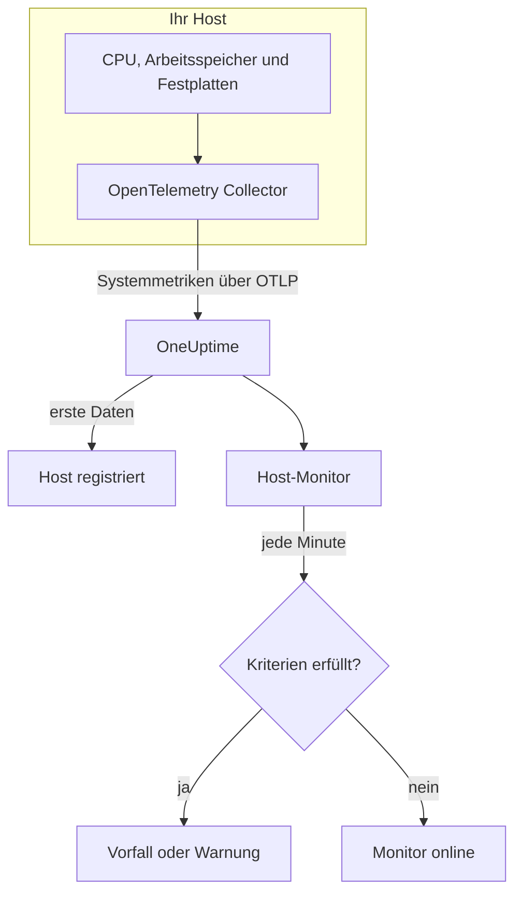

# Host-Überwachung

Ein Host-Monitor überwacht einen einzelnen Rechner – seine CPU, seinen Arbeitsspeicher, seine Festplatten, seine Last und seine Prozesse – und meldet Ihnen, wenn er ausgelastet ist oder vollläuft. Er liest die `system.*`-OpenTelemetry-Metriken, die ein OpenTelemetry Collector vom Host sendet, dieselben Daten, die das Produkt **Hosts** zeigt; es wird also nichts von außen geprüft.

:::cards
- [Den Monitor erstellen](#einen-host-monitor-erstellen): Sechs Schritte im Dashboard.
- [Vorlagen](#fertige-warnungsvorlagen): Fünf fertige Warnungen für CPU, Arbeitsspeicher, Festplatte, Last und Prozesse.
- [Metriken](#erfasste-metriken): Die Host-Metriken, bei denen Sie warnen können, und ihre Einheiten.
- [Host oder Server / VM?](#host-monitor-oder-server-vm-monitor): Welchen der beiden Rechner-Monitore Sie verwenden.
:::

## So funktioniert es

Auf dem Host läuft ein OpenTelemetry Collector mit dem Receiver `hostmetrics`. Alle 30 Sekunden liest er die Werte für CPU, Arbeitsspeicher, Festplatten, Netzwerk, Last und Prozesse des Hosts und sendet sie über OTLP an OneUptime. Die ersten Daten eines Hosts registrieren ihn unter **Hosts**.

Ein Host-Monitor ist an einen Host gebunden. Jede Minute führt er seine Abfrage über die Metriken dieses Hosts aus und vergleicht das Ergebnis mit seinen Kriterien.

### Host-Monitor oder Server-/VM-Monitor?

OneUptime hat zwei Monitore für Rechner. Beide können auf demselben Host laufen.

| | Host-Monitor | Server-/VM-Monitor |
| --- | --- | --- |
| **Agent** | Ein OpenTelemetry Collector mit dem Receiver `hostmetrics` | Der OneUptime-Infrastruktur-Agent |
| **Daten** | `system.*`- und `process.*`-OpenTelemetry-Metriken, dieselben, die die Seiten unter **Hosts** in Diagrammen zeigen | Ein Statusbericht, den der Agent an den Monitor sendet |
| **Kriterien** | Schwellenwerte oder Anomalieerkennung auf jeder Metrikabfrage oder Formel | Eingebaute Prüfungen wie CPU-, Arbeitsspeicher- und Festplattenauslastung |
| **Einrichtung** | Den Collector installieren; der Host registriert sich selbst | Den Monitor erstellen und dann seinen geheimen Schlüssel dem Agent geben |

Verwenden Sie den Host-Monitor, wenn der Host bereits OpenTelemetry-Daten sendet oder wenn Sie Protokolle und reichhaltigere Metriken vom selben Collector möchten. Siehe [Server- / VM-Überwachung](/docs/monitor/server-monitor) für den anderen.

## Bevor Sie beginnen

- **Führen Sie einen OpenTelemetry Collector auf dem Host aus** mit dem Receiver `hostmetrics`. [Host-OpenTelemetry-Collector](/docs/telemetry/host-otel-collector) behandelt Linux, macOS und Windows, und **Produkte → Infrastruktur → Hosts → Dokumentation** liefert eine fertige Konfiguration.
- **Schalten Sie die Auslastungsmetriken ein.** `system.cpu.utilization`, `system.memory.utilization` und `system.filesystem.utilization` sind im Receiver optional, und die Vorlagen für CPU, Arbeitsspeicher und Dateisystem brauchen sie. Die Konfiguration aus dem Dashboard schaltet sie ein.
- **Prüfen Sie, ob der Host registriert ist.** Er erscheint unter **Produkte → Infrastruktur → Hosts → Alle Hosts**, benannt nach seinem `host.name`, sobald seine ersten Daten eintreffen.

## Einen Host-Monitor erstellen

:::steps
### Einen neuen Monitor beginnen

Gehen Sie zu **Monitore** und klicken Sie auf **Monitor erstellen**.

### Host wählen

Klicken Sie unter **Monitortyp** auf **Weitere Monitortypen** und wählen Sie **Host** unter **Infrastruktur**. Geben Sie einen **Name** ein – er wird in den Titeln von Vorfällen und Warnungen verwendet – und klicken Sie auf **Weiter**.

### Den Host auswählen

Wählen Sie unter **Host-Monitor-Konfiguration** den Rechner aus **Host**. Jeder Host, der Daten gesendet hat, steht in der Liste.

### Festlegen, was überwacht wird

Wählen Sie einen der drei Tabs:

- **Quick Setup** – klicken Sie auf eine [Vorlage](#fertige-warnungsvorlagen). Sie legt Metrik, Aggregation, Zeitbereich und Schwellenwerte fest und ersetzt die Kriterien weiter unten durch ihre eigenen. Den **Zeitbereich** können Sie weiterhin ändern.
- **Custom Metric** – wählen Sie eine Metrik unter **Host-Metrik** und legen Sie dann **Aggregation** und **Zeitbereich** fest.
- **Erweitert** – bauen Sie unter **Metriken auswählen** selbst Abfragen und Formeln, zum Beispiel einen Filter auf `state` oder eine Gruppierung nach `mountpoint`.

### Die Kriterien prüfen

Öffnen Sie unter **Monitor-Kriterien** jedes Kriterium und prüfen Sie seine **Metrik**, **Aggregation**, **Bedingung** und seinen **Schwellenwert**. Eine Vorlage füllt diese aus. Mit **Custom Metric** oder **Erweitert** beginnt der Monitor mit den [Standardkriterien](#standardkriterien), die nur bemerken, wenn eine Metrik auf null fällt; legen Sie daher Ihren eigenen Schwellenwert fest.

### Den Monitor erstellen

Klicken Sie auf **Monitor erstellen**. OneUptime öffnet die Seite des Monitors und wertet ihn jede Minute aus. Vorfälle und Warnungen, die er auslöst, stehen auch auf den Seiten **Vorfälle** und **Warnungen** des Hosts.
:::

> [!TIP]
> Um mehrere Vorlagen auf einmal einzurichten, öffnen Sie den Host über **Produkte → Infrastruktur → Hosts** und gehen Sie zu **Empfehlungen**. Wählen Sie die gewünschten Vorlagen, legen Sie fest, wer alarmiert wird, und OneUptime erstellt einen Monitor pro Vorlage.

## Monitor-Einstellungen

| Feld | Tab | Was es tut |
| --- | --- | --- |
| **Host** | Alle | Erforderlich. Beschränkt jede Abfrage auf den `resource.host.name` des Hosts. |
| **Host-Metrik** | Custom Metric | Eine Metrik aus dem [Katalog](#erfasste-metriken), gruppiert nach CPU, Arbeitsspeicher, Festplatte, Netzwerk, Last und Prozessen. |
| **Aggregation** | Custom Metric | Wie Messwerte zusammengefasst werden: **Durchschnitt**, **Maximum**, **Minimum**, **Summe** oder **Anzahl**. Beginnt bei der üblichen Aggregation der Metrik. |
| **Zeitbereich** | Alle | Das gleitende Zeitfenster, das die Abfrage liest, von **Past 1 Minute** bis **Past 365 Days**. Ein neuer Monitor beginnt bei **Past 1 Minute**; Vorlagen legen ihr eigenes fest. |
| **Metriken auswählen** | Erweitert | Der Abfrage-Builder: **Metrik**, **Aggregieren nach**, **Nach Attributen filtern**, **Gruppieren nach**, dazu **Metrik hinzufügen** und **Formel hinzufügen**, um Abfragen zu kombinieren. |

## Fertige Warnungsvorlagen

**Quick Setup** bietet fünf Vorlagen. Jede baut einen vollständigen Monitor: eine Abfrage, ein Kriterium, das auslöst, und eines, das wiederherstellt. Die Schwellenwerte sind Ausgangswerte, die Sie anpassen können.

Ein Kriterium löst nur aus, wenn die Bedingung in jeder Minute seines Zeitfensters gilt, und es wird 10 % jenseits des Schwellenwerts wiederhergestellt, damit ein Wert, der um die Grenze pendelt, nicht hin- und herspringt.

| Vorlage | Schweregrad | Überwacht | Löst aus, wenn | Wiederhergestellt, wenn |
| --- | --- | --- | --- | --- |
| High CPU Utilization | Warnung | `system.cpu.utilization` für die Zustände `user` und `system`, addiert und als Prozentsatz dargestellt, letzte 5 Minuten | Über 80 % | Bei oder unter 72 % |
| High Memory Utilization | Warnung | `system.memory.utilization` für den Zustand `used`, als Prozentsatz, letzte 5 Minuten | Über 85 % | Bei oder unter 76,5 % |
| High Filesystem Usage | Kritisch | `system.filesystem.utilization`, Max pro `mountpoint` und `device`, als Prozentsatz, letzte 5 Minuten | Über 90 % | Bei oder unter 81 % |
| High Load Average (1m) | Warnung | `system.cpu.load_average.1m`, Avg, letzte 5 Minuten | Über 4 | Bei oder unter 3,6 |
| High Process Count | Warnung | `system.processes.count`, Max, letzte 5 Minuten | Über 2000 | Bei oder unter 1800 |

**Schweregrad** ist die Bezeichnung, die die Auswahl anzeigt. Vorfall und Warnung, die eine Vorlage erstellt, beginnen mit dem schwersten Vorfall- und Warnungsschweregrad Ihres Projekts; ändern Sie sie in den Kriterien.

- **CPU** ist die Belegtzeit (`user` plus `system`), derselbe Wert, den die **Übersicht** des Hosts in Diagrammen zeigt. I/O-Wartezeit und Steal sind nicht enthalten.
- **Arbeitsspeicher** schließt Puffer und Seitencache aus, sodass ein Host, der überwiegend Cache enthält, sie nicht auslöst.
- **Dateisystem** löst einen Vorfall pro Mount aus. Schreibgeschützte Pseudo-Dateisysteme wie snap-Mounts vom Typ `squashfs` oder `devfs` unter macOS sind immer zu 100 % voll; schließen Sie sie im Scraper `filesystem` des Collectors aus.
- **Lastdurchschnitt** ist eine rohe Länge der Ausführungswarteschlange, nicht durch die Anzahl der Kerne geteilt: 4 ist auf einem Host mit 2 Kernen Sättigung und auf einem mit 32 Kernen Routine; erhöhen Sie ihn daher auf großen Hosts.
- **Prozessanzahl** vergleicht den größten einzelnen Prozesszustand (`running`, `sleeping`, …), nicht die Gesamtzahl des Hosts, und stimmt daher nicht mit einer Prozessliste überein. Der Scraper für Prozesse meldet nur unter Linux.

## Erfasste Metriken

Die Liste **Host-Metrik** bietet diese Metriken an. Jede trägt `resource.host.name`, über den der Monitor seine Abfragen auf einen Host beschränkt.

> [!IMPORTANT]
> Die Auslastungsmetriken sind ein Verhältnis von 0 bis 1, kein Prozentsatz: Verwenden Sie `0.8` für 80 % in einem Schwellenwert auf der rohen Metrik. Die Vorlagen rechnen mit einer Formel in einen Prozentsatz um, daher lauten ihre Schwellenwerte 80, 85 und 90.

### CPU

| Metrik | Einheit | Beschreibung |
| --- | --- | --- |
| `system.cpu.utilization` | ratio | Anteil der CPU-Zeit in jedem `state` (`user`, `system`, `idle`, …). Filtern Sie nach `state`: Ein Durchschnitt über alle Zustände erreicht nie einen sinnvollen Schwellenwert. |
| `process.cpu.utilization` | ratio | CPU-Auslastung jedes Prozesses auf dem Host. |

### Arbeitsspeicher

| Metrik | Einheit | Beschreibung |
| --- | --- | --- |
| `system.memory.utilization` | ratio | Anteil des physischen Arbeitsspeichers in jedem `state` (`used`, `free`, `cached`, …). Filtern Sie nach `state = used` für den belegten Arbeitsspeicher. |
| `system.memory.usage` | bytes | Speichernutzung in Bytes. |

### Festplatte

| Metrik | Einheit | Beschreibung |
| --- | --- | --- |
| `system.filesystem.utilization` | ratio | Belegter Anteil der Kapazität jedes Dateisystems, pro `mountpoint` und `device`. |
| `system.filesystem.usage` | bytes | Dateisystemnutzung in Bytes. |

### Netzwerk

| Metrik | Einheit | Beschreibung |
| --- | --- | --- |
| `system.network.io` | bytes | Empfangene und gesendete Bytes. Ein Zähler über die gesamte Lebensdauer. |

### Last

| Metrik | Einheit | Beschreibung |
| --- | --- | --- |
| `system.cpu.load_average.1m` | count | Lastdurchschnitt der letzten Minute. |
| `system.cpu.load_average.5m` | count | Lastdurchschnitt der letzten 5 Minuten. |
| `system.cpu.load_average.15m` | count | Lastdurchschnitt der letzten 15 Minuten. |

### Prozesse

| Metrik | Einheit | Beschreibung |
| --- | --- | --- |
| `system.processes.count` | count | Prozesse auf dem Host, eine Reihe pro Prozess-`status`. |

Der Abfrage-Builder unter **Erweitert** listet jede Metrik auf, die der Host sendet, nicht nur diese.

## Überwachungskriterien

Ein Kriterium vergleicht eine der Abfragen oder Formeln des Monitors mit einem Schwellenwert. Die Kriterien eines Host-Monitors haben keinen **Filtertyp**: Jede Regel prüft den Metrikwert, mit diesen Feldern.

| Feld | Was es tut |
| --- | --- |
| **Metrik** | Die zu prüfende Abfrage oder Formel, anhand ihres Variablennamens. |
| **Aggregation** | Wie die Werte im Zeitfenster zu einer Antwort werden: **Durchschnitt**, **Summe**, **Maximum Value**, **Minimum Value**, **All Values** (jeder Wert muss zutreffen) oder **Any Value** (einer genügt). |
| **Bedingung** | **Greater Than**, **Less Than**, **Greater Than Or Equal To**, **Less Than Or Equal To** oder **Equal To** – oder eine Anomaliebedingung: **Anomalously High**, **Anomalously Low** oder **Anomalous**. |
| **Schwellenwert** | Der Vergleichswert. Daneben steht eine Einheitenliste, wenn die Metrik eine Einheit hat. Wird bei Anomaliebedingungen nicht angezeigt. |
| **Empfindlichkeit** | Nur bei Anomaliebedingungen. **Niedrig** (4σ), **Mittel** (3σ, der Standard) oder **Hoch** (2σ). |
| **Baseline-Fenster** | Nur bei Anomaliebedingungen. 14 Tage (der Standard), 28, 60 oder 90 Tage Verlauf. |
| **Bei keinen Daten** | Unter **Weitere Felder**. Was geschieht, wenn das Zeitfenster keine Messwerte hat: **Ignore** (der Standard), **Treat As Zero** oder **Auslöser**. |

Anomaliebedingungen vergleichen jeden Wert mit derselben Stunde der Woche in der Baseline. Sie bleiben im Zustand „Learning“ und lösen nichts aus, bis das Baseline-Fenster genug Verlauf enthält.

Jedes Kriterium legt außerdem fest, was geschieht, wenn es zutrifft: den Monitorstatus ändern, eine Warnung erstellen oder einen Vorfall melden. Kriterien werden von oben nach unten geprüft, und das erste zutreffende entscheidet.

### Standardkriterien

Ein Monitor, den Sie nicht aus einer Vorlage erstellen, beginnt mit zwei Kriterien:

| Reihenfolge | Kriterium | Trifft zu, wenn | Dann |
| --- | --- | --- | --- |
| 1 | Check if _monitor name_ is offline | Ein beliebiger Wert der ersten Abfrage `0` ist | Markiert den Monitor als **Offline** und meldet den Vorfall „_monitor name_ is offline“, der sich von selbst auflöst, wenn der Monitor sich erholt. |
| 2 | Check if _monitor name_ is online | Ein beliebiger Wert über `0` liegt | Markiert den Monitor als **Betriebsbereit**. |

> [!IMPORTANT]
> Stille erfüllt keines der beiden Kriterien: Ein Host, der keine Daten mehr sendet, lässt den Monitor, wie er war. Um benachrichtigt zu werden, wenn der Host verstummt, setzen Sie **Bei keinen Daten** in einem Kriterium auf **Auslöser**. Zeit, in der OneUptime selbst keine Daten empfing, gilt nie als fehlende Daten: Eine Prüfung, deren Zeitfenster solche Zeit enthält, wartet stattdessen, wie [Wenn OneUptime keine Daten empfängt](/docs/monitor/when-oneuptime-is-not-receiving) erklärt.

## Fehlerbehebung

:::details Der Host steht nicht in der Liste Host
Hosts registrieren sich selbst aus den Daten des Collectors, die einen `host.name` und den Betriebssystemtyp des Hosts brauchen – beides kommt vom Prozessor `resourcedetection` des Collectors. Prüfen Sie, ob der Collector läuft und ob der Host unter **Produkte → Infrastruktur → Hosts → Alle Hosts** aufgeführt ist. [Host-OpenTelemetry-Collector](/docs/telemetry/host-otel-collector) behandelt die Konfiguration.
:::

:::details Ein CPU- oder Speicherschwellenwert löst nie aus
Die Auslastungsmetriken sind Verhältnisse mit dem Höchstwert `1.0`, ein von Hand eingetragener Schwellenwert von `80` wird also nie überschritten: Verwenden Sie `0.8`, oder beginnen Sie mit einer Vorlage, die in einen Prozentsatz umrechnet. Filtern Sie außerdem nach `state` – `user` und `system` für die CPU, `used` für den Arbeitsspeicher. Ein Durchschnitt über alle Zustände bleibt bei etwa 1 geteilt durch die Anzahl der Zustände.
:::

:::details Vorfälle lösen für den falschen Host aus
Der Monitor beschränkt jede Abfrage auf `resource.host.name` gleich dem Host, den Sie gewählt haben. Hosts, die denselben `host.name` melden, fallen zu einer Reihe zusammen; geben Sie daher jedem Host einen eindeutigen Namen.
:::

:::details High Filesystem Usage löst für ein Mount aus, das immer voll ist
Schreibgeschützte Pseudo-Dateisysteme wie snap-Loop-Mounts vom Typ `squashfs` unter `/snap` oder `devfs` unter macOS sind konstruktionsbedingt zu 100 % voll und erholen sich nie. Schließen Sie sie im Scraper `filesystem` des Collectors aus.
:::

## Nächste Schritte

:::cards
- [Host-OpenTelemetry-Collector](/docs/telemetry/host-otel-collector): Den Collector installieren und konfigurieren, den dieser Monitor liest.
- [Server- / VM-Überwachung](/docs/monitor/server-monitor): Der Monitor für Rechner, an den ein Agent Berichte sendet.
- [Metriken-Überwachung](/docs/monitor/metrics-monitor): Bei jeder Metrik warnen, über Hosts und Dienste hinweg.
- [Vorfälle – Übersicht](/docs/incidents/index): Was passiert, nachdem ein Kriterium einen Vorfall gemeldet hat.
:::
