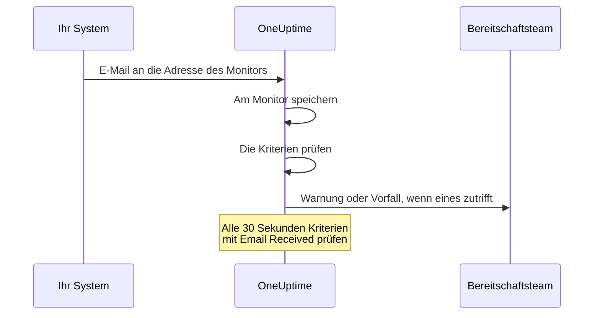

# Eingehende-E-Mail-Überwachung

Ein Monitor für eingehende E-Mails gibt Ihnen eine E-Mail-Adresse, die genau einem Monitor gehört. Alles, was E-Mails senden kann — ein Backup-Job, ein Altsystem, die Alarmierung eines Cloud-Anbieters — schickt seine Ergebnisse dorthin, und OneUptime prüft jede E-Mail gegen Ihre Kriterien, um den Monitor als ausgefallen zu markieren, einen Vorfall zu eröffnen oder eine Warnung zu erstellen und beides zu beheben, wenn die Entwarnung eintrifft.

:::cards
- [Den Monitor erstellen](#einen-monitor-für-eingehende-e-mails-erstellen): Eine Adresse erhalten und Ihren Absender darauf richten.
- [Die Adresse bestätigen](#die-adresse-beim-absender-bestätigen): Die Bestätigungs-E-Mail eines Absenders am Monitor lesen.
- [Kriterien schreiben](#verfügbare-filtertypen): Auf Betreff, Absender oder Text prüfen oder alarmieren, wenn keine E-Mail mehr kommt.
- [Die E-Mail in Warnungen verwenden](#vorlagenvariablen): Betreff und Text in Titel und Beschreibungen übernehmen.
:::

## So funktioniert es

E-Mail ist ein Push-Modell: Ihr System sendet, und OneUptime hört zu. Jede E-Mail wird bei ihrem Eintreffen gegen die Kriterien des Monitors geprüft. Kriterien, die nach E-Mails suchen, die hätten eintreffen *sollen*, werden außerdem nach Zeitplan geprüft, alle 30 Sekunden.



1. Wenn Sie einen Monitor für eingehende E-Mails erstellen, gibt OneUptime ihm eine eindeutige E-Mail-Adresse.
2. Jede an diese Adresse gesendete E-Mail wird am Monitor gespeichert und gegen seine Kriterien geprüft, von oben nach unten; das erste Kriterium, das zutrifft, entscheidet.
3. Ein zutreffendes Kriterium kann den Status des Monitors ändern, eine Warnung erstellen und einen Vorfall eröffnen. Ein Vorfall mit eingeschaltetem **Vorfall automatisch beheben** oder eine Warnung mit eingeschaltetem **Warnung automatisch beheben** wird behoben, wenn später ein anderes Kriterium zutrifft — zum Beispiel das, das den Monitor als online markiert.

## Einen Monitor für eingehende E-Mails erstellen

:::steps
### Einen neuen Monitor beginnen

Gehen Sie zu **Monitore** und klicken Sie auf **Monitor erstellen**.

### Incoming Email wählen

Klicken Sie unter **Monitortyp** auf **Weitere Monitortypen** und wählen Sie **Incoming Email** unter **Inbound Monitoring**, oder tippen Sie `email` in das Suchfeld. Geben Sie einen **Name** ein und klicken Sie dann auf **Weiter**.

### Die Kriterien prüfen

Der Schritt **Kriterien** beginnt mit [den Standardkriterien](#was-sie-von-anfang-an-bekommen), die den Monitor als offline markieren, wenn eine E-Mail `error` erwähnt. Klicken Sie auf ein Kriterium, um es zu ändern, oder auf **Kriterien hinzufügen**, um eines hinzuzufügen. Häufige Einrichtungen finden Sie unter [Beispielkonfigurationen](#beispielkonfigurationen).

### Den Monitor erstellen

Klicken Sie auf **Monitor erstellen**. Der Monitor öffnet sich auf seiner Seite **Übersicht**, wo die Karte **Adresse für eingehende E-Mails** die Adresse mit einer Kopierschaltfläche zeigt, bis die erste E-Mail eintrifft.

### E-Mails an die Adresse senden

Richten Sie Ihr System so ein, dass es seine Benachrichtigungen an die Adresse sendet. Wenn der Absender Sie zuerst bittet, die Adresse zu bestätigen, siehe [Die Adresse beim Absender bestätigen](#die-adresse-beim-absender-bestätigen).
:::

> [!NOTE]
> Die Adresse enthält den geheimen Schlüssel des Monitors, deshalb können sie nur Personen sehen, die Monitore bearbeiten dürfen. Alle anderen sehen, dass die Einrichtungsdetails verborgen sind.

## Format der E-Mail-Adresse

Jeder Monitor für eingehende E-Mails erhält eine eindeutige Adresse in diesem Format:

```text
monitor-{secret-key}@{inbound-domain}
```

Der geheime Schlüssel ist eine UUID, zum Beispiel `monitor-3f2b8c1e-5d4a-4f6b-9a7c-2e1d0b9f8a6c@inbound.yourdomain.com`. Nachdem die erste E-Mail eingetroffen ist, bleibt die Adresse auf der Seite **Übersicht** des Monitors in der Karte **Inbound email address**, neben dem Zeitpunkt der letzten E-Mail. Die Seite **Dokumentation** des Monitors zeigt sie ebenfalls.

## Die E-Mail-Adresse zurücksetzen oder anpassen

Öffnen Sie den Tab **Einstellungen** des Monitors. Die Karte **Adresse für eingehende E-Mails** zeigt die aktuelle Adresse und bietet zwei Wege, sie zu ersetzen:

| Aktion | Was sie bewirkt | Wann Sie sie verwenden |
| --- | --- | --- |
| **Adresse zurücksetzen** | Gibt dem Monitor eine neue, zufällig erzeugte Adresse `monitor-{secret-key}@{inbound-domain}`. Hat der Monitor eine angepasste Adresse, entfernt das Zurücksetzen sie. Sie werden vorher um Bestätigung gebeten. | Die Adresse ist bekannt geworden, oder Sie wollen abschneiden, was auch immer an sie sendet. |
| **Adresse anpassen** | Lässt Sie den Teil vor dem @ wählen, zum Beispiel `nightly-backups@{inbound-domain}`. Geben Sie ihn unter **Adressname** ein — Sie können den Namen tippen oder die ganze Adresse einfügen — und klicken Sie auf **Adresse speichern**. | Sie wollen eine Adresse, die Menschen wiedererkennen. |

Beide Aktionen zeigen am Ende die neue Adresse mit einer Kopierschaltfläche.

> [!WARNING]
> **Die alte Adresse funktioniert sofort nicht mehr**: An sie gesendete E-Mails werden ignoriert, aktualisieren Sie also jedes System, das E-Mails an diesen Monitor sendet.

Regeln für angepasste Adressen:

- 3 bis 64 Zeichen: Kleinbuchstaben, Ziffern, Punkte (`.`), Bindestriche (`-`) und Unterstriche (`_`), ohne zwei Punkte hintereinander. Sie muss mit einem Buchstaben oder einer Ziffer beginnen und enden. Großbuchstaben werden für Sie in Kleinbuchstaben umgewandelt.
- Die Domain ist immer die Domain des Servers für eingehende E-Mails.
- Der Name darf nicht schon von einem anderen Monitor verwendet werden. Alle Projekte auf dem Server teilen sich die Domain für eingehende E-Mails, der Name muss also über alle hinweg eindeutig sein.
- Namen der Form `monitor-{id}` und `workflow-{id}` sind für erzeugte Adressen reserviert. Postfachnamen, die zur Domain selbst gehören, sind ebenfalls reserviert: `abuse`, `admin`, `administrator`, `hostmaster`, `mailer-daemon`, `noc`, `postmaster`, `root`, `security` und `webmaster`.

Eine angepasste Adresse ist genauso ein Berechtigungsnachweis wie eine erzeugte: Wer sie kennt, kann E-Mails senden, die dieser Monitor prüft. Erzeugte Adressen sind praktisch nicht zu erraten, ein kurzer, naheliegender Name dagegen schon. Wählen Sie etwas schwer zu Erratendes, wenn Ihnen das wichtig ist.

API-Nutzer können dasselbe über die Monitor-API an einem bestehenden Monitor tun: Setzen Sie `incomingEmailCustomLocalPart` auf den Namen, um eine angepasste Adresse zu verwenden, oder auf `null`, um zur erzeugten zurückzukehren. Zurücksetzen heißt, im selben Update einen neuen `incomingEmailSecretKey` zu schreiben und `incomingEmailCustomLocalPart` auf `null` zu setzen.

## Die Adresse beim Absender bestätigen

Manche Dienste senden keine Warnungen an eine neue Adresse, bis jemand nachweist, dass er dort E-Mails lesen kann. Sie senden zuerst eine Bestätigungs-E-Mail, und die kommt wie jede andere E-Mail am Monitor an. So lesen Sie sie:

:::steps
### Die Adresse beim Dienst hinzufügen

Fügen Sie die Adresse des Monitors beim Dienst hinzu und speichern Sie. Der Dienst sendet seine Bestätigungs-E-Mail.

### Die neueste E-Mail öffnen

Öffnen Sie in OneUptime den Monitor. Auf seiner Seite **Übersicht** zeigt die Karte **Monitor-Zusammenfassung** die neueste E-Mail. Prüfen Sie, dass **Von** und **Betreff** zur Bestätigungs-E-Mail gehören, und klicken Sie dann auf **Weitere Details anzeigen**.

### Den Code oder den Link kopieren

Der Code oder der Link steht in **E-Mail-Text (Text)**. **E-Mail-Text (HTML)** zeigt den HTML-Quelltext, wenn Sie einen Link also von dort kopieren, ändern Sie darin jedes `&amp;` in `&`.

### Die Bestätigung abschließen

Schließen Sie die Bestätigung so ab, wie es die E-Mail beschreibt.
:::

Ist seitdem eine weitere E-Mail eingetroffen, zeigt die Karte die Bestätigungs-E-Mail nicht mehr. Öffnen Sie **Überwachungsprotokolle**, suchen Sie die Bestätigungs-E-Mail anhand ihres Betreffs in der Spalte **E-Mail** und klicken Sie in dieser Zeile auf **Zusammenfassung anzeigen**.

> [!IMPORTANT]
> **Auch Ihre Kriterien sehen sie.** Die Bestätigungs-E-Mail wird wie jede andere E-Mail geprüft. Eine Formulierung wie "if you received this in error" trifft auf das Standardkriterium `error` zu und markiert den Monitor als offline. Um das zu vermeiden, schalten Sie während der Bestätigung **Diesen Monitor prüfen** in der Karte **Überwachung** auf der Seite **Einstellungen** des Monitors aus (Sie werden um Bestätigung gebeten). Ein Monitor mit ausgeschalteter Überwachung speichert die E-Mail trotzdem, und die Karte **Monitor-Zusammenfassung** zeigt sie weiterhin. Er prüft aber nichts, die E-Mail bekommt also keine Zeile in **Überwachungsprotokolle**: Lesen Sie sie, bevor eine weitere E-Mail eintrifft. Wenn Sie fertig sind, klicken Sie im Banner oben auf den Seiten des Monitors auf **Überwachung einschalten**, oder schalten Sie den Schalter wieder ein.

**Die Bestätigung gehört zur Adresse.** Wenn Sie [die Adresse zurücksetzen oder anpassen](#die-e-mail-adresse-zurücksetzen-oder-anpassen), sieht der Dienst einen neuen Empfänger, und Sie müssen erneut bestätigen.

### Azure Monitor action groups

Seit Juli 2026 führt Azure schrittweise die Anforderung ein, dass jeder neue Empfänger vom Typ **Email** in einer Aktionsgruppe mit einem Einmalcode bestätigt wird. Bis dahin sendet die Aktionsgruppe dieser Adresse keine Warnungen und keine Testbenachrichtigungen.

:::steps
1. Fügen Sie der Aktionsgruppe eine Benachrichtigung vom Typ **Email** mit der Adresse des Monitors hinzu und speichern Sie die Aktionsgruppe. Azure sendet die Bestätigungs-E-Mail von einer Microsoft-Adresse wie `azure-noreply@microsoft.com`.
2. Lesen Sie sie am Monitor wie oben beschrieben und folgen Sie ihren Anweisungen innerhalb von 30 Minuten nach dem Speichern der Aktionsgruppe. Läuft der Code ab, öffnen Sie die Aktionsgruppe und wählen Sie **Resend**.
3. Öffnen Sie die Aktionsgruppe und wählen Sie **Test**, um eine Testbenachrichtigung zu senden. Sie kommt am Monitor wie eine echte Warnung an und zeigt also auch, ob Ihre Kriterien auf die E-Mails von Azure zutreffen.
:::

Die Bestätigung gilt für jede Aktionsgruppe im selben Azure-Mandanten, jede Adresse muss also nur einmal bestätigt werden.

### Amazon SNS

Ein E-Mail-Abonnement eines SNS-Themas erhält nichts, bis es bestätigt ist. Wenn Sie das Abonnement anlegen, sendet Amazon SNS eine Bestätigungs-E-Mail an die Adresse. Lesen Sie sie am Monitor wie oben beschrieben und öffnen Sie ihren Link **Confirm subscription** in Ihrem Browser. SNS löscht ein Abonnement, das nicht innerhalb von 48 Stunden bestätigt wird; legen Sie das Abonnement in diesem Fall erneut an.

## Was Sie von Anfang an bekommen

Ein neuer Monitor für eingehende E-Mails wird mit zwei Kriterien erstellt, die den E-Mail-Text lesen:

| Kriterium | Filtertyp | Filterbedingung | Wert | Wirkung |
| -------- | ----------- | ---------------- | ------- | -------------------------------------------- |
| Offline  | Email Body  | Enthält | `error` | Markiert den Monitor als offline, eröffnet einen Vorfall |
| Online   | Email Body  | Not Contains | `error` | Markiert den Monitor als online |

Das passt zum häufigen Fall, dass ein Job oder ein Werkzeug eines Drittanbieters sein eigenes Ergebnis per E-Mail meldet: Eine Nachricht, deren Text `error` erwähnt, nimmt den Monitor offline, und die nächste Nachricht ohne das Wort bringt ihn wieder online und behebt den Vorfall. Der Textvergleich beachtet die Groß- und Kleinschreibung nicht, `Error` und `ERROR` treffen also ebenfalls zu.

Ändern Sie den Wert auf das, was Ihr Absender tatsächlich schreibt (`FAILED`, `exit code 1` und so weiter).

> [!NOTE]
> Diese Standardkriterien sind **kein** Totmannschalter: Nichts davon löst aus, wenn keine E-Mails mehr kommen. Kriterien, die nur Betreff, Absender, Text oder Empfänger lesen, werden geprüft, wenn eine E-Mail eintrifft, und zu keinem anderen Zeitpunkt. Um bei Stille alarmiert zu werden, fügen Sie ein Kriterium **Email Received** / **Not Recieved In Minutes** hinzu — siehe [Beispiel 3](#beispiel-3-heartbeat-monitor-keine-e-mail-warnung).

## Verfügbare Filtertypen

Sie können Kriterien auf Grundlage dieser E-Mail-Felder erstellen:

| Filtertyp | Beschreibung |
| ------------------------- | ----------------------------------------------------------------------------------- |
| **E-Mail-Betreff** | Die Betreffzeile der eingehenden E-Mail |
| **Email From Address** | Die Adresse des Absenders: die reine Adresse, kleingeschrieben, ohne Anzeigenamen |
| **Email Body** | Der Klartextteil des E-Mail-Texts |
| **Email To Address** | Die Adresse des Empfängers |
| **Email Received** | Zeitbasierte Kriterien dafür, wann E-Mails eintreffen |
| **JavaScript Expression** | Ein eigener JavaScript-Ausdruck, der wahr ergeben muss |

Die eigene Adresse des Monitors wird maskiert, bevor ein Kriterium die E-Mail liest, in **Email To Address**, **E-Mail-Betreff** und **Email Body** steht also `[REDACTED]`.

## Filterbedingungen

### Zeichenkettenfilter (Betreff, Absender, Text, Empfänger)

| Filterbedingung | Beschreibung | Beispiel |
| ---------------- | ----------------------------------------- | ---------------------------------- |
| **Enthält** | Das Feld enthält den angegebenen Text | Betreff enthält "CRITICAL" |
| **Not Contains** | Das Feld enthält den angegebenen Text nicht | Betreff enthält nicht "TEST" |
| **Equal To** | Das Feld entspricht genau dem angegebenen Text | Absender gleich "alerts@service.com" |
| **Not Equal To** | Das Feld entspricht nicht dem angegebenen Text | Betreff ungleich "OK" |
| **Starts With** | Das Feld beginnt mit dem angegebenen Text | Betreff beginnt mit "[ALERT]" |
| **Ends With** | Das Feld endet mit dem angegebenen Text | Betreff endet mit "- Production" |
| **Is Empty** | Das Feld ist leer | Text ist leer |
| **Is Not Empty** | Das Feld hat Inhalt | Betreff ist nicht leer |

Alle diese Vergleiche beachten die Groß- und Kleinschreibung nicht. Ein Filter mit leerem Wert trifft nie zu.

### Zeitbasierte Filter (Email Received)

Das Dashboard schreibt diese Bedingungen "Recieved".

| Filterbedingung | Beschreibung | Beispiel |
| --------------------------- | ----------------------------------- | -------------------------------- |
| **Recieved In Minutes** | Innerhalb von X Minuten ging eine E-Mail ein | E-Mail in 30 Minuten eingegangen |
| **Not Recieved In Minutes** | In X Minuten ging keine E-Mail ein | Keine E-Mail in 60 Minuten eingegangen |

Ein Monitor, der noch nie eine E-Mail erhalten hat, zählt seine Erstellungszeit als letzte E-Mail.

### JavaScript Expression

| Filterbedingung | Beschreibung |
| --------------------- | ------------------------------------- |
| **Evaluates To True** | Der Ausdruck liefert einen wahren Wert |

Der Ausdruck läuft in einer Sandbox, an die keine E-Mail-Felder gebunden sind, er kann also Betreff, Absender, Text oder Empfänger der auslösenden Nachricht nicht lesen. Verwenden Sie die Filtertypen **E-Mail-Betreff**, **Email From Address**, **Email Body** und **Email To Address**, um auf den Inhalt der E-Mail zu prüfen.

## Beispielkonfigurationen

Jedes Beispiel ist ein Paar von Kriterien. Ein Kriterium hat Filter, eine **Abgleichsbedingung** (**Alle** oder **Beliebig** seiner Filter) und Aktionen: den Status des Monitors ändern, eine Warnung erstellen, einen Vorfall eröffnen. Schalten Sie **Warnung automatisch beheben** (oder **Vorfall automatisch beheben**) unter **Weitere Felder** in der Warnung oder im Vorfall ein, damit das zweite Kriterium behebt, was das erste eröffnet hat.

### Beispiel 1: Warnung bei kritischen E-Mails erstellen

| Kriterium | Filter | Abgleichsbedingung | Aktionen |
| --- | --- | --- | --- |
| Kritische E-Mail | **E-Mail-Betreff** Enthält `CRITICAL`; **E-Mail-Betreff** Enthält `ALERT`; **E-Mail-Betreff** Enthält `ERROR` | **Beliebig** | Den Status auf offline ändern; eine Warnung erstellen |
| Entwarnungs-E-Mail | **E-Mail-Betreff** Enthält `RESOLVED`; **E-Mail-Betreff** Enthält `RECOVERED` | **Beliebig** | Den Status auf online ändern |

Setzen Sie das kritische Kriterium an den Anfang: Kriterien werden von oben geprüft, und das erste, das zutrifft, entscheidet.

### Beispiel 2: Einen bestimmten Absender überwachen

| Kriterium | Filter | Abgleichsbedingung | Aktionen |
| --- | --- | --- | --- |
| Fehlgeschlagener Job | **Email From Address** Equal To `monitoring@legacy-system.com`; **E-Mail-Betreff** Enthält `Failed` | **Alle** | Den Status auf offline ändern; einen Vorfall eröffnen |
| Erfolgreicher Job | **Email From Address** Equal To `monitoring@legacy-system.com`; **E-Mail-Betreff** Enthält `Success` | **Alle** | Den Status auf online ändern |

### Beispiel 3: Heartbeat-Monitor (keine E-Mail = Warnung)

| Kriterium | Filter | Aktionen |
| --- | --- | --- |
| E-Mail ist überfällig | **Email Received** Not Recieved In Minutes `60` | Den Status auf offline ändern; eine Warnung erstellen |
| E-Mail ist eingetroffen | **Email Received** Recieved In Minutes `60` | Den Status auf online ändern |

Das erste Kriterium löst aus, wenn 60 Minuten lang keine E-Mail eingetroffen ist — nützlich für geplante Jobs oder Stapelprozesse, die eine Abschluss-E-Mail senden. Das zweite behebt die Warnung, sobald eine eintrifft. Minuten, in denen OneUptime selbst keine E-Mails empfangen hat, zählen nicht zu den 60, wie [Wenn OneUptime keine Daten empfängt](/docs/monitor/when-oneuptime-is-not-receiving) erklärt.

## Anwendungsfälle

| Anwendungsfall | Was der Monitor tut |
| --- | --- |
| Anbindung von Altsystemen | Macht aus reinen E-Mail-Warnungen älterer Systeme OneUptime-Vorfälle und behebt sie, wenn die Entwarnungs-E-Mail eintrifft. |
| Dienste von Drittanbietern | Empfängt Benachrichtigungen von Cloud-Anbietern (AWS, GCP, Azure), Sicherheitsscannern, Backup-Werkzeugen und Warnungen zu ablaufenden Zertifikaten. |
| Geplante Jobs | Alarmiert, wenn eine Abschluss-E-Mail überfällig ist oder ein Job einen Fehlschlag meldet. |
| Bündelung von Warnungen | Sammelt E-Mail-Warnungen aus Nagios, Zabbix oder anderen Werkzeugen, sodass OneUptime der eine Ort ist, an dem Sie sie verwalten. |

## Vorlagenvariablen

Titel, Beschreibungen und Behebungshinweise der Warnungen und Vorfälle, die dieser Monitor erstellt, können diese Variablen verwenden. Die Warnungs- und Vorfallformulare des Kriteriums listen sie unter **Vorlagenvariablen** auf, und [Vorfall- & Warnmeldungsvorlagen](/docs/monitor/incident-alert-templating) erklärt die Syntax.

| Variable | Beschreibung |
| --------------------- | ----------------------------------------------------------------- |
| `{{emailSubject}}`    | Der Betreff der empfangenen E-Mail |
| `{{emailFrom}}`       | Die E-Mail-Adresse des Absenders |
| `{{emailTo}}`         | An wen die E-Mail ging, mit maskierter eigener Adresse dieses Monitors |
| `{{emailBody}}`       | Der Klartext der E-Mail |
| `{{emailReceivedAt}}` | Wann die E-Mail empfangen wurde, als ISO-8601-Zeitstempel in UTC |

- **Ein Titel bekommt je eine Zeile.** In einem Titel wird jede Variable auf eine Zeile mit höchstens 150 Zeichen gekürzt und endet mit `...`, wenn sie länger war. Ein Titel darf nicht länger als 500 Zeichen sein, und eine Warnung oder ein Vorfall mit zu langem Titel wird gar nicht erstellt, eine ganze E-Mail zu zitieren würde den Monitor also daran hindern, auf lange E-Mails zu alarmieren. Beschreibungen und Behebungshinweise bekommen den vollständigen Wert.
- **Die Adresse dieses Monitors ist maskiert.** Die Adresse wirkt wie ein Passwort, deshalb wird sie maskiert, bevor die E-Mail gespeichert wird, und `{{emailTo}}` lautet `monitor-[REDACTED]@{inbound-domain}` (oder `[REDACTED]@{inbound-domain}` bei einer angepassten Adresse).
- **Eine Prüfung auf fehlende E-Mails verwendet die letzte E-Mail.** Wenn ein Kriterium **Email Received** eine Warnung eröffnet, weil keine E-Mail rechtzeitig kam, beschreiben die Variablen die letzte E-Mail, die der Monitor erhalten hat. Sie sind leer, wenn noch keine eingetroffen ist.

## Ansicht Monitor-Zusammenfassung

Sobald der Monitor eine E-Mail erhalten hat, zeigt die Karte **Monitor-Zusammenfassung** auf seiner Seite **Übersicht** die neueste:

- **Letzte E-Mail empfangen am**: Wann die neueste E-Mail empfangen wurde
- **Von**: Der Absender der letzten E-Mail
- **Betreff**: Die Betreffzeile der letzten E-Mail

Klicken Sie auf **Weitere Details anzeigen**, um den Rest zu sehen:

- **E-Mail-Header**: Die vollständigen Header der letzten E-Mail
- **E-Mail-Text (Text)**: Der Klartext
- **E-Mail-Text (HTML)**: Der HTML-Text, als HTML-Quelltext angezeigt statt gerendert

### Frühere E-Mails

Die Karte zeigt nur die neueste E-Mail. Jede E-Mail, die der Monitor prüft, wird außerdem in **Überwachungsprotokolle** geschrieben: Die Spalte **E-Mail** zeigt ihren Betreff und Absender, und **Zusammenfassung anzeigen** in ihrer Zeile zeigt die ganze E-Mail so wie die Karte. Ein Monitor mit ausgeschalteter Überwachung prüft nichts, die E-Mails, die er erhält, bekommen also keine Zeilen. Prüft eines Ihrer Kriterien **Email Received**, schreibt der Monitor außerdem bei jeder Prüfung auf fehlende E-Mails eine Zeile. Die Spalte **E-Mail** zeigt in diesen Zeilen "Scheduled check", und ihre **Zusammenfassung anzeigen** zeigt die zum Zeitpunkt der Prüfung neueste E-Mail oder "No email yet", falls keine eingetroffen war. Überwachungsprotokolle werden standardmäßig einen Tag lang aufbewahrt. Auf einem selbst gehosteten Server kann ein Administrator das mit **Aufbewahrung der Überwachungsprotokolle (Tage)** in den Einstellungen des Admin-Dashboards ändern.

## Selbst gehostete Einrichtung

Wenn Sie OneUptime selbst hosten, müssen Sie einen Anbieter für eingehende E-Mails konfigurieren. Derzeit unterstützt:

- **SendGrid Inbound Parse** - Die Einrichtung beschreibt [SendGrid Inbound E-Mail](/docs/self-hosted/sendgrid-inbound-email)

Solange er nicht eingerichtet ist, meldet die Adresskarte des Monitors, dass eingehende E-Mails nicht konfiguriert sind.

## Zu beachten

- **Sicherheit der E-Mail-Adresse**: Die E-Mail-Adresse des Monitors wirkt wie ein Passwort: Wer sie kennt, kann E-Mails an den Monitor senden. Geben Sie sie nicht öffentlich weiter und setzen Sie sie im Tab **Einstellungen** des Monitors zurück, wenn sie bekannt wird.
- **E-Mail-Größe**: OneUptime nimmt eine eingehende E-Mail bis 50 MB an, Anhänge eingeschlossen. Anhänge werden nicht gespeichert — nur ihre Namen, Typen und Größen.
- **Verarbeitungszeit**: E-Mails werden asynchron verarbeitet. Zwischen dem Senden einer E-Mail und dem Erstellen der Warnung können einige Sekunden liegen.
- **Groß- und Kleinschreibung**: Alle Zeichenkettenvergleiche (Enthält, Equal To usw.) beachten die Groß- und Kleinschreibung nicht.
- **Klartext**: Kriterien auf den E-Mail-Text lesen den Klartextteil der E-Mail. Eine nur als HTML gesendete E-Mail hat für Kriterien einen leeren Text — sie enthält also kein `error`, und die Standardkriterien markieren den Monitor als online.

## Fehlerbehebung

### E-Mails kommen nicht an

1. Prüfen Sie, ob die E-Mail-Adresse stimmt (auf Tippfehler achten).
2. Prüfen Sie, ob der Absender darauf wartet, dass Sie die Adresse bestätigen. Azure-Monitor-Aktionsgruppen und Amazon SNS senden an eine neue Adresse nichts, bis sie bestätigt ist. Siehe [Die Adresse beim Absender bestätigen](#die-adresse-beim-absender-bestätigen).
3. Prüfen Sie, ob die E-Mail von Spamfiltern blockiert wird.
4. Prüfen Sie, ob Ihr Anbieter für eingehende E-Mails richtig konfiguriert ist.
5. Sehen Sie in den OneUptime-Protokollen nach Fehlermeldungen.

### Warnungen werden nicht erstellt

1. Prüfen Sie, ob Ihre Kriterien auf den Inhalt der E-Mail zutreffen. Denken Sie daran, dass die eigene Adresse des Monitors `[REDACTED]` lautet und eine reine HTML-E-Mail einen leeren Text hat.
2. Prüfen Sie, ob die Überwachung eingeschaltet ist: Seite **Einstellungen** des Monitors, Karte **Überwachung**.
3. Öffnen Sie **Überwachungsprotokolle** und klicken Sie in der Zeile der E-Mail auf **Zusammenfassung anzeigen**, um zu sehen, was die Kriterien gelesen haben.
4. Prüfen Sie die Reihenfolge Ihrer Kriterien: Das erste, das zutrifft, entscheidet.

### Warnungen werden nicht behoben

1. Prüfen Sie, ob Ihre Behebungskriterien auf die Entwarnungs-E-Mail zutreffen.
2. Prüfen Sie, ob **Warnung automatisch beheben** (oder **Vorfall automatisch beheben**) in dem Kriterium eingeschaltet ist, das sie eröffnet hat.
3. Prüfen Sie, ob die Entwarnungs-E-Mail an dieselbe Monitoradresse gesendet wird.

## Nächste Schritte

:::cards
- [Vorfall- & Warnmeldungsvorlagen](/docs/monitor/incident-alert-templating): Betreff und Text der E-Mail in Warnungen übernehmen.
- [Eingehende-Anfrage-Überwachung](/docs/monitor/incoming-request-monitor): Heartbeats und Webhooks stattdessen über HTTP empfangen.
- [SendGrid Inbound E-Mail](/docs/self-hosted/sendgrid-inbound-email): Eingehende E-Mails auf einem selbst gehosteten Server einrichten.
:::
