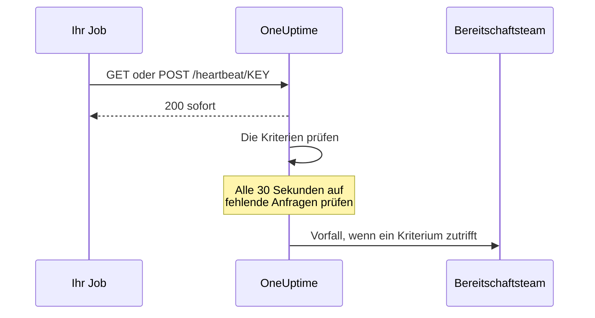

# Eingehende-Anfrage-Überwachung

Ein Monitor für eingehende Anfragen gibt Ihnen eine URL, an die andere Systeme HTTP-Anfragen senden. OneUptime prüft jede Anfrage gegen Ihre Kriterien und kann den Status des Monitors ändern, Vorfälle eröffnen und Ihre Bereitschaft benachrichtigen.

Er deckt zwei verschiedene Aufgaben ab:

- **Heartbeat-Überwachung** — ein Cronjob, ein Worker oder ein Gerät ruft die URL nach Zeitplan auf, und OneUptime eröffnet einen Vorfall, wenn die Aufrufe ausbleiben.
- **Warnungen aus einem anderen System empfangen** — Prometheus Alertmanager, Grafana oder alles andere, was JSON per POST senden kann, schickt Warnungen herein, und OneUptime macht aus jeder einen Vorfall mit Bereitschaftseskalation und automatischer Behebung bei Erholung.

Beide verwenden denselben Monitortyp. Was sie unterscheidet, sind die Kriterien, die Sie konfigurieren.

:::cards
- [Den Monitor erstellen](#einen-monitor-für-eingehende-anfragen-erstellen): In wenigen Schritten eine Heartbeat-URL erhalten.
- [Einen Heartbeat senden](#einen-heartbeat-senden): Aus curl, Cron, Node.js, Python oder Go.
- [Alarmieren, wenn Aufrufe ausbleiben](#als-offline-markieren-wenn-10-minuten-kein-heartbeat-kommt-ein-totmannschalter): Den Monitor zu einem Totmannschalter machen.
- [Warnungen empfangen](#warnungen-aus-einem-anderen-system-empfangen): Ein Vorfall pro Alertmanager- oder Grafana-Warnung.
:::

## So funktioniert es

Nichts prüft Ihr System von außen: Ihr System ruft die URL des Monitors auf, OneUptime antwortet sofort und prüft die Anfrage dann gegen die Kriterien des Monitors. Ein Kriterium, das auf Anfragen prüft, die *ausgeblieben* sind, wird außerdem alle 30 Sekunden im Hintergrund erneut geprüft, sodass auch Stille einen Vorfall auslösen kann.



Verwenden Sie ihn, um:

- Cronjobs und geplante Aufgaben zu überwachen
- zu prüfen, dass Hintergrund-Worker laufen
- Dienste hinter Firewalls zu überwachen, die von außen nicht erreichbar sind
- Warnungen von Prometheus Alertmanager, Grafana und anderen Alarmsystemen zu empfangen
- Heartbeat-Signale von jedem HTTP-fähigen System zu verfolgen

## Einen Monitor für eingehende Anfragen erstellen

:::steps
### Einen neuen Monitor beginnen

Gehen Sie zu **Monitore** und klicken Sie auf **Monitor erstellen**.

### Eingehende Anfrage wählen

Wählen Sie unter **Monitortyp** die Option **Eingehende Anfrage** — sie ist einer der häufigen Typen ganz oben. Geben Sie einen **Name** ein und klicken Sie dann auf **Weiter**.

### Die Kriterien prüfen

Der Schritt **Kriterien** beginnt mit [den Standardkriterien](#was-sie-von-anfang-an-bekommen). Für einen Heartbeat klicken Sie auf **Kriterien hinzufügen** und geben dem neuen Kriterium einen Filter **Eingehende Anfrage** / **Not Recieved In Minutes**, der den Status auf offline ändert und einen Vorfall eröffnet, mit eingeschaltetem **Vorfall automatisch beheben**. Ziehen Sie es dann an den Anfang der Liste — warum, steht unter [Beispielkriterien](#beispielkriterien).

### Den Monitor erstellen

Klicken Sie auf **Monitor erstellen**. Der Monitor öffnet sich auf seiner Seite **Übersicht**, wo die Karte **Den ersten Heartbeat senden** die **Heartbeat-URL** mit einer Kopierschaltfläche und einen `curl`-Beispielbefehl zeigt.

### Die erste Anfrage senden

Richten Sie Ihren Dienst so ein, dass er Anfragen an diese URL sendet (siehe [Einen Heartbeat senden](#einen-heartbeat-senden)). Sobald die erste Anfrage eintrifft, macht die Karte der Historie des Monitors Platz, und eine Karte **Heartbeat-URL** zeigt die URL und wann die letzte Anfrage kam.
:::

> [!NOTE]
> Die URL enthält den geheimen Schlüssel des Monitors, deshalb können sie nur Personen sehen, die Monitore bearbeiten dürfen. Sie finden sie jederzeit wieder auf der Seite **Dokumentation** des Monitors, im Abschnitt **Konfiguration** seines Seitenmenüs.

## Die Anfrage-URL

Ihr Monitor hat eine eindeutige URL in diesem Format:

```text
https://oneuptime.com/heartbeat/YOUR_SECRET_KEY
```

Ersetzen Sie `https://oneuptime.com` durch die URL Ihrer OneUptime-Instanz, wenn Sie selbst hosten.

Senden Sie **GET**- oder **POST**-Anfragen an diese URL. HEAD wird angenommen und wie GET behandelt; PUT, PATCH und DELETE liefern 404. Der geheime Schlüssel im Pfad ist der einzige Berechtigungsnachweis — kein Header und kein Token ist nötig. Query-Strings werden ignoriert: Senden Sie, was Kriterien lesen sollen, im Body oder in den Headern.

> [!WARNING]
> Jeder, der diese URL kennt, kann den Monitor als gesund markieren, behandeln Sie sie also als Geheimnis. Wird sie bekannt, öffnen Sie die Seite **Einstellungen** des Monitors und klicken Sie auf **Geheimen Schlüssel für eingehende Anfragen zurücksetzen**, und aktualisieren Sie dann jeden Absender. Jeder Header, den Sie senden, wird am Monitor gespeichert und ist für jeden sichtbar, der ihn lesen darf — senden Sie an diesen Endpunkt keine API-Schlüssel oder Tokens in Headern.

> [!IMPORTANT]
> OneUptime antwortet sofort mit `200` und einem leeren JSON-Objekt (`{}`) und verarbeitet die Anfrage über eine Warteschlange. Diese Antwort wird geschrieben, bevor irgendeine Prüfung stattfindet, ein `200` ist also **keine** Bestätigung, dass die Anfrage angenommen wurde — ein falscher geheimer Schlüssel, ein gelöschter Monitor und ein deaktivierter Monitor liefern ebenfalls `200`. Prüfen Sie in der Zeitleiste des Monitors, ob Anfragen ankommen.

### Einen Anfragetext senden

Wenn Sie Felder im Body ansprechen wollen — `{{requestBody.status}}` in einem Vorfalltitel, einen JSON-Pfad bei der Vorfallgruppierung oder ein Kriterium mit JavaScript-Ausdruck —, senden Sie `Content-Type: application/json`. Davon gehen diese Seiten durchgehend aus. Der Body muss ein JSON-Objekt oder -Array sein: fehlerhaftes JSON oder ein bloßer Wert wie `"error"` wird mit `500` abgelehnt.

| Content-Type | Was Kriterien und Vorlagen sehen |
| --- | --- |
| `application/json` | Das geparste JSON. |
| `application/x-www-form-urlencoded` | Das geparste Formular. Schlüssel in eckigen Klammern werden verschachtelt (`alerts[0][status]=firing`), und jeder Wert ist eine Zeichenkette. |
| Alles andere oder keiner | Ein leerer Body (`{}`), jeder Verweis auf `requestBody` ergibt also nichts. |

Bodys bis 50 MB werden angenommen; ein größerer wird mit `413` abgelehnt. Komprimieren Sie den Body nicht mit `Content-Encoding: gzip`: Er wird dann nicht als JSON gespeichert, und Pfade darin werden nicht aufgelöst.

### Einen Heartbeat senden

Jedes Beispiel sendet eine Anfrage. Ersetzen Sie `YOUR_SECRET_KEY` durch den Schlüssel aus der URL Ihres Monitors.

:::tabs
@tab curl
```bash
# Simple GET request
curl https://oneuptime.com/heartbeat/YOUR_SECRET_KEY

# POST request with a JSON body
curl -X POST https://oneuptime.com/heartbeat/YOUR_SECRET_KEY \
  -H "Content-Type: application/json" \
  -d '{"status": "healthy", "version": "1.2.3"}'
```
@tab Cron
```bash
# Send a heartbeat every 5 minutes
*/5 * * * * curl -fsS https://oneuptime.com/heartbeat/YOUR_SECRET_KEY > /dev/null

# Or ping only when the job succeeds, so a failed run counts as a missed heartbeat
0 2 * * * /usr/local/bin/backup.sh && curl -fsS https://oneuptime.com/heartbeat/YOUR_SECRET_KEY > /dev/null
```
@tab Node.js
```javascript title="heartbeat.mjs"
// Node.js 18 or later: fetch is built in. Run with `node heartbeat.mjs`.
const response = await fetch(
  "https://oneuptime.com/heartbeat/YOUR_SECRET_KEY",
  {
    method: "POST",
    headers: { "Content-Type": "application/json" },
    body: JSON.stringify({ status: "healthy", version: "1.2.3" }),
  },
);

console.log(response.status); // 200
```
@tab Python
```python title="heartbeat.py"
# Python 3, standard library only. Run with `python3 heartbeat.py`.
import json
import urllib.request

request = urllib.request.Request(
    "https://oneuptime.com/heartbeat/YOUR_SECRET_KEY",
    data=json.dumps({"status": "healthy", "version": "1.2.3"}).encode(),
    headers={"Content-Type": "application/json"},
    method="POST",
)

with urllib.request.urlopen(request, timeout=10) as response:
    print(response.status)  # 200
```
@tab Go
```go title="heartbeat.go"
// Run with `go run heartbeat.go`.
package main

import (
	"bytes"
	"fmt"
	"net/http"
)

func main() {
	body := []byte(`{"status": "healthy", "version": "1.2.3"}`)

	resp, err := http.Post(
		"https://oneuptime.com/heartbeat/YOUR_SECRET_KEY",
		"application/json",
		bytes.NewReader(body),
	)
	if err != nil {
		panic(err)
	}
	defer resp.Body.Close()

	fmt.Println(resp.StatusCode) // 200
}
```
@tab PowerShell
```powershell
# Windows PowerShell 5.1 or PowerShell 7
Invoke-RestMethod -Method Post `
  -Uri "https://oneuptime.com/heartbeat/YOUR_SECRET_KEY" `
  -ContentType "application/json" `
  -Body '{"status": "healthy", "version": "1.2.3"}'
```
:::

## Überwachungskriterien

Sie können Kriterien festlegen, die bestimmen, wann Ihr Dienst als online, beeinträchtigt oder offline gilt. Jeder Kriterienfilter hat einen **Filtertyp** (was betrachtet wird), eine **Filterbedingung** (wie verglichen wird) und einen **Wert**.

### Was Sie von Anfang an bekommen

Ein neuer Monitor für eingehende Anfragen wird mit zwei Kriterien erstellt, die den Anfragetext lesen:

| Kriterium | Filtertyp | Filterbedingung | Wert | Wirkung |
| -------- | ------------ | ---------------- | ------- | -------------------------------------------- |
| Offline  | Anfragetext | Enthält | `error` | Markiert den Monitor als offline, eröffnet einen Vorfall |
| Online   | Anfragetext | Not Contains | `error` | Markiert den Monitor als online |

Das passt zum häufigen Fall, dass der Absender seinen eigenen Zustand in der Nutzlast meldet: Eine Anfrage, deren Body `error` erwähnt, nimmt den Monitor offline, und die nächste Anfrage ohne das Wort bringt ihn wieder online und behebt den Vorfall. Eine Anfrage ganz ohne Body gilt als "enthält nicht `error`", ein einfacher Heartbeat-Aufruf hält den Monitor also online.

Ändern Sie den Wert auf das, was Ihr Absender tatsächlich schickt (`"status":"firing"`, `FAILED` und so weiter) — der Vergleich ist eine Teilzeichenkettensuche mit Beachtung der Groß- und Kleinschreibung über den ganzen Body, Schlüssel eingeschlossen, also trifft auch `{"error":null}` auf `error` zu.

> [!NOTE]
> Diese Standardkriterien sind **kein** Totmannschalter: Nichts davon löst aus, wenn keine Anfragen mehr kommen. Wenn Sie bei Stille alarmiert werden wollen, fügen Sie ein Kriterium **Eingehende Anfrage** / **Not Recieved In Minutes** hinzu, wie unten beschrieben.

### Verfügbare Filtertypen

| Filtertyp | Prüft | Hinweise |
| --------------------- | ------------------------------------------------------ | -------------------------------------------------------------------------------------------- |
| Eingehende Anfrage | Ob in einem Zeitfenster eine Anfrage einging | Die einzige Prüfung, die auslösen kann, wenn nichts ankommt |
| Anfragetext | Den Body der Anfrage | Teilzeichenkettensuche. Objekt-Bodys werden als kompaktes JSON verglichen |
| Request Header | Die Namen der Anfrage-Header | Exakter Vergleich mit einem ganzen Header-Namen, ohne Beachtung der Groß- und Kleinschreibung |
| Request Header Value | Die Werte der Anfrage-Header | Exakter Vergleich mit einem ganzen Header-Wert, ohne Beachtung der Groß- und Kleinschreibung |
| JavaScript Expression | Jeden Ausdruck über `requestBody` und `requestHeaders` | Die flexibelste Option — siehe [JavaScript-Ausdrücke](/docs/monitor/javascript-expression) |

### Filterbedingungen

Jeder Filtertyp bietet eigene Bedingungen:

| Filtertyp | Bedingungen |
| --- | --- |
| **Eingehende Anfrage** | **Recieved In Minutes** — innerhalb der angegebenen Zahl von Minuten ging eine Anfrage ein. **Not Recieved In Minutes** — innerhalb der angegebenen Zahl von Minuten ging keine Anfrage ein. (Das Dashboard schreibt sie so.) |
| **Anfragetext**, **Request Header**, **Request Header Value** | **Enthält** und **Not Contains** |
| **JavaScript Expression** | **Evaluates To True** |

> [!NOTE]
> Header-Namen und -Werte werden kleingeschrieben verglichen, gegen den ganzen Namen oder Wert, nicht als Teilzeichenkette: `application/json` trifft nicht auf `application/json; charset=utf-8` zu. Nur **Anfragetext** sucht nach Teilzeichenketten. Header, die Ihr Proxy oder der Load Balancer von OneUptime hinzufügt (`x-forwarded-for`, `x-real-ip`), werden ebenfalls gespeichert.

Objekt-Bodys werden als kompaktes JSON ohne Leerzeichen verglichen, ein Filter **Anfragetext** / **Enthält** muss also `"status":"firing"` lauten — wer `"status": "firing"` aus einer formatierten Nutzlast kopiert, wird nie einen Treffer erhalten.

### Beispielkriterien

#### Als offline markieren, wenn 10 Minuten kein Heartbeat kommt (ein Totmannschalter)

| Feld | Wert |
| --- | --- |
| **Filtertyp** | Eingehende Anfrage |
| **Filterbedingung** | Not Recieved In Minutes |
| **Wert** | `10` |

#### Anhand des Anfragetexts als beeinträchtigt markieren

| Feld | Wert |
| --- | --- |
| **Filtertyp** | Anfragetext |
| **Filterbedingung** | Enthält |
| **Wert** | `"status":"degraded"` |

> [!IMPORTANT]
> Setzen Sie den Totmannschalter **über** die Standardkriterien. Kriterien werden von oben geprüft, und das erste, das zutrifft, entscheidet. Die Prüfung im Hintergrund liest die letzte Anfrage erneut, das Online-Standardkriterium — "Request Body Not Contains `error`" — trifft also weiter darauf zu, und ein Kriterium darunter kommt nie an die Reihe. **Kriterien hinzufügen** fügt ein Kriterium unten an: Ziehen Sie es nach oben.

> [!WARNING]
> Ein Monitor wird nur dann im Hintergrund erneut geprüft, wenn mindestens eines seiner Kriterien **Eingehende Anfrage** prüft. Ein Monitor, dessen Kriterien nur Anfragetext, Request Header oder einen JavaScript-Ausdruck prüfen, wird geprüft, wenn eine Anfrage eintrifft, und zu keinem anderen Zeitpunkt — er kann also nie von selbst offline gehen. Wenn Sie einen Alarm bei fehlendem Heartbeat wollen, brauchen Sie ein Kriterium **Eingehende Anfrage**.

Die Prüfung im Hintergrund zählt ganze Minuten und löst aus, sobald *mehr* als der Wert vergangen ist: "Not Recieved In Minutes: 10" löst etwa 11 Minuten nach der letzten Anfrage aus (die Prüfung läuft alle 30 Sekunden). Ein Monitor, der noch nie eine Anfrage erhalten hat, wird so behandelt, als wäre seine Erstellungszeit die letzte Anfrage, dasselbe Kriterium löst bei einem brandneuen Monitor also etwa 11 Minuten nach dem Erstellen aus, auch wenn der Absender nie eingerichtet wurde. Es zählen nur Minuten, in denen OneUptime empfangen hat: Minuten, in denen OneUptime selbst neu startet, aktualisiert wird oder aufholt, zählen nicht, wie [Wenn OneUptime keine Daten empfängt](/docs/monitor/when-oneuptime-is-not-receiving) erklärt.

## Warnungen aus einem anderen System empfangen

Alertmanager, Grafana und ähnliche Werkzeuge senden per POST ein JSON-Dokument, das eine oder mehrere Warnungen beschreibt. Standardmäßig eröffnet ein Kriterium **einen** Vorfall, eine Nutzlast mit fünf Warnungen ergäbe also einen einzigen Vorfall. Die Vorfallgruppierung ändert das: Sie liest einen Wert aus der Nutzlast und eröffnet einen **eigenen Vorfall pro unterschiedlichem Wert**, die alle gleichzeitig offen sein können.

```mermaid title="Vorfallgruppierung: ein Vorfall pro Warnung in der Nutzlast"
flowchart TB
    payload["Webhook-Nutzlast"] --> keys["Ein Schlüssel pro Warnung"]
    keys --> state{"Warnung behoben?"}
    state -->|Nein| open["Ihren Vorfall eröffnen oder offen halten"]
    state -->|Ja| resolve["Ihren Vorfall beheben"]
```

### Die Vorfallgruppierung einschalten

:::steps
1. Öffnen Sie das Kriterium und klappen Sie **Einstellungen** auf.
2. Schalten Sie **Vorfälle und Warnungen nach einem Payload-Feld gruppieren** ein.
3. Füllen Sie **Einen eigenen Vorfall eröffnen pro…** aus. Damit sich jeder Vorfall selbst behebt, füllen Sie auch Feld und Wert unter **Auto-resolve each incident when…** aus (siehe unten). Speichern Sie dann den Monitor.
:::

| Feld | Beispiel | Was es bewirkt |
| ---------------------------------- | ---------------------------------------- | ---------------------------------------------------------------------- |
| Einen eigenen Vorfall eröffnen pro… | `requestBody.alerts[*].labels.alertname` | Der Pfad, dessen unterschiedliche Werte Vorfälle trennen |
| Feld, das die Erholung signalisiert | `requestBody.alerts[*].status` | Der Pfad, der geprüft wird, um zu entscheiden, dass sich eine Warnung erholt hat |
| Wert, der „wiederhergestellt“ bedeutet | `resolved` | Der genaue Wert, der die Erholung kennzeichnet |
| Max. Vorfälle pro Anfrage | `100` (Standard) | Sicherheitsgrenze, damit ein Feld mit vielen Werten keine unbegrenzte Zahl von Vorfällen eröffnet |

### Pfadsyntax

Pfade müssen mit dem wörtlichen Präfix `requestBody.` beginnen. Ein Pfad ohne es — `alerts[*].labels.alertname` — trifft auf nichts zu, stillschweigend. Die Hülle `{{ }}` ist optional: `requestBody.status` und `{{requestBody.status}}` verhalten sich gleich.

- `[*]` fächert über ein Array auf — ein Vorfall pro **unterschiedlichem** Wert. Zwei Elemente mit demselben Wert fallen zu einem Vorfall zusammen, und dessen Zustand (auslösend/behoben) stammt vom **first** passenden Element. **Nur das erste `[*]` eines Pfads ist ein Platzhalter**; `requestBody.groups[*].alerts[*].name` trifft auf nichts zu.
- `[0]` und `[last]` wählen ein einzelnes Element und dürfen auf ein `[*]` folgen.
- Objekt- und Array-Werte, leere Zeichenketten und Nullwerte werden übersprungen. `0` und `false` sind gültige Schlüssel.
- Der Body muss ein JSON-Objekt sein; eine Nutzlast, deren oberste Ebene ein Array ist, wird nicht gruppiert.

### Die Behebung ist ereignisgesteuert

Ein Webhook beschreibt nur, was in dieser Nutzlast steht, deshalb behebt OneUptime einen Vorfall nie, weil sein Schlüssel nicht mehr auftaucht. Ein Vorfall wird nur behoben, wenn eine Nutzlast ausdrücklich sagt, dass sich dieser Schlüssel erholt hat. Zwei Dinge müssen beide zutreffen:

1. **Feld, das die Erholung signalisiert** und **Wert, der „wiederhergestellt“ bedeutet** sind gesetzt und passen zur Nutzlast. Der Vergleich ist exakt und beachtet Groß- und Kleinschreibung — `Resolved` passt nicht auf `resolved`.
2. Beim Vorfall des Kriteriums ist **Vorfall automatisch beheben** eingeschaltet, unter **Weitere Felder** im Vorfallformular. Ohne das werden passende Erholungsereignisse ignoriert und die Vorfälle bleiben offen. (Dasselbe gilt für Warnungen und **Warnung automatisch beheben**.) Beim Offline-Standardkriterium ist es von Anfang an eingeschaltet; bei einem Vorfall, den Sie einem Kriterium selbst hinzufügen, ist es zunächst ausgeschaltet.

**Max. Vorfälle pro Anfrage** begrenzt das Auslesen, nicht nur das Erstellen. Schlüssel jenseits der Grenze sind auch für die Erholung unsichtbar, in einer Nutzlast mit mehr unterschiedlichen Schlüsseln als die Grenze schließt eine Warnung, die jenseits davon `resolved` meldet, ihren Vorfall also nicht.

> [!NOTE]
> Erhält ein Monitor Anfragen schneller, als OneUptime sie prüft, prüft es die neueste und überspringt die dazwischen, sodass ein Schwall von Webhooks eine auslösende oder eine behobene Warnung ungeprüft lassen kann. Auf einem selbst gehosteten Server prüft `INCOMING_REQUEST_INGEST_COALESCE_ENABLED=false` in der Umgebung der OneUptime-App jede Anfrage einzeln.

> [!WARNING]
> Enthält **Feld, das die Erholung signalisiert** ein `[*]`, **Einen eigenen Vorfall eröffnen pro…** aber nicht, wird nie etwas behoben. Verwenden Sie `[*]` entweder in beiden oder in keinem. Ein Erholungspfad ohne `[*]` wird gegen die ganze Nutzlast geprüft, ein `status: resolved` auf Ebene der Nutzlast behebt also jeden Schlüssel dieser Nutzlast — auch Warnungen, deren eigener Status noch auslösend ist.

### Die Vorfälle benennen

Der Gruppierungsschlüssel steht Vorfall- und Warnungsvorlagen als Variable zur Verfügung, benannt nach dem **letzten Segment des Pfads**:

| Pfad | Variable |
| ---------------------------------------- | ----------------- |
| `requestBody.alerts[*].labels.alertname` | `{{alertname}}`   |
| `requestBody.alerts[*].fingerprint`      | `{{fingerprint}}` |
| `requestBody.commonLabels.severity`      | `{{severity}}`    |

Die ganze Nutzlast steht daneben zur Verfügung, ein Vorfalltitel `{{alertname}}` und eine Beschreibung mit Verweis auf `{{requestBody.commonAnnotations.summary}}` funktionieren also beide. Siehe [Vorfall- & Warnmeldungsvorlagen](/docs/monitor/incident-alert-templating).

> [!WARNING]
> Der Variablenname gehört zu der Identität, mit der OneUptime ein Erholungsereignis einem offenen Vorfall zuordnet. Ändern Sie den Gruppierungspfad in einen mit anderem letztem Segment, verwaisen alle Vorfälle, die unter dem alten Pfad gerade offen sind — sie lassen sich nicht mehr automatisch beheben und müssen von Hand geschlossen werden.

`[*]` funktioniert **nur** in den beiden Gruppierungspfad-Feldern. Anderswo wird es nicht aufgelöst, und ein nicht aufgelöster Platzhalter wird **wörtlich** ausgegeben statt geleert — ein Titel `{{requestBody.alerts[*].labels.alertname}}` erscheint mit den Klammern. Ein Titel `{{requestBody.alerts[0].annotations.summary}}` wird aufgelöst, liest aber immer die erste Warnung der Nutzlast, nicht die, für die dieser Vorfall eröffnet wurde. Bevorzugen Sie die Gruppierungsvariable plus die gemeinsamen `commonAnnotations`-Felder der Nutzlast.

### Ausgearbeitetes Beispiel

Eine vollständige Alertmanager-Konfiguration finden Sie unter [Prometheus Alertmanager](/docs/integrations/prometheus-alertmanager). Für Grafana siehe [Grafana](/docs/integrations/grafana).

## Bewährte Vorgehensweisen

1. **Das Zeitfenster passend setzen** — Läuft Ihr Cronjob alle 5 Minuten, setzen Sie die Schwelle "Not Recieved In Minutes" auf 10–15 Minuten, um gelegentliche Verzögerungen aufzufangen, und setzen Sie dieses Kriterium an den Anfang.
2. **Aussagekräftige Daten senden** — Senden Sie Statusinformationen im Anfragetext, damit Sie feingranulare Kriterien einrichten können.
3. **POST mit `Content-Type: application/json` verwenden** — alles, was im Body liest, hängt davon ab.
4. **Die beiden Aufgaben nicht auf einem Monitor mischen** — ein Monitor, der ereignisgesteuerte Warnungen empfängt, hat keinen regelmäßigen Takt, ein Kriterium "Not Recieved In Minutes" darauf würde also flattern. Verwenden Sie für den Totmannschalter einen eigenen Monitor.
5. **Den Monitor überwachen** — Sorgen Sie dafür, dass der Dienst, der die Anfragen sendet, eine ordentliche Fehlerbehandlung hat, damit fehlgeschlagene Anfragen nicht unbemerkt bleiben.

## Fehlerbehebung

:::details Mein Absender bekommt 200, aber am Monitor erscheint nichts
Die `200` wird gesendet, bevor die Anfrage geprüft wird, sie beweist also nicht, dass die Anfrage angenommen wurde. Prüfen Sie, ob der geheime Schlüssel in der URL zur **Heartbeat-URL** des Monitors passt und ob der Monitor nicht deaktiviert ist. Sehen Sie dann in der Zeitleiste des Monitors nach, ob Anfragen ankommen.
:::

:::details Der Monitor geht nie offline, wenn die Heartbeats ausbleiben
Nur ein Kriterium **Eingehende Anfrage** (**Not Recieved In Minutes**) bemerkt Stille. Fügen Sie eines hinzu, falls keines da ist, und ziehen Sie es über die Standardkriterien: Das Online-Standardkriterium trifft bei jeder Prüfung im Hintergrund auf die letzte Anfrage zu, und das erste Kriterium, das zutrifft, entscheidet.
:::

:::details Ein Filter Anfragetext trifft nie zu
Senden Sie `Content-Type: application/json` und schreiben Sie den Wert als kompaktes JSON — `"status":"firing"`, ohne Leerzeichen nach dem Doppelpunkt. Ohne JSON- oder Formular-Content-Type wird der Body nicht geparst.
:::

:::details Ein Filter Request Header trifft nie zu
Header-Namen und -Werte werden als Ganzes verglichen. Geben Sie den vollständigen Wert an, etwa `application/json; charset=utf-8`, statt eines Teils davon.
:::

:::details Der Absender bekommt 500
Die Anfrage sagt `Content-Type: application/json`, ihr Body ist aber kein JSON-Objekt oder -Array. Senden Sie gültiges JSON oder einen anderen Content-Type.
:::

## Nächste Schritte

:::cards
- [Prometheus Alertmanager](/docs/integrations/prometheus-alertmanager): Eine vollständige Einrichtung für eingehende Warnungen.
- [Grafana](/docs/integrations/grafana): Dasselbe für Grafana-Alarmierung.
- [Vorfall- & Warnmeldungsvorlagen](/docs/monitor/incident-alert-templating): Jede Variable, die in Titeln und Beschreibungen verfügbar ist.
- [JavaScript-Ausdrücke](/docs/monitor/javascript-expression): Syntax und Anführungsregeln von Ausdrücken.
:::
