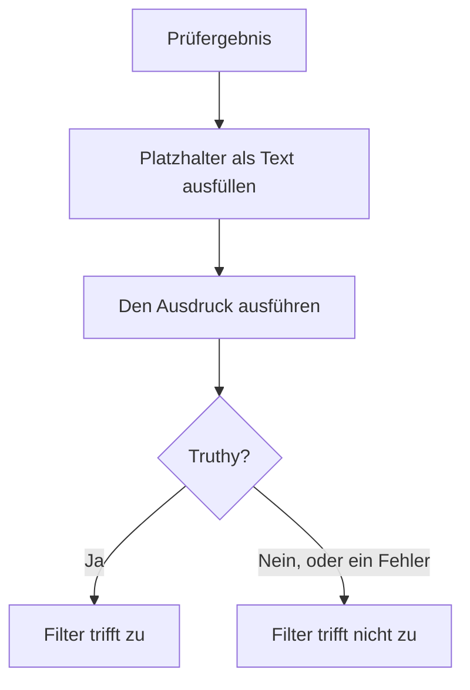

# JavaScript-Ausdrücke

Ein Kriterienfilter **JavaScript Expression** entscheidet mit einer Zeile JavaScript statt mit einem festen Vergleich, ob das Kriterium eines Monitors erfüllt ist. Verwenden Sie ihn, wenn die eingebauten Filter die Bedingung nicht ausdrücken können — ein Feld tief in einer JSON-Antwort, zwei Werte, die miteinander verglichen werden, oder mehrere Prüfungen, die mit `&&` und `||` verknüpft sind.

:::cards
- [So funktioniert es](#so-funktioniert-es): Platzhalter werden ausgefüllt, dann läuft der Ausdruck.
- [Variablen](#variablen-nach-monitortyp): Was jeder Monitortyp Ihnen bereitstellt.
- [Beispiele](#beispiele): Ausdrücke für APIs, eingehende Anfragen und Datenbanken.
- [Regeln für Anführungszeichen](#regeln-für-anführungszeichen): Der Fehler, den fast jeder macht.
:::

## So funktioniert es

Bevor der Ausdruck läuft, wird jeder Platzhalter `{{variable}}` darin durch den Wert aus der letzten Prüfung des Monitors ersetzt — als reiner Text. Das Ergebnis wird dann als JavaScript ausgeführt. Ergibt es einen wahrheitsähnlichen (truthy) Wert, trifft der Filter zu; alles andere, auch ein Fehler, bedeutet, dass er nicht zutrifft.



Weil Platzhalter als Text ersetzt werden, wird `{{responseBody.item}}` zum rohen Wert. Eine Zeichenkette muss in Anführungszeichen stehen, um eine JavaScript-Zeichenkette zu sein; eine Zahl oder ein boolescher Wert nicht — siehe [Regeln für Anführungszeichen](#regeln-für-anführungszeichen). Ausdrücke laufen auf dem OneUptime-Server, in einer isolierten Sandbox.

## Einen Filter JavaScript Expression hinzufügen

:::steps
### Die Kriterien öffnen

Öffnen Sie beim Monitor **Konfiguration → Kriterien** und klicken Sie auf **Überwachungskriterien bearbeiten**, oder verwenden Sie den Schritt **Kriterien** von **Monitor erstellen**. Arbeiten Sie in dem Kriterium, das Sie ändern möchten, oder klicken Sie für ein neues auf **Kriterien hinzufügen**.

### Einen Filter hinzufügen

Klicken Sie unter **Filter** auf **Filter hinzufügen** und setzen Sie seinen **Filtertyp** auf **JavaScript Expression**. Die **Filterbedingung** ist **Evaluates To True**.

### Den Ausdruck schreiben

Geben Sie den Ausdruck unter **Wert** ein und verwenden Sie dabei die [Variablen des Monitortyps](#variablen-nach-monitortyp). Der Link unter dem Filter, **Lesen Sie hier die Dokumentation zur Verwendung von JavaScript-Ausdrücken.**, öffnet diese Seite.

### Speichern

Speichern Sie den Monitor. Der Filter wird bei der nächsten Prüfung des Monitors ausgewertet.
:::

## Variablen nach Monitortyp

JavaScript-Ausdrücke werden für Monitore der Typen Website, API, Eingehende Anfrage, Incoming Email, SQL-Abfrage und Datenbank-Integrität angeboten.

### Website- und API-Monitore

| Variable | Beschreibung | Typ |
| --- | --- | --- |
| `responseBody` | Der Antworttext. Ist der Antworttext JSON, wird er geparst; andernfalls, etwa bei HTML oder XML, ist er eine Zeichenkette. | `string` oder `JSON` |
| `responseHeaders` | Die Antwort-Header, mit kleingeschriebenen Namen. | `Dictionary<string>` |
| `responseStatusCode` | Der Statuscode der Antwort. | `number` |
| `responseTimeInMs` | Die Antwortzeit in Millisekunden. | `number` |
| `isOnline` | Ob der Monitor die Antwort als online wertet. | `boolean` |

### Monitore für eingehende Anfragen

| Variable | Beschreibung | Typ |
| --- | --- | --- |
| `requestBody` | Der Anfragetext. | `string` oder `JSON` |
| `requestHeaders` | Die Anfrage-Header, mit kleingeschriebenen Namen. | `Dictionary<string>` |

### SQL-Abfrage-Monitore

| Variable | Beschreibung | Typ |
| --- | --- | --- |
| `rowCount` | Die Zahl der Zeilen, die die Abfrage geliefert hat. | `number` |
| `scalarValue` | Die erste Spalte der ersten Zeile. | beliebig |
| `firstRow` | Die erste Zeile, als Spalten-Wert-Paare. | `JSON` |
| `executionTimeInMs` | Wie lange die Abfrage gedauert hat, in Millisekunden. | `number` |
| `queryError` | Der Fehler der Abfrage, falls es einen gab. | `string` |
| `isOnline` | Ob die Datenbank erreichbar war und die Abfrage erfolgreich war. | `boolean` |

### Datenbank-Integritäts-Monitore

`isOnline`, `engineVersion`, `connectionError`, `collectedGroups`, `unavailableGroups` und `metrics`. Siehe [Variablen für JavaScript-Ausdrücke](/docs/monitor/database-health-monitor#variablen-für-javascript-ausdrücke) auf der Seite zur Datenbank-Integritätsüberwachung.

### Monitore für eingehende E-Mails

Der Filter wird angeboten, aber keine E-Mail-Felder sind an ihn gebunden: Ein Ausdruck kann weder den Betreff noch den Absender, den Text oder den Empfänger lesen. Verwenden Sie stattdessen die E-Mail-Filtertypen — siehe [Eingehende-E-Mail-Überwachung](/docs/monitor/incoming-email-monitor#verfügbare-kriterienfelder).

## Beispiele

Jede Zeile unten ist ein vollständiger Ausdruck. Für einen JSON-Antworttext wie diesen:

```json
{
  "item": "hello",
  "count": 3,
  "items": [{ "name": "hello" }]
}
```

| Ausdruck | Trifft zu, wenn |
| --- | --- |
| `"{{responseBody.item}}" === "hello"` | Das Feld `item` den Wert `hello` hat. |
| `{{responseBody.count}} > 2` | Das Feld `count` größer als 2 ist. |
| `"{{responseBody.items[0].name}}" === "hello"` | Das erste Element von `items` den Namen `hello` hat. |
| `{{responseStatusCode}} === 200 && {{responseTimeInMs}} < 500` | Der Status 200 ist und die Antwort weniger als eine halbe Sekunde gedauert hat. |
| `/hel+o/.test("{{responseBody.item}}")` | Das Feld `item` zu einem regulären Ausdruck passt. |
| `"{{responseHeaders.content-type}}".startsWith("application/json")` | Die Antwort JSON ist. Header-Namen sind kleingeschrieben. |

Verknüpfen Sie Bedingungen mit `&&` und `||`, und gruppieren Sie sie mit Klammern:

```javascript
({{responseStatusCode}} === 200 || {{responseStatusCode}} === 204) && {{responseTimeInMs}} < 1000
```

Für einen Monitor für eingehende Anfragen, der `{"status": "degraded", "region": "eu"}` als `Content-Type: application/json` empfängt:

```javascript
"{{requestBody.status}}" === "degraded" && "{{requestBody.region}}" === "eu"
```

Für einen SQL-Abfrage-Monitor, dessen Abfrage eine Anzahl liefert, bei einer hohen Anzahl oder einer langsamen Abfrage warnen:

```javascript
{{scalarValue}} > 50 || {{executionTimeInMs}} > 2000
```

Für einen Datenbank-Integritäts-Monitor eine einzelne Metrik lesen, indem Sie das ganze Objekt `metrics` indizieren — die Namen der Reihen enthalten Punkte und können daher nicht zwischen die geschweiften Klammern:

```javascript
{{metrics}}['oneuptime.monitor.database.connections.used.percent'] > 90
```

## Regeln für Anführungszeichen

`{{var}}` wird durch den Wert ersetzt, als Text. Um eine Zeichenkette zu vergleichen, setzen Sie sie in Anführungszeichen, wie in `"{{responseBody.item}}" === "hello"`; um eine Zahl zu vergleichen, lassen Sie sie ohne, wie in `{{responseStatusCode}} === 200`.

| Werttyp | So schreiben | Beispiel |
| --- | --- | --- |
| Zeichenkette | In Anführungszeichen | `"{{responseBody.status}}" === "ok"` |
| Zahl | Ohne Anführungszeichen | `{{responseTimeInMs}} < 500` |
| Boolescher Wert | Ohne Anführungszeichen | `{{isOnline}} === true` |
| Objekt oder Array | Ohne Anführungszeichen, dann indizieren | `{{responseHeaders}}['content-type']` |

Drei Dinge, auf die Sie achten sollten:

- **Ein Platzhalter allein in Anführungszeichen ist immer wahr.** `"{{responseBody.healthy}}"` ist die nicht leere Zeichenkette `"false"`, wenn das Feld `false` ist. Vergleichen Sie ihn: `"{{responseBody.healthy}}" === "true"`, oder lassen Sie ihn ohne Anführungszeichen: `{{responseBody.healthy}} === true`.
- **Werte werden nicht maskiert.** Ein Wert, der ein doppeltes Anführungszeichen oder einen Zeilenumbruch enthält, beendet die Zeichenkette zu früh, und der Ausdruck schlägt fehl. Um nach Text in einer HTML-Seite zu suchen, verwenden Sie stattdessen den Filter **Antworttext**.
- **Ein fehlender Pfad bleibt, wie er ist.** Hat die Prüfung kein solches Feld, bleibt `{{responseBody.item}}` unverändert im Ausdruck stehen, was meist ein Syntaxfehler ist — der Filter trifft also nicht zu.

## Grenzen

Ein Ausdruck hat 5 Sekunden Zeit zum Ausführen. Einer, der länger braucht oder einen Fehler wirft, trifft nicht zu, und der Fehler wird in das Serverprotokoll von OneUptime geschrieben.

## Fehlerbehebung

:::details Der Ausdruck trifft nie zu
Prüfen Sie zuerst die Anführungszeichen: Ein Zeichenketten-Platzhalter ohne Anführungszeichen wird zu einem nackten Wort, was ein Syntaxfehler ist, und ein Fehler trifft nie zu. Prüfen Sie dann, ob der Pfad im Prüfergebnis existiert — ein Platzhalter für einen Pfad, den es nicht gibt, wird nicht ausgefüllt.
:::

:::details Der Ausdruck trifft immer zu
Ein Platzhalter allein in Anführungszeichen ist eine nicht leere Zeichenkette, und die ist immer truthy. Vergleichen Sie ihn mit einem Wert.
:::

## Nächste Schritte

:::cards
- [Vorfall- & Warnmeldungsvorlagen](/docs/monitor/incident-alert-templating): Dieselben Platzhalter in Titeln und Beschreibungen von Vorfällen verwenden.
- [API-Überwachung](/docs/monitor/api-monitor): Einen HTTP-Endpunkt und seine Antwort prüfen.
- [Eingehende-Anfrage-Überwachung](/docs/monitor/incoming-request-monitor): Anfragen auswerten, die andere Systeme an Sie senden.
:::
