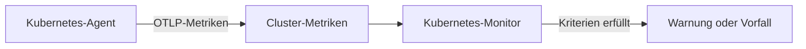

# Kubernetes-Überwachung

Ein Kubernetes-Monitor warnt anhand der Metriken, die der OneUptime-Kubernetes-Agent aus einem Cluster sendet: Knoten, Pods, Container, Workloads, Autoscaler und die Steuerungsebene. Beginnen Sie mit einer fertigen Warnungsvorlage, wählen Sie eine einzelne Metrik oder schreiben Sie Ihre eigene Abfrage, und legen Sie dann den Schwellenwert fest, der eine Warnung oder einen Vorfall auslöst.

:::cards
- [Den Agent installieren](/docs/monitor/kubernetes-agent): Ein Helm-Befehl bringt den Cluster in OneUptime.
- [Den Monitor erstellen](#einen-kubernetes-monitor-erstellen): Den Cluster wählen, dann eine Vorlage, eine Metrik oder eine Abfrage.
- [Warnungsvorlagen](#fertige-warnungsvorlagen): Siebzehn fertige Warnungen, von CrashLoopBackOff bis etcd.
- [Kriterien](#überwachungskriterien): Statische Schwellenwerte und Anomalieerkennung.
:::

## So funktioniert es

Der Agent sendet die Metriken des Clusters über OTLP an OneUptime, jede mit dem Namen des Clusters versehen (`k8s.cluster.name`, das `clusterName` des Charts). Die ersten Daten unter einem neuen Namen registrieren den Cluster unter **Kubernetes**, und von da an lässt sich der Cluster in einem Kubernetes-Monitor auswählen. Jede Minute fragt der Monitor diese Metriken über seinen **Zeitbereich** ab, aggregiert sie und vergleicht das Ergebnis mit seinen Kriterien.

## Bevor Sie beginnen

- Der OneUptime-Kubernetes-Agent läuft im Cluster. Siehe [Kubernetes-Agent (Helm-Installation)](/docs/monitor/kubernetes-agent); der Cluster erscheint wenige Minuten nach der Installation unter **Kubernetes**.
- Für die Vorlagen der Steuerungsebene (**etcd No Leader**, **API Server Request Saturation**, **Scheduler Backlog**): die Erfassung der Steuerungsebene durch den Agent, `controlPlane.enabled`. Verwaltete Cluster (EKS, GKE, AKS) stellen diese Endpunkte nicht bereit, daher erhalten diese Monitore dort nie Daten.

## Einen Kubernetes-Monitor erstellen

:::steps
### Einen neuen Monitor beginnen

Gehen Sie zu **Monitore** und klicken Sie auf **Monitor erstellen**. Wählen Sie unter **Weitere Monitortypen** den Eintrag **Kubernetes** – oder geben Sie `k8s` in das Suchfeld ein.

### Den Cluster wählen

Wählen Sie ihn unter **Kubernetes-Cluster**. Die Liste enthält jeden Cluster, aus dem der Agent gemeldet hat.

### Festlegen, was überwacht wird

Verwenden Sie einen der drei Tabs:

| Tab | Was Sie wählen |
| --- | --- |
| **Quick Setup** | Eine [fertige Warnungsvorlage](#fertige-warnungsvorlagen). Sie füllt Metrik, Bereich, Zeitbereich und Kriterien aus; den **Zeitbereich** können Sie weiterhin ändern. |
| **Custom Metric** | Eine Metrik aus dem [Metrikkatalog](#metrikkatalog), dann ihren **Ressourcenbereich**, Filter, **Aggregation** (Durchschnitt, Maximum, Minimum, Summe oder Anzahl) und **Zeitbereich**. |
| **Erweitert** | Den **Ressourcenbereich**, Filter und **Zeitbereich** sowie unter **Metriken auswählen** Ihre eigenen Metrikabfragen und Formeln, mit einem Live-Diagramm des Ergebnisses. |

### Die Kriterien festlegen

Legen Sie fest, wann der Monitor seinen Status ändert und wann er eine Warnung oder einen Vorfall auslöst – siehe [Überwachungskriterien](#überwachungskriterien). Eine Vorlage hat sie bereits ausgefüllt: Prüfen Sie die Schwellenwerte, Schweregrade und Bereitschaftsrichtlinien.

### Den Monitor speichern

Füllen Sie das Formular fertig aus und speichern Sie. Der Monitor erscheint unter **Monitore**, und sein Status folgt ab der ersten Auswertung Ihren Kriterien.
:::

## Konfigurationsoptionen

### Ressourcenbereich und Filter

**Ressourcenbereich** legt die Ebene fest, auf der die Metrik ausgewertet wird, und bestimmt, welche Filter das Formular anzeigt. Jeder Filter ist optional.

| Bereich | Überwacht | Filter |
| --- | --- | --- |
| Cluster | Den gesamten Cluster | — |
| Namespace | Ressourcen in einem Namespace | **Namespace** |
| Workload | Ein Deployment, StatefulSet, DaemonSet, einen Job oder CronJob | **Namespace**, **Workload-Name** |
| Knoten | Einen Knoten des Clusters | **Knotenname** |
| Pod | Einen Pod | **Namespace**, **Pod-Name** |

### Zeitbereich

**Zeitbereich** ist das Zeitfenster, das die Metrikabfrage bei jeder Auswertung des Monitors abdeckt, von **Past 1 Minute** bis **Past 365 Days**. Kurze Zeitfenster (1 bis 15 Minuten) eignen sich für Warnungen; längere glätten verrauschte Metriken.

### Metrikabfragen und Formeln

Im Tab **Erweitert** nennt jede Abfrage eine Metrik, wie ihre Werte aggregiert werden, und optionale Attributfilter. Eine **Formel** kombiniert Abfragen mit Arithmetik – die Vorlagen zur Knotenauslastung teilen zum Beispiel die Nutzung durch die zuweisbare Kapazität.

## Metrikkatalog

Der Tab **Custom Metric** bietet diese Metriken an, gruppiert nach Ressourcentyp:

| Kategorie | Metriken |
| --- | --- |
| Pod | Pod CPU Usage, Pod Memory Usage, Pod Phase (Code), Pod Filesystem Usage, Pod Memory Limit Utilization, Pod CPU Limit Utilization, Pod Network I/O (Cumulative, Both Directions) |
| Knoten | Node CPU Usage, Node Allocatable CPU, Node Memory Usage, Node Filesystem Usage, Node Allocatable Memory, Node Ready Condition, Node Filesystem Available |
| Container | Container Restarts, Container CPU Limit, Container CPU Request, Container Memory Limit, Container Memory Request, Container Ready |
| Workload | Deployment Available Replicas, Deployment Desired Replicas, DaemonSet Misscheduled Nodes, DaemonSet Ready Nodes, StatefulSet Ready Replicas, Job Failed Pods, Job Successful Pods |
| HPA | HPA Current Replicas, HPA Desired Replicas, HPA Max Replicas, HPA Min Replicas |
| Steuerungsebene | etcd Has Leader, API Server In-Flight Requests, Scheduler Pending Pods |

> [!NOTE]
> **Pod CPU Usage** und **Node CPU Usage** sind in Kernen angegeben, nicht in Prozent: `0.18` ist 0,18 eines Kerns. **Pod Phase (Code)** ist ein Code (1 Pending, 2 Running, 3 Succeeded, 4 Failed, 5 Unknown) – aggregieren Sie ihn mit Maximum oder Minimum, niemals mit Summe. Metriken der Steuerungsebene kommen nur an, wenn die Erfassung der Steuerungsebene durch den Agent eingeschaltet ist.

## Überwachungskriterien

### Was ausgewertet wird

Diese Monitore werten immer den **Metric Value** aus – den Wert der konfigurierten Metrikabfrage oder Formel. Das Kriterienformular hat keine Auswahl für den Filtertyp; es zeigt **Metrik**, **Aggregation**, **Bedingung** und **Schwellenwert**.

### Aggregationsarten

| Aggregation | Beschreibung |
| --- | --- |
| Durchschnitt | Durchschnittswert über das Zeitfenster |
| Summe | Summe aller Werte |
| Maximum Value | Höchster Wert im Zeitfenster |
| Minimum Value | Niedrigster Wert im Zeitfenster |
| All Values | Alle Werte müssen das Kriterium erfüllen |
| Any Value | Mindestens ein Wert muss zutreffen |

### Bedingungen

Statische Schwellenwerte werden mit dem **Schwellenwert** verglichen, den Sie eingeben: **Greater Than**, **Less Than**, **Greater Than Or Equal To**, **Less Than Or Equal To** und **Equal To**.

Die Anomalieerkennung anhand einer Baseline braucht keinen Schwellenwert. Wählen Sie eine dieser Bedingungen, und das Formular zeigt stattdessen **Empfindlichkeit** und **Baseline-Fenster**:

| Bedingung | Trifft zu, wenn der Wert |
| --- | --- |
| **Anomalously High** | Über den erwarteten Bereich steigt |
| **Anomalously Low** | Unter den erwarteten Bereich fällt |
| **Anomalous** | Den erwarteten Bereich in eine der beiden Richtungen verlässt |

Jeder Messwert wird mit einer Baseline derselben Stunde der Woche verglichen, die aus dem **Baseline-Fenster** gebildet wird (standardmäßig 14 Tage; 28, 60 oder 90 Tage). **Empfindlichkeit** legt fest, wie breit der erwartete Bereich ist: **Niedrig (4σ — nur eklatante Abweichungen)**, **Mittel (3σ — empfohlen)**, der Standard, oder **Hoch (2σ — verrauschter, sehr stabile Dienste)**. Anomaliebedingungen bleiben im Zustand „Learning“ und lösen keine Warnungen aus, bis mindestens das gewählte Baseline-Fenster an Metrikverlauf vorliegt.

**Bei keinen Daten** unter **Weitere Felder** entscheidet, was geschieht, wenn die Abfrage im Zeitfenster nichts liefert: **Ignore** (der Standard) trifft nicht zu, **Auslöser** behandelt die Stille als das Problem, und **Treat As Zero** vergleicht eine Null. Zeit, in der OneUptime selbst keine Daten empfing, gilt nie als fehlende Daten: Eine Prüfung, deren Zeitfenster solche Zeit enthält, wartet stattdessen, wie [Wenn OneUptime keine Daten empfängt](/docs/monitor/when-oneuptime-is-not-receiving) erklärt.

## Fertige Warnungsvorlagen

Der Tab **Quick Setup** listet diese Vorlagen auf, gruppiert nach Kategorie. Jede füllt zwei Kriterien aus: eines, das den Monitor als offline markiert und einen Vorfall und eine Warnung auslöst, solange die Bedingung gilt, und eines, das ihn wieder online setzt, wenn sie nicht mehr gilt.

| Vorlage | Kategorie | Löst aus, wenn | Schweregrad |
| --- | --- | --- | --- |
| CrashLoopBackOff Detection | Workload | Ein Container seit der Erstellung seines Pods mehr als 5-mal neu gestartet wurde | Kritisch |
| Pod Stuck in Pending | Planung | Ein Pod in jedem Messwert eines 15-Minuten-Zeitfensters in der Phase Pending ist | Warnung |
| Node Not Ready | Knoten | Ein Knoten NotReady meldet | Kritisch |
| High Node CPU Utilization | Knoten | Die durchschnittliche CPU-Nutzung eines Knotens über 90 % seiner zuweisbaren CPU liegt | Warnung |
| High Node Memory Utilization | Knoten | Die durchschnittliche Speichernutzung eines Knotens über 85 % seines zuweisbaren Arbeitsspeichers liegt | Warnung |
| Deployment Replica Mismatch | Workload | Ein Deployment 15 Minuten lang weniger verfügbare Replikate als gewünscht hat | Warnung |
| Job Failures | Workload | Ein Job fehlgeschlagene Pods hat | Warnung |
| etcd No Leader | Steuerungsebene | etcd keinen gewählten Leader hat | Kritisch |
| API Server Request Saturation | Steuerungsebene | Der API-Server während des gesamten Zeitfensters 200 oder mehr laufende Anfragen hält | Kritisch |
| Scheduler Backlog | Planung | Die Warteschlange ausstehender Pods des Schedulers 5 Minuten lang nicht leer ist | Warnung |
| High Node Disk Usage | Speicher | Das Dateisystem eines Knotens zu mehr als 90 % voll ist | Warnung |
| DaemonSet Misscheduled Nodes | Workload | Ein DaemonSet Pods auf Knoten ausführt, die nicht mehr zu seinem Node-Selector, seiner Affinität oder seinen Tolerations passen | Warnung |
| High Node CPU Request Commitment | Knoten | Die summierten CPU-Requests der Container eines Knotens 90 % seiner zuweisbaren CPU übersteigen | Warnung |
| High Node Memory Request Commitment | Knoten | Die summierten Speicher-Requests der Container eines Knotens 90 % seines zuweisbaren Arbeitsspeichers übersteigen | Warnung |
| HPA Saturated at Max Replicas | Workload | Ein HPA bei 90 % oder mehr seiner `maxReplicas` läuft | Kritisch |
| Pod Memory Saturating Container Limit | Workload | Ein Pod mehr als 90 % seines Container-Speicherlimits nutzt | Kritisch |
| Pod CPU Saturating Container Limit | Workload | Ein Pod mehr als 90 % seines Container-CPU-Limits nutzt | Warnung |

Vorlagen auf objektbezogenen Metriken werten jeden Knoten, Pod, jedes Deployment, jeden Job, jedes DaemonSet oder jeden HPA einzeln aus, sodass ein Cluster mit mehreren fehlerhaften Pods einen Vorfall pro Pod erhält statt eines für den ganzen Cluster.

> [!NOTE]
> **CrashLoopBackOff Detection** liest die Neustartzahl des Containers über die gesamte Lebensdauer seines aktuellen Pods, keine Rate. Ein Container, der in einer Crash-Schleife war und sich dann erholt hat, hält die Warnung offen, bis sein Pod ersetzt wird.

### Ursachen erkennen, nicht nur Symptome

Die Vorlagen auf Knotenebene (High Node CPU Utilization, High Node Memory Utilization, Node Not Ready, Pod Stuck in Pending) lösen am *Ende* einer Kette der Ressourcenerschöpfung aus, wenn der Cluster bereits beeinträchtigt ist. Drei Vorlagen lösen an ihrem *Anfang* aus, wo meist auch die Lösung liegt:

- **Pod Memory Saturating Container Limit** und **Pod CPU Saturating Container Limit** erkennen einen Workload, der an seinen eigenen Limits klebt. Das Überschreiten eines Speicherlimits führt sofort zu einem OOMKill; das Überschreiten eines CPU-Limits lässt den Kernel den Pod drosseln, sodass er langsamer wird, ohne je einen Fehler zu melden. Beides ist die übliche Ursache hinter CrashLoopBackOff und unerklärlicher Latenz.
- **HPA Saturated at Max Replicas** erkennt einen Autoscaler ohne Spielraum. Ein Workload, dessen Limits pro Pod zu niedrig sind, wird gedrosselt oder beendet, was genau die Metrik aufbläht, nach der der HPA skaliert – also fügt der Autoscaler weiter Replikate hinzu, die alle gleichermaßen unterversorgt sind, bis er an seine Obergrenze stößt. Die Limits anzuheben ist die Lösung; `maxReplicas` anzuheben macht es schlimmer.

Aktivieren Sie sie gemeinsam in jedem Namespace, in dem ein automatisch skalierter Workload läuft: Die Kombination unterscheidet „braucht wirklich mehr Kapazität“ von „pro Pod zu knapp bemessen“.

> [!NOTE]
> Die beiden Pod-Limit-Vorlagen teilen die Nutzung des Pods durch die **Summe** der Limits seiner Container, sodass Pods mit Sidecars korrekt gemessen werden. Die Speicherangabe des Kubelets für einen Pod enthält freigebbaren Seitencache, sodass ein dateiintensiver Workload in der Speichervorlage hoch liegen kann, ohne je per OOMKill beendet zu werden: Lesen Sie es als „nähert sich dem Limit“, nicht als „wird gleich beendet“.

## Fehlerbehebung

:::details Der Cluster steht nicht in der Liste Kubernetes-Cluster
Cluster registrieren sich selbst aus den Daten des Agents, unter dem `clusterName`, mit dem der Agent installiert wurde. Prüfen Sie, ob die Pods des Agents laufen und ob der Cluster unter **Produkte → Infrastruktur → Kubernetes → Alle Cluster** aufgeführt ist. [Kubernetes-Agent (Helm-Installation)](/docs/monitor/kubernetes-agent) behandelt die Installation und was zu prüfen ist, wenn keine Daten ankommen.
:::

:::details Eine Vorlage der Steuerungsebene löst nie aus
**etcd No Leader**, **API Server Request Saturation** und **Scheduler Backlog** lesen Metriken, die nur die Erfassung der Steuerungsebene durch den Agent sammelt. Schalten Sie `controlPlane.enabled` in den Helm-Werten des Agents ein; standardmäßig ist sie aus. Verwaltete Cluster (EKS, GKE, AKS) stellen diese Endpunkte nicht bereit, daher erhalten diese Monitore dort nie Daten.
:::

:::details Ein CPU-Schwellenwert löst nie aus
**Pod CPU Usage** und **Node CPU Usage** sind in Kernen angegeben, nicht in Prozent, ein Schwellenwert von `80` bedeutet also 80 Kerne. Legen Sie den Schwellenwert in Kernen fest, oder beginnen Sie mit **High Node CPU Utilization** oder **Pod CPU Saturating Container Limit**, die einen Prozentwert vergleichen.
:::

:::details CrashLoopBackOff Detection bleibt offen, nachdem sich der Pod erholt hat
Die Vorlage liest die Neustartzahl des Containers über die gesamte Lebensdauer seines aktuellen Pods, daher fällt die Zahl nicht mehr zurück, sobald sie 5 überschritten hat. Die Warnung wird aufgelöst, wenn der Pod ersetzt wird, zum Beispiel durch ein erneutes Deployment, eine Verdrängung oder das Leeren eines Knotens.
:::

## Nächste Schritte

:::cards
- [Kubernetes-Agent (Helm-Installation)](/docs/monitor/kubernetes-agent): Den Agent mit Helm installieren, aktualisieren und abstimmen.
- [Kubernetes-Agent](/docs/telemetry/kubernetes-agent): Namespace-Filter, Metriken der Steuerungsebene, Filter nach Protokoll-Schweregrad und der KI-Agent.
- [Metriken-Überwachung](/docs/monitor/metrics-monitor): Bei jeder Metrik warnen, auch bei den benutzerdefinierten und eBPF-Metriken des Agents.
- [Vorfall- & Warnmeldungsvorlagen](/docs/monitor/incident-alert-templating): Den betroffenen Pod oder Knoten in Vorfalltitel aufnehmen.
:::
