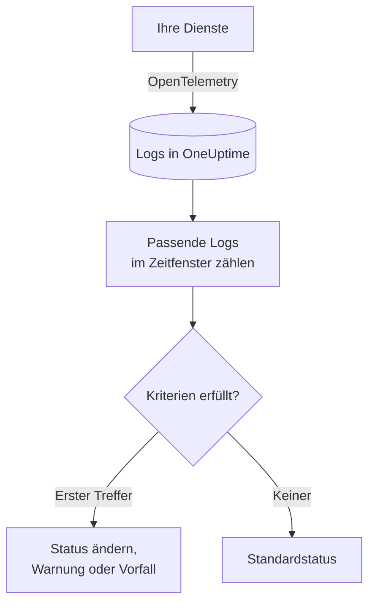
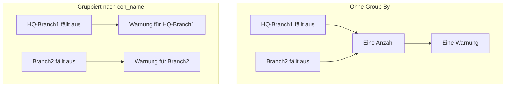

# Logs-Überwachung

Ein Logs-Monitor zählt die Logs, die Ihre Dienste an OneUptime senden und die zu Ihren Filtern passen – Text, Schweregrad, Dienst, Attribute –, über ein Zeitfenster. Erfüllt die Anzahl Ihre Kriterien, ändert er den Status des Monitors, erstellt eine Warnung oder eröffnet einen Vorfall. Damit erkennen Sie Fehlerspitzen, eine bestimmte Fehlermeldung oder einen Dienst, der keine Logs mehr schreibt.

:::cards
- [Den Monitor erstellen](#einen-logs-monitor-erstellen): Wählen, welche Logs gezählt werden und wann gewarnt wird.
- [Wie er ausgewertet wird](#wie-er-ausgewertet-wird): Das Zeitfenster, die Anzahl und der Minutentakt.
- [Kriterien](#kriterien): Schwellenwerte, Anomalieerkennung und die Voreinstellungen.
- [Warnungen pro Gruppe](#warnungen-pro-gruppe-group-by): Eine Warnung pro Tunnel, Benutzer oder Schnittstelle.
:::

## So funktioniert es



Jede Minute zählt OneUptime die Logs, die zu den Filtern des Monitors passen und innerhalb seines Zeitfensters eingetroffen sind. Diese Anzahl prüft es von oben nach unten gegen die Kriterien des Monitors, und das erste passende Kriterium entscheidet, was geschieht. Passt keines, kehrt der Monitor zu seinem Standardstatus zurück.

## Bevor Sie beginnen

- Ihre Dienste senden Logs über OpenTelemetry (oder eine andere Log-Quelle, die OneUptime aufnimmt) an OneUptime. Siehe [OpenTelemetry](/docs/telemetry/open-telemetry).
- Um nach einem Wert innerhalb der Logzeile zu filtern oder zu gruppieren, etwa einem Tunnel- oder Benutzernamen, wandeln Sie ihn zuerst mit einer [Log-Pipeline](/docs/telemetry/log-pipelines) in ein Attribut um.

## Einen Logs-Monitor erstellen

:::steps
### Einen neuen Monitor beginnen

Gehen Sie zu **Monitore** und klicken Sie auf **Monitor erstellen**.

### Logs wählen

Klicken Sie unter **Monitortyp** auf **Weitere Monitortypen** und wählen Sie **Protokolle** unter **Telemetrie**, oder tippen Sie `logs` in das Suchfeld. Geben Sie einen **Name** ein und klicken Sie dann auf **Weiter**.

### Die zu zählenden Logs wählen

Legen Sie in **Log-Monitor-Konfiguration** die Felder **Überwachungsprotokolle, die diesen Text enthalten**, **Überwachungsprotokolle für (time)** und **Protokollschweregrad** fest. Ein leer gelassener Filter passt auf jedes Log. **Protokollvorschau** unter den Filtern zeigt die Logs, auf die sie gerade passen.

### Weiter eingrenzen (optional)

Öffnen Sie **Weitere Felder**, um nach Telemetrie-Dienst, Infrastruktur-Entität oder Attribut zu filtern. Für eine Warnung pro Tunnel, Benutzer oder Schnittstelle statt einer für den ganzen Monitor fügen Sie das Attribut unter **Group by Attributes** hinzu – siehe [Warnungen pro Gruppe](#warnungen-pro-gruppe-group-by).

### Die Kriterien festlegen

Die Karte **Monitor-Kriterien** beginnt mit zwei Kriterien: offline, mit einem Vorfall, wenn kein Log passt; online, sobald mindestens eines passt. Ändern Sie sie so, dass sie das melden, was Sie wollen – siehe [Kriterien](#kriterien).

### Den Monitor erstellen

Klicken Sie auf **Monitor erstellen**. Der Monitor öffnet sich auf seiner Seite **Übersicht**, und seine erste Auswertung läuft innerhalb einer Minute.
:::

## Was er abfragt

| Feld | Worauf es passt | Standard |
| --- | --- | --- |
| **Überwachungsprotokolle, die diesen Text enthalten** | Logs, deren Text diesen Text enthält, ohne Beachtung der Groß-/Kleinschreibung. | Leer: jedes Log |
| **Überwachungsprotokolle für (time)** | Logs der letzten 5 Sekunden bis zu den letzten 24 Stunden. | **Letzte 1 Minute** |
| **Protokollschweregrad** | Logs mit einem der gewählten Schweregrade. | Leer: jeder Schweregrad |
| **Group by Attributes** | Kein Filter: zählt jede Kombination der Werte dieser Attribute getrennt. | Leer: eine Anzahl |
| **Nach Telemetrie-Dienst filtern** (unter **Weitere Felder**) | Logs von einem der gewählten Dienste. | Leer: jeder Dienst |
| **Nach Infrastruktur-Entität filtern** (unter **Weitere Felder**) | Logs von einem der gewählten Hosts, Pods, Container und anderen Entitäten. | Leer: jede Entität |
| **Nach Attributen filtern** (unter **Weitere Felder**) | Logs, deren Attribute jede Bedingung erfüllen. Jede Bedingung hat ihren eigenen Operator, etwa „gleich“ oder „enthält“. | Leer: keine Bedingung |

Alle Filter, die Sie festlegen, müssen passen, damit ein Log gezählt wird.

### Log-Schweregrad

Jedes Log wird mit einem von sieben Schweregraden gespeichert. Bei OpenTelemetry-Logs stammt er aus der Schweregradnummer des Logs; wählen Sie also den Schweregrad, nicht den Text, den Ihr Logger ausgegeben hat:

| Schweregrad | OpenTelemetry-Schweregradnummern |
| --- | --- |
| **Trace** | 1–4 |
| **Debug** | 5–8 |
| **Informationen** | 9–12 |
| **Warnung** | 13–16 |
| **Fehler** | 17–20 |
| **Fatal** | 21–24 |
| **Nicht angegeben** | Alles andere |

## Wie er ausgewertet wird

- **Jede Minute.** Ein Logs-Monitor wird nicht von Sonden geprüft, deshalb hat er kein Intervall zum Einstellen und keine Seite **Sonden & Intervall**.
- **Eine Zahl pro Auswertung.** Der Monitor zählt die Logs, die zu jedem Filter passen und innerhalb von **Überwachungsprotokolle für (time)** vor der Auswertung eingetroffen sind. Mit **Letzte 5 Minuten** blickt jede Auswertung fünf Minuten zurück, sodass sich die Fenster aufeinanderfolgender Auswertungen überlappen.
- **Keine Logs ergeben die Anzahl 0.** Ein Dienst, der keine Logs mehr schreibt, liefert 0 – genau darauf achtet das Standardkriterium für offline.
- **Die eigene Ausfallzeit von OneUptime ist keine Stille.** Solange das Zeitfenster Zeit enthält, in der OneUptime selbst keine Daten empfangen hat – weil es neu startete, aktualisiert wurde oder einen Rückstand aufholte –, wartet die Prüfung: Der Status ändert sich nicht, und kein Vorfall und keine Warnung wird eröffnet oder behoben. Siehe [Wenn OneUptime keine Daten empfängt](/docs/monitor/when-oneuptime-is-not-receiving).
- **Kriterien von oben nach unten.** Das erste passende Kriterium entscheidet; stellen Sie also das schwerwiegendste nach oben. Ein gruppierter Monitor arbeitet anders: Er prüft jedes Kriterium für jede Gruppe – siehe [Die Auswertung der Kriterien unterscheidet sich](#die-auswertung-der-kriterien-unterscheidet-sich).

Jede Statusänderung wird mit ihrem Grund in der **Status-Zeitachse** des Monitors festgehalten.

## Kriterien

Die Kriterien eines Logs-Monitors haben einen **Filtertyp**: **Log Count**, die Anzahl der Logs, die im Fenster gepasst haben. Wählen Sie eine **Filterbedingung** und, bei einer Schwellenwertbedingung, einen **Wert**.

| Filterbedingung | Passt, wenn die Anzahl der Logs … |
| --- | --- |
| **Greater Than** | über dem Wert liegt |
| **Greater Than Or Equal To** | den Wert erreicht oder darüber liegt |
| **Less Than** | unter dem Wert liegt |
| **Less Than Or Equal To** | den Wert erreicht oder darunter liegt |
| **Equal To** | genau dem Wert entspricht |
| **Anomalously High** | über dem Bereich liegt, der für diese Stunde der Woche erwartet wird |
| **Anomalously Low** | unter diesem Bereich liegt |
| **Anomalous** | außerhalb dieses Bereichs liegt, in die eine oder andere Richtung |

Die Anomaliebedingungen haben keinen **Wert**. Wählen Sie eine **Empfindlichkeit** – Low, Medium (der Standard) oder High – und ein **Baseline-Fenster** von 14 (der Standard), 28, 60 oder 90 Tagen. OneUptime rechnet die Anzahl in eine Rate pro Minute um und vergleicht sie mit derselben Stunde der Woche über dieses Fenster. Die Baseline umfasst nur die Dienste und Schweregrade des Monitors: Seine Text- und Attributfilter gehören nicht dazu. Solange diese Stunde der Woche nicht genug Verlauf hat, lernt das Kriterium noch und löst nicht aus.

Ein neuer Logs-Monitor beginnt mit diesen Kriterien:

| Kriterium | Filter | Wirkung |
| --- | --- | --- |
| Check if … is offline | **Log Count** **Equal To** `0` | Setzt den Monitor auf offline und eröffnet einen Vorfall, der automatisch behoben wird |
| Check if … is online | **Log Count** **Greater Than** `0` | Setzt den Monitor auf online |

> [!TIP]
> Um bei Fehlern statt bei Stille zu warnen, setzen Sie **Protokollschweregrad** auf **Fehler** und ändern das Offline-Kriterium auf **Log Count** **Greater Than** die Zahl der Fehler, die Sie im Fenster tolerieren.

## Ein Beispiel: eine Fehlerspitze

Sie wollen einen Vorfall, wenn der Checkout-Dienst in fünf Minuten mehr als 50 Fehler protokolliert:

- **Protokollschweregrad**: **Fehler**
- **Überwachungsprotokolle für (time)**: **Letzte 5 Minuten**
- **Nach Telemetrie-Dienst filtern**: `checkout`
- Kriterium 1: **Log Count** **Greater Than** `50` – den Monitor auf offline setzen und einen Vorfall eröffnen
- Kriterium 2: **Log Count** **Less Than Or Equal To** `50` – den Monitor auf online setzen

Vier aufeinanderfolgende Auswertungen:

| Zeit | Fehler-Logs der letzten 5 Minuten | Passendes Kriterium | Was geschieht |
| --- | --- | --- | --- |
| 10:00 | 12 | 2 | Der Monitor ist online. |
| 10:01 | 64 | 1 | Der Monitor geht offline, und ein Vorfall wird eröffnet. |
| 10:02 | 81 | 1 | Weiterhin offline. Der Vorfall ist schon offen, also wird kein zweiter eröffnet. |
| 10:06 | 9 | 2 | Der Monitor ist wieder online, und der Vorfall behebt sich selbst, weil **Vorfall automatisch beheben** eingeschaltet ist. |

Weil sich die Fenster überlappen, hält ein einzelner Fehlerschub die Anzahl bis zu fünf Minuten nach seinem Ende hoch. Verwenden Sie ein kürzeres Fenster für einen Monitor, der sich schneller erholen soll.

## Warnungen pro Gruppe (Group By)

**Group by Attributes** teilt die Anzahl eines Logs-Monitors in eine Anzahl pro unterschiedlicher Kombination von Attributwerten auf – eine pro IPsec-Tunnel, pro VPN-Benutzer, pro Firewall-Schnittstelle – und wertet die Kriterien für jede Gruppe getrennt aus. Es ist das Gegenstück für Logs zum [Group By](/docs/monitor/metrics-monitor#warnungen-pro-reihe-group-by) eines Metriken-Monitors.

### Eine Warnung pro Gruppe

Ohne Group By ist ein Monitor, der auf beendete IPsec-Tunnel achtet, eine einzige Anzahl für den ganzen Monitor und löst **eine Warnung für den ganzen Monitor** aus. Solange diese Warnung offen ist, erzeugt ein zweiter ausfallender Tunnel nichts Neues – der Monitor warnt ja bereits.

Mit Group By auf dem Tunnelnamen eröffnet das Beenden des Tunnels `HQ-Branch1` seine eigene Warnung, und das Beenden des Tunnels `Branch2` zehn Minuten später eröffnet daneben eine **zweite, separate Warnung**.



### Unabhängige Behebung

Die Warnung oder der Vorfall jeder Gruppe wird für sich behoben. Sobald eine Gruppe die Kriterien nicht mehr erfüllt – `HQ-Branch1` protokolliert innerhalb des Zeitfensters keine Beendigungen mehr –, wird ihre Warnung behoben, während die von `Branch2` offen bleibt, bis auch `Branch2` aufhört. Die Erholung einer Gruppe schließt nie die Warnung einer anderen.

Ein Logs-Monitor sieht Ereignisse, keinen Zustand: Die Warnung einer Gruppe wird behoben, sobald diese Gruppe ein ganzes Zeitfenster lang nichts protokolliert hat, das die Kriterien erfüllt – ob der Tunnel wieder da ist oder nicht.

### Beispiel: eine Warnung pro Sophos-IPsec-Tunnel

Dies setzt voraus, dass die Syslog-Zeilen der Firewall mit einem [Key=Value-Parser](/docs/telemetry/log-pipelines#keyvalue-parser) ohne Zielpräfix in Attribute zerlegt werden, sodass der Tunnelname das Attribut `con_name` ist:

```text
log_component="IPSec" con_name="HQ-Branch1" status="Terminated" message="IPSec Connection HQ-Branch1 between 10.171.4.117 and 10.171.4.118 for Child HQ-Branch1 terminated."
```

:::steps
1. Erstellen Sie einen **Protokolle**-Monitor.
2. Setzen Sie **Überwachungsprotokolle, die diesen Text enthalten** auf `terminated` und **Überwachungsprotokolle für (time)** auf **Letzte 5 Minuten**.
3. Fügen Sie unter **Weitere Felder** den Attributfilter `log_component` = `IPSec` hinzu.
4. Fügen Sie unter **Group by Attributes** das Attribut `con_name` hinzu.
5. Fügen Sie ein Kriterium mit dem Filter **Log Count** **Greater Than** `0` hinzu, das eine Warnung oder einen Vorfall mit dem Titel `IPsec tunnel {{con_name}} terminated` erstellt.
:::

Jeder Tunnel, der eine Beendigung protokolliert, erhält nun seine eigene Warnung – `IPsec tunnel HQ-Branch1 terminated`, `IPsec tunnel Branch2 terminated` –, und jede wird für sich behoben.

### Gruppenwerte in Titeln und Beschreibungen

Der Wert jedes Group-By-Attributs ist eine [Vorlagenvariable](/docs/monitor/incident-alert-templating) im Titel, in der Beschreibung und in den Hinweisen zur Behebung der Warnung oder des Vorfalls, genau wie die Labels einer Metrikreihe: Gruppieren nach `con_name` liefert `{{con_name}}`. Ein Schlüssel mit Punkten wird als Pfad gelesen, `sophos.con_name` also als `{{sophos.con_name}}`. Nennt der Titel die Gruppe noch nicht, wird sie angehängt (`IPsec tunnel terminated - Con Name: HQ-Branch1`), und `{{seriesResourceSuffix}}` und `{{seriesResourceSummary}}` funktionieren wie bei Metrik-Monitoren.

### Wie Gruppen gezählt werden

- Bis zu 10 Attribute. Jede unterschiedliche Kombination ihrer Werte ist eine Gruppe.
- Ein Log ohne ein Group-By-Attribut wird unter einem **leeren Wert** dafür gezählt; Logs ohne das Attribut bilden also eine eigene Gruppe, deren Warnung keinen Wert dafür nennt. Kommt jede Warnung ohne Gruppenwert an, prüfen Sie den Attributschlüssel – eine Log-Pipeline mit Zielpräfix speichert `con_name` als `sophos.con_name`.
- Gruppenwerte, die länger als 256 Zeichen sind, werden auf 256 gekürzt.
- Pro Prüfung werden höchstens **100 Gruppen** ausgewertet: die 100 mit den meisten Logs. Passen mehr, werden die übrigen bei dieser Prüfung übersprungen und eine Warnung wird protokolliert – grenzen Sie die Filter des Monitors ein, um sie abzudecken.

### Die Auswertung der Kriterien unterscheidet sich

- **Jedes Kriterium wird ausgewertet**, wie bei einem gruppierten Metriken-Monitor, sodass verschiedene Gruppen zugleich verschiedene Kriterien erfüllen können. Eine Gruppe, die zwei Kriterien erfüllt, erhält trotzdem nur eine Warnung, vom ersten; ordnen Sie die Kriterien also mit dem schwerwiegendsten zuerst.
- **Eine Gruppe existiert nur, wenn sie im Zeitfenster etwas protokolliert hat.** Kriterien mit **Equal To 0** und **Less Than** lösen daher nur für Gruppen aus, die mindestens einmal protokolliert haben; um zu warnen, wenn gar keine Logs mehr eintreffen, verwenden Sie einen Monitor ohne Group By.
- **Anomalieerkennung** (**Anomalously High**, **Anomalously Low**, **Anomalous**) wird nicht pro Gruppe ausgewertet – ihre Baseline umfasst den ganzen Monitor –, daher passen diese Filter bei einem gruppierten Monitor nie.
- Der Status des Monitors folgt dem ersten Kriterium, das irgendeine Gruppe erfüllt. Erfüllt keine Gruppe ein Kriterium, kehrt der Monitor zu seinem Standardstatus zurück.

## Fehlerbehebung

:::details Der Monitor ist offline, aber mein Dienst schreibt Logs
Die Anzahl war 0, die Filter passen also auf keines der Logs, die der Dienst sendet. Öffnen Sie die Seite **Kriterien** des Monitors (unter **Konfiguration**) und klicken Sie auf **Überwachungskriterien bearbeiten**: **Protokollvorschau** zeigt, worauf die Filter gerade passen. Die üblichen Ursachen sind ein Schweregrad, der nach dem vom Logger ausgegebenen Text statt nach seiner Schweregradnummer gewählt wurde (siehe [Log-Schweregrad](#log-schweregrad)), ein Dienst- oder Attributfilter, der nicht passt, und ein Zeitfenster, das kürzer ist als die Pause zwischen den Logs des Dienstes.
:::

:::details Es gab eine Spitze, aber nichts hat gewarnt
Die Kriterien werden von oben nach unten geprüft, und der erste Treffer entscheidet. Ein breites Kriterium über dem erwarteten, etwa **Log Count** **Greater Than** `0`, passt zuerst und stoppt den Rest. Stellen Sie das schwerwiegendste Kriterium nach oben.
:::

:::details Ein Anomaliekriterium löst nie aus
Es lernt noch: Die Stunde der Woche, mit der es vergleicht, hat noch nicht genug Verlauf. Bei einem Monitor mit **Group by Attributes** passen Anomaliebedingungen nie – verwenden Sie dort einen Schwellenwert.
:::

:::details Gruppenwarnungen kommen ohne Gruppenwert an
Logs ohne das Group-By-Attribut werden unter einem leeren Wert gezählt. Prüfen Sie den genauen Namen des Schlüssels im Log-Explorer: Eine Log-Pipeline mit Zielpräfix speichert `con_name` als `sophos.con_name`.
:::

## Nächste Schritte

:::cards
- [Protokoll-Pipelines](/docs/telemetry/log-pipelines): Logzeilen in Attribute zerlegen, nach denen Sie filtern und gruppieren können.
- [Vorfall- & Warnmeldungsvorlagen](/docs/monitor/incident-alert-templating): Gruppenwerte und Anzahlen in Titel und Beschreibungen setzen.
- [Metriken-Überwachung](/docs/monitor/metrics-monitor): Auf eine Metrik warnen, pro Host oder pro Container.
- [Traces-Überwachung](/docs/monitor/traces-monitor): Auf die gleiche Weise auf fehlschlagende Spans warnen.
:::
