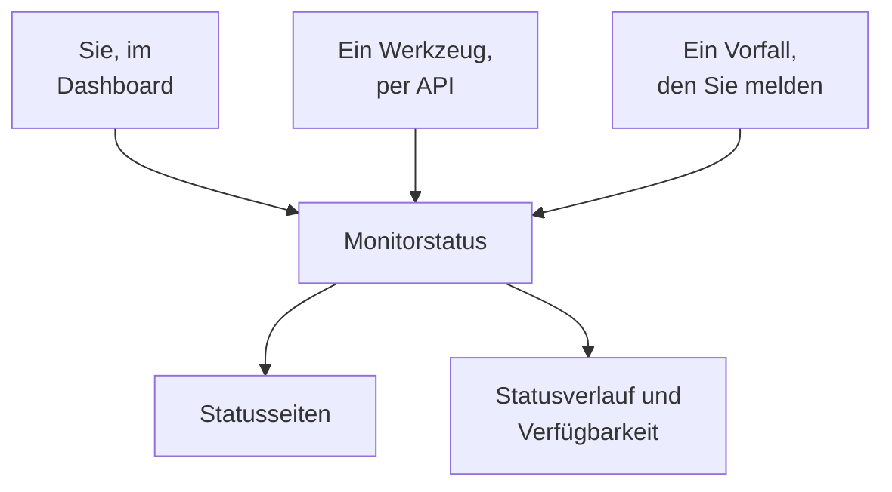

# Manuelle Überwachung

Ein manueller Monitor hat keine automatischen Prüfungen: Sein Status ist das, was Sie festlegen, im Dashboard oder über die API. Verwenden Sie ihn, um etwas abzubilden, das OneUptime nicht selbst prüfen kann — eine Abhängigkeit von Dritten, ein physisches System, einen Geschäftsprozess — auf Ihren Statusseiten und in Ihren Vorfällen.

:::cards
- [Einen erstellen](#einen-manuellen-monitor-erstellen): Ein Schritt im Dashboard.
- [Seinen Status ändern](#den-status-aktualisieren): Im Dashboard oder aus Ihren eigenen Werkzeugen über die API.
- [Vorfälle und Warnungen](#vorfälle-und-warnungen): Einen Vorfall melden und dabei den Status setzen.
:::

## Wann ein manueller Monitor sinnvoll ist

| Anwendungsfall | Beschreibung |
| --- | --- |
| Dienste von Drittanbietern | Den Status externer Dienste verfolgen, von denen Sie abhängen, die Sie aber nicht direkt überwachen können. |
| Physische Infrastruktur | Hardware oder physische Systeme ohne Netzwerküberwachung abbilden. |
| Geschäftsprozesse | Nicht-technische Prozesse verfolgen, die den Dienststatus beeinflussen. |
| Status über die API | Ihre eigenen Werkzeuge den Status über die OneUptime-API setzen lassen. |
| Platzhalter auf Statusseiten | Komponenten auf Ihrer Statusseite zeigen, die außerhalb von OneUptime verwaltet werden. |

Ein Anbieter, der eine Statusseite veröffentlicht, braucht keinen: Ein [Externe-Statusseite-Monitor](/docs/monitor/external-status-page-monitor) verfolgt diese Seite für Sie.

## So funktioniert es

Ein manueller Monitor hat kein Überwachungsintervall, keine Sonden und keine Kriterien. Sein Status bleibt, wie Sie ihn festlegen, bis Sie, ein Werkzeug über die API oder ein Vorfall, den Sie melden, ihn ändert — und der neue Status erscheint überall, wo der Monitor erscheint.



Jede Änderung ist ein Eintrag auf der **Status-Zeitachse** des Monitors, sodass seine Verfügbarkeit und sein Statusverlauf wie bei jedem anderen Monitor erhalten bleiben. Ein manueller Monitor ist kein aktiver Monitor und kostet Sie auf OneUptime Cloud daher nichts zusätzlich.

## Einen manuellen Monitor erstellen

:::steps
### Einen neuen Monitor beginnen

Gehen Sie zu **Monitore** und klicken Sie auf **Monitor erstellen**.

### Manuell wählen

Klicken Sie unter **Monitortyp** auf **Weitere Monitortypen** und wählen Sie **Manuell** unter **Sonstige**.

### Benennen und erstellen

Geben Sie einen **Name** ein — und unter **Weitere Felder** eine **Beschreibung**, wenn Sie möchten — und klicken Sie dann auf **Monitor erstellen**. Ein manueller Monitor braucht nichts weiter, daher wird er aus diesem ersten Schritt erstellt.
:::

## Den Status aktualisieren

### Im Dashboard

:::steps
1. Öffnen Sie den Monitor und klicken Sie in seinem Seitenmenü auf **Status-Zeitachse**.
2. Klicken Sie auf **Monitor-Statusereignis erstellen**.
3. Wählen Sie den **Monitor-Status**. **Beginnt am** ist jetzt; setzen Sie einen früheren Zeitpunkt, wenn die Änderung früher geschah.
4. Klicken Sie auf **Monitor-Statusereignis erstellen**. Der neue Status erscheint sofort beim Monitor und auf jeder Statusseite, die ihn auflistet.
:::

### Über die API

Senden Sie den neuen Status als Monitor-Statusereignis, mit einem [API-Schlüssel](/docs/api-reference/api-reference) Ihres Projekts im Header `ApiKey`:

```bash
curl -X POST https://oneuptime.com/api/monitor-status-timeline \
  -H "ApiKey: $ONEUPTIME_API_KEY" \
  -H "Content-Type: application/json" \
  -d '{"data": {"monitorId": "<monitor id>", "monitorStatusId": "<monitor status id>"}}'
```

- `monitorId` ist die ID des Monitors: Klicken Sie auf seiner Seite auf die Zeile **ID**, um sie zu kopieren.
- `monitorStatusId` ist der Status, der gesetzt werden soll: Wählen Sie unter **Monitore → Einstellungen → Monitor-Status** in der Zeile dieses Status **ID anzeigen**.
- `startsAt` ist optional. Ohne ihn beginnt die Änderung jetzt.
- Bei einer selbst gehosteten Installation senden Sie die Anfrage an Ihren eigenen Host statt an `oneuptime.com`.

Den Status zu senden, den der Monitor bereits hat, wird mit `Monitor Status cannot be same as previous status.` abgelehnt und zeichnet nichts auf, sodass ein Werkzeug, das bei jedem Lauf meldet, diese Antwort ignorieren kann.

## Vorfälle und Warnungen

Ein manueller Monitor wird überall, wo Monitore auswählbar sind, wie jeder andere ausgewählt:

- Melden Sie einen Vorfall und wählen Sie den Monitor unter **Monitore**. Mit **Monitor-Status ändern in** setzt das Melden auch den Status des Monitors, und das Lösen setzt den Monitor wieder auf betriebsbereit, sofern kein anderer Vorfall zu ihm noch offen ist. Siehe [Einen Vorfall melden](/docs/incidents/declaring-incidents#schritt-2-betroffene-ressourcen).
- Erstellen Sie eine Warnung dazu, für ein Problem, um das sich Ihr Team kümmern soll, ohne Ihre Kunden zu informieren.
- Fügen Sie ihn einer Statusseite hinzu, um Kunden eine Abhängigkeit zu zeigen, die Sie von Hand beobachten.

## Nächste Schritte

:::cards
- [Einen Monitor erstellen](/docs/monitor/create-monitor): Die Monitortypen, die Dinge für Sie prüfen.
- [Externe-Statusseite-Überwachung](/docs/monitor/external-status-page-monitor): Stattdessen automatisch der Statusseite eines Anbieters folgen.
- [Statusseiten – Übersicht](/docs/status-pages/index): Den Status des Monitors Ihren Kunden zeigen.
:::
