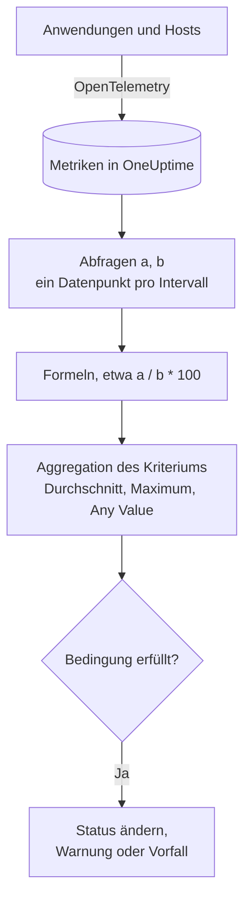

# Metriken-Überwachung

Ein Metriken-Monitor fragt die Metriken ab, die Ihre Anwendungen und Ihre Infrastruktur an OneUptime senden, verknüpft sie mit Formeln, wenn Sie ein Verhältnis oder eine Summe brauchen, und prüft das Ergebnis über einen gleitenden Zeitbereich gegen Ihre Kriterien. Nutzen Sie ihn für Anfrageraten, Fehlerquoten, Warteschlangentiefen, CPU, Speicher und Festplatten – jede numerische Reihe –, mit einer Warnung pro Host oder Container, wenn Sie ihn gruppieren.

:::cards
- [Den Monitor erstellen](#einen-metriken-monitor-erstellen): Abfragen, Formeln, ein Zeitbereich und Kriterien.
- [Wie er ausgewertet wird](#wie-er-ausgewertet-wird): Datenpunkte, Formeln und die Aggregation der Kriterien.
- [Ein Beispiel](#ein-beispiel-eine-wachsende-warteschlange): Dieselben Daten unter jeder Aggregation.
- [Warnungen pro Reihe](#warnungen-pro-reihe-group-by): Eine Warnung pro Host, Container oder Einhängepunkt.
:::

## So funktioniert es

Jede Minute führt OneUptime jede Metrikabfrage des Monitors über seinen Zeitbereich aus. Eine Abfrage liefert einen Datenpunkt pro Zeitintervall, und Formeln verknüpfen die Abfragen Intervall für Intervall. Jedes Kriterium reduziert dann die Datenpunkte der Abfrage oder Formel, die es prüft – auf ihren Durchschnitt, ihr Maximum oder eine Prüfung jedes Punkts – und vergleicht das Ergebnis mit seinem Schwellenwert.

## Bevor Sie beginnen

- Ihre Anwendungen oder Ihre Infrastruktur senden Metriken über OpenTelemetry an OneUptime. Siehe [OpenTelemetry](/docs/telemetry/open-telemetry).
- Kennen Sie den Namen der Metrik und die Attribute, nach denen Sie filtern oder gruppieren wollen. Die Listen **Metrik** und **Gruppieren nach** bieten nur Namen und Attribute an, die OneUptime empfangen hat.

## Einen Metriken-Monitor erstellen

:::steps
### Einen neuen Monitor beginnen

Gehen Sie zu **Monitore** und klicken Sie auf **Monitor erstellen**.

### Metrics wählen

Klicken Sie unter **Monitortyp** auf **Weitere Monitortypen** und wählen Sie **Metriken** unter **Telemetrie**, oder tippen Sie `metrics` in das Suchfeld. Geben Sie einen **Name** ein und klicken Sie dann auf **Weiter**.

### Den Zeitbereich wählen

Wählen Sie in **Metrik-Monitor-Konfiguration** einen **Zeitbereich**: wie weit jede Auswertung zurückblickt. Er beginnt bei **Past 1 Minute**.

### Die Metrikabfragen hinzufügen

Wählen Sie unter **Metriken auswählen** eine **Metrik** und wie sie per **Aggregieren nach** zusammengefasst wird. Öffnen Sie **Filter & Gruppierung**, um nach Attributen zu filtern oder nach einem davon zu **Gruppieren nach**. Klicken Sie auf **Metrik hinzufügen** für eine weitere Abfrage oder auf **Formel hinzufügen**, um sie zu verknüpfen. Das Diagramm unter den Abfragen zeigt eine Vorschau des Zeitbereichs, sodass Sie die Werte sehen, die die Kriterien prüfen werden.

### Die Kriterien festlegen

In **Monitor-Kriterien** wählt jedes Kriterium die zu prüfende **Metrik** (eine Abfrage oder eine Formel), ihre **Aggregation**, eine **Bedingung** und einen **Schwellenwert**. Unter [Kriterien](#kriterien) steht, womit ein neuer Monitor beginnt.

### Den Monitor erstellen

Klicken Sie auf **Monitor erstellen**. Der Monitor öffnet sich auf seiner Seite **Übersicht**, und seine erste Auswertung läuft innerhalb einer Minute.
:::

## Was er abfragt

### Metrikabfragen

| Feld | Was es tut | Standard |
| --- | --- | --- |
| **Metrik** | Die abzufragende Metrik. | Pflichtfeld |
| **Aggregieren nach** | Wie die Werte in jedem Zeitintervall zu einem Datenpunkt zusammengefasst werden: Durchschn., Summe, Min, Max, Anzahl oder ein Perzentil – P50, P75, P90, P95 oder P99. | Durchschn. |
| **Nach Attributen filtern** (unter **Filter & Gruppierung**) | Nur Reihen, deren Attribute zu diesen Bedingungen passen. | Kein Filter |
| **Gruppieren nach** (unter **Filter & Gruppierung**) | Eine Reihe pro eindeutigem Wert dieser Attribute – siehe [Warnungen pro Reihe](#warnungen-pro-reihe-group-by). | Eine Reihe |

Jede Abfrage und jede Formel erhält eine Variable – `a`, `b`, `c` und so weiter – in der Reihenfolge, in der Sie sie hinzufügen.

### Formeln

Eine Formel verknüpft Abfragevariablen mit `+`, `-`, `*`, `/`, `%`, `^` und Klammern, Intervall für Intervall. Sie können die Variablen mit oder ohne vorangestelltes `$` schreiben:

- `a / b * 100` – der Anteil von `b`, den `a` ausmacht, in Prozent
- `a + b` – zwei Metriken addiert
- `a - b` – der Unterschied zwischen ihnen

### Gleitendes Zeitfenster

**Zeitbereich** legt fest, wie weit jede Auswertung zurückblickt: **Past 1 Minute**, **Letzte 5 Minuten**, **Past 10 Minutes**, **Letzte 15 Minuten**, **Letzte 30 Minuten**, **Letzte Stunde**, **Letzte 2 Stunden**, **Letzte 3 Stunden**, **Past 6 Hours**, **Past 12 Hours**, **Letzter Tag**, **Letzte 2 Tage**, **Past 3 Days**, **Past 7 Days**, **Past 14 Days**, **Past 30 Days**, **Past 60 Days**, **Past 90 Days**, **Past 180 Days** oder **Past 365 Days**.

Je länger der Bereich, desto breiter jedes Zeitintervall, sodass ein Datenpunkt für mehr Zeit steht:

| Zeitbereich | Ein Datenpunkt pro |
| --- | --- |
| Past 1 Minute bis Letzte 3 Stunden | Minute |
| Past 6 Hours, Past 12 Hours | 5 Minuten |
| Letzter Tag | 15 Minuten |
| Letzte 2 Tage, Past 3 Days | 30 Minuten |
| Past 7 Days | Stunde |
| Past 14 Days, Past 30 Days | Tag |
| Past 60 Days bis Past 180 Days | Woche |
| Past 365 Days | Monat |

## Wie er ausgewertet wird

- **Jede Minute.** Ein Metriken-Monitor wird nicht von Sonden geprüft, deshalb hat er kein Intervall zum Einstellen und keine Seite **Sonden & Intervall**.
- **Erst die Abfragen, dann die Formeln.** Jede Abfrage liefert mit ihrem **Aggregieren nach** einen Datenpunkt pro Zeitintervall des Zeitbereichs. Formeln werden für jedes Intervall aus den Datenpunkten der Abfragen berechnet.
- **Dann die Aggregation des Kriteriums.** Jedes Kriterium reduziert die Datenpunkte seiner **Metrik** auf das, was es mit dem Schwellenwert vergleicht:

| Aggregation | Die Bedingung wird geprüft gegen … |
| --- | --- |
| Durchschnitt | den Durchschnitt der Datenpunkte |
| Summe | die Summe der Datenpunkte |
| Maximum Value | den höchsten Datenpunkt |
| Minimum Value | den niedrigsten Datenpunkt |
| All Values | jeden Datenpunkt: Alle müssen die Bedingung erfüllen |
| Any Value | jeden Datenpunkt: Es genügt, wenn einer die Bedingung erfüllt |

- **Kriterien von oben nach unten.** Bei einem Monitor ohne Group By entscheidet das erste passende Kriterium; stellen Sie also das schwerwiegendste nach oben. Ein gruppierter Monitor prüft jedes Kriterium für jede Reihe – siehe [Die Auswertung der Kriterien unterscheidet sich](#die-auswertung-der-kriterien-unterscheidet-sich).
- **Keine Daten sind nicht null.** Liefert die Abfrage im Zeitbereich keine Datenpunkte, tut ein Kriterium, was seine Einstellung **Bei keinen Daten** unter **Weitere Felder** sagt: **Ignore** (der Standard – das Kriterium passt nicht), **Treat As Zero** oder **Auslöser**.
- **Die eigene Ausfallzeit von OneUptime ist keine Stille.** Solange der Zeitbereich Zeit enthält, in der OneUptime selbst keine Daten empfangen hat – weil es neu startete, aktualisiert wurde oder einen Rückstand aufholte –, wartet die Prüfung: Der Status ändert sich nicht, und kein Vorfall und keine Warnung wird eröffnet oder behoben, was auch immer **Bei keinen Daten** sagt. Siehe [Wenn OneUptime keine Daten empfängt](/docs/monitor/when-oneuptime-is-not-receiving).

## Kriterien

Diese Monitore werten immer den **Metric Value** aus – den aggregierten Wert der konfigurierten Metrikabfrage oder Formel. Das Kriterienformular hat keine Auswahl für den Filtertyp; es zeigt **Metrik**, **Aggregation**, **Bedingung** und **Schwellenwert**. Hat die Metrik eine Einheit, wählen Sie die Einheit des Schwellenwerts daneben.

| Bedingung | Passt, wenn der Wert … |
| --- | --- |
| **Greater Than** | über dem Schwellenwert liegt |
| **Greater Than Or Equal To** | den Schwellenwert erreicht oder darüber liegt |
| **Less Than** | unter dem Schwellenwert liegt |
| **Less Than Or Equal To** | den Schwellenwert erreicht oder darunter liegt |
| **Equal To** | genau dem Schwellenwert entspricht |
| **Anomalously High** | über dem Bereich liegt, der für diese Stunde der Woche erwartet wird |
| **Anomalously Low** | unter diesem Bereich liegt |
| **Anomalous** | außerhalb dieses Bereichs liegt, in die eine oder andere Richtung |

Die Anomaliebedingungen haben keinen Schwellenwert. Das Formular zeigt stattdessen **Empfindlichkeit** – Low, Medium (der Standard) oder High – und **Baseline-Fenster** – 14 Tage (der Standard), 28, 60 oder 90 – und vergleicht jeden Datenpunkt mit der Baseline derselben Stunde der Woche, die aus diesem Fenster gebildet wird. Solange diese Stunde der Woche nicht genug Verlauf hat, lernt das Kriterium noch und erzeugt keine Warnungen.

Ein neuer Metriken-Monitor beginnt mit zwei Kriterien auf seiner ersten Abfrage, beide mit der Aggregation **Any Value**:

| Kriterium | Bedingung | Wirkung |
| --- | --- | --- |
| Check if … is offline | **Equal To** `0` | Setzt den Monitor auf offline und eröffnet einen Vorfall, der automatisch behoben wird |
| Check if … is online | **Greater Than** `0` | Setzt den Monitor auf online |

> [!NOTE]
> Das Offline-Kriterium löst bei einem gemeldeten Wert von 0 aus, nicht bei Stille. Um zu warnen, wenn eine Metrik nicht mehr eintrifft, setzen Sie ihr **Bei keinen Daten** auf **Auslöser**.

## Ein Beispiel: eine wachsende Warteschlange

Sie wollen einen Vorfall, wenn die Checkout-Warteschlange tief bleibt. Abfrage `a` ist das Gauge `checkout.queue.depth` mit **Aggregieren nach** Max, und der **Zeitbereich** ist **Letzte 5 Minuten**. Eine Auswertung sieht diese fünf Datenpunkte von je einer Minute:

| Minute | 10:01 | 10:02 | 10:03 | 10:04 | 10:05 |
| --- | --- | --- | --- | --- | --- |
| `a` | 640 | 980 | 1.500 | 1.620 | 1.100 |

Ein Kriterium mit **Metrik** `a`, **Bedingung** **Greater Than** und **Schwellenwert** `1000` ergibt für jede **Aggregation** eine andere Antwort:

| Aggregation | Verglichen mit 1.000 | Passt? |
| --- | --- | --- |
| Durchschnitt | 1.168 | Ja |
| Summe | 5.840 | Ja |
| Maximum Value | 1.620 | Ja |
| Minimum Value | 640 | Nein |
| All Values | 640, 980, 1.500, 1.620, 1.100 | Nein – zwei Punkte liegen nicht über 1.000 |
| Any Value | 640, 980, 1.500, 1.620, 1.100 | Ja – 1.500 schon |

**Durchschnitt** alarmiert bei einem anhaltenden Rückstau und ignoriert eine einzelne tiefe Minute; **All Values** wartet, bis jede Minute im Bereich tief ist; **Any Value** alarmiert bei der ersten tiefen Minute.

## Warnungen pro Reihe (Group By)

**Gruppieren nach** in einer Metrikabfrage teilt diese Abfrage in eine Reihe pro eindeutigem Attributwert auf – eine pro Host, eine pro Container, eine pro Einhängepunkt –, und ein Monitor mit gesetztem Group By wertet jede Reihe unabhängig aus. Diese eine Einstellung macht den Unterschied zwischen „die Flotte ist ungesund“ und „`prod-db-01` ist ungesund“.

### Eine Warnung pro Gruppe

Mit Group By auf `host.name` löst ein Festplattennutzungs-Monitor, der fünfzig Hosts überwacht, **eine Warnung (oder einen Vorfall) pro überschreitendem Host** aus. Füllt sich Host A, eröffnet er seine eigene Warnung; füllt sich Host B zehn Minuten später, eröffnet er daneben eine zweite, separate Warnung.

Ohne Group By ist derselbe Monitor ein einzelner Skalar: Die Abfrage fasst alle Hosts zu einer Zahl zusammen, und der Monitor löst **eine Warnung für den ganzen Monitor** aus. Solange diese Warnung offen ist, erzeugt ein zweiter überschreitender Host nichts – der Monitor warnt bereits, es gibt also nichts Neues auszulösen, und die Bereitschaft erfährt nie von Host B. **Group By zu setzen ist der Weg zu Warnungen pro Host.** Wenn Sie pro Host, pro Container oder pro Einhängepunkt alarmiert werden wollen, setzen Sie es.

### Unabhängige Behebung

Jede Warnung pro Gruppe verfolgt ihre eigene Gruppe. Fällt Host A wieder unter den Schwellenwert, wird seine Warnung für sich behoben, und die Warnung von Host B bleibt offen, bis sich Host B erholt. Die Erholung einer Gruppe schließt nie die Warnung einer anderen.

### Die Auswertung der Kriterien unterscheidet sich

- **Gruppierte Monitore werten jedes Kriterium aus.** Schweregradstufen können daher zugleich bei verschiedenen Gruppen auslösen: Mit „Critical – größer als 95“ über „Warning – größer als 80“ eröffnet ein Host bei 96 % bei derselben Prüfung eine kritische Warnung und ein Host bei 85 % eine Warnungsstufe. Ein Host, der beide Stufen überschreitet, erhält trotzdem genau eine Warnung – vom ersten passenden Kriterium; **ordnen Sie die Kriterien also mit dem schwerwiegendsten zuerst**.
- **Ungruppierte Monitore halten beim ersten passenden Kriterium an.** Nur dieses eine Kriterium löst aus – ein weiterer Grund, das warnende Kriterium über das gesunde zu stellen: Ein breites gesundes Kriterium an erster Stelle passt bei fast jeder Prüfung und verhindert, dass das warnende darunter je ausgewertet wird.

| Host | Belegte Festplatte | Critical (> 95) | Warning (> 80) | Ausgelöste Warnung |
| --- | --- | --- | --- | --- |
| `prod-db-01` | 96 % | Ja | Ja | Critical |
| `prod-db-02` | 85 % | Nein | Ja | Warning |
| `prod-db-03` | 40 % | Nein | Nein | Keine |

### Ein Attribut zum Gruppieren wählen

Gruppieren Sie nach einem Attribut, das wirklich ein eigenes Ding bezeichnet, für das Sie jemanden alarmieren würden: das Host-Attribut für eine flottenweite Host-Metrik, das Container- oder Pod-Attribut für eine Container-Metrik, das Einhängepunkt- oder Geräteattribut für eine Dateisystem- oder Festplatten-E/A-Metrik, das Schnittstellenattribut für eine Netzwerkmetrik. Die Auswahlliste **Gruppieren nach** wird aus den Attributen gefüllt, die Ihr Collector tatsächlich sendet; wählen Sie also aus der Liste, statt einen Schlüssel von Hand einzugeben.

Gruppieren Sie keine Metrik, die schon ein einzelner Skalar für das ganze System ist – ein clusterweites Leader-Flag, ein Scheduler-Rückstau oder die CPU eines einzelnen Hosts in einem Monitor für einen einzelnen Host. Ein solches Gruppieren erzeugt genau eine Reihe und ändert nichts außer den Titeln der Warnungen.

Die Werte des Gruppierungsattributs stehen auch als [Vorlagenvariablen](/docs/monitor/incident-alert-templating) im Titel, in der Beschreibung und in den Hinweisen zur Behebung der Warnung oder des Vorfalls bereit – Gruppieren nach `host.name` lässt den Titel `Disk almost full on {{host.name}}` lauten.

## Fehlerbehebung

:::details Das Diagramm zeigt eine Überschreitung, aber der Monitor hat nicht gewarnt
Prüfen Sie zuerst die **Aggregation** des Kriteriums: **All Values** passt nur, wenn jeder Datenpunkt im Zeitbereich überschreitet, und **Durchschnitt** glättet eine kurze Spitze. Prüfen Sie dann, ob die **Metrik** des Kriteriums die gemeinte Abfrage oder Formel ist (`a` ist nicht die Formel `c`) und ob der Schwellenwert in der erwarteten Einheit angegeben ist.
:::

:::details Die Metrik kam nicht mehr an, und nichts geschah
Ein Zeitbereich ohne Datenpunkte ist kein Wert von 0. Mit **Bei keinen Daten** auf seinem Standard, **Ignore**, passt das Kriterium nicht. Setzen Sie es unter **Weitere Felder** des Kriteriums auf **Auslöser**, um bei Stille zu warnen.
:::

:::details Ich bekomme eine Warnung für die ganze Flotte
Die Abfrage hat kein **Gruppieren nach**, also werden alle Hosts zu einer Zahl zusammengefasst. Gruppieren Sie die Abfrage nach dem Host-, Container- oder Einhängepunkt-Attribut – siehe [Warnungen pro Reihe](#warnungen-pro-reihe-group-by).
:::

:::details Ein Anomaliekriterium löst nie aus
Es lernt noch: Die Stunde der Woche, mit der es vergleicht, hat innerhalb des **Baseline-Fenster** noch nicht genug Verlauf.
:::

## Nächste Schritte

:::cards
- [Vorfall- & Warnmeldungsvorlagen](/docs/monitor/incident-alert-templating): Den Host und den Wert in die Titel von Warnungen setzen.
- [Logs-Überwachung](/docs/monitor/logs-monitor): Auf Log-Volumen und -Inhalt warnen, pro Gruppe.
- [Host-Überwachung](/docs/monitor/host-monitor): Fertige CPU-, Speicher- und Festplattenprüfungen für Ihre Hosts.
- [OpenTelemetry](/docs/telemetry/open-telemetry): Metriken an OneUptime senden.
:::
