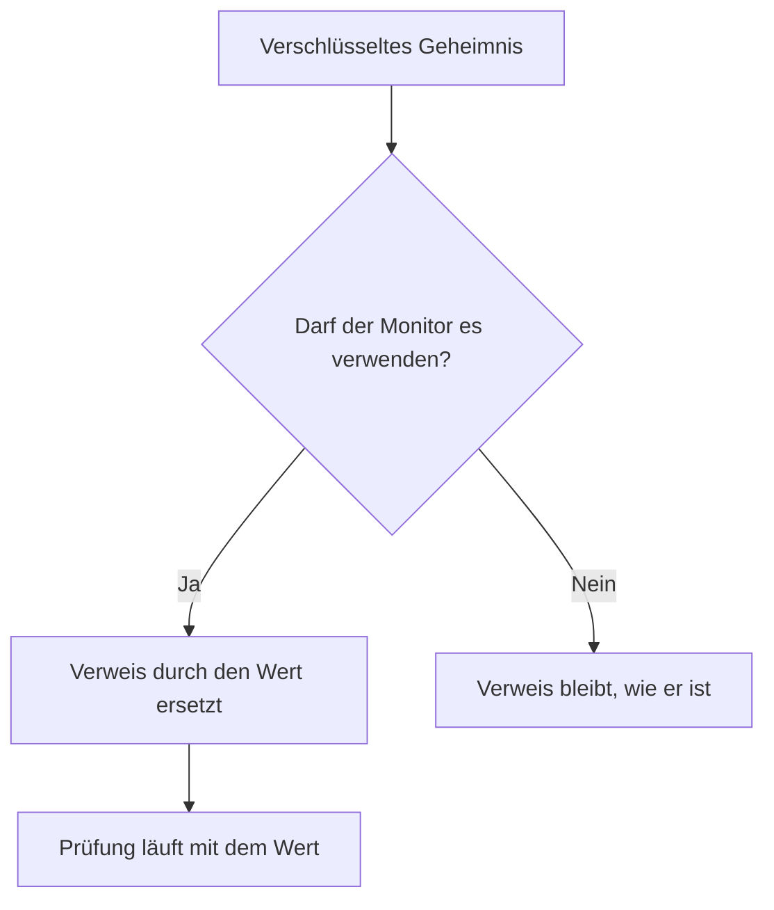

# Überwachungs-Geheimnisse

Monitor-Geheimnisse halten die Passwörter, API-Schlüssel und Tokens, die Ihre Monitore brauchen, aus dem Monitor selbst heraus. Sie speichern einen Wert einmal, verschlüsselt, legen fest, welche Monitore ihn verwenden dürfen, und verweisen mit `{{monitorSecrets.NAME}}` darauf, wo immer der Monitor ihn braucht.

:::cards
- [Ein Geheimnis hinzufügen](#ein-geheimnis-hinzufügen): Einen Wert speichern und festlegen, wer ihn verwenden darf.
- [Den Zugriff wählen](#festlegen-welche-monitore-ein-geheimnis-verwenden-dürfen): Alle Monitore, bestimmte Monitore oder Monitore mit Beschriftungen.
- [Ein Geheimnis verwenden](#ein-geheimnis-verwenden): Wo `{{monitorSecrets.NAME}}` funktioniert.
:::

## Wie Geheimnisse zu einem Monitor gelangen

Ein Geheimnis wird verschlüsselt gespeichert und nach dem Speichern nie wieder angezeigt. Bevor OneUptime einen Monitor an eine Sonde übergibt, ersetzt es jeden Verweis, den der Monitor verwenden darf, durch den entschlüsselten Wert; ein Verweis, den der Monitor nicht verwenden darf, bleibt, wie er geschrieben ist.

Die Sonde, die die Prüfung ausführt, erhält den Wert. Ein Monitor, der ein Geheimnis verwendet, sollte daher auf Sonden laufen, denen Sie vertrauen: denen von OneUptime oder einer [benutzerdefinierten Sonde](/docs/probe/custom-probe), die Sie selbst betreiben.

## Bevor Sie beginnen

- **Der Growth-Tarif oder höher**, auf OneUptime Cloud. Selbst gehostete Installationen haben keine Tarife.
- **Eine Rolle, die Geheimnisse verwalten darf**: Project Owner, Project Admin oder eine benutzerdefinierte Rolle mit der Berechtigung Create Monitor Secret.

## Mit Geheimnissen arbeiten

### Ein Geheimnis hinzufügen

:::steps
1. Gehen Sie zu **Monitore → Einstellungen → Geheimnisse** und klicken Sie auf **Monitor-Geheimnis erstellen**.
2. Geben Sie einen **Name** und den **Geheimniswert** ein. Der Name ist das, worauf Sie verweisen, zum Beispiel `ApiKey`. Er darf nur Buchstaben, Ziffern, Bindestriche (`-`) und Unterstriche (`_`) enthalten, und keine zwei Geheimnisse in einem Projekt teilen sich einen.
3. Wählen Sie im Schritt **Zugriff**, welche Monitore es verwenden dürfen (siehe den nächsten Abschnitt), und klicken Sie dann auf **Monitor-Geheimnis erstellen**.
:::

> [!IMPORTANT]
> Geheimnisse werden verschlüsselt und sicher gespeichert. Der Wert des Geheimnisses wird nach dem Speichern nie wieder angezeigt — nicht in der Tabelle, nicht im Bearbeitungsformular und nicht über die API. Wenn Sie den Wert verlieren, müssen Sie ihn von dort holen, wo er herkam, und ihn erneut setzen. Um ein Geheimnis zu rotieren, verwenden Sie die Schaltfläche **Geheimwert aktualisieren** in seiner Zeile; Sie müssen es nicht löschen und neu erstellen.

### Festlegen, welche Monitore ein Geheimnis verwenden dürfen

Jedes Geheimnis hat eine von drei Zugriffsoptionen:

| Option | Welche Monitore das Geheimnis verwenden dürfen | Wofür |
| --- | --- | --- |
| **Alle Monitore** | Jeder Monitor im Projekt, auch Monitore, die Sie später erstellen. | Ein Zugangsdatum, das viele Monitore teilen. |
| **Bestimmte Monitore** | Nur die Monitore, die Sie auswählen. Das ist der Standard, und Geheimnisse, die vor diesen Optionen erstellt wurden, funktionieren so. | Ein Zugangsdatum für einen oder wenige Monitore. |
| **Monitore mit Beschriftungen** | Monitore, die mindestens eine der Beschriftungen haben, die Sie auswählen. Fügen Sie einem Monitor eine dieser Beschriftungen hinzu, erhält er Zugriff, und entfernen Sie die Beschriftung, verliert er den Zugriff beim nächsten Lauf des Monitors. | Ein Zugangsdatum für eine Gruppe von Monitoren, die sich mit der Zeit ändert. |

Sie können die Option jederzeit mit **Bearbeiten** in der Zeile des Geheimnisses ändern. Nur die Liste der gewählten Option bleibt erhalten: Wechseln Sie zu **Alle Monitore**, werden die Monitor- und die Beschriftungsliste des Geheimnisses geleert, und wechseln Sie zwischen **Bestimmte Monitore** und **Monitore mit Beschriftungen**, wird die Liste geleert, von der Sie weggewechselt sind.

Ein Geheimnis ist nie für Monitore in einem anderen Projekt verfügbar.

> [!WARNING]
> Wer einen Monitor bearbeiten darf, der ein Geheimnis verwenden kann, kann dieses Geheimnis überallhin senden, wohin sich der Monitor verbindet. Mit **Alle Monitore** ist das jeder, der im Projekt Monitore erstellen oder bearbeiten darf. Mit **Monitore mit Beschriftungen** gehört auch jeder dazu, der einem Monitor eine dieser Beschriftungen hinzufügen darf.

Über die API ist die Zugriffsoption das Feld `monitorAccess`: `All Monitors`, `Specific Monitors` oder `Monitors With Labels`. Die Felder `monitors` und `labels` enthalten die Listen. Ein Geheimnis, das ohne `monitorAccess` erstellt wird, erhält `Specific Monitors`.

### Ein Geheimnis verwenden

Um ein Geheimnis zu verwenden, schreiben Sie `{{monitorSecrets.SECRET_NAME}}` in ein Feld, das Geheimnisse annimmt. Zum Beispiel sendet ein Request-Header `Authorization: Bearer {{monitorSecrets.ApiKey}}` den Wert des Geheimnisses `ApiKey`.

Diese Monitortypen und Felder nehmen Geheimnisse an:

| Monitortyp | Felder |
| --- | --- |
| API | Die URL, die Request-Header und der Request-Body sowie das Client-Zertifikat, der private Schlüssel und die Passphrase (mTLS) |
| Website | Die URL sowie das Client-Zertifikat, der private Schlüssel und die Passphrase (mTLS) |
| Ping, IP, Port, NTP, SSL-Zertifikat | Der Host oder die URL, die geprüft wird |
| DNS | Der Domänenname und der DNS-Server |
| DNSSEC, Domäne | Der Domänenname |
| SQL-Abfrage | Der Host, der Datenbankname, der Benutzername, das Passwort und die Abfrage |
| Datenbank-Integrität | Der Host, der Datenbankname, der Benutzername und das Passwort |
| Externe Statusseite | Die URL der Statusseite |
| Synthetischer Monitor, Custom JavaScript Code | Das Skript |
| Netzwerkgerät | Der SNMP-Community-String sowie die Authentifizierungs- und Privacy-Schlüssel von SNMPv3 |

Geheimnisse werden ausgefüllt, bevor das Skript eines Synthetischen Monitors oder eines Custom-JavaScript-Code-Monitors läuft, sodass ein Verweis wie `{{monitorSecrets.ApiKey}}` im Skript beim Ausführen der entschlüsselte Wert ist.

Verweist ein Monitor auf ein Geheimnis, das er nicht verwenden darf, bleibt der Verweis, wie er ist, und wird nicht durch den Wert ersetzt.

Wenn Sie einen Monitor testen, bevor Sie ihn speichern, werden nur Geheimnisse ausgefüllt, die für **Alle Monitore** verfügbar sind, weil ein neuer Monitor in keiner Liste steht und noch keine Beschriftungen hat. Nachdem Sie den Monitor gespeichert haben, verwenden Tests jedes Geheimnis, das der Monitor verwenden darf.

## Fehlerbehebung

:::details Der Monitor sendet `{{monitorSecrets.NAME}}` wörtlich
Der Monitor darf das Geheimnis nicht verwenden, oder der Name stimmt nicht. Prüfen Sie die Zugriffsoption des Geheimnisses mit **Bearbeiten** in seiner Zeile, und ob der Name im Verweis genau der Name des Geheimnisses ist.
:::

:::details Beim Testen eines neuen Monitors wird das Geheimnis nicht ausgefüllt
Bevor ein Monitor gespeichert ist, werden nur Geheimnisse ausgefüllt, die für **Alle Monitore** verfügbar sind. Speichern Sie den Monitor und testen Sie ihn dann erneut.
:::

:::details Ein Feld ignoriert das Geheimnis
Nur die Felder in der Tabelle oben nehmen Geheimnisse an. In jedem anderen Feld wird `{{monitorSecrets.NAME}}` gesendet, wie es geschrieben ist.
:::

## Nächste Schritte

:::cards
- [API-Überwachung](/docs/monitor/api-monitor): Ein Geheimnis in einem Request-Header senden.
- [Synthetische Überwachung](/docs/monitor/synthetic-monitor): Ein Geheimnis in einem Browser-Skript verwenden.
- [SQL-Abfrage-Überwachung](/docs/monitor/sql-monitor): Ein Datenbankpasswort verschlüsselt halten.
:::
