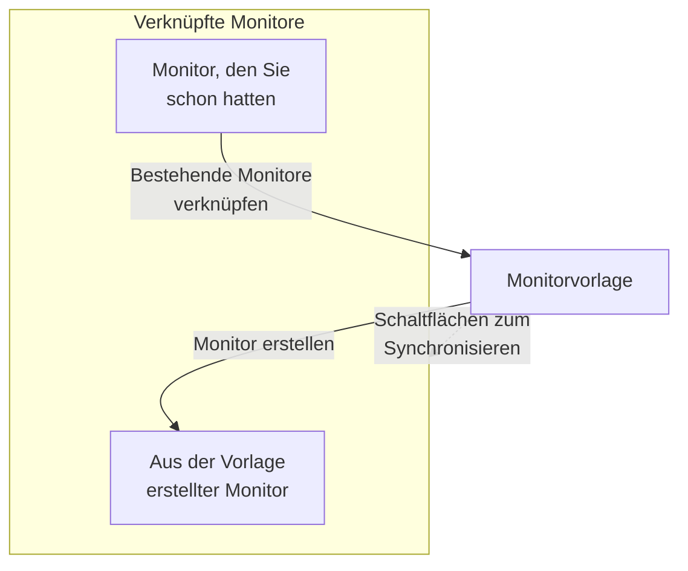

# Monitorvorlagen

Eine Monitorvorlage ist eine gespeicherte Monitorkonfiguration (ein Typ, Kriterien, ein Intervall, Beschriftungen und Standardwerte für benutzerdefinierte Felder), aus der Sie mit einem Klick Monitore erstellen. Monitore, die daraus erstellt oder damit verknüpft wurden, bleiben verbunden: Ändern Sie die Vorlage und synchronisieren Sie die Änderung dann auf alle. Verwenden Sie Vorlagen, wenn sich viele Monitore gleich verhalten sollen, etwa dieselbe Integritätsprüfung für jeden Dienst oder dieselben API-Prüfungen in Produktion und Staging.

:::cards
- [Eine Vorlage erstellen](#eine-vorlage-erstellen): Vier Schritte, wie bei Monitor erstellen.
- [Monitore daraus erstellen](#monitore-aus-einer-vorlage-erstellen): Ein Klick, oder vorhandene Monitore verknüpfen.
- [Änderungen synchronisieren](#änderungen-auf-verknüpfte-monitore-synchronisieren): Was jede Synchronisierungsschaltfläche kopiert.
- [Werte pro Monitor behalten](#werte-pro-monitor-behalten): Ein Ziel oder Header vor einer Synchronisierung schützen.
:::

## So funktionieren Vorlagen

Eine Vorlage überwacht selbst nichts. Monitore werden aus ihr erstellt oder mit ihr verknüpft, und die Seite der Vorlage listet sie als **Verknüpfte Monitore** auf. Wenn Sie die Vorlage ändern, ändert sich an diesen Monitoren nichts, bis Sie synchronisieren: Jede Synchronisierungsschaltfläche kopiert einen Teil der Vorlage auf jeden verknüpften Monitor, und geschützte Felder behalten den eigenen Wert jedes Monitors.



## Bevor Sie beginnen

- **Eine Rolle, die Vorlagen erstellen darf**: Project Owner, Project Admin, Project Member, Monitor Admin oder Monitor Member oder eine benutzerdefinierte Rolle mit der Berechtigung Create Monitor Template. Eine Vorlage zu ändern erfordert dieselben Rollen oder die Berechtigung Edit Monitor Template.
- **Die Berechtigung, die verknüpften Monitore zu aktualisieren.** Eine Synchronisierung schreibt in Ihrem Namen in jeden verknüpften Monitor und überspringt die Monitore, die Ihre Berechtigungen nicht abdecken.

## Eine Vorlage erstellen

:::steps
### Vorlagen öffnen

Gehen Sie zu **Monitore → Einstellungen → Vorlagen** und klicken Sie auf **Monitorvorlage erstellen**.

### Die Vorlage benennen

Geben Sie unter **Vorlageninformationen** einen **Vorlagenname** ein, etwa `Production API Health`, und eine **Vorlagenbeschreibung**, und klicken Sie dann auf **Weiter**.

### Die Standardwerte des Monitors festlegen

Wählen Sie unter **Überwachungs-Standardwerte** den **Monitortyp**, mit derselben Auswahl wie bei Monitor erstellen. Geben Sie optional einen **Standard-Überwachungsname** ein; bleibt er leer, wird jeder Monitor nach der Ressource benannt, die er überwacht. **Standard-Überwachungsbeschreibung** und **Beschriftungen** warten unter **Weitere Felder**. Klicken Sie auf **Weiter**.

### Die Kriterien und das Intervall festlegen

Füllen Sie unter **Kriterien** aus, was geprüft wird, und die Kriterien, wie bei [Monitor erstellen](/docs/monitor/create-monitor#kriterien). Mit der Karte **Einstellungen für die Vorlagensynchronisierung** oben schützen Sie Felder vor Synchronisierungen (siehe [Werte pro Monitor behalten](#werte-pro-monitor-behalten)). Bei einem Monitortyp, den Sonden prüfen, fragt der letzte Schritt, **Intervall**, nach dem **Überwachungsintervall**. Klicken Sie auf dem letzten Schritt auf **Monitorvorlage erstellen**.
:::

Die Vorlage wird der Liste hinzugefügt. Öffnen Sie sie, um ihre Seite mit einer Karte pro Teil zu sehen: **Vorlageninformationen**, **Überwachungs-Standardwerte**, **Überwachungskriterien**, **Überwachungsintervall** (mit **Minimale Sonden-Übereinstimmung**), **Beschriftungen**, **Standardwerte für benutzerdefinierte Felder** (wenn das Projekt benutzerdefinierte Monitorfelder hat) und **Verknüpfte Monitore**. Jeden Teil ändern Sie auf seiner eigenen Karte, zum Beispiel mit **Kriterien bearbeiten** oder **Intervall bearbeiten**.

## Monitore aus einer Vorlage erstellen

- **Neuer Monitor.** Klicken Sie in der Liste in der Zeile der Vorlage auf **Monitor erstellen** oder auf ihrer Seite auf **Überwachung aus Vorlage erstellen**. **Monitor erstellen** öffnet sich mit dem Typ und den Einstellungen der Vorlage; ändern Sie, was nötig ist, und erstellen Sie ihn dann. Der neue Monitor ist mit der Vorlage verknüpft.
- **Monitore, die Sie schon haben.** Klicken Sie unter **Verknüpfte Monitore** auf **Bestehende Monitore verknüpfen** und wählen Sie sie aus. Sie behalten ihre Einstellungen, bis Sie synchronisieren.

Werte, die unter **Standardwerte für benutzerdefinierte Felder** gesetzt sind, werden in jeden aus der Vorlage erstellten Monitor geschrieben, auch in Monitore, die Regeln für den automatischen Import und Warnungsrichtlinien aus ihr erstellen.

## Änderungen auf verknüpfte Monitore synchronisieren

Eine Vorlage zu bearbeiten ändert nur die Vorlage. Um eine Änderung auf die verknüpften Monitore zu kopieren, verwenden Sie die Synchronisierungsschaltfläche auf der Karte, die Sie geändert haben. Jede Schaltfläche nennt, wie viele Monitore sie erreicht, etwa **Sync Criteria to 3 Linked Monitors**, und ist ausgegraut, solange nichts verknüpft ist. Eine Synchronisierung lässt sich nicht rückgängig machen.

| Schaltfläche | Kopiert auf jeden verknüpften Monitor | Lässt unverändert |
| --- | --- | --- |
| **Kriterien mit verknüpften Monitoren synchronisieren** | Die Kriterien und die Schritteinstellungen, etwa Ziele und Anfrageoptionen, außer geschützten Feldern | Das Überwachungsintervall, die minimale Sondenübereinstimmung, den Namen, die Beschreibung, die Beschriftungen und die Werte benutzerdefinierter Felder |
| **Synchronisierungsintervall mit verknüpften Monitoren** | Das Überwachungsintervall und die minimale Sondenübereinstimmung | Die Kriterien, den Namen, die Beschreibung, die Beschriftungen und die Werte benutzerdefinierter Felder |
| **Beschriftungen mit verknüpften Monitoren synchronisieren** | Die Beschriftungen, und sonst nichts | Alles andere |
| **Benutzerdefinierte Felder mit verknüpften Monitoren synchronisieren** | Die benutzerdefinierten Felder, für die die Vorlage einen Standardwert hat, anstelle dessen, was jeder Monitor hatte | Benutzerdefinierte Felder, die die Vorlage leer lässt, und alles andere |

Um einen einzelnen Monitor zu synchronisieren, klicken Sie in seiner Zeile unter **Verknüpfte Monitore** auf **Aus Vorlage synchronisieren**. Das kopiert die Kriterien und Schritteinstellungen (außer geschützten Feldern), das Überwachungsintervall, die minimale Sondenübereinstimmung und die Beschriftungen und lässt den Namen, die Beschreibung und die Werte benutzerdefinierter Felder des Monitors unverändert. **Verknüpfung mit der Vorlage aufheben** trennt einen Monitor; er behält seine Einstellungen.

Nach einer Synchronisierung nennt eine Zusammenfassung, wie viele Monitore aktualisiert wurden. **Teilweise synchronisiert** bedeutet, dass einige verknüpfte Monitore noch die vorherige Konfiguration haben, meist weil Ihre Berechtigungen sie nicht abdecken.

## Werte pro Monitor behalten

Eine Kriteriensynchronisierung kopiert auch Schritteinstellungen wie Ziele, Anfrage-Header und Zeitlimits, sofern Sie diese Felder nicht schützen. Schützen Sie ein Feld, damit jeder verknüpfte Monitor seinen eigenen Wert dafür behält.

:::steps
### Die Vorlage öffnen

Gehen Sie zu **Monitore → Einstellungen → Vorlagen** und öffnen Sie die Vorlage.

### Ihre Kriterien bearbeiten

Klicken Sie auf der Karte **Überwachungskriterien** auf **Kriterien bearbeiten**.

### Die Felder schützen

Setzen Sie unter **Einstellungen für die Vorlagensynchronisierung** neben jedem Feld, das auf den verknüpften Monitoren erhalten bleiben soll, ein Häkchen bei **Dieses Feld nicht synchronisieren**.

### Speichern

Speichern Sie Ihre Änderungen. Die Karte **Überwachungskriterien** und die Bestätigung beider Synchronisierungen unten listen die geschützten Felder auf.

### Synchronisieren

Verwenden Sie **Kriterien mit verknüpften Monitoren synchronisieren** oder **Aus Vorlage synchronisieren** an einem einzelnen verknüpften Monitor.
:::

Schützen Sie zum Beispiel auf einer API-Vorlage **Monitor destination** und **Request headers**. Produktions- und Staging-Monitore behalten ihre eigenen URLs und Header, während beide die aktualisierten Kriterien der Vorlage und die übrigen ungeschützten Einstellungen erhalten.

Welche Optionen es gibt, hängt vom Monitortyp ab. Dazu gehören Ziele und Ports, HTTP-Anfrageoptionen, Datenbankverbindungen, DNS-Einstellungen, Infrastruktur-Selektoren und Telemetrie-Abfragen. Zusammengehörige Anmeldedaten, etwa ein Client-Zertifikat und sein privater Schlüssel, werden zusammen behalten.

### Wie Ausnahmen wirken

- Angehakte Felder behalten den aktuellen Wert jedes bestehenden Monitors, auch einen leeren oder nicht gesetzten Wert. Anfrage-Header und andere Sammlungen bleiben vollständig erhalten.
- Nicht angehakte Felder werden weiter aus der Vorlage synchronisiert. Entfernen Sie das Häkchen bei einem geschützten Feld und speichern Sie, damit bei der nächsten Synchronisierung sein Vorlagenwert kopiert wird.
- Ausnahmen gelten für Sammel- und Einzelsynchronisierungen. Sie werden in der Vorlage gespeichert und nicht für jede Synchronisierung einzeln ausgewählt.
- Neue Monitore beginnen weiterhin mit den Feldwerten der Vorlage. Ausnahmen wirken sich nur auf das Synchronisieren bestehender Monitore aus.
- Kriterien werden immer synchronisiert. Eine reine Kriteriensynchronisierung lässt das Überwachungsintervall, die Beschriftungen und andere Einstellungen auf Monitorebene unverändert.
- Bestehende Vorlagen haben keine Feldausnahmen, bis Sie welche einrichten. Netzwerkgerät-Monitore behalten ihre eigene Gerätebindung weiterhin automatisch.

Bei Vorlagen mit mehreren Schritten werden geschützte Werte über die Schritt-IDs zugeordnet. Unabhängig erstellte einstufige Monitore können auch eine einstufige Vorlage erhalten. Lässt sich ein geschützter Schritt nicht zuordnen, wird die Synchronisierung abgelehnt, bevor ein Monitor aktualisiert wird, sodass ein neuer oder umsortierter Schritt nicht versehentlich das Ziel oder die Anmeldedaten eines anderen Schritts kopieren kann.

> [!IMPORTANT]
> Bevor Sie den Monitortyp einer gespeicherten Vorlage ändern (mit **Monitor-Standardwerte bearbeiten**), entfernen Sie unter **Kriterien bearbeiten** die Ausnahmen, die für den neuen Typ nicht gelten. Alle Ausnahmen einer Vorlage müssen für ihren Monitortyp existieren.

## API-Konfiguration

Jeder Schritt einer Vorlage akzeptiert ein Array `doNotSyncFields` in seinem Objekt `MonitorStep.value`. Für einen API-Monitor schützen Sie sein Ziel und die gesamte Header-Sammlung so:

```json title="monitorSteps (excerpt)"
{
  "_type": "MonitorSteps",
  "value": {
    "monitorStepsInstanceArray": [
      {
        "_type": "MonitorStep",
        "value": {
          "id": "<step id>",
          "doNotSyncFields": ["monitorDestination", "requestHeaders"]
        }
      }
    ]
  }
}
```

Lassen Sie das Array weg oder setzen Sie es auf `[]`, um jede unterstützte Schritteinstellung zu synchronisieren. Nicht unterstützte Feldnamen und Felder, die für den Monitortyp der Vorlage nicht gelten, werden abgelehnt. Das Array der Vorlage steuert die Synchronisierung; solche Metadaten an einem verknüpften Monitor überschreiben es nicht.

:::details Feldnamen für doNotSyncFields, nach Monitortyp
| Monitortyp | Feldnamen |
| --- | --- |
| Website, API, Ping, IP, Port, SSL-Zertifikat, NTP | `monitorDestination`, `requestTimeoutInMs`, `retryCount` |
| Nur API | `requestHeaders`, `requestType`, `requestBody` |
| Website und API | `doNotFollowRedirects`, `allowSelfSignedCertificates`, `tlsClientAuthentication` (Client-Zertifikat, Schlüssel und Passphrase zusammen) |
| Port, NTP | `monitorDestinationPort` |
| Synthetischer Monitor, Custom JavaScript Code | `customCode` |
| Synthetischer Monitor | `browserTypes`, `screenSizeTypes`, `retryCountOnError` |
| DNS | `dnsMonitor.queryName`, `dnsMonitor.recordType`, `dnsMonitor.resolver` (DNS-Server und Port zusammen), `dnsMonitor.timeout`, `dnsMonitor.retries` |
| Domäne | `domainMonitor.domainName`, `domainMonitor.lookupMethod`, `domainMonitor.timeout`, `domainMonitor.retries` |
| DNSSEC | `dnssecMonitor.domainName`, `dnssecMonitor.resolvers`, `dnssecMonitor.checkNameserverConsistency`, `dnssecMonitor.signatureExpiryWarningDays`, `dnssecMonitor.timeout`, `dnssecMonitor.retries` |
| SQL-Abfrage | `sqlMonitor.connection`, `sqlMonitor.connectionTimeoutInMs`, `sqlMonitor.statementTimeoutInMs`, `sqlMonitor.query`, `sqlMonitor.maxRows` |
| Datenbank-Integrität | `databaseMonitor.connection`, `databaseMonitor.connectionTimeoutInMs`, `databaseMonitor.statementTimeoutInMs`, `databaseMonitor.enabledMetricGroups` |
| Externe Statusseite | `externalStatusPageMonitor.statusPageUrl`, `externalStatusPageMonitor.provider`, `externalStatusPageMonitor.components`, `externalStatusPageMonitor.timeout`, `externalStatusPageMonitor.retries` |
| Protokolle, Sicherheitsereignisse, Traces, KI / LLM, Metriken, Ausnahmen | `logMonitor`, `securityEventsMonitor`, `traceMonitor`, `llmMonitor`, `metricMonitor`, `exceptionMonitor` (die gesamte Konfiguration des Monitors) |

Infrastruktur-Monitore (Kubernetes, Docker Container, Host, Podman Container, Proxmox, Docker Swarm, Ceph, Speicher-Array, IoT-Gerät) bieten ihren Ressourcen-Selektor, Filter (alle außer Host), Metrikabfragen und das Abfragezeitfenster an. Ihre Namen stehen unter **Einstellungen für die Vorlagensynchronisierung** in einer Vorlage dieses Typs.
:::

## Fehlerbehebung

:::details Eine Synchronisierung meldet „Teilweise synchronisiert“
Einige verknüpfte Monitore wurden nicht aktualisiert, meist weil Ihre Berechtigungen sie nicht abdecken. Bitten Sie jemanden, der jeden verknüpften Monitor aktualisieren darf, die Synchronisierung erneut auszuführen.
:::

:::details Eine Synchronisierung schlägt fehl mit „a template step cannot be matched to an existing monitor step“
Ein geschütztes Feld konnte keinem Schritt eines der Monitore zugeordnet werden, deshalb wurde die Synchronisierung angehalten, bevor einer von ihnen geändert wurde. Geben Sie den Schritten der Vorlage dieselben IDs wie den Schritten der Monitore, oder verwenden Sie eine einstufige Vorlage mit einstufigen Monitoren.
:::

:::details Die Synchronisierungsschaltflächen sind ausgegraut
Noch ist kein Monitor mit der Vorlage verknüpft. Erstellen Sie einen Monitor aus ihr oder klicken Sie unter **Verknüpfte Monitore** auf **Bestehende Monitore verknüpfen**.
:::

:::details Speichern schlägt fehl mit „Unsupported do not sync field“
Ein Name in `doNotSyncFields` ist kein Feld des Monitortyps der Vorlage. Prüfen Sie ihn anhand der Feldnamen oben.
:::

## Nächste Schritte

:::cards
- [Einen Monitor erstellen](/docs/monitor/create-monitor): Das Formular, das eine Vorlage ausfüllt.
- [API-Überwachung](/docs/monitor/api-monitor): Die Einstellungen, die eine API-Vorlage mitbringt.
- [Überwachungs-Geheimnisse](/docs/monitor/monitor-secrets): Anmeldedaten zwischen Monitoren teilen, ohne sie zu kopieren.
- [Terraform-Monitor-Schritte](/docs/terraform/monitor-steps): Monitore und ihre Schritte als Code verwalten.
:::
