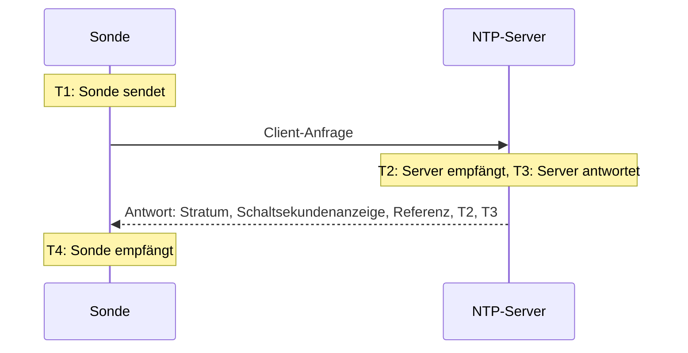

# NTP-Überwachung

Ein NTP-Monitor prüft, dass ein Zeitserver auf UDP-Port 123 antwortet und eine gute Zeit liefert: dass er synchronisiert ist, auf einem sinnvollen Stratum steht und seine Uhr mit der der Sonde übereinstimmt. Verwenden Sie ihn für die Zeitserver, die Sie selbst betreiben, etwa eine GPS-Uhr im Rechenzentrum oder die internen Server, mit denen sich Ihre Systeme synchronisieren, und für die öffentlichen Server, auf die Sie sich verlassen.

:::cards
- [Den Monitor erstellen](#einen-ntp-monitor-erstellen): Sechs Schritte im Dashboard.
- [Was die Prüfung ausliest](#was-die-prüfung-ausliest): Stratum, Uhrzeitabweichung, Schaltsekundenanzeige und der Rest der Antwort.
- [Überwachungskriterien](#überwachungskriterien): Erreichbarkeit, Synchronisation, Stratum und Abweichung.
- [Fehlerbehebung](#fehlerbehebung): Wenn der Server läuft, der Monitor aber etwas anderes sagt.
:::

## So funktioniert es

Bei jeder Prüfung sendet eine Sonde eine SNTP-Client-Anfrage (NTP-Version 4, Client-Modus) von einem zufälligen lokalen Port an den UDP-Port des Servers und wartet auf die Antwort. Es zählt nur eine echte Antwort auf genau diese Anfrage: Die Sonde schreibt 64 Zufallsbits in den Sendezeitstempel der Anfrage und ignoriert jedes Paket, das sie nicht zurückgibt, kürzer als ein NTP-Paket ist oder nicht im Server-Modus steht. Eine veraltete Antwort auf eine frühere Prüfung oder eine gefälschte Antwort lässt einen ausgefallenen Server daher nie lebendig aussehen.

Aus den vier Zeitstempeln berechnet die Sonde die **Uhrzeitabweichung**, ((T2 − T1) + (T3 − T4)) / 2: wie weit die Uhr des Servers von der der Sonde abweicht. Eine positive Abweichung bedeutet, dass der Server vorgeht. Die Formel geht davon aus, dass Anfrage und Antwort gleich lange unterwegs sind. Ein Weg, der in eine Richtung deutlich langsamer ist, kann die Abweichung daher um bis zu die Hälfte der Umlaufzeit verfälschen.

> [!NOTE]
> Die Abweichung wird gegen die eigene Uhr der Sonde gemessen. Die Sonden von OneUptime Cloud halten ihre Uhren synchronisiert. Halten Sie auf einer [benutzerdefinierten Sonde](/docs/probe/custom-probe) auch die Uhr des Hosts synchronisiert, mit chrony oder systemd-timesyncd, sonst betrifft ein Abweichungsalarm womöglich die Sonde und nicht den Server.

Ein Server, der antwortet, wird nicht erneut gefragt, auch wenn er ohne gute Zeit antwortet. Keine Antwort, ein abgelehnter Port und eine fehlgeschlagene DNS-Abfrage werden mit einer neuen Anfrage wiederholt. Antwortet der Server gar nicht, verfolgt die Sonde zusätzlich die Route zu ihm und hängt das Ergebnis als **Netzwerkpfad zum Zeitpunkt des Fehlers** an. Eine Sonde, die ihre eigene Netzwerkverbindung verloren hat, meldet kein Ergebnis und kann Ihren Server daher nicht als offline markieren.

## Bevor Sie beginnen

- **Eine Rolle, die Monitore erstellen darf**: Project Owner, Project Admin, Project Member, Monitor Admin oder Monitor Member, oder eine eigene Rolle mit der Berechtigung Create Monitor.
- **Eine Sonde, die UDP-Port 123 auf dem Server erreicht.** Jede Sonde kann einen öffentlichen Zeitserver prüfen. Für einen Server in einem privaten Netzwerk verwenden Sie eine [benutzerdefinierte Sonde](/docs/probe/custom-probe) in diesem Netzwerk. Eine Firewall vor dem Server muss UDP durchlassen, nicht nur TCP, und zwar von den [IP-Adressen der Sonden von OneUptime Cloud](/docs/configuration/ip-addresses) oder von Ihrer benutzerdefinierten Sonde.

## Einen NTP-Monitor erstellen

:::steps
### Einen neuen Monitor beginnen

Gehen Sie zu **Monitore** und klicken Sie auf **Monitor erstellen**. Geben Sie unter **Monitortyp** `ntp` in das Suchfeld ein und wählen Sie **NTP**. Der Typ steht auch unter **Weitere Monitortypen**, in der Gruppe Netzwerk.

### Einen Namen vergeben

Geben Sie einen **Name** ein, zum Beispiel `GPS-Zeitserver`, und klicken Sie auf **Weiter**.

### Den Server eingeben

Geben Sie unter **NTP-Server** den Hostnamen oder die IP-Adresse des Servers ein, zum Beispiel `time.example.com` oder `192.168.1.10`. Die Anfrage geht an Port 123. Für einen anderen Port öffnen Sie **Weitere Felder** und setzen **Port**.

### Testen

Klicken Sie auf **Monitor testen**, wählen Sie unter **Sonde auswählen** eine Sonde und klicken Sie auf **Test ausführen**. **Überwachungs-Testergebnis** zeigt, ob der Server geantwortet hat, ob er synchronisiert ist, sein Stratum und wie weit seine Uhr abweicht.

### Die Kriterien prüfen

**Monitor-Kriterien** beginnt mit den [Standardkriterien](#standardkriterien): offline, wenn der Server keine gute Zeit liefert, online, wenn er es tut. Ändern Sie sie bei Bedarf und klicken Sie dann auf **Weiter**.

### Sonden wählen und erstellen

Behalten oder ändern Sie die **Sonden** und das **Überwachungsintervall** (es beginnt bei **Alle 5 Minuten**) und klicken Sie auf **Monitor erstellen**. Die Seite des Monitors öffnet sich.
:::

## Konfigurationsoptionen

| Feld | Standard | Was Sie eingeben |
| --- | --- | --- |
| **NTP-Server** | Keiner | Der Server, zum Beispiel `time.example.com`, `192.168.1.10` oder `2001:db8::123`. Geben Sie nur den Host ein, ohne `udp://`. Ein Port hinter dem Host, wie `time.example.com:1123`, wird statt **Port** verwendet. |
| **Port** (unter **Weitere Felder**) | `123` | Der UDP-Port, auf dem der Server NTP beantwortet, von `1` bis `65535`. Leer lassen für `123`. |
| **Anfrage-Zeitlimit (Sekunden)** (unter **Weitere Felder**) | `5` | Wie lange ein Versuch auf die Antwort wartet, einschließlich der DNS-Abfrage. Das Maximum sind 60 Sekunden. |
| **Wiederholungen bei Fehlschlag** (unter **Weitere Felder**) | Standard der Sonde, meist `3` | Wie oft ein Versuch ohne Antwort wiederholt wird. Das Maximum ist 3. |

**Wiederholungen bei Fehlschlag** zählt die Wiederholungen _nach_ dem ersten Versuch: `0` führt die Prüfung einmal aus und `2` bis zu dreimal, mit einer Pause von einer Sekunde zwischen den Versuchen. Leer gelassen gilt der Standard der Sonde: 3, sofern `PROBE_MONITOR_RETRY_LIMIT` der Sonde nichts anderes festlegt.

## Was die Prüfung ausliest

Die Seite des Monitors zeigt die letzte Prüfung jeder Sonde:

| Feld | Bedeutung |
| --- | --- |
| **Synchronisiert** | Ob der Server mit Stratum 1 bis 15 geantwortet hat, ohne den Alarm in seiner Schaltsekundenanzeige und mit echten Zeitstempeln in seiner Antwort. |
| **Uhrzeitabweichung** | Wie weit die Uhr des Servers von der der Sonde abweicht, und in welche Richtung. Ein gesunder Server liegt wenige Millisekunden daneben. |
| **Stratum** | Wie viele Schritte der Server von einer Referenzuhr entfernt ist: 1 für einen Server mit eigener GPS- oder Atomuhr, 2 für einen, der sich mit einem Stratum-1-Server synchronisiert, und so weiter. 16 bedeutet nicht synchronisiert. |
| **Referenz** | Womit sich der Server synchronisiert: ein Quellenname wie `GPS`, `PPS` oder `NIST` bei Stratum 1, ab Stratum 2 die Adresse des vorgelagerten Servers. |
| **Schaltsekundenanzeige** | 0, wenn keine Schaltsekunde ansteht, 1 oder 2, wenn am Ende des Tages eine hinzugefügt oder entfernt wird, 3, wenn der Server seine Uhr als nicht synchronisiert meldet. |
| **Root-Streuung** | Die eigene Schätzung des Servers, wie weit seine Zeit von der wahren Zeit abweichen könnte. Sie wächst, solange der Server seine Quelle nicht erreicht. ntpd vertraut einem Server nicht mehr, sobald die halbe Root-Verzögerung plus dieser Wert 1,5 Sekunden überschreitet. |
| **Root-Verzögerung** | Die Umlaufzeit vom Server zu seiner Referenzuhr. |
| **Antwortzeit** | Vom Senden der Anfrage durch die Sonde bis zum Empfang der Antwort, ohne die DNS-Abfrage. |
| **Serverzeit** | Die Uhr des Servers, als er die Antwort sendete. |

Ein Server, der die Zeit verweigert, sendet stattdessen ein **Kiss-o'-Death**: eine Antwort mit Stratum 0 und einem Code aus vier Buchstaben. Die häufigsten Codes sind `RATE` (der Server drosselt die Sonde), `DENY` und `RSTR` (seine Zugriffsregeln lehnen die Sonde ab) und `INIT` (er hat sich noch nicht synchronisiert). Die Prüfung zeigt den Code und wertet den Server als antwortend, aber nicht synchronisiert.

## Überwachungskriterien

Kriterien entscheiden, wann der Server als online, eingeschränkt oder offline gilt, und ob dabei ein Vorfall erklärt oder ein Alarm erstellt wird. Jedes Kriterium prüft einen oder mehrere Filter:

| Filter | Bedingungen | Was er prüft |
| --- | --- | --- |
| **NTP Is Online** | **Wahr**, **Falsch** | Ob der Server die Anfrage der Sonde mit einer NTP-Antwort beantwortet hat. Ein Kiss-o'-Death ist eine Antwort. |
| **NTP Is Synchronized** | **Wahr**, **Falsch** | Ob der Server, der geantwortet hat, synchronisierte Zeit liefert. Antwortet der Server nicht, wird dieser Filter nicht geprüft; dafür ist **NTP Is Online** da. |
| **NTP Stratum** | **Greater Than**, **Greater Than Or Equal To**, **Less Than**, **Less Than Or Equal To**, **Equal To**, **Not Equal To** | Das Stratum des Servers. Die 0 eines Kiss-o'-Death zählt als 16, nicht synchronisiert. |
| **NTP Clock Offset (in ms)** | **Greater Than**, **Less Than**, **Greater Than Or Equal To**, **Less Than Or Equal To** | Wie weit die Uhr des Servers von der der Sonde abweicht, in beide Richtungen. |
| **NTP Response Time (in ms)** | **Greater Than**, **Less Than**, **Greater Than Or Equal To**, **Less Than Or Equal To** | Von der Anfrage bis zur Antwort. |
| **NTP Root Dispersion (in ms)** | **Greater Than**, **Less Than**, **Greater Than Or Equal To**, **Less Than Or Equal To** | Die eigene Schätzung des Servers für seinen maximalen Fehler. |

Bei zwei oder mehr Filtern entscheidet **Abgleichsbedingung**, ob **Alle** zutreffen müssen oder **Beliebig** einer genügt. Die **Aktionen** eines Kriteriums legen fest, was es tut: den Monitorstatus ändern, einen Alarm erstellen, einen Vorfall erklären oder eine Kombination davon.

### Standardkriterien

Ein neuer NTP-Monitor beginnt mit zwei Kriterien:

- **Offline** — der Server antwortet nicht, ist nicht synchronisiert, oder seine Uhr weicht `1000` ms oder mehr von der der Sonde ab. Der Monitor wird als **Offline** markiert und ein Vorfall namens „_Monitorname_ is not serving good time“ wird erstellt. Er löst sich selbst auf, sobald der Server wieder gute Zeit liefert.
- **Online** — der Server antwortet, ist synchronisiert und seine Uhr liegt innerhalb von `1000` ms an der der Sonde. Der Monitor wird als **Betriebsbereit** markiert.

Kriterien werden von oben nach unten geprüft, und das erste zutreffende entscheidet. Ein Server, der mit der falschen Zeit antwortet, gilt bewusst als ausgefallen: Jeder Client, der ihm folgt, würde diese Zeit übernehmen.

### Über einen Zeitraum auswerten

**Diese Kriterien über einen Zeitraum hinweg auswerten** ist ein Kontrollkästchen unter jedem NTP-Filter. Schalten Sie es ein, um ein Fenster vergangener Prüfungen statt nur der letzten zu bewerten: Wählen Sie unter **Auswerten** eine Aggregation und unter **Für die letzten (in Minuten)** ein Fenster von 2 bis 60 Minuten. Nur Prüfungen, auf die der Server geantwortet hat, haben ein Stratum, eine Abweichung und eine Root-Streuung. Ein Fenster ohne Antworten hat für diese Filter also keine Daten, und **Bei keinen Daten** entscheidet, was passiert.

### Beispielkriterien

| Ziel | Filter | Bedingung | Wert |
| --- | --- | --- | --- |
| Alarm, wenn ein GPS-Server auf eine Netzwerkquelle zurückfällt | **NTP Stratum** | **Greater Than** | `1` |
| Alarm, wenn die Uhr abdriftet | **NTP Clock Offset (in ms)** | **Greater Than** | `100` |
| Alarm, wenn die Fehlergrenze des Servers wächst | **NTP Root Dispersion (in ms)** | **Greater Than** | `500` |
| Alarm, wenn die Antworten langsam werden | **NTP Response Time (in ms)** | **Greater Than** | `1000` |

## Fehlerbehebung

:::details Der Server läuft, aber der Monitor sagt, er habe nicht geantwortet
Die Anfrage oder die Antwort ging unterwegs verloren. Eine Firewall, die TCP erlaubt, aber nicht UDP, eine `restrict`-Regel in ntpd oder eine `allow`-Regel in chrony, die die Adresse der Sonde auslässt, oder ein Server, der nur auf einer internen Schnittstelle lauscht, sehen alle so aus. **Netzwerkpfad zum Zeitpunkt des Fehlers** zeigt, wie weit die Route kam. Lassen Sie die Sonde durch oder prüfen Sie den Server von einer [benutzerdefinierten Sonde](/docs/probe/custom-probe) im Netzwerk aus.
:::

:::details Der Monitor sagt, der Server habe die Anfrage abgelehnt
Der Host hat geantwortet, dass auf diesem UDP-Port nichts lauscht (ICMP port unreachable): Der NTP-Dienst ist gestoppt oder lauscht auf einem anderen Port. Starten Sie den Dienst oder setzen Sie **Port** auf den verwendeten Port.
:::

:::details Der Server antwortet mit einem Kiss-o'-Death
`RATE` bedeutet, dass der Server die Sonde drosselt. Die Sonde fragt einmal pro Prüfung, ein längeres **Überwachungsintervall** oder eine Ausnahme für die Adressen der Sonde in der Drosselung des Servers beendet es also. `DENY` und `RSTR` bedeuten, dass die Zugriffsregeln des Servers die Sonde ablehnen. `INIT` und `STEP` bedeuten, dass sich der Server noch nicht synchronisiert hat, was in den ersten Minuten nach dem Start normal ist.
:::

:::details Jeder NTP-Monitor auf einer Sonde zeigt eine ähnliche Abweichung
Die Uhr der Sonde geht falsch, nicht die der Server. Prüfen Sie, dass der Host der Sonde seine Uhr synchronisiert hält, oder führen Sie die Monitore auf einer anderen Sonde aus.
:::

:::details Die Abweichung springt zwischen den Prüfungen
Die Sonde ist weit vom Server entfernt, oder der Weg ist in eine Richtung langsamer als in die andere. Verwenden Sie eine Sonde näher am Server, oder bewerten Sie die Abweichung über einige Minuten mit **Diese Kriterien über einen Zeitraum hinweg auswerten** und **Durchschnitt**.
:::

## Nächste Schritte

:::cards
- [Ping-Monitor](/docs/monitor/ping-monitor): Prüfen, ob der Host selbst erreichbar ist.
- [Port-Monitor](/docs/monitor/port-monitor): Die TCP-Dienste auf demselben Host prüfen.
- [Benutzerdefinierte Sonden](/docs/probe/custom-probe): Zeitserver im eigenen Netzwerk prüfen.
- [Vorfall- und Alarm-Vorlagen](/docs/monitor/incident-alert-templating): Stratum und Abweichung in den Titel eines Vorfalls schreiben.
:::
