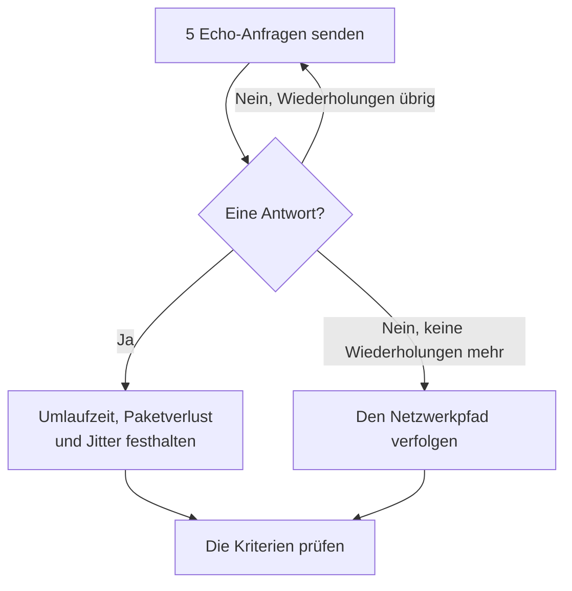

# Ping-Überwachung

Ein Ping-Monitor prüft, ob ein Host auf Ping antwortet (ICMP-Echo-Anfragen), und misst die Umlaufzeit, den Paketverlust und den Jitter. Verwenden Sie ihn für Server, Router, Firewalls und andere Geräte, die Sie über einen Hostnamen oder eine IP-Adresse erreichen.

:::cards
- [Den Monitor erstellen](#einen-ping-monitor-erstellen): Sechs Schritte im Dashboard.
- [Konfigurationsoptionen](#konfigurationsoptionen): Der Host, das Zeitlimit und Wiederholungen.
- [Überwachungskriterien](#überwachungskriterien): Erreichbarkeit, Latenz, Paketverlust und Jitter.
- [Fehlerbehebung](#fehlerbehebung): Wenn der Host läuft, der Monitor aber offline meldet.
:::

## So funktioniert es

Bei jeder Prüfung sendet eine Sonde fünf Echo-Anfragen an den Host. Kommt mindestens eine Antwort zurück, ist der Host online, und die Sonde hält die durchschnittliche Umlaufzeit als Antwortzeit fest, dazu den Paketverlust, den Jitter und die schnellste und langsamste Antwort. Kommt keine Antwort zurück, versucht es die Sonde erneut, bis zur Zahl der Wiederholungen, die Sie zulassen. Danach prüft OneUptime das Ergebnis anhand der Kriterien des Monitors.

Schlägt eine Prüfung fehl, verfolgt die Sonde außerdem die Route zum Host, schlägt seinen Namen nach und hängt das Gefundene als **Netzwerkpfad zum Zeitpunkt des Fehlers** an das Ergebnis an, damit Sie sehen, wo die Route abgebrochen ist.

> [!NOTE]
> Manche Hosting-Anbieter blockieren ICMP auf den Maschinen, auf denen eine Sonde läuft. Eine Sonde, die überhaupt keine Pings senden kann, prüft stattdessen den TCP-Port `80` des Hosts, sodass der Monitor trotzdem sagt, ob der Host erreichbar ist. Paketverlust und Jitter werden dann nicht gemessen.

Eine Sonde, die ihre eigene Netzwerkverbindung verloren hat, meldet kein Ergebnis und kann Ihren Host daher nicht als offline markieren.

## Bevor Sie beginnen

- **Eine Rolle, die Monitore erstellen darf**: Project Owner, Project Admin, Project Member, Monitor Admin oder Monitor Member oder eine benutzerdefinierte Rolle mit der Berechtigung Create Monitor.
- **Eine Sonde, die den Host erreicht**, mit ICMP auf dem Weg erlaubt. Die Standardsonden Ihres Projekts werden für jeden neuen Monitor ausgewählt. Steht eine Firewall vor dem Host, lassen Sie ICMP-Echo-Anfragen von den [Sonden-IP-Adressen von OneUptime Cloud](/docs/configuration/ip-addresses) zu. Ein Host in einem privaten Netzwerk braucht eine [benutzerdefinierte Sonde](/docs/probe/custom-probe) in diesem Netzwerk.

## Einen Ping-Monitor erstellen

:::steps
### Einen neuen Monitor beginnen

Gehen Sie zu **Monitore** und klicken Sie auf **Monitor erstellen**. Wählen Sie unter **Monitortyp** den Typ **Ping**.

### Ihn benennen

Geben Sie einen **Name** ein, etwa `Core router`, und klicken Sie dann auf **Weiter**.

### Den Host eingeben

Geben Sie unter **Hostname oder IP-Adresse** den Hostnamen oder die IPv4- oder IPv6-Adresse ein, die angepingt werden soll, etwa `example.com` oder `192.168.1.1`. Geben Sie nur den Host ein, ohne `http://` und ohne Port.

### Ihn testen

Klicken Sie auf **Monitor testen**, wählen Sie unter **Sonde auswählen** eine Sonde und klicken Sie auf **Test ausführen**. **Überwachungs-Testergebnis** zeigt die Umlaufzeiten und den Paketverlust, die die Sonde gesehen hat.

### Die Kriterien prüfen

**Monitor-Kriterien** beginnt mit den [Standardkriterien](#standardkriterien): offline, wenn der Host nicht antwortet, online, wenn er antwortet. Ändern Sie sie bei Bedarf und klicken Sie dann auf **Weiter**.

### Sonden wählen und erstellen

Behalten oder ändern Sie die **Sonden** und das **Überwachungsintervall** (es beginnt bei **Alle 5 Minuten**) und klicken Sie dann auf **Monitor erstellen**. Die Seite des Monitors öffnet sich.
:::

## Konfigurationsoptionen

| Feld | Standard | Was eingetragen wird |
| --- | --- | --- |
| **Hostname oder IP-Adresse** | Keiner | Der Host, der angepingt wird, etwa `example.com`, `192.168.1.1` oder `2001:db8::1`. Ein Hostname wird bei jeder Prüfung aufgelöst, sodass der Monitor DNS-Änderungen folgt. |
| **Anfrage-Zeitlimit (Sekunden)** (unter **Weitere Felder**) | `60` | Wie lange bei jedem Versuch auf eine Antwort gewartet wird. Das Maximum sind 60 Sekunden. |
| **Wiederholungen bei Fehlschlag** (unter **Weitere Felder**) | Standard der Sonde, meist `3` | Wie oft ein fehlgeschlagener Versuch wiederholt wird. Das Maximum ist 3. |

**Wiederholungen bei Fehlschlag** zählt die Wiederholungen _nach_ dem ersten Versuch, also führt `0` die Prüfung einmal aus und `2` bis zu dreimal. Bleibt das Feld leer, gilt der Standard der Sonde: 3, sofern `PROBE_MONITOR_RETRY_LIMIT` der Sonde nichts anderes sagt. Jeder Fehler wird wiederholt, Zeitüberschreitungen eingeschlossen, mit einer Pause von einer Sekunde zwischen den Versuchen. Auch eine erfolgreiche Prüfung, deren Antworten länger als 10 Sekunden gedauert haben, wird erneut geprüft.

Um eine feste IP-Adresse und nie einen Hostnamen zu beobachten, können Sie stattdessen einen [IP-Monitor](/docs/monitor/ip-monitor) verwenden. Er führt dieselbe Prüfung aus.

## Überwachungskriterien

Kriterien entscheiden, wann der Host als online, beeinträchtigt oder offline gilt und ob dabei ein Vorfall gemeldet oder eine Warnung erstellt wird. Jedes Kriterium prüft einen oder mehrere Filter:

| Filter | Bedingungen | Was er prüft |
| --- | --- | --- |
| **Is Online** | **Wahr**, **Falsch** | Ob mindestens eine Echo-Anfrage eine Antwort bekommen hat. |
| **Antwortzeit (in ms)** | **Greater Than**, **Less Than**, **Greater Than Or Equal To**, **Less Than Or Equal To** | Die durchschnittliche Umlaufzeit der Antworten. |
| **Packet Loss (in %)** | **Greater Than**, **Less Than**, **Greater Than Or Equal To**, **Less Than Or Equal To** | Der Anteil der fünf Echo-Anfragen, die keine Antwort bekommen haben. |
| **Jitter (in ms)** | **Greater Than**, **Less Than**, **Greater Than Or Equal To**, **Less Than Or Equal To** | Die Standardabweichung der Umlaufzeiten über die Pakete einer Prüfung. |
| **Is Request Timeout** | **Wahr**, **Falsch** | Ob der Ping bei jedem Versuch in ein Zeitlimit gelaufen ist. |

Bei zwei oder mehr Filtern entscheidet **Abgleichsbedingung**, ob **Alle** zutreffen müssen oder **Beliebig** einer genügt. Die **Aktionen** eines Kriteriums legen fest, was es tut: den Monitorstatus ändern, eine Warnung erstellen, einen Vorfall melden oder mehreres davon.

### Standardkriterien

Ein neuer Ping-Monitor beginnt mit zwei Kriterien:

- **Offline** — der Host beantwortet keine der Echo-Anfragen oder ist nach allen Wiederholungen überhaupt nicht erreichbar. Der Monitor wird als **Offline** markiert und ein Vorfall namens „_monitor name_ is offline“ wird erstellt. Der Vorfall löst sich von selbst auf, wenn der Host wieder antwortet.
- **Online** — der Host antwortet. Der Monitor wird als **Betriebsbereit** markiert.

Kriterien werden von oben nach unten geprüft, und das erste zutreffende entscheidet, was passiert. Trifft keines zu, zeigt der Monitor seinen Standardstatus: **Betriebsbereit**, sofern Sie unter **Weitere Felder** unterhalb der Kriterien keinen anderen wählen.

### Über einen Zeitraum auswerten

**Diese Kriterien über einen Zeitraum hinweg auswerten** ist ein Kontrollkästchen unter einem Filter, angeboten für **Is Online**, **Antwortzeit (in ms)**, **Packet Loss (in %)** und **Jitter (in ms)**. Schalten Sie es ein, um ein Fenster vergangener Prüfungen statt nur der letzten zu beurteilen: Wählen Sie unter **Auswerten** eine Aggregation und unter **Für die letzten (in Minuten)** ein Fenster von 2 bis 60 Minuten.

| Aggregation | Trifft zu, wenn |
| --- | --- |
| **Durchschnitt**, **Summe**, **Maximum Value**, **Minimum Value** | Dieser Wert über das Fenster die Bedingung erfüllt. Nur für numerische Filter. |
| **All Values** | Jede Prüfung im Fenster die Bedingung erfüllt. |
| **Any Value** | Mindestens eine Prüfung im Fenster die Bedingung erfüllt. |

**All Values** trifft erst zu, wenn das Fenster wirklich mit Daten gefüllt ist. Ein gerade erstellter Monitor oder einer, dessen Prüfungen nicht mehr aufgezeichnet wurden, hat nicht genug Verlauf, um etwas über die letzten N Minuten zu sagen, daher wartet das Kriterium, statt auf dem einen vorhandenen Messwert anzuschlagen. **Any Value** ist die Einstellung für „sag mir sofort, wenn eine einzige Prüfung den Grenzwert verletzt“ und schlägt weiterhin sofort an.

**Bei keinen Daten** entscheidet, was passiert, solange das Fenster das Kriterium nicht stützen kann:

| Option | Was passiert | Wofür |
| --- | --- | --- |
| **Ignore** (Standard) | Das Kriterium trifft nicht zu. | Gewöhnliche Schwellenwert-Warnungen. |
| **Auslöser** | Die fehlenden Daten zählen als das Problem. | Prüfungen, bei denen Stille selbst ein Fehler ist. |
| **Treat As Zero** | Das Fenster wird als einzelne Null verglichen. | Zähler, bei denen keine Ereignisse wirklich null bedeutet. |

### Beispielkriterien

| Ziel | Filter | Bedingung | Wert |
| --- | --- | --- | --- |
| Offline, wenn der Host nicht erreichbar ist | **Is Online** | **Falsch** | — |
| Warnen, wenn die Latenz hoch ist | **Antwortzeit (in ms)** | **Greater Than** | `200` |
| Den Host bei einer verlustbehafteten Verbindung als beeinträchtigt markieren | **Packet Loss (in %)** | **Greater Than** | `20` |
| Bei einer instabilen Verbindung warnen | **Jitter (in ms)** | **Greater Than** | `30` |

Um nur zu warnen, wenn die Latenz hoch bleibt, schalten Sie für den Antwortzeit-Filter **Diese Kriterien über einen Zeitraum hinweg auswerten** ein und wählen Sie **All Values** über **5** Minuten.

## Fehlerbehebung

:::details Der Host läuft, aber der Monitor meldet offline
Der Host oder eine Firewall davor beantwortet keine ICMP-Echo-Anfragen der Sonde. Viele Server und Cloud-Netzwerke verwerfen Ping standardmäßig. Lassen Sie ICMP-Echo-Anfragen von den Sonden zu, oder beobachten Sie stattdessen einen Dienst auf dem Host mit einem [Port-Monitor](/docs/monitor/port-monitor). **Netzwerkpfad zum Zeitpunkt des Fehlers** zeigt bei der fehlgeschlagenen Prüfung, wie weit die Route gekommen ist.
:::

:::details Die Prüfung schlägt fehl mit „This probe could not resolve“ für den Host
Der DNS-Server der Sonde kennt den Hostnamen nicht. Prüfen Sie den Namen, oder geben Sie stattdessen die IP-Adresse ein. Ein Name, der nur in Ihrem Netzwerk aufgelöst wird, braucht dort eine [benutzerdefinierte Sonde](/docs/probe/custom-probe).
:::

:::details Paketverlust und Jitter sind leer
Die Sonde, die die Prüfung ausgeführt hat, kann keine Pings senden und hat deshalb stattdessen den TCP-Port `80` geprüft, der beides nicht misst. Führen Sie den Monitor auf einer Sonde aus, die ICMP senden darf.
:::

## Nächste Schritte

:::cards
- [IP-Überwachung](/docs/monitor/ip-monitor): Eine feste IPv4- oder IPv6-Adresse beobachten.
- [Port-Überwachung](/docs/monitor/port-monitor): Einen Dienst auf dem Host prüfen, nicht nur den Host.
- [Benutzerdefinierte Probes](/docs/probe/custom-probe): Hosts in Ihrem eigenen Netzwerk anpingen.
- [Vorfälle](/docs/incidents/index): Was passiert, nachdem der Monitor einen gemeldet hat.
:::
