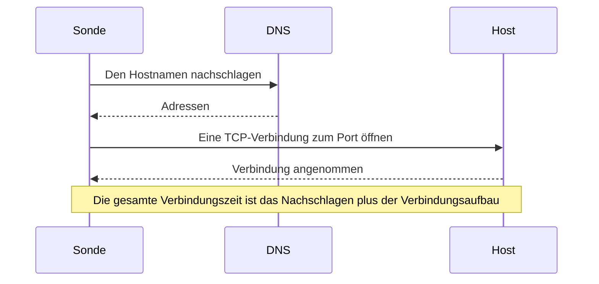

# Port-Überwachung

Ein Port-Monitor prüft, ob ein Host auf einem Port TCP-Verbindungen annimmt, und misst, wie lange der Verbindungsaufbau dauert. Verwenden Sie ihn für Dienste, die kein HTTP sprechen oder deren HTTP Sie nicht prüfen möchten: Datenbanken, Mailserver, SSH, Message Broker und Ähnliches.

:::cards
- [Den Monitor erstellen](#einen-port-monitor-erstellen): Sechs Schritte im Dashboard.
- [Verbindungszeiten](#verbindungszeiten): Was die DNS-, TCP- und Gesamtzeiten messen.
- [Überwachungskriterien](#überwachungskriterien): Erreichbarkeit und Verbindungszeiten.
- [Fehlerbehebung](#fehlerbehebung): Wenn der Dienst läuft, der Monitor aber offline meldet.
:::

## So funktioniert es

Bei jeder Prüfung schlägt eine Sonde den Hostnamen nach, falls Sie einen angegeben haben, und öffnet eine TCP-Verbindung zum Port. Der Port ist online, sobald die Verbindung angenommen wird; die Sonde schließt sie dann, ohne etwas zu senden. Eine Verbindung, die abgelehnt wird oder in ein Zeitlimit läuft, wird erneut versucht, bis zur Zahl der Wiederholungen, die Sie zulassen. Danach prüft OneUptime das Ergebnis anhand der Kriterien des Monitors.

Die Sonde öffnet nur TCP-Verbindungen: Ein Dienst, der ausschließlich auf UDP lauscht, etwa ein SNMP-Agent, lässt sich mit einem Port-Monitor nicht prüfen.

Schlägt eine Prüfung fehl, verfolgt die Sonde außerdem die Route zum Host, schlägt seinen Namen nach und hängt das Gefundene als **Netzwerkpfad zum Zeitpunkt des Fehlers** an das Ergebnis an, damit Sie sehen, wo die Route abgebrochen ist. Eine Sonde, die ihre eigene Netzwerkverbindung verloren hat, meldet kein Ergebnis und kann Ihren Dienst daher nicht als offline markieren.

## Bevor Sie beginnen

- **Eine Rolle, die Monitore erstellen darf**: Project Owner, Project Admin, Project Member, Monitor Admin oder Monitor Member oder eine benutzerdefinierte Rolle mit der Berechtigung Create Monitor.
- **Eine Sonde, die den Port erreicht.** Die Standardsonden Ihres Projekts werden für jeden neuen Monitor ausgewählt. Steht eine Firewall vor dem Dienst, erlauben Sie den [Sonden-IP-Adressen von OneUptime Cloud](/docs/configuration/ip-addresses), sich mit dem Port zu verbinden. Ein Dienst in einem privaten Netzwerk, etwa eine Datenbank, braucht eine [benutzerdefinierte Sonde](/docs/probe/custom-probe) in diesem Netzwerk.

## Einen Port-Monitor erstellen

:::steps
### Einen neuen Monitor beginnen

Gehen Sie zu **Monitore** und klicken Sie auf **Monitor erstellen**. Wählen Sie unter **Monitortyp** den Typ **Port**.

### Ihn benennen

Geben Sie einen **Name** ein, etwa `Orders database`, und klicken Sie dann auf **Weiter**.

### Den Host und den Port eingeben

Geben Sie unter **Hostname oder IP-Adresse** den Host ein, auf dem der Port liegt, etwa `db.example.com` oder `10.0.0.12`. Geben Sie unter **Port** die Portnummer ein, etwa `5432`.

### Ihn testen

Klicken Sie auf **Monitor testen**, wählen Sie unter **Sonde auswählen** eine Sonde und klicken Sie auf **Test ausführen**. **Überwachungs-Testergebnis** zeigt, ob sich die Verbindung geöffnet hat und wie lange jeder Teil gedauert hat.

### Die Kriterien prüfen

**Monitor-Kriterien** beginnt mit den [Standardkriterien](#standardkriterien): offline, wenn der Port keine Verbindung annimmt, online, wenn er eine annimmt. Ändern Sie sie bei Bedarf und klicken Sie dann auf **Weiter**.

### Sonden wählen und erstellen

Behalten oder ändern Sie die **Sonden** und das **Überwachungsintervall** (es beginnt bei **Alle 5 Minuten**) und klicken Sie dann auf **Monitor erstellen**. Die Seite des Monitors öffnet sich.
:::

## Konfigurationsoptionen

| Feld | Standard | Was eingetragen wird |
| --- | --- | --- |
| **Hostname oder IP-Adresse** | Keiner | Der Host, etwa `example.com`, `192.168.1.1` oder `2001:db8::1`. Geben Sie nur den Host ein, ohne `http://`. |
| **Port** | Keiner | Der TCP-Port, zu dem verbunden wird, von `1` bis `65535`. |
| **Anfrage-Zeitlimit (Sekunden)** (unter **Weitere Felder**) | `60` | Wie lange ein Versuch dauern darf, das DNS-Nachschlagen und die TCP-Verbindung zusammen. Das Maximum sind 60 Sekunden. |
| **Wiederholungen bei Fehlschlag** (unter **Weitere Felder**) | Standard der Sonde, meist `3` | Wie oft ein fehlgeschlagener Versuch wiederholt wird. Das Maximum ist 3. |

**Wiederholungen bei Fehlschlag** zählt die Wiederholungen _nach_ dem ersten Versuch, also führt `0` die Prüfung einmal aus und `2` bis zu dreimal. Bleibt das Feld leer, gilt der Standard der Sonde: 3, sofern `PROBE_MONITOR_RETRY_LIMIT` der Sonde nichts anderes sagt. Jeder Fehler wird wiederholt, Zeitüberschreitungen eingeschlossen, mit einer Pause von einer Sekunde zwischen den Versuchen. Auch eine erfolgreiche Verbindung, die länger als 10 Sekunden gedauert hat, wird erneut geprüft.

Gängige Ports:

| Port | Dienst |
| --- | --- |
| `22` | SSH |
| `25` | SMTP |
| `80` | HTTP |
| `443` | HTTPS |
| `3306` | MySQL |
| `5432` | PostgreSQL |
| `6379` | Redis |
| `27017` | MongoDB |

> [!NOTE]
> Viele Hosting-Anbieter blockieren ausgehendes SMTP. Auf einer Sonde, die keine Pings senden kann (daran erkennt eine Sonde, dass sie bei einem solchen Anbieter läuft), zählt eine Prüfung von Port `25`, die in ein Zeitlimit läuft, als online. Um Port `25` eines Mailservers zuverlässig zu prüfen, führen Sie den Monitor auf einer [benutzerdefinierten Sonde](/docs/probe/custom-probe) aus, die sich damit verbinden darf.

## Verbindungszeiten

Bei einem Hostnamen misst die Sonde die Prüfung in zwei Phasen:

| Phase | Von | Bis |
| --- | --- | --- |
| **DNS-Nachschlagen** | Dem Beginn der Prüfung | Dem ersten TCP-Verbindungsversuch |
| **TCP-Verbindung** | Dem ersten TCP-Verbindungsversuch | Der Annahme der Verbindung, einschließlich der Zeit für den Wechsel zwischen IPv6- und IPv4-Adressen |

**Gesamte Verbindungszeit (DNS + TCP)** läuft vom Beginn der Prüfung, bis die Verbindung angenommen wird. Sie ist auch die Antwortzeit des Port-Monitors, sodass bestehende Kriterien, Warnungen und Diagramme, die die Antwortzeit verwenden, weiter funktionieren.

Ist das Ziel eine IP-Adresse, gibt es kein DNS-Nachschlagen, sodass diese Phase entfällt. Prüfergebnisse aus der Zeit vor den Phasenzeiten zeigen nur die gesamte Verbindungszeit.

## Überwachungskriterien

Kriterien entscheiden, wann der Port als online, beeinträchtigt oder offline gilt und ob dabei ein Vorfall gemeldet oder eine Warnung erstellt wird. Jedes Kriterium prüft einen oder mehrere Filter:

| Filter | Bedingungen | Was er prüft |
| --- | --- | --- |
| **Is Online** | **Wahr**, **Falsch** | Ob der Port eine Verbindung angenommen hat. |
| **Gesamte Verbindungszeit (DNS + TCP) (in ms)** | **Greater Than**, **Less Than**, **Greater Than Or Equal To**, **Less Than Or Equal To** | Die gesamte Verbindungszeit, einschließlich des DNS-Nachschlagens bei einem Hostnamen. |
| **Port DNS Lookup Time (in ms)** | **Greater Than**, **Less Than**, **Greater Than Or Equal To**, **Less Than Or Equal To** | Das DNS-Nachschlagen vor dem ersten TCP-Versuch. Es hat keinen Wert, wenn das Ziel eine IP-Adresse ist. |
| **Port TCP Connect Time (in ms)** | **Greater Than**, **Less Than**, **Greater Than Or Equal To**, **Less Than Or Equal To** | Vom ersten TCP-Versuch bis zur Annahme der Verbindung, einschließlich des Wechsels zwischen IPv6 und IPv4. |
| **Is Request Timeout** | **Wahr**, **Falsch** | Ob das DNS-Nachschlagen oder die TCP-Verbindung bei jedem Versuch das Zeitlimit überschritten hat. |

Ein Kriterium zur DNS-Nachschlagezeit hat nichts auszuwerten, wenn das Ziel eine IP-Adresse ist. Für Kriterien, die mit Hostnamen und IP-Adressen gleichermaßen funktionieren müssen, verwenden Sie die Gesamt- oder die TCP-Verbindungszeit.

Bei zwei oder mehr Filtern entscheidet **Abgleichsbedingung**, ob **Alle** zutreffen müssen oder **Beliebig** einer genügt. Die **Aktionen** eines Kriteriums legen fest, was es tut: den Monitorstatus ändern, eine Warnung erstellen, einen Vorfall melden oder mehreres davon.

### Standardkriterien

Ein neuer Port-Monitor beginnt mit zwei Kriterien:

- **Offline** — der Port nimmt auch nach allen Wiederholungen keine Verbindung an. Der Monitor wird als **Offline** markiert und ein Vorfall namens „_monitor name_ is offline“ wird erstellt. Der Vorfall löst sich von selbst auf, wenn der Port wieder Verbindungen annimmt.
- **Online** — der Port nimmt eine Verbindung an. Der Monitor wird als **Betriebsbereit** markiert.

Kriterien werden von oben nach unten geprüft, und das erste zutreffende entscheidet, was passiert. Trifft keines zu, zeigt der Monitor seinen Standardstatus: **Betriebsbereit**, sofern Sie unter **Weitere Felder** unterhalb der Kriterien keinen anderen wählen.

### Über einen Zeitraum auswerten

**Diese Kriterien über einen Zeitraum hinweg auswerten** ist ein Kontrollkästchen unter einem Filter, angeboten für **Is Online**, **Gesamte Verbindungszeit (DNS + TCP) (in ms)**, **Port DNS Lookup Time (in ms)** und **Port TCP Connect Time (in ms)**. Schalten Sie es ein, um ein Fenster vergangener Prüfungen statt nur der letzten zu beurteilen: Wählen Sie unter **Auswerten** eine Aggregation und unter **Für die letzten (in Minuten)** ein Fenster von 2 bis 60 Minuten.

| Aggregation | Trifft zu, wenn |
| --- | --- |
| **Durchschnitt**, **Summe**, **Maximum Value**, **Minimum Value** | Dieser Wert über das Fenster die Bedingung erfüllt. Nur für numerische Filter. |
| **All Values** | Jede Prüfung im Fenster die Bedingung erfüllt. |
| **Any Value** | Mindestens eine Prüfung im Fenster die Bedingung erfüllt. |

**All Values** trifft erst zu, wenn das Fenster wirklich mit Daten gefüllt ist. Ein gerade erstellter Monitor oder einer, dessen Prüfungen nicht mehr aufgezeichnet wurden, hat nicht genug Verlauf, um etwas über die letzten N Minuten zu sagen, daher wartet das Kriterium, statt auf dem einen vorhandenen Messwert anzuschlagen. **Any Value** ist die Einstellung für „sag mir sofort, wenn eine einzige Prüfung den Grenzwert verletzt“ und schlägt weiterhin sofort an.

**Bei keinen Daten** entscheidet, was passiert, solange das Fenster das Kriterium nicht stützen kann:

| Option | Was passiert | Wofür |
| --- | --- | --- |
| **Ignore** (Standard) | Das Kriterium trifft nicht zu. | Gewöhnliche Schwellenwert-Warnungen. |
| **Auslöser** | Die fehlenden Daten zählen als das Problem. | Prüfungen, bei denen Stille selbst ein Fehler ist. |
| **Treat As Zero** | Das Fenster wird als einzelne Null verglichen. | Zähler, bei denen keine Ereignisse wirklich null bedeutet. |

### Beispielkriterien

| Ziel | Filter | Bedingung | Wert |
| --- | --- | --- | --- |
| Offline, wenn der Port geschlossen ist | **Is Online** | **Falsch** | — |
| Warnen, wenn der Verbindungsaufbau langsam ist | **Gesamte Verbindungszeit (DNS + TCP) (in ms)** | **Greater Than** | `500` |
| Den Dienst als beeinträchtigt markieren, wenn er langsam verbindet | **Gesamte Verbindungszeit (DNS + TCP) (in ms)** | **Greater Than** | `200` |
| Warnen, wenn DNS langsam ist | **Port DNS Lookup Time (in ms)** | **Greater Than** | `100` |
| Warnen, wenn der TCP-Handshake langsam ist | **Port TCP Connect Time (in ms)** | **Greater Than** | `250` |

## Fehlerbehebung

:::details Der Dienst läuft, aber der Monitor meldet offline
Die Sonde konnte keine Verbindung öffnen: Eine Firewall verwirft sie, der Dienst lauscht nur auf einer privaten Schnittstelle, oder der Port ist falsch. Die Ursache des Vorfalls und **Überwachungsprotokolle** am Monitor zeigen den Fehler, und **Netzwerkpfad zum Zeitpunkt des Fehlers** zeigt, wie weit die Route gekommen ist. Lassen Sie die Sonden durch die Firewall, oder verwenden Sie eine [benutzerdefinierte Sonde](/docs/probe/custom-probe) im Netzwerk.
:::

:::details Die DNS-Nachschlagezeit ist immer leer
Das Ziel ist eine IP-Adresse, also gibt es nichts nachzuschlagen. Verwenden Sie stattdessen **Gesamte Verbindungszeit (DNS + TCP) (in ms)** oder **Port TCP Connect Time (in ms)**.
:::

:::details Ich muss einen UDP-Dienst prüfen
Port-Monitore öffnen nur TCP-Verbindungen. Verwenden Sie für einen DNS-Server einen [DNS-Monitor](/docs/monitor/dns-monitor) und für einen Zeitserver auf UDP-Port 123 einen [NTP-Monitor](/docs/monitor/ntp-monitor). Beide senden echte Abfragen.
:::

## Nächste Schritte

:::cards
- [Ping-Überwachung](/docs/monitor/ping-monitor): Prüfen, ob der Host selbst erreichbar ist.
- [SSL-Zertifikat-Überwachung](/docs/monitor/ssl-certificate-monitor): Das Zertifikat auf einem TLS-Port prüfen.
- [Datenbank-Integritätsüberwachung](/docs/monitor/database-health-monitor): Über einen offenen Port hinausgehen und die Integrität einer Datenbank beobachten.
- [Benutzerdefinierte Probes](/docs/probe/custom-probe): Ports in Ihrem eigenen Netzwerk prüfen.
:::
