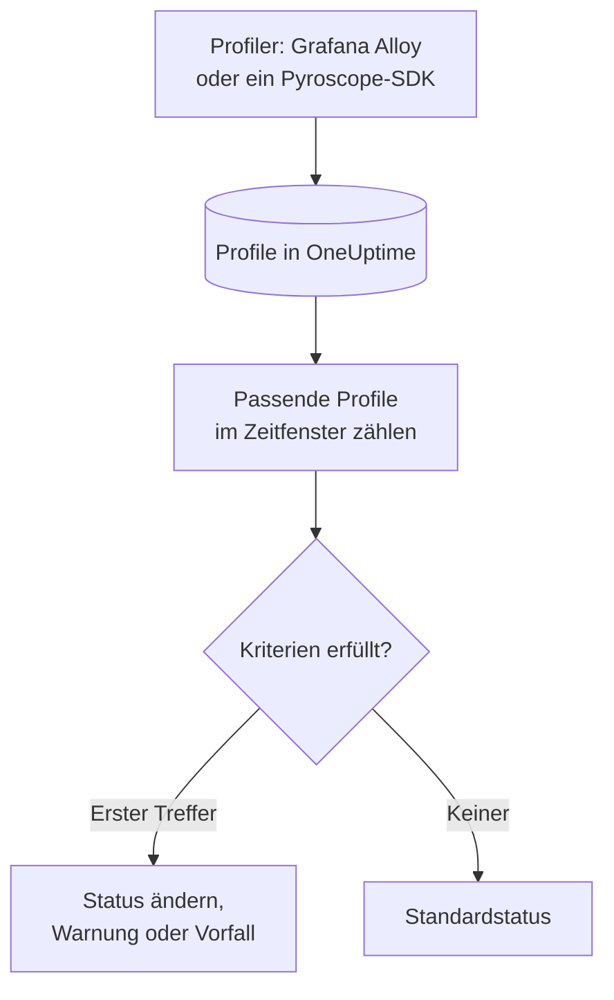

# Profile-Überwachung

Ein Profile-Monitor zählt die kontinuierlichen Profile, die Ihre Dienste an OneUptime senden und die zu Ihren Filtern passen – Profiltyp, Dienst, Attribute –, über ein Zeitfenster. Erfüllt die Anzahl Ihre Kriterien, ändert er den Status des Monitors, erstellt eine Warnung oder eröffnet einen Vorfall. Vor allem bemerken Sie damit, wenn von einem Dienst keine Profiling-Daten mehr eintreffen.

> [!IMPORTANT]
> **Monitor erstellen** im Dashboard bietet Profiles nicht an: Für seine Filter gibt es noch kein Formular. Erstellen Sie einen Profile-Monitor über die [API](/docs/api-reference/api-reference) oder [Terraform](/docs/terraform/monitor-steps), wie unten beschrieben. Sobald er existiert, können Sie seine Kriterien auf der Seite **Kriterien** des Monitors im Dashboard ansehen und bearbeiten; seine Filter lassen sich nur über die API oder Terraform ändern.

:::cards
- [Den Monitor erstellen](#einen-profile-monitor-erstellen): Die Konfiguration, die Sie über die API oder Terraform senden.
- [Was er abfragt](#was-er-abfragt): Profiltypen, Dienste, Attribute und das Fenster.
- [Kriterien](#kriterien): Die Bedingungen, die Sie verwenden können.
- [Ein Beispiel](#ein-beispiel-profile-kommen-nicht-mehr-an): Erfahren, wenn ein Dienst keine Profile mehr sendet.
:::

## So funktioniert es



Jede Minute zählt OneUptime die Profile, die zu den Filtern des Monitors passen und innerhalb seines Zeitfensters begonnen haben. Diese Anzahl prüft es von oben nach unten gegen die Kriterien des Monitors, und das erste passende Kriterium entscheidet, was geschieht. Passt keines, kehrt der Monitor zu seinem Standardstatus zurück.

## Bevor Sie beginnen

- Ihre Dienste senden kontinuierliche Profiling-Daten an OneUptime, über Grafana Alloy (eBPF) oder ein Pyroscope-SDK. Siehe [Kontinuierliches Profiling](/docs/telemetry/profiles).
- Sie haben entweder einen API-Schlüssel, der Monitore erstellen darf, oder den OneUptime-Terraform-Provider eingerichtet.
- Sie kennen die ID jedes zu beobachtenden Telemetrie-Dienstes und die Profiltypen, die er sendet, etwa `cpu`, `wall`, `alloc_objects`, `alloc_space` oder `goroutine`.

## Einen Profile-Monitor erstellen

:::steps
### Wählen, was gezählt wird

Schreiben Sie die Konfiguration `profileMonitor` des Schritts. Diese zählt die CPU-Profile eines Dienstes über die letzten fünf Minuten:

```json
{
  "profileMonitor": {
    "telemetryServiceIds": [],
    "profileTypes": ["cpu"],
    "profileType": "",
    "attributes": {},
    "lastXSecondsOfProfiles": 300
  }
}
```

Setzen Sie die ID des Dienstes in `telemetryServiceIds`, oder lassen Sie die Liste leer, um Profile von jedem Dienst zu zählen. [Was er abfragt](#was-er-abfragt) beschreibt jedes Feld.

### Den Monitor erstellen

Erstellen Sie über die [API](/docs/api-reference/api-reference) oder [Terraform](/docs/terraform/monitor-steps) einen Monitor mit dem Monitortyp `Profiles` und einem Schritt, der diese Konfiguration und mindestens ein Kriterium enthält. In Terraform übergeben Sie die Konfiguration als Attribut `profile_monitor` des Schritts, geschrieben mit `jsonencode()`.

### Ihn im Dashboard prüfen

Öffnen Sie den Monitor unter **Monitore**. Seine erste Auswertung läuft innerhalb einer Minute, und sein Status ändert sich, sobald ein Kriterium passt.
:::

## Was er abfragt

| Feld | Worauf es passt | Standard |
| --- | --- | --- |
| `profileTypes` | Profile eines dieser Typen, exakt abgeglichen, etwa `cpu`. | Leer: jeder Typ |
| `profileType` | Profile, deren Typ diesen Text enthält, ohne Beachtung der Groß-/Kleinschreibung. Ist er gesetzt, wird `profileTypes` ignoriert. | Leer |
| `telemetryServiceIds` | Profile von einem dieser Telemetrie-Dienste. | Leer: jeder Dienst |
| `entityKeys` | Profile von einem dieser Hosts, Pods, Container und anderen Infrastruktur-Entitäten. | Leer: jede Entität |
| `attributes` | Profile, deren Attribute diese Werte haben. | Leer: keine Bedingung |
| `lastXSecondsOfProfiles` | Profile, die innerhalb so vieler Sekunden vor der Auswertung begonnen haben. | Keiner: Setzen Sie ihn immer, sonst wird jedes gespeicherte Profil gezählt und die Anzahl fällt nie auf 0 |

Alle Filter, die Sie festlegen, müssen passen, damit ein Profil gezählt wird.

## Wie er ausgewertet wird

- **Jede Minute.** Ein Profile-Monitor wird nicht von Sonden geprüft, deshalb hat er kein Intervall zum Einstellen und keine Seite **Sonden & Intervall**.
- **Eine Zahl pro Auswertung.** Der Monitor zählt die Profile, die zu jedem Filter passen und innerhalb von `lastXSecondsOfProfiles` begonnen haben. Ein Profiler lädt in regelmäßigen Abständen hoch; lassen Sie dem Fenster also Raum für mehrere Uploads.
- **Keine Profile ergeben die Anzahl 0.** Ein Dienst, dessen Profiler nicht mehr hochlädt, liefert 0.
- **Die eigene Ausfallzeit von OneUptime ist keine Stille.** Solange das Zeitfenster Zeit enthält, in der OneUptime selbst keine Daten empfangen hat – weil es neu startete, aktualisiert wurde oder einen Rückstand aufholte –, wartet die Prüfung: Der Status ändert sich nicht, und kein Vorfall und keine Warnung wird eröffnet oder behoben. Siehe [Wenn OneUptime keine Daten empfängt](/docs/monitor/when-oneuptime-is-not-receiving).
- **Kriterien von oben nach unten.** Das erste passende Kriterium entscheidet; stellen Sie also das schwerwiegendste nach oben.

Jede Statusänderung wird mit ihrem Grund in der **Status-Zeitachse** des Monitors festgehalten.

## Kriterien

Die Kriterien eines Profile-Monitors haben einen Filter, **Profile Count**: die Anzahl der Profile, die im Fenster gepasst haben. Vergleichen Sie sie mit einem Wert:

| Filterbedingung | Passt, wenn die Anzahl der Profile … |
| --- | --- |
| **Greater Than** | über dem Wert liegt |
| **Greater Than Or Equal To** | den Wert erreicht oder darüber liegt |
| **Less Than** | unter dem Wert liegt |
| **Less Than Or Equal To** | den Wert erreicht oder darunter liegt |
| **Equal To** | genau dem Wert entspricht |
| **Not Equal To** | alles außer dem Wert ist |

Für Profilanzahlen gibt es keine Anomaliebedingungen: Es gibt keine Baseline, mit der sie verglichen werden könnten.

## Ein Beispiel: Profile kommen nicht mehr an

Der Checkout-Dienst führt ein Pyroscope-SDK aus, das CPU-Profile hochlädt. Sie wollen einen Vorfall, wenn diese fünf Minuten lang ausbleiben:

- `profileTypes`: `["cpu"]`, `telemetryServiceIds`: der Checkout-Dienst, `lastXSecondsOfProfiles`: `300`
- Kriterium 1: **Profile Count** **Equal To** `0` – den Monitor auf offline setzen und einen Vorfall eröffnen
- Kriterium 2: **Profile Count** **Greater Than** `0` – den Monitor auf online setzen

Solange das SDK hochlädt, zählt jede Auswertung einige Profile, und Kriterium 2 hält den Monitor online. Wird der Dienst ohne das SDK ausgerollt, fällt die Anzahl fünf Minuten nach dem letzten Upload auf 0, Kriterium 1 passt, und der Vorfall wird eröffnet. Der erste Upload nach der Korrektur hebt die Anzahl wieder über 0, und der Vorfall behebt sich selbst, wenn **Vorfall automatisch beheben** dafür eingeschaltet ist.

## Fehlerbehebung

:::details Der Monitor zählt 0, aber in OneUptime erscheinen Profile
Prüfen Sie die Filter anhand der Profile, die Sie sehen: `profileTypes` muss genau zum Typ passen, und `telemetryServiceIds` muss die richtigen Dienst-IDs enthalten. Ein kurzes `lastXSecondsOfProfiles` kann auch zwischen zwei Uploads fallen.
:::

:::details Profiles fehlt unter Monitor erstellen
Das ist so gewollt: Das Dashboard hat noch kein Formular für die Filter eines Profile-Monitors. Erstellen Sie ihn über die API oder Terraform, wie unter [Einen Profile-Monitor erstellen](#einen-profile-monitor-erstellen) beschrieben.
:::

## Nächste Schritte

:::cards
- [Kontinuierliches Profiling](/docs/telemetry/profiles): Profile von Grafana Alloy oder einem Pyroscope-SDK senden.
- [Monitor-Schritte](/docs/terraform/monitor-steps): Die Schrittkonfiguration aus Terraform übergeben.
- [Traces-Überwachung](/docs/monitor/traces-monitor): Auf fehlschlagende Spans warnen.
- [Metriken-Überwachung](/docs/monitor/metrics-monitor): Auf CPU, Speicher und andere Metriken warnen.
:::
