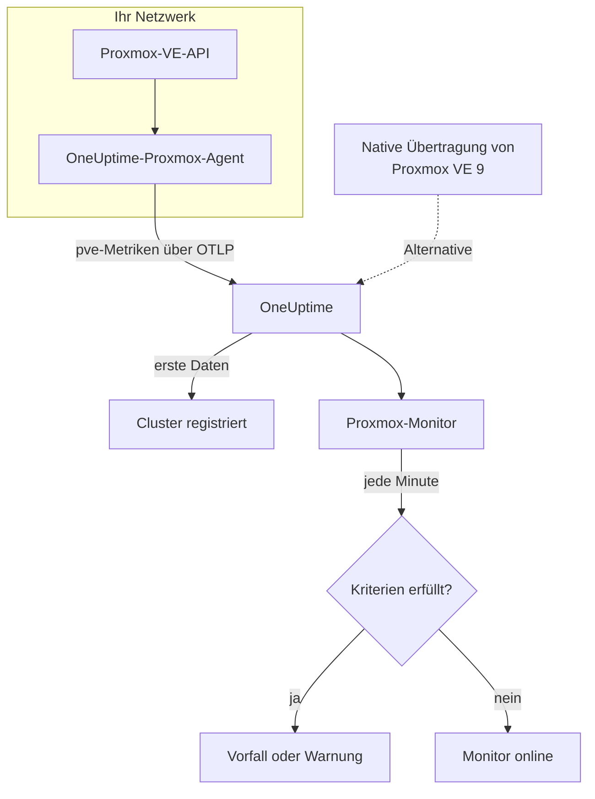

# Proxmox-Überwachung

Ein Proxmox-Monitor überwacht einen Proxmox-VE-Cluster – seine Knoten, VMs und LXC-Container, seinen Speicher, seinen HA-Zustand, die Abdeckung durch Backup-Jobs und die Speicherreplikation – und meldet Ihnen, wenn ein Knoten offline geht, ein Gast stoppt oder der Speicher vollläuft. Er liest die `pve_*`-Metriken, die der OneUptime-Proxmox-Agent erfasst, es wird also nichts von außen geprüft.

:::cards
- [Den Monitor erstellen](#einen-proxmox-monitor-erstellen): Sechs Schritte im Dashboard.
- [Vorlagen](#fertige-warnungsvorlagen): Elf fertige Warnungen, ein Vorfall pro Knoten, Gast oder Volume.
- [Ressourcenidentität](#ressourcenidentität): Wie Sie einen einzelnen Knoten, Gast oder ein Speicher-Volume ansprechen.
- [Metriken](#erfasste-metriken): Jede `pve_*`-Reihe, bei der der Monitor warnen kann.
:::

## So funktioniert es

Der OneUptime-Proxmox-Agent läuft auf einem Rechner, der die Proxmox-VE-API erreicht. Alle 30 Sekunden fragt er prometheus-pve-exporter mit den Cluster- und Knoten-Kollektoren ab, versieht jede Reihe mit der Ressource, die sie beschreibt, und sendet die Metriken über OTLP an OneUptime, versehen mit dem Namen des Clusters, `proxmox.cluster.name`. Die ersten Daten registrieren den Cluster. Proxmox VE 9 und neuer kann Metriken stattdessen nativ übertragen, ohne dass etwas installiert werden muss; siehe [die native Übertragung](#die-native-übertragung-von-proxmox-ve).

Ein Proxmox-Monitor ist an einen Cluster gebunden. Jede Minute führt er seine Abfrage über die Metriken dieses Clusters aus und vergleicht das Ergebnis mit seinen Kriterien.

## Bevor Sie beginnen

- **Den Proxmox-Agent installieren** an einem Ort, der die Proxmox-VE-API erreicht, mit einem schreibgeschützten API-Token. Die [Anleitung zum Proxmox-Agent](/docs/telemetry/proxmox) behandelt das Token, die Installation und die native Übertragung.
- **Prüfen Sie, ob der Cluster registriert ist.** Er erscheint etwa eine Minute nach der ersten Abfrage unter **Produkte → Infrastruktur → Proxmox → Alle Cluster**, benannt nach dem `PROXMOX_CLUSTER_NAME` des Agents.

## Einen Proxmox-Monitor erstellen

:::steps
### Einen neuen Monitor beginnen

Gehen Sie zu **Monitore** und klicken Sie auf **Monitor erstellen**.

### Proxmox wählen

Klicken Sie unter **Monitortyp** auf **Weitere Monitortypen** und wählen Sie **Proxmox** unter **Infrastruktur**, oder geben Sie `proxmox` in das Suchfeld ein. Geben Sie einen **Name** ein – er wird in den Titeln von Vorfällen und Warnungen verwendet – und klicken Sie auf **Weiter**.

### Den Cluster wählen

Wählen Sie unter **Proxmox-Monitor-Konfiguration** den Cluster aus **Proxmox-Cluster**. Jeder Cluster, der Daten gesendet hat, steht in der Liste.

### Festlegen, was überwacht wird

Wählen Sie einen der drei Tabs:

- **Quick Setup** – klicken Sie auf eine [Vorlage](#fertige-warnungsvorlagen). Sie legt Metriken, Filter, Aggregation, Zeitbereich und Schwellenwerte fest und ersetzt die Kriterien weiter unten durch ihre eigenen. Den **Zeitbereich** können Sie weiterhin ändern.
- **Custom Metric** – wählen Sie eine Metrik unter **Proxmox-Metrik** und legen Sie dann **Aggregation** und **Zeitbereich** fest. Die [Filter](#monitor-einstellungen) grenzen sie auf eine Art von Ressource oder auf eine einzelne Ressource ein.
- **Erweitert** – bauen Sie unter **Metriken auswählen** selbst Abfragen und Formeln, zum Beispiel einen Speicherprozentsatz aus `pve_memory_usage_bytes / pve_memory_size_bytes`. Verwenden Sie **Gruppieren nach** `id`, um jede Ressource einzeln zu beurteilen.

### Die Kriterien prüfen

Öffnen Sie unter **Monitor-Kriterien** jedes Kriterium und prüfen Sie seine **Metrik**, **Aggregation**, **Bedingung** und seinen **Schwellenwert**. Eine Vorlage füllt diese aus. Mit **Custom Metric** oder **Erweitert** beginnt der Monitor mit den [Standardkriterien](#standardkriterien), die nur bemerken, wenn eine Metrik auf null fällt; legen Sie daher Ihren eigenen Schwellenwert fest.

### Den Monitor erstellen

Klicken Sie auf **Monitor erstellen**. OneUptime öffnet die Seite des Monitors und wertet ihn jede Minute aus. Vorfälle und Warnungen, die er auslöst, stehen auch auf den Seiten **Vorfälle** und **Warnungen** des Clusters.
:::

> [!TIP]
> Um mehrere Vorlagen auf einmal einzurichten, öffnen Sie den Cluster über **Produkte → Infrastruktur → Proxmox** und gehen Sie zu **Empfehlungen**. Wählen Sie die gewünschten Vorlagen, legen Sie fest, wer alarmiert wird, und OneUptime erstellt einen Monitor pro Vorlage.

## Monitor-Einstellungen

| Feld | Tab | Was es tut |
| --- | --- | --- |
| **Proxmox-Cluster** | Alle | Erforderlich. Beschränkt jede Abfrage auf `resource.proxmox.cluster.name`. |
| **Ressourcenbereich** | Custom Metric, Erweitert | Optional. **Knoten**, **Gast (VM / Container)**, **Speicher** oder **Cluster** – eine exakte Übereinstimmung mit `pve.scope`. |
| **PVE-ID** | Custom Metric, Erweitert | Optional. Exakte Übereinstimmung mit `pve.id`: ein Knotenname (`pve1`), eine VMID (`100`) oder `<node>/<storage>` (`pve1/local`). Kombinieren Sie sie mit einem Bereich, um eine einzelne Ressource anzusprechen. |
| **Knotenname** | Custom Metric, Erweitert | Optional. Nur die eigenen Reihen eines Knotens (`pve.scope = node` und `pve.id`). Er kann nicht die Gäste oder den Speicher auf diesem Knoten auswählen. |
| **Gast-ID** | Custom Metric, Erweitert | Optional. Exakte Übereinstimmung mit dem rohen Label `id`, etwa `qemu/100` oder `lxc/101`. Wenn gesetzt, werden die anderen Filter ignoriert. |
| **Proxmox-Metrik** | Custom Metric | Eine Metrik aus dem [Katalog](#erfasste-metriken). |
| **Aggregation** | Custom Metric | Wie Messwerte zusammengefasst werden: **Durchschnitt**, **Maximum**, **Minimum**, **Summe** oder **Anzahl**. Beginnt bei der üblichen Aggregation der Metrik. |
| **Zeitbereich** | Alle | Das gleitende Zeitfenster, das die Abfrage liest, von **Past 1 Minute** bis **Past 365 Days**. Ein neuer Monitor beginnt bei **Past 1 Minute**; Vorlagen legen ihr eigenes fest. |
| **Metriken auswählen** | Erweitert | Der Abfrage-Builder: **Metrik**, **Aggregieren nach**, **Nach Attributen filtern**, **Gruppieren nach**, dazu **Metrik hinzufügen** und **Formel hinzufügen**, um Abfragen zu kombinieren. |

## Ressourcenidentität

Jede Reihe trägt ein Datenpunkt-Label `id`, das die Proxmox-Ressource nennt, zu der sie gehört:

| Wert von `id` | Ressource |
| --- | --- |
| `node/<name>` | Ein Knoten des Clusters, zum Beispiel `node/pve1`. |
| `qemu/<vmid>` | Eine virtuelle QEMU-Maschine, zum Beispiel `qemu/100`. |
| `lxc/<vmid>` | Ein LXC-Container, zum Beispiel `lxc/101`. |
| `storage/<node>/<storage>` | Ein Speicher-Volume auf einem Knoten, zum Beispiel `storage/pve1/local`. |

Zwei Ausnahmen: Replikationsreihen (`pve_replication_*`) tragen die ID des Replikations-**Jobs** in `id` (zum Beispiel `100-0`), und das clusterweite `pve_not_backed_up_total` hat überhaupt kein `id`.

Filter vergleichen auf Gleichheit, nicht auf ein Präfix; daher teilt der Agent `id` zusätzlich in drei Attribute auf, nach denen Sie filtern können. Die Vorlagen stützen sich darauf:

| Attribut | Werte | Für `qemu/100` |
| --- | --- | --- |
| `pve.scope` | `node`, `guest`, `storage`, `cluster` (`qemu` und `lxc` sind beide `guest`) | `guest` |
| `pve.type` | `node`, `qemu`, `lxc`, `storage` | `qemu` |
| `pve.id` | Alles nach dem ersten `/` von `id` (`pve1`, `100`, `pve1/local`) | `100` |

Filtern Sie nach `pve.scope` oder `pve.type` für eine Art von Ressource, nach `pve.id` oder `id` für eine einzelne Ressource, und gruppieren Sie nach `id`, um jede Ressource einzeln zu beurteilen.

## Fertige Warnungsvorlagen

**Quick Setup** bietet 11 Vorlagen. Jede baut einen vollständigen Monitor – Abfragen, Attributfilter, eine Gruppierung, ein Kriterium, das auslöst, und eines, das wiederherstellt. Die meisten gruppieren nach `id`, sodass jeder Knoten, Gast, jedes Volume und jeder Job einen eigenen Vorfall und eine eigene Warnung erhält. Die Schwellenwerte sind Ausgangswerte, die Sie anpassen können.

Vorlagen lesen die letzten 5 Minuten, sofern die Tabelle nichts anderes sagt. Ein Kriterium löst nur aus, wenn die Bedingung in jeder Minute seines Zeitfensters gilt, und ein Schwellenwert-Kriterium wird 10 % jenseits seines Schwellenwerts wiederhergestellt, damit ein Wert, der um die Grenze pendelt, nicht hin- und herspringt.

| Vorlage | Schweregrad | Überwacht | Löst aus, wenn | Wiederhergestellt, wenn |
| --- | --- | --- | --- | --- |
| Node Offline | Kritisch | `pve_up` für `pve.scope = node`, Min pro `id` | Unter 1 | Bei 1 |
| Guest Down | Warnung | `pve_up` und `pve_onboot_status` für `pve.scope = guest`, Min pro `id` | `pve_up` unter 1 liegt, während `pve_onboot_status` 1 ist | `pve_up` wieder bei 1 ist oder der Start beim Booten ausgeschaltet wird |
| Cluster Quorum at Risk | Kritisch | `pve_up` ÷ `pve_node_info` × 100 für `pve.scope = node` (beide Summe): der Anteil der Knoten, die online sind | 50 % oder weniger | Über 55 % |
| High Node CPU Usage | Warnung | `pve_cpu_usage_ratio` für `pve.scope = node`, Avg pro `id` | Über 0,9 (90 % der Kerne des Knotens) | Bei oder unter 0,81 |
| High Node Memory Usage | Warnung | `pve_memory_usage_bytes` ÷ `pve_memory_size_bytes` × 100 für `pve.scope = node`, pro `id` | Über 85 % | Bei oder unter 76,5 % |
| High Guest CPU Usage | Warnung | `pve_cpu_usage_ratio` für `pve.scope = guest`, Avg pro `id`, letzte 15 Minuten | Über 0,95 (95 % seiner vCPUs) während aller 15 Minuten | Bei oder unter 0,855 |
| Storage Near Full | Warnung | `pve_disk_usage_bytes` ÷ `pve_disk_size_bytes` × 100 für `pve.scope = storage`, pro `id` | Über 85 % | Bei oder unter 76,5 % |
| Container Root Disk Near Full | Warnung | Dasselbe Festplattenverhältnis für `pve.type = lxc`, pro `id` | Über 90 % | Bei oder unter 81 % |
| HA Resource in Error State | Kritisch | `pve_ha_state` für `state = error`, Max pro `id` | Über 0 | Bei 0 |
| Guest Not Backed Up | Warnung | `pve_not_backed_up_total`, Max (eine clusterweite Reihe) | Über 0 | Bei 0 |
| Replication Failing | Kritisch | `pve_replication_failed_syncs`, Max pro `id` (die Job-ID) | Über 0 | Bei 0 |

**Schweregrad** ist die Bezeichnung, die die Auswahl anzeigt. Vorfall und Warnung, die eine Vorlage erstellt, beginnen mit dem schwersten Vorfall- und Warnungsschweregrad Ihres Projekts; ändern Sie sie in den Kriterien.

- **Die Ausfall-Vorlagen verwenden Minimum**, sodass eine einzige Abfrage, bei der die Ressource ausgefallen war, sie auslöst, statt von den Abfragen verdeckt zu werden, bei denen sie lief.
- **Guest Down** betrachtet nur Gäste, die beim Booten starten sollen, sodass ein Gast, den Sie absichtlich gestoppt haben, nie jemanden alarmiert.
- **Cluster Quorum at Risk** ist ein Näherungswert: pve-exporter hat keine corosync-Metrik, daher zählt die Vorlage die Knoten, die online sind.
- **High Guest CPU Usage** ist höher und langsamer als die Knotenvorlage: Ein Gast soll seine vCPUs nutzen, daher alarmiert nur einer, der nie herunterkommt.
- **Verhältnisformeln** nehmen auf beiden Seiten die **Summe**. Beide stammen aus derselben Abfrage, das Ergebnis ist also ein echter Prozentsatz.
- **Container Root Disk Near Full** lässt QEMU-VMs aus: Ihre Festplattennutzung liest ohne den QEMU-Gastagenten 0.
- **Guest Not Backed Up** deckt nur die Mitgliedschaft in Backup-Jobs ab. pve-exporter sagt nicht, ob Backups liefen oder erfolgreich waren; gruppieren Sie `pve_not_backed_up_info` nach `id`, um die Gäste aufzulisten.
- **Veraltete Replikation** (jetzt minus die letzte Synchronisierung) kann keine Warnung auslösen, weil Kriterien keine Zeitarithmetik kennen. Die Seite **Übersicht** des Clusters zeigt sie an; warnen Sie stattdessen mit **Replication Failing**.

### Die native Übertragung von Proxmox VE

Proxmox VE 9 und neuer kann Metriken über seinen eingebauten OpenTelemetry-Metrikserver übertragen, ohne dass etwas installiert werden muss – siehe die [Anleitung zum Proxmox-Agent](/docs/telemetry/proxmox). OneUptime wandelt die Übertragung in dieselben `pve_*`-Reihen um, sodass der Katalog und die Vorlagen für CPU, Arbeitsspeicher und Speicher damit funktionieren.

**Node Offline** und **Cluster Quorum at Risk** funktionieren ebenfalls: Jeder Knoten überträgt nur seinen eigenen Status, daher wird ein Knoten, der nicht mehr meldet, von den noch lebenden Knoten als ausgefallen gemeldet (`pve_up` = 0) – siehe [Wenn ein Knoten nicht mehr meldet](/docs/telemetry/proxmox#when-a-node-stops-reporting). **Guest Down**, **HA Resource in Error State**, **Guest Not Backed Up** und **Replication Failing** brauchen Daten, die nur der Agent erfasst.

## Erfasste Metriken

Der Agent fragt prometheus-pve-exporter alle 30 Sekunden mit den Cluster- und den Knoten-Kollektoren ab, was auch die Kollektoren `backup-info` und `replication` des Exporters abdeckt (beide standardmäßig eingeschaltet).

### Verfügbarkeit

| Metrik | Einheit | Beschreibung |
| --- | --- | --- |
| `pve_up` | — | 1, wenn der Knoten oder Gast in Betrieb ist oder läuft, sonst 0. |
| `pve_uptime_seconds` | seconds | Betriebszeit des Knotens oder Gasts. |
| `pve_version_info` | count | Die Proxmox-VE-Version, in ihren Labels. Immer 1. |

### Knoten

| Metrik | Einheit | Beschreibung |
| --- | --- | --- |
| `pve_node_info` | count | Metadaten des Knotens, immer 1. Summieren Sie sie, um die meldenden Knoten zu zählen. |
| `pve_cpu_usage_ratio` | ratio | Genutzte CPU als Verhältnis von 0–1 zur verfügbaren CPU. |
| `pve_cpu_usage_limit` | cores | Verfügbare CPU, in Kernen. Bei einem Gast seine vCPUs. |
| `pve_memory_usage_bytes` | bytes | Belegter Arbeitsspeicher. |
| `pve_memory_size_bytes` | bytes | Gesamter Arbeitsspeicher. |

Die CPU- und Speicherreihen werden auch für jeden Gast gemeldet, unter den IDs `qemu/*` und `lxc/*`.

### Gast

| Metrik | Einheit | Beschreibung |
| --- | --- | --- |
| `pve_guest_info` | count | Metadaten des Gasts (Name, Knoten, Typ `qemu` oder `lxc`) in Labels. Immer 1. |
| `pve_network_receive_bytes` | bytes | Vom Gast empfangene Bytes. Ein Zähler über die gesamte Lebensdauer. |
| `pve_network_transmit_bytes` | bytes | Vom Gast gesendete Bytes. Ein Zähler über die gesamte Lebensdauer. |
| `pve_disk_read_bytes` | bytes | Vom Gast von der Festplatte gelesene Bytes. Ein Zähler über die gesamte Lebensdauer. |
| `pve_disk_write_bytes` | bytes | Vom Gast auf die Festplatte geschriebene Bytes. Ein Zähler über die gesamte Lebensdauer. |
| `pve_onboot_status` | count | 1, wenn der Gast beim Booten des Knotens startet. Ein gestoppter Gast mit dieser Einstellung ist meist ein ungeplanter Ausfall. |

### Speicher

| Metrik | Einheit | Beschreibung |
| --- | --- | --- |
| `pve_disk_usage_bytes` | bytes | Auf der Festplatte oder dem Speicher belegte Bytes. Bei einem QEMU-Gast liest sie 0, sofern der QEMU-Gastagent nicht installiert ist. |
| `pve_disk_size_bytes` | bytes | Gesamtgröße der Festplatte oder des Speichers. |
| `pve_storage_info` | count | Metadaten des Speichers, immer 1. Summieren Sie sie, um die Speicher-Volumes zu zählen. |

### HA

| Metrik | Einheit | Beschreibung |
| --- | --- | --- |
| `pve_ha_state` | — | Eine Reihe pro HA-Zustand (`started`, `stopped`, `error`, …) für jede HA-Ressource, 1 beim aktuellen Zustand. Filtern Sie nach dem Label `state`, um bei einem Zustand zu warnen. |

### Backup

Aus dem clusterweiten Kollektor `backup-info` des Exporters. Sie melden nur die Abdeckung durch Backup-**Jobs**:

| Metrik | Einheit | Beschreibung |
| --- | --- | --- |
| `pve_not_backed_up_total` | count | Gäste in keinem Backup-Job. Eine clusterweite Reihe ohne `id`. |
| `pve_not_backed_up_info` | count | Eine Reihe pro nicht abgedecktem Gast, immer 1, mit der `id` des Gasts als Label. Sie verschwindet, sobald der Gast einem Backup-Job beitritt. |

### Replikation

Aus dem knotenbezogenen Kollektor `replication` des Exporters. Die Reihen gibt es nur, wenn der Cluster Replikationsjobs hat, und sie tragen die Job-ID in `id`:

| Metrik | Einheit | Beschreibung |
| --- | --- | --- |
| `pve_replication_failed_syncs` | count | Fehlgeschlagene Synchronisierungsversuche in Folge. Über 0 bedeutet, dass das Replikat veraltet. |
| `pve_replication_duration_seconds` | seconds | Wie lange die letzte Synchronisierung gedauert hat. |
| `pve_replication_last_sync_timestamp_seconds` | seconds | Unix-Zeit der letzten **erfolgreichen** Synchronisierung. |
| `pve_replication_last_try_timestamp_seconds` | seconds | Unix-Zeit des letzten **Versuchs**. Neuer als die letzte Synchronisierung bedeutet, dass der letzte Versuch fehlgeschlagen ist. |
| `pve_replication_next_sync_timestamp_seconds` | seconds | Unix-Zeit der nächsten geplanten Synchronisierung. |
| `pve_replication_info` | count | Metadaten des Jobs – Typ, Quelle, Ziel, Gast – in Labels. Immer 1. |

## Überwachungskriterien

Ein Kriterium vergleicht eine der Abfragen oder Formeln des Monitors mit einem Schwellenwert. Die Kriterien eines Proxmox-Monitors haben keinen **Filtertyp**: Jede Regel prüft den Metrikwert, mit diesen Feldern.

| Feld | Was es tut |
| --- | --- |
| **Metrik** | Die zu prüfende Abfrage oder Formel, anhand ihres Variablennamens. |
| **Aggregation** | Wie die Werte im Zeitfenster zu einer Antwort werden: **Durchschnitt**, **Summe**, **Maximum Value**, **Minimum Value**, **All Values** (jeder Wert muss zutreffen) oder **Any Value** (einer genügt). |
| **Bedingung** | **Greater Than**, **Less Than**, **Greater Than Or Equal To**, **Less Than Or Equal To** oder **Equal To** – oder eine Anomaliebedingung: **Anomalously High**, **Anomalously Low** oder **Anomalous**. |
| **Schwellenwert** | Der Vergleichswert. Daneben steht eine Einheitenliste, wenn die Metrik eine Einheit hat. Wird bei Anomaliebedingungen nicht angezeigt. |
| **Empfindlichkeit** | Nur bei Anomaliebedingungen. **Niedrig** (4σ), **Mittel** (3σ, der Standard) oder **Hoch** (2σ). |
| **Baseline-Fenster** | Nur bei Anomaliebedingungen. 14 Tage (der Standard), 28, 60 oder 90 Tage Verlauf. |
| **Bei keinen Daten** | Unter **Weitere Felder**. Was geschieht, wenn das Zeitfenster keine Messwerte hat: **Ignore** (der Standard), **Treat As Zero** oder **Auslöser**. |

Anomaliebedingungen vergleichen jeden Wert mit derselben Stunde der Woche in der Baseline. Sie bleiben im Zustand „Learning“ und lösen nichts aus, bis das Baseline-Fenster genug Verlauf enthält.

Jedes Kriterium legt außerdem fest, was geschieht, wenn es zutrifft: den Monitorstatus ändern, eine Warnung erstellen oder einen Vorfall melden. Kriterien werden von oben nach unten geprüft, und das erste zutreffende entscheidet.

### Standardkriterien

Ein Monitor, den Sie nicht aus einer Vorlage erstellen, beginnt mit zwei Kriterien:

| Reihenfolge | Kriterium | Trifft zu, wenn | Dann |
| --- | --- | --- | --- |
| 1 | Check if _monitor name_ is offline | Ein beliebiger Wert der ersten Abfrage `0` ist | Markiert den Monitor als **Offline** und meldet den Vorfall „_monitor name_ is offline“, der sich von selbst auflöst, wenn der Monitor sich erholt. |
| 2 | Check if _monitor name_ is online | Ein beliebiger Wert über `0` liegt | Markiert den Monitor als **Betriebsbereit**. |

> [!IMPORTANT]
> Stille erfüllt keines der beiden Kriterien: Ein Cluster, der keine Daten mehr sendet, lässt den Monitor, wie er war. Um benachrichtigt zu werden, wenn keine Daten mehr kommen, setzen Sie **Bei keinen Daten** in einem Kriterium auf **Auslöser**. Zeit, in der OneUptime selbst keine Daten empfing, gilt nie als fehlende Daten: Eine Prüfung, deren Zeitfenster solche Zeit enthält, wartet stattdessen, wie [Wenn OneUptime keine Daten empfängt](/docs/monitor/when-oneuptime-is-not-receiving) erklärt.

## Fehlerbehebung

:::details Der Cluster steht nicht in der Liste Proxmox-Cluster
Cluster registrieren sich selbst aus den Daten des Agents. Prüfen Sie, ob der Agent läuft und Daten sendet (siehe die [Anleitung zum Proxmox-Agent](/docs/telemetry/proxmox)) und ob `PROXMOX_CLUSTER_NAME` gesetzt ist.
:::

:::details Gastmetriken fehlen
Gastreihen kommen vom Cluster-Kollektor des Exporters, den die mitgelieferte Konfiguration mit dem Abfrageparameter `cluster=1` einschaltet. Wenn Sie die Kollektor-Konfiguration geändert haben, stellen Sie sie wieder her.
:::

:::details High Node CPU Usage löst nie aus
Die Vorlage bildet den Durchschnitt von `pve_cpu_usage_ratio` pro `id`, sodass jeder Knoten einzeln geprüft wird. Wenn Sie Ihre eigene Abfrage gebaut haben, gruppieren Sie sie nach `id`: Ein Durchschnitt über alle Knoten wird von den untätigen nach unten gezogen.
:::

:::details Node Offline löst weiter für einen Knoten aus, den Sie aus dem Cluster entfernt haben
Bei der nativen Übertragung von Proxmox VE sieht ein aus dem Cluster genommener Knoten genauso aus wie einer, der ausgefallen ist: Er meldet nicht mehr, daher melden die noch lebenden Knoten ihn weiter als ausgefallen. Öffnen Sie die Seite des Knotens und klicken Sie auf **Knoten entfernen** – der Knoten verschwindet, und seine Warnung wird aufgelöst. Andernfalls bleibt er bis zu 7 Tage lang Offline. Beim Agent besteht dieses Problem nicht: Er fragt den Cluster, der den Knoten nicht mehr auflistet.
:::

:::details Backup- oder Replikationsmetriken fehlen
`pve_not_backed_up_*` kommt vom Kollektor `backup-info` des Exporters und `pve_replication_*` von seinem Kollektor `replication`. Beide sind standardmäßig eingeschaltet und durch die Abfrageparameter `cluster=1` und `node=1` der mitgelieferten Konfiguration abgedeckt. Wenn Sie Ihren eigenen Exporter betreiben, prüfen Sie, dass Sie sie nicht ausgeschaltet haben. `pve_replication_*` gibt es nur, wenn der Cluster Speicherreplikationsjobs hat.
:::

:::details Zähler wie pve_network_receive_bytes wachsen nur
Netzwerk- und Festplatten-I/O-Reihen sind Zähler über die gesamte Lebensdauer, und Kriterien vergleichen rohe Werte: Es gibt keinen Raten-Operator, und **In Rate pro Sekunde umrechnen** im Abfrage-Builder ändert nur das Diagramm. Stellen Sie sie als Rate dar, oder warnen Sie mit einer Formel bei ihrem Zuwachs, etwa einer **Maximum**-Abfrage minus einer **Minimum**-Abfrage desselben Zählers.
:::

## Nächste Schritte

:::cards
- [Proxmox-Agent](/docs/telemetry/proxmox): Den Agent installieren oder die native Übertragung einrichten.
- [Ceph-Überwachung](/docs/monitor/ceph-monitor): Den Ceph-Speicher hinter einem Proxmox-Cluster überwachen.
- [VMware-Überwachung](/docs/monitor/vmware-monitor): Dieselbe Art von Monitor für vSphere.
- [Vorfälle – Übersicht](/docs/incidents/index): Was passiert, nachdem ein Kriterium einen Vorfall gemeldet hat.
:::
