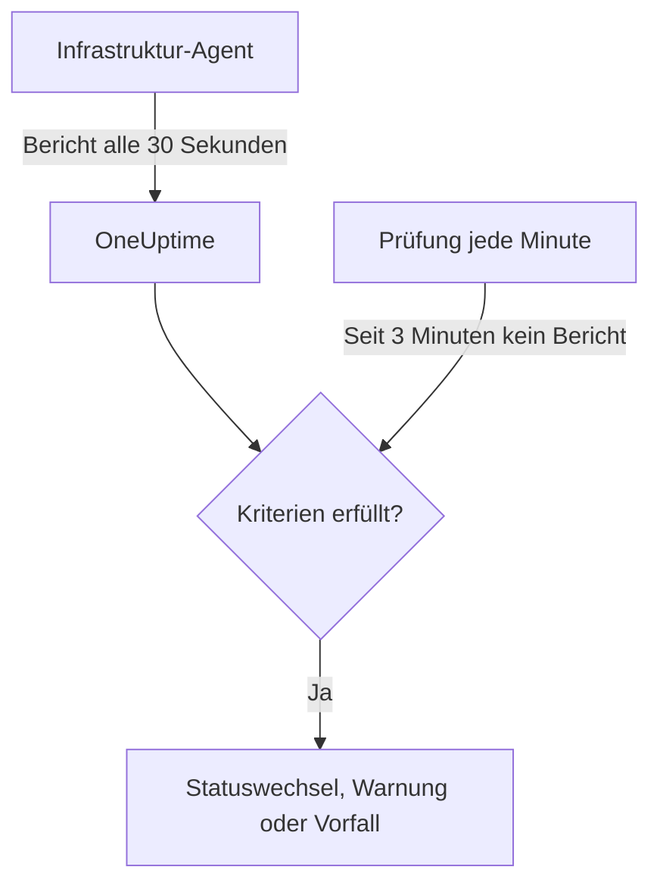

# Server- / VM-Überwachung

Ein Server-/VM-Monitor überwacht einen einzelnen Rechner über den OneUptime-Infrastruktur-Agent (`oneuptime-infrastructure-agent`), einen kleinen Dienst, der OneUptime alle 30 Sekunden CPU, Arbeitsspeicher, Festplatten, Last, Netzwerk und laufende Prozesse meldet. Diese Seite zeigt, wie Sie den Agent mit einem Server-/VM-Monitor verbinden, was der Agent meldet und wie Sie die Kriterien schreiben, die entscheiden, wann der Server online oder offline ist.

> [!IMPORTANT]
> **Monitor erstellen** bietet **Server / VM** nicht mehr an. Bestehende Server-/VM-Monitore funktionieren weiter, und alles auf dieser Seite gilt für sie. Um einen neuen Server zu überwachen, erstellen Sie stattdessen einen [Host-Monitor](/docs/monitor/host-monitor): Er warnt anhand der Host-Metriken, die der [Host-OpenTelemetry-Collector](/docs/telemetry/host-otel-collector) sendet.

:::cards
- [Den Agent verbinden](#den-agent-verbinden): Ihn installieren, ihm den geheimen Schlüssel des Monitors geben und ihn starten.
- [Was der Agent meldet](#was-der-agent-meldet): CPU, Arbeitsspeicher, Festplatten, Last, Netzwerk und Prozesse.
- [Überwachungskriterien](#überwachungskriterien): Festlegen, wann der Server als online oder offline gilt.
- [Fehlerbehebung](#fehlerbehebung): Der Agent meldet nichts, oder der Monitor wird nie offline.
:::

## So funktioniert es

Der Agent läuft als Systemdienst. Alle 30 Sekunden erstellt er einen Bericht und sendet ihn, signiert mit dem geheimen Schlüssel des Monitors, an Ihre OneUptime-URL. OneUptime speichert die Werte als Metriken des Monitors und prüft den Bericht anhand der Kriterien des Monitors.

Stille wird separat geprüft. Jede Minute wertet OneUptime die **Is Online**-Kriterien jedes Server-/VM-Monitors neu aus, der seit 3 Minuten oder länger nichts gemeldet hat, und ein Server, der länger schweigt, als seine Kriterien erlauben (standardmäßig 3 Minuten), gilt als offline. Ein Monitor ohne **Is Online**-Kriterium wird nie allein deshalb als offline markiert, weil der Agent verstummt ist. Zu dieser Stille zählt nur Zeit, in der OneUptime Daten empfangen hat: Zeit, in der OneUptime selbst neu startete, aktualisiert wurde oder Rückstände aufholte, zählt nicht, wie [Wenn OneUptime keine Daten empfängt](/docs/monitor/when-oneuptime-is-not-receiving) erklärt.



## Bevor Sie beginnen

- Ein Server-/VM-Monitor in Ihrem Projekt.
- Die Berechtigung, Monitore zu bearbeiten. Der geheime Schlüssel und die Einrichtungsbefehle, die ihn enthalten, werden nur Personen angezeigt, die Monitore bearbeiten dürfen.
- Root-Rechte (Linux, macOS) oder Administratorrechte (Windows) auf dem Server. Der Agent installiert sich als Systemdienst.
- Ausgehendes HTTPS vom Server zu Ihrer OneUptime-URL, direkt oder über einen HTTP-Proxy.

## Den Agent verbinden

Die Befehle unten verwenden `https://oneuptime.com` und `YOUR_SECRET_KEY`. In den Einrichtungsbefehlen des Monitors sind Ihre OneUptime-URL und der geheime Schlüssel des Monitors bereits eingetragen; kopieren Sie sie daher nach Möglichkeit vom Monitor.

:::steps
### Die Einrichtungsbefehle des Monitors öffnen

Gehen Sie zu **Monitore**, öffnen Sie den Server-/VM-Monitor und wählen Sie **Dokumentation**. Die Karten **Server-Monitor einrichten (Linux/Mac)** und **Server-Monitor einrichten (Windows)** enthalten die Befehle für diesen Monitor. Bis der Agent zum ersten Mal meldet, zeigt auch die **Übersicht** des Monitors sie an.

### Den Agent installieren

:::tabs
@tab Linux
```bash
curl -sSL https://oneuptime.com/docs/static/scripts/infrastructure-agent/install.sh | sudo bash
```
@tab macOS
```bash
curl -sSL https://oneuptime.com/docs/static/scripts/infrastructure-agent/install.sh | sudo bash
```
@tab Windows
1. Laden Sie den Agent aus dem [neuesten GitHub-Release](https://github.com/OneUptime/oneuptime/releases/latest) herunter: `oneuptime-infrastructure-agent_windows_amd64.zip` für x64 oder `oneuptime-infrastructure-agent_windows_arm64.zip` für ARM64.
2. Entpacken Sie die ZIP-Datei. Sie enthält `oneuptime-infrastructure-agent.exe`.
3. Öffnen Sie die **Eingabeaufforderung** als Administrator in dem Ordner, in den Sie sie entpackt haben.
:::

Das Installationsskript lädt das neueste Release für Ihr Betriebssystem und Ihren Prozessor (x86-64 oder ARM64) herunter und legt die Binärdatei `oneuptime-infrastructure-agent` in `$HOME/bin` ab. Bei einer selbst gehosteten Installation wird das Skript von Ihrer eigenen OneUptime-URL ausgeliefert.

### Ihn mit dem Monitor verbinden

:::tabs
@tab Linux
```bash
sudo oneuptime-infrastructure-agent configure --secret-key=YOUR_SECRET_KEY --oneuptime-url=https://oneuptime.com
```
@tab macOS
```bash
sudo oneuptime-infrastructure-agent configure --secret-key=YOUR_SECRET_KEY --oneuptime-url=https://oneuptime.com
```
@tab Windows
```shell
oneuptime-infrastructure-agent configure --secret-key=YOUR_SECRET_KEY --oneuptime-url=https://oneuptime.com
```
:::

`configure` speichert den geheimen Schlüssel und die URL in der Konfigurationsdatei des Agents und installiert den Agent als Systemdienst. Beide Flags sind erforderlich. Ersetzen Sie bei einer selbst gehosteten Installation `https://oneuptime.com` durch Ihre eigene URL.

Wenn der Server das Internet über einen Proxy erreicht, ergänzen Sie `--proxy-url`:

```bash
sudo oneuptime-infrastructure-agent configure --proxy-url=http://proxy.example.com:8080 --secret-key=YOUR_SECRET_KEY --oneuptime-url=https://oneuptime.com
```

### Den Agent starten

:::tabs
@tab Linux
```bash
sudo oneuptime-infrastructure-agent start
```
@tab macOS
```bash
sudo oneuptime-infrastructure-agent start
```
@tab Windows
```shell
oneuptime-infrastructure-agent start
```
:::

Beim Start prüft der Agent den geheimen Schlüssel bei OneUptime und sendet sofort seinen ersten Bericht.

### Prüfen, ob er meldet

Führen Sie `sudo oneuptime-infrastructure-agent status` aus (unter Windows ohne `sudo`): Er gibt `Service is running` aus. In OneUptime zeigt die **Übersicht** des Monitors die Einrichtungsbefehle nicht mehr an, sobald der erste Bericht eingeht, und sein Tab **Metriken** beginnt, den Server in Diagrammen darzustellen.
:::

## Agent-Referenz

### Befehle

| Befehl | Was er tut |
| --- | --- |
| `configure --secret-key=<key> --oneuptime-url=<url>` | Speichert die Einstellungen und installiert den Agent als Systemdienst. Ergänzen Sie `--proxy-url=<url>`, um Berichte über einen Proxy zu senden. |
| `start` | Startet den Dienst. Er startet nicht, bevor `configure` ausgeführt wurde. |
| `stop` | Stoppt den Dienst. |
| `restart` | Startet den Dienst neu. |
| `status` | Gibt aus, ob der Dienst läuft oder gestoppt ist. |
| `logs` | Gibt die letzten 100 Zeilen des Agent-Protokolls aus. `-n <lines>` gibt eine andere Zeilenzahl aus, und `-f` folgt neuen Zeilen. |
| `uninstall` | Entfernt den Dienst und löscht die Konfigurationsdatei des Agents. |
| `help` | Listet die Befehle auf. |

Führen Sie sie unter Linux und macOS mit `sudo` aus und unter Windows in einer **Eingabeaufforderung** mit Administratorrechten. Um den geheimen Schlüssel, die URL oder den Proxy eines konfigurierten Agents zu ändern, führen Sie `stop` und `uninstall` aus, dann erneut `configure` und `start`.

### Dateien

| Datei | Linux und macOS | Windows |
| --- | --- | --- |
| Konfiguration | `/etc/oneuptime-infrastructure-agent/config.json` | `%PROGRAMDATA%\oneuptime-infrastructure-agent\config.json` |
| Protokoll | `/var/log/oneuptime-infrastructure-agent/oneuptime-infrastructure-agent.log` | `%PROGRAMDATA%\oneuptime-infrastructure-agent\oneuptime-infrastructure-agent.log` |

Wenn der Agent nicht in diese Verzeichnisse schreiben kann, verwendet er stattdessen `~/.oneuptime-infrastructure-agent/`. Die Umgebungsvariablen `ONEUPTIME_AGENT_CONFIG_PATH` und `ONEUPTIME_AGENT_LOG_PATH` legen den jeweiligen Pfad ausdrücklich fest.

## Was der Agent meldet

Jeder Bericht enthält den Hostnamen des Servers und:

| Bereich | Was gemeldet wird |
| --- | --- |
| CPU | Auslastung in %, Anzahl der Kerne, Auslastung pro Kern sowie die Zeit in user, system, idle, I/O-Wartezeit, steal, nice, IRQ und Soft-IRQ |
| Arbeitsspeicher | Gesamter, belegter, freier und verfügbarer Arbeitsspeicher, Puffer und Cache, Auslastung in % sowie Swap gesamt, belegt, frei und Auslastung in % |
| Festplatten | Für jede eingehängte Festplatte: Einhängepfad, Gerät, Dateisystem, gesamter, belegter und freier Speicher, Auslastung in %, gelesene und geschriebene Bytes und Vorgänge sowie I/O-Zeit |
| Last | Lastdurchschnitte über 1, 5 und 15 Minuten |
| Netzwerk | Für jede Schnittstelle: gesendete und empfangene Bytes und Pakete, Fehler und verworfene Pakete ein- und ausgehend; dazu bestehende und lauschende Verbindungen |
| Host | Betriebssystem, Plattform und Version, Kernelversion und Architektur, Betriebszeit, Startzeit, Virtualisierung und Anzahl der Prozesse |
| Prozesse | Jeder laufende Prozess: Name, PID, Befehl, CPU in %, Arbeitsspeicher, Status, Threads, Benutzer und Startzeit |

Werte, die das Betriebssystem nicht liefert, werden weggelassen. Der Tab **Metriken** des Monitors stellt Verfügbarkeit, CPU, Arbeitsspeicher, Festplattenauslastung und I/O, Lastdurchschnitte, Swap, Netzwerkverkehr und -fehler, Verbindungen, Betriebszeit und die Anzahl der Prozesse in Diagrammen dar.

## Überwachungskriterien

Kriterien entscheiden, wann der Monitor online, beeinträchtigt oder offline ist und wann er eine Warnung oder einen Vorfall auslöst. Jeder Filter in einem Kriterium hat einen **Filtertyp**, eine **Filterbedingung** und bei den meisten Typen einen Wert.

| Filtertyp | Was geprüft wird | Filterbedingungen |
| --- | --- | --- |
| Is Online | Ob der Agent kürzlich gemeldet hat (standardmäßig in den letzten 3 Minuten) | Wahr, Falsch |
| CPU Usage (in %) | Gesamte CPU-Auslastung | Greater Than, Less Than, Greater Than Or Equal To, Less Than Or Equal To |
| Memory Usage (in %) | Belegter Arbeitsspeicher | Wie bei CPU |
| Disk Usage (in %) | Auslastung der unter **Festplattenpfad** genannten Festplatte | Wie bei CPU |
| Swap Usage (in %) | Belegter Swap | Wie bei CPU |
| CPU IO Wait (in %) | Anteil der CPU-Zeit, die auf I/O wartet | Wie bei CPU |
| Load Average (1 minute) | Lastdurchschnitt der letzten Minute | Wie bei CPU |
| Load Average (5 minute) | Lastdurchschnitt der letzten 5 Minuten | Wie bei CPU |
| Load Average (15 minute) | Lastdurchschnitt der letzten 15 Minuten | Wie bei CPU |
| Server Process Name | Ob ein Prozess mit diesem Namen läuft (ohne Beachtung der Groß-/Kleinschreibung) | Is Executing, Is Not Executing |
| Server Process Command | Ob ein Prozess mit genau dieser Befehlszeile läuft (ohne Beachtung der Groß-/Kleinschreibung) | Is Executing, Is Not Executing |
| Server Process PID | Ob ein Prozess mit dieser PID läuft | Is Executing, Is Not Executing |

**Festplattenpfad** nimmt einen Einhängepunkt oder ein Gerät an, etwa `/`, `/mnt/data`, `C:\` oder `/dev/sda1`; leer gelassen ist er `/`. Geben Sie `*` ein, um jede Festplatte zu prüfen, die der Agent meldet: Jede Festplatte, die den Schwellenwert überschreitet, erhält eine eigene Warnung, sodass eine zweite volllaufende Festplatte nicht hinter der offenen Warnung der ersten verborgen bleibt.

### Über einen Zeitraum auswerten

**Diese Kriterien über einen Zeitraum hinweg auswerten** ist ein eigenes Kontrollkästchen im Kriterienformular, keine Filterbedingung. Es steht für **Is Online** und jeden numerischen Filtertyp zur Verfügung. Aktivieren Sie es, um statt des Werts der letzten Prüfung einen Gesamtwert zu vergleichen – gewählt unter **Auswerten** (Durchschnitt, Summe, Maximum Value, Minimum Value, All Values, Any Value) über das unter **Für die letzten (in Minuten)** festgelegte Zeitfenster. Bei einem **Is Online**-Filter ist das Zeitfenster die Dauer, die der Agent schweigen darf, bevor der Server als offline gilt.

**All Values** trifft erst zu, wenn das Zeitfenster tatsächlich mit Daten abgedeckt ist. Ein gerade erstellter Monitor oder einer, dessen Prüfungen nicht mehr aufgezeichnet wurden, hat nicht genug Verlauf, um etwas über die letzten N Minuten zu sagen; das Kriterium wartet daher, statt auf dem einen vorhandenen Messwert zuzutreffen. **Any Value** ist die Einstellung für „melde mich, sobald eine einzige Prüfung den Wert überschreitet“ und löst weiterhin sofort aus.

**Bei keinen Daten** steuert, was geschieht, solange das Zeitfenster das Kriterium nicht stützen kann:

| Bei keinen Daten | Verhalten | Verwenden Sie es für |
| --- | --- | --- |
| **Ignore** (Standard) | Das Kriterium trifft nicht zu. | Gewöhnliche Schwellenwert-Warnungen. |
| **Auslöser** | Die fehlenden Daten werden als das Problem behandelt. | Heartbeat-artige Prüfungen, bei denen Stille selbst ein Fehler ist. |
| **Treat As Zero** | Das Zeitfenster wird als einzelne Null verglichen. | Zähler, bei denen „keine Ereignisse“ wirklich null bedeutet. |

> [!TIP]
> CPU und Last schnellen ständig kurz in die Höhe. Werten Sie sie über einige Minuten mit **Durchschnitt** oder **All Values** aus, statt bei einem einzelnen Bericht zu warnen.

### Beispielkriterien

| Ziel | Filtertyp | Filterbedingung | Wert |
| --- | --- | --- | --- |
| Den Server als offline markieren, wenn der Agent nicht mehr meldet | Is Online | Falsch | — |
| Warnen, wenn die CPU-Auslastung über 90 % liegt | CPU Usage (in %) | Greater Than | `90` |
| Warnen, wenn die Root-Festplatte zu mehr als 85 % voll ist | Disk Usage (in %), **Festplattenpfad** `/` | Greater Than | `85` |
| Bei jeder Festplatte warnen, die zu mehr als 85 % voll ist, eine Warnung pro Festplatte | Disk Usage (in %), **Festplattenpfad** `*` | Greater Than | `85` |
| Warnen, wenn die Speicherauslastung über 80 % liegt | Memory Usage (in %) | Greater Than | `80` |
| Warnen, wenn nginx nicht mehr läuft | Server Process Name | Is Not Executing | `nginx` |

## Fehlerbehebung

:::details Der Agent meldet nichts
- Prüfen Sie, ob der Dienst läuft: `sudo oneuptime-infrastructure-agent status`.
- Lesen Sie sein Protokoll: `sudo oneuptime-infrastructure-agent logs -n 50`. Eine Zeile `Metrics successfully pushed to OneUptime server` bedeutet, dass Berichte ankommen.
- Der Agent prüft den geheimen Schlüssel beim Start und beendet sich, wenn OneUptime ihn ablehnt; er protokolliert dann `Secret key is invalid`. Vergleichen Sie den Schlüssel mit dem auf der Seite **Einstellungen** des Monitors unter **Geheimen Schlüssel für Server-Überwachung zurücksetzen**.
- Stellen Sie sicher, dass der Server Ihre OneUptime-URL über HTTPS erreicht und keine Firewall ausgehende Verbindungen blockiert.
:::

:::details `sudo` meldet, dass der Befehl nicht gefunden wird
Das Installationsskript legt die Binärdatei in `$HOME/bin` des Benutzers ab, unter dem es lief, und gibt das verwendete Verzeichnis aus. Rufen Sie den Agent über seinen vollständigen Pfad auf, zum Beispiel `sudo /root/bin/oneuptime-infrastructure-agent configure ...`. Um ihn stattdessen in ein Verzeichnis im Systempfad zu installieren, übergeben Sie dem Skript `-b`:

```bash
curl -sSL https://oneuptime.com/docs/static/scripts/infrastructure-agent/install.sh | sudo bash -s -- -b /usr/local/bin
```
:::

:::details `start` meldet, dass die Dienstkonfiguration nicht gefunden wurde
`configure` wurde nicht ausgeführt, oder `uninstall` hat seine Konfiguration entfernt. Führen Sie `configure` mit dem geheimen Schlüssel und der URL aus, dann `start`.
:::

:::details Der Monitor wird nie offline, wenn der Server ausgefallen ist
Nur ein **Is Online**-Kriterium markiert einen stillen Server als offline. Fügen Sie eines hinzu, dessen **Filterbedingung** auf **Falsch** steht, und legen Sie den Monitorstatus fest, den es setzt.
:::

:::details Berichte kommen nicht durch den Proxy
- Prüfen Sie die Proxy-URL und den Port, die Sie `--proxy-url` übergeben haben.
- Stellen Sie sicher, dass der Proxy Verbindungen zu Ihrer OneUptime-URL zulässt.
- Um den Proxy zu ändern, führen Sie `stop` und `uninstall` aus, dann `configure` mit der neuen `--proxy-url` und `start`.
:::

## Nächste Schritte

:::cards
- [Host-Überwachung](/docs/monitor/host-monitor): Der Monitor für neue Server, aufgebaut auf OpenTelemetry-Host-Metriken.
- [Host-OpenTelemetry-Collector](/docs/telemetry/host-otel-collector): Host-Metriken und -Protokolle von Linux, macOS und Windows senden.
- [Vorfall- & Warnmeldungsvorlagen](/docs/monitor/incident-alert-templating): CPU-, Speicher-, Festplatten- und Prozessdetails in Vorfalltitel aufnehmen.
:::
