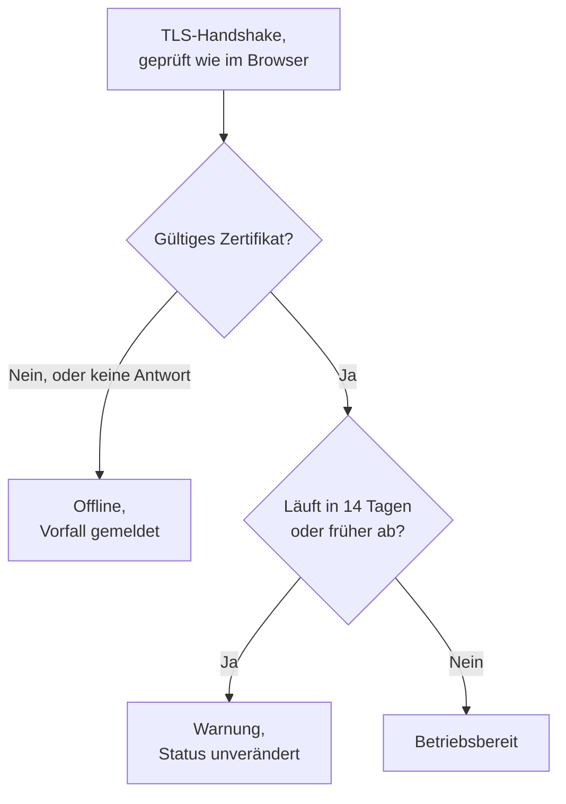

# SSL-Zertifikat-Überwachung

Ein SSL-Zertifikat-Monitor prüft die TLS-Zertifikate, die Ihre Websites und Dienste vorzeigen, so wie ein Browser es tut, und warnt Sie, bevor sie ablaufen. Außerdem nimmt er den Monitor offline, wenn ein Zertifikat nicht mehr gültig ist: abgelaufen, selbstsigniert, für einen anderen Hostnamen ausgestellt oder von einer Stelle, der Browser nicht vertrauen.

:::cards
- [Den Monitor erstellen](#einen-ssl-zertifikat-monitor-erstellen): Sechs Schritte im Dashboard.
- [Standardkriterien](#standardkriterien): Eine Ablaufwarnung 14 Tage im Voraus, ohne Einrichtung.
- [Überwachungskriterien](#überwachungskriterien): Gültigkeit, Ablauf und selbstsignierte Zertifikate.
- [Fehlerbehebung](#fehlerbehebung): Selbstsignierte und interne Zertifikate.
:::

## So funktioniert es

Bei jeder Prüfung öffnet eine Sonde eine TLS-Verbindung zum Host und Port in der URL, Port `443`, sofern die URL keinen anderen nennt, und prüft das Zertifikat wie ein Browser: eine vertrauenswürdige ausstellende Stelle, ein passender Hostname und ein Gültigkeitszeitraum, der heute einschließt. Besteht das Zertifikat die Prüfung nicht, liest die Sonde es trotzdem, sodass sein Ablaufdatum, seine ausstellende Stelle und seine Fingerabdrücke in jedem Fall festgehalten werden. Eine Verbindung, die fehlschlägt, in ein Zeitlimit läuft oder ein ungültiges Zertifikat vorzeigt, wird erneut versucht, bis zur Zahl der Wiederholungen, die Sie zulassen. Danach prüft OneUptime das Ergebnis anhand der Kriterien des Monitors.

Eine Sonde, die ihre eigene Netzwerkverbindung verloren hat, meldet kein Ergebnis und kann Ihr Zertifikat daher nicht als ungültig markieren.

## Bevor Sie beginnen

- **Eine Rolle, die Monitore erstellen darf**: Project Owner, Project Admin, Project Member, Monitor Admin oder Monitor Member oder eine benutzerdefinierte Rolle mit der Berechtigung Create Monitor.
- **Eine Sonde, die den Host und den Port erreicht.** Die Standardsonden Ihres Projekts werden für jeden neuen Monitor ausgewählt. Ein Dienst in einem privaten Netzwerk braucht eine [benutzerdefinierte Sonde](/docs/probe/custom-probe) in diesem Netzwerk.

## Einen SSL-Zertifikat-Monitor erstellen

:::steps
### Einen neuen Monitor beginnen

Gehen Sie zu **Monitore** und klicken Sie auf **Monitor erstellen**. Wählen Sie unter **Monitortyp** den Typ **SSL-Zertifikat**.

### Ihn benennen

Geben Sie einen **Name** ein, etwa `example.com certificate`, und klicken Sie dann auf **Weiter**.

### Die URL eingeben

Geben Sie unter **Website-URL** die Website ein, deren Zertifikat geprüft werden soll, etwa `https://example.com`. Für einen Dienst auf einem anderen Port geben Sie ihn mit an: `https://example.com:8443`.

### Ihn testen

Klicken Sie auf **Monitor testen**, wählen Sie unter **Sonde auswählen** eine Sonde und klicken Sie auf **Test ausführen**. **Überwachungs-Testergebnis** zeigt das Zertifikat, das die Sonde erhalten hat, mit seiner ausstellenden Stelle und seinem Ablaufdatum.

### Die Kriterien prüfen

**Monitor-Kriterien** beginnt mit den [Standardkriterien](#standardkriterien): offline, wenn das Zertifikat nicht gültig ist, eine Warnung, wenn es in 14 Tagen oder früher abläuft. Ändern Sie sie bei Bedarf und klicken Sie dann auf **Weiter**.

### Sonden wählen und erstellen

Behalten oder ändern Sie die **Sonden** und das **Überwachungsintervall** (es beginnt bei **Alle 5 Minuten**; für SSL-Zertifikat-Monitore werden 5 Minuten oder länger angeboten) und klicken Sie dann auf **Monitor erstellen**. Die Seite des Monitors öffnet sich.
:::

## Konfigurationsoptionen

| Feld | Standard | Was eingetragen wird |
| --- | --- | --- |
| **Website-URL** | Keiner | Die Website, deren Zertifikat geprüft wird, etwa `https://example.com` oder `https://example.com:8443`. Nur der Host und der Port werden verwendet; der Pfad wird ignoriert. |
| **Anfrage-Zeitlimit (Sekunden)** (unter **Weitere Felder**) | `60` | Wie lange bei jedem Versuch auf den TLS-Handshake gewartet wird. Das Maximum sind 60 Sekunden. |
| **Wiederholungen bei Fehlschlag** (unter **Weitere Felder**) | Standard der Sonde, meist `3` | Wie oft ein fehlgeschlagener Versuch wiederholt wird. Das Maximum ist 3. |

**Wiederholungen bei Fehlschlag** zählt die Wiederholungen _nach_ dem ersten Versuch, also führt `0` die Prüfung einmal aus und `2` bis zu dreimal. Bleibt das Feld leer, gilt der Standard der Sonde: 3, sofern `PROBE_MONITOR_RETRY_LIMIT` der Sonde nichts anderes sagt. Verbindungsfehler, fehlgeschlagene Zertifikatsprüfungen und Zeitüberschreitungen werden alle wiederholt, mit einer Pause von einer Sekunde zwischen den Versuchen.

## Überwachungskriterien

Kriterien entscheiden, wann das Zertifikat als in Ordnung, beeinträchtigt oder fehlerhaft gilt und ob dabei ein Vorfall gemeldet oder eine Warnung erstellt wird. Jedes Kriterium prüft einen oder mehrere Filter:

| Filter | Bedingungen | Was er prüft |
| --- | --- | --- |
| **Is Valid Certificate** | **Wahr**, **Falsch** | Das Zertifikat besteht die Prüfungen eines Browsers: eine vertrauenswürdige ausstellende Stelle, ein passender Hostname und ein Gültigkeitszeitraum, der heute einschließt. **Falsch**, wenn der Endpunkt nicht geantwortet hat. |
| **Is Not A Valid Certificate** | **Wahr**, **Falsch** | Das Gegenteil von **Is Valid Certificate**: **Wahr**, wenn das Zertifikat diese Prüfungen nicht besteht oder nicht geprüft werden konnte. |
| **Is Expired Certificate** | **Wahr**, **Falsch** | Das Ablaufdatum des Zertifikats ist überschritten. |
| **Is Self Signed Certificate** | **Wahr**, **Falsch** | Das Zertifikat oder eines in seiner Kette ist selbstsigniert. |
| **Expires In Days** | **Greater Than**, **Less Than**, **Greater Than Or Equal To**, **Less Than Or Equal To** | Tage, bis das Zertifikat abläuft. |
| **Expires In Hours** | **Greater Than**, **Less Than**, **Greater Than Or Equal To**, **Less Than Or Equal To** | Stunden, bis das Zertifikat abläuft. |

**Expires In Days** zählt ganze Tage: Ein Zertifikat, das in 14 Tagen und 20 Stunden abläuft, hat noch 14 Tage. **Expires In Hours** zählt ganze Stunden auf dieselbe Weise.

Bei zwei oder mehr Filtern entscheidet **Abgleichsbedingung**, ob **Alle** zutreffen müssen oder **Beliebig** einer genügt. Die **Aktionen** eines Kriteriums legen fest, was es tut: den Monitorstatus ändern, eine Warnung erstellen, einen Vorfall melden oder mehreres davon.

### Standardkriterien

Ein neuer SSL-Zertifikat-Monitor beginnt mit drei Kriterien, sodass er Sie ohne jede Einrichtung warnt, bevor ein Zertifikat abläuft:

1. **Zertifikat ist nicht gültig** — das Zertifikat ist abgelaufen, selbstsigniert, für einen anderen Hostnamen oder von einer nicht vertrauenswürdigen Stelle ausgestellt oder konnte nicht geprüft werden, weil der Endpunkt nicht geantwortet hat. Der Monitor wird als **Offline** markiert und ein Vorfall namens „_monitor name_ certificate is not valid“ wird erstellt. Seine Grundursache sagt, welcher dieser Fälle es war. Der Vorfall löst sich von selbst auf, sobald das Zertifikat wieder gültig ist.
2. **Zertifikat läuft bald ab** — das Zertifikat ist gültig, läuft aber in 14 Tagen oder früher ab. Eine **Warnung** namens „_monitor name_ certificate expires soon“ wird erstellt.
3. **Zertifikat ist gültig** — der Monitor wird als **Betriebsbereit** markiert.

Die Warnung „läuft bald ab“ ist eine Warnung, kein Vorfall: Sie erscheint nicht auf Ihren Statusseiten, sie alarmiert niemanden, solange Sie ihr keine Bereitschaftsrichtlinie hinzufügen, und sie ändert den Status des Monitors nicht. Sie verwendet den zweiten Warnungsschweregrad Ihres Projekts, bei einem neuen Projekt **Low**. Sobald das erneuerte Zertifikat erkannt wird, landet der Monitor wieder bei „Zertifikat ist gültig“, und die Warnung löst sich von selbst auf.

Kriterien werden von oben nach unten geprüft, und das erste zutreffende entscheidet, was passiert. Deshalb steht „läuft bald ab“ über „ist gültig“: Ein ablaufendes Zertifikat ist noch gültig und würde daher auf beide zutreffen.

Um früher gewarnt zu werden, ändern Sie den Wert des Filters **Expires In Days** im Kriterium „läuft bald ab“, etwa auf `30`. Um stattdessen jemanden zu alarmieren, öffnen Sie die **Aktionen** dieses Kriteriums: Schalten Sie **Wenn Filter übereinstimmen, einen Vorfall deklarieren.** ein, oder behalten Sie die Warnung und fügen Sie ihr unter **Bereitschaftsrichtlinien** eine Bereitschaftsrichtlinie hinzu.

:::details Die Warnung einem Monitor hinzufügen, der vor ihr erstellt wurde
Monitore, die erstellt wurden, bevor OneUptime diese Warnung eingeführt hat, haben kein Kriterium „läuft bald ab“. So fügen Sie es hinzu:

1. Öffnen Sie beim Monitor **Konfiguration → Kriterien** und klicken Sie auf **Überwachungskriterien bearbeiten**.
2. Klicken Sie auf **Kriterien hinzufügen**. Setzen Sie seinen Filter auf **Is Valid Certificate** / **Wahr**, klicken Sie auf **Filter hinzufügen** und setzen Sie den zweiten auf **Expires In Days** / **Less Than Or Equal To** / `14`. Lassen Sie **Abgleichsbedingung** auf **Alle** (es erscheint unter den Filtern, sobald es zwei sind).
3. Schalten Sie unter **Aktionen** **Wenn Filter übereinstimmen, eine Warnung erstellen.** ein und lassen Sie **Wenn Filter übereinstimmen, Monitorstatus ändern.** ausgeschaltet, sodass es eine Warnung erstellt und den Monitorstatus nicht ändert.
4. Ziehen Sie das neue Kriterium über das Kriterium, das den Monitor als online markiert, und speichern Sie dann.
:::

### Beispielkriterien

| Ziel | Filter | Bedingung | Wert |
| --- | --- | --- | --- |
| Einen Monat im Voraus warnen | **Expires In Days** | **Less Than Or Equal To** | `30` |
| Am letzten Tag jemanden alarmieren | **Expires In Hours** | **Less Than** | `24` |
| Erst offline, wenn das Zertifikat abgelaufen ist | **Is Expired Certificate** | **Wahr** | — |
| Ein selbstsigniertes Zertifikat kennzeichnen | **Is Self Signed Certificate** | **Wahr** | — |

Ein Kriterium zum Ablauf muss über dem Kriterium stehen, das das Zertifikat als gültig markiert: Ein Zertifikat kurz vor dem Ablauf ist noch gültig, und das erste zutreffende Kriterium gewinnt.

## Bewährte Vorgehensweisen

1. **Lassen Sie sich Zeit zum Erneuern** — Die Standardwarnung kommt 14 Tage vor dem Ablauf, was zu Zertifikaten passt, die sich selbst erneuern. Dauert das Erneuern bei Ihnen länger (ein gekauftes Zertifikat oder ein Änderungsprozess), erhöhen Sie sie auf 30 Tage.
2. **Überwachen Sie jeden Endpunkt** — Wenn Sie mehrere Domains oder Subdomains haben, erstellen Sie für jede einen Monitor. Jede kann ihr eigenes Zertifikat haben.
3. **Denken Sie an andere Ports** — Dienste, die TLS auf einem anderen Port als `443` anbieten, etwa `8443`, haben ebenfalls Zertifikate. Geben Sie den Port in der URL an.
4. **Prüfen Sie nach der Erneuerung** — Prüfen Sie nach dem Erneuern eines Zertifikats das nächste Ergebnis des Monitors: Das angezeigte Ablaufdatum sollte das neue sein.

## Fehlerbehebung

:::details Das Zertifikat ist in meinem Browser in Ordnung, aber der Monitor meldet es als ungültig
Die Grundursache des Vorfalls sagt, warum. Ein häufiger Grund ist ein Server, der sein Zertifikat ohne die Zwischenzertifikate sendet: Browser füllen die Lücke oft selbst, die Sonde nicht. Konfigurieren Sie den Server so, dass er die vollständige Kette sendet. Ein anderer Grund ist eine URL, deren Hostname nicht im Zertifikat steht.
:::

:::details Ich überwache einen internen Dienst mit einem selbstsignierten Zertifikat
Ein selbstsigniertes Zertifikat ist nie gültig, daher halten die Standardkriterien den Monitor offline. **Is Self Signed Certificate**, **Is Expired Certificate** und **Expires In Days** funktionieren dafür trotzdem, also bauen Sie die Kriterien darauf auf. Unter **Konfiguration → Kriterien**:

1. Klicken Sie im Kriterium „nicht gültig“ auf **Filter hinzufügen**, setzen Sie den neuen Filter auf **Is Self Signed Certificate** / **Falsch** und setzen Sie **Abgleichsbedingung** auf **Alle**. Das Kriterium nimmt den Monitor weiterhin offline, wenn der Endpunkt nicht antwortet oder das Zertifikat auf andere Weise fehlerhaft ist.
2. Fügen Sie ein Kriterium mit **Is Expired Certificate** / **Wahr** hinzu, das den Monitor als **Offline** markiert und einen Vorfall meldet, und ziehen Sie es nach oben.
3. Ersetzen Sie im Kriterium „läuft bald ab“ **Is Valid Certificate** / **Wahr** durch **Is Expired Certificate** / **Falsch**, sodass die Warnung auch das selbstsignierte Zertifikat abdeckt.

Solange das Zertifikat aktuell ist, trifft kein Kriterium zu, und der Monitor zeigt seinen Standardstatus, **Betriebsbereit**.
:::

:::details Der Monitor ist offline mit „could not be checked because the endpoint is not reachable“
Die Sonde konnte keine TLS-Verbindung zum Host und Port öffnen. Prüfen Sie den Port in der URL und ob eine Firewall die Sonden durchlässt. Ein Host in einem privaten Netzwerk braucht eine [benutzerdefinierte Sonde](/docs/probe/custom-probe).
:::

## Nächste Schritte

:::cards
- [Website-Überwachung](/docs/monitor/website-monitor): Prüfen, ob die Website selbst antwortet.
- [Domain-Überwachung](/docs/monitor/domain-monitor): Gewarnt werden, bevor die Registrierung der Domain abläuft.
- [Eskalationsregeln](/docs/on-call/escalation-rules): Festlegen, wer von den Warnungen und Vorfällen alarmiert wird.
- [Vorfälle – Übersicht](/docs/incidents/index): Was passiert, nachdem der Monitor einen gemeldet hat.
:::
