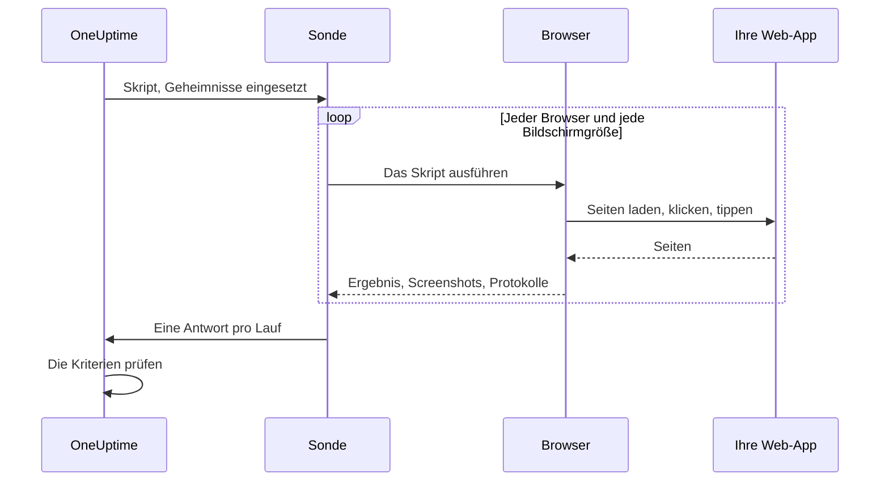

# Synthetische Überwachung

Ein synthetischer Monitor steuert Ihre Web-App nach Zeitplan in einem echten Browser, mit einem Playwright-Skript, das Sie schreiben: Er öffnet Seiten, füllt Formulare aus, klickt sich durch eine Nutzerreise und schlägt fehl, wenn die Reise fehlschlägt. Verwenden Sie ihn, um Ausfälle zu bemerken, die eine Verfügbarkeitsprüfung nicht sieht — eine Anmeldung, die nicht mehr funktioniert, einen Bezahlknopf, der nichts tut, ein Dashboard, das nie fertig lädt.

:::cards
- [Den Monitor erstellen](#einen-synthetischen-monitor-erstellen): Ein Skript schreiben, Browser und Bildschirmgrößen wählen.
- [Das Skript schreiben](#das-skript-schreiben): Eine lauffähige Anmeldereise als Ausgangspunkt.
- [Screenshots](#screenshots): Sehen, wie die Seite aussah, als ein Lauf fehlschlug.
- [Was das Skript verwenden kann](#im-skript-verfügbare-module): Playwright, HTTP, Krypto und Metriken.
:::

## So funktioniert es

Bei jeder Prüfung führt eine Sonde Ihr Skript einmal für jeden gewählten Browser und jede gewählte Bildschirmgröße aus, nacheinander. Jeder Lauf startet einen frischen Browser ohne Cookies oder Speicher aus früheren Läufen; das Skript steuert seine Seite, macht Screenshots und gibt ein Ergebnis zurück oder wirft einen Fehler. Die Sonde meldet jeden Lauf, und OneUptime prüft Ihre Kriterien daran.



| Bildschirmtyp | Viewport |
| --- | --- |
| Mobile | 360 × 640 |
| Tablet | 1024 × 768 |
| Desktop | 1920 × 1080 |

Die Browser sind Chromium und Firefox.

## Bevor Sie beginnen

- Eine **Sonde**, die Ihre Web-App erreicht. Verwenden Sie für eine App in Ihrem Netzwerk eine [benutzerdefinierte Sonde](/docs/probe/custom-probe). Das Docker-Image der Sonde enthält Chromium und Firefox; eine Sonde außerhalb von Docker braucht sie installiert.
- Jedes Passwort oder Token, das die Reise braucht, gespeichert als [Monitor-Geheimnis](/docs/monitor/monitor-secrets).

## Einen synthetischen Monitor erstellen

:::steps
### Einen neuen Monitor beginnen

Gehen Sie zu **Monitore** und klicken Sie auf **Monitor erstellen**. Klicken Sie unter **Monitortyp** auf **Weitere Monitortypen** und wählen Sie **Synthetischer Monitor** unter **Synthetic Monitoring**, oder tippen Sie `playwright` in das Suchfeld. Geben Sie einen **Name** ein und klicken Sie dann auf **Weiter**.

### Das Skript hinzufügen

Schreiben Sie Ihr Skript im Editor **Playwright-Code**. Beginnen Sie mit dem [Beispiel unten](#das-skript-schreiben).

### Browser und Bildschirmgrößen wählen

Kreuzen Sie die Browser unter **Browser-Typ** und die Größen unter **Bildschirmtyp** an. Das Skript läuft einmal für jede Kombination, zwei Browser und drei Größen ergeben also sechs Läufe pro Prüfung. Unter **Weitere Felder** wiederholt **Anzahl der Wiederholungen bei Fehler** einen fehlgeschlagenen Lauf bis zu 5-mal.

### Es testen

Klicken Sie auf **Monitor testen**, um das Skript einmal auf einer Sonde auszuführen, und prüfen Sie Ergebnis, Protokolle und Screenshots jedes Laufs.

### Die Kriterien prüfen

Der Monitor beginnt mit zwei Kriterien: Er ist offline und eröffnet einen Vorfall, wenn ein Lauf fehlschlägt, und online, wenn keiner fehlschlägt. Ändern Sie sie oder fügen Sie eigene hinzu — siehe [Kriterien](#kriterien) — und klicken Sie dann auf **Weiter**.

### Sonden wählen und erstellen

Wählen Sie die **Sonden** und ein **Überwachungsintervall** — synthetischen Monitoren werden Intervalle ab 5 Minuten angeboten — und klicken Sie dann auf **Monitor erstellen**.
:::

## Das Skript schreiben

Das Skript ist der Rumpf einer `async`-Funktion. `page` ist eine bereits geöffnete, Playwright-kompatible Seite; steuern Sie sie, geben Sie mit `return` ein Ergebnis zurück und lassen Sie den Lauf mit `throw` fehlschlagen (oder indem ein Playwright-Aufruf in ein Zeitlimit läuft). Dieses Beispiel meldet sich an und prüft, dass das Dashboard lädt:

```javascript title="Synthetic monitor script"
await page.goto("https://app.example.com/login");
screenshots["login-page"] = await page.screenshot();

await page.fill("#email", "monitoring@example.com");
await page.fill("#password", "{{monitorSecrets.AppPassword}}");
await page.click("button[type=submit]");

// Fails the run if the dashboard does not appear within 10 seconds.
await page.waitForSelector(".dashboard", { timeout: 10000 });
screenshots["dashboard"] = await page.screenshot();

console.log(`Signed in on ${browserType}, ${screenSizeType}`);

return {
  data: { title: await page.title() },
};
```

| Ziel | Vorgehen | Was OneUptime festhält |
| --- | --- | --- |
| Ein Ergebnis melden | `return { data: ... }` | Das **Ergebnis** des Laufs. Nur `data` wird behalten. |
| Den Lauf fehlschlagen lassen | `throw new Error("...")`, oder ein Warten in ein Zeitlimit laufen lassen | Den **Skriptfehler** des Laufs. |
| Belege aufbewahren | `screenshots["name"] = await page.screenshot()` | Einen Screenshot, der auch behalten wird, wenn der Lauf fehlschlägt. |
| Eine Spur hinterlassen | `console.log(...)` | Die Protokollmeldungen des Laufs. |

Um die Läufe anzusehen, öffnen Sie die **Übersicht** des Monitors: Die Karte **Monitor-Zusammenfassung** hat einen Block pro Browser und Bildschirmgröße, und **Weitere Details anzeigen** zeigt die Screenshots jedes Laufs.

### Einsatz von Playwright

Wir verwenden Playwright, um Benutzerinteraktionen zu simulieren. Der Wert `page` ist eine sichere, Playwright-kompatible Fassade für die Seite, die für diese Ausführung erstellt wurde. Die gängigen Methoden von `Page`, `Locator`, `Frame`, `ElementHandle`, `JSHandle`, `Request`, `Response`, Tastatur, Maus und Browserkontext stehen zur Verfügung. Dazu gehören Navigation, Locators, Klicks, Formulareingaben, Auswertung in der Seite, Pop-ups, weitere Seiten, das Prüfen von Antworten und Screenshots. Den Browserkontext der Ausführung erreichen Sie über `page.context()`, zum Beispiel um eine neue Seite zu öffnen oder ein Pop-up zu behandeln.

Synthetische Skripte laufen nicht im Node.js-Prozess der Sonde. Werte überqueren die Laufzeitgrenze als kopierte Daten oder als undurchsichtige, an die Ausführung gebundene Fähigkeiten, deshalb funktionieren manche Playwright-APIs anders oder gar nicht:

| Nicht verfügbar | Stattdessen |
| --- | --- |
| Methoden zum Starten oder Verbinden eines Browsers, CDP-Sitzungen, Request-Routing, freigegebene Bindings, private Felder von Playwright und jede Option, die einen Dateisystempfad des Hosts liest oder schreibt. `page.context().browser()` ist daher nicht verfügbar. | Die Seite und der Browserkontext, die Sie erhalten. |
| Event-Listener (`page.on(...)`, `page.once(...)`) — ihr Aufruf schlägt mit einem klaren Fehler fehl. | `page.waitForEvent(...)` für Dialoge und Pop-ups, oder das Warten auf Antworten und Anfragen mit Zeichenketten- oder Regex-Matchern. |
| Funktions-Prädikate für Warte-Methoden auf Ereignisse, Anfragen, Antworten und URLs. | Zeichenketten- oder Regex-Matcher, Locators oder explizites Abfragen in einer Schleife. |
| Die synchronen Frame-Zugriffe (`page.frames()`, `page.mainFrame()`, `page.frame(...)`). | `page.frameLocator(...)` für iframes. |
| `page.request.*` | Das globale `axios` für HTTP-Anfragen. |
| Ganzseitige Screenshots und PDF-Ausgabe. | Viewport-Screenshots, die das unten beschriebene Verhalten bei Fehlerbelegen beibehalten. |

`page.waitForNavigation(...)`, `page.setDefaultTimeout(...)` und `page.setDefaultNavigationTimeout(...)` werden unterstützt. `page.waitForEvent(...)` wartet auf `dialog`, `domcontentloaded`, `load`, `popup`, `request`, `requestfailed`, `requestfinished` und `response`. Auswertungsfunktionen, die an Methoden wie `page.evaluate()` übergeben werden, laufen in der überwachten Browserseite, nie im Prozess der Sonde. Jede Ausführung kann bis zu acht Seiten verwenden.

Browser-Berechtigungen sind auf Standort und Benachrichtigungen beschränkt. Zwischenablage, Kamera, Mikrofon, MIDI, lokale Schriften und andere Geräteberechtigungen des Hosts stehen Monitor-Skripten nicht zur Verfügung.

### Was das Skript zurückgibt

Vom Skript zurückgegebene Daten werden vor dem Speichern nach JSON serialisiert: In einfachen Objekten und Arrays werden `NaN` und `Infinity` zu `null`, Eigenschaften mit `undefined` und Funktionen entfallen, und `Date`-Objekte werden zu ISO-Zeichenketten — genau wie bei `JSON.stringify`. Klasseninstanzen und andere nicht einfache Objekte entfallen ganz. Ein `BigInt` wird zu einer Zeichenkette. Ein Ergebnis, das zirkulär ist, tiefer als 30 Ebenen verschachtelt oder größer als 5 MB, lässt den Lauf stattdessen fehlschlagen.

### Auf die zurückgegebenen Daten alarmieren

Was das Skript als `data` zurückgibt, ist der **Result Value** des Monitors, den ein Kriterium vergleichen kann. Ist `data` ein Objekt oder ein Array, füllen Sie im Result-Value-Filter **Feldpfad (optional)** aus, um ein Feld daraus zu vergleichen — zum Beispiel `status`, `timings.loadTime` oder `errors[0].message`. Der Filter wird an den Daten jedes Browsers und jeder Bildschirmgröße geprüft, auf denen der Monitor läuft, und trifft zu, wenn einer davon zutrifft. Wie Pfade und Bedingungen funktionieren, steht unter [Auf die zurückgegebenen Daten alarmieren](/docs/monitor/custom-code-monitor#auf-die-zurückgegebenen-daten-alarmieren).

## Screenshots

Im Skriptkontext steht ein vordeklariertes Objekt `screenshots` zur Verfügung. Weisen Sie ihm an jeder Stelle des Skripts Screenshots zu — diese Screenshots werden **auch dann erfasst, wenn das Skript einen Fehler wirft** (auch bei fehlgeschlagenen Assertions, Zeitlimits oder unerwarteten Fehlern), sodass Sie genau sehen, wie die Seite aussah, als der Lauf fehlschlug. Erfasste Screenshots erscheinen im OneUptime-Dashboard für genau diesen Lauf des Monitors.

```javascript
// Capture screenshots via the `screenshots` side-channel — they are preserved on both success and failure.

await page.goto("https://app.example.com/login");
screenshots["login-page"] = await page.screenshot();

await page.fill("#email", "user@example.com");
await page.fill("#password", "wrong");
await page.click("button[type=submit]");

// If the next assertion throws, the `login-page` screenshot above is still captured.
await page.waitForSelector(".dashboard", { timeout: 5000 });

screenshots["dashboard"] = await page.screenshot();

return {
  data: "Login succeeded",
};
```

Ein Lauf behält bis zu 20 Screenshots, jeden bis 10 MB und insgesamt 50 MB. Ein Screenshot kann auch in dem Vorfall oder der Warnung erscheinen, die ein fehlschlagender Lauf eröffnet — auf dessen Seite und in den E-Mails dazu —, wenn Sie ihn in die Vorfall- oder Warnungsbeschreibung des Monitors setzen. Siehe [Einen Screenshot zeigen](/docs/monitor/incident-alert-templating#synthetische-monitore).

:::details Screenshots zurückgeben (veraltet)
Aus Gründen der Abwärtskompatibilität können Sie Screenshots auch als Teil des Rückgabewerts aus dem Skript zurückgeben. So zurückgegebene Screenshots werden **nur** erfasst, wenn das Skript normal endet — sie gehen verloren, wenn das Skript einen Fehler wirft. Bevorzugen Sie das Seitenkanal-Muster oben, wenn Sie Belege für Fehlschläge wollen.

```javascript
// Legacy pattern — screenshots only captured on successful return.
const screenshots = {};
screenshots["screenshot-name"] = await page.screenshot();

return {
  data: "Hello World",
  screenshots: screenshots,
};
```
:::

## Monitor-Geheimnisse verwenden

Verweisen Sie an beliebiger Stelle im Skript mit `{{monitorSecrets.NAME}}` auf ein Geheimnis. OneUptime ersetzt den Verweis durch den Wert des Geheimnisses, als Klartext, bevor das Skript die Sonde erreicht. Setzen Sie ein Geheimnis also in Anführungszeichen, um es als Zeichenkette zu verwenden, und lassen Sie es ohne, um es als Zahl oder booleschen Wert zu verwenden:

```javascript
// Used as a string: wrap it in quotes.
const password = "{{monitorSecrets.AppPassword}}";

// Used as a number or a boolean: leave it bare.
const retryLimit = {{monitorSecrets.RetryLimit}};
const verbose = {{monitorSecrets.Verbose}};
```

Wie Sie ein Geheimnis anlegen und festlegen, welche Monitore es verwenden dürfen, steht unter [Überwachungs-Geheimnisse](/docs/monitor/monitor-secrets).

## Benutzerdefinierte Metriken

Mit der Funktion `oneuptime.captureMetric()` erfassen Sie aus Ihrem Skript eigene Metriken. Diese Metriken werden in OneUptime gespeichert und lassen sich im Metrik-Explorer in Dashboards darstellen.

```javascript
oneuptime.captureMetric(name, value, attributes);
```

| Parameter | Typ | Beschreibung |
| --- | --- | --- |
| `name` | string, erforderlich | Der Name der Metrik (z. B. `"dashboard.load.time"`). Er wird automatisch mit dem Präfix `custom.monitor.` gespeichert. |
| `value` | number, erforderlich | Der numerische Wert der Metrik. |
| `attributes` | object, optional | Schlüssel-Wert-Paare für zusätzlichen Kontext. |

### Beispiel

```javascript
await page.goto("https://app.example.com");

const startTime = Date.now();
await page.waitForSelector("#dashboard-loaded");
const loadTime = Date.now() - startTime;

// Capture page load time, tagged with this run's browser and screen size
oneuptime.captureMetric("dashboard.load.time", loadTime, {
  page: "dashboard",
  browser: browserType,
  screen: screenSizeType,
});

screenshots["dashboard"] = await page.screenshot();

return {
  data: { loadTime },
};
```

Einmal erfasst, erscheinen diese Metriken im Metrik-Explorer unter Namen wie `custom.monitor.dashboard.load.time` und auf der Seite **Metriken** des Monitors unter **Benutzerdefinierte Metriken**. OneUptime ergänzt jeden Datenpunkt um den Monitor und die Sonde; um nach Browser oder Bildschirmgröße zu filtern, übergeben Sie diese als Attribute, wie im Beispiel.

Ein Lauf kann höchstens 100 Metriken erfassen, nur mit numerischen Werten, und OneUptime behält höchstens 100 pro Prüfung über alle ihre Läufe. Wie bei einem Custom-Code-Monitor sind manche Attributnamen [reserviert](/docs/monitor/custom-code-monitor#reservierte-attributschlüssel) und werden verworfen, wenn ein Skript sie setzt.

## Kriterien

| Filtertyp | Was er prüft |
| --- | --- |
| **Fehler** | Den Fehler, den ein Lauf geworfen hat, falls vorhanden. |
| **Result Value** | Die `data`, die ein Lauf zurückgegeben hat. |
| **Ausführungszeit (in ms)** | Wie lange ein Lauf dauerte. |
| **Browser-Typ** | Der Browser, den ein Lauf verwendet hat: **Equal To** oder **Not Equal To**. |
| **Screen Size** | Die Bildschirmgröße, die ein Lauf verwendet hat: **Equal To** oder **Not Equal To**. |

Jeder Filter wird an jedem Lauf geprüft und trifft zu, wenn ein einziger Lauf zutrifft. Filter werden getrennt geprüft, nicht Lauf für Lauf: **Fehler** Is Not Empty zusammen mit **Browser-Typ** Equal To `Firefox` trifft zu, wenn irgendein Lauf fehlschlug und einer der Läufe Firefox verwendete — nicht nur, wenn der Firefox-Lauf fehlschlug. Um einen Browser für sich zu beobachten, geben Sie ihm einen eigenen Monitor.

In Vorfall- und Warnungsvorlagen steht jeder Lauf in `{{syntheticResponses}}`: siehe [Vorfall- & Warnmeldungsvorlagen](/docs/monitor/incident-alert-templating#synthetische-monitore).

## Im Skript verfügbare Module

| Name | Was es ist |
| --- | --- |
| `page` | Eine sichere, Playwright-kompatible Fassade, um mit dem Browser zu arbeiten. Über `page.context()` erreichen Sie den Browserkontext der Ausführung, um Seiten zu erstellen oder Pop-ups zu behandeln, aber Starten/Verbinden eines Browsers, CDP, Routing, Bindings, private Felder und Optionen mit Host-Pfaden sind nicht verfügbar. |
| `screenshots` | Ein vordeklariertes Objekt, dem Sie Screenshots zuweisen (z. B. `screenshots['login-page'] = await page.screenshot()`). Hier zugewiesene Screenshots werden erfasst, auch wenn das Skript später einen Fehler wirft. |
| `browserType` | Der Browser dieses Laufs: `Chromium` oder `Firefox`. |
| `screenSizeType` | Die Bildschirmgröße dieses Laufs: `Mobile`, `Tablet` oder `Desktop`. |
| `axios` | Ein Promise-basierter HTTP-Client mit aufrufbarem Axios sowie `request`, `get`, `head`, `options`, `post`, `put`, `patch`, `delete` und `create`. Ein Anfragetext darf bis zu 1 MB groß sein und eine Antwort bis zu 5 MB; er folgt bis zu 5 Weiterleitungen und bricht nach höchstens 30 Sekunden ab. Eigene Transporte, Adapter, Sockets, Agents und Proxy-Überschreibungen sind nicht verfügbar. |
| `crypto` | Eine Browser-Worker-Implementierung von SHA-256-Hashes, HMAC-SHA-256, `randomBytes`, `randomInt` und `randomUUID`. |
| `console` | `console.log`, `info`, `warn` und `error`. Die Meldungen werden mit jedem Lauf aufbewahrt. |
| `oneuptime.captureMetric` | Erfasst eine benutzerdefinierte Metrik. Siehe [Benutzerdefinierte Metriken](#benutzerdefinierte-metriken). |
| `http` | Eine gepufferte, reine Client-Kompatibilitätsfassade mit `request`, `get` und `Agent`. |
| `https` | Das HTTPS-Gegenstück zur reinen Client-Fassade `http`. |
| `Buffer`, `setTimeout`, `setInterval` | Und ihre `clear`-Funktionen. |

Das Skript läuft in einem Browser-Worker, nicht in Node.js, und kann keine eigenen Netzwerkverbindungen öffnen: `fetch`, `XMLHttpRequest` und `WebSocket` sind blockiert. Verwenden Sie `axios` für HTTP-Anfragen.

## Grenzen

| Grenze | Standard | Sondeneinstellung |
| --- | --- | --- |
| Skript-Zeitlimit | 60 Sekunden. Worker im Zeitlimit und alle Nachkommen des Browsers werden beendet. | `PROBE_SYNTHETIC_MONITOR_SCRIPT_TIMEOUT_IN_MS` |
| Speicher für den ganzen Prozessbaum eines Laufs | 1,5 GiB | `PROBE_SYNTHETIC_MONITOR_MAX_PROCESS_TREE_RSS_BYTES` |
| Beschreibbarer Browserspeicher | 256 MiB | `PROBE_SYNTHETIC_MONITOR_MAX_DISK_BYTES` |
| Gleichzeitige Läufe auf einer Sonde | 4 | `PROBE_SYNTHETIC_MONITOR_MAX_CONCURRENCY` |
| Seiten pro Ausführung | 8 | — |

Wird die Speicher- oder Datenträgergrenze überschritten, wird diese Ausführung beendet und ihr temporäres Profil entfernt. Die Sondeneinstellungen gelten für selbst gehostete Sonden; das Helm-Chart setzt dieselben Werte pro Sonde (zum Beispiel `syntheticMonitorScriptTimeoutInMs`).

Die Browser sind im Docker-Image der Sonde enthalten, eine selbst gehostete Sonde bekommt neuere Browser also, wenn Sie ihr Image aktualisieren.

## Fehlerbehebung

:::details Ein Lauf schlägt fehl, aber ich sehe nicht, warum
Weisen Sie dem Objekt `screenshots` vor jedem riskanten Schritt einen Screenshot zu. Sie werden auch dann behalten, wenn der Lauf fehlschlägt, und zeigen, wie die Seite an dieser Stelle aussah.
:::

:::details `page.on(...)` wirft einen Fehler
Event-Listener können die Isolationsgrenze nicht überqueren. Verwenden Sie `page.waitForEvent(...)` für Dialoge und Pop-ups, oder ein Warten auf eine Antwort oder Anfrage mit einem Zeichenketten- oder Regex-Matcher.
:::

:::details Der Lauf läuft in ein Zeitlimit
Warten Sie mit `page.waitForSelector(...)` auf bestimmte Elemente, mit einem `timeout`, das kürzer ist als die Grenze des Skripts selbst, damit der Lauf mit einem klaren Fehler an dem Schritt fehlschlägt, der langsam ist.
:::

:::details Eine selbst gehostete Sonde meldet, die ausführbare Browserdatei sei nicht gefunden worden
Die Sonde läuft außerhalb ihres Docker-Images, ohne installiertes Chromium oder Firefox. Führen Sie das Image der Sonde aus oder installieren Sie die Browser auf dieser Maschine.
:::

## Nächste Schritte

:::cards
- [Benutzerdefinierte Code-Überwachung](/docs/monitor/custom-code-monitor): APIs mit einem Skript prüfen, ohne Browser.
- [Einen Screenshot zeigen](/docs/monitor/incident-alert-templating#synthetische-monitore): Den Screenshot des fehlgeschlagenen Laufs in den Vorfall übernehmen.
- [Überwachungs-Geheimnisse](/docs/monitor/monitor-secrets): Zugangsdaten aus Ihrem Skript heraushalten.
:::
