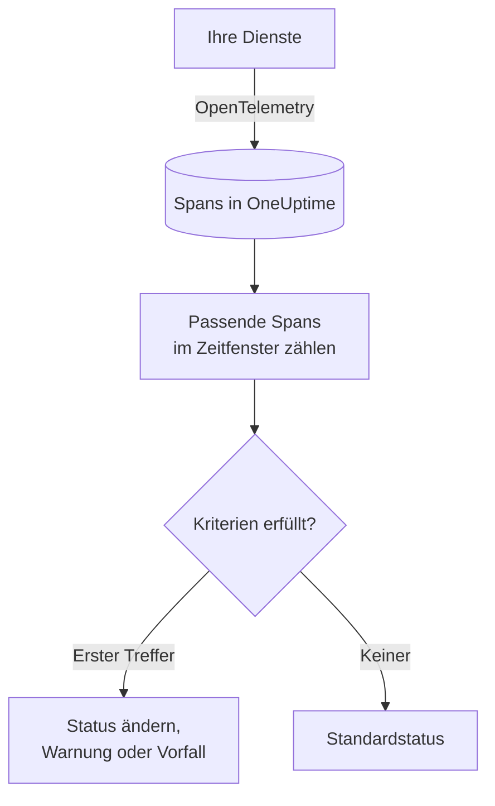

# Traces-Überwachung

Ein Traces-Monitor zählt die Spans, die Ihre Dienste an OneUptime senden und die zu Ihren Filtern passen – Span-Name, Status, Dienst, Attribute –, über ein Zeitfenster. Erfüllt die Anzahl Ihre Kriterien, ändert er den Status des Monitors, erstellt eine Warnung oder eröffnet einen Vorfall. Damit warnen Sie bei fehlschlagenden Anfragen an einen Endpunkt, bei einer Spitze von Fehler-Spans oder bei einem Dienst, der keine Traces mehr sendet.

:::cards
- [Den Monitor erstellen](#einen-traces-monitor-erstellen): Wählen, welche Spans gezählt werden und wann gewarnt wird.
- [Span-Statuscodes](#span-statuscodes): Was OK, ERROR und UNSET bedeuten und wonach Sie filtern.
- [Wie er ausgewertet wird](#wie-er-ausgewertet-wird): Das Zeitfenster, die Anzahl und der Minutentakt.
- [Kriterien](#kriterien): Schwellenwerte, Anomalieerkennung und die Voreinstellungen.
:::

## So funktioniert es

Jede Minute zählt OneUptime die Spans, die zu den Filtern des Monitors passen und innerhalb seines Zeitfensters begonnen haben. Diese Anzahl prüft es von oben nach unten gegen die Kriterien des Monitors, und das erste passende Kriterium entscheidet, was geschieht. Passt keines, kehrt der Monitor zu seinem Standardstatus zurück.

## Bevor Sie beginnen

- Ihre Dienste senden Traces über OpenTelemetry an OneUptime. Siehe [OpenTelemetry](/docs/telemetry/open-telemetry).
- Schlagen Sie den genauen Span-Namen, den Sie beobachten wollen, im Trace-Explorer nach: Span-Namen legt Ihre Instrumentierung fest, zum Beispiel `POST /api/checkout` oder `GET`.

## Einen Traces-Monitor erstellen

:::steps
### Einen neuen Monitor beginnen

Gehen Sie zu **Monitore** und klicken Sie auf **Monitor erstellen**.

### Traces wählen

Klicken Sie unter **Monitortyp** auf **Weitere Monitortypen** und wählen Sie **Traces** unter **Telemetrie**, oder tippen Sie `traces` in das Suchfeld. Geben Sie einen **Name** ein und klicken Sie dann auf **Weiter**.

### Die zu zählenden Spans wählen

Legen Sie in **Trace-Monitor-Konfiguration** die Felder **Span-Name**, **Überwachungs-Traces für (time)** und **Nach Span-Status filtern** fest. Ein leer gelassener Filter passt auf jeden Span. **Span-Vorschau** unter den Filtern zeigt die Spans, auf die sie gerade passen.

### Weiter eingrenzen (optional)

Öffnen Sie **Weitere Felder**, um nach Telemetrie-Dienst, Infrastruktur-Entität oder Attribut zu filtern.

### Die Kriterien festlegen

Die Karte **Monitor-Kriterien** beginnt mit zwei Kriterien: offline, mit einem Vorfall, wenn kein Span passt; online, sobald mindestens einer passt. Ändern Sie sie so, dass sie das melden, was Sie wollen – siehe [Kriterien](#kriterien).

### Den Monitor erstellen

Klicken Sie auf **Monitor erstellen**. Der Monitor öffnet sich auf seiner Seite **Übersicht**, und seine erste Auswertung läuft innerhalb einer Minute.
:::

> [!TIP]
> Um zu erfahren, wenn eine KI-Funktion schlecht antwortet – fehlgeschlagene, verweigerte, abgeschnittene, leere, markierte oder langsame Antworten –, wählen Sie stattdessen **KI / LLM** unter **Telemetrie**. Dieser Monitor liest die KI-Aufrufe in Ihren Traces für Sie, ohne dass Sie Span-Filter schreiben müssen. Siehe [KI- / LLM-Observability](/docs/telemetry/ai-llm-observability#erfahren-wenn-die-ki-schlecht-antwortet).

## Was er abfragt

| Feld | Worauf es passt | Standard |
| --- | --- | --- |
| **Span-Name** | Spans, deren Name diesen Text enthält, ohne Beachtung der Groß-/Kleinschreibung. | Leer: jeder Span |
| **Überwachungs-Traces für (time)** | Spans, die in den letzten 5 Sekunden bis zu den letzten 24 Stunden begonnen haben. | **Letzte 1 Minute** |
| **Nach Span-Status filtern** | Spans mit einem der gewählten Status: **Nicht festgelegt**, **OK** oder **Fehler**. | Leer: jeder Status |
| **Nach Telemetrie-Dienst filtern** (unter **Weitere Felder**) | Spans von einem der gewählten Dienste. | Leer: jeder Dienst |
| **Nach Infrastruktur-Entität filtern** (unter **Weitere Felder**) | Spans von einem der gewählten Hosts, Pods, Container und anderen Entitäten. | Leer: jede Entität |
| **Nach Attributen filtern** (unter **Weitere Felder**) | Spans, deren Attribute jede Bedingung erfüllen. Jede Bedingung hat ihren eigenen Operator, etwa „gleich“ oder „enthält“. | Leer: keine Bedingung |

Alle Filter, die Sie festlegen, müssen passen, damit ein Span gezählt wird.

### Span-Statuscodes

- **OK** — Die Operation wurde vom Anwendungscode oder von einer Trace-Pipeline ausdrücklich als erfolgreich markiert
- **ERROR** — Die Operation ist auf einen Fehler gestoßen
- **UNSET** — Es wurde kein Fehlerstatus gesetzt. Dies ist der Standardstatus von OpenTelemetry

UNSET bedeutet nicht, dass Daten fehlen. Die OpenTelemetry-Instrumentierung setzt ERROR, wenn eine Operation fehlschlägt, und belässt erfolgreiche Spans auf UNSET, sodass bei einem gesunden Dienst die meisten Spans UNSET sind. OneUptime zeigt sie in Grün als „Unset (no error)“ an. Das Erfassen einer Ausnahme ändert den Status eines Spans nicht, daher kann ein UNSET-Span trotzdem Ausnahmen haben; sie werden zusammen mit dem Span aufgeführt. Um bei Fehlern benachrichtigt zu werden, filtern Sie nach ERROR. Um alle Spans zu zählen, die nicht fehlgeschlagen sind, wählen Sie sowohl OK als auch UNSET aus.

Wenn erfolgreiche Anfragen als OK angezeigt werden sollen, fügen Sie unter **Traces > Einstellungen > Pipelines** eine Trace-Pipeline mit der Filterbedingung **Status = Nicht festgelegt** und einem **Status-Remapper** hinzu, der Werte von `http.response.status_code` wie `200` auf Ok abbildet.

## Wie er ausgewertet wird

- **Jede Minute.** Ein Traces-Monitor wird nicht von Sonden geprüft, deshalb hat er kein Intervall zum Einstellen und keine Seite **Sonden & Intervall**.
- **Eine Zahl pro Auswertung.** Der Monitor zählt die Spans, die zu jedem Filter passen und innerhalb von **Überwachungs-Traces für (time)** vor der Auswertung begonnen haben. Mit **Letzte 5 Minuten** blickt jede Auswertung fünf Minuten zurück, sodass sich die Fenster aufeinanderfolgender Auswertungen überlappen.
- **Keine Spans ergeben die Anzahl 0.** Ein Dienst, der keine Traces mehr sendet, liefert 0 – genau darauf achtet das Standardkriterium für offline.
- **Die eigene Ausfallzeit von OneUptime ist keine Stille.** Solange das Zeitfenster Zeit enthält, in der OneUptime selbst keine Daten empfangen hat – weil es neu startete, aktualisiert wurde oder einen Rückstand aufholte –, wartet die Prüfung: Der Status ändert sich nicht, und kein Vorfall und keine Warnung wird eröffnet oder behoben. Siehe [Wenn OneUptime keine Daten empfängt](/docs/monitor/when-oneuptime-is-not-receiving).
- **Kriterien von oben nach unten.** Das erste passende Kriterium entscheidet; stellen Sie also das schwerwiegendste nach oben.

Jede Statusänderung wird mit ihrem Grund in der **Status-Zeitachse** des Monitors festgehalten.

## Kriterien

Die Kriterien eines Traces-Monitors haben einen **Filtertyp**: **Span Count**, die Anzahl der Spans, die im Fenster gepasst haben. Wählen Sie eine **Filterbedingung** und, bei einer Schwellenwertbedingung, einen **Wert**.

| Filterbedingung | Passt, wenn die Anzahl der Spans … |
| --- | --- |
| **Greater Than** | über dem Wert liegt |
| **Greater Than Or Equal To** | den Wert erreicht oder darüber liegt |
| **Less Than** | unter dem Wert liegt |
| **Less Than Or Equal To** | den Wert erreicht oder darunter liegt |
| **Equal To** | genau dem Wert entspricht |
| **Anomalously High** | über dem Bereich liegt, der für diese Stunde der Woche erwartet wird |
| **Anomalously Low** | unter diesem Bereich liegt |
| **Anomalous** | außerhalb dieses Bereichs liegt, in die eine oder andere Richtung |

Die Anomaliebedingungen haben keinen **Wert**. Wählen Sie eine **Empfindlichkeit** – Low, Medium (der Standard) oder High – und ein **Baseline-Fenster** von 14 (der Standard), 28, 60 oder 90 Tagen. OneUptime rechnet die Anzahl in eine Rate pro Minute um und vergleicht sie mit derselben Stunde der Woche über dieses Fenster. Die Baseline umfasst nur die Dienste und Span-Status des Monitors: Seine Span-Namen- und Attributfilter gehören nicht dazu. Solange diese Stunde der Woche nicht genug Verlauf hat, lernt das Kriterium noch und löst nicht aus.

Ein neuer Traces-Monitor beginnt mit diesen Kriterien:

| Kriterium | Filter | Wirkung |
| --- | --- | --- |
| Check if … is offline | **Span Count** **Equal To** `0` | Setzt den Monitor auf offline und eröffnet einen Vorfall, der automatisch behoben wird |
| Check if … is online | **Span Count** **Greater Than** `0` | Setzt den Monitor auf online |

## Ein Beispiel: fehlgeschlagene Checkout-Anfragen

In fünf Minuten zeichnet der Checkout-Dienst 1.200 Spans namens `POST /api/checkout` auf: 1.150 UNSET, 20 OK und 30 ERROR. Derselbe Monitor zählt je nach **Nach Span-Status filtern** sehr unterschiedliche Zahlen:

| Nach Span-Status filtern | Span Count | Was er misst |
| --- | --- | --- |
| **Fehler** | 30 | Anfragen, die fehlgeschlagen sind |
| **OK** | 20 | Nur die Anfragen, die Ihr Code als erfolgreich markiert hat |
| **Nicht festgelegt** und **OK** | 1.170 | Jede Anfrage, die nicht fehlgeschlagen ist |
| Leer | 1.200 | Jede Anfrage |

Um alarmiert zu werden, wenn in fünf Minuten mehr als 10 Checkout-Anfragen fehlschlagen:

- **Span-Name**: `POST /api/checkout`
- **Überwachungs-Traces für (time)**: **Letzte 5 Minuten**
- **Nach Span-Status filtern**: **Fehler**
- Kriterium 1: **Span Count** **Greater Than** `10` – den Monitor auf offline setzen und einen Vorfall eröffnen
- Kriterium 2: **Span Count** **Less Than Or Equal To** `10` – den Monitor auf online setzen

Bei 30 fehlgeschlagenen Anfragen passt Kriterium 1, und der Vorfall wird eröffnet. Sobald fünf Minuten mit 10 oder weniger Fehlschlägen vergangen sind, passt Kriterium 2, der Monitor ist wieder online und der Vorfall behebt sich selbst.

## Fehlerbehebung

:::details Der Monitor zählt keine Spans für meinen Endpunkt
**Span-Name** wird mit dem Namen des Spans abgeglichen, und Instrumentierungen benennen Server-Spans oft nach der Route (`POST /api/checkout`) oder nur nach der Methode (`GET`). Suchen Sie den genauen Namen im Trace-Explorer. Öffnen Sie dann die Seite **Kriterien** des Monitors (unter **Konfiguration**) und klicken Sie auf **Überwachungskriterien bearbeiten**: **Span-Vorschau** zeigt, worauf die Filter gerade passen.
:::

:::details Erfolgreiche Anfragen werden beim Filtern auf OK nicht gezählt
Die meisten Instrumentierungen belassen erfolgreiche Spans auf UNSET, nicht auf OK – siehe [Span-Statuscodes](#span-statuscodes). Wählen Sie sowohl **Nicht festgelegt** als auch **OK**, oder fügen Sie die dort beschriebene Trace-Pipeline hinzu.
:::

:::details Ein Span hat eine Ausnahme, wird aber nicht als Fehler gezählt
Das Erfassen einer Ausnahme ändert den Status eines Spans nicht. Filtern Sie nach **Fehler**, oder verwenden Sie einen [Ausnahmen-Monitor](/docs/monitor/exceptions-monitor), um auf die Ausnahmen selbst zu warnen.
:::

:::details Ein Anomaliekriterium löst nie aus
Es lernt noch: Die Stunde der Woche, mit der es vergleicht, hat innerhalb des **Baseline-Fenster** noch nicht genug Verlauf.
:::

## Nächste Schritte

:::cards
- [Ausnahmen-Überwachung](/docs/monitor/exceptions-monitor): Auf die Ausnahmen warnen, die Ihre Dienste erfassen.
- [Logs-Überwachung](/docs/monitor/logs-monitor): Auf Log-Volumen und -Inhalt warnen.
- [Suchsyntax](/docs/telemetry/search-syntax): Span-Namen und Status im Trace-Explorer finden.
- [Vorfall- & Warnmeldungsvorlagen](/docs/monitor/incident-alert-templating): Nützliche Titel und Beschreibungen für Warnungen schreiben.
:::
