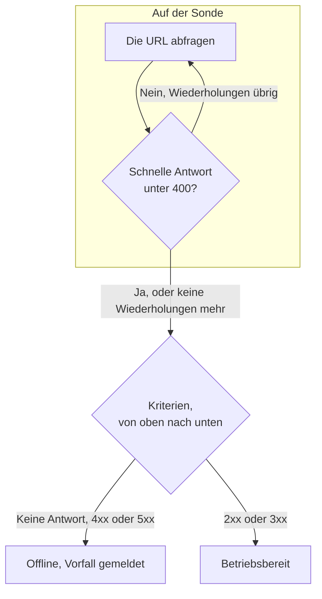

# Website-Überwachung

Ein Website-Monitor prüft, ob eine Webseite antwortet. Bei jeder Prüfung fragt eine Sonde die URL der Seite ab, und der Monitor geht offline und meldet einen Vorfall, wenn die Seite nicht oder mit einem Fehler antwortet. Um einen Endpunkt mit einer Methode, Headern oder einem Body aufzurufen, verwenden Sie stattdessen einen [API-Monitor](/docs/monitor/api-monitor).

:::cards
- [Den Monitor erstellen](#einen-website-monitor-erstellen): Sechs Schritte im Dashboard.
- [Konfigurationsoptionen](#konfigurationsoptionen): URL-Platzhalter, Weiterleitungen, Zertifikate, Zeitlimits und Wiederholungen.
- [Überwachungskriterien](#überwachungskriterien): Was ab Werk als erreichbar oder ausgefallen zählt.
- [Fehlerbehebung](#fehlerbehebung): Wenn der Monitor und Ihr Browser sich widersprechen.
:::

## So funktioniert es

Bei jeder Prüfung fragt eine Sonde die URL ab, folgt Weiterleitungen und hält fest, was zurückkam: den Statuscode, die Antwortzeit, die Header und, wenn ein Kriterium ihn braucht, den Body. Eine Anfrage, die fehlschlägt, in ein Zeitlimit läuft, mit einem Status `4xx` oder `5xx` antwortet oder länger als 10 Sekunden dauert, wird erneut versucht, bis zur Zahl der Wiederholungen, die Sie zulassen. Danach prüft OneUptime das Ergebnis anhand der Kriterien des Monitors.



Wenn keines der Kriterien des Monitors den Antworttext liest (ein Filter **Antworttext** oder **JavaScript Expression**), sendet die Sonde statt eines `GET` eine Anfrage `HEAD` und wiederholt sie als `GET`, wenn der Server `HEAD` ablehnt. In den Zugriffsprotokollen Ihres Servers kann beides auftauchen.

Eine Sonde, die ihre eigene Netzwerkverbindung verloren hat, meldet kein Ergebnis und kann Ihre Website daher nicht als offline markieren.

## Bevor Sie beginnen

- **Eine Rolle, die Monitore erstellen darf**: Project Owner, Project Admin, Project Member, Monitor Admin oder Monitor Member oder eine benutzerdefinierte Rolle mit der Berechtigung Create Monitor.
- **Eine Sonde, die die Website erreicht.** Die Standardsonden Ihres Projekts werden für jeden neuen Monitor ausgewählt. Steht eine Firewall vor der Website, lassen Sie die [Sonden-IP-Adressen von OneUptime Cloud](/docs/configuration/ip-addresses) zu. Eine Website in einem privaten Netzwerk braucht eine [benutzerdefinierte Sonde](/docs/probe/custom-probe) in diesem Netzwerk, die private Adressen erreichen darf: siehe [Zugriff auf private Netzwerke](/docs/self-hosted/private-network-access).

## Einen Website-Monitor erstellen

:::steps
### Einen neuen Monitor beginnen

Gehen Sie zu **Monitore** und klicken Sie auf **Monitor erstellen**. Wählen Sie unter **Monitortyp** den Typ **Website**.

### Ihn benennen

Geben Sie einen **Name** ein, etwa `Marketing site`, und klicken Sie dann auf **Weiter**.

### Die URL eingeben

Geben Sie unter **Website-URL** die vollständige Adresse der Seite ein, einschließlich `https://`, etwa `https://example.com`. Um Weiterleitungen, Zertifikate, das Zeitlimit oder Wiederholungen zu ändern, öffnen Sie darunter **Weitere Felder** (siehe [Konfigurationsoptionen](#konfigurationsoptionen)).

### Ihn testen

Klicken Sie auf **Monitor testen**, wählen Sie unter **Sonde auswählen** eine Sonde und klicken Sie auf **Test ausführen**. **Überwachungs-Testergebnis** zeigt, was die Sonde zurückbekommen hat.

### Die Kriterien prüfen

**Monitor-Kriterien** beginnt mit den [Standardkriterien](#standardkriterien): offline, wenn die Website nicht oder mit einem Fehler antwortet, online bei jedem Status `2xx` oder `3xx`. Ändern Sie sie bei Bedarf und klicken Sie dann auf **Weiter**.

### Sonden wählen und erstellen

Behalten oder ändern Sie die **Sonden** und das **Überwachungsintervall** (es beginnt bei **Alle 5 Minuten**) und klicken Sie dann auf **Monitor erstellen**. Die Seite des Monitors öffnet sich.
:::

## Konfigurationsoptionen

### Website-URL

Die zu prüfende Seite, als vollständige URL mit Schema: `https://example.com`, `https://example.com/pricing` oder `http://example.com:8080/health`. Sie können ein [Monitor-Geheimnis](/docs/monitor/monitor-secrets) als `{{monitorSecrets.NAME}}` in die URL setzen, zum Beispiel ein Token in der Abfragezeichenfolge.

### Dynamische URL-Platzhalter

Steht ein CDN oder ein Caching-Proxy vor der Website, kann eine Sonde aus dem Cache statt von Ihrem Server beantwortet werden. Um am Cache vorbeizukommen, fügen Sie der URL einen Platzhalter hinzu; die Sonde ersetzt ihn bei jeder Prüfung durch einen neuen Wert.

| Platzhalter | Ersetzt durch | Beispielwert |
| --- | --- | --- |
| `{{timestamp}}` | Die aktuelle Unix-Zeit in Sekunden | `1719500000` |
| `{{random}}` | Eine zufällige, eindeutige Zeichenkette aus 32 Hexadezimalzeichen | `3f2b8c1d9e7a4b6c8d0e1f2a3b4c5d6e` |

Eine URL mit einem Platzhalter:

```text
https://example.com/health?cb={{timestamp}}
```

Was die Sonde bei zwei Prüfungen im Abstand von fünf Minuten abfragt:

```text
https://example.com/health?cb=1719500000
https://example.com/health?cb=1719500300
```

Verwenden Sie `{{random}}` auf dieselbe Weise: `https://example.com/health?nocache={{random}}`.

### Weitere Felder

Diese Einstellungen sind unter **Weitere Felder** unterhalb der URL eingeklappt. Die eingeklappte Kopfzeile nennt sie und zeigt, welche Sie geändert haben.

| Feld | Standard | Was es tut |
| --- | --- | --- |
| **Weiterleitungen nicht folgen** | Aus | Die erste Antwort beurteilen, statt Weiterleitungen zu folgen. Siehe [unten](#weiterleitungen-nicht-folgen). |
| **Selbstsignierte Zertifikate zulassen** | Aus | Die Prüfung des TLS-Zertifikats für den eigenen Hostnamen des Monitors überspringen. |
| **Client-Zertifikat verwenden (mTLS)** | Aus | Ein Client-Zertifikat und einen privaten Schlüssel vorlegen. Siehe [Client-Zertifikat (mTLS)](#client-zertifikat-mtls). |
| **Anfrage-Zeitlimit (Sekunden)** | `60` | Wie lange auf jeden Versuch gewartet wird. Das Maximum sind 60 Sekunden. |
| **Wiederholungen bei Fehlschlag** | Standard der Sonde, meist `3` | Wie oft ein fehlgeschlagener Versuch wiederholt wird. Das Maximum ist 3. Siehe [Wiederholungen und Zeitlimits](#wiederholungen-und-zeitlimits). |

#### Weiterleitungen nicht folgen

Standardmäßig folgt die Sonde Weiterleitungen (`301`, `302`, `303`, `307` und `308`), bis zu 10 davon, und beurteilt die Seite, auf der sie landet. Schalten Sie **Weiterleitungen nicht folgen** ein, um stattdessen die Weiterleitungsantwort selbst zu beurteilen, etwa um zu prüfen, dass `http://` auf `https://` weiterleitet. Die [Standardkriterien](#standardkriterien) werten eine Weiterleitungsantwort als online.

**Selbstsignierte Zertifikate zulassen** folgt Weiterleitungen, die auf dem eigenen Hostnamen des Monitors bleiben. Eine Weiterleitung zu einem anderen Hostnamen wird wie gewohnt geprüft.

#### Client-Zertifikat (mTLS)

Verlangt die Website gegenseitiges TLS, schalten Sie **Client-Zertifikat verwenden (mTLS)** ein und füllen Sie aus:

| Feld | Was eingetragen wird |
| --- | --- |
| **Client-Zertifikat (PEM)** | Das PEM-kodierte Client-Zertifikat, das vorgelegt wird. |
| **Privater Client-Schlüssel (PEM)** | Der passende PEM-kodierte private Schlüssel. |
| **Passphrase des privaten Client-Schlüssels** | Optional. Die Passphrase, nur wenn der private Schlüssel verschlüsselt ist. |

Das entspricht den Optionen `--cert` und `--key` von curl:

```bash
curl --cert client.crt --key client.key https://example.com/health
```

Um den Schlüssel aus den Einstellungen des Monitors herauszuhalten, speichern Sie Zertifikat und Schlüssel als [Monitor-Geheimnisse](/docs/monitor/monitor-secrets) und tragen Sie in diese Felder `{{monitorSecrets.NAME}}` ein. Geheimnisse werden auf dem Server eingesetzt, und ihre Werte erscheinen nie im Dashboard.

Das Client-Zertifikat wird nur vorgelegt, solange die Anfrage beim Ursprung der Monitor-URL bleibt (dasselbe Schema, derselbe Host und derselbe Port). Nach einer Weiterleitung zu einem anderen Ursprung macht die Sonde ohne es weiter.

#### Wiederholungen und Zeitlimits

**Wiederholungen bei Fehlschlag** zählt die Wiederholungen _nach_ dem ersten Versuch, also führt `0` die Prüfung einmal aus und `2` bis zu dreimal. Bleibt das Feld leer, gilt der Standard der Sonde: 3, sofern `PROBE_MONITOR_RETRY_LIMIT` der Sonde nichts anderes sagt. Die Sonde wartet zwischen den Versuchen eine Sekunde, und jeder Versuch bekommt das volle **Anfrage-Zeitlimit (Sekunden)**.

Diese Fehler werden wiederholt: Verbindungsfehler, Zeitüberschreitungen, Antworten `4xx` und `5xx` sowie Antworten, die langsamer als 10 Sekunden sind. Diese nicht, weil ein neuer Versuch nichts an ihnen ändert: eine ungültige oder gesperrte URL, mehr als 10 Weiterleitungen und eine Antwort größer als 512 KiB.

## Überwachungskriterien

Kriterien entscheiden, wann die Website als online, beeinträchtigt oder offline gilt und ob dabei ein Vorfall gemeldet oder eine Warnung erstellt wird. Jedes Kriterium prüft einen oder mehrere Filter:

| Filter | Bedingungen | Was er prüft |
| --- | --- | --- |
| **Is Online** | **Wahr**, **Falsch** | Ob die Website überhaupt geantwortet hat, egal mit welchem Statuscode. |
| **Antwort-Statuscode** | **Equal To**, **Not Equal To**, **Greater Than**, **Less Than**, **Greater Than Or Equal To**, **Less Than Or Equal To** | Den HTTP-Statuscode. |
| **Antwortzeit (in ms)** | **Greater Than**, **Less Than**, **Greater Than Or Equal To**, **Less Than Or Equal To** | Wie lange die Anfrage gedauert hat, Weiterleitungen eingeschlossen. |
| **Antworttext** | **Enthält**, **Not Contains** | Text im Antworttext. Groß- und Kleinschreibung wird unterschieden. |
| **Response Header** | **Enthält**, **Not Contains** | Ob die Antwort einen Header mit diesem Namen hat. Geben Sie den Namen kleingeschrieben ein, etwa `x-cache`. |
| **Response Header Value** | **Enthält**, **Not Contains** | Ob ein Header genau diesen Wert hat, kleingeschrieben verglichen, etwa `no-store`. |
| **JavaScript Expression** | **Evaluates To True** | Ein Ausdruck über die Antwort. Siehe [JavaScript-Ausdrücke](/docs/monitor/javascript-expression). |
| **Is Request Timeout** | **Wahr**, **Falsch** | Ob die Anfrage bei jedem Versuch in ein Zeitlimit gelaufen ist. |

**Kriterien hinzufügen** fügt ein Kriterium hinzu, das bereits nach seinem Filter benannt ist, zum Beispiel _Response Time (in ms) is above 3000_. Der Name ändert sich mit den Filtern, bis Sie einen eigenen eingeben. Eine Beschreibung ist optional: Um eine hinzuzufügen, öffnen Sie die **Einstellungen** des Kriteriums.

Bei zwei oder mehr Filtern entscheidet **Abgleichsbedingung**, ob **Alle** zutreffen müssen oder **Beliebig** einer genügt. Die **Aktionen** eines Kriteriums legen fest, was es tut: den Monitorstatus ändern, eine Warnung erstellen, einen Vorfall melden oder mehreres davon.

### Standardkriterien

Ein neuer Website-Monitor beginnt mit zwei Kriterien, sodass er ohne Änderungen funktioniert:

- **Offline** — die Website antwortet nicht oder mit einem Statuscode ab `400` (oder unter `200`). Der Monitor wird als **Offline** markiert und ein Vorfall wird erstellt. Der Vorfall löst sich von selbst auf, wenn die Website wieder da ist.
- **Online** — die Website antwortet mit einem beliebigen Statuscode `2xx` oder `3xx`, etwa `200`, `204` oder `301`. Der Monitor wird als **Betriebsbereit** markiert.

In der Liste der Kriterien sind sie nach dem Monitor benannt: _Check if (name) is offline_ und _Check if (name) is online_.

Eine Seite, die `204 No Content` antwortet, oder eine Weiterleitung, die Sie mit eingeschaltetem **Weiterleitungen nicht folgen** beobachten, zählt also als erreichbar. Wenn für Sie nur ein Statuscode gesund bedeutet, ändern Sie beide Kriterien auf der Seite **Konfiguration → Kriterien** des Monitors: zum Beispiel **Antwort-Statuscode** / **Equal To** / `200` im Online-Kriterium und **Not Equal To** / `200` im Offline-Kriterium, anstelle der beiden Statuscode-Filter, die jedes hat.

Kriterien werden von oben nach unten geprüft, und das erste zutreffende entscheidet, was passiert.

Trifft keines zu, fällt der Monitor auf seinen Standardstatus zurück: **Betriebsbereit**, sofern Sie unter **Weitere Felder** unterhalb der Kriterien keinen anderen wählen. Die eingeklappte Kopfzeile von **Weitere Felder** zeigt, welcher Status das ist.

Monitore, die erstellt wurden, bevor OneUptime diese Standards geändert hat, behalten die Kriterien, mit denen sie erstellt wurden, und werten nur `200` als online. Über die API oder Terraform erstellte Monitore verwenden die Kriterien, die Sie senden.

### Über einen Zeitraum auswerten

**Diese Kriterien über einen Zeitraum hinweg auswerten** ist ein Kontrollkästchen unter einem Filter, angeboten für **Is Online**, **Antwort-Statuscode** und **Antwortzeit (in ms)**. Schalten Sie es ein, um ein Fenster vergangener Prüfungen statt nur der letzten zu beurteilen: Wählen Sie unter **Auswerten** eine Aggregation und unter **Für die letzten (in Minuten)** ein Fenster von 2 bis 60 Minuten.

| Aggregation | Trifft zu, wenn |
| --- | --- |
| **Durchschnitt**, **Summe**, **Maximum Value**, **Minimum Value** | Dieser Wert über das Fenster die Bedingung erfüllt. Nur für numerische Filter. |
| **All Values** | Jede Prüfung im Fenster die Bedingung erfüllt. |
| **Any Value** | Mindestens eine Prüfung im Fenster die Bedingung erfüllt. |

**All Values** trifft erst zu, wenn das Fenster wirklich mit Daten gefüllt ist. Ein gerade erstellter Monitor oder einer, dessen Prüfungen nicht mehr aufgezeichnet wurden, hat nicht genug Verlauf, um etwas über die letzten N Minuten zu sagen, daher wartet das Kriterium, statt auf dem einen vorhandenen Messwert anzuschlagen. **Any Value** ist die Einstellung für „sag mir sofort, wenn eine einzige Prüfung den Grenzwert verletzt“ und schlägt weiterhin sofort an.

**Bei keinen Daten** entscheidet, was passiert, solange das Fenster das Kriterium nicht stützen kann:

| Option | Was passiert | Wofür |
| --- | --- | --- |
| **Ignore** (Standard) | Das Kriterium trifft nicht zu. | Gewöhnliche Schwellenwert-Warnungen. |
| **Auslöser** | Die fehlenden Daten zählen als das Problem. | Prüfungen, bei denen Stille selbst ein Fehler ist. |
| **Treat As Zero** | Das Fenster wird als einzelne Null verglichen. | Zähler, bei denen keine Ereignisse wirklich null bedeutet. |

### Beispielkriterien

| Ziel | Filter | Bedingung | Wert |
| --- | --- | --- | --- |
| Die Website als beeinträchtigt markieren, wenn sie langsam ist | **Antwortzeit (in ms)** | **Greater Than** | `3000` |
| Eine Fehlerseite erkennen, die mit `200` ausgeliefert wird | **Antworttext** | **Not Contains** | `Welcome` |
| Prüfen, ob ein CDN-Header vorhanden ist | **Response Header** | **Enthält** | `x-cache` |
| Nur `200` als gesund akzeptieren | **Antwort-Statuscode** | **Equal To** | `200` |

## Fehlerbehebung

:::details Der Monitor ist offline, aber die Website lädt in meinem Browser
Die Sonde hat eine andere Antwort bekommen als Ihr Browser. Die Ursache des Vorfalls und **Überwachungsprotokolle** am Monitor zeigen, was die Sonde gesehen hat. Häufige Ursachen:

- Eine Firewall oder ein Bot-Filter blockiert die Sonden. Lassen Sie die [Sonden-IP-Adressen von OneUptime Cloud](/docs/configuration/ip-addresses) zu.
- Die Website ist nur in Ihrem Netzwerk erreichbar. Verwenden Sie eine [benutzerdefinierte Sonde](/docs/probe/custom-probe) darin.
- Das Zertifikat ist selbstsigniert oder stammt von einer privaten Zertifizierungsstelle. Schalten Sie **Selbstsignierte Zertifikate zulassen** ein, oder überwachen Sie das Zertifikat eigens mit einem [SSL-Zertifikat-Monitor](/docs/monitor/ssl-certificate-monitor).
:::

:::details Die Prüfung schlägt fehl mit „Remote response exceeded the allowed size.“
Die Sonde liest höchstens 512 KiB einer Antwort, und diese Seite ist größer. Richten Sie den Monitor auf eine kleinere Seite, etwa einen Health-Endpunkt, oder entfernen Sie die Filter **Antworttext** und **JavaScript Expression**, damit die Sonde nur die Header braucht.
:::

:::details Die Prüfung schlägt fehl mit „Monitor target exceeded 10 redirects.“
Die URL leitet mehr als 10-mal weiter, meist in einer Schleife. Öffnen Sie die URL mit `curl -IL`, um die Kette zu sehen, und richten Sie den Monitor auf die Seite, auf der die Kette enden sollte.
:::

:::details Die Prüfung schlägt fehl mit einer Meldung über eine private Netzwerkadresse
Die URL löst sich in eine private Adresse auf, und die Sonde, die die Prüfung ausgeführt hat, darf keine privaten Adressen erreichen. Schalten Sie das auf einer selbst gehosteten Sonde mit `PROBE_ALLOW_PRIVATE_NETWORK_MONITORS` ein: siehe [Zugriff auf private Netzwerke](/docs/self-hosted/private-network-access).
:::

## Nächste Schritte

:::cards
- [API-Überwachung](/docs/monitor/api-monitor): Einen Endpunkt mit Methode, Headern und Body aufrufen.
- [SSL-Zertifikat-Überwachung](/docs/monitor/ssl-certificate-monitor): Gewarnt werden, bevor das Zertifikat der Website abläuft.
- [Überwachungs-Geheimnisse](/docs/monitor/monitor-secrets): Tokens und Schlüssel aus den Monitoreinstellungen heraushalten.
- [Vorfälle](/docs/incidents/index): Was passiert, nachdem der Monitor einen gemeldet hat.
:::
