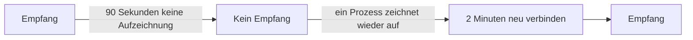

# Wenn OneUptime keine Daten empfängt

Während OneUptime neu startet, aktualisiert wird oder einen Rückstand abarbeitet, erreicht nichts von dem, was Ihre Agents, Collectors, Sonden und Heartbeat-Sender schicken, Ihre Monitore. OneUptime zeichnet auf, wann das geschieht, und lastet diese Zeit nie einem Server, einem Host oder einer anderen Ressource an: Die Zeit wurde nicht überwacht, also ist sie keine Ausfallzeit.

## So funktioniert es

Jeder OneUptime-Prozess, der Daten entgegennimmt, zeichnet alle 30 Sekunden auf, dass er empfängt, solange er die Datenbanken erreicht, in denen er Daten ablegt. OneUptime lässt drei Arten von Zeit außen vor:

- Kein Empfang: Kein Prozess hat länger als 90 Sekunden etwas aufgezeichnet. OneUptime war gestoppt, startete neu, wurde aktualisiert oder erreichte eine seiner Datenbanken nicht.
- Neu verbinden: die ersten 2 Minuten, nachdem OneUptime wieder empfängt, während sich Agents neu verbinden und senden, was sie zurückgehalten haben.
- Aufholen: Solange die Warteschlange der noch zu verarbeitenden Daten mehr als eine Minute im Rückstand ist, die Zeit seit den ältesten Daten, die noch darin warten.



Ein Neustart, der weniger als 90 Sekunden dauert, ist keine Lücke: Collectors senden erneut, was sie nicht zustellen konnten.

## Was sich in dieser Zeit ändert

| Wo | Was OneUptime tut |
| --- | --- |
| Server- / VM-Monitore | **Is Online** zählt nur die Minuten, in denen OneUptime empfing: Standardmäßig ist ein Server nach 3 Minuten Stille offline, die OneUptime hätte hören können. |
| Monitore für eingehende Anfragen und eingehende E-Mails | **Recieved In Minutes** und **Not Recieved In Minutes** zählen nur die Minuten, in denen OneUptime empfing. Ist ein solches Kriterium erfüllt, nennt seine Begründung, wie viele der Minuten außen vor blieben. |
| Host-, Kubernetes-, Docker-, Metrik-, Log- und Trace-Monitore und die anderen Monitore, die Telemetrie lesen | Eine Prüfung, deren Zeitfenster Zeit ohne Empfang enthält, wartet, bis diese Zeit das Fenster verlassen hat, und nie länger als 15 Minuten nach ihrem Ende. Bis dahin ändert sich nichts: kein Statuswechsel, und kein Vorfall und keine Warnung wird eröffnet oder aufgelöst. Solange die Warteschlange im Rückstand ist, liest eine Prüfung bis dorthin, wo die Warteschlange steht, statt bis jetzt. |
| Hosts, Cluster und der Rest des Inventars | Eine Ressource wird erst als **Getrennt** markiert, wenn ihre Stilleschwelle, bei den meisten 15 Minuten, verstrichen ist, während OneUptime empfing. |
| Sonden und KI-Agenten | Werden nach 3 Minuten Stille, während OneUptime empfing, als **Getrennt** markiert. |
| **Verfügbarkeit**-Diagramme von Hosts, Docker- und Podman-Hosts und Kubernetes-Clustern | Die Zeit wird als **Nicht überwacht** schattiert, und die Linie bricht dort ab, statt auf ausgefallen zu fallen. Das Uptime-Abzeichen lässt diese Zeit außen vor; ein Intervall mit Daten zählt weiterhin als verfügbar. |
| Uptime auf Statusseiten und SLOs | Beide werden aus Monitorstatus berechnet: ohne falschen Statuswechsel keine falsche Ausfallzeit. |

> [!NOTE]
> Zeit außen vor zu lassen heißt nicht, sie aufzufüllen. Eine Ressource wird nie als verfügbar angezeigt für Zeit, in der OneUptime sie nicht hören konnte: Diese Zeit wird schlicht nicht bewertet. Sobald OneUptime wieder empfängt, wird eine Ressource, die wirklich ausgefallen ist, ab dann danach bewertet, was sie sendet oder nicht sendet.

## Selbst gehostete Installationen

### Beim Start

Während ein OneUptime-Prozess startet, beantwortet er jede Anfrage außer seinen Statusprüfungen mit `503 Service Unavailable` und `Retry-After: 5`, und ein Browser erhält eine Seite, die sich selbst neu lädt. OpenTelemetry-Collectors und -SDKs senden eine solche Anfrage erneut, statt die Daten zu verwerfen. `/status/ready` schlägt fehl, bis der Prozess bereit ist, sodass Kubernetes ihm vorher keinen Datenverkehr schickt.

### Worker-Replikate

Ein Prozess zeichnet nur dann auf, dass OneUptime empfängt, wenn eingehender Datenverkehr ihn erreichen kann. Wenn Sie Replikate betreiben, die nur Warteschlangen abarbeiten und vor denen kein Ingress steht, setzen Sie dort `RECEIVES_INGRESS_TRAFFIC` auf `false`. Sonst zeichnen sie weiter auf, während alle Replikate ausgefallen sind, die Datenverkehr annehmen, und dieser Ausfall zählt wieder gegen Ihre Ressourcen. Das Helm-Chart setzt den Wert bereits auf seinen Worker-Pods, und ein einzelner OneUptime-Container braucht nichts.

```yaml title="Worker-Container"
env:
  - name: RECEIVES_INGRESS_TRAFFIC
    value: "false"
```

### Was aufgezeichnet wird

OneUptime beginnt mit dieser Aufzeichnung, wenn Sie auf eine Version aktualisieren, die sie enthält; Zeit davor wird bewertet wie immer. Solange kein Prozess aufzeichnet, dass er empfängt, gilt die Zeit seit der letzten Aufzeichnung höchstens eine Stunde lang als Lücke; danach zählt Stille wieder, sodass eine Aufzeichnung, die nicht mehr geschrieben wird, einen Ausfall Ihrer Ressourcen nicht lange verbergen kann. Aufzeichnungen werden 400 Tage aufbewahrt, und wenn OneUptime sie nicht lesen kann, bewertet es Stille so, als hätte es durchgehend empfangen.

## Nächste Schritte

:::cards
- [Host-Überwachung](/docs/monitor/host-monitor): Bei den Metriken eines Hosts alarmieren.
- [Server- / VM-Überwachung](/docs/monitor/server-monitor): Erfahren, wenn der Agent eines Servers nicht mehr berichtet.
- [Eingehende-Anfrage-Überwachung](/docs/monitor/incoming-request-monitor): Einen Heartbeat in einen Totmannschalter verwandeln.
- [Aktualisierung](/docs/installation/upgrading): Eine selbst gehostete Installation aktualisieren.
:::
