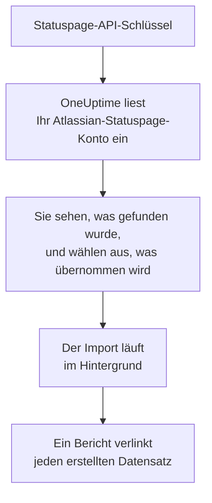

# Wechsel von Atlassian Statuspage

**Aus einem anderen Tool importieren** holt Ihre Seiten aus Atlassian Statuspage in wenigen Minuten in OneUptime. Mit einem Statuspage-API-Schlüssel liest OneUptime Ihre Seiten, ihre Komponenten und Gruppen sowie ihre E-Mail-Abonnenten ein, zeigt Ihnen, was es gefunden hat, und erstellt, was Sie auswählen. In Statuspage ändert sich nichts.

:::cards
- [Konto importieren](#ihr-atlassian-statuspage-konto-importieren): Schlüssel erstellen, Konto einlesen und auswählen, was übernommen wird.
- [Was übernommen wird](#was-übernommen-wird): Wie aus jeder Seite, Komponente und jedem Abonnenten von Statuspage einer in OneUptime wird.
- [Den Wechsel abschließen](#den-wechsel-abschließen): Was nach dem Import zu tun ist.
:::

## So funktioniert es

- **Der Schlüssel wird einmal verwendet.** Er wird verschlüsselt aufbewahrt, solange OneUptime Ihr Konto einliest, und gelöscht, sobald das Einlesen endet, ob es funktioniert hat oder nicht. Er wird nie wieder angezeigt und nie in ein Protokoll geschrieben.
- **OneUptime liest nur.** Es ruft ausschließlich die API von Atlassian Statuspage auf: `api.statuspage.io`. Es stellt eine Anfrage pro Sekunde, so viele, wie Statuspage einem Schlüssel erlaubt. Wenn Atlassian Statuspage um eine Pause bittet, wartet es und versucht es erneut.
- **Nichts wird erstellt, bevor Sie den Import starten.** Die Vorschau zeigt für jedes Element, ob es neu ist, bereits in OneUptime ist (und unverändert verwendet wird), von einem früheren Import übernommen wurde oder warum es nicht übernommen werden kann.
- **Ein erneuter Import erstellt nie etwas doppelt.** OneUptime merkt sich anhand der Atlassian-Statuspage-ID, was jeder Import übernommen hat. Führen Sie den Import erneut aus, nachdem Sie in Atlassian Statuspage Seiten oder Komponenten hinzugefügt haben, und nur die neuen werden erstellt.

## Bevor Sie beginnen

- **Ein OneUptime-Projekt und das Recht, das Übernommene zu erstellen.** Projektinhaber und Projektadmins können alles übernehmen. Andere Rollen können ebenfalls importieren und übernehmen die Arten von Datensätzen, die sie erstellen dürfen. Alles andere wird mit Begründung als nicht übernommen angezeigt.
- **Ein Statuspage-API-Schlüssel.** Nur ein Kontoinhaber kann einen erstellen. Der Import schreibt nie in Statuspage und liest jede Seite, die der Schlüssel sehen kann.
- **Platz für Ihre Seiten, in OneUptime Cloud.** Ihr Tarif hat Platz für eine bestimmte Zahl von Statusseiten und Abonnenten. Was nicht passt, wird als nicht übernommen angezeigt. Die Komponenten werden zu manuellen Monitoren, die kostenlos sind.

## Ihr Atlassian-Statuspage-Konto importieren

:::steps
### Einen API-Schlüssel in Statuspage erstellen
Wählen Sie in Statuspage unten links Ihren Avatar und dann **API info**. Wählen Sie **Create key**, nennen Sie ihn `OneUptime import` und kopieren Sie ihn.

### Die Importseite öffnen
Öffnen Sie in OneUptime **Projekteinstellungen** > **Aus einem anderen Tool importieren** und wählen Sie **Atlassian Statuspage**.

### Atlassian Statuspage verbinden
Fügen Sie den Schlüssel in **Atlassian-Statuspage-API-Schlüssel** ein und wählen Sie **Mein Atlassian Statuspage-Konto einlesen**. Ein großes Konto dauert einige Minuten, und Sie können die Seite währenddessen verlassen.

### Auswählen, was übernommen wird
Die Vorschau listet auf, was gefunden wurde, mit einem Abschnitt pro Art. Alles, was erstellt würde, ist anfangs ausgewählt, außer Abonnenten. Unter jedem Element sagt OneUptime, was nicht genau so übernommen wird, wie es war. Wenn eine ausgewählte Statusseite einen Monitor zeigt, den Sie nicht ausgewählt haben, sagt es das, und **Diese auch auswählen** wählt ihn aus. Um Abonnenten zu übernehmen, wählen Sie sie aus und bestätigen Sie darunter, dass sie zugestimmt haben, Ihre Benachrichtigungen zu erhalten, und dass Sie sie übertragen dürfen. Niemand erhält eine E-Mail.

### Den Import starten
Wählen Sie **Import starten**. Der Import läuft im Hintergrund: Sie können die Seite verlassen, und der Bericht wartet dort auf Sie.
:::

Der Bericht zählt, was erstellt und nicht übernommen wurde, und listet jedes Element mit einem Link zu dem Datensatz auf, der daraus wurde, Fehler zuerst. Frühere Importe stehen auf derselben Seite unter **Frühere Importe**.

## Was übernommen wird

| In Atlassian Statuspage | In OneUptime | Wie |
| --- | --- | --- |
| Components | Manuelle Monitore | Jede Komponente wird zu einem manuellen Monitor, den die Statusseite zeigt. Nichts prüft ihn: Sie setzen seinen Status in OneUptime, wie in Statuspage. Eine Komponentengruppe wird zu einer Gruppe auf der Seite. |
| Pages | Statusseiten | Jede Seite wird mit Namen und Beschreibung übernommen, mit ihren Komponenten in ihren Gruppen und mit Verfügbarkeit und Verlauf für die Komponenten, die sie hervorhebt. Eine Seite, die nur bestimmte Personen sehen dürfen, wird privat übernommen. |
| Email subscribers | Statusseiten-Abonnenten | Bestätigte E-Mail-Abonnenten werden übernommen, sobald Sie bestätigen, dass Sie sie übertragen dürfen, und folgen denselben Komponenten. Niemand erhält eine E-Mail, und jede Benachrichtigung von OneUptime enthält einen Link zum Abbestellen. |

Komponenten werden als betriebsbereit übernommen. Die Vorschau nennt jede, die in Statuspage gerade nicht betriebsbereit ist, damit Sie ihren Status nach dem Import setzen können.

## Was nicht übernommen wird

- **Vorfälle, geplante Wartungen und ihr Verlauf.** Ein Vorfall in OneUptime ist ein laufender Datensatz, der Personen alarmiert, daher bleiben vergangene in Statuspage.
- **Abonnenten per SMS, Webhook, Slack oder Microsoft Teams.** Die Vorschau zählt sie. Nur E-Mail-Abonnenten werden übernommen.
- **Vorfallvorlagen und Systemmetriken.** Fügen Sie in OneUptime hinzu, was Sie noch brauchen.
- **Die eigene Domain und das Branding einer Statusseite.** Fügen Sie in OneUptime die Domain unter **Benutzerdefinierte Domains** und das Logo unter **Branding** hinzu.

## Grenzen

Ein Import erstellt höchstens 2.000 Datensätze: höchstens 1.000 Monitore und 50 Statusseiten. Abonnenten zählen nicht dazu: Ein Import übernimmt höchstens 5.000 Abonnenten. Alles über einer Grenze wird als nicht übernommen angezeigt. Führen Sie den Import erneut aus, um den Rest zu übernehmen.

In OneUptime Cloud werden Statusseiten und Abonnenten, für die Ihr Tarif keinen Platz hat, als nicht übernommen angezeigt, mit dem, was sie brauchen.

Eine Vorschau wird einen Tag lang aufbewahrt. Nur die Person, die das Konto eingelesen hat, kann auswählen und den Import starten. Projektinhaber und Projektadmins sehen den Fortschritt und den Bericht jedes Imports.

## Den Wechsel abschließen

:::steps
### Ihre Statusseiten prüfen
Öffnen Sie jede Seite unter **Statusseiten** und vergleichen Sie sie mit der in Statuspage. Jede Komponente ist ein manueller Monitor: Ändern Sie ihren Status in OneUptime, wenn sich etwas ändert.

### Die Adresse Ihrer Statusseite auf OneUptime umstellen
Öffnen Sie die Seite unter **Statusseiten**, fügen Sie Ihre Domain unter **Benutzerdefinierte Domains** hinzu und ändern Sie dann ihren DNS-Eintrag. Danach erreichen Ihre Besucher und Abonnenten die neue Seite.

### Ihre Seite in Atlassian Statuspage abschalten
Sobald Ihre Domain auf OneUptime zeigt, schließen Sie die Seite in Statuspage, damit ihre Abonnenten nicht doppelt benachrichtigt werden.
:::

## Fehlerbehebung

:::details Atlassian Statuspage hat den API-Schlüssel nicht akzeptiert
Prüfen Sie, ob Sie den ganzen Schlüssel kopiert haben und ob ein Kontoinhaber ihn unter **API info** erstellt hat. Ein Schlüssel gehört zu einer Statuspage-Organisation und liest nur deren Seiten. Wählen Sie dann **Erneut versuchen**.
:::

:::details Die Abonnenten können nicht übernommen werden
Wählen Sie das Kästchen darunter aus, das bestätigt, dass sie Ihren Benachrichtigungen zugestimmt haben und dass Sie sie übertragen dürfen: **Import starten** wartet darauf. Abonnenten, die ihr Abonnement in Statuspage nie bestätigt haben, bleiben dort.
:::

:::details Einige Elemente können nicht ausgewählt werden
Bei jedem steht, warum: ein Name, den das Projekt schon hat, etwas, das ein früherer Import übernommen hat, oder ein Datensatz, den Sie nicht erstellen dürfen oder den Ihr Tarif nicht enthält.
:::

## Nächste Schritte

:::cards
- [Statusseiten – Übersicht](/docs/status-pages/index): Was eine Statusseite zeigt und wer sie sehen kann.
- [Abonnenten & Ankündigungen](/docs/status-pages/subscribers): Wie Abonnenten von Vorfällen erfahren.
- [Manuelle Überwachung](/docs/monitor/manual-monitor): Ein Monitor, dessen Status Sie selbst setzen.
:::
