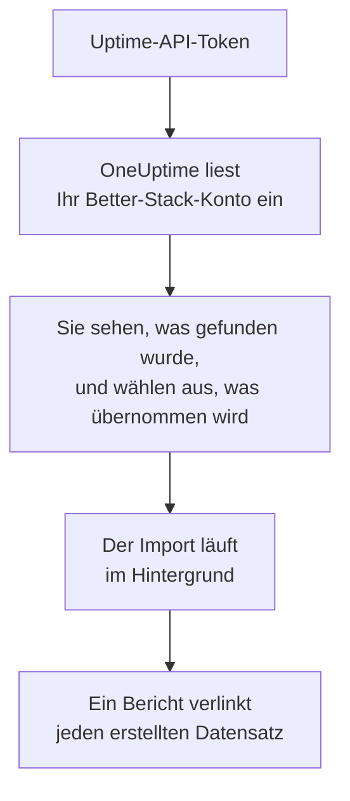

# Wechsel von Better Stack

**Aus einem anderen Tool importieren** holt Ihre Uptime-Monitore, Heartbeats und Statusseiten aus Better Stack in wenigen Minuten in OneUptime. Mit einem Uptime-API-Token von Better Stack liest OneUptime Ihre Monitore, Heartbeats, Statusseiten und deren E-Mail-Abonnenten ein, zeigt Ihnen, was es gefunden hat, und erstellt, was Sie auswählen. In Better Stack ändert sich nichts.

:::cards
- [Konto importieren](#ihr-better-stack-konto-importieren): Token erstellen, Konto einlesen und auswählen, was übernommen wird.
- [Was übernommen wird](#was-übernommen-wird): Wie aus jedem Monitor, Heartbeat und jeder Statusseite von Better Stack einer in OneUptime wird.
- [Den Wechsel abschließen](#den-wechsel-abschließen): Was nach dem Import zu tun ist.
:::

## So funktioniert es

- **Der Schlüssel wird einmal verwendet.** Er wird verschlüsselt aufbewahrt, solange OneUptime Ihr Konto einliest, und gelöscht, sobald das Einlesen endet, ob es funktioniert hat oder nicht. Er wird nie wieder angezeigt und nie in ein Protokoll geschrieben.
- **OneUptime liest nur.** Es ruft ausschließlich die API von Better Stack auf: `incidents.betterstack.com`. Wenn Better Stack um eine Pause bittet, wartet es und versucht es erneut.
- **Nichts wird erstellt, bevor Sie den Import starten.** Die Vorschau zeigt für jedes Element, ob es neu ist, bereits in OneUptime ist (und unverändert verwendet wird), von einem früheren Import übernommen wurde oder warum es nicht übernommen werden kann.
- **Ein erneuter Import erstellt nie etwas doppelt.** OneUptime merkt sich anhand der Better-Stack-ID, was jeder Import übernommen hat. Führen Sie den Import erneut aus, nachdem Sie in Better Stack Monitore oder Heartbeats hinzugefügt haben, und nur die neuen werden erstellt.

## Bevor Sie beginnen

- **Ein OneUptime-Projekt und das Recht, das Übernommene zu erstellen.** Projektinhaber und Projektadmins können alles übernehmen. Andere Rollen können ebenfalls importieren und übernehmen die Arten von Datensätzen, die sie erstellen dürfen. Alles andere wird mit Begründung als nicht übernommen angezeigt.
- **Ein Uptime-API-Token von Better Stack.** Verwenden Sie ein teambasiertes Uptime-Token: Es liest die Monitore, Heartbeats und Statusseiten dieses Teams. Der Import schreibt nie in Better Stack.
- **Eine Zahlungsmethode, in OneUptime Cloud.** Monitore, die Prüfungen ausführen, werden nach Nutzung abgerechnet, auch im Free-Tarif. Fügen Sie daher vor dem Import unter **Projekteinstellungen** > **Abrechnung** eine hinzu. Ohne sie werden diese Monitore als nicht übernommen angezeigt.

## Ihr Better-Stack-Konto importieren

:::steps
### Ein API-Token in Better Stack erstellen
Öffnen Sie in Better Stack **API tokens** > **Team-based tokens** und wählen Sie Ihr Team. Erstellen Sie unter **Uptime API tokens** ein Token namens `OneUptime import` und kopieren Sie es.

### Die Importseite öffnen
Öffnen Sie in OneUptime **Projekteinstellungen** > **Aus einem anderen Tool importieren** und wählen Sie **Better Stack**.

### Better Stack verbinden
Fügen Sie das Token in **Better-Stack-API-Schlüssel** ein und wählen Sie **Mein Better Stack-Konto einlesen**. Ein großes Konto dauert einige Minuten, und Sie können die Seite währenddessen verlassen.

### Auswählen, was übernommen wird
Die Vorschau listet auf, was gefunden wurde, mit einem Abschnitt pro Art. Alles, was erstellt würde, ist anfangs ausgewählt, außer pausierten Monitoren, die pausiert übernommen werden, wenn Sie sie auswählen, und Abonnenten. Unter jedem Element sagt OneUptime, was nicht genau so übernommen wird, wie es war. Wenn eine ausgewählte Statusseite einen Monitor zeigt, den Sie nicht ausgewählt haben, sagt es das, und **Diese auch auswählen** wählt ihn aus. Um Abonnenten zu übernehmen, wählen Sie sie aus und bestätigen Sie darunter, dass sie zugestimmt haben, Ihre Benachrichtigungen zu erhalten, und dass Sie sie übertragen dürfen. Niemand erhält eine E-Mail.

### Den Import starten
Wählen Sie **Import starten**. Der Import läuft im Hintergrund: Sie können die Seite verlassen, und der Bericht wartet dort auf Sie.
:::

Der Bericht zählt, was erstellt und nicht übernommen wurde, und listet jedes Element mit einem Link zu dem Datensatz auf, der daraus wurde, Fehler zuerst. Frühere Importe stehen auf derselben Seite unter **Frühere Importe**.

## Was übernommen wird

| In Better Stack | In OneUptime | Wie |
| --- | --- | --- |
| Monitors and heartbeats | Monitore | Jeder Monitor wird zu einem Monitor derselben Art, mit derselben Adresse, demselben Intervall und Timeout. Jeder Heartbeat wird zu einem Monitor für eingehende Anfragen. |
| Status pages | Statusseiten | Jede Seite wird mit ihren Abschnitten als Gruppen und den Monitoren und Heartbeats übernommen, die sie zeigt. Ein Element, das Sie von Hand pflegen, wird zu einem manuellen Monitor. Eine Seite mit Passwort oder IP-Allowlist wird privat übernommen. |
| Email subscribers | Statusseiten-Abonnenten | Bestätigte E-Mail-Abonnenten werden übernommen, sobald Sie bestätigen, dass Sie sie übertragen dürfen, und folgen denselben Ressourcen. Niemand erhält eine E-Mail, und jede Benachrichtigung von OneUptime enthält einen Link zum Abbestellen. |

- **Status-, Expected-Status-Code-, Keyword- und Keyword-Absence-Monitore** werden zu Website-Monitoren, oder zu API-Monitoren, wenn sie eine andere Methode, Header oder einen JSON-Body senden. Ein Status-Monitor ist bei jeder 2xx-Antwort verfügbar, ein Expected-Status-Code-Monitor bei den Codes, die er nennt.
- **Ping- und TCP-Monitore** werden zu Ping- und Port-Monitoren. **SMTP-, POP- und IMAP-Monitore** werden zu Port-Monitoren auf ihrem Port: OneUptime prüft, ob der Port antwortet, nicht die Mail-Kommunikation.
- **DNS-Monitore** werden zu DNS-Monitoren für den Namen, den sie abfragen, mit demselben Server.
- **Heartbeats** werden zu Monitoren für eingehende Anfragen, die ausfallen, wenn für den Zeitraum und die Karenzzeit keine Anfrage gekommen ist. Jeder hat in OneUptime eine neue Adresse.
- **SSL-Ablaufwarnungen.** Ein Monitor, der vor dem Ablauf seines Zertifikats warnt, erhält zusätzlich einen SSL-Zertifikat-Monitor, nach ihm benannt, der genauso viele Tage vorher warnt.

Jeder Monitor wird von den Sonden Ihres Projekts geprüft, so wie einer, den Sie selbst erstellen. Ein Intervall, das OneUptime nicht anbietet, wird zum nächstgelegenen, das es anbietet, und ein Timeout über einer Minute zu einer Minute. Die Vorschau sagt, wenn sich eines davon ändert.

## Was nicht übernommen wird

- **Verfügbarkeitsverlauf, Antwortzeiten und Vorfälle.** OneUptime beginnt mit den Prüfungen, wenn der Import fertig ist.
- **Alarmkontakte und Integrationen.** Legen Sie in OneUptime fest, wer benachrichtigt wird, wie unter [Den Wechsel abschließen](#den-wechsel-abschließen) beschrieben.
- **Passwörter und Header, die ein Geheimnis enthalten können.** Ein Monitor, der sich anmeldet oder einen `Authorization`-, Cookie- oder Token-Header sendet, wird ohne ihn übernommen: Fügen Sie ihn mit einem [Monitor-Geheimnis](/docs/monitor/monitor-secrets) hinzu.
- **UDP- und Playwright-Monitore.** OneUptime hat keinen Monitor, der dasselbe tut, und die Vorschau nennt jeden.
- **Abonnenten, die ihr Abonnement nie bestätigt haben.** Sie bleiben in Better Stack.
- **Was eine Statusseite außer Monitoren, Heartbeats und von Hand gepflegten Elementen zeigt.** Die Vorschau nennt jedes davon.
- **Die eigene Domain und das Branding einer Statusseite.** Fügen Sie in OneUptime die Domain unter **Benutzerdefinierte Domains** und das Logo unter **Branding** hinzu.

## Grenzen

Ein Import erstellt höchstens 2.000 Datensätze: höchstens 1.000 Monitore und 50 Statusseiten. Abonnenten zählen nicht dazu: Ein Import übernimmt höchstens 5.000 Abonnenten. Alles über einer Grenze wird als nicht übernommen angezeigt. Führen Sie den Import erneut aus, um den Rest zu übernehmen.

In OneUptime Cloud brauchen Monitore, die Prüfungen ausführen, eine Zahlungsmethode, und alles, wofür Ihr Tarif keinen Platz hat, wird als nicht übernommen angezeigt, mit dem, was es braucht.

Eine Vorschau wird einen Tag lang aufbewahrt. Nur die Person, die das Konto eingelesen hat, kann auswählen und den Import starten. Projektinhaber und Projektadmins sehen den Fortschritt und den Bericht jedes Imports.

## Den Wechsel abschließen

:::steps
### Ihre Monitore prüfen
Öffnen Sie jeden unter **Monitore** und prüfen Sie seine ersten Ergebnisse. Ein Heartbeat-Monitor hat eine neue Adresse: Richten Sie den Job, der ihn anpingt, darauf aus.

### Festlegen, wer benachrichtigt wird
Fügen Sie Ihren Monitoren Eigentümer hinzu oder den Vorfällen, die sie eröffnen, eine Bereitschaftsrichtlinie unter **Bereitschaftsdienst** > **Bereitschaftsrichtlinien**, damit die richtigen Personen erfahren, wenn etwas ausfällt.

### Die Adresse Ihrer Statusseite auf OneUptime umstellen
Öffnen Sie die Seite unter **Statusseiten**, fügen Sie Ihre Domain unter **Benutzerdefinierte Domains** hinzu und ändern Sie dann ihren DNS-Eintrag. Danach erreichen Ihre Besucher und Abonnenten die neue Seite.

### Die Prüfungen in Better Stack ausschalten
Sobald OneUptime dasselbe prüft, pausieren Sie die Prüfungen in Better Stack, damit niemand doppelt benachrichtigt wird.
:::

## Fehlerbehebung

:::details Better Stack hat den API-Schlüssel nicht akzeptiert
Prüfen Sie, ob Sie das ganze Token kopiert haben und ob es das Token des Teams aus **Uptime API tokens** ist, kein Telemetry-Token. Wählen Sie dann **Erneut versuchen**.
:::

:::details Ein Monitor wird als nicht übernommen angezeigt
Bei ihm steht, warum: eine Art von Monitor, die OneUptime nicht hat, eine Adresse, die OneUptime nicht lesen kann, oder ein Projekt ohne Platz oder ohne Zahlungsmethode dafür. Ein Monitor, den OneUptime schon mit demselben Namen, Typ und derselben Adresse ausführt, wird unverändert verwendet.
:::

:::details Einige Elemente können nicht ausgewählt werden
Bei jedem steht, warum: ein Name, den das Projekt schon hat, etwas, das ein früherer Import übernommen hat, oder ein Datensatz, den Sie nicht erstellen dürfen oder den Ihr Tarif nicht enthält.
:::

## Nächste Schritte

:::cards
- [Eingehende-Anfrage-Überwachung](/docs/monitor/incoming-request-monitor): Wie ein Heartbeat in OneUptime funktioniert.
- [Statusseiten – Übersicht](/docs/status-pages/index): Was eine Statusseite zeigt und wer sie sehen kann.
- [Wechsel von UptimeRobot](/docs/moving-to-oneuptime/uptimerobot): Ihre Prüfungen aus UptimeRobot übernehmen.
:::
