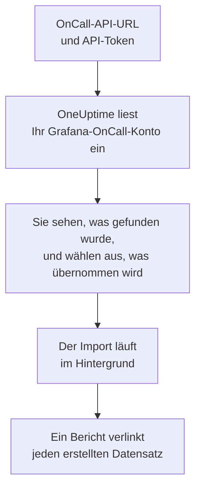

# Wechsel von Grafana OnCall

Grafana Labs hat das quelloffene Grafana OnCall im März 2026 archiviert, und in Grafana Cloud lebt es als Teil von Grafana Cloud IRM weiter. Wo auch immer Ihres läuft: **Aus einem anderen Tool importieren** holt Ihre Bereitschaftseinrichtung in wenigen Minuten in OneUptime. Mit Ihrer OnCall-API-URL und einem API-Token liest OneUptime Ihre Benutzer, Teams, Pläne und Eskalationsketten ein, zeigt Ihnen, was es gefunden hat, und erstellt, was Sie auswählen. In Grafana OnCall ändert sich nichts.

:::cards
- [Konto importieren](#ihr-grafana-oncall-konto-importieren): Token erstellen, Konto einlesen und auswählen, was übernommen wird.
- [Was übernommen wird](#was-übernommen-wird): Wie aus jedem Grafana-OnCall-Datensatz ein OneUptime-Datensatz wird.
- [Den Wechsel abschließen](#den-wechsel-abschließen): Was nach dem Import zu tun ist.
:::

## So funktioniert es

- **Das Token wird einmal verwendet.** Es wird zusammen mit der API-URL verschlüsselt aufbewahrt, solange OneUptime Ihr Konto einliest, und gelöscht, sobald das Einlesen endet, ob es funktioniert hat oder nicht. Es wird nie wieder angezeigt und nie in ein Protokoll geschrieben.
- **OneUptime liest nur, und nur von der Adresse, die Sie angeben.** Es ruft ausschließlich die OnCall-API-URL auf, die Sie einfügen, höchstens einmal pro Sekunde, und bleibt damit innerhalb des Limits von Grafana OnCall von 300 Anfragen pro Token in fünf Minuten. Wenn Grafana OnCall um eine Pause bittet, wartet es und versucht es erneut.
- **Die Adresse wird vor jeder Anfrage geprüft.** OneUptime ruft nie den Rechner auf, auf dem es läuft, oder einen Cloud-Metadatendienst, und folgt nie einer Weiterleitung. In OneUptime Cloud muss die Adresse außerdem öffentlich sein und mit `https://` beginnen. Ein selbst gehostetes OneUptime kann auch ein Grafana OnCall in Ihrem eigenen Netzwerk lesen, sofern sein Administrator das nicht abgeschaltet hat, wie unter [Private Network Access](/docs/self-hosted/private-network-access) beschrieben.
- **Nichts wird erstellt, bevor Sie den Import starten.** Die Vorschau zeigt für jedes Element, ob es neu ist, bereits in OneUptime ist (und unverändert verwendet wird), von einem früheren Import übernommen wurde oder warum es nicht übernommen werden kann.
- **Ein erneuter Import erstellt nie etwas doppelt.** OneUptime merkt sich anhand der Grafana-OnCall-ID, was jeder Import übernommen hat. Führen Sie den Import erneut aus, nachdem Sie in Grafana OnCall Personen oder Pläne hinzugefügt haben, und nur die neuen werden erstellt.

## Bevor Sie beginnen

- **Ein OneUptime-Projekt und das Recht, das Übernommene zu erstellen.** Projektinhaber und Projektadmins können alles übernehmen. Andere Rollen können ebenfalls importieren und übernehmen die Arten von Datensätzen, die sie erstellen dürfen. Alles andere wird mit Begründung als nicht übernommen angezeigt.
- **Ein API-Token von Grafana OnCall.** Verwenden Sie ein OnCall-API-Token, kein Token eines Grafana-Dienstkontos. Der Import schreibt nie in Grafana OnCall. Löschen Sie das Token, sobald der Import erledigt ist.
- **Ihre OnCall-API-URL.** Die Einstellungen von OnCall zeigen sie neben den API-Tokens. In Grafana Cloud sieht sie aus wie `https://oncall-prod-us-central-0.grafana.net/oncall`. Bei einer eigenen Installation ist es die Adresse Ihrer OnCall-Engine.

## Ihr Grafana-OnCall-Konto importieren

:::steps
### Ein API-Token in Grafana OnCall erstellen
Öffnen Sie in Grafana **OnCall** > **Settings**. Öffnen Sie in Grafana Cloud **IRM** > **Settings** > **Admin & API**. Kopieren Sie die dort angezeigte OnCall-API-URL. Erstellen Sie unter **API tokens** ein Token namens `OneUptime import` und kopieren Sie es.

### Die Importseite öffnen
Öffnen Sie in OneUptime **Projekteinstellungen** > **Aus einem anderen Tool importieren** und wählen Sie **Grafana OnCall**.

### Grafana OnCall verbinden
Fügen Sie die Adresse in **Grafana-OnCall-API-URL** und das Token in **Grafana-OnCall-API-Schlüssel** ein und wählen Sie **Mein Grafana OnCall-Konto einlesen**. Ein großes Konto dauert einige Minuten, und Sie können die Seite währenddessen verlassen.

### Auswählen, was übernommen wird
Die Vorschau listet auf, was gefunden wurde, mit einem Abschnitt pro Art. Alles, was erstellt würde, ist anfangs ausgewählt, außer Personen, die in keinem Team, Plan und keiner Eskalationskette sind. Unter jedem Element sagt OneUptime, was nicht genau so übernommen wird, wie es war. Wenn ein ausgewähltes Element etwas verwendet, das Sie nicht ausgewählt haben, sagt es das, und **Diese auch auswählen** wählt es aus.

### Den Import starten
Wenn Personen eingeladen werden, wählen Sie unter **Neue Personen einladen in** das Team, dem sie beitreten. Wählen Sie dann **Import starten**. Der Import läuft im Hintergrund: Sie können die Seite verlassen, und der Bericht wartet dort auf Sie.
:::

Der Bericht zählt, was erstellt, eingeladen und nicht übernommen wurde, und listet jedes Element mit einem Link zu dem Datensatz auf, der daraus wurde, Fehler zuerst. Frühere Importe stehen auf derselben Seite unter **Frühere Importe**.

## Was übernommen wird

| In Grafana OnCall | In OneUptime | Wie |
| --- | --- | --- |
| Users | Projektmitglieder | Abgleich über die E-Mail-Adresse. Wer noch nicht im Projekt ist, wird in das gewählte Team eingeladen. |
| Teams | Teams | Werden mit ihren Mitgliedern erstellt. Ein Team, dessen Namen das Projekt schon hat, wird unverändert verwendet, und seine Mitglieder bleiben unberührt. |
| Schedules | Bereitschaftspläne | Jede Rotation wird zu einer Ebene mit denselben Personen, demselben Beginn, derselben Übergabe und denselben Bereitschaftsstunden, in der Zeitzone des Plans und im Besitz des Teams des Plans. Eine Rotation auf einer höheren Ebene hat weiterhin Vorrang vor den Ebenen darunter. |
| Escalation Chains | Bereitschaftsrichtlinien | Die Schritte, die Personen, ein Team oder die Person in Bereitschaft eines Plans benachrichtigen, werden zu Eskalationsregeln, und ein Warteschritt wird zur Wartezeit vor der nächsten Regel. Ein Schritt, der die Kette wiederholt, wird zu den Wiederholungen der Richtlinie. |

Rotationen auf derselben Ebene, die gleichzeitig Bereitschaft haben, und eine Rotation, die mehrere Personen gleichzeitig in Bereitschaft setzt, werden jeweils zu einem eigenen OneUptime-Plan, denn ein OneUptime-Plan hat jeweils eine Person in Bereitschaft. Jede Bereitschaftsrichtlinie, die den Plan alarmiert hat, alarmiert alle davon.

## Was nicht übernommen wird

- **Alarmgruppen und ihr Verlauf.** OneUptime beginnt mit Ihrer Einrichtung, nicht mit Ihren vergangenen Alarmen.
- **Integrationen, Routen und ausgehende Webhooks.** Richten Sie stattdessen Ihre Monitore und Alarmquellen auf OneUptime aus, wie unter [Den Wechsel abschließen](#den-wechsel-abschließen) beschrieben.
- **Überschreibungen, einmalige Schichten und bereits beendete Rotationen.** Legen Sie die Überschreibungen, die Sie noch brauchen, nach dem Import in OneUptime an.
- **Schichten aus einem Kalenderlink.** Ein Plan, dessen Schichten aus einem iCal-Link stammen, wird ohne Ebenen übernommen. Legen Sie sie in OneUptime an.
- **Die Benachrichtigungsregeln der einzelnen Personen.** Personen wählen in ihren eigenen **Benutzereinstellungen**, wie sie alarmiert werden, sobald sie ihre Einladung annehmen.
- **Schritte, für die OneUptime keine genaue Entsprechung hat.** Ein Schritt, der eine Slack-Benutzergruppe oder einen Kanal benachrichtigt, einen Webhook aufruft, einen Vorfall ausruft oder den Alarm auflöst, wird weggelassen. Ein Schritt, der Personen nacheinander benachrichtigt, alarmiert alle gleichzeitig, ein Schritt, der nur zu bestimmten Zeiten oder Alarmzahlen weitergeht, geht immer weiter, und die Vorschau sagt, was sich ändert.

## Grenzen

Ein Import erstellt höchstens 2.000 Datensätze: höchstens 500 Personen, 200 Teams, 200 Bereitschaftspläne und 200 Bereitschaftsrichtlinien. Alles über einer Grenze wird als nicht übernommen angezeigt. Führen Sie den Import erneut aus, um den Rest zu übernehmen.

In OneUptime Cloud werden Datensätze, die Ihr Tarif nicht enthält, als nicht übernommen angezeigt, mit dem Tarif, den sie brauchen.

Eine Vorschau wird einen Tag lang aufbewahrt. Nur die Person, die das Konto eingelesen hat, kann auswählen und den Import starten. Projektinhaber und Projektadmins sehen den Fortschritt und den Bericht jedes Imports.

## Den Wechsel abschließen

:::steps
### Die Bereitschaftspläne prüfen
Öffnen Sie jeden Plan unter **Bereitschaftsdienst** > **Bereitschaftspläne** und prüfen Sie, wer jetzt und wer als Nächstes Bereitschaft hat.

### Sicherstellen, dass alle alarmiert werden können
Eingeladene Personen nehmen ihre Einladung an und fügen dann eine Telefonnummer, eine E-Mail-Adresse oder die mobile App hinzu, über die sie alarmiert werden. **Bereitschaftsdienst** > **Einsatzbereitschaft** zeigt, wer noch nicht erreichbar ist.

### Alarme an OneUptime senden
Richten Sie Ihre Monitore und die Tools, die Alarme auslösen, auf OneUptime aus, und alarmieren Sie sich zum Test einmal selbst.

### Die Alarmierung in Grafana OnCall ausschalten
Sobald OneUptime die richtigen Personen alarmiert, schalten Sie die Benachrichtigungen in Grafana OnCall aus, damit niemand doppelt alarmiert wird.
:::

## Fehlerbehebung

:::details Grafana OnCall hat den API-Schlüssel nicht akzeptiert
Prüfen Sie, ob Sie das ganze Token kopiert haben, ob es ein OnCall-API-Token und kein Token eines Grafana-Dienstkontos ist und ob die API-URL die daneben angezeigte ist. Wählen Sie dann **Erneut versuchen**.
:::

:::details OneUptime hat die API-URL nicht aufgerufen
Fügen Sie die OnCall-API-URL genau so ein, wie die Einstellungen von OnCall sie zeigen. In OneUptime Cloud muss sie mit `https://` beginnen und aus dem Internet erreichbar sein. Ein selbst gehostetes OneUptime erreicht auch eine Adresse in Ihrem eigenen Netzwerk, sofern sein Administrator das nicht abgeschaltet hat, aber nie eine auf dem Rechner, auf dem OneUptime läuft.
:::

:::details Eine Art von Datensätzen fehlt in der Vorschau
Das Token konnte sie nicht lesen, und die Vorschau sagt das ganz oben. Ein Token liest, was die Person sehen darf, die es erstellt hat. Erstellen Sie es daher als Admin von Grafana OnCall und lesen Sie das Konto erneut ein.
:::

:::details Einige Elemente können nicht ausgewählt werden
Bei jedem steht, warum: ein Name, den das Projekt schon hat, etwas, das ein früherer Import übernommen hat, oder ein Datensatz, den Sie nicht erstellen dürfen oder den Ihr Tarif nicht enthält.
:::

## Nächste Schritte

:::cards
- [Bereitschaftspläne](/docs/on-call/schedules): Ebenen, Beschränkungen und Übergaben.
- [Eskalationsregeln](/docs/on-call/escalation-rules): Wie Bereitschaftsrichtlinien Personen alarmieren.
- [Wechsel von PagerDuty](/docs/moving-to-oneuptime/pagerduty): Ein Team aus PagerDuty übernehmen.
:::
