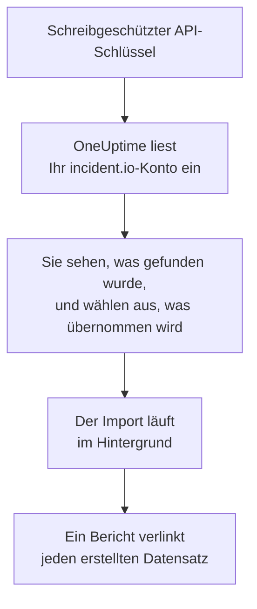

# Wechsel von incident.io

**Aus einem anderen Tool importieren** holt Ihre incident.io-Einrichtung in wenigen Minuten in OneUptime. Mit einem schreibgeschützten incident.io-API-Schlüssel liest OneUptime Ihre Benutzer, Teams, Pläne, Eskalationspfade, Dienste und Vorfalleinstellungen ein, zeigt Ihnen, was es gefunden hat, und erstellt, was Sie auswählen. In incident.io ändert sich nichts.

:::cards
- [Konto importieren](#ihr-incidentio-konto-importieren): Schlüssel erstellen, Konto einlesen und auswählen, was übernommen wird.
- [Was übernommen wird](#was-übernommen-wird): Wie aus jedem incident.io-Datensatz ein OneUptime-Datensatz wird.
- [Den Wechsel abschließen](#den-wechsel-abschließen): Was nach dem Import zu tun ist.
:::

## So funktioniert es

- **Der Schlüssel wird einmal verwendet.** Er wird verschlüsselt aufbewahrt, solange OneUptime Ihr Konto einliest, und gelöscht, sobald das Einlesen endet, ob es funktioniert hat oder nicht. Er wird nie wieder angezeigt und nie in ein Protokoll geschrieben.
- **OneUptime liest nur.** Es ruft ausschließlich die API von incident.io auf, `api.incident.io`. Wenn incident.io um eine Pause bittet, wartet es und versucht es erneut.
- **Nichts wird erstellt, bevor Sie den Import starten.** Die Vorschau zeigt für jedes Element, ob es neu ist, bereits in OneUptime ist (und unverändert verwendet wird), von einem früheren Import übernommen wurde oder warum es nicht übernommen werden kann.
- **Ein erneuter Import erstellt nie etwas doppelt.** OneUptime merkt sich anhand der incident.io-ID, was jeder Import übernommen hat. Führen Sie den Import erneut aus, nachdem Sie in incident.io Personen oder Pläne hinzugefügt haben, und nur die neuen werden erstellt.

## Bevor Sie beginnen

- **Ein OneUptime-Projekt und das Recht, das Übernommene zu erstellen.** Projektinhaber und Projektadmins können alles übernehmen. Andere Rollen können ebenfalls importieren und übernehmen die Arten von Datensätzen, die sie erstellen dürfen. Alles andere wird mit Begründung als nicht übernommen angezeigt.
- **Ein incident.io-API-Schlüssel, der nur Daten ansehen kann.** Der Import schreibt nie in incident.io, daher braucht der Schlüssel keine Berechtigung, etwas zu erstellen, zu bearbeiten oder zu verwalten.

## Ihr incident.io-Konto importieren

:::steps
### Einen API-Schlüssel in incident.io erstellen
Öffnen Sie in incident.io **Settings** > **API keys** und wählen Sie **Add new**. Nennen Sie ihn `OneUptime import`, geben Sie ihm nur Berechtigungen zum Ansehen von Daten, keine zum Erstellen, Bearbeiten oder Verwalten, und kopieren Sie den Schlüssel.

### Die Importseite öffnen
Öffnen Sie in OneUptime **Projekteinstellungen** > **Aus einem anderen Tool importieren** und wählen Sie **incident.io**.

### incident.io verbinden
Fügen Sie den Schlüssel in **incident.io-API-Schlüssel** ein und wählen Sie **Mein incident.io-Konto einlesen**. Ein großes Konto dauert einige Minuten, und Sie können die Seite währenddessen verlassen.

### Auswählen, was übernommen wird
Die Vorschau listet auf, was gefunden wurde, mit einem Abschnitt pro Art. Alles, was erstellt würde, ist anfangs ausgewählt, außer Personen, die in keinem Team, Plan und keinem Eskalationspfad sind. Unter jedem Element sagt OneUptime, was nicht genau so übernommen wird, wie es war. Wenn ein ausgewähltes Element etwas verwendet, das Sie nicht ausgewählt haben, sagt es das, und **Diese auch auswählen** wählt es aus.

### Den Import starten
Wenn Personen eingeladen werden, wählen Sie unter **Neue Personen einladen in** das Team, dem sie beitreten. Wählen Sie dann **Import starten**. Der Import läuft im Hintergrund: Sie können die Seite verlassen, und der Bericht wartet dort auf Sie.
:::

Der Bericht zählt, was erstellt, eingeladen und nicht übernommen wurde, und listet jedes Element mit einem Link zu dem Datensatz auf, der daraus wurde, Fehler zuerst. Frühere Importe stehen auf derselben Seite unter **Frühere Importe**.

## Was übernommen wird

| In incident.io | In OneUptime | Wie |
| --- | --- | --- |
| Users | Projektmitglieder | Abgleich über die E-Mail-Adresse. Wer noch nicht im Projekt ist, wird in das gewählte Team eingeladen. Deaktivierte Benutzer werden nicht übernommen. |
| Teams | Teams | Werden mit ihren Mitgliedern erstellt. Ein Team, dessen Namen das Projekt schon hat, wird unverändert verwendet, und seine Mitglieder bleiben unberührt. |
| Schedules | Bereitschaftspläne | Jede Rotation wird zu einer Ebene mit denselben Personen, demselben Beginn, derselben Schichtlänge und denselben Arbeitszeiten, in der Zeitzone des Plans. Übernommen wird die Version der Rotation, die jetzt gilt. |
| Escalation paths | Bereitschaftsrichtlinien | Jede Stufe wird zu einer Eskalationsregel, die dieselben Pläne, Benutzer und Teams nach derselben Wartezeit alarmiert. Eine Wiederholung wird zu den Wiederholungen der Richtlinie, und von einer Verzweigung wird der erste Pfad übernommen. |
| Catalog services | Dienste | Die Einträge Ihrer Katalogtypen in der Kategorie Service, im Dienstkatalog erstellt. Archivierte Einträge werden weggelassen. |
| Severities | Vorfallsschweregrade | In der Reihenfolge von incident.io erstellt, der schwerste zuerst. Ein Schweregrad, dessen Namen das Projekt schon hat, wird unverändert verwendet. |
| Statuses | Vorfallsstatus | Ein Triage-Status entspricht dem Status, in dem OneUptime Vorfälle beginnt, und ein Closed-Status dem Status, in dem Vorfälle behoben sind. Live- und Paused-Status werden zwischen Bestätigt und Behoben angelegt. |
| Incident roles | Vorfallsrollen | Die leitende Rolle entspricht dem Vorfall-Kommandanten von OneUptime, die anderen Rollen werden erstellt. OneUptime erfasst, wer jeden Vorfall gemeldet hat, daher wird die Reporter-Rolle nicht gebraucht. |
| Custom fields | Benutzerdefinierte Vorfall-Felder | Single-Select-Felder werden zu Auswahllisten, Multi-Select-Felder zu Mehrfachauswahllisten, Text- und Link-Felder zu Text und numerische Felder zu Zahlen, mit ihren Optionen. |

Eine Rotation mit mehreren Personen gleichzeitig in Bereitschaft wird zu einem OneUptime-Plan pro Person in Bereitschaft, denn ein OneUptime-Plan hat jeweils eine Person in Bereitschaft. Jede Bereitschaftsrichtlinie, die den Plan alarmiert hat, alarmiert alle davon.

## Was nicht übernommen wird

- **Vorfälle, Alarme und ihr Verlauf.** OneUptime beginnt mit Ihrer Einrichtung, nicht mit Ihren vergangenen Vorfällen.
- **Workflows, Statusseiten, Alert Routes und Integrationen.** Richten Sie stattdessen Ihre Monitore und Alarmquellen auf OneUptime aus, wie unter [Den Wechsel abschließen](#den-wechsel-abschließen) beschrieben.
- **Benutzerdefinierte Felder, deren Optionen aus dem Katalog stammen,** und Status, für die OneUptime keinen Status hat: Declined, Merged, Canceled und Learning.
- **Plan-Überschreibungen und für später geplante Änderungen an einer Rotation.** Die Vorschau nennt jede geplante Änderung, damit Sie sie in OneUptime vornehmen können, wenn sie fällig ist.
- **Eskalationsschritte, für die OneUptime keine genaue Entsprechung hat.** Ein Schritt, der in einen Slack- oder Microsoft-Teams-Kanal postet, wird weggelassen, weil das in OneUptime die Benachrichtigungsregeln des Arbeitsbereichs tun, ebenso ein Schritt, der an einen anderen Eskalationspfad übergibt. Ein Schritt, der alarmiert, wer als Nächstes Bereitschaft hat, wird als das Nächstliegende übernommen, das OneUptime hat, und die Vorschau sagt, was sich ändert.

## Grenzen

Ein Import erstellt höchstens 2.000 Datensätze: höchstens 500 Personen, 200 Teams, 200 Bereitschaftspläne, 200 Bereitschaftsrichtlinien, 500 Dienste, 100 benutzerdefinierte Vorfallfelder und je 25 Vorfallsschweregrade, Vorfallsstatus und Vorfallsrollen. Alles über einer Grenze wird als nicht übernommen angezeigt. Führen Sie den Import erneut aus, um den Rest zu übernehmen.

In OneUptime Cloud werden Datensätze, die Ihr Tarif nicht enthält, als nicht übernommen angezeigt, mit dem Tarif, den sie brauchen.

Eine Vorschau wird einen Tag lang aufbewahrt. Nur die Person, die das Konto eingelesen hat, kann auswählen und den Import starten. Projektinhaber und Projektadmins sehen den Fortschritt und den Bericht jedes Imports.

## Den Wechsel abschließen

:::steps
### Die Bereitschaftspläne prüfen
Öffnen Sie jeden Plan unter **Bereitschaftsdienst** > **Bereitschaftspläne** und prüfen Sie, wer jetzt und wer als Nächstes Bereitschaft hat.

### Sicherstellen, dass alle alarmiert werden können
Eingeladene Personen nehmen ihre Einladung an und fügen dann eine Telefonnummer, eine E-Mail-Adresse oder die mobile App hinzu, über die sie alarmiert werden. **Bereitschaftsdienst** > **Einsatzbereitschaft** zeigt, wer noch nicht erreichbar ist.

### Alarme an OneUptime senden
Richten Sie Ihre Monitore und die Tools, die Alarme auslösen, auf OneUptime aus, und alarmieren Sie sich zum Test einmal selbst.

### Die Alarmierung in incident.io ausschalten
Sobald OneUptime die richtigen Personen alarmiert, schalten Sie die Benachrichtigungen in incident.io aus, damit niemand doppelt alarmiert wird.
:::

## Fehlerbehebung

:::details incident.io hat den API-Schlüssel nicht akzeptiert
Prüfen Sie, ob Sie den ganzen Schlüssel kopiert haben und ob er unter **Settings** > **API keys** nicht gelöscht wurde. Wählen Sie dann **Erneut versuchen**.
:::

:::details Eine Art von Datensätzen fehlt in der Vorschau
Der Schlüssel konnte sie nicht lesen, und die Vorschau sagt das ganz oben. Geben Sie dem Schlüssel die Berechtigung, diese Art von Daten anzusehen, und lesen Sie das Konto erneut ein.
:::

:::details Einige Elemente können nicht ausgewählt werden
Bei jedem steht, warum: ein deaktivierter Benutzer, ein Name, den das Projekt schon hat, etwas, das ein früherer Import übernommen hat, oder ein Datensatz, den Sie nicht erstellen dürfen oder den Ihr Tarif nicht enthält.
:::

## Nächste Schritte

:::cards
- [Bereitschaftspläne](/docs/on-call/schedules): Ebenen, Beschränkungen und Übergaben.
- [Vorfallsstatus und Schweregrade](/docs/incidents/states-and-severities): Die Status und Schweregrade, die Vorfälle durchlaufen.
- [Wechsel von Opsgenie](/docs/moving-to-oneuptime/opsgenie): Ein Team aus Opsgenie übernehmen.
:::
