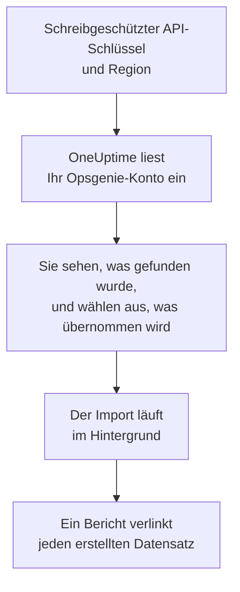

# Wechsel von Opsgenie

Atlassian stellt Opsgenie ein: Seit Juni 2025 wird Opsgenie nicht mehr verkauft, und im April 2027 endet der Support. OneUptime ist ein neues Zuhause für Ihr Bereitschaftsteam, und **Aus einem anderen Tool importieren** holt es in wenigen Minuten herüber. Mit einem schreibgeschützten Opsgenie-API-Schlüssel liest OneUptime Ihre Benutzer, Teams, Pläne, Eskalationen und Dienste ein, zeigt Ihnen, was es gefunden hat, und erstellt, was Sie auswählen. In Opsgenie ändert sich nichts.

:::cards
- [Konto importieren](#ihr-opsgenie-konto-importieren): Schlüssel erstellen, Konto einlesen und auswählen, was übernommen wird.
- [Was übernommen wird](#was-übernommen-wird): Wie aus jedem Opsgenie-Datensatz ein OneUptime-Datensatz wird.
- [Den Wechsel abschließen](#den-wechsel-abschließen): Was nach dem Import zu tun ist.
:::

## So funktioniert es

- **Der Schlüssel wird einmal verwendet.** Er wird verschlüsselt aufbewahrt, solange OneUptime Ihr Konto einliest, und gelöscht, sobald das Einlesen endet, ob es funktioniert hat oder nicht. Er wird nie wieder angezeigt und nie in ein Protokoll geschrieben.
- **OneUptime liest nur.** Es ruft ausschließlich die API von Opsgenie auf: `api.opsgenie.com`, oder `api.eu.opsgenie.com` für ein Konto in Europa. Wenn Opsgenie um eine Pause bittet, wartet es und versucht es erneut.
- **Nichts wird erstellt, bevor Sie den Import starten.** Die Vorschau zeigt für jedes Element, ob es neu ist, bereits in OneUptime ist (und unverändert verwendet wird), von einem früheren Import übernommen wurde oder warum es nicht übernommen werden kann.
- **Ein erneuter Import erstellt nie etwas doppelt.** OneUptime merkt sich anhand der Opsgenie-ID, was jeder Import übernommen hat. Führen Sie den Import erneut aus, nachdem Sie in Opsgenie Personen oder Pläne hinzugefügt haben, und nur die neuen werden erstellt.

## Bevor Sie beginnen

- **Ein OneUptime-Projekt und das Recht, das Übernommene zu erstellen.** Projektinhaber und Projektadmins können alles übernehmen. Andere Rollen können ebenfalls importieren und übernehmen die Arten von Datensätzen, die sie erstellen dürfen. Alles andere wird mit Begründung als nicht übernommen angezeigt.
- **Ein Opsgenie-API-Schlüssel mit den Rechten Read und Configuration access.** Configuration access erlaubt einem Schlüssel, Benutzer, Teams, Pläne und Eskalationen zu lesen. Der Import schreibt nie in Opsgenie.
- **Ihre Opsgenie-Region.** Wenn Sie sich unter `app.eu.opsgenie.com` anmelden, liegt Ihr Konto in Europa. Andernfalls liegt es in den Vereinigten Staaten.

## Ihr Opsgenie-Konto importieren

:::steps
### Einen API-Schlüssel in Opsgenie erstellen
Öffnen Sie in Opsgenie **Settings** > **API key management** und wählen Sie **Add new API key**. Nennen Sie ihn `OneUptime import`, geben Sie ihm nur **Read** und **Configuration access** und kopieren Sie den Schlüssel.

### Die Importseite öffnen
Öffnen Sie in OneUptime **Projekteinstellungen** > **Aus einem anderen Tool importieren** und wählen Sie **Opsgenie**.

### Opsgenie verbinden
Wählen Sie unter **Wo ist Ihr Opsgenie-Konto?** **Vereinigte Staaten** oder **Europa**. Fügen Sie den Schlüssel in **Opsgenie-API-Schlüssel** ein und wählen Sie **Mein Opsgenie-Konto einlesen**. Ein großes Konto dauert einige Minuten, und Sie können die Seite währenddessen verlassen.

### Auswählen, was übernommen wird
Die Vorschau listet auf, was gefunden wurde, mit einem Abschnitt pro Art. Alles, was erstellt würde, ist anfangs ausgewählt, außer Plänen, die in Opsgenie ausgeschaltet sind, und Personen, die in keinem Team, Plan und keiner Eskalation sind. Unter jedem Element sagt OneUptime, was nicht genau so übernommen wird, wie es war. Wenn ein ausgewähltes Element etwas verwendet, das Sie nicht ausgewählt haben, sagt es das, und **Diese auch auswählen** wählt es aus.

### Den Import starten
Wenn Personen eingeladen werden, wählen Sie unter **Neue Personen einladen in** das Team, dem sie beitreten. Wählen Sie dann **Import starten**. Der Import läuft im Hintergrund: Sie können die Seite verlassen, und der Bericht wartet dort auf Sie.
:::

Der Bericht zählt, was erstellt, eingeladen und nicht übernommen wurde, und listet jedes Element mit einem Link zu dem Datensatz auf, der daraus wurde, Fehler zuerst. Frühere Importe stehen auf derselben Seite unter **Frühere Importe**.

## Was übernommen wird

| In Opsgenie | In OneUptime | Wie |
| --- | --- | --- |
| Benutzer | Projektmitglieder | Abgleich über die E-Mail-Adresse. Wer noch nicht im Projekt ist, wird in das gewählte Team eingeladen. Gesperrte Benutzer werden nicht übernommen. |
| Teams | Teams | Werden mit ihren Mitgliedern erstellt. Ein Team, dessen Namen das Projekt schon hat, wird unverändert verwendet, und seine Mitglieder bleiben unberührt. |
| Schedules | Bereitschaftspläne | Jede Rotation wird zu einer Ebene mit denselben Personen, demselben Beginn, derselben Schichtlänge und derselben Zeitbeschränkung, in der Zeitzone des Plans und im Besitz des Teams des Plans. |
| Escalations | Bereitschaftsrichtlinien | Jede Regel wird zu einer Eskalationsregel, die denselben Plan, Benutzer oder dasselbe Team alarmiert. Regeln mit derselben Verzögerung alarmieren gemeinsam, und die Wartezeit vor der nächsten Eskalationsregel ist die Differenz der Verzögerungen. Die Wiederholungen der Eskalation werden zu den Wiederholungen der Richtlinie. |
| Services | Dienste | Werden im Dienstkatalog erstellt und gehören ihrem Team. |

Ein Plan, dessen Rotationen zwei Personen gleichzeitig in Bereitschaft setzen, wird zu einem OneUptime-Plan pro Rotation, denn ein OneUptime-Plan hat jeweils eine Person in Bereitschaft. Jede Bereitschaftsrichtlinie, die den Plan alarmiert hat, alarmiert alle davon.

## Was nicht übernommen wird

- **Alarme, Vorfälle und ihr Verlauf.** OneUptime beginnt mit Ihrer Einrichtung, nicht mit Ihren vergangenen Alarmen.
- **Integrationen, Heartbeats, Alarmrichtlinien und Routing-Regeln.** Richten Sie stattdessen Ihre Monitore und Alarmquellen auf OneUptime aus, wie unter [Den Wechsel abschließen](#den-wechsel-abschließen) beschrieben.
- **Plan-Überschreibungen und bereits beendete Rotationen.** Legen Sie die Überschreibungen, die Sie noch brauchen, nach dem Import in OneUptime an.
- **Die Benachrichtigungsregeln der einzelnen Personen.** Personen wählen in ihren eigenen **Benutzereinstellungen**, wie sie alarmiert werden, sobald sie ihre Einladung annehmen.
- **Schritte, für die OneUptime keine genaue Entsprechung hat.** Eine Regel, die alarmiert, wer als Nächstes Bereitschaft hat, oder die Admins eines Teams, wird als das Nächstliegende übernommen, das OneUptime hat, und die Vorschau sagt, was sich ändert.

## Grenzen

Ein Import erstellt höchstens 2.000 Datensätze: höchstens 500 Personen, 200 Teams, 200 Bereitschaftspläne, 200 Bereitschaftsrichtlinien und 500 Dienste. Alles über einer Grenze wird als nicht übernommen angezeigt. Führen Sie den Import erneut aus, um den Rest zu übernehmen.

In OneUptime Cloud werden Datensätze, die Ihr Tarif nicht enthält, als nicht übernommen angezeigt, mit dem Tarif, den sie brauchen.

Eine Vorschau wird einen Tag lang aufbewahrt. Nur die Person, die das Konto eingelesen hat, kann auswählen und den Import starten. Projektinhaber und Projektadmins sehen den Fortschritt und den Bericht jedes Imports.

## Den Wechsel abschließen

:::steps
### Die Bereitschaftspläne prüfen
Öffnen Sie jeden Plan unter **Bereitschaftsdienst** > **Bereitschaftspläne** und prüfen Sie, wer jetzt und wer als Nächstes Bereitschaft hat.

### Sicherstellen, dass alle alarmiert werden können
Eingeladene Personen nehmen ihre Einladung an und fügen dann eine Telefonnummer, eine E-Mail-Adresse oder die mobile App hinzu, über die sie alarmiert werden. **Bereitschaftsdienst** > **Einsatzbereitschaft** zeigt, wer noch nicht erreichbar ist.

### Alarme an OneUptime senden
Richten Sie Ihre Monitore und die Tools, die Alarme auslösen, auf OneUptime aus, und alarmieren Sie sich zum Test einmal selbst.

### Die Alarmierung in Opsgenie ausschalten
Sobald OneUptime die richtigen Personen alarmiert, schalten Sie die Benachrichtigungen in Opsgenie aus, damit niemand doppelt alarmiert wird.
:::

## Fehlerbehebung

:::details Opsgenie hat den API-Schlüssel nicht akzeptiert
Prüfen Sie, ob Sie den ganzen Schlüssel kopiert haben, ob es ein Schlüssel aus **API key management** und nicht der Schlüssel einer Integration ist, ob er **Read** und **Configuration access** hat und ob Sie die Region Ihres Kontos gewählt haben. Wählen Sie dann **Erneut versuchen**.
:::

:::details Eine Art von Datensätzen fehlt in der Vorschau
Der Schlüssel konnte sie nicht lesen, und die Vorschau sagt das ganz oben. Geben Sie dem Schlüssel **Configuration access** und lesen Sie das Konto erneut ein.
:::

:::details Einige Elemente können nicht ausgewählt werden
Bei jedem steht, warum: ein gesperrter Benutzer, ein Name, den das Projekt schon hat, etwas, das ein früherer Import übernommen hat, oder ein Datensatz, den Sie nicht erstellen dürfen oder den Ihr Tarif nicht enthält.
:::

## Nächste Schritte

:::cards
- [Bereitschaftspläne](/docs/on-call/schedules): Ebenen, Beschränkungen und Übergaben.
- [Eskalationsregeln](/docs/on-call/escalation-rules): Wie Bereitschaftsrichtlinien Personen alarmieren.
- [Wechsel von incident.io](/docs/moving-to-oneuptime/incident-io): Ein Team aus incident.io übernehmen.
:::
