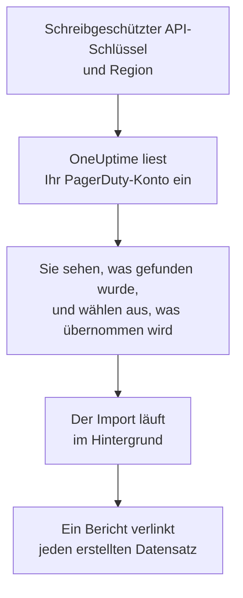

# Wechsel von PagerDuty

**Aus einem anderen Tool importieren** holt Ihre PagerDuty-Einrichtung in wenigen Minuten in OneUptime. Mit einem schreibgeschützten PagerDuty-API-Schlüssel liest OneUptime Ihre Benutzer, Teams, Pläne, Eskalationsrichtlinien und Dienste ein, zeigt Ihnen, was es gefunden hat, und erstellt, was Sie auswählen. In PagerDuty ändert sich nichts.

:::cards
- [Konto importieren](#ihr-pagerduty-konto-importieren): Schlüssel erstellen, Konto einlesen und auswählen, was übernommen wird.
- [Was übernommen wird](#was-übernommen-wird): Wie aus jedem PagerDuty-Datensatz ein OneUptime-Datensatz wird.
- [Den Wechsel abschließen](#den-wechsel-abschließen): Was nach dem Import zu tun ist.
:::

## So funktioniert es

- **Der Schlüssel wird einmal verwendet.** Er wird verschlüsselt aufbewahrt, solange OneUptime Ihr Konto einliest, und gelöscht, sobald das Einlesen endet, ob es funktioniert hat oder nicht. Er wird nie wieder angezeigt und nie in ein Protokoll geschrieben.
- **OneUptime liest nur.** Es ruft ausschließlich die REST-API von PagerDuty auf: `api.pagerduty.com`, oder `api.eu.pagerduty.com` für ein Konto in Europa. Wenn PagerDuty um eine Pause bittet, wartet es und versucht es erneut.
- **Nichts wird erstellt, bevor Sie den Import starten.** Die Vorschau zeigt für jedes Element, ob es neu ist, bereits in OneUptime ist (und unverändert verwendet wird), von einem früheren Import übernommen wurde oder warum es nicht übernommen werden kann.
- **Ein erneuter Import erstellt nie etwas doppelt.** OneUptime merkt sich anhand der PagerDuty-ID, was jeder Import übernommen hat. Führen Sie den Import erneut aus, nachdem Sie in PagerDuty Personen oder Pläne hinzugefügt haben, und nur die neuen werden erstellt.

## Bevor Sie beginnen

- **Ein OneUptime-Projekt und das Recht, das Übernommene zu erstellen.** Projektinhaber und Projektadmins können alles übernehmen. Andere Rollen können ebenfalls importieren und übernehmen die Arten von Datensätzen, die sie erstellen dürfen. Alles andere wird mit Begründung als nicht übernommen angezeigt.
- **Ein schreibgeschützter REST-API-Schlüssel von PagerDuty.** Admins und Kontoinhaber in PagerDuty können einen erstellen. Der Import schreibt nie in PagerDuty, daher braucht der Schlüssel nur Lesezugriff.
- **Ihre PagerDuty-Region.** Wenn Sie sich unter einer Adresse anmelden, die auf `eu.pagerduty.com` endet, liegt Ihr Konto in Europa. Andernfalls liegt es in den Vereinigten Staaten.

## Ihr PagerDuty-Konto importieren

:::steps
### Einen API-Schlüssel in PagerDuty erstellen
Öffnen Sie in PagerDuty **Integrations** > **Developer Tools** > **API Access Keys** und wählen Sie **Create New API Key**. Beschreiben Sie ihn als `OneUptime import`, wählen Sie **Read-only API Key**, dann **Create Key**, und kopieren Sie den Schlüssel.

### Die Importseite öffnen
Öffnen Sie in OneUptime **Projekteinstellungen** > **Aus einem anderen Tool importieren** und wählen Sie **PagerDuty**.

### PagerDuty verbinden
Wählen Sie unter **Wo ist Ihr PagerDuty-Konto?** **Vereinigte Staaten** oder **Europa**. Fügen Sie den Schlüssel in **PagerDuty-API-Schlüssel** ein und wählen Sie **Mein PagerDuty-Konto einlesen**. Ein großes Konto dauert einige Minuten, und Sie können die Seite währenddessen verlassen.

### Auswählen, was übernommen wird
Die Vorschau listet auf, was gefunden wurde, mit einem Abschnitt pro Art. Alles, was erstellt würde, ist anfangs ausgewählt, außer Diensten, die in PagerDuty ausgeschaltet sind, und Personen, die in keinem Team, Plan und keiner Eskalationsrichtlinie sind. Unter jedem Element sagt OneUptime, was nicht genau so übernommen wird, wie es war. Wenn ein ausgewähltes Element etwas verwendet, das Sie nicht ausgewählt haben, sagt es das, und **Diese auch auswählen** wählt es aus.

### Den Import starten
Wenn Personen eingeladen werden, wählen Sie unter **Neue Personen einladen in** das Team, dem sie beitreten. Wählen Sie dann **Import starten**. Der Import läuft im Hintergrund: Sie können die Seite verlassen, und der Bericht wartet dort auf Sie.
:::

Der Bericht zählt, was erstellt, eingeladen und nicht übernommen wurde, und listet jedes Element mit einem Link zu dem Datensatz auf, der daraus wurde, Fehler zuerst. Frühere Importe stehen auf derselben Seite unter **Frühere Importe**.

## Was übernommen wird

| In PagerDuty | In OneUptime | Wie |
| --- | --- | --- |
| Users | Projektmitglieder | Abgleich über die E-Mail-Adresse. Wer noch nicht im Projekt ist, wird in das gewählte Team eingeladen. |
| Teams | Teams | Werden mit ihren Mitgliedern erstellt. Ein Team, dessen Namen das Projekt schon hat, wird unverändert verwendet, und seine Mitglieder bleiben unberührt. |
| Schedules | Bereitschaftspläne | Jede Ebene wird zu einer Ebene mit denselben Personen, demselben Beginn, derselben Schichtlänge und denselben Beschränkungen, in der Zeitzone des Plans und im Besitz des Teams des Plans. Die Ebenen behalten ihre Reihenfolge, sodass eine höhere Ebene weiterhin Vorrang vor den Ebenen darunter hat. |
| Escalation Policies | Bereitschaftsrichtlinien | Jede Eskalationsregel wird zu einer Eskalationsregel, die dieselben Pläne und Benutzer alarmiert und nach derselben Verzögerung eskaliert. Die Wiederholungen der Richtlinie werden zu den Wiederholungen der Richtlinie in OneUptime. |
| Services | Dienste | Werden im Dienstkatalog erstellt und gehören ihrem Team. Ein in PagerDuty ausgeschalteter Dienst ist anfangs nicht ausgewählt. |

Ein PagerDuty-Plan bleibt ein OneUptime-Plan: Seine Ebenen haben Vorrang voreinander, so wie in PagerDuty. Eine Ebene, deren Schichten keine ganzen Stunden lang sind, wird mit auf die Stunde gerundeten Schichten übernommen, und die Vorschau sagt das.

## Was nicht übernommen wird

- **Vorfälle, Alarme und ihr Verlauf.** OneUptime beginnt mit Ihrer Einrichtung, nicht mit Ihren vergangenen Vorfällen.
- **Integrationen, Event Orchestrations, Incident Workflows und Statusseiten.** Richten Sie stattdessen Ihre Monitore und Alarmquellen auf OneUptime aus, wie unter [Den Wechsel abschließen](#den-wechsel-abschließen) beschrieben.
- **Plan-Überschreibungen und bereits beendete Ebenen.** Legen Sie die Überschreibungen, die Sie noch brauchen, nach dem Import in OneUptime an.
- **Schichtbasierte Pläne.** Der Import liest die Pläne mit Ebenen von PagerDuty, nicht die neueren schichtbasierten Pläne (shift-based schedules). Wenn Ihr Konto welche hat, sagt die Vorschau das ganz oben, und eine Eskalationsregel, die einen davon alarmiert, wird ohne ihn übernommen. Legen Sie sie in OneUptime an.
- **Die Benachrichtigungsregeln der einzelnen Personen.** Personen wählen in ihren eigenen **Benutzereinstellungen**, wie sie alarmiert werden, sobald sie ihre Einladung annehmen.
- **Regeln, für die OneUptime keine genaue Entsprechung hat.** Eine Eskalationsregel, die ihre Personen reihum (Round Robin) zuweist, alarmiert in OneUptime alle gleichzeitig, und die Vorschau sagt, was sich ändert.

## Grenzen

Ein Import erstellt höchstens 2.000 Datensätze: höchstens 500 Personen, 200 Teams, 200 Bereitschaftspläne, 200 Bereitschaftsrichtlinien und 500 Dienste. Alles über einer Grenze wird als nicht übernommen angezeigt. Führen Sie den Import erneut aus, um den Rest zu übernehmen.

In OneUptime Cloud werden Datensätze, die Ihr Tarif nicht enthält, als nicht übernommen angezeigt, mit dem Tarif, den sie brauchen.

Eine Vorschau wird einen Tag lang aufbewahrt. Nur die Person, die das Konto eingelesen hat, kann auswählen und den Import starten. Projektinhaber und Projektadmins sehen den Fortschritt und den Bericht jedes Imports.

## Den Wechsel abschließen

:::steps
### Die Bereitschaftspläne prüfen
Öffnen Sie jeden Plan unter **Bereitschaftsdienst** > **Bereitschaftspläne** und prüfen Sie, wer jetzt und wer als Nächstes Bereitschaft hat.

### Sicherstellen, dass alle alarmiert werden können
Eingeladene Personen nehmen ihre Einladung an und fügen dann eine Telefonnummer, eine E-Mail-Adresse oder die mobile App hinzu, über die sie alarmiert werden. **Bereitschaftsdienst** > **Einsatzbereitschaft** zeigt, wer noch nicht erreichbar ist.

### Alarme an OneUptime senden
Richten Sie Ihre Monitore und die Tools, die Alarme auslösen, auf OneUptime aus, und alarmieren Sie sich zum Test einmal selbst.

### Die Alarmierung in PagerDuty ausschalten
Sobald OneUptime die richtigen Personen alarmiert, schalten Sie die Benachrichtigungen in PagerDuty aus, damit niemand doppelt alarmiert wird.
:::

## Fehlerbehebung

:::details PagerDuty hat den API-Schlüssel nicht akzeptiert
Prüfen Sie, ob Sie den ganzen Schlüssel kopiert haben, ob es ein REST-API-Schlüssel aus **API Access Keys** und kein Integrationsschlüssel ist und ob Sie die Region Ihres Kontos gewählt haben. Wählen Sie dann **Erneut versuchen**.
:::

:::details Eine Art von Datensätzen fehlt in der Vorschau
Der Schlüssel konnte sie nicht lesen, und die Vorschau sagt das ganz oben. Manche Arten gibt es nur in PagerDuty-Tarifen, die sie enthalten, zum Beispiel Teams. Lesen Sie das Konto erneut mit einem Schlüssel ein, der sie lesen kann.
:::

:::details Einige Elemente können nicht ausgewählt werden
Bei jedem steht, warum: ein Name, den das Projekt schon hat, etwas, das ein früherer Import übernommen hat, oder ein Datensatz, den Sie nicht erstellen dürfen oder den Ihr Tarif nicht enthält.
:::

## Nächste Schritte

:::cards
- [Bereitschaftspläne](/docs/on-call/schedules): Ebenen, Beschränkungen und Übergaben.
- [Eskalationsregeln](/docs/on-call/escalation-rules): Wie Bereitschaftsrichtlinien Personen alarmieren.
- [Wechsel von Opsgenie](/docs/moving-to-oneuptime/opsgenie): Ein Team aus Opsgenie übernehmen.
:::
