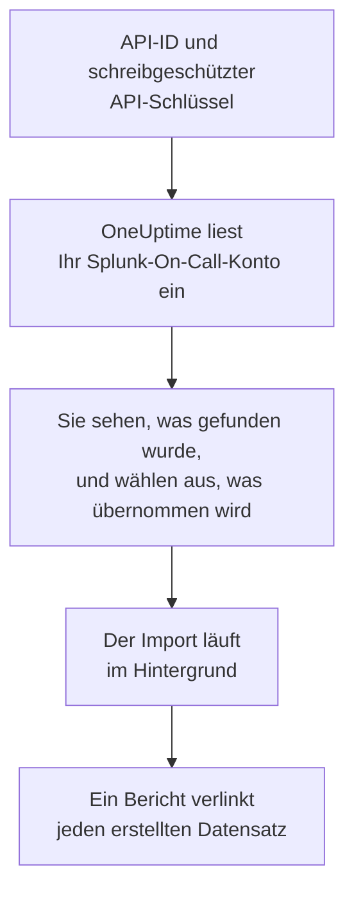

# Wechsel von Splunk On-Call

**Aus einem anderen Tool importieren** holt Ihre Splunk-On-Call-Einrichtung (früher VictorOps) in wenigen Minuten in OneUptime. Mit Ihrer API-ID und einem schreibgeschützten API-Schlüssel liest OneUptime Ihre Benutzer, Teams, Rotationen und Eskalationsrichtlinien ein, zeigt Ihnen, was es gefunden hat, und erstellt, was Sie auswählen. In Splunk On-Call ändert sich nichts.

:::cards
- [Konto importieren](#ihr-splunk-on-call-konto-importieren): Schlüssel erstellen, Konto einlesen und auswählen, was übernommen wird.
- [Was übernommen wird](#was-übernommen-wird): Wie aus jedem Splunk-On-Call-Datensatz ein OneUptime-Datensatz wird.
- [Den Wechsel abschließen](#den-wechsel-abschließen): Was nach dem Import zu tun ist.
:::

## So funktioniert es

- **Der Schlüssel wird einmal verwendet.** Er wird zusammen mit der API-ID verschlüsselt aufbewahrt, solange OneUptime Ihr Konto einliest, und gelöscht, sobald das Einlesen endet, ob es funktioniert hat oder nicht. Er wird nie wieder angezeigt und nie in ein Protokoll geschrieben.
- **OneUptime liest nur.** Es ruft ausschließlich die API von Splunk On-Call auf, `api.victorops.com`. Splunk On-Call beantwortet jede Art von Anfrage höchstens zweimal pro Sekunde, daher hält OneUptime dieses Tempo ein, und wenn Splunk On-Call um eine Pause bittet, wartet es und versucht es erneut.
- **Nichts wird erstellt, bevor Sie den Import starten.** Die Vorschau zeigt für jedes Element, ob es neu ist, bereits in OneUptime ist (und unverändert verwendet wird), von einem früheren Import übernommen wurde oder warum es nicht übernommen werden kann.
- **Ein erneuter Import erstellt nie etwas doppelt.** OneUptime merkt sich anhand der Splunk-On-Call-ID, was jeder Import übernommen hat. Führen Sie den Import erneut aus, nachdem Sie in Splunk On-Call Personen oder Rotationen hinzugefügt haben, und nur die neuen werden erstellt.

## Bevor Sie beginnen

- **Ein OneUptime-Projekt und das Recht, das Übernommene zu erstellen.** Projektinhaber und Projektadmins können alles übernehmen. Andere Rollen können ebenfalls importieren und übernehmen die Arten von Datensätzen, die sie erstellen dürfen. Alles andere wird mit Begründung als nicht übernommen angezeigt.
- **Ihre Splunk-On-Call-API-ID und ein schreibgeschützter API-Schlüssel.** Beide finden Sie in Splunk On-Call unter **Integrations** > **API**. Der Import schreibt nie in Splunk On-Call, daher genügt ein schreibgeschützter Schlüssel.

## Ihr Splunk-On-Call-Konto importieren

:::steps
### Einen API-Schlüssel in Splunk On-Call erstellen
Öffnen Sie in Splunk On-Call **Integrations** > **API**. Ihre API-ID steht über Ihren API-Schlüsseln. Erstellen Sie einen neuen API-Schlüssel namens `OneUptime import`, wählen Sie **Read-only** und kopieren Sie die API-ID und den Schlüssel.

### Die Importseite öffnen
Öffnen Sie in OneUptime **Projekteinstellungen** > **Aus einem anderen Tool importieren** und wählen Sie **Splunk On-Call**.

### Splunk On-Call verbinden
Fügen Sie die API-ID in **Splunk-On-Call-API-ID** und den Schlüssel in **Splunk-On-Call-API-Schlüssel** ein und wählen Sie **Mein Splunk On-Call-Konto einlesen**. Ein großes Konto dauert einige Minuten, und Sie können die Seite währenddessen verlassen.

### Auswählen, was übernommen wird
Die Vorschau listet auf, was gefunden wurde, mit einem Abschnitt pro Art. Alles, was erstellt würde, ist anfangs ausgewählt, außer Personen, die in keinem Team, keiner Rotation und keiner Eskalationsrichtlinie sind. Unter jedem Element sagt OneUptime, was nicht genau so übernommen wird, wie es war. Wenn ein ausgewähltes Element etwas verwendet, das Sie nicht ausgewählt haben, sagt es das, und **Diese auch auswählen** wählt es aus.

### Den Import starten
Wenn Personen eingeladen werden, wählen Sie unter **Neue Personen einladen in** das Team, dem sie beitreten. Wählen Sie dann **Import starten**. Der Import läuft im Hintergrund: Sie können die Seite verlassen, und der Bericht wartet dort auf Sie.
:::

Der Bericht zählt, was erstellt, eingeladen und nicht übernommen wurde, und listet jedes Element mit einem Link zu dem Datensatz auf, der daraus wurde, Fehler zuerst. Frühere Importe stehen auf derselben Seite unter **Frühere Importe**.

## Was übernommen wird

| In Splunk On-Call | In OneUptime | Wie |
| --- | --- | --- |
| Users | Projektmitglieder | Abgleich über die E-Mail-Adresse. Wer noch nicht im Projekt ist, wird in das gewählte Team eingeladen. |
| Teams | Teams | Werden mit ihren Mitgliedern erstellt. Ein Team, dessen Namen das Projekt schon hat, wird unverändert verwendet, und seine Mitglieder bleiben unberührt. |
| Rotations | Bereitschaftspläne | Jede Rotation wird zu einem Plan im Besitz ihres Teams, und jede ihrer Schichten zu einer Ebene mit denselben Personen, demselben Beginn, derselben Übergabe und denselben Bereitschaftstagen und -stunden. Wer in Splunk On-Call jetzt Bereitschaft hat, hat sie auch in OneUptime. |
| Escalation Policies | Bereitschaftsrichtlinien | Gehören dem Team der Richtlinie. Jeder Schritt wird zu einer Eskalationsregel, die dieselben Rotationen und Benutzer alarmiert. Das Timeout eines Schritts wird zur Wartezeit davor, und Schritte ohne Timeout dazwischen alarmieren gemeinsam. |

Schichten einer Rotation, die gleichzeitig Bereitschaft haben, werden jeweils zu einem eigenen OneUptime-Plan, denn ein OneUptime-Plan hat jeweils eine Person in Bereitschaft. Jede Bereitschaftsrichtlinie, die die Rotation alarmiert hat, alarmiert alle davon. Der Plan behält die Zeitzone der ersten Schicht der Rotation, und bei einer Schicht in einer anderen Zeitzone werden die Stunden in diese umgerechnet.

## Was nicht übernommen wird

- **Vorfälle, Alarme und ihr Verlauf.** OneUptime beginnt mit Ihrer Einrichtung, nicht mit Ihren vergangenen Vorfällen.
- **Integrationen, Routing Keys und Alert Rules.** Richten Sie stattdessen Ihre Monitore und Alarmquellen auf OneUptime aus, wie unter [Den Wechsel abschließen](#den-wechsel-abschließen) beschrieben.
- **Geplante Überschreibungen.** Legen Sie die Überschreibungen, die Sie noch brauchen, nach dem Import in OneUptime an.
- **Die Paging Policy der einzelnen Personen.** Personen wählen in ihren eigenen **Benutzereinstellungen**, wie sie alarmiert werden, sobald sie ihre Einladung annehmen.
- **Schritte, für die OneUptime keine genaue Entsprechung hat.** Ein Schritt, der einen Webhook aufruft oder an eine andere Eskalationsrichtlinie weiterleitet, wird weggelassen, ebenso ein Schritt, der eine E-Mail an eine Adresse sendet, die keiner der übernommenen Personen gehört. Ein Schritt, der alarmiert, wer als Nächstes oder zuvor Bereitschaft hat, alarmiert, wer jetzt Bereitschaft hat, und die Vorschau sagt, was sich ändert.

## Grenzen

Ein Import erstellt höchstens 2.000 Datensätze: höchstens 500 Personen, 200 Teams, 200 Bereitschaftspläne und 200 Bereitschaftsrichtlinien. Alles über einer Grenze wird als nicht übernommen angezeigt. Führen Sie den Import erneut aus, um den Rest zu übernehmen.

In OneUptime Cloud werden Datensätze, die Ihr Tarif nicht enthält, als nicht übernommen angezeigt, mit dem Tarif, den sie brauchen.

Eine Vorschau wird einen Tag lang aufbewahrt. Nur die Person, die das Konto eingelesen hat, kann auswählen und den Import starten. Projektinhaber und Projektadmins sehen den Fortschritt und den Bericht jedes Imports.

## Den Wechsel abschließen

:::steps
### Die Bereitschaftspläne prüfen
Öffnen Sie jeden Plan unter **Bereitschaftsdienst** > **Bereitschaftspläne** und prüfen Sie, wer jetzt und wer als Nächstes Bereitschaft hat.

### Sicherstellen, dass alle alarmiert werden können
Eingeladene Personen nehmen ihre Einladung an und fügen dann eine Telefonnummer, eine E-Mail-Adresse oder die mobile App hinzu, über die sie alarmiert werden. **Bereitschaftsdienst** > **Einsatzbereitschaft** zeigt, wer noch nicht erreichbar ist.

### Alarme an OneUptime senden
Richten Sie Ihre Monitore und die Tools, die Alarme auslösen, auf OneUptime aus, und alarmieren Sie sich zum Test einmal selbst.

### Die Alarmierung in Splunk On-Call ausschalten
Sobald OneUptime die richtigen Personen alarmiert, schalten Sie die Benachrichtigungen in Splunk On-Call aus, damit niemand doppelt alarmiert wird.
:::

## Fehlerbehebung

:::details Splunk On-Call hat die API-ID und den API-Schlüssel nicht akzeptiert
Prüfen Sie, ob Sie die API-ID und den ganzen Schlüssel aus **Integrations** > **API** kopiert haben und ob der Schlüssel dort nicht gelöscht wurde. Wählen Sie dann **Erneut versuchen**.
:::

:::details Eine Art von Datensätzen fehlt in der Vorschau
Der Schlüssel konnte sie nicht lesen, und die Vorschau sagt das ganz oben. Prüfen Sie den Schlüssel unter **Integrations** > **API** und lesen Sie das Konto erneut ein.
:::

:::details Einige Elemente können nicht ausgewählt werden
Bei jedem steht, warum: ein Name, den das Projekt schon hat, etwas, das ein früherer Import übernommen hat, oder ein Datensatz, den Sie nicht erstellen dürfen oder den Ihr Tarif nicht enthält.
:::

## Nächste Schritte

:::cards
- [Bereitschaftspläne](/docs/on-call/schedules): Ebenen, Beschränkungen und Übergaben.
- [Eskalationsregeln](/docs/on-call/escalation-rules): Wie Bereitschaftsrichtlinien Personen alarmieren.
- [Wechsel von PagerDuty](/docs/moving-to-oneuptime/pagerduty): Ein Team aus PagerDuty übernehmen.
:::
